# 线性注意力与状态空间模型学习笔记

本文件收拢 `learn/attention/` 下的三篇长教程, 保持原阅读顺序: 先建立线性注意力家族的统一符号, 再看 Gated Delta Rule 的 chunk 算子, 最后阅读 Mamba-3 相对 Mamba-2 的技术变化.

## 阅读顺序

1. `线性复杂度注意力家族导读`: 横向对比 Linear Attention, Retention, Delta Rule, Mamba-2, RWKV-7.
2. `Gated Delta Rule Chunk 算子教程`: 纵向展开 Gated Delta Rule 的 KKT solve, chunkwise 递推和 kernel 实现直觉.
3. `Mamba-3 深度解析`: 继续沿用前两部分符号, 对比 Mamba-2 与 Mamba-3 的离散化, 推理效率和系统取舍.

## 线性复杂度注意力家族导读:从 Linear Attention 到 Gated Delta,Mamba-2,RWKV-7

本文是一份学习笔记型文档,目标是把一批"训练或推理按序列长度线性增长"的注意力 / RNN / SSM 机制放在同一套符号下比较:

- 朴素 Linear Attention
- RetNet / 带衰减的 retention
- DeltaNet / Delta Rule fast-weight memory
- Gated Delta Attention / Gated DeltaNet
- Mamba-2 / Structured State Space Duality
- RWKV-7 / Dynamic State Evolution

读完后应该能回答三个问题:

1. 这些方法为什么都能做到 `O(T)` 级别的序列长度复杂度?
2. 它们维护的"状态"到底是什么,如何从注意力公式推导出来?
3. Gated Delta,Mamba-2,RWKV-7 的递推式差异在哪里,实际计算时如何并行化或增量解码?

> 说明:本文侧重"原理和推导".如果你要看 Gated Delta Rule 的 chunk 算子,KKT solve,FLA / FlashQLA kernel 优化,请继续读 本文的`Gated Delta Rule Chunk 算子教程`.

### 0. 先给结论

如果只记一张图:

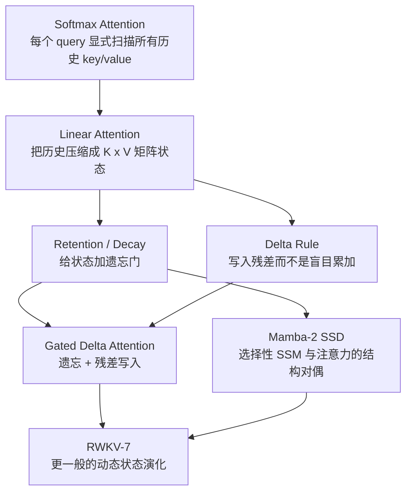

| 方法 | 状态 | 写入方式 | 遗忘 / 门控 | 读出方式 | 训练并行形态 | 增量解码 |
|---|---|---|---|---|---|---|
| Softmax Attention | 显式 KV cache | 不压缩,保留所有 token | attention mask | `softmax(qK^T)V` | 二次 attention kernel | KV cache 随 `T` 增长 |
| Linear Attention | `S_t in R^{d_k x d_v}`,可选 `z_t` | `S += k^T v` | 通常无 | `q S`,可归一化 | prefix-sum / scan / chunk | 常数状态 |
| RetNet | `S_t` | `S += k^T v` | 固定或多尺度 `gamma` | `q S` | parallel retention / recurrent / chunkwise | 常数状态 |
| DeltaNet | `S_t` fast weights | `S += beta k^T(v - kS)` | 通常无或弱 | `q S` | chunkwise triangular solve | 常数状态 |
| Gated DeltaNet | `S_t` fast weights | residual write | `alpha_t` 快速擦除 | `q S` | chunkwise solve + scan | 常数状态 |
| Mamba-2 | SSM state,常可写成矩阵状态 | `B_t x_t^T` | `A_t` 选择性衰减 | `C_t^T h_t` | SSD block decomposition | 常数状态 |
| RWKV-7 | head 内矩阵状态 | `k_t^T v_t` 及广义 delta 项 | 动态矩阵演化 | `r_t S_t` | WKV7 kernel / chunk scan | 常数状态 |

一句话区分:

- **Softmax attention**:每一步重新查一遍历史.
- **Linear attention**:把历史压进一个固定大小的矩阵.
- **Retention / Mamba-2**:在固定矩阵状态上加入可学习 / 输入相关的衰减.
- **Delta / Gated Delta / RWKV-7**:把状态看成一个会在线学习的 fast-weight memory,不只是累加历史,而是在上下文里"修正内部模型".

### 1. 统一符号:把注意力看成"读写一个矩阵记忆"

为了避免不同论文的行列约定互相干扰,本文统一使用下面的布局.只看单 batch,单 head:

| 符号 | 形状 | 含义 |
|---|---:|---|
| `T` | 标量 | 序列长度 |
| `q_t` | `[d_k]` | 第 `t` 个 token 的 query / read key |
| `k_t` | `[d_k]` | 第 `t` 个 token 的 write key |
| `v_t` | `[d_v]` | 第 `t` 个 token 的 value |
| `S_t` | `[d_k, d_v]` | 截止 `t` 的矩阵记忆 / fast weights |
| `o_t` | `[d_v]` | 输出 |

本文默认把向量当作行向量写,所以:

```math
o_t = q_t S_t
```

外积写入:

```math
k_t^\top v_t \in R^{d_k \times d_v}
```

许多论文会采用转置布局.例如 Gated DeltaNet 和 RWKV-7 论文里常写 `S_t in R^{d_v x d_k}`,写入 `v_t^\top k_t`,读出再转置.本文为了和 本文的`Gated Delta Rule Chunk 算子教程` 的 `S: K x V` 约定一致,会把这些公式转置到 `S_t in R^{d_k x d_v}` 后再比较.

图上看是这样:

```text
                 write
          k_t^T -------- v_t
             \            |
              \           v
               +----> S_t: d_k x d_v
                       |
                       | read by q_t
                       v
                     o_t
```

这个视角非常重要:很多"线性注意力""SSM""RWKV"论文表面公式差异很大,但核心都可以理解成:

```math
S_t = \text{evolve}(S_{t-1}, x_t)
```

```math
o_t = \text{read}(S_t, x_t)
```

复杂度线性的关键是:`S_t` 的大小只依赖 `d_k, d_v, d_state`,不随 `T` 增长.

### 2. Softmax Attention 为什么是二次复杂度

标准 causal self-attention:

```math
o_t =
\sum_{i \le t}
\frac{\exp(q_t k_i^\top)}
{\sum_{j \le t}\exp(q_t k_j^\top)}
v_i
```

矩阵形式:

```math
O = \operatorname{softmax}(QK^\top + M)V
```

其中 `QK^T` 是 `T x T` 矩阵,`M` 是 causal mask.

```text
T tokens query
     |
     v
┌─────────────────────┐
│ QK^T attention map  │  shape: T x T
│ *                   │
│ * *                 │
│ * * *               │
│ * * * *             │
└─────────────────────┘
     |
     v
weighted sum over V
```

即使使用 FlashAttention,语义上仍要处理每个 query 与每个历史 key 的匹配,只是通过 tiling 和重计算降低 HBM IO.因此它对序列长度的计算量仍是 `O(T^2 d_k)`.

线性复杂度方法要解决的问题是:不要显式构造 `T x T` score 矩阵.

### 3. 朴素 Linear Attention:把历史先求和

#### 3.1 从 kernel trick 推导

softmax attention 的麻烦在于:

```math
\exp(q_t k_i^\top)
```

依赖 `q_t` 和每一个历史 `k_i` 的两两交互.Linear Attention 用特征映射近似或替代这个核:

```math
\exp(q_t k_i^\top)
\approx
\phi(q_t)\phi(k_i)^\top
```

代入 attention:

```math
o_t =
\frac{
\sum_{i \le t} \phi(q_t)\phi(k_i)^\top v_i
}{
\sum_{i \le t} \phi(q_t)\phi(k_i)^\top
}
```

把与 `i` 有关的部分提前聚合:

```math
S_t = \sum_{i \le t}\phi(k_i)^\top v_i
```

```math
z_t = \sum_{i \le t}\phi(k_i)
```

则:

```math
o_t =
\frac{\phi(q_t)S_t}
{\phi(q_t)z_t^\top + \epsilon}
```

递推形式:

```math
S_t = S_{t-1} + \phi(k_t)^\top v_t
```

```math
z_t = z_{t-1} + \phi(k_t)
```

#### 3.2 为什么复杂度线性

每个 token 只做两件事:

1. 用 `k_t, v_t` 更新固定大小的 `S_t`.
2. 用 `q_t` 读取固定大小的 `S_t`.

```text
token 1 --> update S --> read
token 2 --> update S --> read
token 3 --> update S --> read
...
token T --> update S --> read
```

如果 `d_k, d_v` 固定,则序列长度复杂度是:

```math
O(T d_k d_v)
```

#### 3.3 朴素实现

```python
import torch

def causal_linear_attention(q: torch.Tensor, k: torch.Tensor, v: torch.Tensor) -> torch.Tensor:
    """q/k: [T, d_k], v: [T, d_v]."""
    state = torch.zeros(k.shape[-1], v.shape[-1], device=v.device, dtype=v.dtype)
    norm = torch.zeros(k.shape[-1], device=v.device, dtype=v.dtype)
    outs = []

    for t in range(q.shape[0]):
        kt = torch.relu(k[t]) + 1.0
        qt = torch.relu(q[t]) + 1.0
        state = state + torch.outer(kt, v[t])
        norm = norm + kt
        denom = torch.dot(qt, norm).clamp_min(1e-6)
        outs.append(qt @ state / denom)

    return torch.stack(outs, dim=0)
```

朴素 Linear Attention 的短板也很清楚:`S_t` 是一路累加,缺少"删除错误记忆"的机制.长上下文里,状态容易被旧信息污染.

### 4. 加遗忘:Retention / Decay 是最直接的门控

#### 4.1 固定衰减的递推

给线性 attention 的状态加一个衰减系数 `0 < gamma <= 1`:

```math
S_t = \gamma S_{t-1} + k_t^\top v_t
```

读出:

```math
o_t = q_t S_t
```

展开递推:

```math
S_t =
\sum_{i \le t}
\gamma^{t-i} k_i^\top v_i
```

因此:

```math
o_t =
\sum_{i \le t}
\gamma^{t-i}
(q_t k_i^\top)v_i
```

这就是一个带指数衰减位置 bias 的线性 attention.

```text
past token i:  t-5   t-4   t-3   t-2   t-1   t
decay weight:  g^5   g^4   g^3   g^2   g^1   1
```

RetNet 的 retention 机制可以用 parallel,recurrent,chunkwise recurrent 三种等价形态计算,核心也是把:

```math
(QK^\top) \odot D
```

里的衰减矩阵 `D` 改写成递推状态.

#### 4.2 从固定衰减到输入相关 gate

固定 `gamma` 的表达力有限.更一般地,每个 token 产生自己的衰减:

```math
S_t = \alpha_t S_{t-1} + k_t^\top v_t
```

其中 `alpha_t` 可以是:

- 标量:整个 head 同步遗忘.
- 向量:不同 state channel 有不同遗忘速度.
- 矩阵或低秩矩阵:状态按输入动态旋转,擦除,增强.

展开:

```math
S_t =
\sum_{i \le t}
\left(\prod_{j=i+1}^{t}\alpha_j\right)
k_i^\top v_i
```

这里的累积乘积就是很多 gated recurrent / SSM 算子里反复出现 `cumsum(log gate)` 和 `exp(g_i - g_j)` 的原因.数值上通常在 log 空间里累计:

```math
g_t = \log \alpha_t
```

```math
\prod_{j=i+1}^{t}\alpha_j
=
\exp\left(\sum_{j=i+1}^{t}g_j\right)
```

### 5. Delta Rule:把"写入"变成在线修正

#### 5.1 朴素累加的问题

朴素线性 attention 写入:

```math
S_t = S_{t-1} + k_t^\top v_t
```

无论状态里是否已经能读出 `v_t`,都会继续写入一次.这会导致两个问题:

- 相同或相近 key 的 value 多次叠加.
- 如果旧 value 是错的,只靠累加很难"替换"它.

Delta Rule 的想法是:先看当前状态对 `k_t` 已经记住了什么,再只写入残差.

#### 5.2 从最小二乘目标推导

把 `S` 看成一个线性模型:

```math
\hat v_t = k_t S
```

希望当前 key 能读出目标 value:

```math
\mathcal L_t(S)
=
\frac{1}{2}\lVert v_t - k_t S\rVert_2^2
```

对 `S` 求梯度:

```math
\nabla_S \mathcal L_t
=
k_t^\top(k_t S - v_t)
```

做一步梯度下降:

```math
S_t =
S_{t-1}
-
\beta_t
k_t^\top(k_t S_{t-1} - v_t)
```

整理:

```math
S_t =
S_{t-1}
+
\beta_t k_t^\top(v_t - k_t S_{t-1})
```

令:

```math
\hat v_t = k_t S_{t-1}
```

得到 Delta Rule:

```math
S_t =
S_{t-1}
+
\beta_t k_t^\top(v_t - \hat v_t)
```

#### 5.3 直觉

```text
current key k_t
      |
      v
 read old memory: v_hat = k_t S_{t-1}
      |
      v
 residual: e_t = v_t - v_hat
      |
      v
 write correction: S_t = S_{t-1} + beta k_t^T e_t
```

这和 fast-weight programmer 的视角一致:`S_t` 不是普通 hidden state,而是一组上下文内快速变化的权重.

#### 5.4 朴素实现

```python
import torch

def delta_rule(q: torch.Tensor, k: torch.Tensor, v: torch.Tensor, beta: torch.Tensor) -> torch.Tensor:
    """q/k: [T, d_k], v: [T, d_v], beta: [T] or [T, 1]."""
    state = torch.zeros(k.shape[-1], v.shape[-1], device=v.device, dtype=v.dtype)
    outs = []

    for t in range(q.shape[0]):
        pred = k[t] @ state
        err = v[t] - pred
        state = state + beta[t] * torch.outer(k[t], err)
        outs.append(q[t] @ state)

    return torch.stack(outs, dim=0)
```

Delta Rule 比朴素累加更会"修正记忆",但仍缺少快速整体遗忘.遇到需要重置上下文,切换话题,丢弃旧事实的场景,仅靠 residual write 不够.

### 6. Gated Delta Attention / Gated DeltaNet:遗忘 + 残差写入

Gated Delta Rule 把前两条路线合并:

- gate / decay 负责快速擦除历史状态;
- delta update 负责针对当前 key 精准修正.

#### 6.1 递推公式

先对旧状态做遗忘:

```math
\tilde S_t = \alpha_t S_{t-1}
```

再用 delta residual 写入:

```math
\hat v_t = k_t \tilde S_t
```

```math
S_t =
\tilde S_t
+
\beta_t k_t^\top(v_t - \hat v_t)
```

最后读出:

```math
o_t = q_t S_t
```

合在一起:

```math
S_t =
\alpha_t S_{t-1}
+
\beta_t k_t^\top
\left(v_t - k_t\alpha_t S_{t-1}\right)
```

有些文档会把 residual 里的旧状态写成 `S_{t-1}`,有些实现会先 decay 再 read.二者的符号差异可以通过把 `S_{t-1}` 替换为 `\tilde S_t` 对齐.本文采用"先 decay,再读 residual"的写法,因为它和常见 Gated DeltaNet / Qwen3-Next 风格代码更接近.

#### 6.2 和 Mamba-2 的关系

Mamba-2 的 selective SSM 有很强的 gate / decay 能力,但写入本质更接近:

```math
h_t = A_t h_{t-1} + B_t x_t^\top
```

Gated DeltaNet 的观察是:gate 和 delta rule 是互补的.

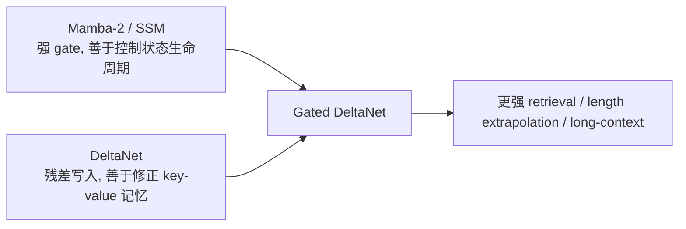

#### 6.3 为什么 chunk 内需要 triangular solve

逐 token 递推时,第 `t` 个 token 的 residual:

```math
v_t - k_t \tilde S_t
```

依赖前面 token 已经写进同一个 chunk 的内容.因此训练时不能简单把所有 token 的写入互相独立地并行.

对一个 chunk 内的 `C` 个 token,可以把这些相互依赖写成下三角系统:

```math
(I + L)X = Y
```

其中 `L` 来自:

```math
\beta_i \langle k_i, k_j\rangle
\exp(\gamma_i - \gamma_j),
\quad i > j
```

`I + L` 是单位下三角矩阵,所以可以用 triangular solve 或专门 kernel 高效求解.

```text
chunk size C = 64

token dependency inside chunk:

0  .  .  .  .
1  1  .  .  .
2  2  2  .  .
3  3  3  3  .
4  4  4  4  4

strictly lower triangular dependency
```

这就是为什么 Gated Delta Rule 的高性能实现通常是:

```text
chunk-local gate cumsum
       |
       v
KKT / triangular solve
       |
       v
chunk state scan + output
```

#### 6.4 朴素实现

```python
import torch

def gated_delta_rule(
    q: torch.Tensor,
    k: torch.Tensor,
    v: torch.Tensor,
    alpha: torch.Tensor,
    beta: torch.Tensor,
) -> torch.Tensor:
    """q/k: [T, d_k], v: [T, d_v], alpha/beta: [T] or broadcastable."""
    state = torch.zeros(k.shape[-1], v.shape[-1], device=v.device, dtype=v.dtype)
    outs = []

    for t in range(q.shape[0]):
        state = alpha[t] * state
        pred = k[t] @ state
        err = v[t] - pred
        state = state + beta[t] * torch.outer(k[t], err)
        outs.append(q[t] @ state)

    return torch.stack(outs, dim=0)
```

注意:这段代码适合理解语义,不适合训练大模型.真实训练会用 chunkwise parallel kernel,否则 token 级 Python loop 会非常慢.

### 7. Mamba-2:SSM 与 Attention 的结构对偶

Mamba-2 的核心不是直接说"我是 attention",而是从 selective state space model 出发,再通过 Structured State Space Duality 说明它和一类结构化 attention 矩阵是等价的.

#### 7.1 最小 SSM 递推

一个简化的 selective SSM 可以写成:

```math
h_t = A_t h_{t-1} + B_t x_t^\top
```

```math
y_t = C_t^\top h_t
```

其中:

- `x_t` 是输入 value-like 向量,形状 `[d_v]`.
- `B_t, C_t` 是输入相关的 state mixing 向量,形状 `[d_state]`.
- `A_t` 是输入相关的衰减,Mamba-2 的 SSD minimal form 常把它约束成 head 内 scalar times identity,便于高效计算.
- `h_t` 可以看成 `[d_state, d_v]` 的矩阵状态.

这和前文的 `S_t` 很像,只是把 `k/q` 换成了 `B/C`:

| Linear attention 视角 | Mamba-2 SSD 视角 |
|---|---|
| write key `k_t` | input-dependent `B_t` |
| read query `q_t` | input-dependent `C_t` |
| value `v_t` | input `x_t` |
| state `S_t` | SSM state `h_t` |
| decay `alpha_t` | transition `A_t` |

#### 7.2 展开后就是带 decay mask 的 attention

展开递推:

```math
h_t =
\sum_{i \le t}
\left(\prod_{j=i+1}^{t} A_j\right)
B_i x_i^\top
```

读出:

```math
y_t =
\sum_{i \le t}
\left(C_t^\top B_i\right)
\left(\prod_{j=i+1}^{t} A_j\right)
x_i
```

这已经很像 attention:

```math
y_t =
\sum_{i \le t}
\text{score}(t,i) x_i
```

其中:

```math
\text{score}(t,i)
=
\left(C_t^\top B_i\right)
\left(\prod_{j=i+1}^{t} A_j\right)
```

也就是说,Mamba-2 的 score 不是 softmax,而是:

```text
content term: C_t^T B_i
position / recurrence term: cumulative product of A_j
```

#### 7.3 SSD 为什么适合 GPU

如果逐 token 算 SSM:

```text
h_0 -> h_1 -> h_2 -> ... -> h_T
```

推理很自然,但训练串行依赖太强.SSD 把长序列切成块:

```text
chunk 0       chunk 1       chunk 2
0..C-1   |   C..2C-1   |   ...
```

每个 chunk 内做结构化矩阵计算,chunk 间做 scan:

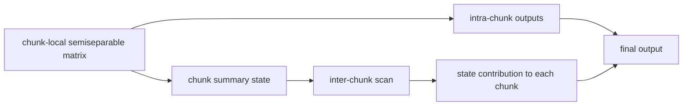

这和 Gated Delta Rule 的 chunkwise 形态很像,但具体矩阵不同:

- Mamba-2 的 chunk 矩阵来自 `A/B/C` 的 semiseparable structure.
- Gated Delta 的 chunk 矩阵来自 delta residual 的下三角 KKT solve.

#### 7.4 朴素实现

```python
import torch

def mamba2_minimal_ssd(
    x: torch.Tensor,
    A: torch.Tensor,
    B: torch.Tensor,
    C: torch.Tensor,
) -> torch.Tensor:
    """x: [T, d_v], A: [T], B/C: [T, d_state]."""
    state = torch.zeros(B.shape[-1], x.shape[-1], device=x.device, dtype=x.dtype)
    outs = []

    for t in range(x.shape[0]):
        state = A[t] * state + torch.outer(B[t], x[t])
        outs.append(C[t] @ state)

    return torch.stack(outs, dim=0)
```

真实 Mamba-2 block 还包含输入投影,depthwise causal conv,gated RMSNorm,D skip,head/group 组织,Triton fused scan 等工程结构.上面只是 SSD 核心递推.

### 8. RWKV-7:广义 Delta Rule 与动态状态演化

RWKV 系列一直强调:

- 训练时可以并行化,像 Transformer 一样喂整段序列.
- 推理时是 RNN,状态大小固定,不需要随上下文增长的 KV cache.

RWKV-7 的关键变化是把状态更新从简单 decay 推到更一般的 **Dynamic State Evolution**.

#### 8.1 从 RWKV 旧版本到 v7

粗略看:

| 版本 | 状态演化直觉 |
|---|---|
| RWKV-4 / 5 | 固定或较静态的 time decay,类似多尺度 EMA |
| RWKV-6 | 输入相关 dynamic decay |
| RWKV-7 | 动态状态演化矩阵,能表达更一般的在线状态变换 |

RWKV-7 不只是:

```math
S_t = \alpha_t S_{t-1} + k_t^\top v_t
```

论文原文为了匹配官方代码,把每个 head 的 WKV 状态写成 `M_t in R^{d_v x d_k}`,所有向量都是行向量,旧状态右乘一个由输入生成的矩阵:

```math
M_t =
M_{t-1}
\left(
\operatorname{diag}(w_t) + z_t^\top b_t
\right)
+
v_t^\top \tilde k_t
```

RWKV-7 的具体参数化是:

```math
z_t = -\hat\kappa_t,\quad
b_t = a_t \odot \hat\kappa_t
```

所以:

```math
M_t =
M_{t-1}
\left(
\operatorname{diag}(w_t)
-
\hat\kappa_t^\top(a_t \odot \hat\kappa_t)
\right)
+
v_t^\top \tilde k_t
```

读出使用 receptance / read vector:

```math
p_t = r_t M_t^\top
```

把它转成本文统一的 `S_t = M_t^\top in R^{d_k x d_v}` 布局后,就是左乘动态 transition:

```math
S_t =
G_t^\top S_{t-1}
+
\tilde k_t^\top v_t
```

其中:

```math
G_t =
\left(
\operatorname{diag}(w_t)
-
\hat\kappa_t^\top(a_t \odot \hat\kappa_t)
\right)
```

读出回到:

```math
o_t = r_t S_t
```

#### 8.2 它和 Delta Rule 的关系

回忆 Delta Rule:

```math
S_t =
S_{t-1}
+
\beta_t k_t^\top(v_t - k_t S_{t-1})
```

展开:

```math
S_t =
S_{t-1}
-
\beta_t k_t^\top k_t S_{t-1}
+
\beta_t k_t^\top v_t
```

如果把矩阵方向换到 RWKV-7 常用写法,可以得到类似:

```math
M_t =
M_{t-1}
\left(
I - k_t^\top k_t \operatorname{diag}(\eta_t)
\right)
+
v_t^\top k_t\operatorname{diag}(\eta_t)
```

RWKV-7 论文先给出更一般的广义状态演化:

```math
M_t =
M_{t-1}
\left(
\operatorname{diag}(w_t) + z_t^\top b_t
\right)
+
v_t^\top \tilde k_t
```

可以看成把下面两件事参数化得更灵活:

1. 旧状态怎么被保留,衰减,旋转或擦除.
2. 新 token 如何写入 state.

```mermaid
flowchart LR
    A[Delta Rule<br/>rank-1 correction from k and error] --> C[RWKV-7 generalized delta rule]
    B[Dynamic decay<br/>input-dependent state transition] --> C
    C --> D[Dynamic State Evolution<br/>diag(w) + low-rank update]
```

#### 8.3 为什么说它更像"上下文内学习"

把 `S_t` 理解成一个线性模型,目标是让某个 key 能映射到某个 value:

```math
v \approx k S^\top
```

Delta Rule 是对这个模型做一步梯度下降.RWKV-7 则让这一步"梯度下降 / 状态演化"的形式由输入动态决定:

```text
token x_t
  |
  +--> r_t: read current state
  +--> k_t: where to write / train
  +--> v_t: what to write / target
  +--> w_t: per-channel decay
  +--> a_t, b_t: low-rank state evolution
  +--> g_t: output gate
```

因此 RWKV-7 的状态不只是压缩历史,而是在上下文中持续更新一个内部模型.这也是它和普通 linear attention 的关键区别.

#### 8.4 朴素实现

下面是采用本文统一布局的示意代码:

```python
import torch

def rwkv7_state_update(
    r: torch.Tensor,
    k: torch.Tensor,
    v: torch.Tensor,
    w: torch.Tensor,
    kappa: torch.Tensor,
    lr: torch.Tensor,
) -> torch.Tensor:
    """All tensors are [T, d]. State uses this document's [key, value] layout."""
    state = torch.zeros(k.shape[-1], v.shape[-1], device=v.device, dtype=v.dtype)
    outs = []

    for t in range(k.shape[0]):
        kappa_hat = kappa[t] / kappa[t].norm().clamp_min(1e-6)
        transition_right = torch.diag(w[t]) - torch.outer(kappa_hat, lr[t] * kappa_hat)
        state = transition_right.T @ state + torch.outer(k[t], v[t])
        outs.append(r[t] @ state)

    return torch.stack(outs, dim=0)
```

如果改用 RWKV 论文 / 官方 kernel 常见的 `M_t = M_{t-1}G_t + v_t^T k_t` 布局,代码中的状态应是 `[value, key]`,读出也要写成 `r_t @ M_t.T`.阅读论文和 CUDA kernel 时,第一步先确认 `state` 维度是 `[key, value]` 还是 `[value, key]`.

### 9. 五类方法放在同一条公式线上

我们用一个通用模板:

```math
S_t =
F_t(S_{t-1}) + W_t
```

```math
o_t = R_t(S_t)
```

不同方法的差别:

| 方法 | `F_t(S)`:旧状态如何演化 | `W_t`:新信息如何写入 | `R_t(S)`:如何读 |
|---|---|---|---|
| Linear Attention | `S` | `k_t^T v_t` | `q_t S` |
| RetNet | `gamma S` | `k_t^T v_t` | `q_t S` |
| Gated Linear Attention | `alpha_t S` | `k_t^T v_t` | `q_t S` |
| DeltaNet | `S - beta k_t^T k_t S` | `beta k_t^T v_t` | `q_t S` |
| Gated DeltaNet | `(I - beta k_t^T k_t) alpha_t S` | `beta k_t^T v_t` | `q_t S` |
| Mamba-2 | `A_t h` | `B_t x_t^T` | `C_t^T h` |
| RWKV-7 | `G_t^T S`,其中 `G_t = diag(w_t) - kappa_t^T(a_t odot kappa_t)` | `tilde k_t^T v_t` | `r_t S` |

再看复杂度:

| 方法 | 训练复杂度随 `T` | 推理每 token | 推理状态大小 | 是否需要 KV cache |
|---|---:|---:|---:|---|
| Softmax Attention | `O(T^2 d)` | `O(Td)` | `O(Td)` | 是 |
| FlashAttention | `O(T^2 d)`,IO 更优 | `O(Td)` | `O(Td)` | 是 |
| Linear Attention | `O(T d_k d_v)` | `O(d_k d_v)` | `O(d_k d_v)` | 否 |
| RetNet | `O(T d_k d_v)` | `O(d_k d_v)` | `O(d_k d_v)` | 否 |
| Delta / Gated Delta | `O(T d_k d_v)` 语义;训练常用 chunk solve | `O(d_k d_v)` | `O(d_k d_v)` | 否 |
| Mamba-2 | `O(T d_state d_v)` 语义;SSD 高效 chunk | `O(d_state d_v)` | `O(d_state d_v)` | 否 |
| RWKV-7 | `O(T d_h^2)` per head 语义;WKV kernel | `O(d_h^2)` | `O(d_h^2)` per head | 否 |

注意:`O(T)` 只表示"随序列长度线性",不表示一定比 attention 快.实际速度还取决于:

- `d_k d_v` 或 `d_state d_v` 是否大.
- 是否有 fused kernel.
- chunk size 是否适合 GPU.
- 训练 batch 和 head 数能否填满 SM.
- 是否需要额外 normalization,conv,gate,projection.

### 10. 并行训练和增量解码的统一理解

线性复杂度模型通常有两种计算形态:

#### 10.1 Recurrent form

适合推理:

```text
state <- update(state, x_t)
o_t   <- read(state, x_t)
```

优点:

- KV cache 不随上下文增长.
- 单 token 解码状态固定.

缺点:

- 训练时逐 token 递推会串行.

#### 10.2 Parallel / chunkwise form

适合训练:

```text
sequence -> chunks -> chunk-local solve/scan -> chunk summaries -> inter-chunk scan
```

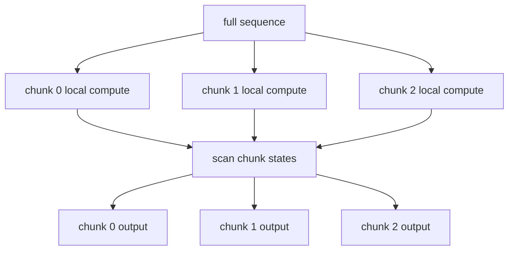

不同模型的 chunk-local compute 不一样:

| 模型 | chunk 内主要计算 |
|---|---|
| RetNet | decay mask 下的 `QK^T V` 或 recurrent chunk |
| Mamba-2 | semiseparable matrix / SSD block decomposition |
| Gated Delta | KKT-like lower triangular solve |
| RWKV-7 | WKV state evolution kernel |

### 11. 怎么从代码识别它属于哪一类

看一个新的"线性 attention"实现时,先找三件事:

#### 11.1 找 state 的形状

如果看到:

```python
state = torch.zeros(num_heads, d_k, d_v)
```

通常是 linear attention / delta / RWKV-like matrix state.

如果看到:

```python
state = torch.zeros(num_heads, d_state, headdim)
```

可能是 Mamba-2 / SSD-like state.

#### 11.2 找状态更新

直接累加:

```python
state = state + outer(k, v)
```

是朴素 linear attention.

先 decay:

```python
state = alpha * state + outer(k, v)
```

是 retention / gated linear attention.

先读残差再写:

```python
pred = k @ state
state = state + beta * outer(k, v - pred)
```

是 Delta Rule.

先 decay 再 delta:

```python
state = alpha * state
pred = k @ state
state = state + beta * outer(k, v - pred)
```

是 Gated Delta.

论文 / kernel 采用 `[value, key]` 布局并右乘动态 transition:

```python
wkv = wkv @ transition + outer(v, k)
```

通常是 RWKV-7 dynamic state evolution 一类.如果代码采用本文的 `[key, value]` 布局,同一件事会写成:

```python
state = transition.T @ state + outer(k, v)
```

#### 11.3 找训练 kernel

如果有:

- `chunk_scan`
- `ssd_combined`
- `selective_scan`
- `kkt_solve`
- `chunk_gated_delta_rule`
- `wkv7`

基本可以确定它不是简单 Python recurrence,而是在用专门的 chunk / scan kernel 把训练并行化.

### 12. 学习路线建议

推荐按这个顺序读:

1. **朴素 Linear Attention**  
   先理解 `S_t = S_{t-1} + k_t^T v_t` 和归一化项 `z_t`.

2. **RetNet / Decay**  
   理解 `gamma^{t-i}` 如何从 parallel mask 变成 recurrent state.

3. **Delta Rule**  
   从 `L = 1/2 ||v - kS||^2` 推导在线梯度下降.

4. **Gated DeltaNet**  
   把 gate 和 delta 合并,再理解为什么 chunk 内是 triangular solve.

5. **Mamba-2 SSD**  
   用 `h_t = A_t h_{t-1} + B_t x_t^T` 展开成 attention-like sum,理解 semiseparable matrix.

6. **RWKV-7**  
   从 Delta Rule 的梯度下降视角过渡到 `diag(w)+a^T b` 的动态状态演化.

7. **Kernel 实现**  
   回到 本文的`Gated Delta Rule Chunk 算子教程`,看 Gated Delta Rule 的实际 chunk 算子如何落到 KKT solve 和 fused kernel.

### 13. 常见误区

#### 13.1 "线性复杂度"不等于"无限记忆"

状态大小固定意味着模型必须把历史压缩进有限容量.它可以处理非常长的上下文流,但不保证每个历史细节都可无损找回.

Softmax attention 的 KV cache 大,但它保留了每个历史 token 的 key/value.Linear state 小,但它会发生压缩和覆盖.

#### 13.2 "不需要 KV cache"不等于"没有状态"

Mamba / RWKV / Gated Delta 解码时仍然需要 state,只是 state 大小固定,不随 `T` 线性增长.

#### 13.3 Mamba-2 不是普通 attention 换核

Mamba-2 从 SSM 出发,SSD 说明它和某类 attention-like structured matrix 有对偶关系.它不是简单把 softmax 换成 `relu` 或 `elu+1`.

#### 13.4 RWKV-7 的矩阵方向要特别小心

RWKV 资料里经常把 state 写成 `[value, key]`,而很多 linear attention 文档写成 `[key, value]`.比较公式前先统一布局,否则 `k^T v`,`v^T k`,左乘,右乘会看起来互相矛盾.

### 14. 资料索引

- Gated Delta Networks: Improving Mamba2 with Delta Rule, arXiv 2412.06464: <https://arxiv.org/abs/2412.06464>
- GatedDeltaNet 官方实现: <https://github.com/NVlabs/GatedDeltaNet>
- Transformers are SSMs: Generalized Models and Efficient Algorithms Through Structured State Space Duality, arXiv 2405.21060: <https://arxiv.org/abs/2405.21060>
- Mamba 官方实现,`mamba_ssm/modules/mamba2.py`: <https://github.com/state-spaces/mamba/blob/main/mamba_ssm/modules/mamba2.py>
- RWKV-7 "Goose" with Expressive Dynamic State Evolution, arXiv 2503.14456: <https://arxiv.org/abs/2503.14456>
- RWKV-LM 官方仓库: <https://github.com/BlinkDL/RWKV-LM>
- RWKV 架构历史说明: <https://wiki.rwkv.com/advance/architecture.html>
- Retentive Network: A Successor to Transformer for Large Language Models, arXiv 2307.08621: <https://arxiv.org/abs/2307.08621>
- Linear Transformers Are Secretly Fast Weight Memory Systems, ICML 2021: <https://proceedings.mlr.press/v139/schlag21a.html>
- Transformers are RNNs: Fast Autoregressive Transformers with Linear Attention, ICML 2020: <https://proceedings.mlr.press/v119/katharopoulos20a.html>

## Gated Delta Rule Chunk 算子教程

本文面向想读懂 `flash_qla.ops.gated_delta_rule.chunk` 的同学:先从算子语义和公式讲起,再对比标准注意力,普通线性注意力,DeltaNet/Mamba2,最后解释 FLA 和 FlashQLA 分别做了哪些优化.

阅读代码时建议按这个顺序:

- Python 入口:[flash_qla/ops/gated_delta_rule/chunk/__init__.py](../flash_qla/ops/gated_delta_rule/chunk/__init__.py)
- 纯 PyTorch reference:[tests/ref_gdr.py](../tests/ref_gdr.py)
- FlashQLA Hopper kernels:[flash_qla/ops/gated_delta_rule/chunk/hopper](../flash_qla/ops/gated_delta_rule/chunk/hopper)
- FLA 对比入口:`fla.ops.gated_delta_rule.chunk`

### 1. 这个算子在做什么

Gated Delta Rule 是一种线性注意力 / 线性 RNN 算子.它也叫 `q/k/v`,但它不是 softmax attention.它维护一个随时间更新的矩阵状态 `S_t`,每个 token 用 `k_t` 写入状态,用 `q_t` 读取状态.

输入形状:

| 张量 | 形状 | 含义 |
|---|---:|---|
| `q` | `[B, T, Hk, K]` | query,用来读状态 |
| `k` | `[B, T, Hk, K]` | key,用来定位写入/读取 |
| `v` | `[B, T, Hv, V]` | value,写入内容 |
| `g` | `[B, T, Hv]` | gate 的 log 空间参数,控制遗忘 |
| `beta` | `[B, T, Hv]` | delta update 的步长/写入强度 |
| `initial_state` | `[B, Hv, K, V]` | 可选初始状态 |

输出:

| 张量 | 形状 | 含义 |
|---|---:|---|
| `o` | `[B, T, Hv, V]` | 每个 token 的输出 |
| `final_state` | `[B, Hv, K, V]` | 可选最终状态,可用于续接推理 |

本仓库只支持 Hopper/SM90,默认固定:

```text
chunk_size = 64
K = V = 128
q/k/v dtype != float32
head_first = False
```

### 2. 从注意力到 Gated Delta Rule

#### 2.1 标准 softmax attention

标准自注意力是:

```math
o_t = \sum_{i \le t}
\operatorname{softmax}_i(q_t k_i^\top) v_i
```

它的优势是内容寻址能力强;劣势是训练和 prefill 需要显式处理 `T x T` 的注意力矩阵,即使 FlashAttention 降低了 HBM 读写,语义上仍是二次复杂度.

#### 2.2 普通线性注意力

线性注意力把历史压进一个状态矩阵:

```math
S_t = S_{t-1} + k_t^\top v_t
```

读出:

```math
o_t = q_t S_t
```

这样复杂度从 `O(T^2)` 变成 `O(T K V)`,但状态是固定容量的.简单累加容易污染记忆:旧信息难以删除,写入也不够精确.

#### 2.3 Delta Rule

Delta Rule 的核心是"先读旧值,再写误差".令:

```math
\hat{v}_t = k_t S_{t-1}
```

更新:

```math
S_t = S_{t-1}
  + \beta_t k_t^\top (v_t - \hat{v}_t)
```

直觉:

- 如果当前 key 已经能从状态里读出接近 `v_t` 的内容,则写入很小.
- 如果读出的旧内容错了,就写入残差 `v_t - \hat{v}_t`.
- `beta_t` 控制这次修正的强度.

这可以看成对一个 fast-weight memory 做在线梯度下降.

#### 2.4 Gated Delta Rule

Gated Delta Rule 在 Delta Rule 外加了遗忘门:

```math
S_t = \alpha_t S_{t-1}
  + \beta_t k_t^\top (v_t - k_t S_{t-1})
```

其中 `0 < alpha_t <= 1`.本实现把 gate 放在 log 空间里处理:原始 `g_t` 先做 chunk 内前缀和,随后用:

```math
\gamma_t = \sum_{\tau \le t} g_\tau
```

任意两个 token 间的累积衰减可写成:

```math
\prod_{\tau=j+1}^{i} \alpha_\tau
= \exp(\gamma_i - \gamma_j)
```

这就是代码里大量 `exp(g_i - g_j)` 的来源.

### 3. 它是怎么来的

Gated Delta Rule 不是凭空出现的.它可以看成几条路线的合流:

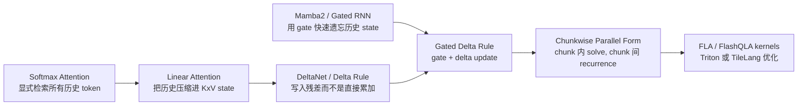

每一步解决的问题不同:

| 阶段 | 想解决的问题 | 代价或新问题 |
|---|---|---|
| Softmax attention | 每个 token 都能直接检索所有历史 | 训练/prefill 二次复杂度 |
| Linear attention | 用固定状态把复杂度降到线性 | 简单累加会污染记忆 |
| Delta Rule | 用残差写入修正已有记忆 | 仍缺少快速整体遗忘能力 |
| Gated recurrence | 通过 gate 快速遗忘旧状态 | 写入不如 delta update 精确 |
| Gated Delta Rule | 同时具备遗忘和残差修正 | 训练需要并行化递推 |
| Chunkwise parallel | 把 token 级串行改成 chunk 内矩阵解 | 需要 KKT/triangular solve kernel |

从公式上也能看到这个演化.

普通线性注意力直接累加:

```math
S_t = S_{t-1} + k_t^\top v_t
```

Delta Rule 改成写残差:

```math
S_t = S_{t-1}
  + \beta_t k_t^\top (v_t - k_t S_{t-1})
```

Gated Delta Rule 再加遗忘:

```math
S_t = \alpha_t S_{t-1}
  + \beta_t k_t^\top (v_t - k_t S_{t-1})
```

最后 chunkwise parallel training 把一个 chunk 内所有 token 的相互影响写成单位下三角线性系统:

```math
(I + L) X = Y
```

其中 `L` 来自 `beta * K K^T * decay`.因为 `I+L` 是单位下三角矩阵,解它比通用矩阵逆便宜很多,也更适合固定 `64 x 64` 的 GPU kernel.

### 4. 和别的注意力算子的区别

| 算子 | 核心状态 | 训练复杂度 | 长上下文能力 | 主要特点 |
|---|---|---:|---|---|
| Softmax Attention | 显式 `T x T` score | `O(T^2)` | 强,但代价高 | 内容寻址最直接 |
| FlashAttention | 仍是 softmax score | `O(T^2)` | 强 | 优化 IO,不改变 attention 语义 |
| 朴素线性注意力 | `S: K x V` | `O(T K V)` | 线性,但状态容量固定 | 快,但记忆控制弱 |
| Mamba2 类 gated recurrence | 状态递推 | 线性 | 强依赖 gate/SSM 设计 | 善于遗忘,写入较简单 |
| DeltaNet | fast-weight state | 线性 | 比简单线性注意力更会修正记忆 | 用 delta update 写残差 |
| Gated Delta Rule | gated fast-weight state | 线性/chunkwise | gate + delta 兼顾遗忘和修正 | 本文讨论的算子 |

一句话区别:softmax attention 是"每次重新扫描历史 token";Gated Delta Rule 是"把历史压进一个可遗忘,可修正的矩阵记忆".

### 5. Chunkwise 算法总览

如果逐 token 做 Gated Delta Rule,训练时会有很长的串行依赖.Chunkwise 算法把序列切成 `C=64` 的小块:

```text
token:   0  1  2 ... 63 | 64 65 ... 127 | ...
chunk:       chunk 0    |    chunk 1     | ...
state:  S0 -----------> S1 -----------> S2
```

chunk 内用矩阵求解并行化,chunk 间仍保留递推.

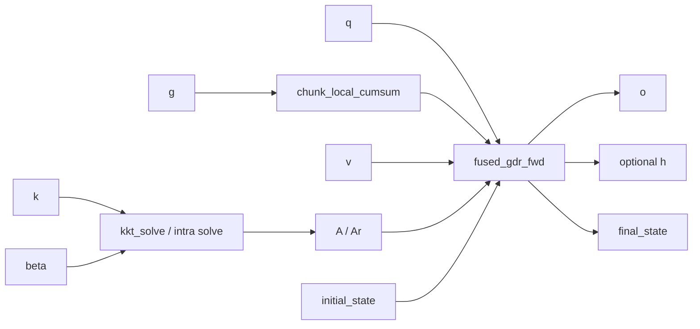

reference forward 在 [tests/ref_gdr.py](../tests/ref_gdr.py) 里被拆成 6 步:

```python
g = torch_cumsum(g)
A = torch_kkt_fwd(k, g, beta)
A = torch_solve(A)
w, u = torch_w_u_fwd(k, v, beta, A, g)
h, vn, final_state = torch_chunk_gdr_fwd(k, w, u, g, initial_state)
o = torch_chunk_o_fwd(q, k, vn, h, g, scale)
```

### 6. 公式化推导

下面只看一个 batch,一个 value head,一个 chunk.设:

```text
C = 64
Kc = [k_0, ..., k_{C-1}]^T    shape [C, K]
V  = [v_0, ..., v_{C-1}]      shape [C, V]
B  = diag(beta_0, ..., beta_{C-1})
D  = diag(exp(gamma_0), ..., exp(gamma_{C-1}))
```

其中 `gamma_i` 是 chunk 内 cumulative gate.

#### 6.1 原始 gated KKT 矩阵

reference 先构造严格下三角矩阵:

```math
L_{ij} =
\begin{cases}
\beta_i \langle k_i, k_j \rangle
  \exp(\gamma_i - \gamma_j), & i > j \\
0, & i \le j
\end{cases}
```

然后求:

```math
A = (I + L)^{-1}
```

因为 `L` 是严格下三角,`I+L` 是单位下三角矩阵.求逆不需要通用矩阵逆,只需要 triangular solve.

图上看是这样:

```text
I + L =
┌                         ┐
│ 1  0  0  0  ...         │
│ *  1  0  0  ...         │
│ *  *  1  0  ...         │
│ *  *  *  1  ...         │
│ ...                     │
└                         ┘
```

`A` 的作用是一次性解开 chunk 内"前面 token 已经写入,后面 token 再读"的串行依赖.

#### 6.2 WY 表示:把 chunk 内递推变成矩阵乘

有了 `A` 后,reference 计算:

```math
W = A (D B K_c)
```

```math
U = A (B V)
```

然后对 chunk 初始状态 `S_0` 做:

```math
V_{\text{new}} = U - W S_0
```

chunk 状态更新:

```math
S_1 =
\exp(\gamma_{C-1}) S_0
+ \sum_{i=0}^{C-1}
\exp(\gamma_{C-1} - \gamma_i)
k_i^\top V_{\text{new},i}
```

输出由两部分组成:

```math
o_i =
\operatorname{scale} \cdot
\exp(\gamma_i) q_i S_0
+
\operatorname{scale} \cdot
\sum_{j \le i}
\exp(\gamma_i - \gamma_j)
\langle q_i, k_j \rangle
V_{\text{new},j}
```

第一项读 chunk 之前的历史状态,第二项读当前 chunk 内的新写入.

### 7. FlashQLA 的关键代数改写

reference/FLA 的 `A` 可以理解为 gated solve:

```math
A = (I + \operatorname{tril}_{-}(D B K_c K_c^\top D^{-1}))^{-1}
```

FlashQLA 的 [kkt_solve.py](../flash_qla/ops/gated_delta_rule/chunk/hopper/kkt_solve.py) 没有把 `g` 传进去,它先解一个 gate-free 矩阵:

```math
A_r =
(I + \operatorname{tril}_{-}(B K_c K_c^\top))^{-1}
```

二者通过相似变换关联:

```math
I + \operatorname{tril}_{-}(D B K_c K_c^\top D^{-1})
= D (I + \operatorname{tril}_{-}(B K_c K_c^\top)) D^{-1}
```

所以:

```math
A = D A_r D^{-1}
```

这解释了为什么 `kkt_solve.py` 只需要 `k` 和 `beta`,而 `fused_fwd.py` 后面又构造:

```math
G_{ij} =
\begin{cases}
\exp(\gamma_i - \gamma_j), & i \ge j \\
0, & i < j
\end{cases}
```

并在 kernel 里做:

```math
A_g[i,j] = G_{ij} A_r[i,j] \beta_j
```

对应代码注释是:

```text
Ag = G * Ar * b
```

这个改写的收益:

- KKT solve 阶段不用读 `g`,也不用在 solve 中反复做 exponent.
- `A_r` 的求逆只面对 `beta * K K^T`,结构更规整.
- gate 的 `exp(g_i - g_j)` 延后到 fused forward/backward 中,与输出和状态更新共用.

### 8. FLA 做了什么优化

FLA 是 Flash Linear Attention 项目里的 Triton 实现.测试文件 [tests/test_gdr.py](../tests/test_gdr.py) 用 FLA 作为性能和精度对照.

根据 FLA 的 `fla.ops.gated_delta_rule.chunk` 和 `chunk_fwd.py`,它的 forward 大致是:

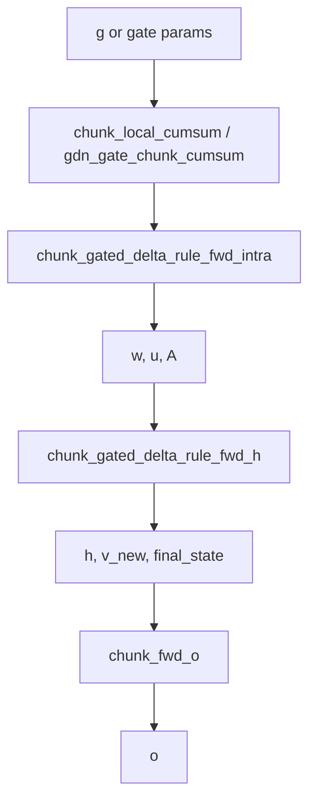

FLA 的主要优化点:

1. **chunkwise parallel training**  
   把 token 级 recurrence 改成 chunk 内并行 + chunk 间递推.

2. **WY representation**  
   用 `A/W/U` 表示 chunk 内所有 delta 更新,减少串行依赖.

3. **Triton fused intra kernel**  
   FLA 的 `chunk_gated_delta_rule_fwd_intra` 把:

   ```text
   KKT: beta * K @ K^T
   solve_tril: (I + A)^-1
   recompute_w_u
   ```

   从原来的 3 个阶段减少为 2 个 kernel launch.其源码注释明确说 fused KKT + solve 避免了中间 `A` 的 HBM round-trip.

4. **block solve**  
   FLA 把 `64 x 64` chunk 进一步按 `BC=16` 子块处理:4 个对角块 + 6 个下三角 off-diagonal block,再 block merge 得到完整逆.

5. **autotune 和 varlen 支持**  
   FLA 用 Triton autotune 选择 `BK` 和 `num_warps`,并通过 `chunk_indices / cu_seqlens` 支持变长 batch.

6. **复用 common kernels**  
   `chunk_fwd_h`,`chunk_fwd_o`,backward 的 `dhu/dqkwg/dv` 等在 FLA 的 common ops 中复用,工程上更通用.

FLA 的特点是"成熟,通用,Triton 分解清晰".FlashQLA 则针对 Qwen GDN prefill + Hopper 做更窄但更激进的融合.

### 9. FlashQLA 做了什么优化

FlashQLA 的 README 总结为三类:硬件友好的代数改写,TileLang fused warp-specialized kernels,gate-driven intra-card context parallelism.对应到代码如下.

#### 9.1 forward kernel 分解

FlashQLA forward 在 [chunk/__init__.py](../flash_qla/ops/gated_delta_rule/chunk/__init__.py):

```python
g = chunk_local_cumsum(g, chunk_size=64)
A = kkt_solve(k=k, b=beta)
o, h, final_state = fused_gdr_fwd(q, k, v, A, g, beta, ...)
```

也就是:

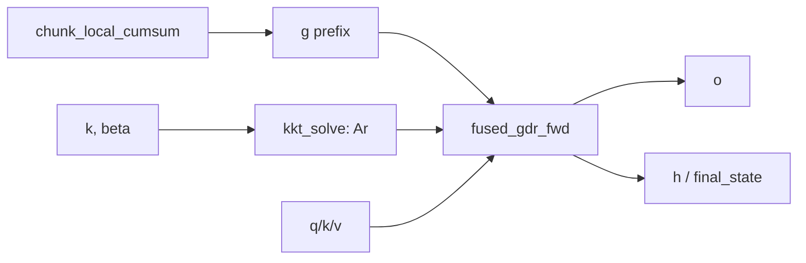

#### 9.2 `kkt_solve.py`: 固定 64x64 的专用三角逆

[kkt_solve.py](../flash_qla/ops/gated_delta_rule/chunk/hopper/kkt_solve.py) 做:

```text
A0 = K @ K^T
A0 = beta_row * A0
M  = I + StrictLower(A0)
Ar = inverse(M)
```

实现细节:

- `K == 128`,`chunk_size == 64` 固定,便于专门优化.
- 一个 CTA 处理一个 `(chunk, value_head)`.
- 用 256 threads,其中一部分加载 K,一部分做 solve,一部分写回.
- 先解 4 个 `16 x 16` 对角块,再组合成 `32 x 32`,最后组合成 `64 x 64`.
- 使用 shared memory,fragment,barrier 控制生产/消费.

它不是死代码.上层 forward 先调用它产生 `A/Ar`,再传给 `fused_gdr_fwd`.

#### 9.3 `fused_fwd.py`: 把 W/U,state update,output 融到一起

[fused_fwd.py](../flash_qla/ops/gated_delta_rule/chunk/hopper/fused_fwd.py) 做了大量融合.粗略拆成三组 consumer:

```text
consumer S: 维护 state S,做 S = decay*S + K^T @ V'
consumer V: 计算 W,Ag @ W,V'
consumer O: 计算 Q@S 和局部 QK^T @ V_new 输出
producer:   双缓冲加载 Q/K/V/A/g/b,写 O/H/final_state
```

图示:

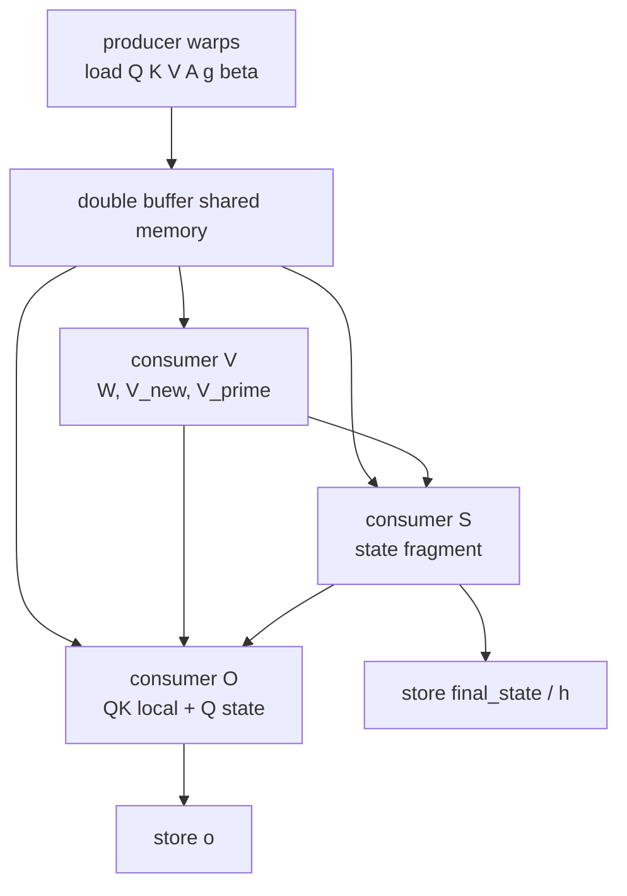

关键优化:

- **warp specialization**:不同线程组分别负责状态,value path,output path,global memory load/store.
- **double buffering**:`q_shared/k_shared/v_shared/a_shared` 都有 2 stage,数据搬运和计算重叠.
- **手动 barrier 编排**:`data_is_ready/data_is_free` 和多个 `bar_*` 控制依赖.
- **寄存器预算控制**:不同 consumer 用 `T.set_max_nreg` 分配不同 register 数.
- **Tensor Core GEMM + CUDA/SFU 标量操作重叠**:矩阵乘和 `exp`,mask,scale 交错执行.
- **动态 `block_DV`**:根据 `real_batch_size * H` 是否足够填满 SM,选择 `128/64/32`,提升小 batch,小 head 场景的占用.

#### 9.4 backward: 重算 h + fused backward

Backward 在 [chunk/__init__.py](../flash_qla/ops/gated_delta_rule/chunk/__init__.py):

```python
h = fused_gdr_h(k, v, A, g, beta, ...)
dq, dk, dv, dg, db, dh0 = fused_gdr_bwd(...)
dg = reverse_chunk_local_cumsum(dg)
```

为什么 backward 要先 `fused_gdr_h`:forward 的 high-level autograd path 没有默认保存完整 `h`,为了省显存,backward 重算 chunk states,再进入 fused backward.

backward 的 fused kernel 同样把多条梯度路径合在一起:

```text
do -> dv local
do/dh -> dq, dk, dg
dw/du -> dA, db, dv
dA -> dk, db, dg
```

最后如果 `Hk < Hv`,说明多个 value head 共享同一个 q/k head,`dq/dk` 需要做 group reduce.

#### 9.5 Gate-driven intra-card CP

[cp_context.py](../flash_qla/ops/gated_delta_rule/chunk/cp_context.py) 做自动 intra-card context parallelism.它利用 GDN gate 的指数衰减性质:

- 长序列,小 head 数时,`B * H` 不足以填满 SM.
- 把一个长序列拆成多个本地片段,可以提高 CTA 数和 SM 利用率.
- 但拆分会破坏 recurrence 的初始状态,所以需要 warmup chunks 和 `correct_initial_states` 修正.

简化图:

```text
raw sequence:
S0 --> [chunks 0..N]

auto CP split:
S0 --> segment 0 --> ht0
?  --> segment 1 --> ht1
?  --> segment 2 --> ht2

correct_initial_states 用前面 segment 的 ht 修正后续 segment 的 h0
```

CP 只在收益模型判断值得做时开启;如果 batch/head 已经足够填满 SM,就不拆.

### 10. 为什么这些优化有效

#### 10.1 算法层面

原始 recurrence:

```text
T 个 token 串行
```

chunkwise 后:

```text
chunk 内 64 token 并行矩阵化
chunk 间 T/64 次递推
```

这把长串行依赖缩短了 64 倍.

#### 10.2 内存层面

朴素分解会反复把中间结果写回 HBM:

```text
A -> W/U -> V_new -> H -> O
```

FlashQLA 尽量把中间量留在 register/shared memory:

```text
Ar in HBM
G/Ag/W/V_new/O mostly inside fused kernel
```

HBM 访问少了,延迟和带宽压力都会下降.

#### 10.3 Hopper 层面

Hopper 上想跑满,需要让:

- Tensor Core 做 GEMM;
- CUDA Core/SFU 做 scale,mask,exp;
- memory pipeline 继续搬下一块数据;
- 不同 warpgroup 不互相空等太久.

FlashQLA 的 TileLang kernel 明确按这个方向组织.

### 11. 数值和工程注意事项

1. **`g` 是 log 空间量**  
   测试里常用 `logsigmoid(randn) / 16`,所以大多为负.前缀和越小,衰减越强.

2. **`A` 的含义要分清**  
   reference/FLA 的 `A` 可以是 gated solve;FlashQLA 的 `kkt_solve` 输出更接近 `Ar`,gate 后续补回.代码变量都叫 `A/a`,但中间语义不完全一样.

3. **`beta` 控制写入强度**  
   测试中 `beta = sigmoid(randn)`,范围在 `(0,1)`.

4. **`cu_seqlens` 模式要求 flatten**  
   high-level API 要求 varlen 时 `q.shape[0] == 1`,真实 batch 由 `cu_seqlens` 表示.

5. **last chunk 需要 mask**  
   不满 64 的 chunk 要避免越界,并且 gate 的最后位置要用真实序列末尾修正.

6. **dtype**  
   high-level API 不支持 fp32 输入;累加一般用 fp32,中间/输出按 bf16/fp16.

7. **head group reduce**  
   `Hv > Hk` 时,forward 等价于 repeat q/k head;backward 需要把重复 head 的 `dq/dk` sum 回 `Hk`.

### 12. 代码地图

| 文件 | 作用 |
|---|---|
| [flash_qla/ops/gated_delta_rule/chunk/__init__.py](../flash_qla/ops/gated_delta_rule/chunk/__init__.py) | high-level API,autograd,fwd/bwd 串联 |
| [tests/ref_gdr.py](../tests/ref_gdr.py) | 最清晰的 PyTorch reference |
| [flash_qla/ops/utils/cumsum.py](../flash_qla/ops/utils/cumsum.py) | chunk 内 gate 前缀和 |
| [flash_qla/ops/gated_delta_rule/chunk/hopper/kkt_solve.py](../flash_qla/ops/gated_delta_rule/chunk/hopper/kkt_solve.py) | gate-free KKT solve / triangular inverse |
| [flash_qla/ops/gated_delta_rule/chunk/hopper/fused_fwd.py](../flash_qla/ops/gated_delta_rule/chunk/hopper/fused_fwd.py) | fused forward 主 kernel |
| [flash_qla/ops/gated_delta_rule/chunk/hopper/prepare_h.py](../flash_qla/ops/gated_delta_rule/chunk/hopper/prepare_h.py) | backward 前重算 `h` |
| [flash_qla/ops/gated_delta_rule/chunk/hopper/fused_bwd.py](../flash_qla/ops/gated_delta_rule/chunk/hopper/fused_bwd.py) | fused backward 主 kernel |
| [flash_qla/ops/gated_delta_rule/chunk/cp_context.py](../flash_qla/ops/gated_delta_rule/chunk/cp_context.py) | auto intra-card CP |
| [tests/test_gdr.py](../tests/test_gdr.py) | QLA vs FLA vs reference 精度和 profile |

### 13. 一个最小心智模型

把 Gated Delta Rule 看成下面这件事:

```text
1. 每个 token 想写入 v.
2. 先用 k 从旧 state 读出已有内容.
3. 只写入 "v - 已有内容" 这个残差.
4. beta 控制写入多少.
5. gate 控制历史 state 和 chunk 内旧 token 衰减多少.
6. 训练时把 64 个 token 的互相影响组成一个单位下三角系统,一次 solve 掉.
7. GPU 上把 solve,state update,output 尽量变成固定尺寸 GEMM 和 fused kernel.
```

### 14. 参考资料

- Gated Delta Networks: Improving Mamba2 with Delta Rule, arXiv 2412.06464: <https://arxiv.org/abs/2412.06464>
- 官方 GatedDeltaNet 实现: <https://github.com/NVlabs/GatedDeltaNet>
- Flash Linear Attention Gated Delta Rule chunk 实现: <https://github.com/fla-org/flash-linear-attention/blob/main/fla/ops/gated_delta_rule/chunk.py>
- FLA `chunk_fwd.py` fused KKT/solve 说明: <https://raw.githubusercontent.com/fla-org/flash-linear-attention/main/fla/ops/gated_delta_rule/chunk_fwd.py>
- FlashQLA README 和 benchmark: [README.md](../README.md), [benchmark/benchmark_results_H200.txt](../benchmark/benchmark_results_H200.txt)

## Mamba-3 深度解析:从 Mamba-2 到 Mamba-3 的技术跃迁

Mamba-3 是状态空间模型(SSM)系列的最新力作,由 CMU,Princeton,Together AI 和 Cartesia AI 联合提出,发表于 **ICLR 2026**(arXiv:2603.15569).本文是学习笔记型文档,目标是:

1. 讲清楚 Mamba-3 相比 Mamba-2 做了哪些根本性的改变,为什么要做这些改变
2. 逐一拆解三大核心创新(Exponential-Trapezoidal 离散化,复数值 SSM + RoPE,MIMO)的数学原理与实现技巧
3. 用统一的符号体系对比 Mamba-2 和 Mamba-3,给出直观理解

阅读本文前,建议先读完 本文的`线性复杂度注意力家族导读` 的第 1-7 节,对线性注意力家族和 Mamba-2 的 SSD 框架有基本了解.本文会直接沿用那里的符号体系.

> 本文侧重"原理与对比".如果你要看 Gated Delta Rule / FLA kernel 优化,请读 本文的`Gated Delta Rule Chunk 算子教程`.

### 0. 核心摘要与演进图谱

如果只记一张图:

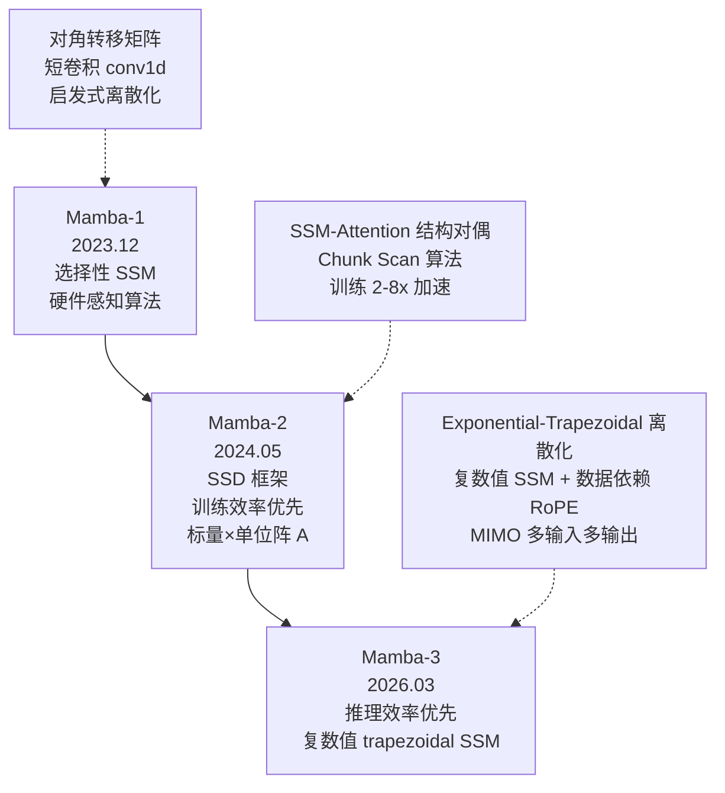

一句话概括三代 Mamba:

| 版本 | 设计哲学 | 核心贡献 | 最大局限 |
|------|---------|---------|---------|
| **Mamba-1** | SSM 首次高效化 | 选择性机制 + 硬件感知 scan | 训练慢,状态维度小 |
| **Mamba-2** | 让训练飞起来 | SSD = SSM × Attention 对偶 + Tensor Cores | 推理效率低,无法 state-tracking |
| **Mamba-3** | 推理为王 | 三大杠杆同时拉满,质量/速度 Pareto 最优 | 训练比 Mamba-2 略慢(MIMO 模式) |

Mamba-3 的**三个核心杠杆**:

| 杠杆 | 对应创新 | 解决的问题 | 一句话 |
|------|---------|-----------|--------|
| **更丰富的递推** | Exponential-Trapezoidal 离散化 | 移除了短卷积,递推本身就能混合时间信息 | "让每一步做得更多" |
| **更丰富的状态转移** | 复数值 SSM / RoPE trick | 让状态能旋转,追踪交替模式(parity) | "让状态动起来" |
| **更多并行计算** | MIMO | 利用 GPU 空闲算力,不增加延迟 | "用闲置的算力换质量" |

---

### 1. 背景回顾:从 Mamba-1 到 Mamba-2 的五分钟速览

如果你已经读过 本文的`线性复杂度注意力家族导读 §7`,本节可以跳过.这里只回顾与理解 Mamba-3 直接相关的几个关键点.

#### 1.1 统一符号:把 SSM 放入线性注意力的框架

从 本文的`线性复杂度注意力家族导读 §1` 继承的符号体系:

| SSM 符号 | 线性注意力符号 | 形状 | 含义 |
|---------|-------------|---:|---|
| `x_t` | `v_t` | `[d_v]` | 输入 / value |
| `B_t` | `k_t` | `[d_state]` | 输入投影 / write key |
| `C_t` | `q_t` | `[d_state]` | 输出投影 / read query |
| `h_t` | `S_t` | `[d_state, d_v]` | 隐状态 / 矩阵记忆 |
| `A_t`/`a_t` | `α_t` | 标量或矩阵 | 状态衰减 / gate |

Mamba-2 SSD 的核心递推:

```math
h_t = a_t h_{t-1} + B_t x_t^\top
```

```math
y_t = C_t^\top h_t
```

其中 `a_t` 是**标量**(scalar-times-identity),这一点至关重要--正是这个简化使得 SSD 的对偶性成立.

#### 1.2 Mamba-2 的 SSD 框架做了什么

SSD(Structured State Space Duality)有三个方面:

1. **SSD 模型**:上述递推定义的具体神经网络层.
2. **SSD 框架**:证明该递推等价于一族"带 decay mask 的线性注意力".
3. **SSD 算法**:Chunk Scan--块内用矩阵乘法(Tensor Cores),块间做 scan,训练比 Mamba-1 快 2-8 倍.

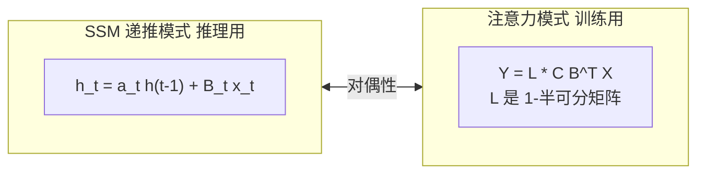

#### 1.3 Mamba-2 为训练速度付出的代价

Mamba-2 把 `A_t` 从 Mamba-1 的对角矩阵进一步简化为标量,换来了训练加速,但也埋下了三个隐患:

```text
隐患 1: 状态转移表达能力弱
  A_t 只能是沿每个通道的独立衰减,无法表达旋转,振荡等更丰富的动力学.

隐患 2: 无法解决 state-tracking 任务
  最简单的 parity(奇偶校验):给定 0/1 序列,判断和是奇数还是偶数.
  解法需要状态交替变换,但 Mamba-2 的状态只会单调衰减.

隐患 3: 解码阶段算术强度极低
  推理时 h_t 是 [d_state × d_v] 的外积更新,d_state=128, d_v=64
  算术强度 ≈ 2.5 FLOPs/byte,H100 计算上限 ≈ 300
  -> GPU 张量核心 99% 时间在等待数据传输
```

Mamba-3 就是针对这三个隐患逐一击破.

---

### 2. 为什么需要 Mamba-3:推理时代的范式转变

#### 2.1 2025->2026:LLM 格局的根本变化

Mamba-2 优化训练速度的假设在 2024 年成立--当时最大的瓶颈确实是预训练.但到 2025-2026 年:

```text
预训练 (一次性)          ->  后训练 + 推理 (反复运行的)
─────────────────────        ───────────────────────────
1 次 300B token 训练         RLVR rollout × 百万次
                             批量 Serving × 7×24
                             Agentic 工作流 × 每任务数十轮
```

Tri Dao 在博客中给出的核心问题:

> "What would an SSM designed with **inference** in mind look like?"

#### 2.2 用算术强度理解问题

算术强度(Arithmetic Intensity)= FLOPs / bytes accessed.H100 的计算上限约 300 FLOPs/byte.

```text
            算术强度            状态说明
Mamba-2      2.5     ████     解码时 GPU 张量核心几乎全空闲
Transformer  30-50   ████████████████████
H100 上限    300     ████████████████████████████████████████████████
```

Mamba-2 解码的算术强度仅 2.5--这意味着每次从 HBM 读取 1 byte,只做 2.5 次浮点运算.而 H100 的 Tensor Cores 可以做 300 次.**GPU 的计算资源被严重浪费了**.

Transformer 虽然注意力是二次复杂度,但矩阵乘法密集,算术强度高,GPU 利用率好.Mamba-3 的目标是在保持线性复杂度的前提下,把算术强度提上来.

#### 2.3 三个可调节的杠杆

既然线性模型的固定大小隐状态既是优势(线性复杂度)也是劣势(强制压缩),在不增加状态大小的前提下如何让它做更多事?

Mamba-3 的作者识别出三个可调节的杠杆:

```text
杠杆 1: 让递推本身做更多
  旧: h_t = a_t h_{t-1} + B_t x_t       (每步只看当前 token)
  新: h_t = a_t h_{t-1} + β B_{t-1} x_{t-1} + γ B_t x_t  (跨步混合)
  -> Exponential-Trapezoidal 离散化

杠杆 2: 让转移矩阵更丰富
  旧: A_t = a_t · I                     (只能衰减)
  新: A_t = a_t · Rotation(θ_t)         (能衰减 + 旋转)
  -> 复数值 SSM / 数据依赖 RoPE

杠杆 3: 在每次更新中做更多并行计算
  旧: 外积 h_t = a_t h_{t-1} + B_t x_t^⊤   (B_t 是向量)
  新: 矩阵乘 h_t = a_t h_{t-1} + B_t x_t^⊤  (B_t 是矩阵)
  -> MIMO
```

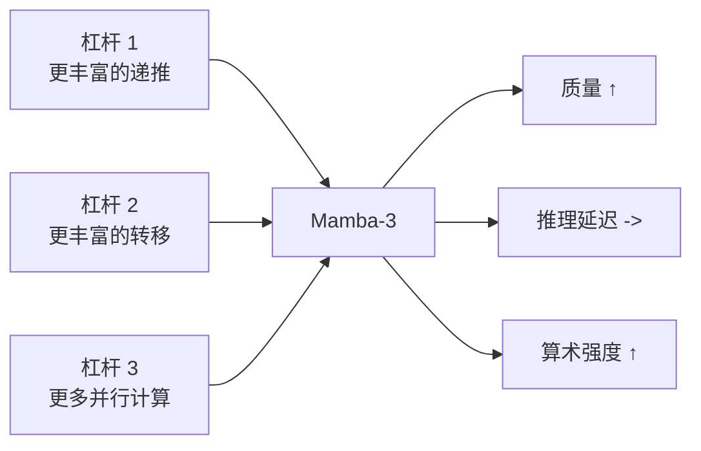

这三个杠杆的核心设计约束是:**提升质量的同时,不能让推理延迟变差**.接下来三节逐一拆解.

---

### 3. 创新一:Exponential-Trapezoidal 离散化

#### 3.1 离散化的历史包袱

连续时间 SSM 的定义是:

```math
\dot{h}(t) = A(t) h(t) + B(t) x(t), \quad y(t) = C(t)^\top h(t)
```

把它变成计算机能算的离散递推,需要**离散化**--选择采样时刻 τ_t,把微分方程近似为差分方程.

Mamba-1 声称使用**零阶保持(ZOH)**,实际实现却是:

```math
\bar{A}_t = \exp(\Delta_t A_t), \quad \bar{B}_t = \Delta_t B_t
```

这个公式是 ZOH 和 Euler 方法的**拼凑**--理论基础不牢.社区早就发现了这个问题:[GitHub issue #129](https://github.com/state-spaces/mamba/issues/129).

#### 3.2 积分因子法:被忽略的正确方法

对 `h'(t) = A(t) h(t) + B(t) x(t)` 应用积分因子 `e^{\int -A(s)ds}`,得到精确解:

```math
h(\tau_t) = \exp\!\left(\int_{\tau_{t-1}}^{\tau_t} A(s)ds\right) h(\tau_{t-1}) \;+\; \int_{\tau_{t-1}}^{\tau_t} \exp\!\left(\int_{\tau}^{\tau_t} A(s)ds\right) B(\tau) x(\tau) d\tau
```

这分离出两个独立的部分:

```text
┌─────────────────────────────────────────┐
│ h_t = α_t · h_{t-1}   +   InputIntegral │
│       ↑                         ↑       │
│   状态转移积分              状态输入积分  │
│   (用右端点近似即可)       (需要近似!)   │
└─────────────────────────────────────────┘
```

- **状态转移积分** α_t = exp(Δ_t A_t) --用右端点近似即可,这是 Mamba-1/2 都做对的部分
- **状态输入积分** --这才是离散化方案的核心差异所在,也是之前被忽略的部分

#### 3.3 从 Euler 到 Trapezoidal

有了积分因子框架,不同离散化方案只是对"状态输入积分"的不同近似:

**Euler 方法**(一阶,Mamba-1/2 实际使用的):
```math
\int \approx \Delta_t B_t x_t
```

截断误差 O(Δ_t²).

**Exponential-Trapezoidal 方法**(二阶,Mamba-3 引入):
使用数据依赖的凸组合 λ_t ∈ [0,1] 来近似区间两端点:

```math
\int \approx (1 - \lambda_t) \Delta_t e^{\Delta_t A_t} B_{t-1} x_{t-1} \;+\; \lambda_t \Delta_t B_t x_t
```

整理得到 Mamba-3 的递推公式:

```math
\boxed{h_t = \alpha_t h_{t-1} + \beta_t B_{t-1} x_{t-1} + \gamma_t B_t x_t}
```

其中:
- `α_t = e^{Δ_t A_t}` --状态衰减
- `β_t = (1 − λ_t) Δ_t e^{Δ_t A_t}` --前一步输入的权重
- `γ_t = λ_t Δ_t` --当前步输入的权重
- `λ_t ∈ [0,1]` --数据依赖的可学习凸组合参数

**截断误差** O(Δ_t³),比 Euler 高一阶.

#### 3.4 对比:Mamba-2 vs Mamba-3 递推

```text
Mamba-2:
  h_t = α_t h_{t-1} + γ_t B_t x_t
                    ↑ 只有当前 token 的 B

Mamba-3:
  h_t = α_t h_{t-1} + β_t B_{t-1} x_{t-1} + γ_t B_t x_t
                    ↑ 前一步的 B            ↑ 当前步的 B
```

关键差异在于 `β_t B_{t-1} x_{t-1}` 这一项--每次状态更新不仅看当前 token,还会看前一个 token 通过 `B_{t-1}` 投影后的贡献.这引入了**跨时间步的结构化混合**.

#### 3.5 隐式卷积:告别短卷积

自 H3 / RWKV-4 以来,几乎所有高性能线性模型都在 SSM 前加一个**短因果卷积**(kernel size = 4):

```text
Mamba-1/2:  input -> conv1d(kernel=4) -> SiLU -> SSM
```

这个短卷积的职责是在进入 SSM 之前做局部时间混合.但它是**额外组件**,增加了参数和计算.

Mamba-3 的 exponential-trapezoidal 递推展开后,可以证明它在 B/C 上施加了一个**隐式的,数据依赖的 2-卷积**:

```math
h_t = \alpha_t h_{t-1} + B_t x_t + B_{t-1} x_{t-1} \quad \text{(示意)}
```

结合后面将介绍的 B/C 偏置(见 §6),这个隐式卷积的效果已经足够强大,使得 **Mamba-3 是第一个在不损失性能的前提下完全移除短卷积的线性模型**.

#### 3.6 并行表示与 SSD 的推广

Mamba-2 的 SSD 本质:SSM 序列变换等价于 `Y = M X`,其中 M 是 1-半可分矩阵(1-semiseparable).

Mamba-3 的递推依然可以表示为 `Y = M' X`,其中 M' 可以分解为:

```text
M' = M₁₋SS + M₂₋band

M₁₋SS:  1-半可分矩阵(来自 α 的衰减,同 Mamba-2)
M₂₋band: 2-带矩阵(来自 trapezoidal 的 β/γ 带来的卷积效应)
 ```

这意味着 Mamba-3 依然可以利用 chunk-scan 式算法高效训练--块内用矩阵乘法,块间做 scan,享受 Tensor Cores 加速.

### 3.7 朴素实现

```python
import torch


def mamba2_step_euler(h, x, x_prev, a, b, c, gamma):
    """Mamba-2 Euler 风格的单步递推(对比用)."""
    h = a * h + gamma * torch.outer(b, x)
    y = c @ h
    return y, h


def mamba3_step_trapezoidal(h, x, x_prev, a, b, b_prev, c, alpha, beta, gamma):
    """Mamba-3 Exponential-Trapezoidal 单步递推."""
    h = alpha * h + beta * torch.outer(b_prev, x_prev) + gamma * torch.outer(b, x)
    y = c @ h
    return y, h


def mamba3_scan(x_seq, a_seq, b_seq, c_seq, alpha_seq, beta_seq, gamma_seq):
    """完整的 Exponential-Trapezoidal SSM 扫描."""
    T, d_v = x_seq.shape
    d_state = b_seq.shape[-1]
    h = torch.zeros(d_state, d_v, device=x_seq.device, dtype=x_seq.dtype)
    outs = []

    x_prev = torch.zeros_like(x_seq[0])
    b_prev = torch.zeros_like(b_seq[0])

    for t in range(T):
        y, h = mamba3_step_trapezoidal(
            h, x_seq[t], x_prev,
            a_seq[t], b_seq[t], b_prev,
            c_seq[t],
            alpha_seq[t], beta_seq[t], gamma_seq[t],
        )
        outs.append(y)
        x_prev = x_seq[t]
        b_prev = b_seq[t]

    return torch.stack(outs, dim=0)
```

> 真实训练使用 chunked parallel kernel,上面的 for-loop 只是为了理解语义.

---

## 4. 创新二:复数值 SSM 与数据依赖 RoPE

### 4.1 一个问题:Mamba-2 为什么做不了 Parity?

**Parity(奇偶校验)** 任务:给定一段 0/1 序列,判断其中 1 的个数是奇数还是偶数.

```text
序列:   1  0  1  1  0  1
奇偶:   奇 奇 偶 奇 奇 偶
```

解法极其简单--需要一个能**交替翻转**的状态:

```math
h_t = R(\pi x_t) h_{t-1}
```

其中 `R(·)` 是旋转矩阵.当 x_t = 1 时翻转,x_t = 0 时保持.这是一个**纯旋转动力学**.

但 Mamba-2 的转移矩阵被约束在 `[0, 1]` 范围内(在 log-space 中通过 softplus 处理以保证稳定性)--**它只能单调衰减,不能旋转**.因此 Mamba-2 完全无法解决 parity.

```text
Mamba-2 的状态转移:  a_t ∈ [0, 1]
                     -> 只能衰减,不能翻转

Parity 需要的转移:   R(θ_t) = 旋转矩阵
                     -> 需要振荡能力
```

### 4.2 复数值 SSM:让状态会旋转

Mamba-3 把底层 SSM 建模为**复数值**系统:

```math
\dot{h}(t) = \operatorname{Diag}(A(t) + i\theta(t)) h(t) + (B(t) + i\hat{B}(t)) x(t)
```

```math
y(t) = \operatorname{Re}\!\left((C(t) + i\hat{C}(t))^\top h(t)\right)
```

这看起来像是凭空增加了复杂性,但论文的 **Proposition 2** 给出了一个极其优雅的结论:

> 对角复数值连续 SSM 可以被**精确等价为**一个 2N 维的实数值 SSM,其转移矩阵是**块对角的缩放旋转矩阵**:

```math
h_t = e^{\Delta_t A_t}
\begin{bmatrix}
\cos(\Delta_t \theta_t) & -\sin(\Delta_t \theta_t) \\
\sin(\Delta_t \theta_t) &  \cos(\Delta_t \theta_t)
\end{bmatrix}
h_{t-1} + \Delta_t B_t x_t
```

每个状态通道对 (2i, 2i+1) 执行一个 2D 旋转,旋转角度由数据依赖的 θ_t 控制:

```text
状态通道 0: ──-> 旋转(θ_t[0]) ──-> 状态通道 0'
状态通道 1: ──-> 旋转(θ_t[0]) ──-> 状态通道 1'
状态通道 2: ──-> 旋转(θ_t[1]) ──-> 状态通道 2'
状态通道 3: ──-> 旋转(θ_t[1]) ──-> 状态通道 3'
...
```

每一对通道共享同一个旋转角度 θ_t.因为旋转矩阵的行列式为 1(保范变换),状态有界且稳定.

### 4.3 "RoPE Trick":不用改 CUDA kernel 的巧妙实现

直接在 SSM kernel 中实现 2D 旋转转移矩阵需要重写底层 CUDA--工作量大且容易出错.

Mamba-3 发现了一个等价变换:由于 `A` 的对角结构,**旋转可以嵌入到 `B` 和 `C` 中**,而不需要修改状态转移矩阵:

```math
C_i^\top R_i \cdots R_{j+1} \bar{B}_j = (R_i \cdots R_0 C_i)^\top (R_j \cdots R_0 \bar{B}_j)
```

其中 R_k 是累积旋转矩阵.这意味着我们只需要:

1. 对 θ 做累积求和
2. 对 B 和 C 分别应用 RoPE(旋转位置编码)
3. 把旋转后的 B 和 C 送入**标准的标量-衰减 SSM kernel**

```text
原始方案(需要重写 kernel):
  SSM 状态转移本身就包含旋转 -> 底层 kernel 全部重写

"RoPE Trick"(零改动方案):
  B -> cumsum(θ) -> RoPE -> 标准 SSM kernel -> RoPE⁻¹ -> C
  ↑_______________________________________________________↑
  旋转嵌入到 B/C 中,状态转移保持不变,用现有 kernel 即可
```

这得名于它与 Transformer 中 RoPE(Rotary Position Embedding)的相似性--都是对向量做旋转.但有一个关键区别:

| 特性 | Transformer RoPE | Mamba-3 RoPE |
|------|-----------------|-------------|
| 参数来源 | 固定的,数据无关的位置编码 | **数据依赖**的,由输入通过网络生成 |
| 旋转对象 | 每层的 Q 和 K | SSM 的 B 和 C 投影 |
| 旋转频率 | 固定频率 | 由网络学习的 `θ_t` 控制 |

### 4.4 解决了 Parity,学到了什么?

在合成测试中,Mamba-3 的复数值 SSM **几乎完美解决 parity**,而 Mamba-2 最终只能猜测(准确率 ~50%).

这不止是一个玩具任务的胜利.旋转动力学对应着更一般的能力--追踪交替状态,记住"是/否"标志,在两种模式之间切换.这些能力对真实语言任务(如跟踪对话角色,记住"是否已提及某信息")同样重要.

```text
Parity 任务的本质:
  需要状态在 2 种模式间切换,且切换条件由输入决定

与之类似的真实任务:
  - "是否已经提到过 X?"(二元状态追踪)
  - 对话角色切换(用户/AI 交替)
  - 代码中的括号匹配状态
  - 数学证明中的"当前假设成立/不成立"
```

### 4.5 朴素实现

```python
import torch
import torch.nn.functional as F


def apply_rope(x: torch.Tensor, angles: torch.Tensor) -> torch.Tensor:
    """对 x 的最后半维度应用 RoPE 旋转.x: [..., D]"""
    D = x.shape[-1]
    x_reshaped = x.reshape(*x.shape[:-1], D // 2, 2)
    cos = torch.cos(angles).unsqueeze(-1)
    sin = torch.sin(angles).unsqueeze(-1)
    x_rotated = torch.stack([
        x_reshaped[..., 0] * cos - x_reshaped[..., 1] * sin,
        x_reshaped[..., 0] * sin + x_reshaped[..., 1] * cos,
    ], dim=-1)
    return x_rotated.reshape(*x.shape)


def mamba3_with_rope(x_seq, a_seq, b_seq, c_seq, theta_seq, alpha_seq, gamma_seq):
    """带 data-dependent RoPE 的 Mamba-3 SSM(简化版)."""
    T, d_v = x_seq.shape
    d_state = b_seq.shape[-1]
    h = torch.zeros(d_state, d_v, device=x_seq.device, dtype=x_seq.dtype)
    outs = []

    # 累积角度
    cum_theta = torch.cumsum(theta_seq, dim=0)

    for t in range(T):
        # RoPE trick: 用累积角度旋转 B 和 C
        b_rot = apply_rope(b_seq[t], cum_theta[t])
        c_rot = apply_rope(c_seq[t], -cum_theta[t])  # 反向旋转(解码)

        # 标准标量-衰减 SSM 递推(和 Mamba-2 一样!)
        h = alpha_seq[t] * h + gamma_seq[t] * torch.outer(b_rot, x_seq[t])
        y = c_rot @ h
        outs.append(y)

    return torch.stack(outs, dim=0)
```

> 注意 `c_rot` 使用了**反向旋转**(`-cum_theta[t]`),这是 RoPE trick 等价性的关键--B 端旋转了,C 端必须解码回来.

---

## 5. 创新三:MIMO 多输入多输出

### 5.1 问题回顾:算术强度是我们的敌人

回到 §2.2 的数据--Mamba-2 解码算术强度约 2.5 FLOPs/byte.

```text
Mamba-2 解码 (batch=1, prefill 完成后):
  每步计算: h_t = a_t · h_{t-1} + B_t x_t^⊤
                     ↑                 ↑
              标量×矩阵 (O(NP))    外积 (O(NP))
  总 FLOPs: 2NP
  内存读取: h (NP) + B (N) + x (P) ≈ NP bytes
  算术强度: 2NP / NP ≈ 2 -> 纯内存受限
```

GPU 强大的张量核心大部分时间在等待数据从 HBM 搬过来.如果能利用这些空闲算力做更多有用的计算--且不增加内存读取--就能在不增加延迟的情况下提升模型质量.

### 5.2 SISO -> MIMO

Mamba-2 的 SSM 是**单输入单输出(SISO)**:B_t 是一个向量,x_t 是一个标量,h_t = a_t h_{t-1} + B_t x_t^⊤ 是一个外积.

Mamba-3 将其推广为**多输入多输出(MIMO)**:

```math
\text{SISO:} \quad h_t = a_t h_{t-1} + B_t x_t^\top \quad \text{(外积)}
\;\to\;
\text{MIMO:} \quad h_t = a_t h_{t-1} + \mathcal{B}_t \mathcal{X}_t^\top \quad \text{(矩阵乘)}
```

其中对于秩 R 的 MIMO:
- `\mathcal{B}_t ∈ R^{N × R}` --B 从向量变成矩阵
- `\mathcal{X}_t ∈ R^{P × R}` --x 从向量变成矩阵(多头值维度 P=64)
- `h_t ∈ R^{N × P}` --状态大小不变!
- `y_t ∈ R^{P}` --输出维度不变!

关键:**状态大小仍然是 N × P**,不随 R 增长.只是输入/输出变成了矩阵乘法而非外积.

### 5.3 算术强度分析

```text
MIMO (rank R) 解码:
  每步: h_t = a_t · h_{t-1} + B_t · X_t^⊤
                     ↑                 ↑
              标量×矩阵 (NP)      矩阵乘 (NPR)
  FLOPs:  2NP + 2NPR ≈ 2NPR
  内存:   h (NP) + B (NR) + X (PR) ≈ NP + NR + PR
  算术强度: 2NPR / (NP + NR + PR)
          = 2R / (1 + R/P + R/N)  (当 N≈P 时)
          ≈ R                   (当 R ≪ N, P)
```

代入具体值 R=4, N=128, P=64:`2×4 / (1 + 4/64 + 4/128) = 8 / 1.09375 ≈ 7.3`.相比 Mamba-2 的 ~2.5,**约 3 倍的算术强度提升**,且内存读取量不变.

```text
算术强度对比:
  Mamba-2 (SISO):        ██████ 2.5
  Mamba-3 (MIMO R=4):    ██████████████████ 7.3
  Mamba-3 (MIMO R=8):    ██████████████████████████████████ 13.5

H100 上限: ██████████████████████████████████████████████████████ 300
                                                                    ↑
                          即使 MIMO R=32,仍然远低于上限,张量核心仍有空间
```

### 5.4 参数效率:巧妙的参数共享

直接扩展投影会带来参数膨胀:如果 B 的投影从 `D -> N` 变成 `D -> NR`,参数量增加 R 倍.Mamba-3 利用 Mamba 的多值(multi-value)结构巧妙避开了这个问题:

```text
Mamba 块内的参数分工:
  z, x: 门控 + 值     -> 每头独立    -> 保持原始投影,通过可学习逐元素因子扩到 R
  B, C: 输入/输出投影 -> 所有头共享  -> 可放大投影维度(D -> DNR 几乎可忽略)
  dt, A: 时间步参数   -> 结构不变    -> 不增加

因此每头参数仅从 DP 增到 DP + PR(P=64, R=4 -> 增量 < 1%)
```

```python
## x 投影(每头独立): 通过逐元素缩放实现 MIMO
x_proj = nn.Linear(d_inner, headdim * num_heads)  # 标准投影
mimo_scale = nn.Parameter(torch.ones(headdim, mimo_rank) / math.sqrt(mimo_rank))  # 极小参数
## 使用时: x_mimo = x_proj.unsqueeze(-1) * mimo_scale  -> [..., headdim, mimo_rank]
```

### 5.5 训练代价与解码延迟

MIMO 的训练代价**随 R 线性增长**(而非直觉上的 R²),原因是分块训练算法中:

```text
SSD Chunk Scan 训练:
  chunk_size = C
  SISO:  块内 O(C²NP), 块间 O((T/C) N²P)
  MIMO:  块内 O(C²NPR), 块间 O((T/C) N²PR)

通过缩小块大小到 C/R,块间开销从 O(N²PR) -> O(N²P·R·R) -> 需要平衡
```

实践中,MIMO R=4 训练约比 SISO 慢 30-50%,但--

> **核心权衡:解码延迟几乎不变.** 因为 MIMO 利用的是 GPU 原本空闲的计算资源.

这意味着 MIMO 是一个**纯正的推理效率改进**:训练多花一点时间,换来推理阶段质量大幅提升但延迟不变.

### 5.6 临界点:R 多大合适?

Mamba-3 论文分析了 MIMO 秩的理论上限:

| 场景 | 临界 R | 原因 |
|------|--------|------|
| FP32 decode | ~18 | 张量核心利用率开始饱和 |
| FP16 decode | ~36 | 半精度吞吐更高 |
| SISO (R=1) | 1 | Mamba-2 基线 |

默认使用 R=4,这是一个保守但有效的选择,在质量和训练开销之间取得平衡.

### 5.7 朴素实现

```python
import torch


def mamba3_mimo_step(h, x, b, a, alpha, gamma):
    """MIMO 单步递推.
    h: [d_state, d_v]
    x: [d_v, R]
    b: [d_state, R]
    a: 标量
    alpha, gamma: 标量
    """
    h = a * h + gamma * b @ x.T  # 矩阵乘法,不是外积!
    return h


def mamba3_mimo_scan(x_seq, a_seq, b_seq, c_seq, alpha_seq, gamma_seq):
    """MIMO SSM 扫描(朴素实现)."""
    T, d_v, R = x_seq.shape
    d_state = b_seq.shape[-2]
    h = torch.zeros(d_state, d_v, device=x_seq.device, dtype=x_seq.dtype)
    outs = []

    for t in range(T):
        h = mamba3_mimo_step(h, x_seq[t], b_seq[t], a_seq[t], alpha_seq[t], gamma_seq[t])
        # 输出投影: c_seq[t] shape [d_state], 读出的仍是 [d_v]
        outs.append(c_seq[t] @ h)

    return torch.stack(outs, dim=0)
```

> 对比 SISO:`h = a * h + gamma * outer(b_vec, x_vec)` 变成 `h = a * h + gamma * b_mat @ x_mat.T`--核心变化就是从外积升级为矩阵乘法,利用被浪费的张量核心算力.

## 6. Mamba-3 完整架构拆解

### 6.1 块结构总览

Mamba-3 采用 Llama 风格的交错结构:**交替排列 Mamba-3 层和 SwiGLU MLP 层**,使用 pre-norm(与 Mamba-2 的纯 Mamba 堆叠不同).

单个 Mamba-3 块的前向流程:

```text
input (B, L, d_model)
    │
    ▼
in_proj: Linear(d_model -> z(x2) + B(x ngroups×d_state) + C(x ngroups×d_state) + dt(x nheads) + A(x nheads) + λ_t(x nheads) + θ(x num_rope_angles))
    │  (示意图;实际维度依赖于 ngroups / headdim / mimo_rank 等配置)
    │
    ├──-> z ────────────────────────────────────────────────┐
    ├──-> x ─-> [MIMO expand] ────────────────────────────┐  │
    ├──-> B ─-> BCNorm (RMSNorm) ─-> +B_bias ─-> RoPE ────┤  │
    ├──-> C ─-> BCNorm (RMSNorm) ─-> +C_bias ─-> RoPE⁻¹ ──┤  │
    ├──-> dt ─-> softplus(dt + dt_bias) ─────────────────┤  │
    ├──-> A_log ─-> heavy_tail_activation ───────────────┤  │
    ├──-> trap ─-> sigmoid -> λ_t ────────────────────────┤  │
    └──-> angles ─-> cumsum -> data-dependent RoPE ───────┘  │
                                                           │
                                    ┌──────────────────────┘
                                    ▼
                        Mamba-3 SSM (SISO or MIMO)
                                    │
                          ┌─────────┘
                          ▼
                 gate: SiLU(z) ⊙ y
                          │
                          ▼
              out_proj: Linear(d_inner -> d_model)
                          │
                          ▼
                output (B, L, d_model)
```

### 6.2 与 Mamba-2 块的逐组件对比

```text
Mamba-2 Block:
  in_proj -> [z, x, B, C, dt]
            ↓
  x -> conv1d(kernel=4) -> SiLU -> split -> x', B', C'
            ↓
  SSD(x', dt, A, B', C')
            ↓
  gate(z) ⊙ y -> RMSNorm(after SSM) -> out_proj
```

```text
Mamba-3 Block:
  in_proj -> [z, x, B, C, dt, A, trap, angles]
            ↓ (无 conv1d!)
  B, C -> BCNorm -> +bias -> RoPE -> SSM入口
  x -> [MIMO expand if enabled] -> SSM入口
  dt -> softplus(dt + dt_bias)
  A -> heavy_tail_activation
  trap -> sigmoid -> λ_t
  angles -> cumsum -> RoPE rotation
            ↓
  Mamba-3 SSM (exp-trapezoidal + MIMO optional)
            ↓
  gate(z) ⊙ y -> out_proj
```

### 6.3 新增组件详解

| 组件 | 功能 | 为什么需要 |
|------|------|-----------|
| **BCNorm** | 对 B 和 C 做 RMSNorm | 镜像 Transformer 的 QKNorm,稳定训练 |
| **B/C Bias** | 可学习的逐头逐通道偏置 | 提供通用逼近能力,+ 隐式卷积替代短卷积 |
| **Heavy-tail Activation** | `f(x)=1+x (x≥0); 1/(1-x) (x<0)` | 正值,连续,在 x=0 处可微,提高高学习率下的稳定性 |
| **λ_t (trap parameter)** | sigmoid 控制的凸组合权重 | 控制 Exponential-Trapezoidal 中前一步 vs 当前步的贡献比例 |
| **angles (RoPE)** | 数据依赖的旋转角度 | 编码复数值 SSM 的旋转动力学 |
| **MIMO expand** | 可选的秩-R 扩展 | 提升性能不增推理延迟 |

### 6.4 移除的组件

| 组件 | Mamba-2 中存在 | Mamba-3 中状态 | 替代方案 |
|------|:---:|:---:|------|
| **因果 conv1d (kernel=4)** | ✅ | ❌ 移除 | 隐式 2-卷积 (exponential-trapezoidal) + B/C bias |
| **后门控 RMSNorm** | ✅ | ❌ 移除(纯 Mamba-3) | 可选 `is_outproj_norm` for 混合模型 |
| **SiLU on x** | ✅ | ❌ 移除 | 不再需要(conv 后的非线性已移除) |

### 6.5 Heavy-Tail Activation

Mamba-3 为数据依赖的 A 引入了新的激活函数:

```math
f(x) = \begin{cases} 1 + x & \text{if } x \geq 0 \\ \frac{1}{1 - x} & \text{if } x < 0 \end{cases}
```

```text
f(x)
  │
  │          ╱
  │        ╱
  │      ╱
  │    ╱
  │  ╱
  │╱
──┼──────────────── x
  │╲
  │  ╲
  │    ╲
  │      ╲______ (渐近线 x=1)
  │
```

与 softplus 对比:
- **正值端**:类似 softplus 但偏移了 1(确保 A ≥ 1 的区域用于"记忆"模式)
- **负值端**:heavy tail--不像 softplus 那样快速归零,而是缓慢衰减
- 在 WSD(Warmup-Stable-Decay)训练和高学习率下更稳定

### 6.6 Kernel 技术栈

Mamba-3 的 kernel 使用三层不同粒度的 GPU 抽象:

| 层级 | 工具 | 用途 | 特点 |
|------|------|------|------|
| **高层** | Triton | SISO prefill kernel | 平台无关,支持 TMA (Hopper GPU) |
| **中层** | TileLang | MIMO prefill kernel | 显式控制 shared memory tiles 和 register fragments |
| **底层** | CuTe DSL | Decode kernel | 通过 CUTLASS 生成低级 kernel,warp specialization |

```text
Prefill (Triton/TileLang):
  in_proj -> BCNorm -> RoPE -> SSM chunked scan -> gate -> out_proj

Decode (CuTe DSL):
  in_proj -> BCNorm -> RoPE -> SSM step (fused) -> gate -> out_proj
```

### 6.7 Python API 示例

```python
from mamba_ssm import Mamba3

## SISO 模式(默认,参数量约 6 × d_model²)
model_siso = Mamba3(
    d_model=4096,
    d_state=128,
    headdim=64,
    dtype=torch.bfloat16,
).to("cuda")

## MIMO 模式(R=4,更好的质量/延迟权衡)
model_mimo = Mamba3(
    d_model=4096,
    d_state=128,
    headdim=64,
    is_mimo=True,
    mimo_rank=4,
    chunk_size=16,          # 推荐 64/mimo_rank (bf16)
    is_outproj_norm=False,  # 纯 Mamba-3 不需要
    dtype=torch.bfloat16,
).to("cuda")
```

### 6.8 关键架构参数

| 参数 | 默认值 | 说明 |
|------|--------|------|
| `d_state` | 128 | SSM 隐状态大小 |
| `expand` | 2 | 内部维度扩展因子(`d_inner = expand × d_model`) |
| `headdim` | 64 | 每个 SSM 头的维度 |
| `ngroups` | 1 | B/C 头的组数(类似 GQA) |
| `rope_fraction` | 0.5 | RoPE 维度占 d_state 的比例 |
| `dt_min` / `dt_max` | 0.001 / 0.1 | Δ 的初始化范围 |
| `A_floor` | 1e-4 | A 的下界(防止不稳定) |
| `mimo_rank` | 4 (if MIMO) | MIMO 秩 |

## 7. Mamba-2 vs Mamba-3 全面对比

### 7.1 设计哲学

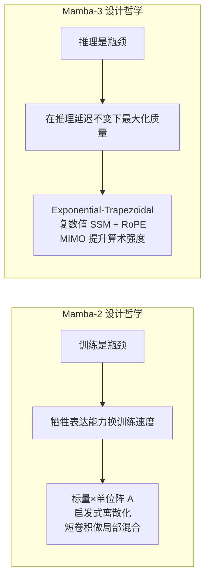

### 7.2 技术维度对比

| 维度 | Mamba-2 | Mamba-3 | 说明 |
|------|---------|---------|------|
| **转移矩阵 A** | 标量 × 单位阵,`a_t ∈ [0,1]` | 标量 + 旋转(复数值等价) | Mamba-3 能表达振荡 |
| **离散化** | 启发式(Euler+ZOH 拼凑) | Exponential-Trapezoidal(二阶) | 理论完备,精度更高 |
| **短卷积** | ✅ conv1d(k=4) + SiLU | ❌ 移除 | 被隐式卷积 + B/C bias 替代 |
| **SSM 输入** | 单输入(SISO),外积 | 可选 MIMO(R≥2),矩阵乘 | 提升算术强度 |
| **位置编码** | 无 | 数据依赖 RoPE | 嵌入 B/C 中,不改 SSM kernel |
| **BC 归一化** | 无 | BCNorm (RMSNorm) | 稳定训练 |
| **B/C 偏置** | 无 | 可学习逐头逐通道偏置 | 通用逼近 + 隐式卷积 |
| **激活函数** | SiLU (×2, on x and gate) | SiLU (gate only) + heavy-tail (A) | A 需要特殊的正值约束 |
| **后 SSM Norm** | 有(RMSNorm) | 无(纯 Mamba-3) | 混合模型建议保留 |
| **MLP 结构** | 不一定有 | SwiGLU,Llama 风格交替 | 对齐标准 Transformer 约定 |
| **State-tracking** | ❌ 无法做 parity | ✅ 几乎完美解决 | 复数值 SSM 的旋转动力学 |
| **算术强度(解码)** | ~2.5 | ~4 (MIMO R=4) | 利用 GPU 空闲算力 |

### 7.3 训练与推理对比

| 维度 | Mamba-2 | Mamba-3 (SISO) | Mamba-3 (MIMO R=4) |
|------|---------|---------------|-------------------|
| **训练速度** | 最快(基线) | 相当(架构形状一致) | 慢 30-50%(更多 FLOPs) |
| **解码延迟** | 基线 | 略快(移除短卷积) | 几乎不变(利用空闲算力) |
| **状态大小效率** | 基线 | N=128 匹配 Mamba-2 的 N=128 | N=64 即匹配 Mamba-2 的 N=128 |
| **下游质量** | 基线 | +1.8 avg acc (1.5B) | +3.0 avg acc (1.5B) |
| **GPU 利用率(解码)** | 极低 (~1%) | 极低 | 提升 60%+ |

### 7.4 SSD 框架下的统一视角

从 SSD 的矩阵表示 `Y = M X` 来看:

| | Mamba-2 | Mamba-3 |
|---|---------|---------|
| **M 的结构** | 1-半可分矩阵 | 1-半可分矩阵 + 2-带矩阵 |
| **低秩分解来源** | `a_{i:j}^×` 的标量因式分解 | 同上 + trapezoidal 的 β/γ 分解 |
| **Chunk 内计算** | `(L_Q ∘ C B^⊤) X` | `(L_Q ∘ C B^⊤) X + L_band X` |
| **Chunk 间扫描** | 标量衰减 scan | 标量衰减 + 旋转 scan |

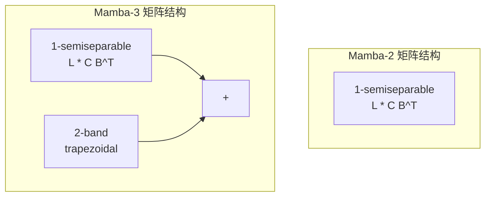

### 7.5 一句话总结

> Mamba-2 把 SSM 做成了"去掉 softmax 的线性注意力".Mamba-3 在此基础上加了三个东西:**精确的离散化**(trapezoidal),**旋转的状态**(复数值 SSM / RoPE),和**更密集的计算**(MIMO).三者合力,在不增加推理延迟的前提下,把模型质量推到了新的 Pareto 前沿.

## 8. 性能基准与实战数据

### 8.1 下游语言建模(1.5B 参数,100B tokens FineWeb)

| 模型 | 平均下游准确率 | 相对 Mamba-2 提升 |
|------|:---:|:---:|
| Transformer (Llama) | 0.0(基线) | - |
| Mamba-2 | +0.3 | - |
| Gated DeltaNet (GDN) | +1.2 | +0.9 |
| **Mamba-3 (SISO)** | **+1.8** | **+1.5** |
| **Mamba-3 (MIMO R=4)** | **+3.0** | **+2.7** |

> 表中数值为相对 Transformer (Llama) 基线的平均下游准确率提升(百分点).

> 数据来源:Mamba-3 论文 §5.1 (arXiv:2603.15569),1.5B 参数在 FineWeb 100B tokens 上的预训练下游评估.

### 8.2 状态大小效率(State-size Pareto Frontier)

Mamba-3 在状态维度 vs 困惑度曲线上完全支配 Mamba-2:

```text
困惑度 (越低越好)
  │
  │  ● Mamba-2 (N=128) ────────────┐
  │                                  ├─ 相同困惑度
  │         ● Mamba-3 MIMO (N=64) ──┘  但状态大小减半
  │
  │  ● Mamba-3 MIMO (N=128) ← 比 Mamba-2 同 N 低 0.5+ PPL
  │
  └────────────────────────────────────-> 状态维度 N
```

- **Mamba-3 (MIMO) 用状态大小 64 匹配 Mamba-2 用状态大小 128 的困惑度**
- 即:**一半的解码延迟达到相同质量**

### 8.3 推理延迟(1.5B 模型,单 H100-SXM 80GB,batch=128)

**Prefill + Decode 总延迟**(秒):

| 模型 | seqlen=4096 | seqlen=16384 |
|------|:---:|:---:|
| vLLM (Llama-3.2-1B) | 58.64 | 976.50 |
| Mamba-2 | 37.22 | 149.02 |
| Gated DeltaNet | 36.41 | 145.87 |
| **Mamba-3 (SISO)** | **35.11** | **140.61** |
| Mamba-3 (MIMO R=4) | 37.85 | 151.81 |

**Mamba-3 SISO 在所有序列长度上实现最快的总延迟**,超越 vLLM 优化的 Transformer 和所有其他线性模型.MIMO 模式延迟与 Mamba-2 相当但质量大幅提升.

> 数据来源:Mamba-3 论文 §5.2.

### 8.4 参数缩放行为

在 130M -> 1.5B 参数范围内,Mamba-3 的困惑度-参数曲线始终低于 Mamba-2,且差距随模型增大而扩大.论文的 scaling law 实验显示 Mamba-3 在计算最优分配下的表现持续优于 Mamba-2.

### 8.5 训练速度对比

| 模式 | 相对 Mamba-2 训练速度 |
|------|:---:|
| Mamba-3 SISO | ~1.0×(相当) |
| Mamba-3 MIMO R=2 | ~0.85× |
| Mamba-3 MIMO R=4 | ~0.7× |
| Mamba-3 MIMO R=8 | ~0.5× |

> 训练速度下降是因为 MIMO 的矩阵乘法增加了 FLOPs,但 chunk scan 的块间扫描仍是 O(T) 线性复杂度.

## 9. 混合模型与未来方向

### 9.1 线性模型 + 注意力的协同

Mamba-3 论文明确指出:**线性层将与全局自注意力层联合使用**.纯线性模型在需要精确检索的任务(如 NIAH,SWDE)上天然弱于有 KV cache 的 Transformer.但:

```text
纯 Transformer: 检索强,长上下文内存爆炸
纯 SSM:        检索弱,长上下文高效

混合模型:      取两者之长
  SSM 层:      压缩长上下文 -> 线性复杂度
  Attention 层: 精确检索关键信息 -> 有限的二次复杂度
```

### 9.2 当前混合模型生态

| 模型 | 架构 | SSM 版本 | 规模 |
|------|------|---------|------|
| Jamba / Jamba-1.5 | 混合 Transformer-Mamba MoE | Mamba-1 | 12B-94B active |
| Zamba 2 | 混合 SSM-Transformer | Mamba-1 | 2.7B-7B |
| Falcon Mamba 7B | 纯 Mamba-1 | Mamba-1 | 7B |
| NVIDIA Nemotron-H | 混合 Mamba-Transformer | Mamba-2 | - |
| Qwen3-Next | 混合 | Mamba-2 / GDN | - |
| Kimi Linear | 混合 | Mamba-2 / GDN | - |

### 9.3 Mamba-3 论文中的开放问题

1. **混合模型的层编排**:Attention 层应该放在首尾还是均匀穿插?是否应该使用 NoPE?
2. **Norm 位置的影响**:pre-gate vs post-gate,grouped vs regular 对半结构化任务的影响不可忽略
3. **隐式卷积 vs 显式卷积**:trapezoidal 的 2-带效应是否在所有场景下都足够?更长距离的局部混合是否需要额外机制?
4. **数据依赖 RoPE 的极限**:旋转角度 θ_t 的分布规律是否能被系统化地分析和优化?

### 9.4 从控制论看线性模型

Mamba-3 的方法论改进(积分因子,高阶离散化,复数值系统)全部来源于信号处理和控制理论的经典工具.论文作者提出的一个值得思考的方向:

> 线性注意力的 fast-weight programmer 视角中,状态更新本质上是在线梯度下降.控制论中还有多少经典方法(自适应步长,Kalman 滤波,鲁棒控制)尚未被引入神经网络架构设计?

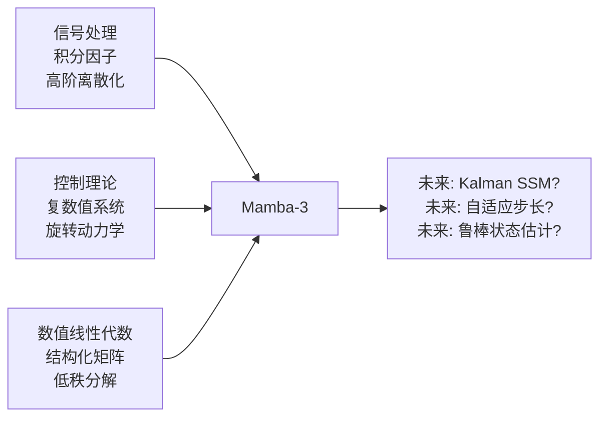

## 10. 学习路线与参考资料

### 10.1 推荐阅读顺序

```text
Step 1: `线性复杂度注意力家族导读 §1-§4`
        理解统一符号,线性注意力,retention/decay 概念
        ↓
Step 2: `线性复杂度注意力家族导读 §7`
        理解 Mamba-2 SSD 框架:SSM -> attention 对偶,chunk scan
        ↓
Step 3: 本文 §1-§2
        理解 Mamba-3 的动机:为什么 Mamba-2 的优化方向需要调整
        ↓
Step 4: 本文 §3-§5(核心创新三章)
        逐一深入三个技术杠杆的数学原理和实现细节
        ↓
Step 5: 本文 §6-§7
        架构全景图 + 逐维对比 -> 形成完整的 Mamba-2 vs Mamba-3 心智模型
        ↓
Step 6: Tri Dao 博客 Part 1 & 2
        从作者视角理解设计决策(链接见下)
        ↓
Step 7: `Gated Delta Rule Chunk 算子教程`
        看看相邻工作(Gated DeltaNet)的 kernel 实现,理解 chunk solve 生态
```

### 10.2 核心论文

| 论文 | 链接 | 关键内容 |
|------|------|---------|
| **Mamba-3** | [arXiv:2603.15569](https://arxiv.org/abs/2603.15569) | 本文的全部技术来源,ICLR 2026 |
| **Mamba-2 (SSD)** | [arXiv:2405.21060](https://arxiv.org/abs/2405.21060) | SSD 框架,chunk scan 算法 |
| **Mamba-1** | [arXiv:2312.00752](https://arxiv.org/abs/2312.00752) | 选择性 SSM,硬件感知算法 |
| **Gated DeltaNet** | [arXiv:2412.06464](https://arxiv.org/abs/2412.06464) | 用 Delta Rule 改进 Mamba-2 |
| **RWKV-7** | [arXiv:2503.14456](https://arxiv.org/abs/2503.14456) | 动态状态演化,广义 Delta Rule |

### 10.3 博客与代码

| 资源 | 链接 |
|------|------|
| **Tri Dao: Mamba-3 Part 1** | [tridao.me/blog/2026/mamba3-part1](https://tridao.me/blog/2026/mamba3-part1/) |
| **Tri Dao: Mamba-3 Part 2** | [tridao.me/blog/2026/mamba3-part2](https://tridao.me/blog/2026/mamba3-part2/) |
| **Together AI Blog** | [together.ai/blog/mamba-3](https://www.together.ai/blog/mamba-3) |
| **Goombalab Blog** | [goombalab.github.io/blog/2026/mamba3-part1](https://goombalab.github.io/blog/2026/mamba3-part1/) |
| **Mamba 官方实现** | [github.com/state-spaces/mamba](https://github.com/state-spaces/mamba) |
| **mamba3.py** | [mamba_ssm/modules/mamba3.py](https://github.com/state-spaces/mamba/blob/main/mamba_ssm/modules/mamba3.py) |
| **Tri Dao: Mamba-2 博客系列** | [tridao.me/blog/2024/mamba2-part1-model](https://tridao.me/blog/2024/mamba2-part1-model/) |

### 10.4 本文与其他指南的关系

```text
learn/attention/
├── `线性复杂度注意力家族导读`   ← 横向对比:Linear Attn -> Mamba-2 -> RWKV-7
├── `Gated Delta Rule Chunk 算子教程` ← 纵向深入:Gated Delta 的 chunk 算子实现
├── `Mamba-3 深度解析`                ← [本文]纵向深入:Mamba-3 全解析 + Mamba-2 对比
├── attention_sink_simple.py           ← 实验代码:Attention Sink 现象
├── kvcache.py                         ← 实验代码:KV Cache 机制
└── rope_simple_demo.py                ← 实验代码:RoPE 原理演示
```

### 10.5 常见误区

**"Mamba-3 就是 Mamba-2 加 RoPE"**

不完全对.RoPE(严格说是 data-dependent RoPE trick)只是三个创新之一.Exponential-Trapezoidal 离散化移除了短卷积(自 H3 以来几乎所有线性模型的标配),MIMO 提升了算术强度.三者合力才产生了质变.

**"MIMO 会增加推理延迟"**

不会.MIMO 利用的是 GPU 张量核心在 Mamba-2 解码时原本空闲的算力.延迟不变的原因是内存读取量不变--这是算术强度提升的经典场景:更多的 FLOPs 在相同的内存带宽下完成.

**"Mamba-3 训练更慢,所以倒退"**

SISO 模式训练速度与 Mamba-2 相当.MIMO 模式确实更慢(~30-50%),但换来的是推理阶段质量大幅提升且延迟不变.在推理密集的场景下(RLVR rollout,大规模 serving),训练多花的 GPU 小时很快被推理阶段省下的 GPU 小时收回.

**"纯 SSM 彻底击败 Transformer"**

Mamba-3 论文明确指出线性模型在检索任务上仍弱于有 KV cache 的 Transformer.未来的主流大概率是**混合模型**--SSM 层处理长上下文流,Attention 层做精确检索.

---
