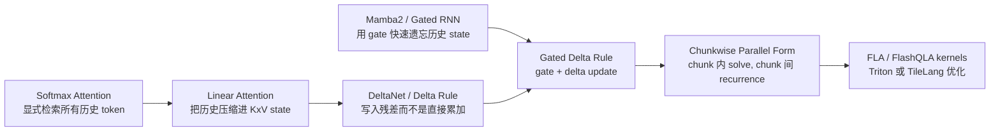
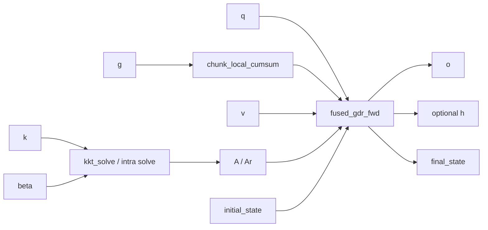
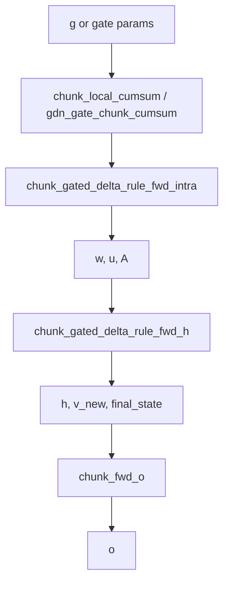
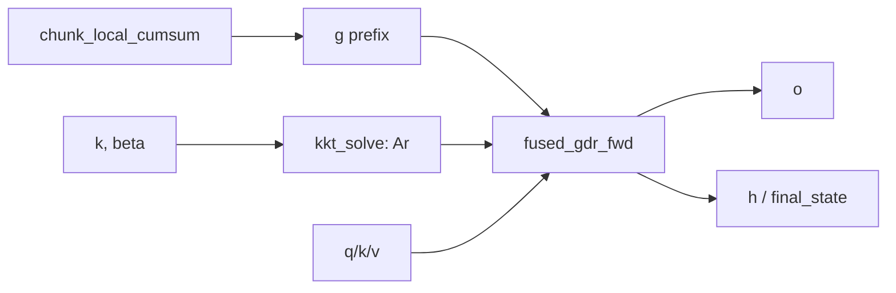
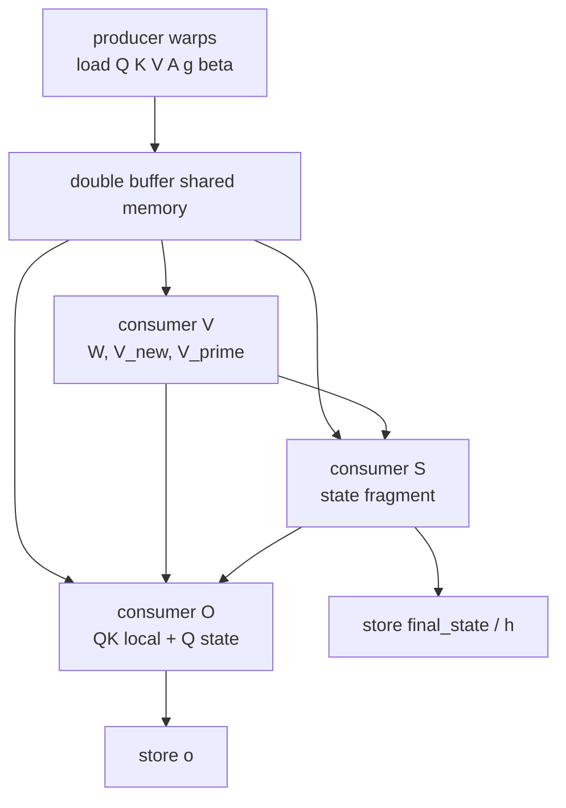

# Gated Delta Rule Chunk 算子教程

本文面向想读懂 `flash_qla.ops.gated_delta_rule.chunk` 的同学：先从算子语义和公式讲起，再对比标准注意力、普通线性注意力、DeltaNet/Mamba2，最后解释 FLA 和 FlashQLA 分别做了哪些优化。

阅读代码时建议按这个顺序：

- Python 入口：[flash_qla/ops/gated_delta_rule/chunk/__init__.py](../flash_qla/ops/gated_delta_rule/chunk/__init__.py)
- 纯 PyTorch reference：[tests/ref_gdr.py](../tests/ref_gdr.py)
- FlashQLA Hopper kernels：[flash_qla/ops/gated_delta_rule/chunk/hopper](../flash_qla/ops/gated_delta_rule/chunk/hopper)
- FLA 对比入口：`fla.ops.gated_delta_rule.chunk`

## 1. 这个算子在做什么

Gated Delta Rule 是一种线性注意力 / 线性 RNN 算子。它也叫 `q/k/v`，但它不是 softmax attention。它维护一个随时间更新的矩阵状态 `S_t`，每个 token 用 `k_t` 写入状态，用 `q_t` 读取状态。

输入形状：

| 张量 | 形状 | 含义 |
|---|---:|---|
| `q` | `[B, T, Hk, K]` | query，用来读状态 |
| `k` | `[B, T, Hk, K]` | key，用来定位写入/读取 |
| `v` | `[B, T, Hv, V]` | value，写入内容 |
| `g` | `[B, T, Hv]` | gate 的 log 空间参数，控制遗忘 |
| `beta` | `[B, T, Hv]` | delta update 的步长/写入强度 |
| `initial_state` | `[B, Hv, K, V]` | 可选初始状态 |

输出：

| 张量 | 形状 | 含义 |
|---|---:|---|
| `o` | `[B, T, Hv, V]` | 每个 token 的输出 |
| `final_state` | `[B, Hv, K, V]` | 可选最终状态，可用于续接推理 |

本仓库只支持 Hopper/SM90，默认固定：

```text
chunk_size = 64
K = V = 128
q/k/v dtype != float32
head_first = False
```

## 2. 从注意力到 Gated Delta Rule

### 2.1 标准 softmax attention

标准自注意力是：

```math
o_t = \sum_{i \le t}
\operatorname{softmax}_i(q_t k_i^\top) v_i
```

它的优势是内容寻址能力强；劣势是训练和 prefill 需要显式处理 `T x T` 的注意力矩阵，即使 FlashAttention 降低了 HBM 读写，语义上仍是二次复杂度。

### 2.2 普通线性注意力

线性注意力把历史压进一个状态矩阵：

```math
S_t = S_{t-1} + k_t^\top v_t
```

读出：

```math
o_t = q_t S_t
```

这样复杂度从 `O(T^2)` 变成 `O(T K V)`，但状态是固定容量的。简单累加容易污染记忆：旧信息难以删除，写入也不够精确。

### 2.3 Delta Rule

Delta Rule 的核心是“先读旧值，再写误差”。令：

```math
\hat{v}_t = k_t S_{t-1}
```

更新：

```math
S_t = S_{t-1}
  + \beta_t k_t^\top (v_t - \hat{v}_t)
```

直觉：

- 如果当前 key 已经能从状态里读出接近 `v_t` 的内容，则写入很小。
- 如果读出的旧内容错了，就写入残差 `v_t - \hat{v}_t`。
- `beta_t` 控制这次修正的强度。

这可以看成对一个 fast-weight memory 做在线梯度下降。

### 2.4 Gated Delta Rule

Gated Delta Rule 在 Delta Rule 外加了遗忘门：

```math
S_t = \alpha_t S_{t-1}
  + \beta_t k_t^\top (v_t - k_t S_{t-1})
```

其中 `0 < alpha_t <= 1`。本实现把 gate 放在 log 空间里处理：原始 `g_t` 先做 chunk 内前缀和，随后用：

```math
\gamma_t = \sum_{\tau \le t} g_\tau
```

任意两个 token 间的累积衰减可写成：

```math
\prod_{\tau=j+1}^{i} \alpha_\tau
= \exp(\gamma_i - \gamma_j)
```

这就是代码里大量 `exp(g_i - g_j)` 的来源。

## 3. 它是怎么来的

Gated Delta Rule 不是凭空出现的。它可以看成几条路线的合流：



每一步解决的问题不同：

| 阶段 | 想解决的问题 | 代价或新问题 |
|---|---|---|
| Softmax attention | 每个 token 都能直接检索所有历史 | 训练/prefill 二次复杂度 |
| Linear attention | 用固定状态把复杂度降到线性 | 简单累加会污染记忆 |
| Delta Rule | 用残差写入修正已有记忆 | 仍缺少快速整体遗忘能力 |
| Gated recurrence | 通过 gate 快速遗忘旧状态 | 写入不如 delta update 精确 |
| Gated Delta Rule | 同时具备遗忘和残差修正 | 训练需要并行化递推 |
| Chunkwise parallel | 把 token 级串行改成 chunk 内矩阵解 | 需要 KKT/triangular solve kernel |

从公式上也能看到这个演化。

普通线性注意力直接累加：

```math
S_t = S_{t-1} + k_t^\top v_t
```

Delta Rule 改成写残差：

```math
S_t = S_{t-1}
  + \beta_t k_t^\top (v_t - k_t S_{t-1})
```

Gated Delta Rule 再加遗忘：

```math
S_t = \alpha_t S_{t-1}
  + \beta_t k_t^\top (v_t - k_t S_{t-1})
```

最后 chunkwise parallel training 把一个 chunk 内所有 token 的相互影响写成单位下三角线性系统：

```math
(I + L) X = Y
```

其中 `L` 来自 `beta * K K^T * decay`。因为 `I+L` 是单位下三角矩阵，解它比通用矩阵逆便宜很多，也更适合固定 `64 x 64` 的 GPU kernel。

## 4. 和别的注意力算子的区别

| 算子 | 核心状态 | 训练复杂度 | 长上下文能力 | 主要特点 |
|---|---|---:|---|---|
| Softmax Attention | 显式 `T x T` score | `O(T^2)` | 强，但代价高 | 内容寻址最直接 |
| FlashAttention | 仍是 softmax score | `O(T^2)` | 强 | 优化 IO，不改变 attention 语义 |
| 朴素线性注意力 | `S: K x V` | `O(T K V)` | 线性，但状态容量固定 | 快，但记忆控制弱 |
| Mamba2 类 gated recurrence | 状态递推 | 线性 | 强依赖 gate/SSM 设计 | 善于遗忘，写入较简单 |
| DeltaNet | fast-weight state | 线性 | 比简单线性注意力更会修正记忆 | 用 delta update 写残差 |
| Gated Delta Rule | gated fast-weight state | 线性/chunkwise | gate + delta 兼顾遗忘和修正 | 本文讨论的算子 |

一句话区别：softmax attention 是“每次重新扫描历史 token”；Gated Delta Rule 是“把历史压进一个可遗忘、可修正的矩阵记忆”。

## 5. Chunkwise 算法总览

如果逐 token 做 Gated Delta Rule，训练时会有很长的串行依赖。Chunkwise 算法把序列切成 `C=64` 的小块：

```text
token:   0  1  2 ... 63 | 64 65 ... 127 | ...
chunk:       chunk 0    |    chunk 1     | ...
state:  S0 -----------> S1 -----------> S2
```

chunk 内用矩阵求解并行化，chunk 间仍保留递推。



reference forward 在 [tests/ref_gdr.py](../tests/ref_gdr.py) 里被拆成 6 步：

```python
g = torch_cumsum(g)
A = torch_kkt_fwd(k, g, beta)
A = torch_solve(A)
w, u = torch_w_u_fwd(k, v, beta, A, g)
h, vn, final_state = torch_chunk_gdr_fwd(k, w, u, g, initial_state)
o = torch_chunk_o_fwd(q, k, vn, h, g, scale)
```

## 6. 公式化推导

下面只看一个 batch、一个 value head、一个 chunk。设：

```text
C = 64
Kc = [k_0, ..., k_{C-1}]^T    shape [C, K]
V  = [v_0, ..., v_{C-1}]      shape [C, V]
B  = diag(beta_0, ..., beta_{C-1})
D  = diag(exp(gamma_0), ..., exp(gamma_{C-1}))
```

其中 `gamma_i` 是 chunk 内 cumulative gate。

### 6.1 原始 gated KKT 矩阵

reference 先构造严格下三角矩阵：

```math
L_{ij} =
\begin{cases}
\beta_i \langle k_i, k_j \rangle
  \exp(\gamma_i - \gamma_j), & i > j \\
0, & i \le j
\end{cases}
```

然后求：

```math
A = (I + L)^{-1}
```

因为 `L` 是严格下三角，`I+L` 是单位下三角矩阵。求逆不需要通用矩阵逆，只需要 triangular solve。

图上看是这样：

```text
I + L =
┌                         ┐
│ 1  0  0  0  ...         │
│ *  1  0  0  ...         │
│ *  *  1  0  ...         │
│ *  *  *  1  ...         │
│ ...                     │
└                         ┘
```

`A` 的作用是一次性解开 chunk 内“前面 token 已经写入、后面 token 再读”的串行依赖。

### 6.2 WY 表示：把 chunk 内递推变成矩阵乘

有了 `A` 后，reference 计算：

```math
W = A (D B K_c)
```

```math
U = A (B V)
```

然后对 chunk 初始状态 `S_0` 做：

```math
V_{\text{new}} = U - W S_0
```

chunk 状态更新：

```math
S_1 =
\exp(\gamma_{C-1}) S_0
+ \sum_{i=0}^{C-1}
\exp(\gamma_{C-1} - \gamma_i)
k_i^\top V_{\text{new},i}
```

输出由两部分组成：

```math
o_i =
\operatorname{scale} \cdot
\exp(\gamma_i) q_i S_0
+
\operatorname{scale} \cdot
\sum_{j \le i}
\exp(\gamma_i - \gamma_j)
\langle q_i, k_j \rangle
V_{\text{new},j}
```

第一项读 chunk 之前的历史状态，第二项读当前 chunk 内的新写入。

## 7. FlashQLA 的关键代数改写

reference/FLA 的 `A` 可以理解为 gated solve：

```math
A = (I + \operatorname{tril}_{-}(D B K_c K_c^\top D^{-1}))^{-1}
```

FlashQLA 的 [kkt_solve.py](../flash_qla/ops/gated_delta_rule/chunk/hopper/kkt_solve.py) 没有把 `g` 传进去，它先解一个 gate-free 矩阵：

```math
A_r =
(I + \operatorname{tril}_{-}(B K_c K_c^\top))^{-1}
```

二者通过相似变换关联：

```math
I + \operatorname{tril}_{-}(D B K_c K_c^\top D^{-1})
= D (I + \operatorname{tril}_{-}(B K_c K_c^\top)) D^{-1}
```

所以：

```math
A = D A_r D^{-1}
```

这解释了为什么 `kkt_solve.py` 只需要 `k` 和 `beta`，而 `fused_fwd.py` 后面又构造：

```math
G_{ij} =
\begin{cases}
\exp(\gamma_i - \gamma_j), & i \ge j \\
0, & i < j
\end{cases}
```

并在 kernel 里做：

```math
A_g[i,j] = G_{ij} A_r[i,j] \beta_j
```

对应代码注释是：

```text
Ag = G * Ar * b
```

这个改写的收益：

- KKT solve 阶段不用读 `g`，也不用在 solve 中反复做 exponent。
- `A_r` 的求逆只面对 `beta * K K^T`，结构更规整。
- gate 的 `exp(g_i - g_j)` 延后到 fused forward/backward 中，与输出和状态更新共用。

## 8. FLA 做了什么优化

FLA 是 Flash Linear Attention 项目里的 Triton 实现。测试文件 [tests/test_gdr.py](../tests/test_gdr.py) 用 FLA 作为性能和精度对照。

根据 FLA 的 `fla.ops.gated_delta_rule.chunk` 和 `chunk_fwd.py`，它的 forward 大致是：



FLA 的主要优化点：

1. **chunkwise parallel training**  
   把 token 级 recurrence 改成 chunk 内并行 + chunk 间递推。

2. **WY representation**  
   用 `A/W/U` 表示 chunk 内所有 delta 更新，减少串行依赖。

3. **Triton fused intra kernel**  
   FLA 的 `chunk_gated_delta_rule_fwd_intra` 把：

   ```text
   KKT: beta * K @ K^T
   solve_tril: (I + A)^-1
   recompute_w_u
   ```

   从原来的 3 个阶段减少为 2 个 kernel launch。其源码注释明确说 fused KKT + solve 避免了中间 `A` 的 HBM round-trip。

4. **block solve**  
   FLA 把 `64 x 64` chunk 进一步按 `BC=16` 子块处理：4 个对角块 + 6 个下三角 off-diagonal block，再 block merge 得到完整逆。

5. **autotune 和 varlen 支持**  
   FLA 用 Triton autotune 选择 `BK` 和 `num_warps`，并通过 `chunk_indices / cu_seqlens` 支持变长 batch。

6. **复用 common kernels**  
   `chunk_fwd_h`、`chunk_fwd_o`、backward 的 `dhu/dqkwg/dv` 等在 FLA 的 common ops 中复用，工程上更通用。

FLA 的特点是“成熟、通用、Triton 分解清晰”。FlashQLA 则针对 Qwen GDN prefill + Hopper 做更窄但更激进的融合。

## 9. FlashQLA 做了什么优化

FlashQLA 的 README 总结为三类：硬件友好的代数改写、TileLang fused warp-specialized kernels、gate-driven intra-card context parallelism。对应到代码如下。

### 9.1 forward kernel 分解

FlashQLA forward 在 [chunk/__init__.py](../flash_qla/ops/gated_delta_rule/chunk/__init__.py)：

```python
g = chunk_local_cumsum(g, chunk_size=64)
A = kkt_solve(k=k, b=beta)
o, h, final_state = fused_gdr_fwd(q, k, v, A, g, beta, ...)
```

也就是：



### 9.2 `kkt_solve.py`: 固定 64x64 的专用三角逆

[kkt_solve.py](../flash_qla/ops/gated_delta_rule/chunk/hopper/kkt_solve.py) 做：

```text
A0 = K @ K^T
A0 = beta_row * A0
M  = I + StrictLower(A0)
Ar = inverse(M)
```

实现细节：

- `K == 128`、`chunk_size == 64` 固定，便于专门优化。
- 一个 CTA 处理一个 `(chunk, value_head)`。
- 用 256 threads，其中一部分加载 K，一部分做 solve，一部分写回。
- 先解 4 个 `16 x 16` 对角块，再组合成 `32 x 32`，最后组合成 `64 x 64`。
- 使用 shared memory、fragment、barrier 控制生产/消费。

它不是死代码。上层 forward 先调用它产生 `A/Ar`，再传给 `fused_gdr_fwd`。

### 9.3 `fused_fwd.py`: 把 W/U、state update、output 融到一起

[fused_fwd.py](../flash_qla/ops/gated_delta_rule/chunk/hopper/fused_fwd.py) 做了大量融合。粗略拆成三组 consumer：

```text
consumer S: 维护 state S，做 S = decay*S + K^T @ V'
consumer V: 计算 W、Ag @ W、V'
consumer O: 计算 Q@S 和局部 QK^T @ V_new 输出
producer:   双缓冲加载 Q/K/V/A/g/b，写 O/H/final_state
```

图示：



关键优化：

- **warp specialization**：不同线程组分别负责状态、value path、output path、global memory load/store。
- **double buffering**：`q_shared/k_shared/v_shared/a_shared` 都有 2 stage，数据搬运和计算重叠。
- **手动 barrier 编排**：`data_is_ready/data_is_free` 和多个 `bar_*` 控制依赖。
- **寄存器预算控制**：不同 consumer 用 `T.set_max_nreg` 分配不同 register 数。
- **Tensor Core GEMM + CUDA/SFU 标量操作重叠**：矩阵乘和 `exp`、mask、scale 交错执行。
- **动态 `block_DV`**：根据 `real_batch_size * H` 是否足够填满 SM，选择 `128/64/32`，提升小 batch、小 head 场景的占用。

### 9.4 backward: 重算 h + fused backward

Backward 在 [chunk/__init__.py](../flash_qla/ops/gated_delta_rule/chunk/__init__.py)：

```python
h = fused_gdr_h(k, v, A, g, beta, ...)
dq, dk, dv, dg, db, dh0 = fused_gdr_bwd(...)
dg = reverse_chunk_local_cumsum(dg)
```

为什么 backward 要先 `fused_gdr_h`：forward 的 high-level autograd path 没有默认保存完整 `h`，为了省显存，backward 重算 chunk states，再进入 fused backward。

backward 的 fused kernel 同样把多条梯度路径合在一起：

```text
do -> dv local
do/dh -> dq, dk, dg
dw/du -> dA, db, dv
dA -> dk, db, dg
```

最后如果 `Hk < Hv`，说明多个 value head 共享同一个 q/k head，`dq/dk` 需要做 group reduce。

### 9.5 Gate-driven intra-card CP

[cp_context.py](../flash_qla/ops/gated_delta_rule/chunk/cp_context.py) 做自动 intra-card context parallelism。它利用 GDN gate 的指数衰减性质：

- 长序列、小 head 数时，`B * H` 不足以填满 SM。
- 把一个长序列拆成多个本地片段，可以提高 CTA 数和 SM 利用率。
- 但拆分会破坏 recurrence 的初始状态，所以需要 warmup chunks 和 `correct_initial_states` 修正。

简化图：

```text
raw sequence:
S0 --> [chunks 0..N]

auto CP split:
S0 --> segment 0 --> ht0
?  --> segment 1 --> ht1
?  --> segment 2 --> ht2

correct_initial_states 用前面 segment 的 ht 修正后续 segment 的 h0
```

CP 只在收益模型判断值得做时开启；如果 batch/head 已经足够填满 SM，就不拆。

## 10. 为什么这些优化有效

### 10.1 算法层面

原始 recurrence：

```text
T 个 token 串行
```

chunkwise 后：

```text
chunk 内 64 token 并行矩阵化
chunk 间 T/64 次递推
```

这把长串行依赖缩短了 64 倍。

### 10.2 内存层面

朴素分解会反复把中间结果写回 HBM：

```text
A -> W/U -> V_new -> H -> O
```

FlashQLA 尽量把中间量留在 register/shared memory：

```text
Ar in HBM
G/Ag/W/V_new/O mostly inside fused kernel
```

HBM 访问少了，延迟和带宽压力都会下降。

### 10.3 Hopper 层面

Hopper 上想跑满，需要让：

- Tensor Core 做 GEMM；
- CUDA Core/SFU 做 scale、mask、exp；
- memory pipeline 继续搬下一块数据；
- 不同 warpgroup 不互相空等太久。

FlashQLA 的 TileLang kernel 明确按这个方向组织。

## 11. 数值和工程注意事项

1. **`g` 是 log 空间量**  
   测试里常用 `logsigmoid(randn) / 16`，所以大多为负。前缀和越小，衰减越强。

2. **`A` 的含义要分清**  
   reference/FLA 的 `A` 可以是 gated solve；FlashQLA 的 `kkt_solve` 输出更接近 `Ar`，gate 后续补回。代码变量都叫 `A/a`，但中间语义不完全一样。

3. **`beta` 控制写入强度**  
   测试中 `beta = sigmoid(randn)`，范围在 `(0,1)`。

4. **`cu_seqlens` 模式要求 flatten**  
   high-level API 要求 varlen 时 `q.shape[0] == 1`，真实 batch 由 `cu_seqlens` 表示。

5. **last chunk 需要 mask**  
   不满 64 的 chunk 要避免越界，并且 gate 的最后位置要用真实序列末尾修正。

6. **dtype**  
   high-level API 不支持 fp32 输入；累加一般用 fp32，中间/输出按 bf16/fp16。

7. **head group reduce**  
   `Hv > Hk` 时，forward 等价于 repeat q/k head；backward 需要把重复 head 的 `dq/dk` sum 回 `Hk`。

## 12. 代码地图

| 文件 | 作用 |
|---|---|
| [flash_qla/ops/gated_delta_rule/chunk/__init__.py](../flash_qla/ops/gated_delta_rule/chunk/__init__.py) | high-level API、autograd、fwd/bwd 串联 |
| [tests/ref_gdr.py](../tests/ref_gdr.py) | 最清晰的 PyTorch reference |
| [flash_qla/ops/utils/cumsum.py](../flash_qla/ops/utils/cumsum.py) | chunk 内 gate 前缀和 |
| [flash_qla/ops/gated_delta_rule/chunk/hopper/kkt_solve.py](../flash_qla/ops/gated_delta_rule/chunk/hopper/kkt_solve.py) | gate-free KKT solve / triangular inverse |
| [flash_qla/ops/gated_delta_rule/chunk/hopper/fused_fwd.py](../flash_qla/ops/gated_delta_rule/chunk/hopper/fused_fwd.py) | fused forward 主 kernel |
| [flash_qla/ops/gated_delta_rule/chunk/hopper/prepare_h.py](../flash_qla/ops/gated_delta_rule/chunk/hopper/prepare_h.py) | backward 前重算 `h` |
| [flash_qla/ops/gated_delta_rule/chunk/hopper/fused_bwd.py](../flash_qla/ops/gated_delta_rule/chunk/hopper/fused_bwd.py) | fused backward 主 kernel |
| [flash_qla/ops/gated_delta_rule/chunk/cp_context.py](../flash_qla/ops/gated_delta_rule/chunk/cp_context.py) | auto intra-card CP |
| [tests/test_gdr.py](../tests/test_gdr.py) | QLA vs FLA vs reference 精度和 profile |

## 13. 一个最小心智模型

把 Gated Delta Rule 看成下面这件事：

```text
1. 每个 token 想写入 v。
2. 先用 k 从旧 state 读出已有内容。
3. 只写入 “v - 已有内容” 这个残差。
4. beta 控制写入多少。
5. gate 控制历史 state 和 chunk 内旧 token 衰减多少。
6. 训练时把 64 个 token 的互相影响组成一个单位下三角系统，一次 solve 掉。
7. GPU 上把 solve、state update、output 尽量变成固定尺寸 GEMM 和 fused kernel。
```

## 14. 参考资料

- Gated Delta Networks: Improving Mamba2 with Delta Rule, arXiv 2412.06464: <https://arxiv.org/abs/2412.06464>
- 官方 GatedDeltaNet 实现: <https://github.com/NVlabs/GatedDeltaNet>
- Flash Linear Attention Gated Delta Rule chunk 实现: <https://github.com/fla-org/flash-linear-attention/blob/main/fla/ops/gated_delta_rule/chunk.py>
- FLA `chunk_fwd.py` fused KKT/solve 说明: <https://raw.githubusercontent.com/fla-org/flash-linear-attention/main/fla/ops/gated_delta_rule/chunk_fwd.py>
- FlashQLA README 和 benchmark: [README.md](../README.md), [benchmark/benchmark_results_H200.txt](../benchmark/benchmark_results_H200.txt)
