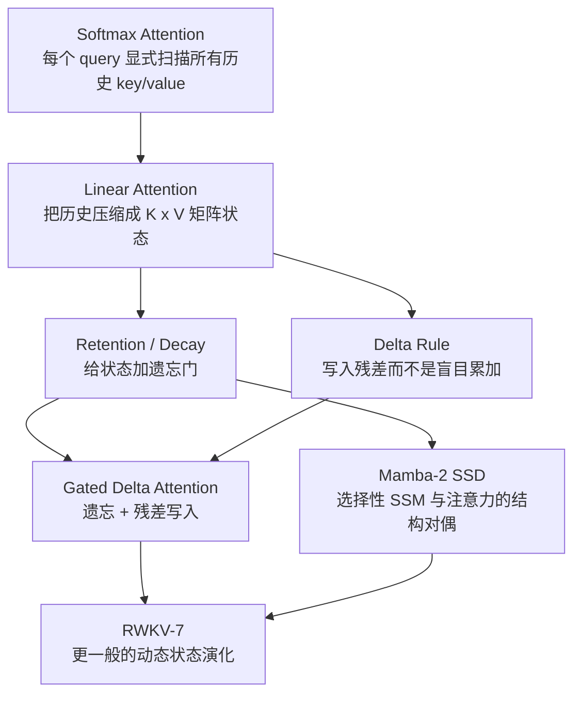
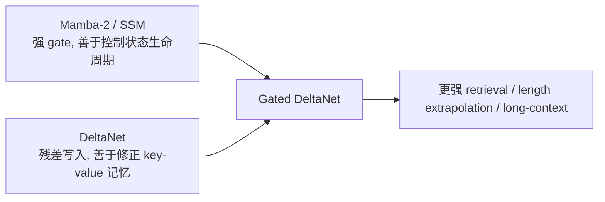
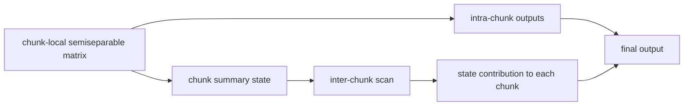
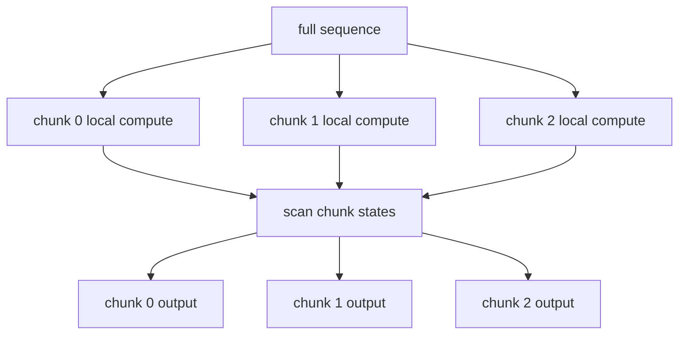

# 线性复杂度注意力家族导读：从 Linear Attention 到 Gated Delta、Mamba-2、RWKV-7

本文是一份学习笔记型文档，目标是把一批“训练或推理按序列长度线性增长”的注意力 / RNN / SSM 机制放在同一套符号下比较：

- 朴素 Linear Attention
- RetNet / 带衰减的 retention
- DeltaNet / Delta Rule fast-weight memory
- Gated Delta Attention / Gated DeltaNet
- Mamba-2 / Structured State Space Duality
- RWKV-7 / Dynamic State Evolution

读完后应该能回答三个问题：

1. 这些方法为什么都能做到 `O(T)` 级别的序列长度复杂度？
2. 它们维护的“状态”到底是什么，如何从注意力公式推导出来？
3. Gated Delta、Mamba-2、RWKV-7 的递推式差异在哪里，实际计算时如何并行化或增量解码？

> 说明：本文侧重“原理和推导”。如果你要看 Gated Delta Rule 的 chunk 算子、KKT solve、FLA / FlashQLA kernel 优化，请继续读 [gated_delta_rule_operator_guide.md](gated_delta_rule_operator_guide.md)。

## 0. 先给结论

如果只记一张图：



| 方法 | 状态 | 写入方式 | 遗忘 / 门控 | 读出方式 | 训练并行形态 | 增量解码 |
|---|---|---|---|---|---|---|
| Softmax Attention | 显式 KV cache | 不压缩，保留所有 token | attention mask | `softmax(qK^T)V` | 二次 attention kernel | KV cache 随 `T` 增长 |
| Linear Attention | `S_t in R^{d_k x d_v}`，可选 `z_t` | `S += k^T v` | 通常无 | `q S`，可归一化 | prefix-sum / scan / chunk | 常数状态 |
| RetNet | `S_t` | `S += k^T v` | 固定或多尺度 `gamma` | `q S` | parallel retention / recurrent / chunkwise | 常数状态 |
| DeltaNet | `S_t` fast weights | `S += beta k^T(v - kS)` | 通常无或弱 | `q S` | chunkwise triangular solve | 常数状态 |
| Gated DeltaNet | `S_t` fast weights | residual write | `alpha_t` 快速擦除 | `q S` | chunkwise solve + scan | 常数状态 |
| Mamba-2 | SSM state，常可写成矩阵状态 | `B_t x_t^T` | `A_t` 选择性衰减 | `C_t^T h_t` | SSD block decomposition | 常数状态 |
| RWKV-7 | head 内矩阵状态 | `k_t^T v_t` 及广义 delta 项 | 动态矩阵演化 | `r_t S_t` | WKV7 kernel / chunk scan | 常数状态 |

一句话区分：

- **Softmax attention**：每一步重新查一遍历史。
- **Linear attention**：把历史压进一个固定大小的矩阵。
- **Retention / Mamba-2**：在固定矩阵状态上加入可学习 / 输入相关的衰减。
- **Delta / Gated Delta / RWKV-7**：把状态看成一个会在线学习的 fast-weight memory，不只是累加历史，而是在上下文里“修正内部模型”。

## 1. 统一符号：把注意力看成“读写一个矩阵记忆”

为了避免不同论文的行列约定互相干扰，本文统一使用下面的布局。只看单 batch、单 head：

| 符号 | 形状 | 含义 |
|---|---:|---|
| `T` | 标量 | 序列长度 |
| `q_t` | `[d_k]` | 第 `t` 个 token 的 query / read key |
| `k_t` | `[d_k]` | 第 `t` 个 token 的 write key |
| `v_t` | `[d_v]` | 第 `t` 个 token 的 value |
| `S_t` | `[d_k, d_v]` | 截止 `t` 的矩阵记忆 / fast weights |
| `o_t` | `[d_v]` | 输出 |

本文默认把向量当作行向量写，所以：

```math
o_t = q_t S_t
```

外积写入：

```math
k_t^\top v_t \in R^{d_k \times d_v}
```

许多论文会采用转置布局。例如 Gated DeltaNet 和 RWKV-7 论文里常写 `S_t in R^{d_v x d_k}`、写入 `v_t^\top k_t`，读出再转置。本文为了和 [gated_delta_rule_operator_guide.md](gated_delta_rule_operator_guide.md) 的 `S: K x V` 约定一致，会把这些公式转置到 `S_t in R^{d_k x d_v}` 后再比较。

图上看是这样：

```text
                 write
          k_t^T -------- v_t
             \            |
              \           v
               +----> S_t: d_k x d_v
                       |
                       | read by q_t
                       v
                     o_t
```

这个视角非常重要：很多“线性注意力”“SSM”“RWKV”论文表面公式差异很大，但核心都可以理解成：

```math
S_t = \text{evolve}(S_{t-1}, x_t)
```

```math
o_t = \text{read}(S_t, x_t)
```

复杂度线性的关键是：`S_t` 的大小只依赖 `d_k, d_v, d_state`，不随 `T` 增长。

## 2. Softmax Attention 为什么是二次复杂度

标准 causal self-attention：

```math
o_t =
\sum_{i \le t}
\frac{\exp(q_t k_i^\top)}
{\sum_{j \le t}\exp(q_t k_j^\top)}
v_i
```

矩阵形式：

```math
O = \operatorname{softmax}(QK^\top + M)V
```

其中 `QK^T` 是 `T x T` 矩阵，`M` 是 causal mask。

```text
T tokens query
     |
     v
┌─────────────────────┐
│ QK^T attention map  │  shape: T x T
│ *                   │
│ * *                 │
│ * * *               │
│ * * * *             │
└─────────────────────┘
     |
     v
weighted sum over V
```

即使使用 FlashAttention，语义上仍要处理每个 query 与每个历史 key 的匹配，只是通过 tiling 和重计算降低 HBM IO。因此它对序列长度的计算量仍是 `O(T^2 d_k)`。

线性复杂度方法要解决的问题是：不要显式构造 `T x T` score 矩阵。

## 3. 朴素 Linear Attention：把历史先求和

### 3.1 从 kernel trick 推导

softmax attention 的麻烦在于：

```math
\exp(q_t k_i^\top)
```

依赖 `q_t` 和每一个历史 `k_i` 的两两交互。Linear Attention 用特征映射近似或替代这个核：

```math
\exp(q_t k_i^\top)
\approx
\phi(q_t)\phi(k_i)^\top
```

代入 attention：

```math
o_t =
\frac{
\sum_{i \le t} \phi(q_t)\phi(k_i)^\top v_i
}{
\sum_{i \le t} \phi(q_t)\phi(k_i)^\top
}
```

把与 `i` 有关的部分提前聚合：

```math
S_t = \sum_{i \le t}\phi(k_i)^\top v_i
```

```math
z_t = \sum_{i \le t}\phi(k_i)
```

则：

```math
o_t =
\frac{\phi(q_t)S_t}
{\phi(q_t)z_t^\top + \epsilon}
```

递推形式：

```math
S_t = S_{t-1} + \phi(k_t)^\top v_t
```

```math
z_t = z_{t-1} + \phi(k_t)
```

### 3.2 为什么复杂度线性

每个 token 只做两件事：

1. 用 `k_t, v_t` 更新固定大小的 `S_t`。
2. 用 `q_t` 读取固定大小的 `S_t`。

```text
token 1 --> update S --> read
token 2 --> update S --> read
token 3 --> update S --> read
...
token T --> update S --> read
```

如果 `d_k, d_v` 固定，则序列长度复杂度是：

```math
O(T d_k d_v)
```

### 3.3 朴素实现

```python
import torch

def causal_linear_attention(q: torch.Tensor, k: torch.Tensor, v: torch.Tensor) -> torch.Tensor:
    """q/k: [T, d_k], v: [T, d_v]."""
    state = torch.zeros(k.shape[-1], v.shape[-1], device=v.device, dtype=v.dtype)
    norm = torch.zeros(k.shape[-1], device=v.device, dtype=v.dtype)
    outs = []

    for t in range(q.shape[0]):
        kt = torch.relu(k[t]) + 1.0
        qt = torch.relu(q[t]) + 1.0
        state = state + torch.outer(kt, v[t])
        norm = norm + kt
        denom = torch.dot(qt, norm).clamp_min(1e-6)
        outs.append(qt @ state / denom)

    return torch.stack(outs, dim=0)
```

朴素 Linear Attention 的短板也很清楚：`S_t` 是一路累加，缺少“删除错误记忆”的机制。长上下文里，状态容易被旧信息污染。

## 4. 加遗忘：Retention / Decay 是最直接的门控

### 4.1 固定衰减的递推

给线性 attention 的状态加一个衰减系数 `0 < gamma <= 1`：

```math
S_t = \gamma S_{t-1} + k_t^\top v_t
```

读出：

```math
o_t = q_t S_t
```

展开递推：

```math
S_t =
\sum_{i \le t}
\gamma^{t-i} k_i^\top v_i
```

因此：

```math
o_t =
\sum_{i \le t}
\gamma^{t-i}
(q_t k_i^\top)v_i
```

这就是一个带指数衰减位置 bias 的线性 attention。

```text
past token i:  t-5   t-4   t-3   t-2   t-1   t
decay weight:  g^5   g^4   g^3   g^2   g^1   1
```

RetNet 的 retention 机制可以用 parallel、recurrent、chunkwise recurrent 三种等价形态计算，核心也是把：

```math
(QK^\top) \odot D
```

里的衰减矩阵 `D` 改写成递推状态。

### 4.2 从固定衰减到输入相关 gate

固定 `gamma` 的表达力有限。更一般地，每个 token 产生自己的衰减：

```math
S_t = \alpha_t S_{t-1} + k_t^\top v_t
```

其中 `alpha_t` 可以是：

- 标量：整个 head 同步遗忘。
- 向量：不同 state channel 有不同遗忘速度。
- 矩阵或低秩矩阵：状态按输入动态旋转、擦除、增强。

展开：

```math
S_t =
\sum_{i \le t}
\left(\prod_{j=i+1}^{t}\alpha_j\right)
k_i^\top v_i
```

这里的累积乘积就是很多 gated recurrent / SSM 算子里反复出现 `cumsum(log gate)` 和 `exp(g_i - g_j)` 的原因。数值上通常在 log 空间里累计：

```math
g_t = \log \alpha_t
```

```math
\prod_{j=i+1}^{t}\alpha_j
=
\exp\left(\sum_{j=i+1}^{t}g_j\right)
```

## 5. Delta Rule：把“写入”变成在线修正

### 5.1 朴素累加的问题

朴素线性 attention 写入：

```math
S_t = S_{t-1} + k_t^\top v_t
```

无论状态里是否已经能读出 `v_t`，都会继续写入一次。这会导致两个问题：

- 相同或相近 key 的 value 多次叠加。
- 如果旧 value 是错的，只靠累加很难“替换”它。

Delta Rule 的想法是：先看当前状态对 `k_t` 已经记住了什么，再只写入残差。

### 5.2 从最小二乘目标推导

把 `S` 看成一个线性模型：

```math
\hat v_t = k_t S
```

希望当前 key 能读出目标 value：

```math
\mathcal L_t(S)
=
\frac{1}{2}\lVert v_t - k_t S\rVert_2^2
```

对 `S` 求梯度：

```math
\nabla_S \mathcal L_t
=
k_t^\top(k_t S - v_t)
```

做一步梯度下降：

```math
S_t =
S_{t-1}
-
\beta_t
k_t^\top(k_t S_{t-1} - v_t)
```

整理：

```math
S_t =
S_{t-1}
+
\beta_t k_t^\top(v_t - k_t S_{t-1})
```

令：

```math
\hat v_t = k_t S_{t-1}
```

得到 Delta Rule：

```math
S_t =
S_{t-1}
+
\beta_t k_t^\top(v_t - \hat v_t)
```

### 5.3 直觉

```text
current key k_t
      |
      v
 read old memory: v_hat = k_t S_{t-1}
      |
      v
 residual: e_t = v_t - v_hat
      |
      v
 write correction: S_t = S_{t-1} + beta k_t^T e_t
```

这和 fast-weight programmer 的视角一致：`S_t` 不是普通 hidden state，而是一组上下文内快速变化的权重。

### 5.4 朴素实现

```python
import torch

def delta_rule(q: torch.Tensor, k: torch.Tensor, v: torch.Tensor, beta: torch.Tensor) -> torch.Tensor:
    """q/k: [T, d_k], v: [T, d_v], beta: [T] or [T, 1]."""
    state = torch.zeros(k.shape[-1], v.shape[-1], device=v.device, dtype=v.dtype)
    outs = []

    for t in range(q.shape[0]):
        pred = k[t] @ state
        err = v[t] - pred
        state = state + beta[t] * torch.outer(k[t], err)
        outs.append(q[t] @ state)

    return torch.stack(outs, dim=0)
```

Delta Rule 比朴素累加更会“修正记忆”，但仍缺少快速整体遗忘。遇到需要重置上下文、切换话题、丢弃旧事实的场景，仅靠 residual write 不够。

## 6. Gated Delta Attention / Gated DeltaNet：遗忘 + 残差写入

Gated Delta Rule 把前两条路线合并：

- gate / decay 负责快速擦除历史状态；
- delta update 负责针对当前 key 精准修正。

### 6.1 递推公式

先对旧状态做遗忘：

```math
\tilde S_t = \alpha_t S_{t-1}
```

再用 delta residual 写入：

```math
\hat v_t = k_t \tilde S_t
```

```math
S_t =
\tilde S_t
+
\beta_t k_t^\top(v_t - \hat v_t)
```

最后读出：

```math
o_t = q_t S_t
```

合在一起：

```math
S_t =
\alpha_t S_{t-1}
+
\beta_t k_t^\top
\left(v_t - k_t\alpha_t S_{t-1}\right)
```

有些文档会把 residual 里的旧状态写成 `S_{t-1}`，有些实现会先 decay 再 read。二者的符号差异可以通过把 `S_{t-1}` 替换为 `\tilde S_t` 对齐。本文采用“先 decay，再读 residual”的写法，因为它和常见 Gated DeltaNet / Qwen3-Next 风格代码更接近。

### 6.2 和 Mamba-2 的关系

Mamba-2 的 selective SSM 有很强的 gate / decay 能力，但写入本质更接近：

```math
h_t = A_t h_{t-1} + B_t x_t^\top
```

Gated DeltaNet 的观察是：gate 和 delta rule 是互补的。



### 6.3 为什么 chunk 内需要 triangular solve

逐 token 递推时，第 `t` 个 token 的 residual：

```math
v_t - k_t \tilde S_t
```

依赖前面 token 已经写进同一个 chunk 的内容。因此训练时不能简单把所有 token 的写入互相独立地并行。

对一个 chunk 内的 `C` 个 token，可以把这些相互依赖写成下三角系统：

```math
(I + L)X = Y
```

其中 `L` 来自：

```math
\beta_i \langle k_i, k_j\rangle
\exp(\gamma_i - \gamma_j),
\quad i > j
```

`I + L` 是单位下三角矩阵，所以可以用 triangular solve 或专门 kernel 高效求解。

```text
chunk size C = 64

token dependency inside chunk:

0  .  .  .  .
1  1  .  .  .
2  2  2  .  .
3  3  3  3  .
4  4  4  4  4

strictly lower triangular dependency
```

这就是为什么 Gated Delta Rule 的高性能实现通常是：

```text
chunk-local gate cumsum
       |
       v
KKT / triangular solve
       |
       v
chunk state scan + output
```

### 6.4 朴素实现

```python
import torch

def gated_delta_rule(
    q: torch.Tensor,
    k: torch.Tensor,
    v: torch.Tensor,
    alpha: torch.Tensor,
    beta: torch.Tensor,
) -> torch.Tensor:
    """q/k: [T, d_k], v: [T, d_v], alpha/beta: [T] or broadcastable."""
    state = torch.zeros(k.shape[-1], v.shape[-1], device=v.device, dtype=v.dtype)
    outs = []

    for t in range(q.shape[0]):
        state = alpha[t] * state
        pred = k[t] @ state
        err = v[t] - pred
        state = state + beta[t] * torch.outer(k[t], err)
        outs.append(q[t] @ state)

    return torch.stack(outs, dim=0)
```

注意：这段代码适合理解语义，不适合训练大模型。真实训练会用 chunkwise parallel kernel，否则 token 级 Python loop 会非常慢。

## 7. Mamba-2：SSM 与 Attention 的结构对偶

Mamba-2 的核心不是直接说“我是 attention”，而是从 selective state space model 出发，再通过 Structured State Space Duality 说明它和一类结构化 attention 矩阵是等价的。

### 7.1 最小 SSM 递推

一个简化的 selective SSM 可以写成：

```math
h_t = A_t h_{t-1} + B_t x_t^\top
```

```math
y_t = C_t^\top h_t
```

其中：

- `x_t` 是输入 value-like 向量，形状 `[d_v]`。
- `B_t, C_t` 是输入相关的 state mixing 向量，形状 `[d_state]`。
- `A_t` 是输入相关的衰减，Mamba-2 的 SSD minimal form 常把它约束成 head 内 scalar times identity，便于高效计算。
- `h_t` 可以看成 `[d_state, d_v]` 的矩阵状态。

这和前文的 `S_t` 很像，只是把 `k/q` 换成了 `B/C`：

| Linear attention 视角 | Mamba-2 SSD 视角 |
|---|---|
| write key `k_t` | input-dependent `B_t` |
| read query `q_t` | input-dependent `C_t` |
| value `v_t` | input `x_t` |
| state `S_t` | SSM state `h_t` |
| decay `alpha_t` | transition `A_t` |

### 7.2 展开后就是带 decay mask 的 attention

展开递推：

```math
h_t =
\sum_{i \le t}
\left(\prod_{j=i+1}^{t} A_j\right)
B_i x_i^\top
```

读出：

```math
y_t =
\sum_{i \le t}
\left(C_t^\top B_i\right)
\left(\prod_{j=i+1}^{t} A_j\right)
x_i
```

这已经很像 attention：

```math
y_t =
\sum_{i \le t}
\text{score}(t,i) x_i
```

其中：

```math
\text{score}(t,i)
=
\left(C_t^\top B_i\right)
\left(\prod_{j=i+1}^{t} A_j\right)
```

也就是说，Mamba-2 的 score 不是 softmax，而是：

```text
content term: C_t^T B_i
position / recurrence term: cumulative product of A_j
```

### 7.3 SSD 为什么适合 GPU

如果逐 token 算 SSM：

```text
h_0 -> h_1 -> h_2 -> ... -> h_T
```

推理很自然，但训练串行依赖太强。SSD 把长序列切成块：

```text
chunk 0       chunk 1       chunk 2
0..C-1   |   C..2C-1   |   ...
```

每个 chunk 内做结构化矩阵计算，chunk 间做 scan：



这和 Gated Delta Rule 的 chunkwise 形态很像，但具体矩阵不同：

- Mamba-2 的 chunk 矩阵来自 `A/B/C` 的 semiseparable structure。
- Gated Delta 的 chunk 矩阵来自 delta residual 的下三角 KKT solve。

### 7.4 朴素实现

```python
import torch

def mamba2_minimal_ssd(
    x: torch.Tensor,
    A: torch.Tensor,
    B: torch.Tensor,
    C: torch.Tensor,
) -> torch.Tensor:
    """x: [T, d_v], A: [T], B/C: [T, d_state]."""
    state = torch.zeros(B.shape[-1], x.shape[-1], device=x.device, dtype=x.dtype)
    outs = []

    for t in range(x.shape[0]):
        state = A[t] * state + torch.outer(B[t], x[t])
        outs.append(C[t] @ state)

    return torch.stack(outs, dim=0)
```

真实 Mamba-2 block 还包含输入投影、depthwise causal conv、gated RMSNorm、D skip、head/group 组织、Triton fused scan 等工程结构。上面只是 SSD 核心递推。

## 8. RWKV-7：广义 Delta Rule 与动态状态演化

RWKV 系列一直强调：

- 训练时可以并行化，像 Transformer 一样喂整段序列。
- 推理时是 RNN，状态大小固定，不需要随上下文增长的 KV cache。

RWKV-7 的关键变化是把状态更新从简单 decay 推到更一般的 **Dynamic State Evolution**。

### 8.1 从 RWKV 旧版本到 v7

粗略看：

| 版本 | 状态演化直觉 |
|---|---|
| RWKV-4 / 5 | 固定或较静态的 time decay，类似多尺度 EMA |
| RWKV-6 | 输入相关 dynamic decay |
| RWKV-7 | 动态状态演化矩阵，能表达更一般的在线状态变换 |

RWKV-7 不只是：

```math
S_t = \alpha_t S_{t-1} + k_t^\top v_t
```

论文原文为了匹配官方代码，把每个 head 的 WKV 状态写成 `M_t in R^{d_v x d_k}`，所有向量都是行向量，旧状态右乘一个由输入生成的矩阵：

```math
M_t =
M_{t-1}
\left(
\operatorname{diag}(w_t) + z_t^\top b_t
\right)
+
v_t^\top \tilde k_t
```

RWKV-7 的具体参数化是：

```math
z_t = -\hat\kappa_t,\quad
b_t = a_t \odot \hat\kappa_t
```

所以：

```math
M_t =
M_{t-1}
\left(
\operatorname{diag}(w_t)
-
\hat\kappa_t^\top(a_t \odot \hat\kappa_t)
\right)
+
v_t^\top \tilde k_t
```

读出使用 receptance / read vector：

```math
p_t = r_t M_t^\top
```

把它转成本文统一的 `S_t = M_t^\top in R^{d_k x d_v}` 布局后，就是左乘动态 transition：

```math
S_t =
G_t^\top S_{t-1}
+
\tilde k_t^\top v_t
```

其中：

```math
G_t =
\left(
\operatorname{diag}(w_t)
-
\hat\kappa_t^\top(a_t \odot \hat\kappa_t)
\right)
```

读出回到：

```math
o_t = r_t S_t
```

### 8.2 它和 Delta Rule 的关系

回忆 Delta Rule：

```math
S_t =
S_{t-1}
+
\beta_t k_t^\top(v_t - k_t S_{t-1})
```

展开：

```math
S_t =
S_{t-1}
-
\beta_t k_t^\top k_t S_{t-1}
+
\beta_t k_t^\top v_t
```

如果把矩阵方向换到 RWKV-7 常用写法，可以得到类似：

```math
M_t =
M_{t-1}
\left(
I - k_t^\top k_t \operatorname{diag}(\eta_t)
\right)
+
v_t^\top k_t\operatorname{diag}(\eta_t)
```

RWKV-7 论文先给出更一般的广义状态演化：

```math
M_t =
M_{t-1}
\left(
\operatorname{diag}(w_t) + z_t^\top b_t
\right)
+
v_t^\top \tilde k_t
```

可以看成把下面两件事参数化得更灵活：

1. 旧状态怎么被保留、衰减、旋转或擦除。
2. 新 token 如何写入 state。

```mermaid
flowchart LR
    A[Delta Rule<br/>rank-1 correction from k and error] --> C[RWKV-7 generalized delta rule]
    B[Dynamic decay<br/>input-dependent state transition] --> C
    C --> D[Dynamic State Evolution<br/>diag(w) + low-rank update]
```

### 8.3 为什么说它更像“上下文内学习”

把 `S_t` 理解成一个线性模型，目标是让某个 key 能映射到某个 value：

```math
v \approx k S^\top
```

Delta Rule 是对这个模型做一步梯度下降。RWKV-7 则让这一步“梯度下降 / 状态演化”的形式由输入动态决定：

```text
token x_t
  |
  +--> r_t: read current state
  +--> k_t: where to write / train
  +--> v_t: what to write / target
  +--> w_t: per-channel decay
  +--> a_t, b_t: low-rank state evolution
  +--> g_t: output gate
```

因此 RWKV-7 的状态不只是压缩历史，而是在上下文中持续更新一个内部模型。这也是它和普通 linear attention 的关键区别。

### 8.4 朴素实现

下面是采用本文统一布局的示意代码：

```python
import torch

def rwkv7_state_update(
    r: torch.Tensor,
    k: torch.Tensor,
    v: torch.Tensor,
    w: torch.Tensor,
    kappa: torch.Tensor,
    lr: torch.Tensor,
) -> torch.Tensor:
    """All tensors are [T, d]. State uses this document's [key, value] layout."""
    state = torch.zeros(k.shape[-1], v.shape[-1], device=v.device, dtype=v.dtype)
    outs = []

    for t in range(k.shape[0]):
        kappa_hat = kappa[t] / kappa[t].norm().clamp_min(1e-6)
        transition_right = torch.diag(w[t]) - torch.outer(kappa_hat, lr[t] * kappa_hat)
        state = transition_right.T @ state + torch.outer(k[t], v[t])
        outs.append(r[t] @ state)

    return torch.stack(outs, dim=0)
```

如果改用 RWKV 论文 / 官方 kernel 常见的 `M_t = M_{t-1}G_t + v_t^T k_t` 布局，代码中的状态应是 `[value, key]`，读出也要写成 `r_t @ M_t.T`。阅读论文和 CUDA kernel 时，第一步先确认 `state` 维度是 `[key, value]` 还是 `[value, key]`。

## 9. 五类方法放在同一条公式线上

我们用一个通用模板：

```math
S_t =
F_t(S_{t-1}) + W_t
```

```math
o_t = R_t(S_t)
```

不同方法的差别：

| 方法 | `F_t(S)`：旧状态如何演化 | `W_t`：新信息如何写入 | `R_t(S)`：如何读 |
|---|---|---|---|
| Linear Attention | `S` | `k_t^T v_t` | `q_t S` |
| RetNet | `gamma S` | `k_t^T v_t` | `q_t S` |
| Gated Linear Attention | `alpha_t S` | `k_t^T v_t` | `q_t S` |
| DeltaNet | `S - beta k_t^T k_t S` | `beta k_t^T v_t` | `q_t S` |
| Gated DeltaNet | `(I - beta k_t^T k_t) alpha_t S` | `beta k_t^T v_t` | `q_t S` |
| Mamba-2 | `A_t h` | `B_t x_t^T` | `C_t^T h` |
| RWKV-7 | `G_t^T S`，其中 `G_t = diag(w_t) - kappa_t^T(a_t odot kappa_t)` | `tilde k_t^T v_t` | `r_t S` |

再看复杂度：

| 方法 | 训练复杂度随 `T` | 推理每 token | 推理状态大小 | 是否需要 KV cache |
|---|---:|---:|---:|---|
| Softmax Attention | `O(T^2 d)` | `O(Td)` | `O(Td)` | 是 |
| FlashAttention | `O(T^2 d)`，IO 更优 | `O(Td)` | `O(Td)` | 是 |
| Linear Attention | `O(T d_k d_v)` | `O(d_k d_v)` | `O(d_k d_v)` | 否 |
| RetNet | `O(T d_k d_v)` | `O(d_k d_v)` | `O(d_k d_v)` | 否 |
| Delta / Gated Delta | `O(T d_k d_v)` 语义；训练常用 chunk solve | `O(d_k d_v)` | `O(d_k d_v)` | 否 |
| Mamba-2 | `O(T d_state d_v)` 语义；SSD 高效 chunk | `O(d_state d_v)` | `O(d_state d_v)` | 否 |
| RWKV-7 | `O(T d_h^2)` per head 语义；WKV kernel | `O(d_h^2)` | `O(d_h^2)` per head | 否 |

注意：`O(T)` 只表示“随序列长度线性”，不表示一定比 attention 快。实际速度还取决于：

- `d_k d_v` 或 `d_state d_v` 是否大。
- 是否有 fused kernel。
- chunk size 是否适合 GPU。
- 训练 batch 和 head 数能否填满 SM。
- 是否需要额外 normalization、conv、gate、projection。

## 10. 并行训练和增量解码的统一理解

线性复杂度模型通常有两种计算形态：

### 10.1 Recurrent form

适合推理：

```text
state <- update(state, x_t)
o_t   <- read(state, x_t)
```

优点：

- KV cache 不随上下文增长。
- 单 token 解码状态固定。

缺点：

- 训练时逐 token 递推会串行。

### 10.2 Parallel / chunkwise form

适合训练：

```text
sequence -> chunks -> chunk-local solve/scan -> chunk summaries -> inter-chunk scan
```



不同模型的 chunk-local compute 不一样：

| 模型 | chunk 内主要计算 |
|---|---|
| RetNet | decay mask 下的 `QK^T V` 或 recurrent chunk |
| Mamba-2 | semiseparable matrix / SSD block decomposition |
| Gated Delta | KKT-like lower triangular solve |
| RWKV-7 | WKV state evolution kernel |

## 11. 怎么从代码识别它属于哪一类

看一个新的“线性 attention”实现时，先找三件事：

### 11.1 找 state 的形状

如果看到：

```python
state = torch.zeros(num_heads, d_k, d_v)
```

通常是 linear attention / delta / RWKV-like matrix state。

如果看到：

```python
state = torch.zeros(num_heads, d_state, headdim)
```

可能是 Mamba-2 / SSD-like state。

### 11.2 找状态更新

直接累加：

```python
state = state + outer(k, v)
```

是朴素 linear attention。

先 decay：

```python
state = alpha * state + outer(k, v)
```

是 retention / gated linear attention。

先读残差再写：

```python
pred = k @ state
state = state + beta * outer(k, v - pred)
```

是 Delta Rule。

先 decay 再 delta：

```python
state = alpha * state
pred = k @ state
state = state + beta * outer(k, v - pred)
```

是 Gated Delta。

论文 / kernel 采用 `[value, key]` 布局并右乘动态 transition：

```python
wkv = wkv @ transition + outer(v, k)
```

通常是 RWKV-7 dynamic state evolution 一类。如果代码采用本文的 `[key, value]` 布局，同一件事会写成：

```python
state = transition.T @ state + outer(k, v)
```

### 11.3 找训练 kernel

如果有：

- `chunk_scan`
- `ssd_combined`
- `selective_scan`
- `kkt_solve`
- `chunk_gated_delta_rule`
- `wkv7`

基本可以确定它不是简单 Python recurrence，而是在用专门的 chunk / scan kernel 把训练并行化。

## 12. 学习路线建议

推荐按这个顺序读：

1. **朴素 Linear Attention**  
   先理解 `S_t = S_{t-1} + k_t^T v_t` 和归一化项 `z_t`。

2. **RetNet / Decay**  
   理解 `gamma^{t-i}` 如何从 parallel mask 变成 recurrent state。

3. **Delta Rule**  
   从 `L = 1/2 ||v - kS||^2` 推导在线梯度下降。

4. **Gated DeltaNet**  
   把 gate 和 delta 合并，再理解为什么 chunk 内是 triangular solve。

5. **Mamba-2 SSD**  
   用 `h_t = A_t h_{t-1} + B_t x_t^T` 展开成 attention-like sum，理解 semiseparable matrix。

6. **RWKV-7**  
   从 Delta Rule 的梯度下降视角过渡到 `diag(w)+a^T b` 的动态状态演化。

7. **Kernel 实现**  
   回到 [gated_delta_rule_operator_guide.md](gated_delta_rule_operator_guide.md)，看 Gated Delta Rule 的实际 chunk 算子如何落到 KKT solve 和 fused kernel。

## 13. 常见误区

### 13.1 “线性复杂度”不等于“无限记忆”

状态大小固定意味着模型必须把历史压缩进有限容量。它可以处理非常长的上下文流，但不保证每个历史细节都可无损找回。

Softmax attention 的 KV cache 大，但它保留了每个历史 token 的 key/value。Linear state 小，但它会发生压缩和覆盖。

### 13.2 “不需要 KV cache”不等于“没有状态”

Mamba / RWKV / Gated Delta 解码时仍然需要 state，只是 state 大小固定，不随 `T` 线性增长。

### 13.3 Mamba-2 不是普通 attention 换核

Mamba-2 从 SSM 出发，SSD 说明它和某类 attention-like structured matrix 有对偶关系。它不是简单把 softmax 换成 `relu` 或 `elu+1`。

### 13.4 RWKV-7 的矩阵方向要特别小心

RWKV 资料里经常把 state 写成 `[value, key]`，而很多 linear attention 文档写成 `[key, value]`。比较公式前先统一布局，否则 `k^T v`、`v^T k`、左乘、右乘会看起来互相矛盾。

## 14. 资料索引

- Gated Delta Networks: Improving Mamba2 with Delta Rule, arXiv 2412.06464: <https://arxiv.org/abs/2412.06464>
- GatedDeltaNet 官方实现: <https://github.com/NVlabs/GatedDeltaNet>
- Transformers are SSMs: Generalized Models and Efficient Algorithms Through Structured State Space Duality, arXiv 2405.21060: <https://arxiv.org/abs/2405.21060>
- Mamba 官方实现，`mamba_ssm/modules/mamba2.py`: <https://github.com/state-spaces/mamba/blob/main/mamba_ssm/modules/mamba2.py>
- RWKV-7 "Goose" with Expressive Dynamic State Evolution, arXiv 2503.14456: <https://arxiv.org/abs/2503.14456>
- RWKV-LM 官方仓库: <https://github.com/BlinkDL/RWKV-LM>
- RWKV 架构历史说明: <https://wiki.rwkv.com/advance/architecture.html>
- Retentive Network: A Successor to Transformer for Large Language Models, arXiv 2307.08621: <https://arxiv.org/abs/2307.08621>
- Linear Transformers Are Secretly Fast Weight Memory Systems, ICML 2021: <https://proceedings.mlr.press/v139/schlag21a.html>
- Transformers are RNNs: Fast Autoregressive Transformers with Linear Attention, ICML 2020: <https://proceedings.mlr.press/v119/katharopoulos20a.html>
