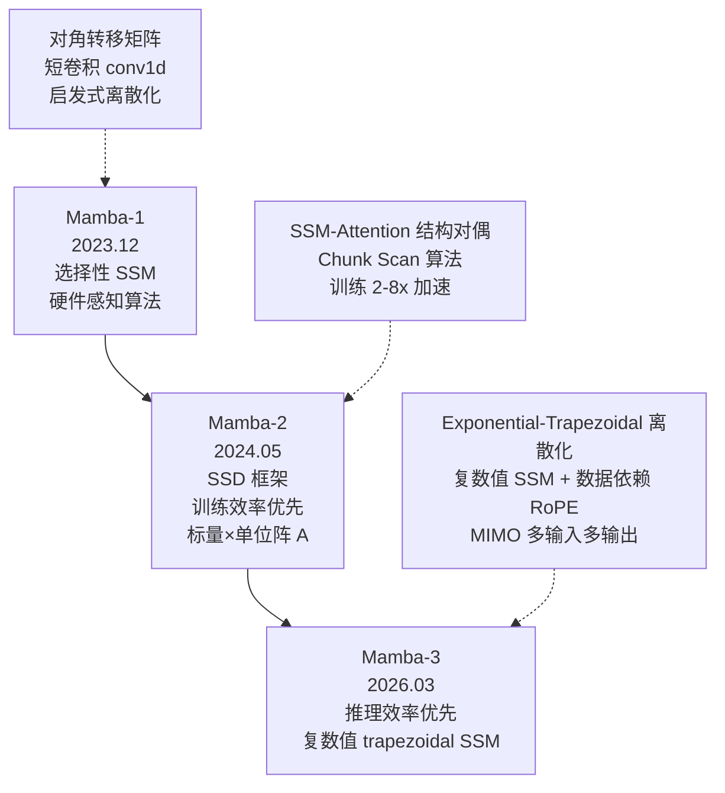
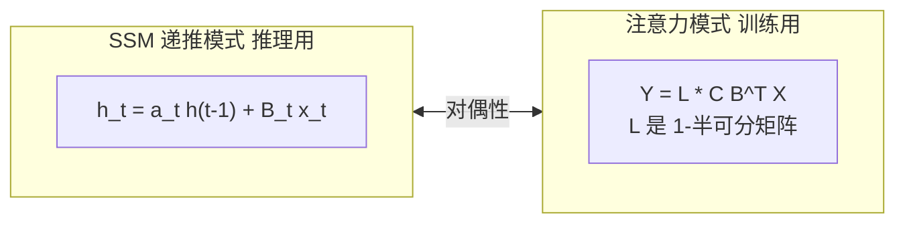
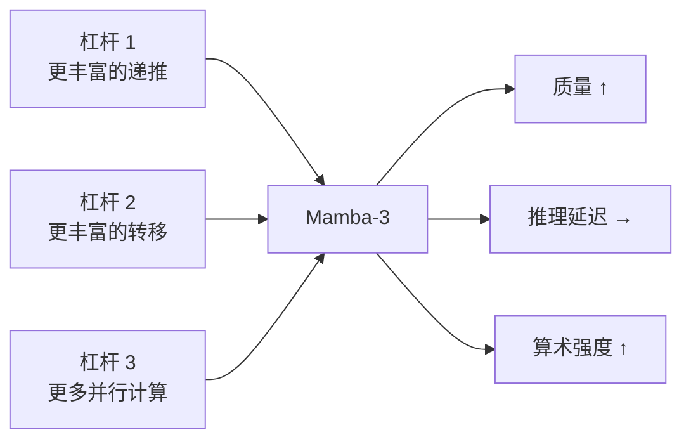
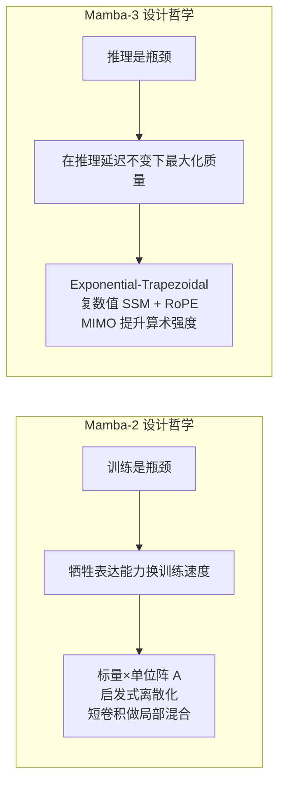
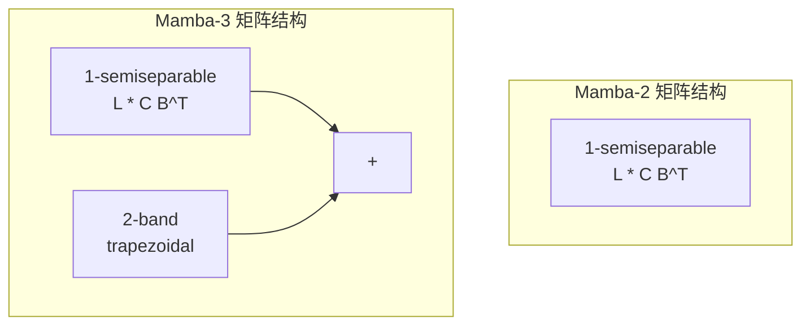
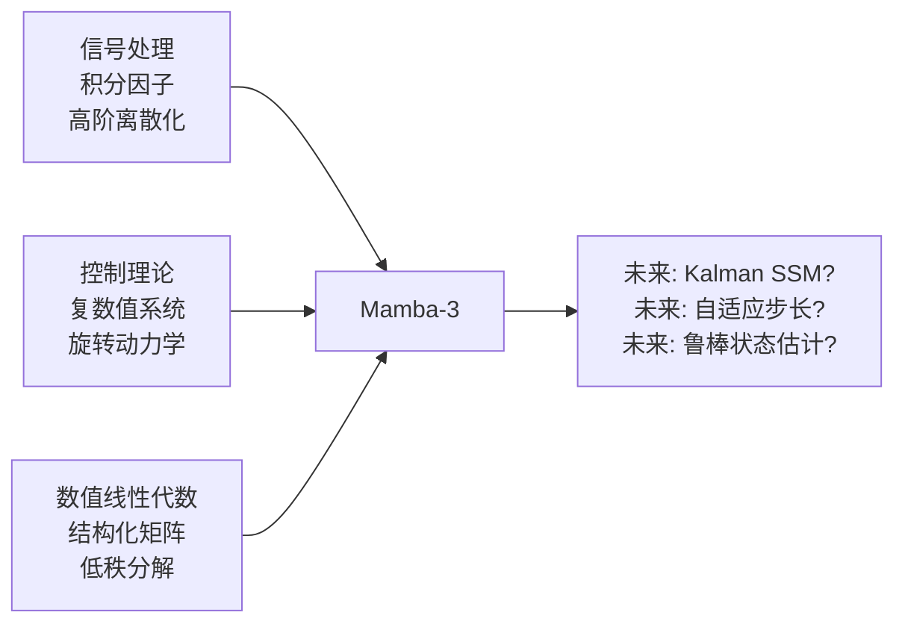

# Mamba-3 深度解析：从 Mamba-2 到 Mamba-3 的技术跃迁

Mamba-3 是状态空间模型（SSM）系列的最新力作，由 CMU、Princeton、Together AI 和 Cartesia AI 联合提出，发表于 **ICLR 2026**（arXiv:2603.15569）。本文是学习笔记型文档，目标是：

1. 讲清楚 Mamba-3 相比 Mamba-2 做了哪些根本性的改变，为什么要做这些改变
2. 逐一拆解三大核心创新（Exponential-Trapezoidal 离散化、复数值 SSM + RoPE、MIMO）的数学原理与实现技巧
3. 用统一的符号体系对比 Mamba-2 和 Mamba-3，给出直观理解

阅读本文前，建议先读完 [linear_attention_family_guide.md](linear_attention_family_guide.md) 的第 1–7 节，对线性注意力家族和 Mamba-2 的 SSD 框架有基本了解。本文会直接沿用那里的符号体系。

> 本文侧重"原理与对比"。如果你要看 Gated Delta Rule / FLA kernel 优化，请读 [gated_delta_rule_operator_guide.md](gated_delta_rule_operator_guide.md)。

## 0. 核心摘要与演进图谱

如果只记一张图：



一句话概括三代 Mamba：

| 版本 | 设计哲学 | 核心贡献 | 最大局限 |
|------|---------|---------|---------|
| **Mamba-1** | SSM 首次高效化 | 选择性机制 + 硬件感知 scan | 训练慢、状态维度小 |
| **Mamba-2** | 让训练飞起来 | SSD = SSM × Attention 对偶 + Tensor Cores | 推理效率低、无法 state-tracking |
| **Mamba-3** | 推理为王 | 三大杠杆同时拉满，质量/速度 Pareto 最优 | 训练比 Mamba-2 略慢（MIMO 模式） |

Mamba-3 的**三个核心杠杆**：

| 杠杆 | 对应创新 | 解决的问题 | 一句话 |
|------|---------|-----------|--------|
| **更丰富的递推** | Exponential-Trapezoidal 离散化 | 移除了短卷积，递推本身就能混合时间信息 | "让每一步做得更多" |
| **更丰富的状态转移** | 复数值 SSM / RoPE trick | 让状态能旋转、追踪交替模式（parity） | "让状态动起来" |
| **更多并行计算** | MIMO | 利用 GPU 空闲算力，不增加延迟 | "用闲置的算力换质量" |

---

## 1. 背景回顾：从 Mamba-1 到 Mamba-2 的五分钟速览

如果你已经读过 [linear_attention_family_guide.md §7](linear_attention_family_guide.md)，本节可以跳过。这里只回顾与理解 Mamba-3 直接相关的几个关键点。

### 1.1 统一符号：把 SSM 放入线性注意力的框架

从 [linear_attention_family_guide.md §1](linear_attention_family_guide.md) 继承的符号体系：

| SSM 符号 | 线性注意力符号 | 形状 | 含义 |
|---------|-------------|---:|---|
| `x_t` | `v_t` | `[d_v]` | 输入 / value |
| `B_t` | `k_t` | `[d_state]` | 输入投影 / write key |
| `C_t` | `q_t` | `[d_state]` | 输出投影 / read query |
| `h_t` | `S_t` | `[d_state, d_v]` | 隐状态 / 矩阵记忆 |
| `A_t`/`a_t` | `α_t` | 标量或矩阵 | 状态衰减 / gate |

Mamba-2 SSD 的核心递推：

```math
h_t = a_t h_{t-1} + B_t x_t^\top
```

```math
y_t = C_t^\top h_t
```

其中 `a_t` 是**标量**（scalar-times-identity），这一点至关重要——正是这个简化使得 SSD 的对偶性成立。

### 1.2 Mamba-2 的 SSD 框架做了什么

SSD（Structured State Space Duality）有三个方面：

1. **SSD 模型**：上述递推定义的具体神经网络层。
2. **SSD 框架**：证明该递推等价于一族"带 decay mask 的线性注意力"。
3. **SSD 算法**：Chunk Scan——块内用矩阵乘法（Tensor Cores），块间做 scan，训练比 Mamba-1 快 2–8 倍。



### 1.3 Mamba-2 为训练速度付出的代价

Mamba-2 把 `A_t` 从 Mamba-1 的对角矩阵进一步简化为标量，换来了训练加速，但也埋下了三个隐患：

```text
隐患 1: 状态转移表达能力弱
  A_t 只能是沿每个通道的独立衰减，无法表达旋转、振荡等更丰富的动力学。

隐患 2: 无法解决 state-tracking 任务
  最简单的 parity（奇偶校验）：给定 0/1 序列，判断和是奇数还是偶数。
  解法需要状态交替变换，但 Mamba-2 的状态只会单调衰减。

隐患 3: 解码阶段算术强度极低
  推理时 h_t 是 [d_state × d_v] 的外积更新，d_state=128, d_v=64
  算术强度 ≈ 2.5 FLOPs/byte，H100 计算上限 ≈ 300
  → GPU 张量核心 99% 时间在等待数据传输
```

Mamba-3 就是针对这三个隐患逐一击破。

---

## 2. 为什么需要 Mamba-3：推理时代的范式转变

### 2.1 2025→2026：LLM 格局的根本变化

Mamba-2 优化训练速度的假设在 2024 年成立——当时最大的瓶颈确实是预训练。但到 2025–2026 年：

```text
预训练 (一次性)          →  后训练 + 推理 (反复运行的)
─────────────────────        ───────────────────────────
1 次 300B token 训练         RLVR rollout × 百万次
                             批量 Serving × 7×24
                             Agentic 工作流 × 每任务数十轮
```

Tri Dao 在博客中给出的核心问题：

> "What would an SSM designed with **inference** in mind look like?"

### 2.2 用算术强度理解问题

算术强度（Arithmetic Intensity）= FLOPs / bytes accessed。H100 的计算上限约 300 FLOPs/byte。

```text
            算术强度            状态说明
Mamba-2      2.5     ████     解码时 GPU 张量核心几乎全空闲
Transformer  30–50   ████████████████████
H100 上限    300     ████████████████████████████████████████████████
```

Mamba-2 解码的算术强度仅 2.5——这意味着每次从 HBM 读取 1 byte，只做 2.5 次浮点运算。而 H100 的 Tensor Cores 可以做 300 次。**GPU 的计算资源被严重浪费了**。

Transformer 虽然注意力是二次复杂度，但矩阵乘法密集，算术强度高，GPU 利用率好。Mamba-3 的目标是在保持线性复杂度的前提下，把算术强度提上来。

### 2.3 三个可调节的杠杆

既然线性模型的固定大小隐状态既是优势（线性复杂度）也是劣势（强制压缩），在不增加状态大小的前提下如何让它做更多事？

Mamba-3 的作者识别出三个可调节的杠杆：

```text
杠杆 1: 让递推本身做更多
  旧: h_t = a_t h_{t-1} + B_t x_t       (每步只看当前 token)
  新: h_t = a_t h_{t-1} + β B_{t-1} x_{t-1} + γ B_t x_t  (跨步混合)
  → Exponential-Trapezoidal 离散化

杠杆 2: 让转移矩阵更丰富
  旧: A_t = a_t · I                     (只能衰减)
  新: A_t = a_t · Rotation(θ_t)         (能衰减 + 旋转)
  → 复数值 SSM / 数据依赖 RoPE

杠杆 3: 在每次更新中做更多并行计算
  旧: 外积 h_t = a_t h_{t-1} + B_t x_t^⊤   (B_t 是向量)
  新: 矩阵乘 h_t = a_t h_{t-1} + B_t x_t^⊤  (B_t 是矩阵)
  → MIMO
```



这三个杠杆的核心设计约束是：**提升质量的同时，不能让推理延迟变差**。接下来三节逐一拆解。

---

## 3. 创新一：Exponential-Trapezoidal 离散化

### 3.1 离散化的历史包袱

连续时间 SSM 的定义是：

```math
\dot{h}(t) = A(t) h(t) + B(t) x(t), \quad y(t) = C(t)^\top h(t)
```

把它变成计算机能算的离散递推，需要**离散化**——选择采样时刻 τ_t，把微分方程近似为差分方程。

Mamba-1 声称使用**零阶保持（ZOH）**，实际实现却是：

```math
\bar{A}_t = \exp(\Delta_t A_t), \quad \bar{B}_t = \Delta_t B_t
```

这个公式是 ZOH 和 Euler 方法的**拼凑**——理论基础不牢。社区早就发现了这个问题：[GitHub issue #129](https://github.com/state-spaces/mamba/issues/129)。

### 3.2 积分因子法：被忽略的正确方法

对 `h'(t) = A(t) h(t) + B(t) x(t)` 应用积分因子 `e^{\int -A(s)ds}`，得到精确解：

```math
h(\tau_t) = \exp\!\left(\int_{\tau_{t-1}}^{\tau_t} A(s)ds\right) h(\tau_{t-1}) \;+\; \int_{\tau_{t-1}}^{\tau_t} \exp\!\left(\int_{\tau}^{\tau_t} A(s)ds\right) B(\tau) x(\tau) d\tau
```

这分离出两个独立的部分：

```text
┌─────────────────────────────────────────┐
│ h_t = α_t · h_{t-1}   +   InputIntegral │
│       ↑                         ↑       │
│   状态转移积分              状态输入积分  │
│   (用右端点近似即可)       (需要近似！)   │
└─────────────────────────────────────────┘
```

- **状态转移积分** α_t = exp(Δ_t A_t) ——用右端点近似即可，这是 Mamba-1/2 都做对的部分
- **状态输入积分** ——这才是离散化方案的核心差异所在，也是之前被忽略的部分

### 3.3 从 Euler 到 Trapezoidal

有了积分因子框架，不同离散化方案只是对"状态输入积分"的不同近似：

**Euler 方法**（一阶，Mamba-1/2 实际使用的）：
```math
\int \approx \Delta_t B_t x_t
```

截断误差 O(Δ_t²)。

**Exponential-Trapezoidal 方法**（二阶，Mamba-3 引入）：
使用数据依赖的凸组合 λ_t ∈ [0,1] 来近似区间两端点：

```math
\int \approx (1 - \lambda_t) \Delta_t e^{\Delta_t A_t} B_{t-1} x_{t-1} \;+\; \lambda_t \Delta_t B_t x_t
```

整理得到 Mamba-3 的递推公式：

```math
\boxed{h_t = \alpha_t h_{t-1} + \beta_t B_{t-1} x_{t-1} + \gamma_t B_t x_t}
```

其中：
- `α_t = e^{Δ_t A_t}` ——状态衰减
- `β_t = (1 − λ_t) Δ_t e^{Δ_t A_t}` ——前一步输入的权重
- `γ_t = λ_t Δ_t` ——当前步输入的权重
- `λ_t ∈ [0,1]` ——数据依赖的可学习凸组合参数

**截断误差** O(Δ_t³)，比 Euler 高一阶。

### 3.4 对比：Mamba-2 vs Mamba-3 递推

```text
Mamba-2:
  h_t = α_t h_{t-1} + γ_t B_t x_t
                    ↑ 只有当前 token 的 B

Mamba-3:
  h_t = α_t h_{t-1} + β_t B_{t-1} x_{t-1} + γ_t B_t x_t
                    ↑ 前一步的 B            ↑ 当前步的 B
```

关键差异在于 `β_t B_{t-1} x_{t-1}` 这一项——每次状态更新不仅看当前 token，还会看前一个 token 通过 `B_{t-1}` 投影后的贡献。这引入了**跨时间步的结构化混合**。

### 3.5 隐式卷积：告别短卷积

自 H3 / RWKV-4 以来，几乎所有高性能线性模型都在 SSM 前加一个**短因果卷积**（kernel size = 4）：

```text
Mamba-1/2:  input → conv1d(kernel=4) → SiLU → SSM
```

这个短卷积的职责是在进入 SSM 之前做局部时间混合。但它是**额外组件**，增加了参数和计算。

Mamba-3 的 exponential-trapezoidal 递推展开后，可以证明它在 B/C 上施加了一个**隐式的、数据依赖的 2-卷积**：

```math
h_t = \alpha_t h_{t-1} + B_t x_t + B_{t-1} x_{t-1} \quad \text{(示意)}
```

结合后面将介绍的 B/C 偏置（见 §6），这个隐式卷积的效果已经足够强大，使得 **Mamba-3 是第一个在不损失性能的前提下完全移除短卷积的线性模型**。

### 3.6 并行表示与 SSD 的推广

Mamba-2 的 SSD 本质：SSM 序列变换等价于 `Y = M X`，其中 M 是 1-半可分矩阵（1-semiseparable）。

Mamba-3 的递推依然可以表示为 `Y = M' X`，其中 M' 可以分解为：

```text
M' = M₁₋SS + M₂₋band

M₁₋SS:  1-半可分矩阵（来自 α 的衰减，同 Mamba-2）
M₂₋band: 2-带矩阵（来自 trapezoidal 的 β/γ 带来的卷积效应）
 ```

这意味着 Mamba-3 依然可以利用 chunk-scan 式算法高效训练——块内用矩阵乘法，块间做 scan，享受 Tensor Cores 加速。

### 3.7 朴素实现

```python
import torch


def mamba2_step_euler(h, x, x_prev, a, b, c, gamma):
    """Mamba-2 Euler 风格的单步递推（对比用）。"""
    h = a * h + gamma * torch.outer(b, x)
    y = c @ h
    return y, h


def mamba3_step_trapezoidal(h, x, x_prev, a, b, b_prev, c, alpha, beta, gamma):
    """Mamba-3 Exponential-Trapezoidal 单步递推。"""
    h = alpha * h + beta * torch.outer(b_prev, x_prev) + gamma * torch.outer(b, x)
    y = c @ h
    return y, h


def mamba3_scan(x_seq, a_seq, b_seq, c_seq, alpha_seq, beta_seq, gamma_seq):
    """完整的 Exponential-Trapezoidal SSM 扫描。"""
    T, d_v = x_seq.shape
    d_state = b_seq.shape[-1]
    h = torch.zeros(d_state, d_v, device=x_seq.device, dtype=x_seq.dtype)
    outs = []

    x_prev = torch.zeros_like(x_seq[0])
    b_prev = torch.zeros_like(b_seq[0])

    for t in range(T):
        y, h = mamba3_step_trapezoidal(
            h, x_seq[t], x_prev,
            a_seq[t], b_seq[t], b_prev,
            c_seq[t],
            alpha_seq[t], beta_seq[t], gamma_seq[t],
        )
        outs.append(y)
        x_prev = x_seq[t]
        b_prev = b_seq[t]

    return torch.stack(outs, dim=0)
```

> 真实训练使用 chunked parallel kernel，上面的 for-loop 只是为了理解语义。

---

## 4. 创新二：复数值 SSM 与数据依赖 RoPE

### 4.1 一个问题：Mamba-2 为什么做不了 Parity？

**Parity（奇偶校验）** 任务：给定一段 0/1 序列，判断其中 1 的个数是奇数还是偶数。

```text
序列:   1  0  1  1  0  1
奇偶:   奇 奇 偶 奇 奇 偶
```

解法极其简单——需要一个能**交替翻转**的状态：

```math
h_t = R(\pi x_t) h_{t-1}
```

其中 `R(·)` 是旋转矩阵。当 x_t = 1 时翻转，x_t = 0 时保持。这是一个**纯旋转动力学**。

但 Mamba-2 的转移矩阵被约束在 `[0, 1]` 范围内（在 log-space 中通过 softplus 处理以保证稳定性）——**它只能单调衰减，不能旋转**。因此 Mamba-2 完全无法解决 parity。

```text
Mamba-2 的状态转移:  a_t ∈ [0, 1]
                     → 只能衰减，不能翻转

Parity 需要的转移:   R(θ_t) = 旋转矩阵
                     → 需要振荡能力
```

### 4.2 复数值 SSM：让状态会旋转

Mamba-3 把底层 SSM 建模为**复数值**系统：

```math
\dot{h}(t) = \operatorname{Diag}(A(t) + i\theta(t)) h(t) + (B(t) + i\hat{B}(t)) x(t)
```

```math
y(t) = \operatorname{Re}\!\left((C(t) + i\hat{C}(t))^\top h(t)\right)
```

这看起来像是凭空增加了复杂性，但论文的 **Proposition 2** 给出了一个极其优雅的结论：

> 对角复数值连续 SSM 可以被**精确等价为**一个 2N 维的实数值 SSM，其转移矩阵是**块对角的缩放旋转矩阵**：

```math
h_t = e^{\Delta_t A_t}
\begin{bmatrix}
\cos(\Delta_t \theta_t) & -\sin(\Delta_t \theta_t) \\
\sin(\Delta_t \theta_t) &  \cos(\Delta_t \theta_t)
\end{bmatrix}
h_{t-1} + \Delta_t B_t x_t
```

每个状态通道对 (2i, 2i+1) 执行一个 2D 旋转，旋转角度由数据依赖的 θ_t 控制：

```text
状态通道 0: ──→ 旋转(θ_t[0]) ──→ 状态通道 0'
状态通道 1: ──→ 旋转(θ_t[0]) ──→ 状态通道 1'
状态通道 2: ──→ 旋转(θ_t[1]) ──→ 状态通道 2'
状态通道 3: ──→ 旋转(θ_t[1]) ──→ 状态通道 3'
...
```

每一对通道共享同一个旋转角度 θ_t。因为旋转矩阵的行列式为 1（保范变换），状态有界且稳定。

### 4.3 "RoPE Trick"：不用改 CUDA kernel 的巧妙实现

直接在 SSM kernel 中实现 2D 旋转转移矩阵需要重写底层 CUDA——工作量大且容易出错。

Mamba-3 发现了一个等价变换：由于 `A` 的对角结构，**旋转可以嵌入到 `B` 和 `C` 中**，而不需要修改状态转移矩阵：

```math
C_i^\top R_i \cdots R_{j+1} \bar{B}_j = (R_i \cdots R_0 C_i)^\top (R_j \cdots R_0 \bar{B}_j)
```

其中 R_k 是累积旋转矩阵。这意味着我们只需要：

1. 对 θ 做累积求和
2. 对 B 和 C 分别应用 RoPE（旋转位置编码）
3. 把旋转后的 B 和 C 送入**标准的标量-衰减 SSM kernel**

```text
原始方案（需要重写 kernel）:
  SSM 状态转移本身就包含旋转 → 底层 kernel 全部重写

"RoPE Trick"（零改动方案）:
  B → cumsum(θ) → RoPE → 标准 SSM kernel → RoPE⁻¹ → C
  ↑_______________________________________________________↑
  旋转嵌入到 B/C 中，状态转移保持不变，用现有 kernel 即可
```

这得名于它与 Transformer 中 RoPE（Rotary Position Embedding）的相似性——都是对向量做旋转。但有一个关键区别：

| 特性 | Transformer RoPE | Mamba-3 RoPE |
|------|-----------------|-------------|
| 参数来源 | 固定的、数据无关的位置编码 | **数据依赖**的，由输入通过网络生成 |
| 旋转对象 | 每层的 Q 和 K | SSM 的 B 和 C 投影 |
| 旋转频率 | 固定频率 | 由网络学习的 `θ_t` 控制 |

### 4.4 解决了 Parity，学到了什么？

在合成测试中，Mamba-3 的复数值 SSM **几乎完美解决 parity**，而 Mamba-2 最终只能猜测（准确率 ~50%）。

这不止是一个玩具任务的胜利。旋转动力学对应着更一般的能力——追踪交替状态、记住"是/否"标志、在两种模式之间切换。这些能力对真实语言任务（如跟踪对话角色、记住"是否已提及某信息"）同样重要。

```text
Parity 任务的本质:
  需要状态在 2 种模式间切换，且切换条件由输入决定

与之类似的真实任务:
  - "是否已经提到过 X？"（二元状态追踪）
  - 对话角色切换（用户/AI 交替）
  - 代码中的括号匹配状态
  - 数学证明中的"当前假设成立/不成立"
```

### 4.5 朴素实现

```python
import torch
import torch.nn.functional as F


def apply_rope(x: torch.Tensor, angles: torch.Tensor) -> torch.Tensor:
    """对 x 的最后半维度应用 RoPE 旋转。x: [..., D]"""
    D = x.shape[-1]
    x_reshaped = x.reshape(*x.shape[:-1], D // 2, 2)
    cos = torch.cos(angles).unsqueeze(-1)
    sin = torch.sin(angles).unsqueeze(-1)
    x_rotated = torch.stack([
        x_reshaped[..., 0] * cos - x_reshaped[..., 1] * sin,
        x_reshaped[..., 0] * sin + x_reshaped[..., 1] * cos,
    ], dim=-1)
    return x_rotated.reshape(*x.shape)


def mamba3_with_rope(x_seq, a_seq, b_seq, c_seq, theta_seq, alpha_seq, gamma_seq):
    """带 data-dependent RoPE 的 Mamba-3 SSM（简化版）。"""
    T, d_v = x_seq.shape
    d_state = b_seq.shape[-1]
    h = torch.zeros(d_state, d_v, device=x_seq.device, dtype=x_seq.dtype)
    outs = []

    # 累积角度
    cum_theta = torch.cumsum(theta_seq, dim=0)

    for t in range(T):
        # RoPE trick: 用累积角度旋转 B 和 C
        b_rot = apply_rope(b_seq[t], cum_theta[t])
        c_rot = apply_rope(c_seq[t], -cum_theta[t])  # 反向旋转（解码）

        # 标准标量-衰减 SSM 递推（和 Mamba-2 一样！）
        h = alpha_seq[t] * h + gamma_seq[t] * torch.outer(b_rot, x_seq[t])
        y = c_rot @ h
        outs.append(y)

    return torch.stack(outs, dim=0)
```

> 注意 `c_rot` 使用了**反向旋转**（`-cum_theta[t]`），这是 RoPE trick 等价性的关键——B 端旋转了，C 端必须解码回来。

---

## 5. 创新三：MIMO 多输入多输出

### 5.1 问题回顾：算术强度是我们的敌人

回到 §2.2 的数据——Mamba-2 解码算术强度约 2.5 FLOPs/byte。

```text
Mamba-2 解码 (batch=1, prefill 完成后):
  每步计算: h_t = a_t · h_{t-1} + B_t x_t^⊤
                     ↑                 ↑
              标量×矩阵 (O(NP))    外积 (O(NP))
  总 FLOPs: 2NP
  内存读取: h (NP) + B (N) + x (P) ≈ NP bytes
  算术强度: 2NP / NP ≈ 2 → 纯内存受限
```

GPU 强大的张量核心大部分时间在等待数据从 HBM 搬过来。如果能利用这些空闲算力做更多有用的计算——且不增加内存读取——就能在不增加延迟的情况下提升模型质量。

### 5.2 SISO → MIMO

Mamba-2 的 SSM 是**单输入单输出（SISO）**：B_t 是一个向量，x_t 是一个标量，h_t = a_t h_{t-1} + B_t x_t^⊤ 是一个外积。

Mamba-3 将其推广为**多输入多输出（MIMO）**：

```math
\text{SISO:} \quad h_t = a_t h_{t-1} + B_t x_t^\top \quad \text{(外积)}
\;\to\;
\text{MIMO:} \quad h_t = a_t h_{t-1} + \mathcal{B}_t \mathcal{X}_t^\top \quad \text{(矩阵乘)}
```

其中对于秩 R 的 MIMO：
- `\mathcal{B}_t ∈ R^{N × R}` ——B 从向量变成矩阵
- `\mathcal{X}_t ∈ R^{P × R}` ——x 从向量变成矩阵（多头值维度 P=64）
- `h_t ∈ R^{N × P}` ——状态大小不变！
- `y_t ∈ R^{P}` ——输出维度不变！

关键：**状态大小仍然是 N × P**，不随 R 增长。只是输入/输出变成了矩阵乘法而非外积。

### 5.3 算术强度分析

```text
MIMO (rank R) 解码:
  每步: h_t = a_t · h_{t-1} + B_t · X_t^⊤
                     ↑                 ↑
              标量×矩阵 (NP)      矩阵乘 (NPR)
  FLOPs:  2NP + 2NPR ≈ 2NPR
  内存:   h (NP) + B (NR) + X (PR) ≈ NP + NR + PR
  算术强度: 2NPR / (NP + NR + PR)
          = 2R / (1 + R/P + R/N)  (当 N≈P 时)
          ≈ R                   (当 R ≪ N, P)
```

代入具体值 R=4, N=128, P=64：`2×4 / (1 + 4/64 + 4/128) = 8 / 1.09375 ≈ 7.3`。相比 Mamba-2 的 ~2.5，**约 3 倍的算术强度提升**，且内存读取量不变。

```text
算术强度对比:
  Mamba-2 (SISO):        ██████ 2.5
  Mamba-3 (MIMO R=4):    ██████████████████ 7.3
  Mamba-3 (MIMO R=8):    ██████████████████████████████████ 13.5

H100 上限: ██████████████████████████████████████████████████████ 300
                                                                    ↑
                          即使 MIMO R=32，仍然远低于上限，张量核心仍有空间
```

### 5.4 参数效率：巧妙的参数共享

直接扩展投影会带来参数膨胀：如果 B 的投影从 `D → N` 变成 `D → NR`，参数量增加 R 倍。Mamba-3 利用 Mamba 的多值（multi-value）结构巧妙避开了这个问题：

```text
Mamba 块内的参数分工:
  z, x: 门控 + 值     → 每头独立    → 保持原始投影，通过可学习逐元素因子扩到 R
  B, C: 输入/输出投影 → 所有头共享  → 可放大投影维度（D → DNR 几乎可忽略）
  dt, A: 时间步参数   → 结构不变    → 不增加

因此每头参数仅从 DP 增到 DP + PR（P=64, R=4 → 增量 < 1%）
```

```python
# x 投影（每头独立）: 通过逐元素缩放实现 MIMO
x_proj = nn.Linear(d_inner, headdim * num_heads)  # 标准投影
mimo_scale = nn.Parameter(torch.ones(headdim, mimo_rank) / math.sqrt(mimo_rank))  # 极小参数
# 使用时: x_mimo = x_proj.unsqueeze(-1) * mimo_scale  → [..., headdim, mimo_rank]
```

### 5.5 训练代价与解码延迟

MIMO 的训练代价**随 R 线性增长**（而非直觉上的 R²），原因是分块训练算法中：

```text
SSD Chunk Scan 训练:
  chunk_size = C
  SISO:  块内 O(C²NP), 块间 O((T/C) N²P)
  MIMO:  块内 O(C²NPR), 块间 O((T/C) N²PR)

通过缩小块大小到 C/R，块间开销从 O(N²PR) → O(N²P·R·R) → 需要平衡
```

实践中，MIMO R=4 训练约比 SISO 慢 30–50%，但——

> **核心权衡：解码延迟几乎不变。** 因为 MIMO 利用的是 GPU 原本空闲的计算资源。

这意味着 MIMO 是一个**纯正的推理效率改进**：训练多花一点时间，换来推理阶段质量大幅提升但延迟不变。

### 5.6 临界点：R 多大合适？

Mamba-3 论文分析了 MIMO 秩的理论上限：

| 场景 | 临界 R | 原因 |
|------|--------|------|
| FP32 decode | ~18 | 张量核心利用率开始饱和 |
| FP16 decode | ~36 | 半精度吞吐更高 |
| SISO (R=1) | 1 | Mamba-2 基线 |

默认使用 R=4，这是一个保守但有效的选择，在质量和训练开销之间取得平衡。

### 5.7 朴素实现

```python
import torch


def mamba3_mimo_step(h, x, b, a, alpha, gamma):
    """MIMO 单步递推。
    h: [d_state, d_v]
    x: [d_v, R]
    b: [d_state, R]
    a: 标量
    alpha, gamma: 标量
    """
    h = a * h + gamma * b @ x.T  # 矩阵乘法，不是外积！
    return h


def mamba3_mimo_scan(x_seq, a_seq, b_seq, c_seq, alpha_seq, gamma_seq):
    """MIMO SSM 扫描（朴素实现）。"""
    T, d_v, R = x_seq.shape
    d_state = b_seq.shape[-2]
    h = torch.zeros(d_state, d_v, device=x_seq.device, dtype=x_seq.dtype)
    outs = []

    for t in range(T):
        h = mamba3_mimo_step(h, x_seq[t], b_seq[t], a_seq[t], alpha_seq[t], gamma_seq[t])
        # 输出投影: c_seq[t] shape [d_state], 读出的仍是 [d_v]
        outs.append(c_seq[t] @ h)

    return torch.stack(outs, dim=0)
```

> 对比 SISO：`h = a * h + gamma * outer(b_vec, x_vec)` 变成 `h = a * h + gamma * b_mat @ x_mat.T`——核心变化就是从外积升级为矩阵乘法，利用被浪费的张量核心算力。

## 6. Mamba-3 完整架构拆解

### 6.1 块结构总览

Mamba-3 采用 Llama 风格的交错结构：**交替排列 Mamba-3 层和 SwiGLU MLP 层**，使用 pre-norm（与 Mamba-2 的纯 Mamba 堆叠不同）。

单个 Mamba-3 块的前向流程：

```text
input (B, L, d_model)
    │
    ▼
in_proj: Linear(d_model → z(x2) + B(x ngroups×d_state) + C(x ngroups×d_state) + dt(x nheads) + A(x nheads) + λ_t(x nheads) + θ(x num_rope_angles))
    │  (示意图；实际维度依赖于 ngroups / headdim / mimo_rank 等配置)
    │
    ├──→ z ────────────────────────────────────────────────┐
    ├──→ x ─→ [MIMO expand] ────────────────────────────┐  │
    ├──→ B ─→ BCNorm (RMSNorm) ─→ +B_bias ─→ RoPE ────┤  │
    ├──→ C ─→ BCNorm (RMSNorm) ─→ +C_bias ─→ RoPE⁻¹ ──┤  │
    ├──→ dt ─→ softplus(dt + dt_bias) ─────────────────┤  │
    ├──→ A_log ─→ heavy_tail_activation ───────────────┤  │
    ├──→ trap ─→ sigmoid → λ_t ────────────────────────┤  │
    └──→ angles ─→ cumsum → data-dependent RoPE ───────┘  │
                                                           │
                                    ┌──────────────────────┘
                                    ▼
                        Mamba-3 SSM (SISO or MIMO)
                                    │
                          ┌─────────┘
                          ▼
                 gate: SiLU(z) ⊙ y
                          │
                          ▼
              out_proj: Linear(d_inner → d_model)
                          │
                          ▼
                output (B, L, d_model)
```

### 6.2 与 Mamba-2 块的逐组件对比

```text
Mamba-2 Block:
  in_proj → [z, x, B, C, dt]
            ↓
  x → conv1d(kernel=4) → SiLU → split → x', B', C'
            ↓
  SSD(x', dt, A, B', C')
            ↓
  gate(z) ⊙ y → RMSNorm(after SSM) → out_proj
```

```text
Mamba-3 Block:
  in_proj → [z, x, B, C, dt, A, trap, angles]
            ↓ (无 conv1d！)
  B, C → BCNorm → +bias → RoPE → SSM入口
  x → [MIMO expand if enabled] → SSM入口
  dt → softplus(dt + dt_bias)
  A → heavy_tail_activation
  trap → sigmoid → λ_t
  angles → cumsum → RoPE rotation
            ↓
  Mamba-3 SSM (exp-trapezoidal + MIMO optional)
            ↓
  gate(z) ⊙ y → out_proj
```

### 6.3 新增组件详解

| 组件 | 功能 | 为什么需要 |
|------|------|-----------|
| **BCNorm** | 对 B 和 C 做 RMSNorm | 镜像 Transformer 的 QKNorm，稳定训练 |
| **B/C Bias** | 可学习的逐头逐通道偏置 | 提供通用逼近能力，+ 隐式卷积替代短卷积 |
| **Heavy-tail Activation** | `f(x)=1+x (x≥0); 1/(1-x) (x<0)` | 正值、连续、在 x=0 处可微，提高高学习率下的稳定性 |
| **λ_t (trap parameter)** | sigmoid 控制的凸组合权重 | 控制 Exponential-Trapezoidal 中前一步 vs 当前步的贡献比例 |
| **angles (RoPE)** | 数据依赖的旋转角度 | 编码复数值 SSM 的旋转动力学 |
| **MIMO expand** | 可选的秩-R 扩展 | 提升性能不增推理延迟 |

### 6.4 移除的组件

| 组件 | Mamba-2 中存在 | Mamba-3 中状态 | 替代方案 |
|------|:---:|:---:|------|
| **因果 conv1d (kernel=4)** | ✅ | ❌ 移除 | 隐式 2-卷积 (exponential-trapezoidal) + B/C bias |
| **后门控 RMSNorm** | ✅ | ❌ 移除（纯 Mamba-3） | 可选 `is_outproj_norm` for 混合模型 |
| **SiLU on x** | ✅ | ❌ 移除 | 不再需要（conv 后的非线性已移除） |

### 6.5 Heavy-Tail Activation

Mamba-3 为数据依赖的 A 引入了新的激活函数：

```math
f(x) = \begin{cases} 1 + x & \text{if } x \geq 0 \\ \frac{1}{1 - x} & \text{if } x < 0 \end{cases}
```

```text
f(x)
  │
  │          ╱
  │        ╱
  │      ╱
  │    ╱
  │  ╱
  │╱
──┼──────────────── x
  │╲
  │  ╲
  │    ╲
  │      ╲______ (渐近线 x=1)
  │
```

与 softplus 对比：
- **正值端**：类似 softplus 但偏移了 1（确保 A ≥ 1 的区域用于"记忆"模式）
- **负值端**：heavy tail——不像 softplus 那样快速归零，而是缓慢衰减
- 在 WSD（Warmup-Stable-Decay）训练和高学习率下更稳定

### 6.6 Kernel 技术栈

Mamba-3 的 kernel 使用三层不同粒度的 GPU 抽象：

| 层级 | 工具 | 用途 | 特点 |
|------|------|------|------|
| **高层** | Triton | SISO prefill kernel | 平台无关、支持 TMA (Hopper GPU) |
| **中层** | TileLang | MIMO prefill kernel | 显式控制 shared memory tiles 和 register fragments |
| **底层** | CuTe DSL | Decode kernel | 通过 CUTLASS 生成低级 kernel，warp specialization |

```text
Prefill (Triton/TileLang):
  in_proj → BCNorm → RoPE → SSM chunked scan → gate → out_proj

Decode (CuTe DSL):
  in_proj → BCNorm → RoPE → SSM step (fused) → gate → out_proj
```

### 6.7 Python API 示例

```python
from mamba_ssm import Mamba3

# SISO 模式（默认，参数量约 6 × d_model²）
model_siso = Mamba3(
    d_model=4096,
    d_state=128,
    headdim=64,
    dtype=torch.bfloat16,
).to("cuda")

# MIMO 模式（R=4，更好的质量/延迟权衡）
model_mimo = Mamba3(
    d_model=4096,
    d_state=128,
    headdim=64,
    is_mimo=True,
    mimo_rank=4,
    chunk_size=16,          # 推荐 64/mimo_rank (bf16)
    is_outproj_norm=False,  # 纯 Mamba-3 不需要
    dtype=torch.bfloat16,
).to("cuda")
```

### 6.8 关键架构参数

| 参数 | 默认值 | 说明 |
|------|--------|------|
| `d_state` | 128 | SSM 隐状态大小 |
| `expand` | 2 | 内部维度扩展因子（`d_inner = expand × d_model`） |
| `headdim` | 64 | 每个 SSM 头的维度 |
| `ngroups` | 1 | B/C 头的组数（类似 GQA） |
| `rope_fraction` | 0.5 | RoPE 维度占 d_state 的比例 |
| `dt_min` / `dt_max` | 0.001 / 0.1 | Δ 的初始化范围 |
| `A_floor` | 1e-4 | A 的下界（防止不稳定） |
| `mimo_rank` | 4 (if MIMO) | MIMO 秩 |

## 7. Mamba-2 vs Mamba-3 全面对比

### 7.1 设计哲学



### 7.2 技术维度对比

| 维度 | Mamba-2 | Mamba-3 | 说明 |
|------|---------|---------|------|
| **转移矩阵 A** | 标量 × 单位阵，`a_t ∈ [0,1]` | 标量 + 旋转（复数值等价） | Mamba-3 能表达振荡 |
| **离散化** | 启发式（Euler+ZOH 拼凑） | Exponential-Trapezoidal（二阶） | 理论完备、精度更高 |
| **短卷积** | ✅ conv1d(k=4) + SiLU | ❌ 移除 | 被隐式卷积 + B/C bias 替代 |
| **SSM 输入** | 单输入（SISO），外积 | 可选 MIMO（R≥2），矩阵乘 | 提升算术强度 |
| **位置编码** | 无 | 数据依赖 RoPE | 嵌入 B/C 中，不改 SSM kernel |
| **BC 归一化** | 无 | BCNorm (RMSNorm) | 稳定训练 |
| **B/C 偏置** | 无 | 可学习逐头逐通道偏置 | 通用逼近 + 隐式卷积 |
| **激活函数** | SiLU (×2, on x and gate) | SiLU (gate only) + heavy-tail (A) | A 需要特殊的正值约束 |
| **后 SSM Norm** | 有（RMSNorm） | 无（纯 Mamba-3） | 混合模型建议保留 |
| **MLP 结构** | 不一定有 | SwiGLU，Llama 风格交替 | 对齐标准 Transformer 约定 |
| **State-tracking** | ❌ 无法做 parity | ✅ 几乎完美解决 | 复数值 SSM 的旋转动力学 |
| **算术强度（解码）** | ~2.5 | ~4 (MIMO R=4) | 利用 GPU 空闲算力 |

### 7.3 训练与推理对比

| 维度 | Mamba-2 | Mamba-3 (SISO) | Mamba-3 (MIMO R=4) |
|------|---------|---------------|-------------------|
| **训练速度** | 最快（基线） | 相当（架构形状一致） | 慢 30–50%（更多 FLOPs） |
| **解码延迟** | 基线 | 略快（移除短卷积） | 几乎不变（利用空闲算力） |
| **状态大小效率** | 基线 | N=128 匹配 Mamba-2 的 N=128 | N=64 即匹配 Mamba-2 的 N=128 |
| **下游质量** | 基线 | +1.8 avg acc (1.5B) | +3.0 avg acc (1.5B) |
| **GPU 利用率（解码）** | 极低 (~1%) | 极低 | 提升 60%+ |

### 7.4 SSD 框架下的统一视角

从 SSD 的矩阵表示 `Y = M X` 来看：

| | Mamba-2 | Mamba-3 |
|---|---------|---------|
| **M 的结构** | 1-半可分矩阵 | 1-半可分矩阵 + 2-带矩阵 |
| **低秩分解来源** | `a_{i:j}^×` 的标量因式分解 | 同上 + trapezoidal 的 β/γ 分解 |
| **Chunk 内计算** | `(L_Q ∘ C B^⊤) X` | `(L_Q ∘ C B^⊤) X + L_band X` |
| **Chunk 间扫描** | 标量衰减 scan | 标量衰减 + 旋转 scan |



### 7.5 一句话总结

> Mamba-2 把 SSM 做成了"去掉 softmax 的线性注意力"。Mamba-3 在此基础上加了三个东西：**精确的离散化**（trapezoidal）、**旋转的状态**（复数值 SSM / RoPE）、和**更密集的计算**（MIMO）。三者合力，在不增加推理延迟的前提下，把模型质量推到了新的 Pareto 前沿。

## 8. 性能基准与实战数据

### 8.1 下游语言建模（1.5B 参数，100B tokens FineWeb）

| 模型 | 平均下游准确率 | 相对 Mamba-2 提升 |
|------|:---:|:---:|
| Transformer (Llama) | 0.0（基线） | — |
| Mamba-2 | +0.3 | — |
| Gated DeltaNet (GDN) | +1.2 | +0.9 |
| **Mamba-3 (SISO)** | **+1.8** | **+1.5** |
| **Mamba-3 (MIMO R=4)** | **+3.0** | **+2.7** |

> 表中数值为相对 Transformer (Llama) 基线的平均下游准确率提升（百分点）。

> 数据来源：Mamba-3 论文 §5.1 (arXiv:2603.15569)，1.5B 参数在 FineWeb 100B tokens 上的预训练下游评估。

### 8.2 状态大小效率（State-size Pareto Frontier）

Mamba-3 在状态维度 vs 困惑度曲线上完全支配 Mamba-2：

```text
困惑度 (越低越好)
  │
  │  ● Mamba-2 (N=128) ────────────┐
  │                                  ├─ 相同困惑度
  │         ● Mamba-3 MIMO (N=64) ──┘  但状态大小减半
  │
  │  ● Mamba-3 MIMO (N=128) ← 比 Mamba-2 同 N 低 0.5+ PPL
  │
  └────────────────────────────────────→ 状态维度 N
```

- **Mamba-3 (MIMO) 用状态大小 64 匹配 Mamba-2 用状态大小 128 的困惑度**
- 即：**一半的解码延迟达到相同质量**

### 8.3 推理延迟（1.5B 模型，单 H100-SXM 80GB，batch=128）

**Prefill + Decode 总延迟**（秒）：

| 模型 | seqlen=4096 | seqlen=16384 |
|------|:---:|:---:|
| vLLM (Llama-3.2-1B) | 58.64 | 976.50 |
| Mamba-2 | 37.22 | 149.02 |
| Gated DeltaNet | 36.41 | 145.87 |
| **Mamba-3 (SISO)** | **35.11** | **140.61** |
| Mamba-3 (MIMO R=4) | 37.85 | 151.81 |

**Mamba-3 SISO 在所有序列长度上实现最快的总延迟**，超越 vLLM 优化的 Transformer 和所有其他线性模型。MIMO 模式延迟与 Mamba-2 相当但质量大幅提升。

> 数据来源：Mamba-3 论文 §5.2。

### 8.4 参数缩放行为

在 130M → 1.5B 参数范围内，Mamba-3 的困惑度-参数曲线始终低于 Mamba-2，且差距随模型增大而扩大。论文的 scaling law 实验显示 Mamba-3 在计算最优分配下的表现持续优于 Mamba-2。

### 8.5 训练速度对比

| 模式 | 相对 Mamba-2 训练速度 |
|------|:---:|
| Mamba-3 SISO | ~1.0×（相当） |
| Mamba-3 MIMO R=2 | ~0.85× |
| Mamba-3 MIMO R=4 | ~0.7× |
| Mamba-3 MIMO R=8 | ~0.5× |

> 训练速度下降是因为 MIMO 的矩阵乘法增加了 FLOPs，但 chunk scan 的块间扫描仍是 O(T) 线性复杂度。

## 9. 混合模型与未来方向

### 9.1 线性模型 + 注意力的协同

Mamba-3 论文明确指出：**线性层将与全局自注意力层联合使用**。纯线性模型在需要精确检索的任务（如 NIAH、SWDE）上天然弱于有 KV cache 的 Transformer。但：

```text
纯 Transformer: 检索强，长上下文内存爆炸
纯 SSM:        检索弱，长上下文高效

混合模型:      取两者之长
  SSM 层:      压缩长上下文 → 线性复杂度
  Attention 层: 精确检索关键信息 → 有限的二次复杂度
```

### 9.2 当前混合模型生态

| 模型 | 架构 | SSM 版本 | 规模 |
|------|------|---------|------|
| Jamba / Jamba-1.5 | 混合 Transformer-Mamba MoE | Mamba-1 | 12B–94B active |
| Zamba 2 | 混合 SSM-Transformer | Mamba-1 | 2.7B–7B |
| Falcon Mamba 7B | 纯 Mamba-1 | Mamba-1 | 7B |
| NVIDIA Nemotron-H | 混合 Mamba-Transformer | Mamba-2 | — |
| Qwen3-Next | 混合 | Mamba-2 / GDN | — |
| Kimi Linear | 混合 | Mamba-2 / GDN | — |

### 9.3 Mamba-3 论文中的开放问题

1. **混合模型的层编排**：Attention 层应该放在首尾还是均匀穿插？是否应该使用 NoPE？
2. **Norm 位置的影响**：pre-gate vs post-gate、grouped vs regular 对半结构化任务的影响不可忽略
3. **隐式卷积 vs 显式卷积**：trapezoidal 的 2-带效应是否在所有场景下都足够？更长距离的局部混合是否需要额外机制？
4. **数据依赖 RoPE 的极限**：旋转角度 θ_t 的分布规律是否能被系统化地分析和优化？

### 9.4 从控制论看线性模型

Mamba-3 的方法论改进（积分因子、高阶离散化、复数值系统）全部来源于信号处理和控制理论的经典工具。论文作者提出的一个值得思考的方向：

> 线性注意力的 fast-weight programmer 视角中，状态更新本质上是在线梯度下降。控制论中还有多少经典方法（自适应步长、Kalman 滤波、鲁棒控制）尚未被引入神经网络架构设计？



## 10. 学习路线与参考资料

### 10.1 推荐阅读顺序

```text
Step 1: linear_attention_family_guide.md §1–§4
        理解统一符号、线性注意力、retention/decay 概念
        ↓
Step 2: linear_attention_family_guide.md §7
        理解 Mamba-2 SSD 框架：SSM → attention 对偶、chunk scan
        ↓
Step 3: 本文 §1–§2
        理解 Mamba-3 的动机：为什么 Mamba-2 的优化方向需要调整
        ↓
Step 4: 本文 §3–§5（核心创新三章）
        逐一深入三个技术杠杆的数学原理和实现细节
        ↓
Step 5: 本文 §6–§7
        架构全景图 + 逐维对比 → 形成完整的 Mamba-2 vs Mamba-3 心智模型
        ↓
Step 6: Tri Dao 博客 Part 1 & 2
        从作者视角理解设计决策（链接见下）
        ↓
Step 7: gated_delta_rule_operator_guide.md
        看看相邻工作（Gated DeltaNet）的 kernel 实现，理解 chunk solve 生态
```

### 10.2 核心论文

| 论文 | 链接 | 关键内容 |
|------|------|---------|
| **Mamba-3** | [arXiv:2603.15569](https://arxiv.org/abs/2603.15569) | 本文的全部技术来源，ICLR 2026 |
| **Mamba-2 (SSD)** | [arXiv:2405.21060](https://arxiv.org/abs/2405.21060) | SSD 框架、chunk scan 算法 |
| **Mamba-1** | [arXiv:2312.00752](https://arxiv.org/abs/2312.00752) | 选择性 SSM、硬件感知算法 |
| **Gated DeltaNet** | [arXiv:2412.06464](https://arxiv.org/abs/2412.06464) | 用 Delta Rule 改进 Mamba-2 |
| **RWKV-7** | [arXiv:2503.14456](https://arxiv.org/abs/2503.14456) | 动态状态演化、广义 Delta Rule |

### 10.3 博客与代码

| 资源 | 链接 |
|------|------|
| **Tri Dao: Mamba-3 Part 1** | [tridao.me/blog/2026/mamba3-part1](https://tridao.me/blog/2026/mamba3-part1/) |
| **Tri Dao: Mamba-3 Part 2** | [tridao.me/blog/2026/mamba3-part2](https://tridao.me/blog/2026/mamba3-part2/) |
| **Together AI Blog** | [together.ai/blog/mamba-3](https://www.together.ai/blog/mamba-3) |
| **Goombalab Blog** | [goombalab.github.io/blog/2026/mamba3-part1](https://goombalab.github.io/blog/2026/mamba3-part1/) |
| **Mamba 官方实现** | [github.com/state-spaces/mamba](https://github.com/state-spaces/mamba) |
| **mamba3.py** | [mamba_ssm/modules/mamba3.py](https://github.com/state-spaces/mamba/blob/main/mamba_ssm/modules/mamba3.py) |
| **Tri Dao: Mamba-2 博客系列** | [tridao.me/blog/2024/mamba2-part1-model](https://tridao.me/blog/2024/mamba2-part1-model/) |

### 10.4 本文与其他指南的关系

```text
learn/attention/
├── linear_attention_family_guide.md   ← 横向对比：Linear Attn → Mamba-2 → RWKV-7
├── gated_delta_rule_operator_guide.md ← 纵向深入：Gated Delta 的 chunk 算子实现
├── mamba3_deep_dive.md                ← 【本文】纵向深入：Mamba-3 全解析 + Mamba-2 对比
├── attention_sink_simple.py           ← 实验代码：Attention Sink 现象
├── kvcache.py                         ← 实验代码：KV Cache 机制
└── rope_simple_demo.py                ← 实验代码：RoPE 原理演示
```

### 10.5 常见误区

**"Mamba-3 就是 Mamba-2 加 RoPE"**

不完全对。RoPE（严格说是 data-dependent RoPE trick）只是三个创新之一。Exponential-Trapezoidal 离散化移除了短卷积（自 H3 以来几乎所有线性模型的标配），MIMO 提升了算术强度。三者合力才产生了质变。

**"MIMO 会增加推理延迟"**

不会。MIMO 利用的是 GPU 张量核心在 Mamba-2 解码时原本空闲的算力。延迟不变的原因是内存读取量不变——这是算术强度提升的经典场景：更多的 FLOPs 在相同的内存带宽下完成。

**"Mamba-3 训练更慢，所以倒退"**

SISO 模式训练速度与 Mamba-2 相当。MIMO 模式确实更慢（~30–50%），但换来的是推理阶段质量大幅提升且延迟不变。在推理密集的场景下（RLVR rollout、大规模 serving），训练多花的 GPU 小时很快被推理阶段省下的 GPU 小时收回。

**"纯 SSM 彻底击败 Transformer"**

Mamba-3 论文明确指出线性模型在检索任务上仍弱于有 KV cache 的 Transformer。未来的主流大概率是**混合模型**——SSM 层处理长上下文流，Attention 层做精确检索。

---
