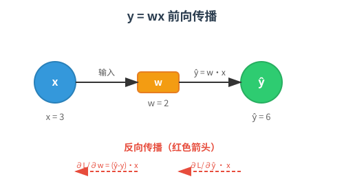
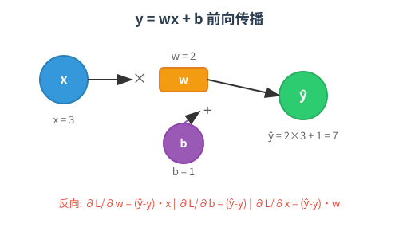
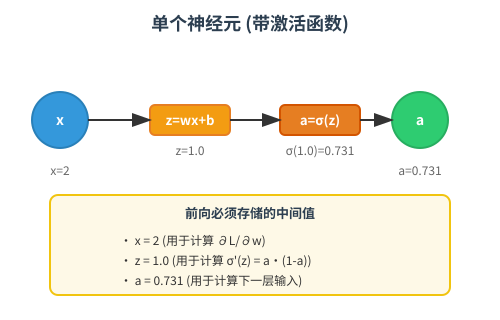
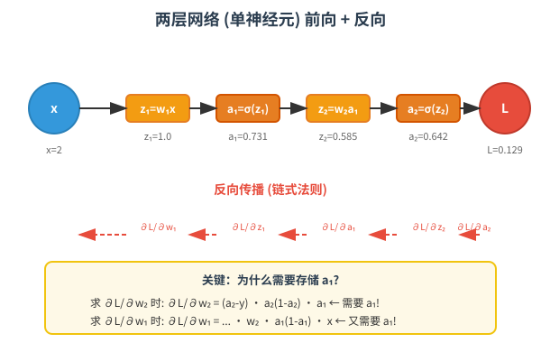

# BP算法详解：从 y=wx 到多层网络

> 为什么神经网络需要存储中间激活值？本教程通过逐步递进的例子，结合可视化图解，彻底讲清反向传播的本质。

## 目录

1. [最简模型：y = wx](#1-最简模型y--wx)
2. [加入偏置：y = wx + b](#2-加入偏置y--wx--b)
3. [单个神经元（带激活函数）](#3-单个神经元带激活函数)
4. [两层网络（单神经元）](#4-两层网络单神经元)
5. [多层网络（L层）](#5-多层网络l层)
6. [为什么必须存储中间值？](#6-为什么必须存储中间值)
7. [内存优化策略](#7-内存优化策略)

---

## 1. 最简模型：y = wx

这是神经网络中最基础的计算单元：一个输入、一个权重、一个输出。



### 设定

| 符号 | 含义 | 示例值 |
|------|------|--------|
| x | 输入 | 3 |
| w | 权重（待学习） | 2 |
| ŷ | 预测值 | 6 |
| y_true | 真实值 | 10 |
| η | 学习率 | 0.1 |

### 前向传播

```
ŷ = w · x = 2 × 3 = 6
L = ½(ŷ - y_true)² = ½(6 - 10)² = 8
```

### 反向传播（求梯度）

目标：找到 w 该怎么变才能让 L 变小。

```
∂L/∂w = ∂L/∂ŷ · ∂ŷ/∂w
      = (ŷ - y_true) · x
      = (6 - 10) × 3
      = -12
```

### 参数更新

```
w_new = w_old - η · ∂L/∂w
      = 2 - 0.1 × (-12)
      = 2 + 1.2
      = 3.2
```

**验证**：新预测 ŷ = 3.2 × 3 = 9.6，比 6 更接近 10 了！

### 需要存什么？

反向传播时计算 `∂L/∂w = (ŷ - y_true) · x`，**必须知道 x**。
- 前向时存 `x`，反向时取用。

---

## 2. 加入偏置：y = wx + b

偏置 b 让模型可以上下平移，表达能力更强。



### 前向传播

```
ŷ = w·x + b = 2×3 + 1 = 7
L = ½(7 - 10)² = 4.5
```

### 反向传播（3个梯度）

```
∂L/∂w = (ŷ - y_true) · x = (-3) × 3 = -9
∂L/∂b = (ŷ - y_true) · 1 = -3
∂L/∂x = (ŷ - y_true) · w = (-3) × 2 = -6
```

### 更新

```
w_new = 2 - 0.1×(-9) = 2.9
b_new = 1 - 0.1×(-3) = 1.3
```

### 需要存什么？

- `x`：用于计算 ∂L/∂w
- 无额外存储，b 的梯度不需要中间值（∂ŷ/∂b = 1）

---

## 3. 单个神经元（带激活函数）

激活函数引入非线性，让网络能拟合复杂函数。这里用 Sigmoid：`σ(z) = 1/(1+e⁻ᶻ)`，导数 `σ'(z) = a·(1-a)`。



### 前向传播

```
z = w·x + b = 0.5×2 + 0 = 1.0
a = σ(z) = σ(1.0) = 0.731
L = ½(a - y_true)² = ½(0.731 - 1)² = 0.036
```

### 反向传播

```
∂L/∂a = a - y_true = 0.731 - 1 = -0.269

∂L/∂z = ∂L/∂a · ∂a/∂z
      = (-0.269) · [a·(1-a)]
      = (-0.269) · [0.731×0.269]
      = -0.053

∂L/∂w = ∂L/∂z · ∂z/∂w
      = (-0.053) · x
      = (-0.053) × 2
      = -0.106

∂L/∂b = ∂L/∂z · ∂z/∂b
      = (-0.053) × 1
      = -0.053
```

### 需要存什么？

| 存储值 | 用途 |
|--------|------|
| `x` | 计算 ∂L/∂w = ∂L/∂z · x |
| `z` | 计算 σ'(z) = a·(1-a)，需要 z 来求 a |
| `a` | 计算 σ'(z) 和下一层输入 |

**关键发现**：Sigmoid 的导数 `σ'(z)` 可以用 `a` 直接表示为 `a·(1-a)`，但 `a` 本身是前向时算出来的，必须存！

---

## 4. 两层网络（单神经元）

现在把两个神经元串起来，看看梯度怎么从后往前传。



### 网络结构

```
x → [z₁=w₁x] → [a₁=σ(z₁)] → [z₂=w₂a₁] → [a₂=σ(z₂)] → L
```

### 前向传播（具体数值）

```
已知: x=2, y_true=1, w₁=0.5, w₂=0.8, b₁=b₂=0

z₁ = w₁·x = 0.5×2 = 1.0
a₁ = σ(1.0) = 0.731          ← 存储 a₁

z₂ = w₂·a₁ = 0.8×0.731 = 0.585
a₂ = σ(0.585) = 0.642

L = ½(a₂ - 1)² = ½(0.642-1)² = 0.129
```

### 反向传播

**第1步：求 w₂ 的梯度（第2层）**

```
∂L/∂w₂ = ∂L/∂a₂ · ∂a₂/∂z₂ · ∂z₂/∂w₂
       = (a₂ - y) · [a₂·(1-a₂)] · a₁
       = (-0.358) · (0.642×0.358) · 0.731
       = (-0.358) · (0.230) · 0.731
       = -0.060
```

👉 **注意最后一项 `a₁`**：这是第1层的输出，前向时必须保存，否则这里无法计算！

**第2步：求 w₁ 的梯度（第1层）**

```
∂L/∂w₁ = ∂L/∂a₂ · ∂a₂/∂z₂ · ∂z₂/∂a₁ · ∂a₁/∂z₁ · ∂z₁/∂w₁
       = (a₂-y) · [a₂·(1-a₂)] · w₂ · [a₁·(1-a₁)] · x
       = (-0.358) · (0.230) · 0.8 · (0.731×0.269) · 2
       = -0.026
```

👉 **又用到 `a₁`**：Sigmoid 导数需要 `a₁·(1-a₁)`，而 `a₁` 是前向时算的。

### 更新参数

```
w₂_new = 0.8 - 0.1×(-0.060) = 0.806
w₁_new = 0.5 - 0.1×(-0.026) = 0.503
```

### 需要存什么？

| 存储值 | 被谁用到 |
|--------|----------|
| `x` | 计算 ∂L/∂w₁ |
| `a₁` | 计算 ∂L/∂w₂ 和 ∂L/∂w₁（两处！） |
| `z₁` | 计算 σ'(z₁) = a₁·(1-a₁) |
| `z₂` | 计算 σ'(z₂) = a₂·(1-a₂) |

**核心结论**：`a₁` 被用了两次！一次是作为第2层的输入（∂z₂/∂w₂ = a₁），一次是计算自己的激活导数（σ'(z₁) = a₁·(1-a₁)）。

---

## 5. 多层网络（L层）

推广到任意层数，理解通用模式。


### 通用前向公式

对第 l 层：

```
z_l = W_l · a_{l-1} + b_l
a_l = σ(z_l)
```

### 通用反向公式

从后往前，定义 `δ_l = ∂L/∂z_l`（第 l 层的误差信号）：

```
δ_L = (a_L - y) ⊙ σ'(z_L)                    # 输出层
δ_l = (W_{l+1}^T · δ_{l+1}) ⊙ σ'(z_l)        # 隐藏层

∂L/∂W_l = δ_l · a_{l-1}^T
∂L/∂b_l = δ_l
```

### 每层需要存什么？

| 存储值 | 反向时用途 |
|--------|-----------|
| `z_l` | 计算 σ'(z_l) |
| `a_{l-1}` | 计算 ∂L/∂W_l = δ_l · a_{l-1}^T |

### 链式法则的"传递"过程

```
前向: x → z₁ → a₁ → z₂ → a₂ → ··· → z_L → a_L → L

反向: ∂L/∂a_L → δ_L → δ_{L-1} → ··· → δ₁ → ∂L/∂W₁
```

每一层的 `δ_l` 都依赖：
1. 后一层的 `δ_{l+1}`（从后面传过来的误差）
2. 当前层的 `σ'(z_l)`（需要前向存的 `z_l`）
3. 当前层的 `W_{l+1}`（权重矩阵）

---

## 6. 为什么必须存储中间值？

### 数学本质

反向传播是**链式法则的逆序应用**。链式法则的每一项都依赖前向计算的中间结果：

```
∂L/∂W_l = δ_l · a_{l-1}^T
```

- `a_{l-1}` 是前向时第 l-1 层的输出
- 如果不存，反向时无法计算这个矩阵乘法

### 直观类比

**前向 = 做菜**：切菜 → 炒菜 → 装盘

**反向 = 洗碗+调整配方**：要知道每步用了什么材料、多少量，才能调整下次的配方。

如果不记录"炒菜时放了多少盐"，反向时就没法调整盐的用量。

### 不存的代价

| 策略 | 内存 | 计算 | 说明 |
|------|------|------|------|
| 全保存 | O(L·N) | O(L·N) | 标准做法，L=层数, N=神经元数 |
| 不保存 | O(1) | O(L²·N) | 每次反向都要重新跑前向，慢 L 倍 |
| 激活检查点 | O(√L·N) | O(√L·N) | 折中方案，只存部分节点 |

---

## 7. 内存优化策略

### 激活检查点（Gradient Checkpointing）

核心思想：**只保存部分层的激活值，反向时重新计算缺失的中间值**。

```python
import torch

# PyTorch 中的用法
from torch.utils.checkpoint import checkpoint

class MyLayer(nn.Module):
    def forward(self, x):
        # 这段前向的中间值不会保存，反向时重算
        return checkpoint(self._forward, x)
    
    def _forward(self, x):
        # 正常的前向逻辑
        x = self.linear1(x)
        x = self.relu(x)
        x = self.linear2(x)
        return x
```

**权衡**：
- 内存减少约 √L 倍
- 计算增加约 √L 倍（因为要重算）
- 适合深层网络（ResNet-100+、大语言模型）

### 其他优化

| 策略 | 原理 | 适用场景 |
|------|------|----------|
| 混合精度训练 (AMP) | 用 FP16 存激活值 | 支持 Tensor Core 的 GPU |
| 梯度累积 | 小 batch 多次累积 | 显存不够大 batch |
| 激活重计算 | 同上 checkpoint | 深层网络 |
| 卸载到 CPU | 激活值暂存 CPU 内存 | 单卡大模型训练 |

---

## 总结

| 问题 | 答案 |
|------|------|
| 为什么要存中间激活值？ | 反向传播的链式法则需要它们来计算梯度 |
| 存哪些值？ | 每层的 `z_l`（线性输出）和 `a_{l-1}`（前一层激活） |
| 不存会怎样？ | 梯度算不出来，或需要重新跑前向（极慢） |
| 显存不够怎么办？ | 激活检查点、混合精度、梯度累积 |

**一句话**：前向传播是"生产中间件"，反向传播是"消耗中间件"。不存 = 反向时没零件可用。
