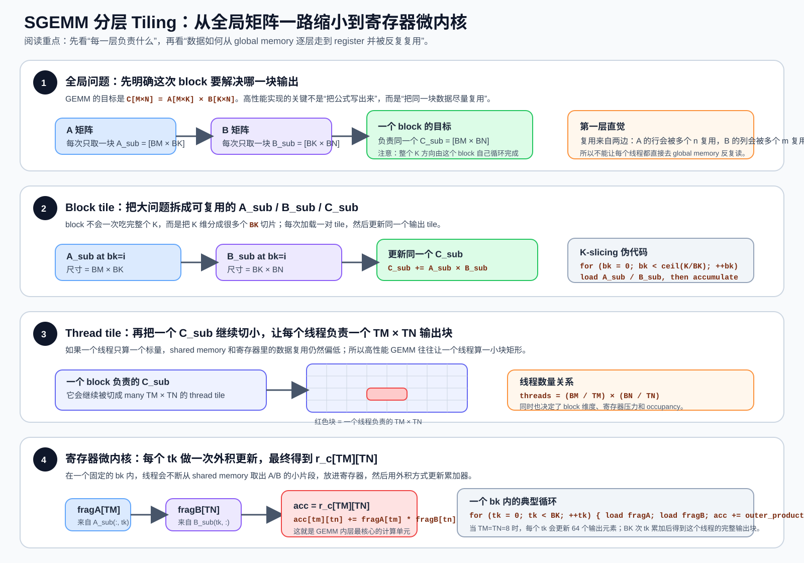
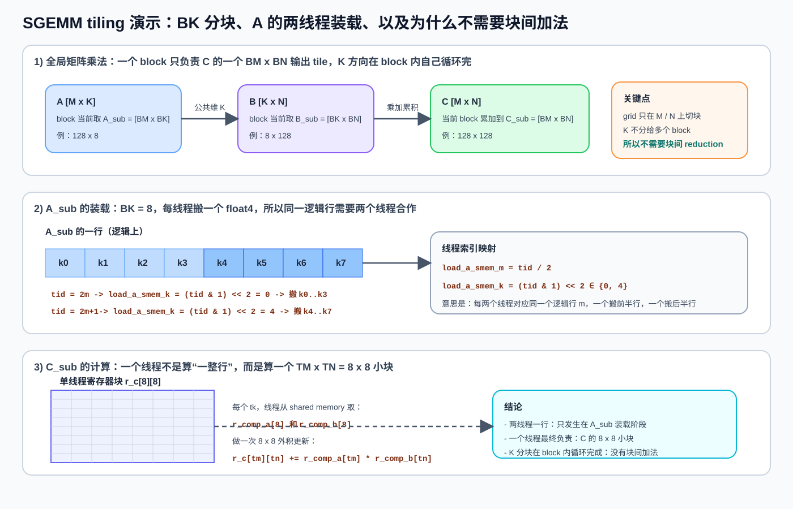

# CUDA GEMM 教程：从 0 开始学会自己写一个可优化的 SGEMM

这篇教程的核心目标只有一个：**教会你如何从零开始理解、编写、验证、再逐步优化一个 GEMM kernel**。

请先忘掉“这三个文件应该怎么用”。这篇文档不是给现有代码写导览，也不是教你“如何调用这些 demo”。

更准确地说，这篇教程的关系是：

- **教程是主线**：你要先建立写 GEMM 的思维框架。
- **源码是例子**：当文中讲到某个阶段的优化时，我会告诉你仓库里哪段代码可以拿来对照。
- **如果源码不完整或不适合初学者**，你应该以教程里的学习路径为准，而不是被文件组织方式牵着走。

你现在的身份是**初学者**，所以我们要追求的不是“第一遍就写出最强 kernel”，而是先建立一套能不断升级的正确心智模型。

---

## 你最终应该学会什么

读完这篇教程，你应该能回答下面这些问题：

1. GEMM 的数学形式是什么，GPU 上的性能瓶颈通常在哪里。
2. 为什么 naïve GEMM 正确但慢。
3. 为什么高性能 GEMM 几乎一定会引入 tiling。
4. 为什么会有 `global memory -> shared memory -> register` 这条典型数据流。
5. 什么是 block tile、thread tile、`K`-slicing、register blocking、vectorized load。
6. 为什么要处理 bank conflict、double buffering、`cp.async`。
7. 写一个 GEMM 时，应该如何一步一步验证正确性、性能和复杂度。
8. 什么时候应该自己写 kernel，什么时候应该交给 `cuBLASLt`。

如果这几个问题都能讲清楚，你就不是“会看 GEMM 代码”，而是已经开始具备“会写 GEMM 代码”的能力了。

---

## 目录

- [1. 先把问题定义清楚：GEMM 到底是什么](#1-先把问题定义清楚gemm-到底是什么)
- [2. 为什么 GEMM 在 GPU 上值得专门学](#2-为什么-gemm-在-gpu-上值得专门学)
- [3. 写 GEMM 之前，你必须先建立的硬件直觉](#3-写-gemm-之前你必须先建立的硬件直觉)
- [4. 第 0 步：先写对，再谈快](#4-第-0-步先写对再谈快)
- [5. 第 1 步：从 naïve GEMM 开始](#5-第-1-步从-naïve-gemm-开始)
- [6. 第 2 步：学会 block tiling 和 `K`-slicing](#6-第-2-步学会-block-tiling-和-k-slicing)
- [7. 第 3 步：学会 register blocking 和 thread tiling](#7-第-3-步学会-register-blocking-和-thread-tiling)
- [8. 第 4 步：学会 vectorized load、布局重排和 shared memory 读写模式](#8-第-4-步学会-vectorized-load布局重排和-shared-memory-读写模式)
- [9. 第 5 步：处理 bank conflict](#9-第-5-步处理-bank-conflict)
- [10. 第 6 步：理解 double buffering](#10-第-6-步理解-double-buffering)
- [11. 第 7 步：理解 `cp.async` 到底在优化什么](#11-第-7-步理解-cpasync-到底在优化什么)
- [12. 第 8 步：学会把手写 GEMM 和 `cuBLASLt` 放到正确关系里](#12-第-8-步学会把手写-gemm-和-cublaslt-放到正确关系里)
- [13. 这三个源码文件该怎样为你服务](#13-这三个源码文件该怎样为你服务)
- [14. 一个适合初学者的 GEMM 练习路线](#14-一个适合初学者的-gemm-练习路线)
- [15. 初学者最常见的误区](#15-初学者最常见的误区)
- [16. 参考资料与延伸阅读](#16-参考资料与延伸阅读)

---

## 1. 先把问题定义清楚：GEMM 到底是什么

GEMM 是 General Matrix Multiplication，最常见的形式是：

```text
C = A × B
```

如果矩阵形状分别是：

- `A`: `M x K`
- `B`: `K x N`
- `C`: `M x N`

那么每一个输出元素都满足：

```text
C[m, n] = Σ A[m, k] * B[k, n]，其中 k = 0..K-1
```

这意味着：

- `C` 的每个元素都需要做 `K` 次乘加。
- 整个 GEMM 的总 FLOPs 约为 `2 * M * N * K`。
- `A` 的一行会被很多不同的 `n` 复用。
- `B` 的一列会被很多不同的 `m` 复用。

这最后两点非常重要，因为它决定了 GEMM 优化的本质不是“把乘加写出来”，而是：

> **如何让同一块数据被更高效地复用。**

---

## 2. 为什么 GEMM 在 GPU 上值得专门学

因为深度学习里极多算子最后都会退化成 GEMM 或 GEMM-like 问题，例如：

- 全连接层 / Linear
- 卷积的 `im2col + GEMM`
- Attention 里的 `QK^T` 和 `AV`
- LoRA / Adapter 中的矩阵乘法
- 低精度量化推理中的 matmul

如果你学会了 GEMM，你实际上学会的是以下这组 GPU 核心能力：

- 如何组织 thread/block 的并行映射
- 如何利用 shared memory 做数据复用
- 如何把中间结果放在 register 里
- 如何处理吞吐、延迟、occupancy、register pressure、shared memory pressure 之间的平衡
- 如何设计“加载 + 计算”的流水线

所以，**GEMM 不是一个孤立算子，而是 GPU 高性能编程的核心训练场。**

---

## 3. 写 GEMM 之前，你必须先建立的硬件直觉

在真正写代码之前，先把下面几个概念牢牢记住。

### 3.1 三层最重要的存储

在这篇教程里，你可以先只记三层：

- `global memory`：容量大，延迟高，带宽重要，但访问代价高。
- `shared memory`：一个 block 内共享，延迟低得多，但容量有限。
- `register`：每个线程私有，最快，但数量极少且很珍贵。

高性能 GEMM 的典型数据流，通常都是：

```text
global memory -> shared memory -> register -> FMA -> register -> global memory
```

如果你以后看任何 GEMM kernel，都先问自己：

1. A/B 的 tile 现在在哪一层存储？
2. 中间累加结果现在在哪一层存储？
3. 哪一层在被重复访问？
4. 有没有本来可以复用的数据，仍然在反复走 global memory？

### 3.2 coalesced access

同一个 warp 的线程如果访问连续、对齐的 global memory 地址，硬件更容易把它们合并成少量事务，这通常就叫 coalesced access。

很多初学者写 GEMM 慢，不是因为数学错了，而是因为：

- A/B 的访问不连续
- 一个 warp 内地址分布很散
- 向量化加载条件不满足

### 3.3 shared memory 不等于自动变快

shared memory 很快，但它不是“只要用就快”。

你还要继续考虑：

- 线程如何把数据搬进去
- 线程如何从里面读出来
- 读写模式是否容易产生 bank conflict
- 布局是否适合后续的 register blocking

### 3.4 GEMM 优化的真正主线

把所有技巧浓缩成一句话，其实就是：

> **减少高代价访存，提升数据复用，让加载和计算尽量重叠。**

如果你始终记住这句话，很多复杂的技巧都不会显得神秘。

---

## 4. 第 0 步：先写对，再谈快

这是初学者最容易忽略的一步。

很多人一上来就想学：

- `float4`
- `cp.async`
- Tensor Core
- WMMA
- CUTLASS

但如果你没有一个稳定的“正确性 + benchmark”框架，那么后面的优化都很容易变成盲调。

### 4.1 一个最低限度的 GEMM 验证框架应该包含什么

你至少需要这几部分：

- host 侧构造输入矩阵 `A/B`
- CPU 侧计算 reference 结果
- GPU kernel 输出 `C`
- 把 `C` 拷回 host
- 比较 `max_abs_error`
- 统计耗时
- 计算 TFLOPS

这个仓库里可以直接参考的不是“kernel 本身”，而是验证框架：

- `learn/cuda/kernels/gemm/sgemm.cu:414` 的 `benchmark_kernel(...)`
- `learn/cuda/kernels/gemm/sgemm.cu:475` 的 `main()`

这两个位置最值得你借鉴的是**验证思路**，不是必须原样照抄。

### 4.2 先建立一个你自己的工作原则

在每次做 GEMM 优化时，都按这三个问题来检查：

1. **正确吗？**
2. **比上一个版本更快吗？**
3. **复杂度增加之后，收益值不值？**

如果没有这个习惯，你很容易写出“看起来很高级，但其实更慢或者不稳定”的代码。

---

## 5. 第 1 步：从 naïve GEMM 开始

### 5.1 一个最基础的 CUDA GEMM 长什么样

下面是一个最典型的 naïve SGEMM 结构：

```cpp
__global__ void sgemm_naive(const float* A,
                            const float* B,
                            float* C,
                            int M,
                            int N,
                            int K) {
  int row = blockIdx.y * blockDim.y + threadIdx.y;
  int col = blockIdx.x * blockDim.x + threadIdx.x;

  if (row < M && col < N) {
    float sum = 0.0f;
    for (int k = 0; k < K; ++k) {
      sum += A[row * K + k] * B[k * N + col];
    }
    C[row * N + col] = sum;
  }
}
```

这个版本的优点是：

- 简单
- 容易验证
- 边界处理清楚
- 可以作为所有优化版本的 baseline

### 5.2 它为什么慢

因为每个线程都在做这件事：

- 反复从 global memory 读取 `A[row, k]`
- 反复从 global memory 读取 `B[k, col]`
- 几乎没有把数据复用放在更快的存储层

更直白一点说：

- 同一行 `A[row, :]` 会被很多 `col` 复用
- 同一列 `B[:, col]` 会被很多 `row` 复用
- 但 naïve kernel 没有把这种复用显式利用起来

### 5.3 初学者在这一阶段最应该学什么

不是性能，而是这三件事：

- 输出元素和线程之间如何映射
- row-major 下索引如何写对
- 如何用 CPU reference 检查 GPU 输出

仓库里的对应参考代码是：

- `learn/cuda/kernels/gemm/sgemm.cu:31`

你可以把它当成“第一阶段正确写法”的参考，不要把它当成目标性能写法。

---

## 6. 第 2 步：学会 block tiling 和 `K`-slicing

这是 GEMM 学习过程里第一道真正重要的门槛。

### 6.1 为什么一定会引入 tile

因为 GEMM 最大的机会来自数据复用。

如果一个 block 负责输出矩阵 `C` 的一个子块，比如 `BM x BN`，那么：

- 这整个输出 tile 需要同一批 `A` 子块和 `B` 子块
- 这些数据可以先搬进 shared memory
- block 内多个线程共同复用它们

这就把“每个线程都去 global memory 单独拿数据”变成了：

```text
一批线程协作加载一次 -> block 内多线程反复复用
```

### 6.2 为什么还要在 `K` 维切片

因为一般 `K` 很大，没法把整个 `A`、`B` 都搬进 shared memory。

所以常见做法是：

- 只处理 `A` 的 `BM x BK` 子块
- 只处理 `B` 的 `BK x BN` 子块
- 在 `K` 维上分多轮迭代
- 每轮都做一次“加载 tile -> 累加部分结果”

这就是 `K`-slicing。

### 6.3 这个阶段的 kernel 骨架

```cpp
template <int BM, int BN, int BK>
__global__ void sgemm_tiled(const float* A,
                            const float* B,
                            float* C,
                            int M,
                            int N,
                            int K) {
  __shared__ float sA[BM][BK];
  __shared__ float sB[BK][BN];

  int row = blockIdx.y * BM + threadIdx.y;
  int col = blockIdx.x * BN + threadIdx.x;

  float sum = 0.0f;

  for (int bk = 0; bk < (K + BK - 1) / BK; ++bk) {
    // 1. 从 global memory 协作加载当前 A/B tile 到 shared memory
    // 2. __syncthreads()
    // 3. 在 shared memory 上完成 BK 次乘加
    // 4. __syncthreads()
  }

  if (row < M && col < N) {
    C[row * N + col] = sum;
  }
}
```

这段代码的意义不在于“它已经很快”，而在于它第一次把 GEMM 的**数据复用结构**写出来了。

### 6.4 这一阶段你必须想清楚的四个问题

1. 一个 block 负责多大的输出 tile？
2. 每轮 `K` 切片大小 `BK` 取多少？
3. 哪些线程负责加载 A，哪些线程负责加载 B？
4. 每个线程最终是算一个输出元素，还是将来还要继续扩大成 thread tile？

### 6.5 仓库里对应参考代码

- `learn/cuda/kernels/gemm/sgemm.cu:73`

这段 `sgemm_sliced_k_f32_kernel` 非常适合你对照“第一版 tile 化 GEMM 应该长什么样”。

### 6.6 这一步之后，你已经真正进入 GEMM 优化了

因为从这一刻开始，你不再是在写“矩阵乘法公式”，而是在设计：

- 数据怎么搬
- 数据搬到哪里
- 数据怎么复用
- 加载和计算的粒度怎么匹配

这就是高性能 GEMM 的起点。

---

## 7. 第 3 步：学会 register blocking 和 thread tiling

到了这一步，你会发现：

- block tiling 已经让 block 级复用变好了
- 但每个线程如果仍然只算一个输出值，计算密度还不够高

所以你会自然走向下一步：

> **让一个线程负责多个输出元素。**

### 7.1 什么是 thread tile

假设一个线程不再只算 `C[m, n]` 一个值，而是负责一个 `TM x TN` 的小块：

```text
thread tile = 每个线程负责的输出子块
```

那么线程内部会有：

- 一组来自 A 的寄存器片段 `fragA`
- 一组来自 B 的寄存器片段 `fragB`
- 一个寄存器数组 `acc[TM][TN]`

这样做的好处是：

- 一次从 shared memory 取到的 A/B 数据，可以在多个输出元素之间复用
- 中间累加结果留在 register，不必频繁写回更慢的存储层
- 指令级并行空间更大

### 7.2 为什么 register blocking 是 GEMM 的关键

因为 GEMM 的真正高性能，往往不是靠“读得更多”，而是靠：

- 让加载进来的数据在寄存器层面被多次使用
- 让 FMA 的占比上升
- 把 shared memory 访问成本摊薄到更多计算上

### 7.3 这一阶段的典型形态

```cpp
float acc[TM][TN] = {0.0f};
float fragA[TM];
float fragB[TN];

for (int k_inner = 0; k_inner < BK; ++k_inner) {
  // 从 shared memory 取一小片 A/B 到寄存器
  // 用 fragA 和 fragB 更新 acc
  for (int tm = 0; tm < TM; ++tm) {
    for (int tn = 0; tn < TN; ++tn) {
      acc[tm][tn] += fragA[tm] * fragB[tn];
    }
  }
}
```

### 7.4 这一阶段最重要的认知升级

以前你看 GEMM 是：

- 一个线程算一个标量

现在你要开始把它理解成：

- 一个线程算一个小矩形
- 一个 warp 算更大的矩形
- 一个 block 再算更大的矩形

也就是说，**GEMM 的并行映射是分层的**。

### 7.5 仓库里对应参考代码

- `learn/cuda/kernels/gemm/sgemm.cu:121`

这段 `sgemm_t_8x8_sliced_k_f32x4_kernel` 很适合你对照：

- `TM/TN`
- `r_c[TM][TN]`
- shared memory 到 register 的数据搬运
- 每个线程如何计算一个更大的输出子块

---

## 8. 第 4 步：学会 vectorized load、布局重排和 shared memory 读写模式

很多人到了 thread tiling 这一步，就以为 GEMM 已经差不多了。实际上还差很远。

因为此时你还要继续优化：

- global memory 的读写吞吐
- shared memory 的访问模式
- 数据在 shared memory 中的排布方式

### 8.1 为什么会出现 `float4`

如果地址对齐且访问模式合适，那么：

- 一次读取 4 个连续 `float`
- 比 4 次分散的标量读取更容易获得高吞吐

这就是你在很多 GEMM 代码里看到 `float4`、`int4` 的原因。

它们不是“高级写法”，而是**更匹配硬件带宽的写法**。

### 8.2 为什么会出现 online transpose

有时从 global memory 连续读进来的布局，并不适合后续从 shared memory 再次连续读出。

于是你会看到一种技巧：

- 从 global memory 按更连续的方式加载
- 写入 shared memory 时顺手调整布局
- 让后面 shared memory -> register 的访问更顺

这类做法通常叫 online transpose 或者“加载时重排布局”。

### 8.3 初学者需要抓住的重点

不要把它理解成“我在做数学转置”，而要理解成：

> **我在为下一阶段的访问模式重新摆放数据。**

### 8.4 仓库里对应参考代码

- `learn/cuda/kernels/gemm/sgemm.cu:121`
- `learn/cuda/kernels/gemm/sgemm.cu:203`

重点观察：

- `FLOAT4(...)`
- A/B 的加载方式
- shared memory 中 A 的排布
- 后续 `r_comp_a / r_comp_b` 的读取方式

### 8.5 两张图怎么配合这一节来理解

#### 分层 tiling 图



读这张图时重点看：

- block tile
- thread tile
- `K` tile
- 为什么这些层级必须同时存在

#### tiling 演示图



读这张图时重点看：

- A/B 的 tile 如何共同决定一个 C tile
- 为什么“加载一次，复用多次”是整套优化的核心

---

## 9. 第 5 步：处理 bank conflict

你把数据搬进 shared memory 以后，不代表问题结束了。

如果多个线程访问 shared memory 的模式不好，就会产生 bank conflict，导致本来并行的访问被部分串行化。

### 9.1 什么是 bank conflict

shared memory 内部并不是一个“完全无结构的大数组”，而是分 bank 的。

如果一个 warp 内多个线程同时访问落在同一 bank 的不同地址，就会冲突。

### 9.2 初学者最容易犯的误区

误区是：

- “我已经把数据搬进 shared memory 了，所以一定更快。”

实际上不是。真正要问的是：

- 我怎么搬进去？
- 我怎么读出来？
- 线程访问模式和 shared memory 布局匹配吗？

### 9.3 常见处理方式

- 在某一维加 padding，例如 `OFFSET`
- 改变 shared memory 的数组布局
- 改变 A/B 在 shared memory 里的转置方式
- 调整 thread 对数据的映射

### 9.4 仓库里对应参考代码

- `learn/cuda/kernels/gemm/sgemm.cu:203`

文件名里的 `bcf` 可以把它理解成“朝 bank conflict friendly 的方向优化”。

你不需要第一遍就把冲突分析做得很形式化，但一定要把这条主线记住：

> **shared memory 的价值，不只取决于“有没有用它”，还取决于“线程如何访问它”。**

---

## 10. 第 6 步：理解 double buffering

这一步开始从“优化一次计算”升级到“优化一整条流水线”。

### 10.1 为什么单缓冲会浪费时间

如果每一轮都严格串行：

```text
加载 tile 0 -> 计算 tile 0 -> 加载 tile 1 -> 计算 tile 1 -> ...
```

那么计算单元和加载单元很容易互相等待。

### 10.2 double buffering 的本质

用两个 buffer：

- buffer 0：当前正在计算
- buffer 1：下一轮正在准备

目标是把流程尽量变成：

```text
预加载 tile 0
计算 tile 0，同时准备 tile 1
计算 tile 1，同时准备 tile 2
...
```

### 10.3 你真正该理解的不是“两个数组”

而是：

- 当前在算谁
- 下一轮在准备谁
- 哪个时间点切换 buffer
- 什么时候必须同步

这才是 double buffer 真正的思想。

### 10.4 仓库里对应参考代码

- `learn/cuda/kernels/gemm/sgemm.cu:298`

这里的 `dbuf` 版本很值得你重点看：

- `smem_sel`
- `smem_sel_next`
- 预加载第一块
- 循环中边算边准备下一块
- 最后一块单独收尾

### 10.5 初学者对这一阶段的目标

你不必一上来就自己写出最优双缓冲版本，但至少要能回答：

- 为什么要先预热第一块数据
- 为什么循环里要同时出现“算当前块”和“准备下一块”
- 为什么最后常常还有一个尾块收尾阶段

---

## 11. 第 7 步：理解 `cp.async` 到底在优化什么

现在你终于可以来看 `cp.async` 了。

注意，这一步是**进阶内容**。如果前面的 tiling、register blocking、bank conflict、double buffering 还没真正理解，不建议先钻这里。

### 11.1 为什么 `cp.async` 会出现

传统 `gmem -> smem` 加载里，一个常见路径是：

```text
global memory -> register -> shared memory
```

而 `cp.async` 试图把这个过程做得更显式、更流水线化。

它关心的问题是：

- 数据能否提前发起加载
- 加载能否和计算更好地重叠
- 能否减少中间寄存器中转带来的压力

### 11.2 你可以把它先理解成什么

在初学阶段，不必先背完整 PTX 语义。你先把它理解成：

- 异步发起 `global -> shared` 的拷贝
- 把多次拷贝组织成 group
- 通过 commit / wait 控制什么时候可以安全使用这些数据

### 11.3 当前仓库里最值得看的入口

`sgemm_async.cu` 开头这几个宏就是理解入口：

- `learn/cuda/kernels/gemm/sgemm_async.cu:14`
- `learn/cuda/kernels/gemm/sgemm_async.cu:16`
- `learn/cuda/kernels/gemm/sgemm_async.cu:19`
- `learn/cuda/kernels/gemm/sgemm_async.cu:22`

也就是：

- `CP_ASYNC_COMMIT_GROUP()`
- `CP_ASYNC_WAIT_GROUP(n)`
- `CP_ASYNC_CA(...)`
- `CP_ASYNC_CG(...)`

### 11.4 这一步真正要学什么

不是“把宏抄下来”，而是学下面这套流水线思路：

1. 先发起下一块数据的异步加载。
2. 把这批加载提交为一个 group。
3. 当前线程继续做正在进行的计算。
4. 在真正要用下一块数据之前，再显式等待。

如果你理解了这四步，`cp.async` 就不神秘了。

### 11.5 为什么它通常和 double buffering 一起出现

因为 `cp.async` 本身不是完整的优化方案，它通常是：

- 双缓冲
- tile 化加载
- async group 管理
- 计算循环

这些结构一起工作的结果。

所以你看到 `cp.async` 时，脑子里要自动联想到：

- 当前 buffer 在算
- 下一个 buffer 在异步加载
- 什么时候 commit
- 什么时候 wait

### 11.6 仓库里应该如何阅读 `sgemm_async.cu`

不是把它当作“第一个上手文件”，而是当作“进阶专题参考”。

你可以重点按下面顺序看：

- 先看宏定义：`learn/cuda/kernels/gemm/sgemm_async.cu:14`
- 再看 `8x4` async 版本：`learn/cuda/kernels/gemm/sgemm_async.cu:144`
- 再看 `8x8` async 版本：`learn/cuda/kernels/gemm/sgemm_async.cu:394`
- 最后看 `8x16` async 版本：`learn/cuda/kernels/gemm/sgemm_async.cu:677`

它们的价值不是“你必须照着这样写”，而是帮助你观察：

- tile 变大以后，async pipeline 会怎么变化
- B tile 的加载如何组织成多次 `cp.async`
- `wait_group` 应该放在什么位置附近

### 11.7 一个非常重要的提醒

`cp.async` 不应该成为你学习 GEMM 的入口。

它应该是你已经能回答下面问题之后，才去看的内容：

- 为什么要 tile
- 为什么要 shared memory
- 为什么要 register blocking
- 为什么要 double buffering

如果这些都还没掌握，那么先别急着学 `cp.async`。

---

## 12. 第 8 步：学会把手写 GEMM 和 `cuBLASLt` 放到正确关系里

很多初学者在学 GEMM 时，会走两个极端：

- 极端 A：只想自己写 kernel，不想看库
- 极端 B：只会调库，不想理解底层

这两个都不理想。

### 12.1 你为什么必须学手写 GEMM

因为手写 GEMM 会教你：

- 数据复用从哪里来
- 为什么 tile 大小会影响性能
- 为什么 shared memory 和 register 都重要
- 为什么有 bank conflict、double buffering、async pipeline

如果不懂这些，你就很难真正理解库接口背后的含义。

### 12.2 你为什么也必须认识 `cuBLASLt`

因为真实工程里，大部分时候你不会长期维护一套自己的通用 GEMM kernel。

你通常会优先考虑：

- cuBLAS
- `cuBLASLt`
- CUTLASS
- 更上层框架已经提供的高性能实现

`cuBLASLt` 的价值是：

- 支持更灵活的 layout
- 支持更多混合精度组合
- 支持 heuristic 选算法
- 支持更复杂的 matmul 配置空间

### 12.3 正确的学习顺序应该是什么

先学手写 GEMM，再学 `cuBLASLt`。

因为这样你才能把库看成：

> **替你完成大量工程化调度和算法选择工作的工具**。

而不是把它看成一个黑箱。

### 12.4 仓库里 `sgemm_cublaslt.cu` 应该怎么读

它不是“GEMM 入门文件”，而是“工程视角参考文件”。

你应该重点看的是：

- `RunSpec` 如何描述一个 matmul 问题：`learn/cuda/kernels/gemm/sgemm_cublaslt.cu:44`
- 为什么要做规格校验：`learn/cuda/kernels/gemm/sgemm_cublaslt.cu:299`
- 使用面长什么样：`learn/cuda/kernels/gemm/sgemm_cublaslt.cu:404`
- dense 路径如何调用库：`learn/cuda/kernels/gemm/sgemm_cublaslt.cu:689`
- fp8 / fp4 路径如何额外处理 scale 和 layout：`learn/cuda/kernels/gemm/sgemm_cublaslt.cu:798`、`learn/cuda/kernels/gemm/sgemm_cublaslt.cu:919`

### 12.5 这一步的认知目标

不是“学会调用一个 demo”，而是搞清楚：

- 一个 matmul 在工程里需要被描述成什么样
- 为什么 layout、type、compute type、scale mode 都会影响实现选择
- 为什么高性能库必须有 heuristic 和 descriptor

---

## 13. 这些源码文件该怎样为你服务

现在再来看这几个文件，你会更清楚它们的角色。

### 13.1 `sgemm_step_by_step.cu`

它的角色是：**最适合初学者跟着教程亲手写一遍的教学主线代码**。

如果你现在只想抓住“GEMM 应该怎样一步一步写出来”，那就先读它，而不是先读另外三个更偏参考性质的文件。

你应该从这里拿走的是：

- 如何从 naïve 开始搭起一个能运行、能校验、能 benchmark 的最小 GEMM
- 如何在每一步只引入一个新概念：shared memory、1D thread tile、2D thread tile
- 如何用同一套输入与 reference 比较不同阶段的正确性和性能
- 如何把教程里的学习路径直接映射成一份可运行代码

推荐入口：

- `learn/cuda/kernels/gemm/sgemm_step_by_step.cu`
- `sh learn/cuda/run_cuda.sh learn/cuda/kernels/gemm/sgemm_step_by_step.cu`

### 13.2 `sgemm.cu`

它的角色是：**你的第一本手写 GEMM 参考书**。

你应该从这里拿走的是：

- baseline kernel 如何写
- tiled kernel 如何写
- thread tiling 如何写
- `float4`、bank conflict、double buffer 这些优化是怎么一层一层叠上去的
- 如何做 correctness + benchmark

关键参考点：

- `learn/cuda/kernels/gemm/sgemm.cu:31`
- `learn/cuda/kernels/gemm/sgemm.cu:73`
- `learn/cuda/kernels/gemm/sgemm.cu:121`
- `learn/cuda/kernels/gemm/sgemm.cu:203`
- `learn/cuda/kernels/gemm/sgemm.cu:298`
- `learn/cuda/kernels/gemm/sgemm.cu:414`
- `learn/cuda/kernels/gemm/sgemm.cu:475`

### 13.3 `sgemm_async.cu`

它的角色是：**你的 `cp.async` 与 async pipeline 进阶样本**。

你不应该拿它做第一份入门材料，但它非常适合在你已经懂了 double buffer 之后，继续往前推进。

关键参考点：

- `learn/cuda/kernels/gemm/sgemm_async.cu:14`
- `learn/cuda/kernels/gemm/sgemm_async.cu:19`
- `learn/cuda/kernels/gemm/sgemm_async.cu:144`
- `learn/cuda/kernels/gemm/sgemm_async.cu:394`
- `learn/cuda/kernels/gemm/sgemm_async.cu:677`

### 13.4 `sgemm_cublaslt.cu`

它的角色是：**你的工程落地视角参考**。

它不会直接教你“从零写 kernel”，但会教你：

- 如果不自己写 kernel，工程里通常是怎样把问题交给库的
- 为什么混合精度 GEMM 会引入一整套额外复杂度
- 为什么 layout 和 descriptor 是严肃问题，而不是形式主义

关键参考点：

- `learn/cuda/kernels/gemm/sgemm_cublaslt.cu:44`
- `learn/cuda/kernels/gemm/sgemm_cublaslt.cu:299`
- `learn/cuda/kernels/gemm/sgemm_cublaslt.cu:404`
- `learn/cuda/kernels/gemm/sgemm_cublaslt.cu:689`
- `learn/cuda/kernels/gemm/sgemm_cublaslt.cu:798`
- `learn/cuda/kernels/gemm/sgemm_cublaslt.cu:919`
- `learn/cuda/kernels/gemm/sgemm_cublaslt.cu:1479`

---

## 14. 一个适合初学者的 GEMM 练习路线

这一节最重要，因为真正让你学会 GEMM 的不是“看懂”，而是“自己写一遍”。

如果你准备边读边跑，我最推荐先运行下面这份教学代码：

```bash
sh learn/cuda/run_cuda.sh learn/cuda/kernels/gemm/sgemm_step_by_step.cu
```

它会把 naïve、shared-memory tiled、1D thread tile、2D thread tile 放在同一个 benchmark 里，特别适合作为你的第一份练习入口。

### 14.1 第一周目标：你至少要能独立写出 naïve GEMM

要求：

- 能自己写出 CPU reference
- 能自己写出 naïve CUDA kernel
- 能比较误差
- 能统计耗时
- 能解释它为什么慢

如果这一步都没完全吃透，就不要急着看 `cp.async`。

### 14.2 第二周目标：你要能把 naïve GEMM 变成 tiled GEMM

要求：

- 能解释 block tile 的意义
- 能解释为什么 `K` 要切片
- 能自己写出 shared memory 加载逻辑
- 能解释每一轮 `__syncthreads()` 的目的

### 14.3 第三周目标：你要能写出 thread tiling + register blocking

要求：

- 能自己设计 `TM/TN`
- 能用寄存器数组保存累加结果
- 能解释为什么每线程算多个输出值会更合理
- 能观察 register 使用量带来的影响

### 14.4 第四周目标：你要开始理解真实优化问题

要求：

- 尝试 `float4` 加载
- 观察 shared memory 布局变化
- 尝试 padding 以减少 bank conflict
- 尝试双缓冲

### 14.5 第五周目标：把 `cp.async` 当作专题学习

要求：

- 先画出你的加载-计算时间线
- 再理解 `commit_group` / `wait_group`
- 再看 `sgemm_async.cu`
- 最后尝试在你自己的双缓冲版本里引入 async copy 思维

### 14.6 第六周目标：把 `cuBLASLt` 当作工程对照组

要求：

- 理解 descriptor 和 layout
- 知道 `cuBLASLt` 在解决什么工程问题
- 用它作为性能和实现复杂度的对照组
- 明白“自己写”和“调库”在工程中的边界

---

## 15. 初学者最常见的误区

### 15.1 误区一：一上来就学 `cp.async`

这是最典型的问题。

正确顺序应该是：

- naïve
- tile
- register blocking
- bank conflict
- double buffer
- `cp.async`

### 15.2 误区二：只盯着 kernel，不做 reference 和 benchmark

如果没有验证框架，你就不知道：

- 是不是写错了
- 是不是更快了
- 是不是复杂度增加但收益很小

### 15.3 误区三：把 GEMM 当成“公式实现题”

GEMM 当然是数学公式，但 GPU GEMM 真正难的是：

- 数据流
- 并行映射
- 访存模式
- 流水线组织

### 15.4 误区四：觉得 shared memory 一定会自动提速

不一定。

如果 shared memory 的布局和访问方式不好，性能可能仍然很差。

### 15.5 误区五：以为 tile 越大越好

不一定。

tile 变大同时会影响：

- shared memory 占用
- register pressure
- occupancy
- bank conflict 风险

所以 tile 参数是需要实验和权衡的，不是越大越先进。

### 15.6 误区六：觉得会调 `cuBLASLt` 就等于会写 GEMM

不是。

会调库和会写 kernel 是两种不同能力。

- 调库更偏工程接口理解
- 写 kernel 更偏底层数据流与硬件映射理解

二者相互补充，但不互相替代。

---

## 16. 参考资料与延伸阅读

下面这些资料值得和本文一起看。阅读顺序建议是：先看本文建立主线，再挑一两篇外部材料补充细节，不要一开始就跳进大而全文档里迷路。

### 16.1 NVIDIA 官方文档

- CUDA C++ Programming Guide：CUDA 编程总入口，异步拷贝和内存层级的官方说明都在这里  
  https://docs.nvidia.com/cuda/cuda-c-programming-guide/index.html

- CUDA 13.1 Programming Guide 中的 Asynchronous Data Copies 专题  
  https://docs.nvidia.com/cuda/archive/13.1.0/cuda-programming-guide/04-special-topics/async-copies.html

- CUDA C++ Best Practices Guide：从性能分析、访存模式和优化角度补齐直觉  
  https://docs.nvidia.com/cuda/archive/12.4.0/cuda-c-best-practices-guide/index.html

- cuBLAS / `cuBLASLt` 官方文档：理解 descriptor、layout、heuristic、mixed precision 的最权威来源  
  https://docs.nvidia.com/cuda/cublas/

### 16.2 NVIDIA CUTLASS 文档

- Efficient GEMM in CUDA：建立“分层 tiling”心智模型最推荐的官方资料之一  
  https://docs.nvidia.com/cutlass/latest/media/docs/cpp/efficient_gemm.html

- CUTLASS GEMM API：帮助理解 threadblock、warp、instruction 三层 tile 关系  
  https://docs.nvidia.com/cutlass/latest/media/docs/cpp/gemm_api.html

### 16.3 社区高质量教程

- Lei Mao, *CUDA Matrix Multiplication Optimization*：非常适合补 block tiling、thread tiling、vectorized load 的经典路线  
  https://leimao.github.io/article/CUDA-Matrix-Multiplication-Optimization/

- Simon Böhm, *How to Optimize a CUDA Matmul Kernel for cuBLAS-like Performance: a Worklog*：非常适合理解“为什么 GEMM 优化通常是一层一层叠起来的”  
  https://siboehm.com/articles/22/CUDA-MMM

---

## 最后给你的学习建议

如果你是初学者，我最建议你做的不是“继续搜更多 GEMM 代码”，而是按下面这条路线亲手写：

1. 写一个 naïve GEMM。
2. 给它配 CPU reference 和 benchmark。
3. 把它改成 shared-memory tiled GEMM。
4. 再加 thread tiling 和 register blocking。
5. 再开始考虑 `float4`、bank conflict、double buffer。
6. 最后把 `cp.async` 当作进阶专题。
7. 再用 `cuBLASLt` 当工程对照组。

当你真的按这个顺序自己写过一遍之后，你再回头看任何高性能 GEMM 代码，都会比现在轻松得多。

如果下一步你愿意，我可以继续直接帮你做两件非常有价值的事之一：

- 基于这篇教程，再补一份“从零手写 naïve → tiled GEMM”的最小练习代码。
- 或者把 `sgemm.cu` 拆成“教学版 step-by-step 代码”，每一版只保留一个新概念。
