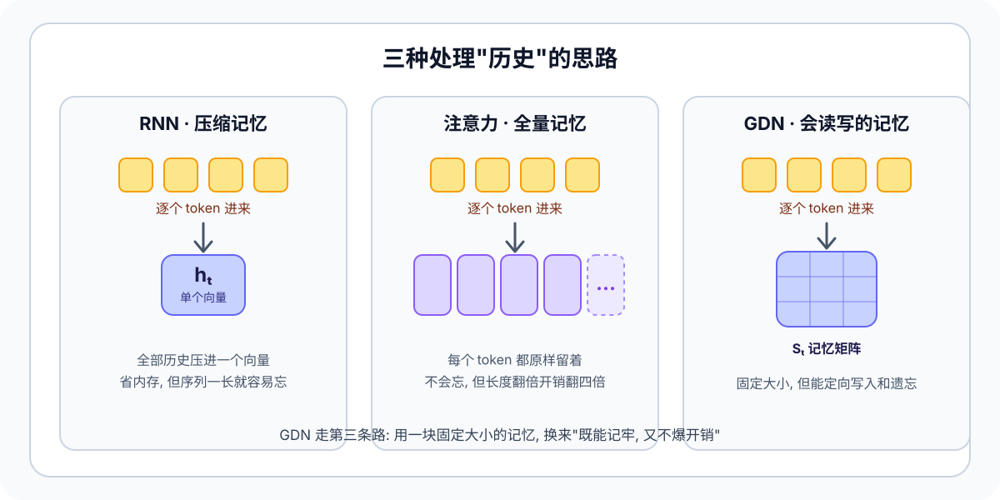
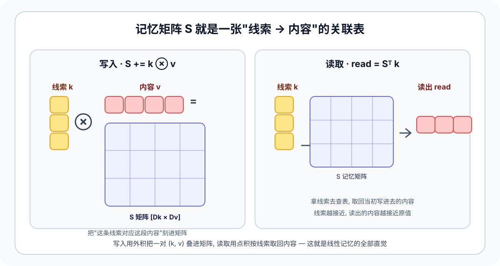
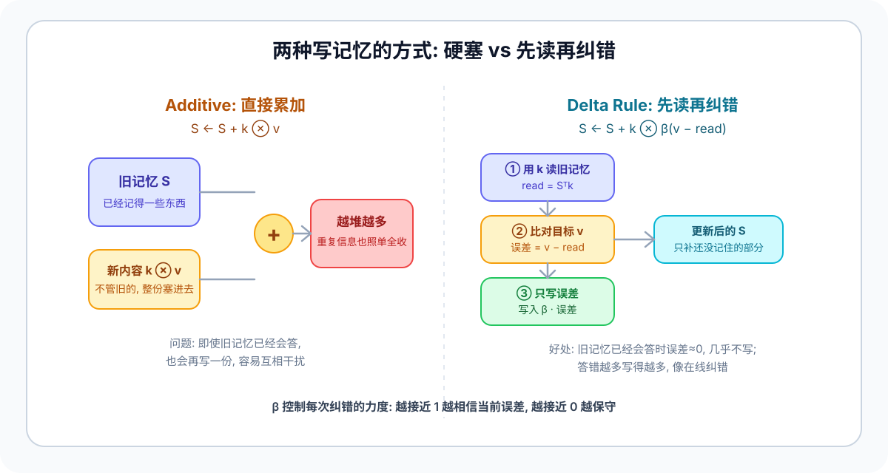

# GDN（Gated Delta Networks）技术整理

> 更新时间：2026-06-14  
> 目标：给 `learn/` 增加一个可运行, 可验证, 可继续扩展的 GDN 教学目录  
> 读者：刚开始接触深度学习, 想真正搞懂"线性注意力 / 状态记忆"这条路线的人

---

## 0. 本目录内容

- `gdn.py`: 纯 PyTorch 教学版 GDN 实现, 包含 sequential recurrent 和 chunkwise materialization 两条路径.
- `index.html`: 面向人类阅读的图文教程, 复用仓库统一 HTML 样式.
- `gdn.css`: 教程页的少量局部样式, 顶部导入 `docs/html/assets/xdl-doc.css`.
- `assets/gdn_memory_landscape.svg`: RNN / 注意力 / GDN 三种处理历史方式的对比图.
- `assets/gdn_memory_table.svg`: 把记忆矩阵 `S` 理解成 key→value 关联表的写入/读取示意图.
- `assets/gdn_delta_vs_additive.svg`: "硬塞累加" 与 "先读再纠错" 两种写入方式的对比图.
- `assets/gdn_chunkwise_flow.svg`: 用于解释 sequential vs chunkwise 的自绘示意图.
- `../../tests/test_gdn.py`: 对教学实现的最小 pytest 覆盖.

运行最小闭环:

```bash
python learn/gdn/gdn.py
pytest tests/test_gdn.py -q
```

如果你是第一次读, 建议顺序: 先看第 1 节建立直觉, 再看第 2 节(记忆是什么), 第 3 节(怎么写记忆), 第 4 节(加遗忘), 最后才进第 6 节往后的公式和代码.

---

## 1. 先想清楚一个问题: 模型怎么"记住"前面读过的东西

读这一节不需要任何公式, 只需要一个生活类比.

假设你在读一本小说, 读到第 500 页时, 书里突然提到"那把钥匙". 你能反应过来这是第 30 页出现过的钥匙, 是因为你脑子里一直留着一份"前情记忆". 语言模型也要解决同样的问题: 处理当前这个词时, 怎么用上前面所有词的信息?

业界主要有三种思路, 各有取舍:



| 思路 | 怎么存历史 | 优点 | 代价 |
| --- | --- | --- | --- |
| **RNN** | 把所有历史压进一个固定向量 `hₜ` | 内存恒定, 推理快 | 序列一长, 早期信息被挤掉, 容易忘 |
| **注意力 (Transformer)** | 每个 token 原样全部留着 | 几乎不丢信息, 效果强 | 序列翻倍, 计算和显存翻四倍 (O(T²)) |
| **GDN (本文主角)** | 一块固定大小的**记忆矩阵** `Sₜ`, 但支持定向读 / 写 / 遗忘 | 内存恒定, 又比朴素 RNN 记得准 | 写入规则更复杂, 需要专门推导才能高效训练 |

GDN 走的是第三条路, 它属于"线性注意力 / 状态空间"这一大类. 一句话概括它的野心:

> **用一块固定大小的记忆, 尽量逼近注意力的记忆质量, 同时保住 RNN 那种"内存不随序列变长而爆炸"的优势.**

接下来三节会一步步拆开: 这块记忆到底长什么样 (第 2 节), 怎么往里写 (第 3 节), 以及为什么还要给它装一个"遗忘开关" (第 4 节).

---

## 2. 这块"记忆"到底是什么: 一张 key → value 的关联表

很多人卡在这里, 是因为一上来就看到 `S ∈ R^{Dk×Dv}` 这种符号, 不知道它对应现实里的什么东西. 其实它就是一张**关联表 (associative memory)**, 类比成查字典最直观:

- 你想记住"看到线索 A, 就应该想起内容 X".
- 那就把 (A, X) 这一对存进一块矩阵 `S`.
- 以后只要再拿出线索 A (或者跟 A 很像的线索), 就能从 `S` 里把 X 取回来.

这里的"线索"就是 **key** `k`, "内容"就是 **value** `v`. 写入和读取各对应一个最基础的线性代数操作:



### 2.1 写入 = 外积 (outer product)

把一对 `(k, v)` 写进记忆, 用的是**外积**:

```text
S = S + k ⊗ v        # k 是列, v 是行, 外积得到一个 [Dk × Dv] 矩阵
```

直觉: 外积 `k ⊗ v` 生成一个矩阵, 它把"线索 k 的方向"和"内容 v"绑在了一起, 再叠加到 `S` 上. 这就相当于在表里新增了一行"看到 k 就回忆 v".

### 2.2 读取 = 点积 / 矩阵乘

要取回内容, 拿线索 `k` 去乘记忆矩阵:

```text
read = Sᵀ k
```

直觉: 这一步在做"线索匹配". 如果你查的线索和当初写入的 `k` 方向一致, 点积就大, 取回的内容就接近当初的 `v`; 如果线索完全不相关, 点积接近 0, 几乎读不出东西. 这正是"关联记忆"的含义 —— **按内容相似度检索, 而不是按地址**.

> 记一个张量朝向: 本目录代码把每个 head 的状态存成 `[Dk, Dv]`, 所以读操作写成 `Sᵀ k`, 写操作写成 `k ⊗ delta`. 这只是实现摆放方向, 数学没变.

到这里你已经掌握了"线性记忆"的全部核心直觉: **写入靠外积叠加, 读取靠点积检索.** 普通线性注意力其实就是不停地 `S = S + kₜ ⊗ vₜ`, 把每个 token 的 (k, v) 都硬叠进去. 下一节会说明, 这种"硬叠"有什么毛病, 以及 delta rule 怎么修好它.

---

## 3. 怎么往记忆里写: 从"硬塞"到"先读再纠错"

第 2 节说写入就是 `S = S + kₜ ⊗ vₜ`. 这叫 **additive (加法) 更新**, 简单, 但有个明显问题。



### 3.1 朴素加法的毛病: 重复和冲突会越堆越乱

想象一个场景: 同一个线索 `k` 在序列里出现了很多次, 每次想关联的内容还略有不同. 如果每次都无脑 `S += k ⊗ v`:

- 相似的 key 不断把内容往同一个方向叠加, 记忆里这块区域会被"写爆", 数值越堆越大.
- 旧的、已经记对的内容, 也会被后来的写入反复干扰.
- 模型没有任何机制判断"这条信息我其实已经记住了, 不用再写一遍".

换句话说, 加法更新只会"往里塞", 不会"检查塞得对不对".

### 3.2 delta rule 的核心: 先读一遍, 只补差距

delta rule (delta 规则, 又叫 Widrow-Hoff 学习规则) 的想法非常符合直觉, 就是**做事前先检查现状**:

```text
read_t  = Sᵀ kₜ                  # 1. 先用当前 key 读一下: 现在的记忆会回答出什么?
delta_t = beta_t * (v_t - read_t)  # 2. 只取"真实值和已记内容的差距"
S       = S + kₜ ⊗ delta_t        # 3. 把这个差距写回去
```

关键就在第 2 步的 `v_t - read_t`:

- 如果记忆**已经记对了**, `read_t` 会很接近 `v_t`, 差距接近 0, 这一步几乎什么都不写 —— 不浪费、不污染.
- 如果记忆**记错了或还没记**, 差距很大, 这一步就用力修正, 而且主要沿当前 `kₜ` 这个方向改.

`beta_t ∈ [0, 1]` 是写入强度旋钮: 越接近 1 越相信当前这步的修正, 越接近 0 越保守.

> 一句话记住 delta rule: **它不是"再塞一份新值进去", 而是"看看哪里还没记对, 只补那部分".** 这就是在线纠错的味道, 也是 GDN 比朴素线性注意力记得更准的根本原因.

到这里, 写入问题解决了. 但还差最后一块拼图: 旧记忆要不要一直留着? 这就是第 4 节的"遗忘门".

---

## 4. 最后一块拼图: 给记忆装一个"遗忘开关" → 这才是 Gated DeltaNet

delta rule 解决了"写得准", 但它默认旧记忆永远不褪色. 现实里我们往往希望**旧信息随时间慢慢淡出**, 给新信息腾地方 —— 这正是 RNN 里"门控 (gating)"做的事, 也是 GDN 里那个 "Gated" 的来历.

做法很简单: 每一步先让整块记忆乘上一个 `(0, 1]` 之间的**衰减系数** `exp(g_t)`, 再做 delta 写入:

```text
S_t^-   = exp(g_t) * S_{t-1}      # 先按遗忘门衰减旧记忆
read_t  = (S_t^-)^T k_t           # 在衰减后的记忆上读
delta_t = beta_t * (v_t - read_t) # 只补差距
S_t     = S_t^- + k_t ⊗ delta_t   # delta 写入
o_t     = S_t^T q_t               # 用 query 从新记忆里读出本步输出
```

- `g_t`: 遗忘门. 实现里通常先把它参数化成负数, 再取 `exp`, 保证 `exp(g_t) ∈ (0, 1]` —— 也就是每步只会"保留一部分"旧记忆, 不会把它放大到发散.
- `beta_t`: 写入门 (上一节已介绍).

**把这三件事拼起来, 就是 Gated DeltaNet 的完整单步逻辑:**

> 衰减旧记忆 (遗忘门) → 读一遍 → 只写差距 (delta rule) → 从新记忆读输出.

注意最后一行用的是 `q_t` 而不是 `k_t`: 写入用 key 决定"刻在记忆的哪个方向", 读输出用 query 决定"从哪个方向取". 这和注意力里 Q/K 分工是一致的.

下面这张表对比了三种写入机制的差别, 帮你定位 GDN 在谱系里的位置:

| 机制 | 状态更新 | 读历史方式 | 直觉 |
| --- | --- | --- | --- |
| 普通 additive | 直接累加新值 | 从累计状态线性读出 | 只塞不查, 容易堆乱 |
| delta rule | 按残差修正写入 | 先读旧记忆再修正 | 在线纠错 |
| **Gated DeltaNet** | 衰减门 + delta 写入 | 同时有遗忘和纠错 | 本文实现对象 |

到这里, GDN 的数学核心你已经全部理解了. 从第 6 节开始是更紧凑的等价写法和工程实现 (recurrent / chunkwise 两条路径), 适合你想动手读代码或对照论文时再深入.

---

## 5. 截至 2026-06-14 的公开脉络

- **2025-03-06**: arXiv `2412.06464v3` 标注为 ICLR 2025 论文版本, 标题为 *Gated Delta Networks: Improving Mamba2 with Delta Rule*.
- **2026-06-14**: Hugging Face `transformers` 主分支仍保留 `Qwen3NextGatedDeltaNet` 的 PyTorch fallback, 其中包含 `torch_recurrent_gated_delta_rule` 和 `torch_chunk_gated_delta_rule`.
- `fla-org/flash-linear-attention` 仓库持续维护更高性能的 GDN / FLA kernel, 但本目录只取其中的数学主线, 不引入额外编译依赖.

这意味着: 现在最适合 `learn/` 的做法不是直接搬运 fused kernel, 而是先给一个能和公开实现对得上的 CPU / PyTorch 版教程实现.

---

## 6. 紧凑写法与代码朝向

第 1~4 节已经把 GDN 的单步逻辑讲清楚了. 从这里开始, 我们把同一套数学换成更适合"推导等价性"和"对照代码"的两种写法. 如果你只想要直觉, 看到这里就够了; 想动手读代码或推 chunkwise, 再继续往下.

先回顾第 4 节的单步公式:

```text
S_t^-   = exp(g_t) * S_{t-1}
read_t  = (S_t^-)^T k_t
delta_t = beta_t * (v_t - read_t)
S_t     = S_t^- + k_t outer delta_t
o_t     = S_t^T q_t
```

把 `alpha_t = exp(g_t)` 记出来后, 上面的 5 行还可以压成一个更紧凑, 更适合后面做 chunkwise 推导的形式:

```text
S_t = alpha_t * (I - beta_t * k_t k_t^T) * S_{t-1} + beta_t * k_t v_t^T
o_t = S_t^T q_t
```

这两个写法是完全等价的:

```text
S_t
= alpha_t S_{t-1} + k_t outer [beta_t (v_t - alpha_t S_{t-1}^T k_t)]
= alpha_t S_{t-1} + beta_t k_t v_t^T - alpha_t beta_t k_t k_t^T S_{t-1}
```

后面证明 recurrent 和 chunkwise 等价时, 用紧凑写法会更省力.

### 6.1 先说清一个最容易绕晕的点: 论文里的 `S_t` 和代码里的 `state`

论文里常把状态写成 `S_t ∈ R^{Dv x Dk}`, 输出写成:

```text
o_t = S_t q_t
```

但本目录的 PyTorch 教学实现把状态存成:

```text
state.shape = [B, H, Dk, Dv]
```

也就是把每个 head 的状态矩阵按 `[key_dim, value_dim]` 存下来.  
因此代码里看到的读写形式会像这样:

- `cached_value = (state * k_t.unsqueeze(-1)).sum(dim=-2)`  
  等价于 `state^T k_t`, 输出 shape 是 `[B, H, Dv]`
- `state = state + k_t.unsqueeze(-1) * delta.unsqueeze(-2)`  
  等价于做一次 `k_t outer delta_t`
- `output[:, :, index] = (state * q_t.unsqueeze(-1)).sum(dim=-2)`  
  等价于 `state^T q_t`

所以这里**不是数学变了**, 只是张量在代码里的存放朝向更适合直接写 outer product.

### 6.2 把单步递推拆成 5 个动作

假设单个时间步里:

- `k_t, q_t ∈ R^{Dk}`
- `v_t, read_t, delta_t ∈ R^{Dv}`
- `state ∈ R^{Dk x Dv}`

那么 recurrent 路径每一步实际做的是:

| 步骤 | 代码动作 | 数学意义 | 结果 shape |
| --- | --- | --- | --- |
| 1 | `state = state * exp(g_t)` | 旧记忆整体衰减 | `[Dk, Dv]` |
| 2 | `read_t = state^T k_t` | 用当前 key 去读旧记忆 | `[Dv]` |
| 3 | `delta_t = beta_t * (v_t - read_t)` | 只写“还没被记住”的残差 | `[Dv]` |
| 4 | `state = state + k_t outer delta_t` | 沿当前 key 方向做 rank-1 更新 | `[Dk, Dv]` |
| 5 | `o_t = state^T q_t` | 用 query 从新状态读输出 | `[Dv]` |

如果把第 3 步删掉, 直接写 `k_t outer v_t`, 你会得到更普通的“累加式记忆”.  
而 delta rule 的关键优点是:

- 旧记忆已经能很好回答时, `v_t - read_t` 会很小, 本步几乎不用改.
- 旧记忆回答错得多时, 更新会更大, 但它主要沿当前 `k_t` 对应的方向修正.
- 所以它更像“在线纠错”, 而不是“无脑再塞一份值进去”.

### 6.3 `beta_t` 和 `g_t` 在代码里是怎么来的

`SimpleGatedDeltaNet._project()` 里这两个量不是随便拍出来的:

- `beta = sigmoid(beta_proj(x))`
  - 把写入强度限制在 `[0, 1]`
  - 越接近 0, 越像“少写一点”
  - 越接近 1, 越像“相信当前残差, 强力修正”
- `g = -exp(A_log) * softplus(g_proj(x) + dt_bias)`
  - 这个写法保证 `g <= 0`
  - 所以 `exp(g) ∈ (0, 1]`
  - 也就是每一步对旧状态乘上一个“保留系数”, 不会把旧状态放大到发散

这和公开实现的工程习惯是一致的:  
**先在 log-domain 里参数化衰减, 再通过 `exp(g)` 真正作用到状态上.**

---

## 7. 为什么会有 chunkwise materialization

如果严格按时间步递推:

```text
for t in 0..T-1:
    update S_t from S_{t-1}
    read output o_t
```

那么训练阶段会很难把一整条序列充分并行化.

chunkwise 的想法是把长度 `T` 的序列切成多个 chunk:

1. chunk 内先把局部递推改写成可 materialize 的矩阵形式.
2. chunk 与 chunk 之间只传递一个压缩状态 `S`.
3. 于是得到:
   - **intra-chunk**: 当前块内部并行计算.
   - **inter-chunk**: 用上一个块留下的状态做跨块读写.

这正是你给的那张图想表达的重点.本目录里的 `gated_delta_rule_chunkwise()` 就是保留这条主线的教学版.

### 7.1 chunkwise 不是换了模型, 而是换了展开顺序

recurrent 版是:

```text
S_0 -> S_1 -> S_2 -> ... -> S_T
```

chunkwise 版则是:

```text
chunk_0 内部先展开
chunk_0 只吐出一个块末状态
chunk_1 再接着算
...
```

也就是说:

- **块内**: 把一串本来要逐步做的修正提前改写成矩阵乘.
- **块间**: 仍然只通过一个压缩状态 `S` 连接.

你可以把它理解成:  
训练时不再“逐 token 把 Python for-loop 跑完整条序列”,  
而是“把很多 token 的局部递推折叠成一个块矩阵, 然后只在块边界保留串行性”.

### 7.2 为什么它和 recurrent 完全等价

下面把一个 chunk 单独拎出来证明. 为了不被 batch / head 维打断, 这里只看单个 head, 单个 chunk.

记:

- chunk 长度为 `C`
- chunk 入口状态为 `S_0`
- 第 `r` 个位置的衰减为 `alpha_r = exp(g_r)`
- 前缀累计衰减为 `gamma_r = Π_{m=1}^r alpha_m`
- 第 `r` 个位置真正写入的残差向量记为 `u_r`

那么 recurrent 版在 chunk 内部的递推就是:

```text
S_r^- = alpha_r S_{r-1}
u_r   = beta_r (v_r - (S_r^-)^T k_r)
S_r   = S_r^- + k_r outer u_r
```

#### 第一步: 把状态写成“入口状态 + 块内修正”的展开式

我们证明:

```text
S_r = gamma_r S_0 + Σ_{j=1}^r (gamma_r / gamma_j) * k_j outer u_j
```

这是一个直接的归纳:

- `r = 1` 时:

```text
S_1 = alpha_1 S_0 + k_1 outer u_1
    = gamma_1 S_0 + (gamma_1 / gamma_1) k_1 outer u_1
```

- 假设 `r - 1` 时成立, 那么

```text
S_r^-
= alpha_r S_{r-1}
= alpha_r [gamma_{r-1} S_0 + Σ_{j=1}^{r-1} (gamma_{r-1} / gamma_j) k_j outer u_j]
= gamma_r S_0 + Σ_{j=1}^{r-1} (gamma_r / gamma_j) k_j outer u_j
```

再把当前步写入 `k_r outer u_r` 加上去, 就得到

```text
S_r = gamma_r S_0 + Σ_{j=1}^r (gamma_r / gamma_j) k_j outer u_j
```

这一步其实已经对应了 chunkwise 最后那句状态更新:

```text
state_out = gamma_C * state_in + Σ_j (gamma_C / gamma_j) * k_j outer u_j
```

#### 第二步: 把每个 `u_r` 写成一个下三角线性系统

由上式可知, 当前步写入前的预状态是:

```text
S_r^- = gamma_r S_0 + Σ_{j=1}^{r-1} (gamma_r / gamma_j) * k_j outer u_j
```

于是读出的旧值是:

```text
(S_r^-)^T k_r
= gamma_r S_0^T k_r + Σ_{j=1}^{r-1} (gamma_r / gamma_j) * u_j * (k_j^T k_r)
```

代回

```text
u_r = beta_r (v_r - (S_r^-)^T k_r)
```

得到:

```text
u_r
= beta_r v_r
 - beta_r gamma_r S_0^T k_r
 - Σ_{j=1}^{r-1} beta_r (gamma_r / gamma_j) (k_j^T k_r) u_j
```

这说明 `u_r` 只依赖于 `u_1 ... u_{r-1}`.  
也就是说, 整个 chunk 内部其实在解一个**严格下三角系统**.

把所有 `u_r` 叠成矩阵 `U`, 再定义一个严格下三角矩阵 `L`:

```text
L_{rj} = beta_r * (gamma_r / gamma_j) * (k_r^T k_j),    j < r
L_{rj} = 0,                                              j >= r
```

就能把整块写成:

```text
(I + L) U = V_beta - K_{beta,gamma} S_0
```

其中:

- `V_beta` 的第 `r` 行是 `beta_r v_r`
- `K_{beta,gamma}` 的第 `r` 行是 `beta_r gamma_r k_r^T`

#### 第三步: `chunkwise` 正是在显式解这个系统

现在回头看代码里的变量:

- `g = g.cumsum(dim=-1)`  
  对应 `log gamma_r`
- `decay_mask[r, j] = gamma_r / gamma_j`  
  对应上式里的累计衰减比
- `k_beta @ key^T`  
  给出 `beta_r (k_r^T k_j)`

所以 `attn` 在加单位阵之前, 它的严格下三角部分就是 `-L`.  
而那段逐行更新:

```text
for row_index in range(1, chunk_size):
    ...
```

本质上是在构造 `(I + L)^{-1}`. 因此:

```text
materialized_value = attn @ v_beta
materialized_key   = attn @ (k_beta * gamma)
v_new              = materialized_value - materialized_key @ S_0
```

正好就是:

```text
U = (I + L)^{-1} (V_beta - K_{beta,gamma} S_0)
```

也就是说, `v_new` 就是 recurrent 版里逐位置得到的那组真实写入残差 `u_r`.

#### 第四步: 输出和块末状态自然也就一样

一旦 `u_r` 相同, 输出立刻相同, 因为:

```text
o_r = S_r^T q_r
    = gamma_r S_0^T q_r + Σ_{j=1}^r (gamma_r / gamma_j) (k_j^T q_r) u_j
```

这刚好分成两块:

- `inter`: `gamma_r S_0^T q_r`
- `intra`: `Σ_{j<=r} (gamma_r / gamma_j) (k_j^T q_r) u_j`

也就是代码里的:

```text
inter + intra @ v_new
```

同理, 块末状态就是前面第一步已经证明过的:

```text
S_C = gamma_C S_0 + Σ_{j=1}^C (gamma_C / gamma_j) k_j outer u_j
```

这和 chunkwise 的块边界状态更新完全一致.

#### 结论

因此, **在精确算术下**, recurrent 和 chunkwise 的输出序列以及块末状态是完全相同的.  
你在 `demo_rule_consistency()` 里看到的微小误差, 只来自浮点数舍入和运算重排顺序不同.

### 7.3 `gated_delta_rule_chunkwise()` 里几个最关键的中间量

下面这些变量如果不解释, 第一次看代码会很容易迷路:

| 变量 | 作用 | 直觉 |
| --- | --- | --- |
| `g = g.cumsum(dim=-1)` | 把块内逐步衰减累加成 prefix log-decay | 方便之后用“前缀差”构造任意两位置之间的衰减 |
| `decay_mask` | 块内任意 `i -> j` 的衰减系数 | 让局部读写遵守因果和忘记机制 |
| `attn` | 块内 lower-triangular 修正算子 | 它不是普通 self-attention 分数, 而是把 delta 递推 materialize 出来的系数矩阵 |
| `materialized_value = attn @ v_beta` | 块内已经展开好的 value 贡献 | 相当于把“连锁修正后的写入”先算出来 |
| `materialized_key = attn @ (k_beta * exp(g))` | 块内已经展开好的 key/decay 贡献 | 用于和跨块带来的旧状态做对消 |
| `v_new = v_i - carried` | 当前块真正还需要写的新残差 | 避免把前一块状态已经能解释的部分再写一遍 |

其中最值得盯住的是 `v_new`:

```text
v_new = materialized_value_of_this_chunk - contribution_from_previous_state
```

它表达的是:  
“当前块内部想写进去的内容里, 哪些已经被跨块传来的旧状态解释掉了? 先扣掉, 剩下的才是真正该写的新东西.”

### 7.4 为什么 `attn` 这个名字容易让人误会

这里的 `attn` 只是沿用了公开实现里的变量名, 但它**不是 Transformer 那种注意力权重矩阵**.

它更接近:

- 一个严格下三角的块内递推系数矩阵
- 或者说, 一个把“本来要逐步纠错”的过程一次性展开后的线性算子

所以读这段代码时, 最好别把它代入 `softmax(QK^T)` 的思路.  
它本质上是在解一个“块内多步 delta 修正彼此依赖”的下三角系统.

---

## 8. 本目录实现边界

`gdn.py` 有两层内容:

### 8.1 Rule 级函数

- `gated_delta_rule_recurrent()`
- `gated_delta_rule_chunkwise()`

输入直接使用已经投影好的:

- `query`: `[B, T, H, Dk]`
- `key`: `[B, T, H, Dk]`
- `value`: `[B, T, H, Dv]`
- `g`: `[B, T, H]`
- `beta`: `[B, T, H]`

这层最适合对照论文公式和公开 fallback 代码.

### 8.2 Block 级封装

- `SimpleGatedDeltaNet`

它做了几件最少但必要的事:

- 从输入 `x` 投影出 `q/k/v`
- 生成 `beta` 和 `g`
- 运行 recurrent 或 chunkwise 核心
- 做一次输出门控和线性映射

它故意**没有**做这些事:

- depthwise causal conv mixing
- hybrid full attention / sliding window 层
- fused CUDA kernel
- 训练脚本或 XDL registry 接入

因为这些都不属于 `learn/` 里当前这个“先讲清主干”的目标.

---

## 9. 代码导读

| 位置 | 作用 |
| --- | --- |
| `l2norm()` | 对 `q/k` 做按 head 的 L2 归一化, 和公开实现保持一致 |
| `gated_delta_rule_recurrent()` | 最直观的逐时间步递推 |
| `gated_delta_rule_chunkwise()` | 教学版 chunkwise materialization, 重点看 `decay_mask`, `attn`, `v_new` |
| `SimpleGatedDeltaNet._project()` | 从 hidden state 生成 `q/k/v/g/beta/z` |
| `SimpleGatedDeltaNet.forward()` | 在 recurrent / chunkwise 两条路径之间切换, 再做输出门控和线性映射 |
| `demo_rule_consistency()` | 比较两条路径输出差异 |

如果你想按“最不容易晕”的顺序读:

1. 先看 `gated_delta_rule_recurrent()`, 把单步 `read -> delta -> write -> output` 顺一遍.
2. 再看 `_project()`, 明白 `g` 和 `beta` 的来源.
3. 最后看 `gated_delta_rule_chunkwise()`, 对照第 7 节盯 `decay_mask`, `attn`, `v_new`.

---

## 10. 运行与验证

### 10.1 直接跑 demo

```bash
python learn/gdn/gdn.py
```

会打印:

- 模型尺寸
- `recurrent` 与 `chunkwise` 输出的最大误差
- 最终状态的最大误差
- 一小段样例输出

### 10.2 跑测试

```bash
pytest tests/test_gdn.py -q
```

当前测试覆盖:

- recurrent 路径输出和状态 shape
- chunkwise 与 recurrent 数值对齐
- `SimpleGatedDeltaNet` 两条模式输出一致
- `chunk_size` 错误路径

---

## 11. 下一步适合继续补什么

1. 增加 `prefill` / `decode` 显式接口, 把单 token 推理路径写出来.
2. 把 depthwise causal conv 作为可选前处理补回, 对齐更接近 Qwen3-Next 的 block.
3. 加一版 Triton 或 CUDA 教学 kernel, 专门讲 chunkwise 的并行映射.
4. 补更多图示, 例如 `S_t` 的矩阵读写视角.

---

## 12. 资料来源

- Gated Delta Networks 论文: `https://arxiv.org/abs/2412.06464`
- 论文 PDF: `https://arxiv.org/pdf/2412.06464`
- Hugging Face `Qwen3NextGatedDeltaNet` 参考实现: `https://github.com/huggingface/transformers/blob/main/src/transformers/models/qwen3_next/modeling_qwen3_next.py`
- Flash Linear Attention 仓库: `https://github.com/fla-org/flash-linear-attention`
