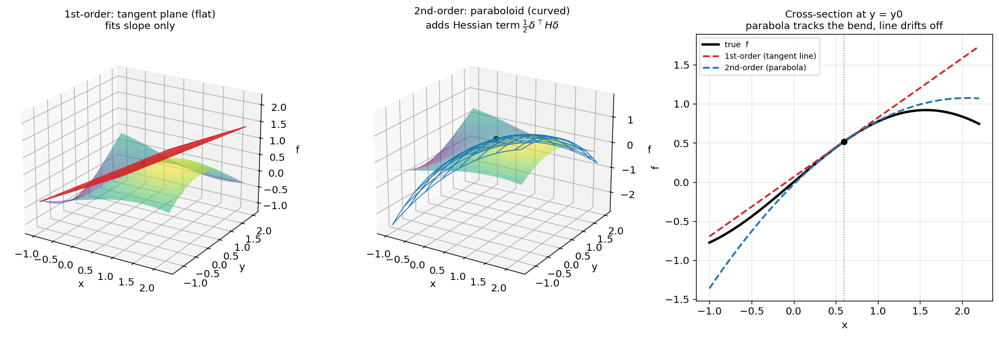
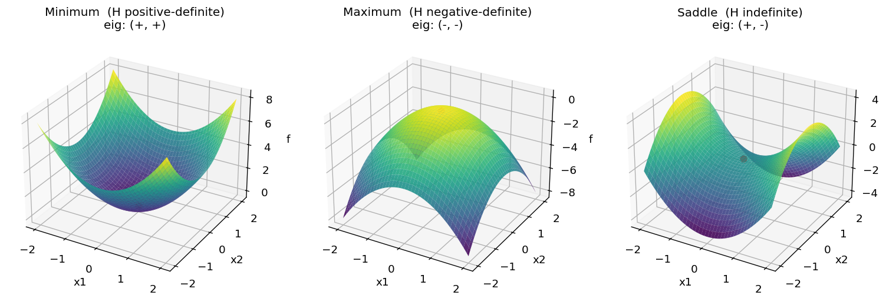
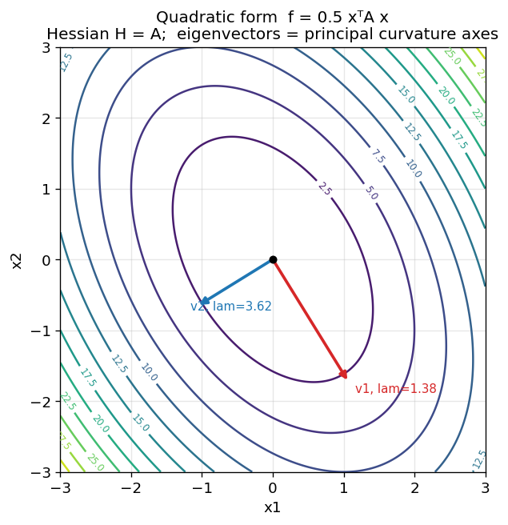
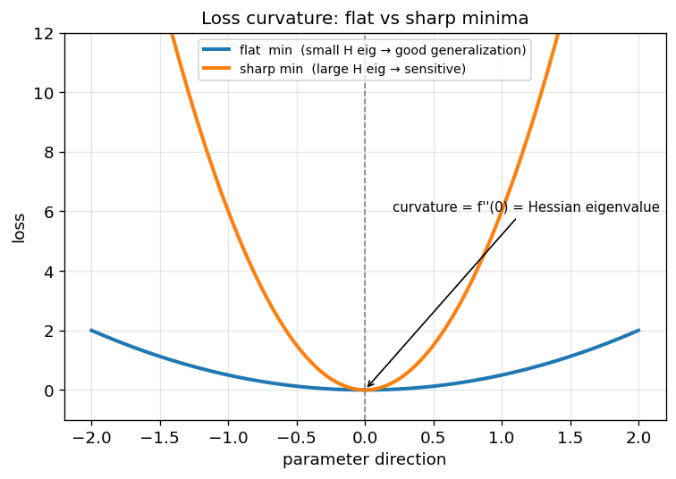
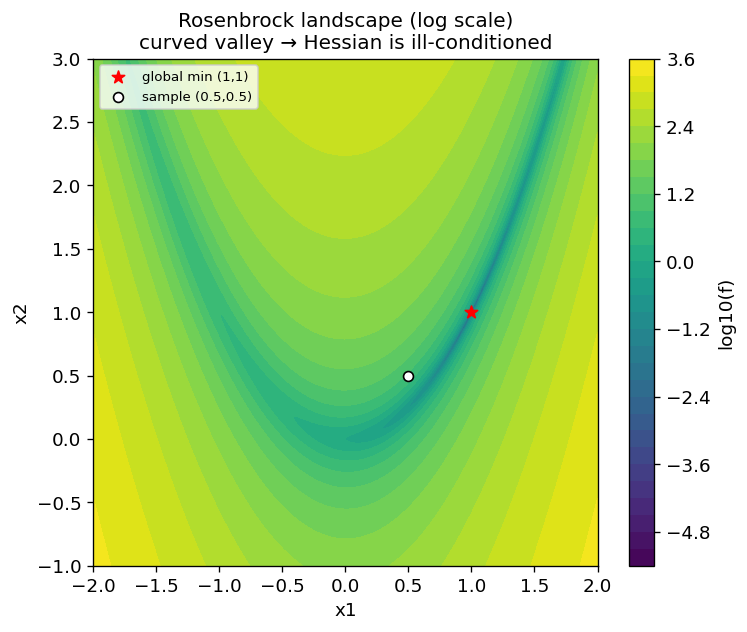
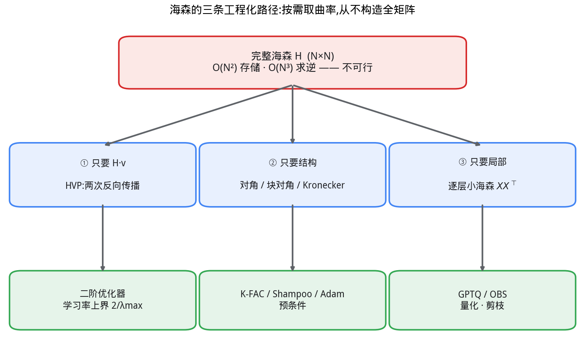
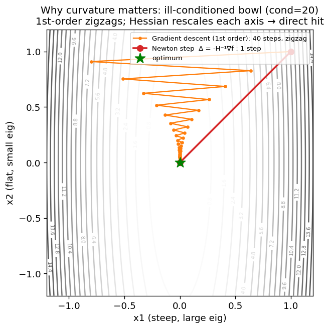

# 海森矩阵 (Hessian Matrix)

> 多元函数的二阶偏导数方阵,刻画函数在某点的**局部曲率**。
> 是牛顿法、损失曲面分析、二阶量化/剪枝等方法的数学基础。

---

## 1. 定义

对 $n$ 元标量函数 $f(\mathbf{x}),\ \mathbf{x}=(x_1,\dots,x_n)$,其海森矩阵为所有二阶偏导构成的 $n\times n$ 方阵:

$$
H(\mathbf{x}) = \nabla^2 f(\mathbf{x}) =
\begin{bmatrix}
\dfrac{\partial^2 f}{\partial x_1^2} & \dfrac{\partial^2 f}{\partial x_1 \partial x_2} & \cdots & \dfrac{\partial^2 f}{\partial x_1 \partial x_n} \\[2mm]
\dfrac{\partial^2 f}{\partial x_2 \partial x_1} & \dfrac{\partial^2 f}{\partial x_2^2} & \cdots & \dfrac{\partial^2 f}{\partial x_2 \partial x_n} \\[1mm]
\vdots & \vdots & \ddots & \vdots \\[1mm]
\dfrac{\partial^2 f}{\partial x_n \partial x_1} & \dfrac{\partial^2 f}{\partial x_n \partial x_2} & \cdots & \dfrac{\partial^2 f}{\partial x_n^2}
\end{bmatrix}
$$

即 $H_{ij} = \dfrac{\partial^2 f}{\partial x_i \partial x_j}$。

---

## 2. 核心性质

- **对称性**:二阶偏导连续时(Schwarz 定理),$\dfrac{\partial^2 f}{\partial x_i \partial x_j} = \dfrac{\partial^2 f}{\partial x_j \partial x_i}$,故 $H = H^\top$。
- **与梯度的关系**:海森是梯度场 $\nabla f$ 的雅可比矩阵,$H = J(\nabla f)$。
- **二阶泰勒展开**:在 $\mathbf{x}_0$ 附近
$$
f(\mathbf{x}_0 + \boldsymbol{\delta}) \approx f(\mathbf{x}_0) + \nabla f(\mathbf{x}_0)^\top \boldsymbol{\delta} + \tfrac{1}{2}\boldsymbol{\delta}^\top H \boldsymbol{\delta}
$$
二次项 $\tfrac{1}{2}\boldsymbol{\delta}^\top H \boldsymbol{\delta}$ 正是曲率的来源。

### 为什么偏偏是二阶导?

把泰勒展开的每一阶各管一件事看清楚,就明白海森为什么是**二阶**而不是一阶或三阶:

- **0 阶** $f(\mathbf x_0)$:函数在这点多高。
- **1 阶** $\nabla f^\top\boldsymbol\delta$:斜率/方向——这是**线性逼近(切平面),画出来永远是平的,没有形状**。
- **2 阶** $\tfrac12\boldsymbol\delta^\top H\boldsymbol\delta$:第一个能表达**弯曲(曲率)** 的项——抛物面。



左:一阶切平面只贴住了斜率,很快脱离曲面;中:二阶抛物面靠海森项补上曲率,贴合范围大得多;右:沿一条截面看得最清楚——切线(红)立刻偏离,抛物线(蓝)跟住了真实曲线的弯曲。

三个关键理由:

1. **一阶不能表达弯曲**:线性项画出来是平面,无论怎么取系数都不弯;描述"凹/凸"在数学上最低就需要二次项。
2. **临界点处一阶恰好消失**:判极值要看 $\nabla f=\mathbf 0$ 的点,此时一阶项整个为零,$f(\mathbf x_0+\boldsymbol\delta)\approx f(\mathbf x_0)+\tfrac12\boldsymbol\delta^\top H\boldsymbol\delta$,**是升是降完全由二阶项符号决定**——这正是下一节判定表的由来。
3. **二阶恰好够用且工具成熟**:二次型对应**对称矩阵**,有实特征值、正交特征向量、正定性判据这一整套线性代数工具;三阶导是 $n^3$ 的张量,既难存储又没有"特征值"这种简洁判据。只有当海森退化(出现 0 特征值)时才需要看更高阶。

> 误差视角:一阶逼近的余项是 $O(\|\boldsymbol\delta\|^2)$,二阶逼近把它压到 $O(\|\boldsymbol\delta\|^3)$——海森项补上的正是那块 $O(\|\boldsymbol\delta\|^2)$ 的曲率误差。

---

## 3. 几何意义:判定临界点

在梯度为零($\nabla f = \mathbf{0}$)的临界点处,用 $H$ 的**正定性**(等价于特征值符号)判定极值类型:

| $H$ 的性质 | 特征值 | 结论 |
|-----------|--------|------|
| 正定 | 全部 $>0$ | 局部**极小值** |
| 负定 | 全部 $<0$ | 局部**极大值** |
| 不定 | 有正有负 | **鞍点** |
| 半定 / 奇异 | 含 $0$ | 退化,无法判定 |

> 直觉:$\boldsymbol{\delta}^\top H \boldsymbol{\delta} > 0$ 表示沿任意方向都"向上弯",即碗状极小。



三种曲面对应海森特征值的三种符号组合:**两正**(碗状,极小)、**两负**(倒碗,极大)、**一正一负**(马鞍,鞍点)。红点为梯度归零的临界点。

### 特征向量 = 主曲率方向

海森的**特征向量指出主曲率方向,特征值给出该方向的曲率大小**。对二次型 $f=\tfrac12\mathbf{x}^\top A\mathbf{x}$(此时 $H=A$),等高线是椭圆:



- 小特征值 $\lambda_1=1.38$ 对应方向 $v_1$ → 曲率小 → 等高线**稀疏**,是椭圆**长轴**;
- 大特征值 $\lambda_2=3.62$ 对应方向 $v_2$ → 曲率大 → 等高线**密集**,是椭圆**短轴**。
- 二者比值 $\lambda_{\max}/\lambda_{\min}$ 即**条件数**,决定梯度下降的收敛难度(越大越难,呈"峡谷"震荡)。

---

## 4. 在深度学习中的作用

1. **二阶优化(牛顿法)**
   更新公式 $\boldsymbol{\theta} \leftarrow \boldsymbol{\theta} - H^{-1}\nabla f$,用曲率自适应缩放步长。
   但 $H$ 规模为 $O(N^2)$($N$ 为参数量),神经网络中**无法显式存储/求逆**,故有 L-BFGS、K-FAC、Shampoo 等近似。

2. **Hessian-vector product (HVP)**
   实践中几乎从不显式构造 $H$,而是计算 $H\mathbf{v}$——通过两次自动微分即可,开销与一次反向传播同阶,避免 $O(N^2)$。核心恒等式:$H\mathbf{v} = \nabla_{\boldsymbol\theta}\big(\nabla_{\boldsymbol\theta} f \cdot \mathbf{v}\big)$,即"梯度与 $\mathbf{v}$ 的内积"再求一次梯度。

   ```mermaid
   flowchart LR
       A["loss f(θ)"] -->|"一次反向<br/>create_graph=True"| B["梯度 g = ∇f"]
       B --> C["标量内积<br/>s = g · v"]
       C -->|"二次反向"| D["H·v = ∇s"]
       style A fill:#e8f0fe,stroke:#4285f4
       style D fill:#fce8e6,stroke:#d62728
   ```

3. **损失曲面分析**
   $H$ 的特征值谱反映 loss landscape 的平坦/尖锐程度;flat minima 通常泛化更好。最大特征值可由幂迭代 + HVP 估计。

   

   同样是极小值,**平坦**(小特征值)对参数扰动不敏感、泛化更好;**尖锐**(大特征值)对扰动敏感。最大特征值 $\lambda_{\max}$ 就是这条曲线在极小点的二阶导(曲率),是常用的"尖锐度"度量。

4. **二阶量化 / 剪枝**
   OBD / OBS / GPTQ 等用海森(或其近似)衡量参数扰动 $\Delta\theta$ 对 loss 的影响 $\approx \tfrac{1}{2}\Delta\theta^\top H \Delta\theta$,指导量化误差补偿与重要性排序。与本仓库 `xqt/` 量化实验直接相关。

---

## 5. PyTorch 示例

### 5.1 解析验证:二次型 $f(\mathbf{x}) = \tfrac{1}{2}\mathbf{x}^\top A \mathbf{x}$

对二次型,海森恒为对称化矩阵 $\tfrac{1}{2}(A + A^\top)$,可用来对拍数值结果。

```python
import torch

def quad(x: torch.Tensor, A: torch.Tensor) -> torch.Tensor:
    # f(x) = 0.5 * x^T A x,海森解析解为 0.5*(A + A^T)
    return 0.5 * x @ A @ x

A = torch.tensor([[3.0, 1.0],
                  [1.0, 2.0]])           # 已对称
x = torch.randn(2, requires_grad=True)

H = torch.autograd.functional.hessian(lambda v: quad(v, A), x)
print("Hessian:\n", H)                   # 应等于 A
print("对称误差:", (H - H.T).abs().max().item())
```

### 5.2 通用接口:`torch.func.hessian`(推荐)

新版 PyTorch(`torch.func`,旧称 functorch)提供组合式微分,最简洁:



Rosenbrock 是经典非凸测试函数,全局极小在 $(1,1)$(红星)。狭长弯曲的"香蕉谷"意味着海森**条件数极大**(病态),正是用来检验二阶/拟牛顿优化器的标准难题。下面在采样点 $(0.5,0.5)$(白点)处计算其海森并判定曲率符号:

```python
import torch
from torch.func import hessian

def rosenbrock(x: torch.Tensor) -> torch.Tensor:
    # 经典非凸测试函数,极小点 (1, 1)
    return (1 - x[0]) ** 2 + 100 * (x[1] - x[0] ** 2) ** 2

x = torch.tensor([0.5, 0.5])
H = hessian(rosenbrock)(x)
print("Hessian at (0.5, 0.5):\n", H)

# 判定临界点类型:看特征值符号
eigvals = torch.linalg.eigvalsh(H)       # 对称矩阵用 eigvalsh
print("特征值:", eigvals)
print("正定(极小)" if (eigvals > 0).all() else "非正定")
```

### 5.3 Hessian-vector product(神经网络的实战做法)

参数量大时**不构造** $H$,只算 $H\mathbf{v}$。下面用双重反向传播实现:

```python
import torch
import torch.nn as nn

model = nn.Sequential(nn.Linear(10, 16), nn.Tanh(), nn.Linear(16, 1))
x = torch.randn(8, 10)
y = torch.randn(8, 1)

def loss_fn() -> torch.Tensor:
    return ((model(x) - y) ** 2).mean()

params = [p for p in model.parameters() if p.requires_grad]

def hvp(vec_list: list[torch.Tensor]) -> list[torch.Tensor]:
    """计算 H·v:create_graph=True 保留计算图以便二次求导。"""
    loss = loss_fn()
    grads = torch.autograd.grad(loss, params, create_graph=True)
    # 内积 g·v 再对 params 求导 => (∂g/∂θ)·v = H·v
    dot = sum((g * v).sum() for g, v in zip(grads, vec_list))
    hv = torch.autograd.grad(dot, params, retain_graph=True)
    return list(hv)

v = [torch.randn_like(p) for p in params]
Hv = hvp(v)
print("H·v 各层范数:", [t.norm().item() for t in Hv])
```

### 5.4 用 HVP + 幂迭代估计最大特征值(曲率/尖锐度)

```python
import torch

def top_eigenvalue(hvp_fn, params: list[torch.Tensor],
                   iters: int = 20) -> float:
    """幂迭代:重复 v <- H·v / ||H·v||,收敛到最大特征值方向。"""
    v = [torch.randn_like(p) for p in params]
    norm = torch.sqrt(sum((x * x).sum() for x in v))
    v = [x / norm for x in v]

    eig = 0.0
    for _ in range(iters):
        Hv = hvp_fn(v)
        eig = sum((a * b).sum() for a, b in zip(Hv, v)).item()  # Rayleigh 商
        norm = torch.sqrt(sum((x * x).sum() for x in Hv))
        v = [x / (norm + 1e-12) for x in Hv]
    return eig

# 配合 5.3 的 hvp / params 使用
lam_max = top_eigenvalue(hvp, params)
print("最大特征值(谱范数,尖锐度指标):", lam_max)
```

---

## 6. 计算成本与方法选型

| 方法 | 复杂度 | 适用场景 |
|------|--------|----------|
| 显式 `hessian()` | $O(N^2)$ 存储 + $O(N)$ 次反向 | 小模型 / 调试对拍 |
| HVP(双反向) | 与一次反向同阶 | 大模型,只需 $H\mathbf{v}$ |
| HVP + 幂迭代 | 每步一次 HVP | 估计最大特征值 / 尖锐度 |
| L-BFGS / K-FAC / GPTQ | 各类低秩 / 块对角近似 | 二阶优化、量化、剪枝 |

**经验法则**:神经网络里几乎永远不要显式构造 $H$;凡是需要它的地方,先想能不能转化成 HVP。

---

## 7. 工程视角:实际意义、切入点与落地

前面都是"海森是什么";这一节回答工程上更关心的三问:**什么时候会用到它(切入点)、为什么要这么做、最终有什么用。**

> 一句话立场:工程里几乎从不把海森"算出来看一眼",而是把它当作**曲率信息的来源**,被优化器、量化、剪枝等方法**间接**消费。

### 7.1 切入点:工程师在哪些场景会撞见海森

| 场景 | 触发问题 | 海森扮演的角色 |
|------|----------|----------------|
| **优化器选型** | SGD/Adam 在某些层收敛慢、来回震荡 | 曲率告诉你各方向"该走多大步" |
| **模型量化 (PTQ)** | 权重压到 4-bit 后精度掉点 | 衡量"哪个权重动了最伤 loss",并补偿误差 |
| **模型剪枝** | 想删权重又不想掉点 | 算每个权重的"删除代价"(saliency) |
| **学习率 / 稳定性** | LR 调大就发散,调小又太慢 | 最大特征值 $\lambda_{\max}$ 给出 LR 理论上界 |
| **泛化诊断** | 两个模型 loss 一样但泛化不同 | 特征值谱衡量极小点的尖锐/平坦 |

### 7.2 核心矛盾:$O(N^2)$ 的墙——为什么不能直接做

海森是 $N\times N$,$N$ 是参数量。先算笔账:

- 一个 **10 亿参数**($N=10^9$)的模型,$H$ 有 $10^{18}$ 个元素;
- 仅存储就需约 **4 EB**(4×10⁹ GB)显存,求逆是 $O(N^3)$。

**结论:全海森在深度学习里根本不可触碰。** 所有工程方法的本质,都是"在不构造 $H$ 的前提下,拿到我真正需要的那一点曲率信息"。这衍生出三条路径。

### 7.3 三条工程化路径:为什么这么做



1. **只要 $H\mathbf v$(HVP)**:绝不碰矩阵本身,两次自动微分拿到矩阵-向量积(见 §4.2、§5.3)。用于二阶优化、估 $\lambda_{\max}$。
2. **只要结构(近似)**:假设海森近似为对角、块对角或 Kronecker 积,存得下也求得逆。Adam 本质就是用梯度平方近似**对角海森**做预条件;K-FAC/Shampoo 用更精细的块结构。
3. **只要局部(逐层)**:把"全模型 loss 对所有参数"的巨型海森,拆成"单层输出对该层权重"的小海森 $H=\mathbf X\mathbf X^\top$($\mathbf X$ 为该层校准激活)。量化/剪枝走这条路。

### 7.4 落地案例

#### (A) 二阶优化:为什么需要曲率



病态二次型(条件数 20,长条椭圆)上:**一阶梯度下降**沿陡方向反复横跳(zigzag),40 步还在挪;**牛顿步** $\boldsymbol\delta=-H^{-1}\nabla f$ 用海森把各方向按曲率归一化,**一步直达**极小点。

- **为什么这么做**:一阶法对所有方向用同一个标量步长,病态时必然在陡方向震荡、缓方向龟速。
- **有什么用**:L-BFGS、K-FAC、Shampoo、Sophia 等用(近似)曲率减少迭代步数;真实大模型用结构化近似而非真海森。

#### (B) PTQ 量化:GPTQ 的逐层海森(关联本仓库 `xqt/`)

量化引入权重扰动 $\Delta\mathbf w$,对该层输出的损害约为 $\Delta\mathbf w^\top H\,\Delta\mathbf w$,其中 $H=\mathbf X\mathbf X^\top$ 是**激活的二阶统计**。GPTQ 据此**逐列量化,并把误差用 $H^{-1}$ 传播补偿到尚未量化的列**:

```python
import torch

# W: (1, d_in) 待量化;X: (d_in, n) 校准激活(真实激活高度相关 → 海森非对角)
H = X @ X.t()                                   # 逐层海森:激活二阶统计
Hinv = torch.linalg.inv(H + 0.01 * torch.diag(H).mean() * torch.eye(H.shape[0]))

def quant(w, s):                                # 对称均匀量化器
    return torch.clamp(torch.round(w / s), -4, 3) * s
scale = W.abs().max() / 4

# 基线 RTN:逐元素最近邻,无视相关性
W_rtn = quant(W, scale)

# GPTQ:误差按 H⁻¹ 补偿到“后续未量化列”,最小化 ‖(W-Ŵ)X‖
w, Hi = W.clone().squeeze(0), Hinv
for i in range(w.numel()):
    q = quant(w[i], scale)
    err = (w[i] - q) / Hi[i, i]
    w[i + 1:] -= err * Hi[i, i + 1:]            # OBS/GPTQ 核心补偿步
    w[i] = q
W_gptq = w.unsqueeze(0)
```

实测(相关激活,8 台阶量化)该层输出 RMSE:**RTN 2.73 → GPTQ 2.51,降低约 8%**——同样的比特数,靠海森补偿换来更低精度损失。这正是 LLM 4-bit 近无损量化的核心思想。

- **为什么这么做**:逐元素最近邻忽略了权重间的相关性;海森编码了"动这个权重会连带影响哪些输出",据此把误差摊给别处抵消。
- **有什么用**:GPTQ/AWQ/SpQR 让大模型显存减半甚至更多,是 `xqt/` 量化实验的理论基础。

#### (C) 学习率上界:$\eta < 2/\lambda_{\max}$

二次型上梯度下降收敛的充要条件是 $\eta < 2/\lambda_{\max}$,超过必发散。所以**最大特征值直接划定了学习率天花板**。

- **怎么拿到**:不用全海森,用 §5.4 的 **HVP + 幂迭代**估 $\lambda_{\max}$ 即可。
- **有什么用**:解释了 LR 为何调大就炸;也是 warmup、梯度裁剪、SAM(锐度感知最小化)等稳定性技巧的理论依据。

#### (D) 剪枝:OBS 的删除代价

最优脑外科(OBS)用海森算每个权重的删除显著性(saliency)$s_i = \dfrac{w_i^2}{2\,[H^{-1}]_{ii}}$,优先删 $s_i$ 最小者,并同样用 $H^{-1}$ 补偿残余权重。

- **为什么这么做**:单看权重大小($|w_i|$)会误删"虽小但敏感"的权重;海森把敏感度计入。
- **有什么用**:结构化稀疏 → 推理加速、模型变小。

### 7.5 速查:遇到什么用什么

| 你的需求 | 不要做 | 工程做法 |
|----------|--------|----------|
| 加速收敛 / 自适应步长 | 求 $H^{-1}$ | 对角(Adam)或块对角(K-FAC)近似 |
| 估尖锐度 / 定 LR 上界 | 全特征值分解 | HVP + 幂迭代取 $\lambda_{\max}$ |
| 量化 / 剪枝 | 全模型海森 | 逐层 $\mathbf X\mathbf X^\top$ + 误差补偿 |
| 仅需 $H\mathbf v$ | 构造 $H$ | 双反向 HVP(开销≈一次反向) |

---

## 8. 小结

- 海森 = 二阶偏导方阵 = 梯度的雅可比,描述局部曲率。
- 临界点处看特征值符号判极值/鞍点。
- 深度学习中规模 $O(N^2)$ 不可显式处理,核心技巧是 **HVP**(两次自动微分),在二阶优化、loss 曲面分析、量化剪枝中反复出现。
- **工程视角**:从不直接算全海森,而是"按需取曲率"——只要 $H\mathbf v$ 走 HVP、只要结构走对角/块对角近似、只要局部走逐层 $\mathbf X\mathbf X^\top$;落地于优化器预条件、GPTQ 量化(关联 `xqt/`)、学习率上界与剪枝。
