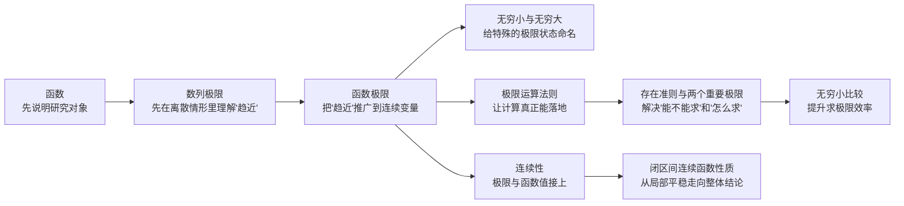
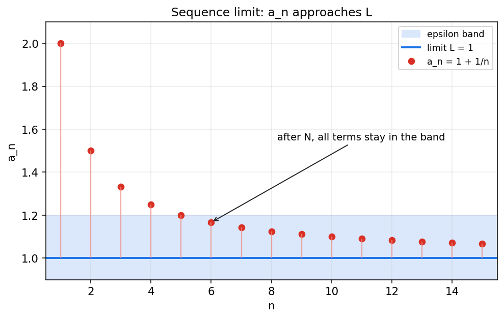
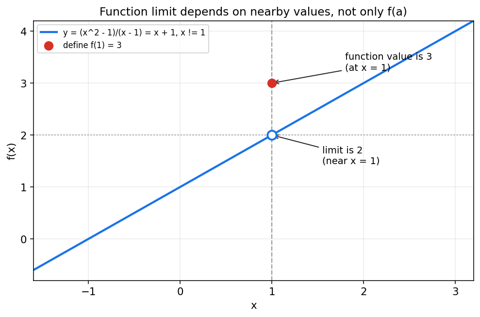
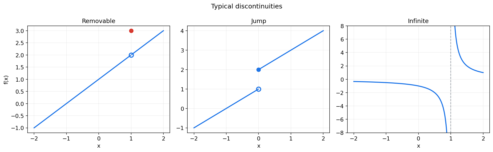
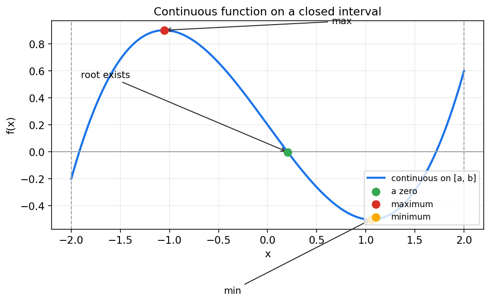

# 同济高等数学第一章教程：函数与极限

> 这一章常被看作“入门章”，其实它一点也不只是热身。  
> 它在回答三个根本问题：
>
> 1. 我们研究的对象到底是什么？  
> 2. 当变量不断变化并逼近某个位置时，函数值会发生什么？  
> 3. 什么叫“变化得足够平稳”，以至于我们可以放心代入、放心运算？
>
> 如果把微积分理解成“研究变化的数学”，那么第一章就是这门学问的语言系统。

---

## 0. 先看全章主线

很多同学第一次学这一章时，会觉得知识点很散：函数、数列极限、函数极限、无穷小、连续性，好像一段一段拼起来的。  
其实它们之间有一条非常自然的线：

一句话概括本章：

> **函数**告诉我们“谁随着谁变”；  
> **极限**告诉我们“靠近时会怎样”；  
> **连续**告诉我们“这种变化有没有断开”；  
> **闭区间连续函数性质**则告诉我们“只要不断开，就能推出很多全局结论”。

带着这条线往下看，整章会顺很多。

---

## 1. 从函数开始：高数到底研究什么

### 1.1 什么是函数

初中和高中已经见过函数，但到了高数里，函数不只是“画一条曲线”。

更准确地说，函数是这样一种对应关系：

> 对定义域中的每一个自变量 $x$，都唯一对应一个函数值 $y$。

写成记号就是

$$
y = f(x), \quad x \in D
$$

其中：

- $D$ 叫做**定义域**
- 所有可能输出的值组成的集合叫做**值域**
- $x$ 是**自变量**
- $f(x)$ 是**因变量**

你可以把函数想成一台规则明确的机器：

- 输入一个允许输入的 $x$
- 机器按某个规则处理
- 输出唯一的 $f(x)$

这里最重要的不是“公式长什么样”，而是**对应规则是否明确、输出是否唯一**。

### 1.2 为什么高数一开始先讲函数

因为微积分研究的所有“变化”，都必须附着在函数上。

我们讨论：

- 导数，是函数在一点附近的变化速度
- 积分，是函数在一段区间上的累积效果
- 极限，是函数在逼近某点时的行为

所以函数不是前菜，它是整门课的主角。

### 1.3 看函数时，要先看哪些东西

刚接触一个函数，建议先按下面这个顺序观察：

| 观察点 | 要问什么 |
|---|---|
| 定义域 | 哪些 $x$ 可以代入？ |
| 对应关系 | $f(x)$ 到底按什么规则生成？ |
| 图像 | 大致长什么样？上升、下降、弯曲还是振荡？ |
| 对称性 | 是奇函数、偶函数，还是都不是？ |
| 周期性 | 会不会重复出现同样的形状？ |
| 有界性 | 函数值会不会无限变大或变小？ |

比如

$$
f(x)=\sqrt{1-x^2}
$$

一眼先看定义域：

$$
1-x^2 \ge 0 \Longrightarrow -1 \le x \le 1
$$

所以这个函数不是对所有实数都有意义，它只在 $[-1,1]$ 上有定义。  
这个习惯非常重要，因为以后很多“极限不存在”“函数不连续”“导数不存在”，根子都在定义域没看清。

### 1.4 初等函数为什么重要

高数第一章通常会把一些最基本的函数当作“积木”：

- 幂函数：$x^\alpha$
- 指数函数：$a^x$
- 对数函数：$\log_a x$
- 三角函数：$\sin x,\cos x,\tan x$
- 反三角函数

后面大量更复杂的函数，往往是这些基本函数经过四则运算、复合运算得到的。  
因此：

> 先熟悉基本函数的性格，后面讨论极限和连续时，才知道哪些地方能直接代入，哪些地方要小心。

---

## 2. 数列极限：先在离散世界里学会“趋近”

在真正讨论函数极限之前，教材通常先讲**数列极限**。这是个很聪明的安排。

因为数列其实就是一种特殊的函数：

$$
n \mapsto a_n, \quad n=1,2,3,\dots
$$

它的自变量不是连续变化的，而是一个一个整数往后走。  
这样我们更容易先建立“越来越接近”的直觉。

### 2.1 直观理解：越来越靠近，但不一定等于

看一个最典型的例子：

$$
a_n = 1+\frac{1}{n}
$$

当 $n=1,2,3,\dots$ 时，

$$
2,\ 1.5,\ 1.\overline{3},\ 1.25,\dots
$$

它们显然越来越接近 $1$。

图中的蓝色水平线是极限 $L=1$，浅蓝色带表示“离 1 不超过某个很小的误差”。  
虽然前面几项还在带子外面，但从某一项开始，后面的所有项都会待在带子里。

这就是“趋近”的本质。

### 2.2 数列极限的严格定义

如果对任意给定的 $\varepsilon > 0$，总能找到一个正整数 $N$，使得当 $n > N$ 时，

$$
|a_n-A|<\varepsilon
$$

那么就说数列 $\{a_n\}$ 的极限是 $A$，记作

$$
\lim_{n\to\infty} a_n = A
$$

这个定义看起来有点绕，但只要抓住一句话就够了：

> **误差要多小都可以，而只要项数取得足够靠后，数列就能进入这个误差范围。**

### 2.3 三个最常见的例子

1. **收敛数列**

$$
\lim_{n\to\infty}\frac{n+1}{n}=1
$$

因为

$$
\frac{n+1}{n}=1+\frac{1}{n}, \quad \frac{1}{n}\to 0
$$

2. **发散但有界**

$$
(-1)^n = -1,1,-1,1,\dots
$$

它不会稳定靠近某个唯一的数，所以极限不存在。

3. **发散且无界**

$$
a_n=n
$$

它越来越大，可以说 $a_n \to +\infty$。

### 2.4 这一步在为后面铺什么路

数列极限教会我们三个非常关键的习惯：

1. 看的是**后面的整体行为**，不是前面有限几项
2. “接近”不要求“等于”
3. 要把直觉变成可检验的数学语言

后面函数极限的定义，几乎就是把这里的“项数 $n$ 足够大”改成“自变量 $x$ 足够靠近某点”。

---

## 3. 函数极限：从离散趋近走向连续趋近

### 3.1 为什么函数极限比数列极限更重要

数列只是在一个个点上取值，函数却是在连续变化。

当我们说

$$
\lim_{x\to a}f(x)=L
$$

本质上是在问：

> 当 $x$ 越来越靠近 $a$，但又不一定真的取到 $a$ 时，$f(x)$ 会不会稳定靠近某个数 $L$？

这件事一旦讲清楚，导数、连续、微分、积分就都有了基础。

### 3.2 一个比定义更重要的直觉

先看经典例子：

$$
f(x)=\frac{x^2-1}{x-1}, \quad x\ne 1
$$

化简后就是

$$
f(x)=x+1,\quad x\ne 1
$$

所以当 $x$ 靠近 $1$ 时，函数值靠近 $2$。

但如果我们额外规定

$$
f(1)=3
$$

会发生什么？

图里有两个关键点：

- 空心点 $(1,2)$ 表示：虽然 $x=1$ 时不取这个值，但附近的函数值都朝这里靠拢
- 实心点 $(1,3)$ 表示：函数在这个点的实际取值

因此：

$$
\lim_{x\to 1}f(x)=2,\qquad f(1)=3
$$

这正说明了一个核心事实：

> **极限看的是“附近”，不是“当点”。**

### 3.3 函数极限的严格定义

如果对于任意 $\varepsilon > 0$，都存在 $\delta > 0$，使得当

$$
0<|x-a|<\delta
$$

时，就有

$$
|f(x)-L|<\varepsilon
$$

那么就说

$$
\lim_{x\to a}f(x)=L
$$

这里的两个字母可以这样理解：

- $\varepsilon$：你对函数值误差的要求有多严格
- $\delta$：我为了满足这个要求，需要把 $x$ 限制在多小的邻域里

所以函数极限的定义其实是在说：

> **只要你对结果的精度提出要求，我总能把自变量控制得足够近，从而满足这个要求。**

### 3.4 左极限、右极限和极限存在

函数极限多了一个数列极限里没有的细节：可以从左边靠近，也可以从右边靠近。

记作：

$$
\lim_{x\to a^-}f(x), \qquad \lim_{x\to a^+}f(x)
$$

要使

$$
\lim_{x\to a}f(x)
$$

存在，必须且只需：

$$
\lim_{x\to a^-}f(x)=\lim_{x\to a^+}f(x)
$$

也就是说，左右两边必须“会师”到同一个值。

### 3.5 函数极限的几种常见类型

第一章里通常会碰到四类写法：

| 类型 | 记号 | 直观意思 |
|---|---|---|
| 自变量趋于有限值 | $\lim_{x\to a}f(x)$ | 看点 $a$ 附近 |
| 自变量趋于无穷大 | $\lim_{x\to\infty}f(x)$ | 看 $x$ 很大时的行为 |
| 函数值趋于无穷大 | $\lim_{x\to a}f(x)=\infty$ | 在 $a$ 附近函数会爆掉 |
| 单侧极限 | $\lim_{x\to a^-}f(x),\ \lim_{x\to a^+}f(x)$ | 只从一侧靠近 |

一开始不要急着背复杂定义，先把“谁在逼近谁”看明白。

---

## 4. 无穷小与无穷大：给特殊极限状态命名

### 4.1 什么叫无穷小

如果当 $x\to a$ 时，

$$
\lim_{x\to a}\alpha(x)=0
$$

就称 $\alpha(x)$ 是当 $x\to a$ 时的**无穷小**。

例如：

- 当 $x\to 0$ 时，$x$ 是无穷小
- 当 $x\to 0$ 时，$\sin x$ 是无穷小
- 当 $x\to \infty$ 时，$\dfrac{1}{x}$ 是无穷小

“无穷小”不是说它永远很小，而是说：

> 在所讨论的极限过程中，它会越来越接近 0。

### 4.2 什么叫无穷大

如果当 $x\to a$ 时，函数值的绝对值可以大到超过任意给定的正数，就说它是无穷大。

例如：

$$
\lim_{x\to 0}\frac{1}{x^2}=+\infty
$$

$$
\lim_{x\to 1}\frac{1}{x-1}
$$

则要分左右：

- $x\to 1^-$ 时趋于 $-\infty$
- $x\to 1^+$ 时趋于 $+\infty$

这里尤其要注意：

> **无穷大不是一个普通实数，它描述的是一种“无界增长”的状态。**

### 4.3 无穷小与无穷大的关系

在函数不为零的前提下，它们常常互为倒数关系：

如果

$$
\alpha(x)\to 0,\quad \alpha(x)\ne 0
$$

那么

$$
\frac{1}{\alpha(x)} \to \infty
$$

反过来，如果

$$
\beta(x)\to \infty
$$

那么

$$
\frac{1}{\beta(x)} \to 0
$$

这个对应关系在后面判断极限类型时非常常用。

---

## 5. 极限运算法则：为什么大多数题都能算出来

光有定义还不够，因为真做题时，不可能每道题都回到 $\varepsilon$-$\delta$ 定义去证明。

真正让极限“能算”的，是运算法则。

### 5.1 最基本的四则运算法则

如果

$$
\lim_{x\to a}f(x)=A,\qquad \lim_{x\to a}g(x)=B
$$

那么通常有：

| 运算 | 结论 |
|---|---|
| 和 | $\lim(f+g)=A+B$ |
| 差 | $\lim(f-g)=A-B$ |
| 积 | $\lim(fg)=AB$ |
| 商 | $\lim\dfrac{f}{g}=\dfrac{A}{B}$，前提是 $B\ne 0$ |

也就是说，极限和代数运算在满足条件时是可以交换次序的。

### 5.2 连续函数可直接代入

如果一个函数在点 $a$ 处连续，那么

$$
\lim_{x\to a}f(x)=f(a)
$$

所以很多极限题，第一步都应该先试：

> **能不能直接代入？**

例如

$$
\lim_{x\to 2}(x^2+3x-1)=2^2+3\cdot 2-1=9
$$

因为多项式函数处处连续。

### 5.3 不能直接代入时，通常怎么做

第一章的极限题大致有下面几种套路：

1. **因式分解并约去**

$$
\lim_{x\to 1}\frac{x^2-1}{x-1}
=\lim_{x\to 1}(x+1)=2
$$

2. **有理化**

$$
\lim_{x\to 0}\frac{\sqrt{1+x}-1}{x}
$$

分子分母同乘 $\sqrt{1+x}+1$：

$$
\frac{\sqrt{1+x}-1}{x}
=\frac{1}{\sqrt{1+x}+1}\to \frac{1}{2}
$$

3. **通分、拆项**

把复杂分式变成可约、可代入的形式。

4. **夹逼**

当函数被两个更容易求极限的函数夹住时，用夹逼准则。

5. **调用重要极限或等价无穷小**

这是第一章中后段最常见的提速手段。

### 5.4 做极限题时的一个务实顺序

建议形成固定动作：

1. 先看定义域和极限点是否合法
2. 先试直接代入
3. 若出现 $\frac{0}{0}$、$\frac{\infty}{\infty}$ 等未定式，再考虑变形
4. 观察有没有因式分解、有理化、通分、夹逼、重要极限、等价无穷小可用

这个顺序一旦固定下来，做题会稳定很多。

---

## 6. 极限存在准则与两个重要极限

这一节是第一章的枢纽。  
前面讲的是“极限是什么”和“如何运算”，这一节开始回答：

- 有些极限为什么一定存在？
- 有些看起来算不出来的极限，为什么会突然有标准答案？

### 6.1 夹逼准则：从两边逼出答案

如果在某个邻域内有

$$
g(x)\le f(x)\le h(x)
$$

并且

$$
\lim_{x\to a}g(x)=\lim_{x\to a}h(x)=L
$$

那么

$$
\lim_{x\to a}f(x)=L
$$

它的思想特别朴素：

> 上下两边都收拢到同一个地方，中间那个函数就没有别的地方可去了。

经典例子：

$$
-|x|\le x\sin\frac{1}{x}\le |x|
$$

当 $x\to 0$ 时，两边都趋于 0，因此

$$
\lim_{x\to 0}x\sin\frac{1}{x}=0
$$

### 6.2 单调有界数列必有极限

这是数列极限里一个很重要的存在准则：

> 若数列单调且有界，则它一定收敛。

例如：

$$
1,\ 1.4,\ 1.41,\ 1.414,\dots
$$

它单调递增，又显然不会超过某个上界，因此会收敛。

这个结论本质上说明：

> **只要变化方向不乱，且不跑到无穷远去，它最终就会稳定下来。**

### 6.3 第一重要极限

$$
\lim_{x\to 0}\frac{\sin x}{x}=1
$$

这是高数里最重要的极限之一。它几乎会在后面每一章反复出现。

它的重要性不只在于结论本身，而在于它意味着：

> 当 $x$ 很小时，$\sin x$ 和 $x$ 几乎一样大。

这也是后面“等价无穷小”最核心的来源之一。

从几何上，它通常借助单位圆中的不等式来证明：

$$
\sin x < x < \tan x \quad (0<x<\tfrac{\pi}{2})
$$

再经过变形和夹逼，得到极限为 1。

### 6.4 第二重要极限

$$
\lim_{n\to\infty}\left(1+\frac{1}{n}\right)^n=e
$$

等价地也常写成

$$
\lim_{x\to 0}(1+x)^{1/x}=e
$$

它告诉我们，常数 $e$ 并不是凭空冒出来的，而是“复利增长”的自然极限。

比如年利率 100%，如果一年只结算一次，本息是 $2$；  
若一年结算很多次，本息会逼近

$$
\left(1+\frac{1}{n}\right)^n
$$

当 $n\to\infty$ 时，这个值趋于 $e\approx 2.71828$。

### 6.5 这两个重要极限为什么分量这么重

因为它们一头连着定义，一头连着大量计算。

后面很多式子都能从它们演化出来，例如：

$$
\lim_{x\to 0}\frac{\tan x}{x}=1,\qquad
\lim_{x\to 0}\frac{\ln(1+x)}{x}=1,\qquad
\lim_{x\to 0}\frac{e^x-1}{x}=1
$$

这些都不是孤立公式，而是同一条脉络上的结果。

---

## 7. 无穷小的比较：为什么有时可以“把它当成另一个”

这一节往往是第一章真正拉开层次的地方。  
它意味着你不再只会“按部就班算”，而是开始学会“看出主导项”。

### 7.1 同阶、高阶、低阶、等价

设当 $x\to a$ 时，$\alpha(x)$ 与 $\beta(x)$ 都是无穷小。

1. 如果

$$
\lim_{x\to a}\frac{\alpha(x)}{\beta(x)}=c\ne 0
$$

则称它们是**同阶无穷小**。

2. 如果特别地

$$
\lim_{x\to a}\frac{\alpha(x)}{\beta(x)}=1
$$

则称它们是**等价无穷小**，记作

$$
\alpha(x)\sim \beta(x)
$$

3. 如果

$$
\lim_{x\to a}\frac{\alpha(x)}{\beta(x)}=0
$$

则 $\alpha(x)$ 是 $\beta(x)$ 的**高阶无穷小**。

4. 如果极限为 $\infty$，则 $\alpha(x)$ 是 $\beta(x)$ 的**低阶无穷小**。

### 7.2 最常用的等价无穷小表

当 $x\to 0$ 时：

| 等价关系 |
|---|
| $\sin x \sim x$ |
| $\tan x \sim x$ |
| $1-\cos x \sim \dfrac{x^2}{2}$ |
| $\ln(1+x)\sim x$ |
| $e^x-1\sim x$ |
| $(1+x)^\alpha-1 \sim \alpha x$ |

这些式子非常值钱。它们常常能把看起来复杂的极限，一下子化成熟悉的幂函数极限。

### 7.3 一个经典例子

求

$$
\lim_{x\to 0}\frac{1-\cos x}{x^2}
$$

因为

$$
1-\cos x \sim \frac{x^2}{2}
$$

所以

$$
\lim_{x\to 0}\frac{1-\cos x}{x^2}
=\lim_{x\to 0}\frac{x^2/2}{x^2}
=\frac{1}{2}
$$

计算瞬间就完成了。

### 7.4 但有一个坑：等价替换不能乱用

很多同学刚学这一节时最容易犯的错是：

> 看见 $\sin x \sim x$，就到处把 $\sin x$ 换成 $x$。

这并不总是对。

例如

$$
\lim_{x\to 0}\frac{\sin x-x}{x^3}
$$

如果你粗暴地把 $\sin x$ 直接换成 $x$，分子就变成 0，信息被抹掉了。  
事实上，这道题需要更高阶展开，结果并不等于 0。

所以要记住一个实用原则：

> **等价无穷小最适合用于乘除结构，不适合直接用于加减结构，除非你已经先把主导项提出来。**

这条经验非常重要。

---

## 8. 连续：当“极限”和“函数值”真正接上

### 8.1 什么叫连续

函数在点 $x=a$ 处连续，指的是三件事同时成立：

1. $f(a)$ 有定义
2. $\lim_{x\to a}f(x)$ 存在
3. $\lim_{x\to a}f(x)=f(a)$

也就是说，函数在这个点没有“脱节”。

从图像上说，连续常被形容为“笔不断地画过去”。  
这虽然不是严格定义，但很有助于建立直觉。

### 8.2 连续的本质，其实就是“附近”和“当点”接上了

回想前面的例子：

- 附近值趋向 2
- 当点值却被定义成 3

这时极限和函数值没接上，所以不连续。

因此你可以把“连续”理解成：

> **函数在一点附近的趋势，与它在该点的实际取值完全一致。**

### 8.3 初等函数为什么普遍好用

多项式、指数、对数、三角函数等初等函数，在它们的定义域内大多都是连续的。  
而连续函数经过加减乘除、复合等运算，在条件满足时仍然连续。

这意味着：

> 很多极限题其实根本不用硬算，只要认出它是连续函数，就可以直接代入。

### 8.4 间断点有哪些类型

如果函数在某点不连续，这个点叫做**间断点**。

常见的三类间断点如下：

1. **可去间断点**

左右极限存在且相等，但函数值没接上。  
这种间断点只要重新定义函数值，就能补好。

2. **跳跃间断点**

左极限和右极限都存在，但不相等。  
图像像“台阶”一样突然跳了一下。

3. **无穷间断点**

函数值在某点附近无限增大或减小，例如 $\dfrac{1}{x-1}$ 在 $x=1$ 附近。

有时教材还会提到**振荡间断点**，例如 $\sin\dfrac{1}{x}$ 在 $x\to 0$ 时不断振荡，也没有极限。

### 8.5 连续性的实际价值

连续不是为了好听，它的价值在于：

- 能放心代入
- 能推导闭区间上的整体性质
- 能为导数和积分提供前提

换句话说，连续是从“局部看起来平稳”走向“整体结论成立”的桥梁。

---

## 9. 闭区间上连续函数的性质：为什么“连续 + 闭区间”这么强

教材到这里，才真正把第一章推向一个高度。  
前面我们讨论的是某个点附近的局部行为，而这一节讨论的是：

> 如果一个函数在整个闭区间 $[a,b]$ 上都连续，那么它会自动拥有怎样的整体性质？

### 9.1 先看图像直觉

一条在闭区间上连续的曲线，会呈现出几个很自然的现象：

- 它不会突然“断掉”
- 它不会在区间内部莫名逃向无穷大
- 它一定能取到最高点和最低点
- 如果一头在 $x$ 轴上方，另一头在下方，那么中间必然穿过 $x$ 轴

这些直觉正对应着下面几个重要定理。

### 9.2 有界性定理

如果函数在闭区间 $[a,b]$ 上连续，那么它在这个区间上一定有界。

也就是说，存在常数 $M>0$，使得对所有 $x\in[a,b]$，都有

$$
|f(x)|\le M
$$

这件事听上去理所当然，但请注意：

> **闭区间** 很关键。  
> 例如 $f(x)=\dfrac{1}{x}$ 在 $(0,1)$ 上连续，却不是有界函数。

### 9.3 最值定理

如果函数在闭区间 $[a,b]$ 上连续，那么它一定能在这个区间内取到最大值和最小值。

也就是说，存在 $x_1,x_2\in[a,b]$，使得

$$
f(x_1)\le f(x)\le f(x_2), \quad \forall x\in[a,b]
$$

这里强调的是“**取到**”，不是只是“有上界下界”。

### 9.4 介值定理

如果函数在闭区间 $[a,b]$ 上连续，而 $f(a)\ne f(b)$，那么对于介于 $f(a)$ 与 $f(b)$ 之间的任意一个数 $\mu$，总存在 $c\in(a,b)$，使得

$$
f(c)=\mu
$$

通俗说：

> 连续曲线从一个高度走到另一个高度，中间高度一个都不会漏掉。

### 9.5 零点定理

零点定理是介值定理的直接推论。

如果函数在 $[a,b]$ 上连续，并且

$$
f(a)\cdot f(b)<0
$$

那么在 $(a,b)$ 内至少存在一点 $\xi$，使得

$$
f(\xi)=0
$$

这一定理在证明方程有根时极其常用。

例如要说明方程

$$
x^3+x-1=0
$$

在 $(0,1)$ 内有根，只需设

$$
f(x)=x^3+x-1
$$

则

$$
f(0)=-1<0,\qquad f(1)=1>0
$$

又因为多项式连续，所以由零点定理知它在 $(0,1)$ 内至少有一个零点。

### 9.6 为什么老师总强调“闭区间”

因为闭区间自带两个非常关键的保护：

1. **端点被包含进来**
2. **区间长度有限，不会无限伸出去**

没有这两个条件，上面的结论很多就会失败。

所以当你看到题目里出现“在闭区间上连续”，要立刻意识到：

> 这往往不是背景信息，而是准备调用全章最强结论的信号。

---

## 10. 把整章重新串成一条线

学完这一章后，脑子里最好留下的不是零散公式，而是下面这条链路：

1. **函数**给出变量之间的对应关系，是研究对象
2. **数列极限**先让我们在离散情形中理解“趋近”
3. **函数极限**把“趋近”推广到连续变化
4. **无穷小与无穷大**给典型极限行为命名
5. **极限运算法则**让求极限变得可操作
6. **存在准则与重要极限**解决一批关键难题
7. **无穷小比较**提升求极限的效率与眼力
8. **连续性**把“附近趋势”和“点上取值”接起来
9. **闭区间连续函数性质**把局部平稳变成全局结论

所以这一章真正想建立的是一种能力：

> **面对一个函数，不只是会算值，而是会判断它在变化过程中的整体行为。**

这正是微积分思维的起点。

---

## 11. 做题时的实战清单

最后给一份可以直接带进习题课的清单。

### 11.1 求极限题，先按这个顺序看

1. 定义域是否有问题？
2. 能不能直接代入？
3. 是否出现未定式？
4. 能否因式分解、约分、有理化、通分？
5. 能否用夹逼？
6. 能否套两个重要极限？
7. 能否用等价无穷小？

### 11.2 判连续题，记住三件事

只要查：

1. 函数值是否存在
2. 极限是否存在
3. 二者是否相等

### 11.3 证明有根题，盯住两个条件

1. 在闭区间上连续
2. 区间两端函数值异号

看到这两个条件，优先想到零点定理。

### 11.4 常见易错点

- 把“极限存在”误认为“函数值存在”
- 把“函数值存在”误认为“连续”
- 左右极限不等，却还写总体极限存在
- 等价无穷小在加减法里乱替换
- 忘记检查分母是否趋于 0、定义域是否允许

---

## 12. 这一章真正该记住的几句话

如果必须把第一章压缩成几句最核心的话，那就是：

> 1. 函数是研究变化的对象。  
> 2. 极限研究的是“靠近时怎样”，不是“取到时怎样”。  
> 3. 连续意味着“附近趋势”和“点上取值”没有断开。  
> 4. 在闭区间上连续，函数就会表现得非常“规矩”。  
> 5. 第一章学会之后，你才真正拥有了进入微积分世界的钥匙。

这章不在于公式背了多少，而在于你是否开始用“变化”和“趋近”的眼光看函数。  
只要这条主线清楚，后面的导数、微分、中值定理、积分，都会顺理成章地接上来。
