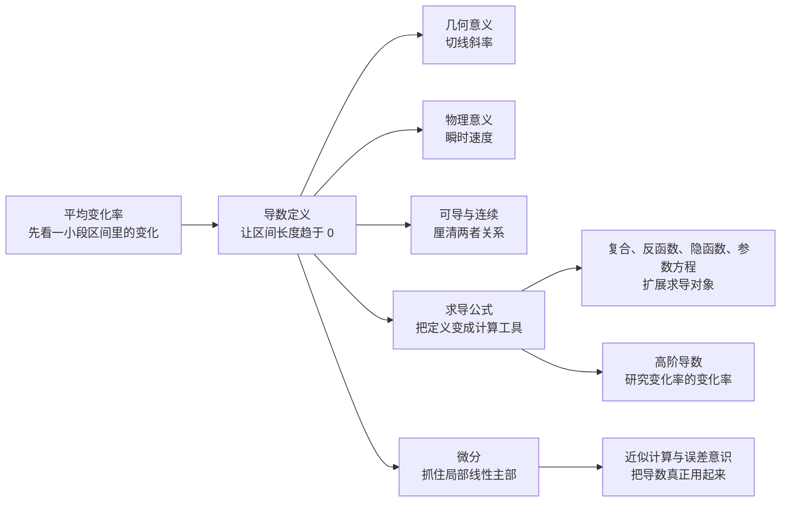
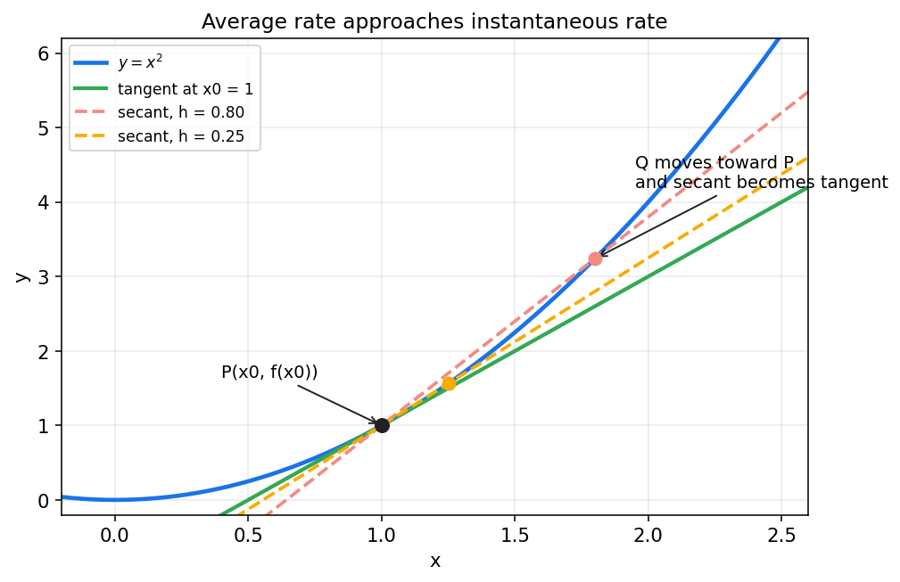
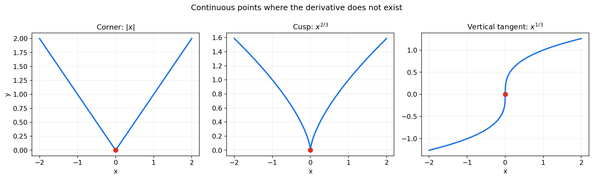
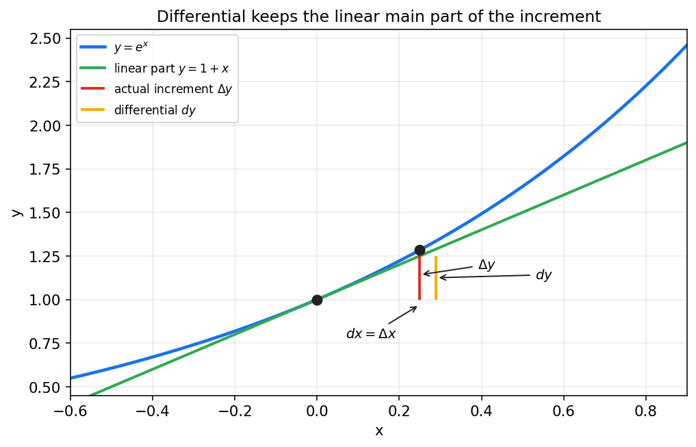

# 同济高等数学第二章教程：导数与微分

> 第一章解决的是“函数在靠近时会怎样”；  
> 第二章要更进一步，追问一个更尖锐的问题：
>
> 1. 当自变量只发生一点点变化时，函数值会怎样变化？  
> 2. 这种变化有没有一个稳定的“瞬时速度”？  
> 3. 如果有，我们能不能把复杂函数在局部近似成一个简单的线性函数？
>
> 这三个问题合在一起，就是导数与微分的核心。

---

## 0. 先看全章主线

第一章把“趋近”讲明白了，第二章则把“变化快慢”讲明白。  
它的主线也很清楚：

一句话概括这一章：

> **导数**是在一点处刻画变化快慢的量；  
> **微分**是在局部用线性函数逼近原函数的工具。

如果第一章是“看函数靠近哪里”，那么第二章就是“看函数在这一刻怎么动”。

---

## 1. 从平均变化率开始：为什么要发明导数

### 1.1 先别急着上定义

假设你开车从 A 地到 B 地，1 小时走了 60 公里。  
那么平均速度当然是

$$
\frac{60}{1}=60\ \text{km/h}
$$

这叫做一段时间内的**平均变化率**。

如果把“路程”记为 $s(t)$，那么在时间区间 $[t,t+\Delta t]$ 上，平均速度就是

$$
\frac{s(t+\Delta t)-s(t)}{\Delta t}
$$

这件事很自然，但它有一个限制：

> 它描述的是“一小段时间里的平均情况”，不是“某一瞬间到底有多快”。

而高数真正关心的，恰恰是这种“瞬时”的问题。

### 1.2 从割线走向切线

把速度的故事换成图像，会更直观。

设函数 $y=f(x)$ 上有两点：

- $P(x_0,f(x_0))$
- $Q(x_0+\Delta x,f(x_0+\Delta x))$

那么割线 $PQ$ 的斜率是

$$
\frac{f(x_0+\Delta x)-f(x_0)}{\Delta x}
$$

这和刚才的平均速度是同一个结构。

图里最关键的事是：  
当点 $Q$ 不断向点 $P$ 靠近，也就是 $\Delta x\to 0$ 时，割线的方向会越来越稳定，最后逼近一条唯一的切线。

于是一个自然的问题就出现了：

> 如果割线斜率在 $\Delta x\to 0$ 时有极限，这个极限能不能拿来定义“函数在点 $x_0$ 处的瞬时变化率”？

这正是导数的出发点。

### 1.3 导数为什么是第一种真正的“局部量”

第一章里，极限讨论的是“靠近时函数值往哪去”。  
第二章的导数，则是在问：

> 当我们把镜头缩到一个点附近，函数图像在这一瞬间到底朝哪个方向、以多快的速度变化？

所以导数是一个非常典型的局部概念。

它不看整段区间的平均，而只看一点附近的细节。  
正因为如此，导数能回答很多极限本身回答不了的问题：

- 函数在这一点是上升还是下降？
- 上升得快还是慢？
- 图像在这里平不平？
- 某个物理量在这一瞬间变化有多快？

---

## 2. 导数的定义：瞬时变化率怎样被严格表达

### 2.1 导数定义

如果极限

$$
\lim_{\Delta x\to 0}\frac{f(x_0+\Delta x)-f(x_0)}{\Delta x}
$$

存在，就称函数 $f(x)$ 在点 $x_0$ 处**可导**，这个极限值叫做函数在 $x_0$ 处的**导数**，记作

$$
f'(x_0)
$$

或者

$$
\left.\frac{dy}{dx}\right|_{x=x_0}
$$

也就是说，

$$
f'(x_0)=\lim_{\Delta x\to 0}\frac{f(x_0+\Delta x)-f(x_0)}{\Delta x}
$$

请注意这个式子的结构：

- 分子是函数值的改变量
- 分母是自变量的改变量
- 整体是平均变化率
- 最后再令改变量趋于 0

所以导数本质上就是：

> **平均变化率的极限。**

### 2.2 另一种等价写法

把 $x=x_0+\Delta x$，那么 $\Delta x=x-x_0$，导数也可以写成

$$
f'(x_0)=\lim_{x\to x_0}\frac{f(x)-f(x_0)}{x-x_0}
$$

这两种写法完全等价。

实际做题时：

- 用 $\Delta x$ 写法，更容易看出“改变量”的含义
- 用 $x\to x_0$ 写法，更方便和极限题联系

### 2.3 第一个例子：$f(x)=x^2$

求 $f(x)=x^2$ 在点 $x_0$ 处的导数。

由定义，

$$
f'(x_0)=\lim_{\Delta x\to 0}\frac{(x_0+\Delta x)^2-x_0^2}{\Delta x}
$$

展开分子：

$$
(x_0+\Delta x)^2-x_0^2 = 2x_0\Delta x+(\Delta x)^2
$$

所以

$$
f'(x_0)=\lim_{\Delta x\to 0}\frac{2x_0\Delta x+(\Delta x)^2}{\Delta x}
=\lim_{\Delta x\to 0}(2x_0+\Delta x)=2x_0
$$

因此

$$
(x^2)'=2x
$$

这一步非常关键，因为它第一次让我们看到：

> 一个具体函数的导数，本身又是一个新函数。

### 2.4 导数存在，到底意味着什么

若 $f'(x_0)$ 存在，说明当 $\Delta x$ 很小时，

$$
\frac{f(x_0+\Delta x)-f(x_0)}{\Delta x}
$$

会稳定逼近某个常数。

也就是说，函数在点 $x_0$ 附近的变化方式，会越来越像一条斜率固定的直线。  
这正是“局部线性化”的雏形，后面讲微分时会再次回到这里。

---

## 3. 导数的几何意义与物理意义

### 3.1 几何意义：切线斜率

若函数在 $x_0$ 处可导，那么导数 $f'(x_0)$ 就是曲线

$$
y=f(x)
$$

在点 $(x_0,f(x_0))$ 处的切线斜率。

于是切线方程是

$$
y-f(x_0)=f'(x_0)(x-x_0)
$$

法线斜率与切线斜率互为负倒数，所以当 $f'(x_0)\ne 0$ 时，法线方程是

$$
y-f(x_0)=-\frac{1}{f'(x_0)}(x-x_0)
$$

若恰好 $f'(x_0)=0$，那么切线水平，法线就是

$$
x=x_0
$$

这说明导数并不只是一个抽象极限，它能立刻变成图像上的斜率。

### 3.2 怎么通过导数读图像

在一点处：

- 若 $f'(x_0)>0$，切线向右上倾斜，函数局部上升
- 若 $f'(x_0)<0$，切线向右下倾斜，函数局部下降
- 若 $f'(x_0)=0$，切线水平，函数在这里暂时“变平”

但要特别注意：

> 导数为 0，只说明该点切线水平，不一定就是极大值或极小值。

比如 $f(x)=x^3$ 在 $x=0$ 处有

$$
f'(0)=0
$$

但它并没有在这里取得最大值或最小值，只是一个“拐着过去”的点。

### 3.3 物理意义：瞬时速度、瞬时变化率

如果位移函数是 $s=s(t)$，那么

$$
s'(t)
$$

表示瞬时速度。

如果速度函数是 $v=v(t)$，那么

$$
v'(t)=a(t)
$$

表示瞬时加速度。

所以“导数”这个词虽然来自数学，但它真正表达的是一种非常普遍的思想：

> **只要某个量随着另一个量变化，导数就描述它在当下这一刻的变化快慢。**

温度随时间变化、成本随产量变化、电压随时间变化，背后都是同一种语言。

---

## 4. 可导与连续：两者是什么关系

### 4.1 可导一定连续

这是第二章第一个必须记牢的结论：

> 若函数在 $x_0$ 处可导，则它在 $x_0$ 处一定连续。

理由并不复杂。  
若 $f$ 在 $x_0$ 处可导，那么

$$
f(x)-f(x_0)=\frac{f(x)-f(x_0)}{x-x_0}(x-x_0)
$$

当 $x\to x_0$ 时：

- 第一部分趋于 $f'(x_0)$
- 第二部分趋于 0

因此

$$
f(x)-f(x_0)\to 0
$$

也就是

$$
f(x)\to f(x_0)
$$

所以函数连续。

### 4.2 连续不一定可导

反过来不成立。  
连续只保证图像“接得上”，但不保证局部斜率存在。

最经典的例子是

$$
f(x)=|x|
$$

它在 $x=0$ 处连续，但

$$
f'_-(0)=-1,\qquad f'_+(0)=1
$$

左、右导数不相等，所以不可导。

图中三种情形都很常见：

1. **角点**：如 $|x|$，左右斜率不同
2. **尖点**：如 $x^{2/3}$，斜率发散到 $\pm\infty$
3. **垂直切线**：如 $x^{1/3}$，斜率趋于无穷大

它们都提示我们：

> 图像不断，不代表切线一定存在。

### 4.3 左导数与右导数

和极限一样，导数也可以从左右两侧分别看：

$$
f'_-(x_0)=\lim_{\Delta x\to 0^-}\frac{f(x_0+\Delta x)-f(x_0)}{\Delta x}
$$

$$
f'_+(x_0)=\lim_{\Delta x\to 0^+}\frac{f(x_0+\Delta x)-f(x_0)}{\Delta x}
$$

函数在 $x_0$ 处可导，当且仅当左右导数都存在且相等。

这个判断在分段函数题里特别常用。

---

## 5. 基本求导公式：从定义走向高效计算

### 5.1 只靠定义不现实

每个函数都从导数定义硬算，当然可以，但会非常慢。  
真正让第二章进入“能做题”状态的，是一整套求导公式。

不过一定要记住：

> 这些公式不是凭空背来的，它们都来自导数定义与极限运算法则。

### 5.2 常见基本公式

下面这张表是第二章最常用的底层积木：

| 函数 | 导数 |
|---|---|
| $C$ | $0$ |
| $x^n$ | $nx^{n-1}$ |
| $\sin x$ | $\cos x$ |
| $\cos x$ | $-\sin x$ |
| $e^x$ | $e^x$ |
| $a^x$ | $a^x\ln a$ |
| $\ln x$ | $\dfrac{1}{x}$ |
| $\log_a x$ | $\dfrac{1}{x\ln a}$ |
| $\tan x$ | $\sec^2 x$ |

这些公式里最值得反复体会的是几个典型事实：

- 幂函数求导会把指数“放下来”
- $\sin x$ 和 $\cos x$ 求导会彼此轮换
- $e^x$ 求导后还是自己
- $\ln x$ 的导数是反比例型

它们决定了后面大多数函数的求导面貌。

### 5.3 四则运算求导法则

若 $u=u(x)$、$v=v(x)$ 都可导，则：

1. 和差法则

$$
(u\pm v)'=u'\pm v'
$$

2. 常数倍法则

$$
(Cu)'=Cu'
$$

3. 乘积法则

$$
(uv)'=u'v+uv'
$$

4. 商法则

$$
\left(\frac{u}{v}\right)'=\frac{u'v-uv'}{v^2},\quad v\ne 0
$$

这里最容易错的是乘积和商：

- 乘积求导不是分别求导再相乘
- 商法则分子顺序是“上导下不动减上不动下导”

### 5.4 一个例子把规则串起来

求

$$
y=(x^2+1)e^x
$$

的导数。

令

$$
u=x^2+1,\qquad v=e^x
$$

则

$$
u'=2x,\qquad v'=e^x
$$

由乘积法则：

$$
y'=u'v+uv' = 2xe^x+(x^2+1)e^x
$$

整理得

$$
y'=e^x(x^2+2x+1)=e^x(x+1)^2
$$

这一步也提醒我们：

> 求导和化简是两件事。先求对，再整理好。

---

## 6. 复合函数求导：链式法则为什么这么重要

### 6.1 复合函数无处不在

很多函数并不是简单的一层，而是“函数套函数”：

- $\sin(x^2)$
- $e^{3x+1}$
- $\ln(1+x^2)$

这类函数如果只靠基本公式，很快就不够用了。  
这时必须用**链式法则**。

### 6.2 链式法则

设

$$
y=f(u),\qquad u=g(x)
$$

且二者都可导，则复合函数

$$
y=f(g(x))
$$

的导数为

$$
\frac{dy}{dx}=\frac{dy}{du}\cdot\frac{du}{dx}
$$

这就是链式法则。

写成更熟悉的形式就是

$$
(f(g(x)))'=f'(g(x))\cdot g'(x)
$$

一句话理解：

> 先对外层函数求导，再乘以内层函数的导数。

### 6.3 例子：$\sin(x^2)$

设

$$
u=x^2,\qquad y=\sin u
$$

则

$$
\frac{dy}{du}=\cos u,\qquad \frac{du}{dx}=2x
$$

所以

$$
\frac{dy}{dx}=\cos(x^2)\cdot 2x
$$

即

$$
(\sin(x^2))'=2x\cos(x^2)
$$

### 6.4 再看一个例子：$\ln(1+x^2)$

令

$$
u=1+x^2,\qquad y=\ln u
$$

则

$$
\frac{dy}{du}=\frac{1}{u},\qquad \frac{du}{dx}=2x
$$

所以

$$
y'=\frac{1}{1+x^2}\cdot 2x=\frac{2x}{1+x^2}
$$

### 6.5 为什么链式法则是第二章的主轴

因为它几乎无处不在：

- 指数、对数、三角函数里套多项式
- 后面隐函数求导
- 参数方程求导
- 再后面的换元积分、微分方程

很多同学一开始只是把它当公式背，但它真正表达的是：

> 一个量通过中间变量再去影响另一个量时，变化率会一层一层传递。

这个思想非常深，也非常通用。

---

## 7. 反函数、隐函数与参数方程求导

### 7.1 反函数求导

若 $y=f(x)$ 在某区间内单调可导，且 $f'(x)\ne 0$，它的反函数记为

$$
x=f^{-1}(y)
$$

则反函数的导数满足

$$
(f^{-1})'(y)=\frac{1}{f'(x)}
$$

这里要记住，式中的 $x$ 不是随便一个 $x$，而是与当前 $y$ 对应的那个点，也就是

$$
x=f^{-1}(y)
$$

若把自变量重新写成 $x$，常见写法是

$$
(f^{-1})'(x)=\frac{1}{f'(f^{-1}(x))}
$$

这说明：

> 反函数的导数，本质上是原函数导数的倒数，只不过要在对应点上取值。

例如

$$
y=\arcsin x
$$

可以看作 $x=\sin y$ 的反函数。由

$$
\frac{dx}{dy}=\cos y
$$

得

$$
\frac{dy}{dx}=\frac{1}{\cos y}
=\frac{1}{\sqrt{1-\sin^2 y}}
=\frac{1}{\sqrt{1-x^2}}
$$

这里能把 $\cos y$ 写成正平方根，是因为反函数 $y=\arcsin x$ 的值域取在

$$
\left[-\frac{\pi}{2},\frac{\pi}{2}\right]
$$

上，此时 $\cos y\ge 0$。

因此

$$
(\arcsin x)'=\frac{1}{\sqrt{1-x^2}}
$$

### 7.2 隐函数求导

有些关系并不是直接写成 $y=f(x)$，而是写成

$$
F(x,y)=0
$$

例如圆

$$
x^2+y^2=1
$$

这时可以把 $y$ 看成 $x$ 的函数，对等式两边同时对 $x$ 求导：

$$
2x+2y\frac{dy}{dx}=0
$$

于是

$$
\frac{dy}{dx}=-\frac{x}{y}
$$

这就是隐函数求导的基本方式。

其中最关键的一点是：

> 对含有 $y$ 的项求导时，不要忘记乘上 $\dfrac{dy}{dx}$。

因为 $y$ 本身也在随着 $x$ 变化。

### 7.3 参数方程求导

如果曲线由参数方程给出：

$$
\begin{cases}
x=\varphi(t)\\
y=\psi(t)
\end{cases}
$$

且 $\varphi'(t)\ne 0$，那么

$$
\frac{dy}{dx}=\frac{dy/dt}{dx/dt}
=\frac{\psi'(t)}{\varphi'(t)}
$$

例如

$$
x=t^2,\qquad y=t^3
$$

则

$$
\frac{dx}{dt}=2t,\qquad \frac{dy}{dt}=3t^2
$$

所以

$$
\frac{dy}{dx}=\frac{3t^2}{2t}=\frac{3t}{2}\quad (t\ne 0)
$$

在 $t=0$ 处，上面的比值形式不能直接代入，需要单独看极限；该点的切线斜率仍为 0。

这类题形式新一些，但本质仍然是链式法则。

---

## 8. 高阶导数：变化率的变化率

### 8.1 什么叫二阶导数

如果函数 $y=f(x)$ 的导函数 $f'(x)$ 仍然可导，那么它的导数叫做**二阶导数**，记作

$$
f''(x)
$$

或

$$
\frac{d^2y}{dx^2}
$$

同理还可以有三阶导数、四阶导数，统称高阶导数。

### 8.2 二阶导数在直觉上表示什么

一阶导数描述“变化率”，二阶导数描述“变化率本身变化得有多快”。

在物理里：

- 位移的一阶导数是速度
- 位移的二阶导数是加速度

在图像上：

- 若 $f''(x)>0$，曲线局部常表现为“向上托起”
- 若 $f''(x)<0$，曲线局部常表现为“向下压下”

虽然拐点与凹凸性通常在后面专门讨论，但这里先建立一点直觉很有帮助。

### 8.3 一个简单例子

设

$$
f(x)=x^3
$$

则

$$
f'(x)=3x^2,\qquad f''(x)=6x
$$

这表示：

- 一阶变化率是 $3x^2$
- 这个变化率本身还在按 $6x$ 的速度变化

到这里你会发现，导数并不是一次性工具，而是可以一层层继续做下去。

---

## 9. 微分：为什么说函数在局部像一条直线

### 9.1 从增量重新出发

设

$$
\Delta y=f(x+\Delta x)-f(x)
$$

如果函数在点 $x$ 处可导，那么根据导数定义，当 $\Delta x$ 很小时，

$$
\Delta y \approx f'(x)\Delta x
$$

更准确地说，

$$
\Delta y = f'(x)\Delta x + o(\Delta x)
$$

其中 $o(\Delta x)$ 表示比 $\Delta x$ 更高阶的小量。

这句话非常重要，因为它说明：

> 函数增量里最主要、最核心的部分，其实是一个线性项。

### 9.2 微分的定义

把自变量的增量记为

$$
dx=\Delta x
$$

则函数的**微分**定义为

$$
dy=f'(x)\,dx
$$

也就是说，微分就是增量中那个线性主部。

因此：

- $\Delta y$ 是真实增量
- $dy$ 是线性近似

二者相近，但不完全相等。

图里黄色线段表示 $dy$，红色线段表示真实的 $\Delta y$。  
当 $dx$ 很小时，二者非常接近；差别正来自曲线的弯曲。

### 9.3 微分为什么有价值

微分最大的价值，是把复杂函数在局部变成简单直线。

例如

$$
y=\sqrt{x}
$$

在 $x=4$ 附近，有

$$
dy=\frac{1}{2\sqrt{x}}dx
$$

取 $x=4$，得

$$
dy=\frac{1}{4}dx
$$

若估算 $\sqrt{4.04}$，可取

$$
dx=0.04
$$

则

$$
dy\approx \frac{1}{4}\cdot 0.04=0.01
$$

所以

$$
\sqrt{4.04}\approx 2+0.01=2.01
$$

而实际值约为 $2.00997$，已经很接近。

这就是微分近似的力量。

### 9.4 微分形式不变性

在一元函数中，

$$
dy=f'(x)\,dx
$$

这个形式看起来很像普通代数乘法。  
很多时候它确实可以像“分数”那样帮助记忆和操作，但本质上仍然来自导数定义。

教材里常说“微分形式不变性”，意思是：

> 无论把变量之间的关系写成哪种中间形式，微分表达式的结构保持一致。

比如

$$
y=\sin u,\qquad u=x^2
$$

则

$$
dy=\cos u\,du,\qquad du=2x\,dx
$$

所以

$$
dy=\cos(x^2)\cdot 2x\,dx
$$

这和链式法则完全一致。

---

## 10. 求导时的实战顺序

学到这里，最容易出现的问题不是“不会求”，而是“看见题后不知道先拆哪一层”。  
所以建议形成一个固定顺序。

### 10.1 先辨认函数结构

拿到一个函数，先问自己：

1. 是基本函数吗？
2. 是和、差、积、商吗？
3. 是复合函数吗？
4. 是反函数、隐函数、参数方程吗？

结构判断对了，方法通常就定了大半。

### 10.2 一个务实的决策流程

1. 先看能否直接套基本公式  
2. 若有加减乘除，先拆成外层代数结构  
3. 若有“函数套函数”，优先想到链式法则  
4. 若题目不是显式写成 $y=f(x)$，考虑隐函数或参数方程  
5. 求完导数后，再看是否需要化简、求切线、求极值或做近似

这个顺序会让你的思路稳定很多。

---

## 11. 常见易错点

### 11.1 把导数当作普通差商，不让分母趋于 0

有些同学写

$$
f'(x)=\frac{f(x+\Delta x)-f(x)}{\Delta x}
$$

就停住了，忘了最后还有

$$
\Delta x\to 0
$$

这一层极限。  
没有这一步，它只是平均变化率，不是导数。

### 11.2 把乘积求导错写成导数相乘

错误写法：

$$
(uv)'=u'v'
$$

正确的是：

$$
(uv)'=u'v+uv'
$$

这个错误非常普遍，必须当场纠正。

### 11.3 链式法则漏乘内层导数

例如

$$
(\sin(x^2))'
$$

错误地写成

$$
\cos(x^2)
$$

漏掉了内层 $x^2$ 的导数 $2x$。  
正确答案应是

$$
2x\cos(x^2)
$$

### 11.4 误以为连续就一定可导

这是从第一章过渡到第二章时最容易混淆的点。  
请牢牢记住：

> 可导一定连续，但连续不一定可导。

### 11.5 把微分和增量完全等同

$$
dy=f'(x)\,dx
$$

是线性主部，  
而

$$
\Delta y=f(x+\Delta x)-f(x)
$$

是真实变化量。

只有当 $dx=\Delta x$ 很小时，才有

$$
\Delta y\approx dy
$$

不能把它们在任何场合都当作严格相等。

---

## 12. 把整章重新串成一条线

这一章真正的链路是：

1. 从平均变化率出发，意识到“瞬时变化率”才是更深的问题
2. 用极限把瞬时变化率严格定义成导数
3. 用切线、速度等直觉解释导数的意义
4. 通过“可导一定连续，但连续不一定可导”厘清边界
5. 用基本公式和链式法则把导数变成可计算工具
6. 把求导对象扩展到反函数、隐函数、参数方程
7. 用高阶导数继续追踪变化率本身
8. 用微分把函数局部线性化，并服务于近似计算

所以这一章真正建立的是一种新的观察方式：

> **不再只问函数值是多少，而是问它此刻如何变化。**

这比第一章更进一步，也更接近微积分的核心。

---

## 13. 做题时的实战清单

### 13.1 求某点导数，先看这几步

1. 题目要你用定义，还是允许直接套公式？
2. 若用定义，先把差商写完整，再展开、约分、取极限
3. 若用公式，先认结构，再选法则
4. 最后检查结果是否还可化简

### 13.2 求切线方程，记住模板

1. 先求切点坐标 $(x_0,f(x_0))$
2. 再求导数 $f'(x_0)$
3. 代入

$$
y-f(x_0)=f'(x_0)(x-x_0)
$$

### 13.3 做近似计算，盯住线性主部

1. 选一个好算的基点
2. 求该点导数
3. 用

$$
\Delta y\approx dy=f'(x)\,dx
$$

4. 最后估算目标值

### 13.4 遇到分段函数，优先查左右导数

尤其在拼接点：

1. 先看函数是否连续
2. 再分别算左导数、右导数
3. 相等才可导

---

## 14. 这一章真正该记住的几句话

如果把第二章压缩成最核心的话，那就是：

> 1. 导数是平均变化率在区间长度趋于 0 时的极限。  
> 2. 导数的几何意义是切线斜率，物理意义是瞬时变化率。  
> 3. 可导一定连续，但连续不一定可导。  
> 4. 链式法则是复合函数求导的总开关。  
> 5. 微分抓住的是函数增量中的线性主部。

到这里，微积分真正开始“动起来”了。  
第一章让你学会看函数靠近哪里，第二章让你学会看函数此刻怎么变。  
再往后，中值定理、导数应用、积分学，都会建立在这一章之上。
