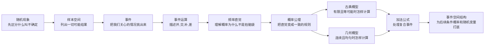
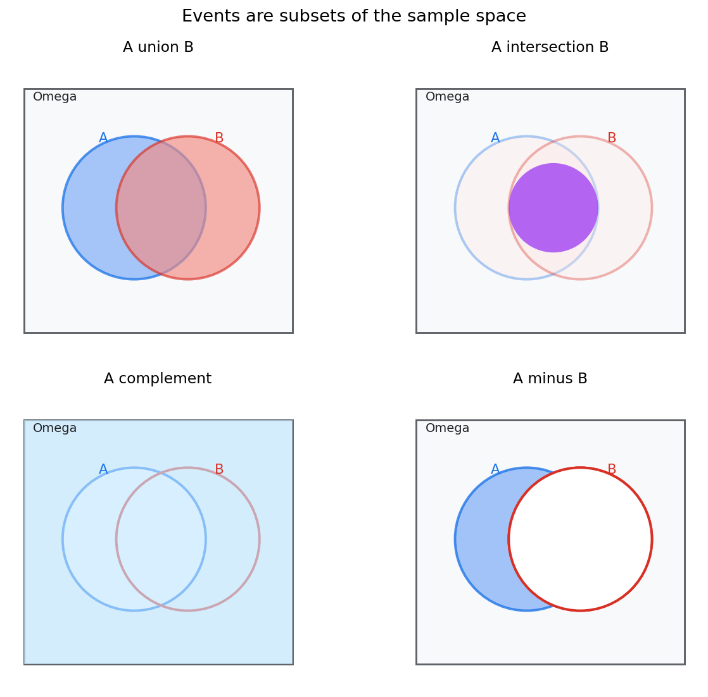
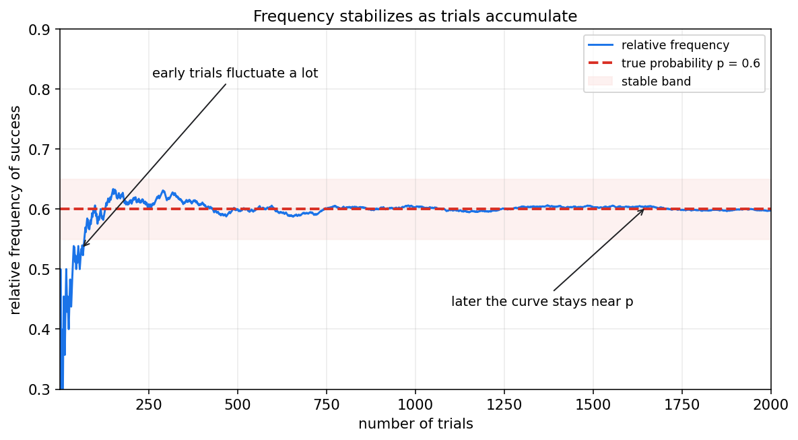
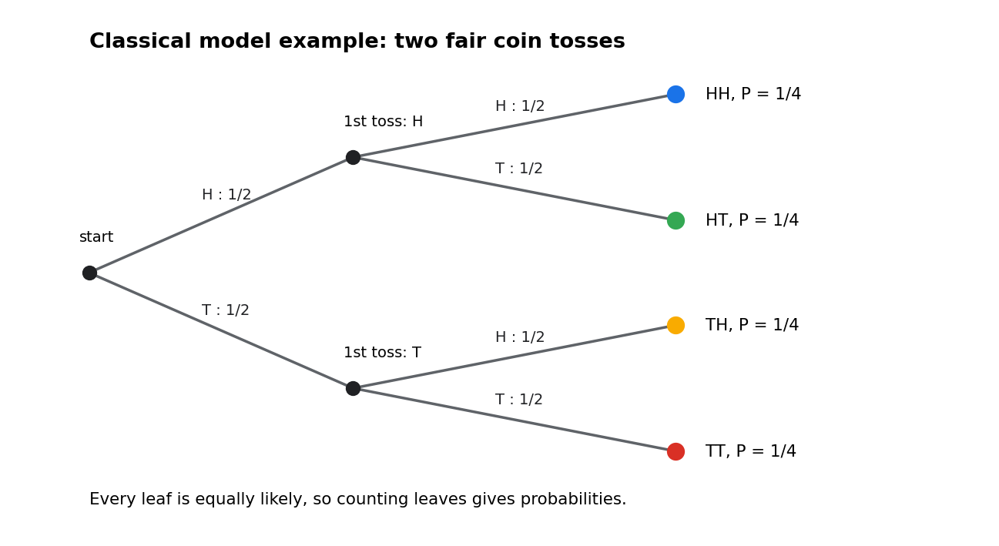
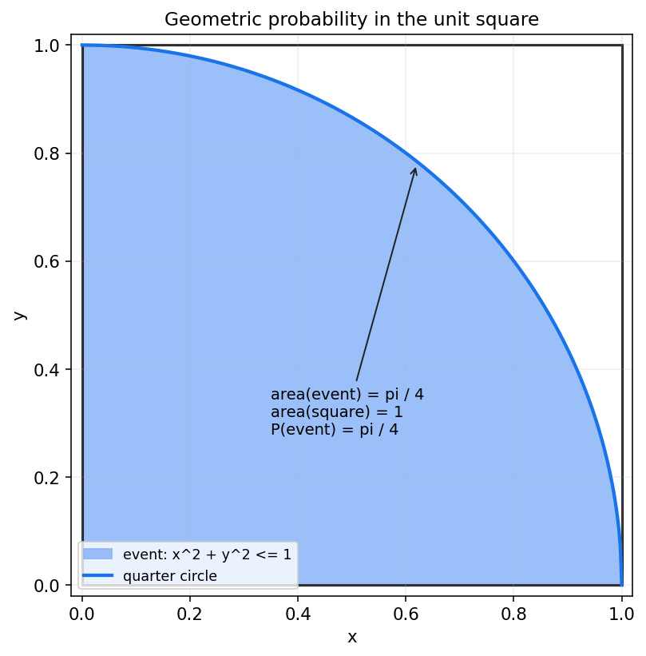

# 概率论第一章教程: 随机现象与概率

> 概率论的起点不是公式, 而是一个很朴素的问题:
>
> 1. 为什么有些现象每次结果都不一样, 但长期看又有规律?
> 2. 当我们说"某件事发生的可能性很大"时, 这个"大"到底该怎样严谨表达?
> 3. 我们怎样把"不确定"这件事写成可计算, 可推理, 可复用的数学语言?
>
> 这一章要做的, 就是把样本空间, 事件, 概率这套最基础的语言系统搭起来.

---

## 0. 先看全章主线

第一章看起来概念很多, 其实主线很简单:

一句话概括这一章:

> 先说清楚"有哪些可能", 再说清楚"关心哪些情况", 最后才谈"这些情况各有多大可能".

如果这个顺序反过来, 后面几乎所有概率题都会变乱.

---

## 1. 为什么需要概率语言

### 1.1 确定现象和随机现象

先看两个对比:

- 把一个石球从手里松开, 它会下落
- 抛一枚硬币, 它可能正面朝上, 也可能反面朝上

第一类现象在给定条件下结果基本确定, 可以叫**确定现象**.  
第二类现象单次结果不确定, 但重复多次后会呈现稳定规律, 可以叫**随机现象**.

概率论研究的正是后一类问题.

要注意一点:

> 随机不等于毫无规律.  
> 如果完全没有规律, 概率论就没有存在的必要.

比如:

- 一次掷骰子的点数不确定
- 但大量重复后, 每个点数出现的频率会接近各自的概率

这就是概率论最核心的气质:  
**单次结果跳动, 整体规律稳定**.

### 1.2 概率论到底在回答什么

概率论并不是要预测某一次一定发生什么, 它更关心下面三类问题:

1. 结果空间里一共有多少种可能?
2. 哪些可能组成了我们关心的事件?
3. 这些事件之间有什么关系, 它们各自多大?

所以概率论的第一步不是算概率, 而是先把问题表达清楚.

---

## 2. 样本空间: 先把所有可能结果摆出来

### 2.1 什么是样本点和样本空间

一次随机试验的每一个可能结果, 叫做一个**样本点**.  
所有样本点组成的集合, 叫做**样本空间**, 记作 $\Omega$.

可以把它理解成:

> 样本点是最细的结果单位, 样本空间是全部可能结果的总清单.

例如:

| 随机场景 | 样本空间 |
|---|---|
| 抛一枚硬币 | $\Omega=\{\text{H},\text{T}\}$ |
| 掷一枚骰子 | $\Omega=\{1,2,3,4,5,6\}$ |
| 同时掷两枚骰子 | $\Omega=\{(i,j): i,j \in \{1,\dots,6\}\}$ |
| 等待一辆车到站的时间 | $\Omega=[0,+\infty)$ |

这里已经能看到一个重要区别:

- 有的样本空间是**离散的**, 可以一个一个列出来
- 有的样本空间是**连续的**, 不能靠枚举写完

### 2.2 样本空间定义错了, 后面都会错

很多初学者一上来就想算概率, 却没有先确认样本空间. 这是第一类高频错误.

例如:

> 问题: "掷两枚骰子, 点数和等于 7 的概率是多少?"

这里样本空间不是

$$
\{2,3,4,\dots,12\}
$$

而应该是

$$
\Omega=\{(i,j): i,j \in \{1,2,3,4,5,6\}\}
$$

因为一次试验的原始结果是"第一枚几点, 第二枚几点", 共有 $36$ 个等可能样本点.

如果把样本空间错写成和的集合, 就相当于偷偷改了试验定义, 算出来的概率往往会错.

### 2.3 一个好习惯

每次做题先问自己三件事:

1. 一次试验到底记录什么?
2. 结果是离散的还是连续的?
3. 是否需要把顺序区分开?

这三问清楚以后, 样本空间通常就清楚了.

---

## 3. 事件: 从全部可能里挑出我们关心的部分

### 3.1 事件是样本空间的子集

概率论里真正讨论概率的对象, 不是单个样本点这个层面上的口语描述, 而是**事件**.

事件本质上是样本空间 $\Omega$ 的一个子集.

如果试验结果落进这个子集, 就说事件发生.

例如在掷骰子问题里:

- 事件 $A$ = "掷出偶数" = $\{2,4,6\}$
- 事件 $B$ = "掷出大于 4 的点数" = $\{5,6\}$

于是:

- 若结果是 $6$, 则 $A$ 发生且 $B$ 发生
- 若结果是 $2$, 则 $A$ 发生但 $B$ 不发生
- 若结果是 $3$, 则 $A,B$ 都不发生

### 3.2 两个特殊事件

两个最特殊的事件必须最早记住:

- **必然事件**: $\Omega$, 一定发生
- **不可能事件**: $\varnothing$, 一定不发生

后面很多公式都默认它们存在.

### 3.3 事件和样本点不是一层东西

这是本章第二个高频错误.

例如:

- 样本点: 掷骰子得到 $4$
- 事件: 掷骰子得到偶数

前者是一个具体结果, 后者是一组结果.  
事件的语言比样本点更适合表达"某类情况".

后面说"条件概率", "独立性", "随机变量", 本质上都还是围绕事件和事件族展开.

---

## 4. 事件之间的关系: 并, 交, 补, 差

有了事件以后, 下一步就是描述事件之间如何组合.

### 4.1 四种最基本的事件运算

给定两个事件 $A,B \subseteq \Omega$:

- **并事件**: $A \cup B$  
  表示 "$A$ 或 $B$ 至少一个发生"
- **交事件**: $A \cap B$  
  表示 "$A$ 和 $B$ 同时发生"
- **补事件**: $A^c$  
  表示 "$A$ 不发生"
- **差事件**: $A \setminus B$  
  表示 "$A$ 发生但 $B$ 不发生"

这些运算不是新东西, 本质上就是集合运算.  
概率论是在集合语言上继续前进.

图里最重要的不是背图形, 而是建立一句稳定翻译:

- "至少一个发生" $\rightarrow$ 并
- "同时发生" $\rightarrow$ 交
- "不发生" $\rightarrow$ 补
- "发生 A 但不发生 B" $\rightarrow$ 差

### 4.2 互斥事件

如果

$$
A \cap B = \varnothing
$$

就说 $A$ 和 $B$ **互斥**.

互斥的意思不是"没关系", 而是:

> 它们不能同时发生.

例如掷一枚骰子时:

- $A$ = "点数是偶数"
- $B$ = "点数是奇数"

则 $A$ 和 $B$ 互斥.

但:

- $C$ = "点数大于 3"
- $D$ = "点数是偶数"

则 $C$ 和 $D$ 不互斥, 因为 $4,6$ 同时属于二者.

后面讲独立性时, 一定要把"互斥"和"独立"分开看. 这两个概念完全不是一回事.

### 4.3 德摩根律

补事件和并, 交之间有两个非常常用的转换:

$$
(A \cup B)^c = A^c \cap B^c
$$

$$
(A \cap B)^c = A^c \cup B^c
$$

翻译成口语就是:

- "A 或 B 发生"的反面, 是"A 和 B 都不发生"
- "A 和 B 同时发生"的反面, 是"A 不发生或 B 不发生"

这两条在化简复杂事件时特别有用.

---

## 5. 频率直觉: 为什么概率不是拍脑袋

### 5.1 从长期重复看概率

概率最自然的经验入口, 是**相对频率**.

如果某个事件 $A$ 在 $n$ 次重复试验里发生了 $m_n$ 次, 那么它的相对频率是

$$
\frac{m_n}{n}
$$

经验上, 当 $n$ 很大时, 这个比值往往会稳定在某个数附近.  
这个稳定值, 就是我们对事件概率的最初直觉来源.

图里能看到两个事实:

1. 前期波动很大
2. 试验次数增多后, 曲线逐渐稳定

这正好回答了很多人的疑问:

> 为什么单次试验不稳定, 但概率仍然有意义?

因为概率从来不是单次结果的承诺, 它更像长期规律的刻画.

### 5.2 频率视角的价值和边界

频率视角很重要, 因为它让概率不再神秘.  
但它也有边界:

- 它更像**建立直觉**
- 它还不是**完整定义**

原因很简单:

1. 不是所有问题都适合做无限次重复实验
2. 我们需要一套统一规则, 去推导更复杂事件的概率

所以现代概率论最终采用的是公理化定义.  
频率给直觉, 公理保一致.

---

## 6. 概率的公理化定义: 用一致规则描述不确定性

### 6.1 概率不是随手指定的数字

给每个事件都拍脑袋塞一个数, 当然也能写出很多"概率", 但这些数彼此很可能矛盾.

例如:

- 若你说 $P(A)=0.8$
- 又说 $P(A^c)=0.5$

那立刻就冲突了, 因为 $A$ 和 $A^c$ 恰好覆盖整个样本空间, 概率应该加起来等于 $1$.

所以概率必须满足一套最基本的一致性规则.

### 6.2 Kolmogorov 三公理

设 $\mathcal{F}$ 是一族允许讨论概率的事件, 概率是一个映射

$$
P: \mathcal{F} \to [0,1]
$$

满足:

1. **非负性**

$$
P(A) \ge 0, \quad \forall A \in \mathcal{F}
$$

2. **规范性**

$$
P(\Omega)=1
$$

3. **可列可加性**

若 $A_1,A_2,\dots$ 两两互斥, 则

$$
P\left(\bigcup_{i=1}^{\infty} A_i\right)=\sum_{i=1}^{\infty} P(A_i)
$$

你现在不必被第三条的形式吓到.  
这一章里只要先抓住有限个互斥事件的版本就够了:

> 互不重叠的事件拼起来, 总概率等于各自概率之和.

### 6.3 由公理直接得到的几个基本结论

从三公理可以很快推出:

1. 不可能事件的概率是 0

$$
P(\varnothing)=0
$$

2. 任意事件的概率都在 $[0,1]$ 内

$$
0 \le P(A) \le 1
$$

3. 补事件公式

$$
P(A^c)=1-P(A)
$$

这些结论后面会被反复使用.

### 6.4 为什么公理化这么重要

公理化的意义不在于形式漂亮, 而在于它带来三件事:

1. 不同问题可以放进同一框架
2. 新公式都能从旧规则推出来
3. 离散和连续场景可以统一处理

这也是为什么概率论既能描述掷骰子, 也能描述等待时间, 还能描述高维机器学习模型里的随机性.

---

## 7. 古典概型: 有限且等可能时怎样计算

### 7.1 适用条件

古典概型是最早也最常用的概率模型之一, 它只在两个条件下适用:

1. 样本空间只有有限个样本点
2. 每个样本点等可能

这两个条件缺一不可.

一旦满足, 事件 $A$ 的概率就是

$$
P(A)=\frac{|A|}{|\Omega|}
$$

也就是:

> 有利结果数 / 全部等可能结果数

### 7.2 一个最简单的例子

掷一枚公平骰子, 事件 $A$ = "点数为偶数".

则

$$
\Omega=\{1,2,3,4,5,6\}, \quad A=\{2,4,6\}
$$

所以

$$
P(A)=\frac{3}{6}=\frac{1}{2}
$$

### 7.3 树状图为什么有用

当试验是分步进行时, 树状图有两个价值:

1. 它能防止漏数和重数
2. 它能把复杂事件拆成叶子节点上的简单结果

例如两次抛公平硬币:

这个图告诉我们:

- 全部结果是 $\{\text{HH},\text{HT},\text{TH},\text{TT}\}$
- 每个叶子结果概率都是 $1/4$

于是:

- "至少出现一次正面"的概率 = $3/4$
- "恰好一次正面"的概率 = $2/4=1/2$

### 7.4 一个稍复杂但更典型的例子

掷两枚公平骰子, 事件 $A$ = "点数和等于 7".

样本空间大小为

$$
|\Omega|=6 \times 6 = 36
$$

有利样本点为

$$
(1,6),(2,5),(3,4),(4,3),(5,2),(6,1)
$$

共 $6$ 个, 所以

$$
P(A)=\frac{6}{36}=\frac{1}{6}
$$

这个例子再次说明:

> 古典概型里最关键的不是套公式, 而是数清楚什么是等可能的基本结果.

### 7.5 古典概型常见误用

下面这些情况不能直接用古典概型:

- 样本点不等可能
- 结果不是有限个
- 你把不同层级的对象混着数

比如"点数和"的 11 个取值并不是等可能的, 所以不能拿 $\{2,\dots,12\}$ 直接均分.

---

## 8. 几何概型: 连续且均匀时怎样计算

### 8.1 从离散计数走向连续面积

如果样本空间不是有限个点, 而是某个区域里的任一点都可能出现, 并且"均匀"出现, 那就不能再靠数样本点.

这时通常转向**几何概型**.

它的核心思想是:

> 在均匀前提下, 概率 = 有利区域的几何量 / 全部区域的几何量

这里的几何量可能是:

- 长度
- 面积
- 体积

### 8.2 单位正方形里的经典例子

在单位正方形 $[0,1] \times [0,1]$ 中均匀随机取一点 $(x,y)$, 求事件

$$
A=\{(x,y): x^2+y^2 \le 1\}
$$

的概率.

这表示点落在第一象限四分之一圆内.

总区域面积是

$$
1 \times 1 = 1
$$

有利区域面积是半径为 $1$ 的四分之一圆面积:

$$
\frac{\pi \cdot 1^2}{4}=\frac{\pi}{4}
$$

所以

$$
P(A)=\frac{\pi/4}{1}=\frac{\pi}{4}
$$

### 8.3 几何概型的隐含前提

几何概型里最容易被忽略的词, 不是"几何", 而是"均匀".

如果取点方式偏向某些区域, 那么面积比就不再等于概率比.

所以几何概型真正依赖的是:

1. 样本空间是连续区域
2. 取样在该区域内均匀

后面学习连续型随机变量和密度函数时, 你会看到这件事会被推广成积分语言.

---

## 9. 概率加法公式: 处理复合事件

### 9.1 为什么不能总是直接相加

很多时候我们会问:

> 事件 $A$ 或事件 $B$ 发生的概率是多少?

直觉上好像应该是

$$
P(A)+P(B)
$$

但这只在 $A,B$ 互斥时才对.  
如果它们有重叠, 交集部分会被重复计算一次.

### 9.2 一般加法公式

正确公式是

$$
P(A \cup B)=P(A)+P(B)-P(A \cap B)
$$

它的逻辑非常简单:

- 先把 $A$ 全算一次
- 再把 $B$ 全算一次
- 但重叠部分 $A \cap B$ 被算了两次, 所以减回一次

### 9.3 互斥事件是特例

若 $A \cap B = \varnothing$, 则

$$
P(A \cup B)=P(A)+P(B)
$$

这就是很多人熟悉的"概率可以直接相加"的真正适用条件.

### 9.4 一个离散例子

掷一枚骰子, 设

- $A$ = "点数为偶数" = $\{2,4,6\}$
- $B$ = "点数大于 3" = $\{4,5,6\}$

则

$$
P(A)=\frac{3}{6}, \quad P(B)=\frac{3}{6}, \quad P(A \cap B)=\frac{2}{6}
$$

所以

$$
P(A \cup B)=\frac{3}{6}+\frac{3}{6}-\frac{2}{6}=\frac{4}{6}=\frac{2}{3}
$$

若直接相加得到 $1$, 就把 $4$ 和 $6$ 重复算了一次.

### 9.5 一个更本质的看法

其实加法公式反映的是集合分解:

$$
A \cup B = (A \setminus B) \cup (A \cap B) \cup (B \setminus A)
$$

这三个部分两两互斥, 所以它们的概率可以直接相加.  
概率公式本质上只是集合结构的数值版本.

---

## 10. 事件空间的结构直觉: 为什么不是任意子集都要谈概率

### 10.1 初学阶段的直觉版本

到目前为止, 你可以先把"事件集合"理解为:

> 一组我们允许拿来讨论概率的事件.

在简单的有限样本空间里, 往往所有子集都可以作为事件.  
但在更一般的连续情形里, 数学上会更谨慎, 通常只选择一族结构良好的集合, 记作 $\mathcal{F}$.

### 10.2 为什么要有这层结构

因为我们至少希望:

1. 如果 $A$ 能谈概率, 那么 $A^c$ 也能谈
2. 如果 $A,B$ 能谈概率, 那么 $A \cup B$ 和 $A \cap B$ 也能谈
3. 如果一串事件都能谈概率, 那么它们的并也最好能谈

也就是说, 事件空间不是随意拼出来的列表, 它需要对常见运算保持封闭.

### 10.3 这一层现在知道到什么程度就够了

第一章不需要进入测度论细节.  
你只要先建立两个印象:

1. 概率总是定义在"事件空间"上, 不是定义在所有口语句子上
2. 事件空间的结构, 是为了保证补, 并, 交这些运算始终合法

后面学条件概率, 随机变量, 分布函数时, 这层结构会越来越自然.

---

## 11. 本章主线总结

把这一章压缩成最短的一条线, 就是:

1. 随机现象的单次结果不确定, 但长期行为有规律
2. 先用样本空间列出所有可能结果
3. 再用事件把我们关心的情况表达成集合
4. 事件之间通过并, 交, 补, 差建立结构
5. 概率用公理化规则给这些事件赋值
6. 在有限等可能时用古典概型, 在连续均匀时用几何概型
7. 复合事件常靠加法公式处理

如果你现在能稳定回答下面三个问题, 这一章就算真的入门了:

1. 试验的样本空间是什么?
2. 目标事件该如何写成集合?
3. 当前模型到底该用计数, 还是该用几何量?

---

## 12. 典型题型与实战清单

这一章最常见的题型, 基本都可以归到下面几类:

1. **定义样本空间**
   - 是否要区分顺序?
   - 是离散还是连续?
   - 原始结果到底记录到哪一层?

2. **把口语条件翻译成事件**
   - "至少一个" $\rightarrow$ 并
   - "同时" $\rightarrow$ 交
   - "都不" $\rightarrow$ 补
   - "A 发生但 B 不发生" $\rightarrow$ 差

3. **古典概型计数**
   - 先找等可能样本点
   - 再数有利结果
   - 警惕漏数, 重数, 错层计数

4. **几何概型计算**
   - 先确认均匀性
   - 再确认总区域和有利区域
   - 最后用长度, 面积或体积比

5. **复合事件概率**
   - 先看是否互斥
   - 不互斥就补上交集修正

一个实战工作流可以直接记成:

> 先建模 -> 再写集合 -> 再选公式 -> 最后算数值

不要一上来就找公式.

---

## 13. 典型误区

### 误区 1: 还没定义样本空间, 就开始算概率

这是最根本的错误.  
样本空间没定清, 后面"等可能"和"有利结果"几乎一定会歪.

### 误区 2: 把样本点和事件混成一层

样本点是单个结果, 事件是一组结果.  
很多口语表达其实对应的是事件, 不是样本点.

### 误区 3: 看到"或"就直接相加

只有互斥事件才能直接加:

$$
A \cap B = \varnothing
$$

否则必须减去交集.

### 误区 4: 把均匀当成默认条件

古典概型依赖等可能, 几何概型依赖均匀.  
这两个词如果题目没给, 不能自己偷偷加上.

### 误区 5: 以为频率定义和公理定义是同一层

频率是直觉入口, 公理是数学框架.  
它们彼此联系很深, 但不属于同一层表述.

---

## 14. 和前后章节的连接点

这一章是全书地基, 它向后连接至少四条线:

1. **第二章**  
   有了事件和概率, 才能讨论"在额外信息出现后, 概率如何更新", 也就是条件概率.

2. **第三章**  
   有了样本空间和事件, 才能进一步把结果映射成数值对象, 引出随机变量与分布.

3. **第五章**  
   概率给出事件大小后, 才能继续压缩出期望, 方差, 熵这些数字特征.

4. **第七章以后**  
   统计推断本质上还是在不确定性下做判断, 它的语言根子仍然在这里.

所以这一章虽然基础, 但不是前菜.  
后面所有章节都在重复使用这里的词汇系统.

---

## 15. 和机器学习, 数据分析, 科研实践的连接点

如果你是带着工程目标来学这一章, 可以提前建立几个对应关系:

1. **二分类预测**
   - "模型预测为正类"是一个事件
   - "真实标签为正类"也是一个事件
   - 精确率, 召回率, 误报率这些指标, 后面都能写成事件概率

2. **A/B 测试**
   - 用户点击, 转化, 留存都可以先看成随机事件
   - 后面做显著性检验前, 本质上还是先在事件层面建模

3. **生成模型和采样**
   - 采样不是魔法, 它是在某个样本空间上按某个概率规则生成结果

4. **风险控制**
   - 误诊, 漏报, 触发告警, 审核通过, 都可以抽象成事件
   - 后面的条件概率和贝叶斯更新, 会直接接到这些任务

所以第一章最现实的价值是:

> 它帮你把"现象描述"升级成"可计算的随机事件描述".

---

## 16. 本章收尾

这一章真正要留下来的, 不是某个单独公式, 而是一个做题和建模顺序:

> 先定义可能性空间, 再定义关心的事件, 最后再赋予概率.

如果这个顺序稳住了, 第二章的条件概率, 贝叶斯公式和独立性就会顺很多.  
如果这个顺序没稳住, 后面看起来像是在学新公式, 实际上是在前面的地基上不断补洞.
