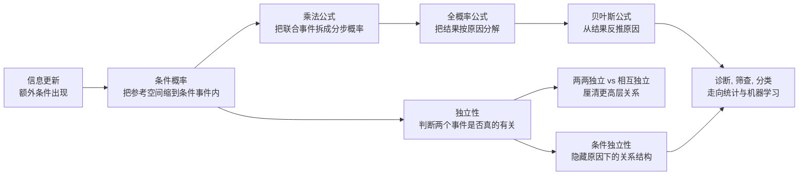
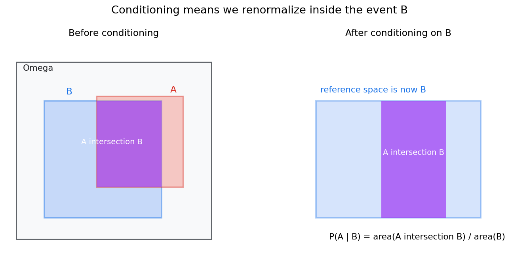
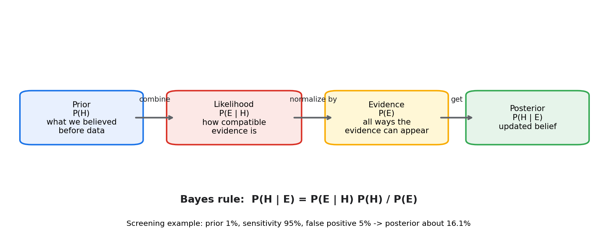
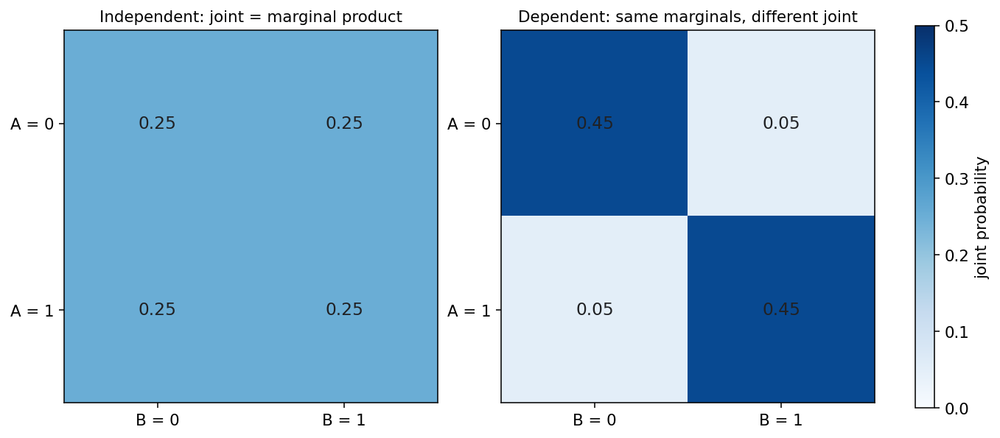
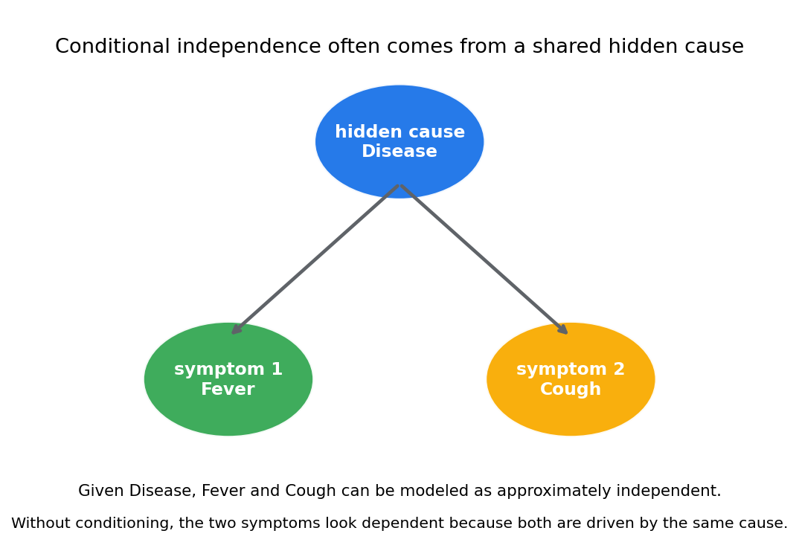

# 概率论第二章教程: 条件概率, 独立性与贝叶斯公式

> 第一章解决的是"有哪些可能, 哪些情况算作事件, 概率如何赋值".  
> 这一章要更进一步, 回答三个更尖锐的问题:
>
> 1. 当额外信息出现以后, 概率应该怎样更新?
> 2. 两个事件之间到底有没有关系, 怎样判断?
> 3. 如果我们看到的是结果, 能不能反过来推最可能的原因?
>
> 这三件事合在一起, 就是条件概率, 独立性与贝叶斯公式的核心.

---

## 0. 先看全章主线

第二章的主线可以压成下面这张图:

一句话概括这一章:

> 条件概率回答"信息变了以后概率怎样变",  
> 独立性回答"两个事件到底有没有关系",  
> 贝叶斯公式回答"已知结果时怎样反推原因".

---

## 1. 为什么信息一变, 概率也要跟着变

### 1.1 一个很简单但很关键的例子

掷一枚公平骰子, 设

- $A$ = "点数为偶数"
- $B$ = "点数大于 3"

在没有额外信息时,

$$
P(A)=\frac{3}{6}=\frac{1}{2}
$$

因为偶数有 $\{2,4,6\}$ 三种.

但如果现在有人告诉你:

> 已知这次掷出的点数大于 3

那你眼前的可能结果就不再是 $\{1,2,3,4,5,6\}$, 而变成

$$
\{4,5,6\}
$$

在这个缩小后的空间里, 偶数只有 $\{4,6\}$ 两种, 所以

$$
P(A \mid B)=\frac{2}{3}
$$

这和原来的 $P(A)=1/2$ 已经不一样了.

### 1.2 这一变化到底在说什么

最关键的直觉是:

> 条件概率不是给事件重新发明一套概率,  
> 而是把参考空间缩到了条件事件内部, 然后在新的参考空间里重新归一化.

也就是说, 你并不是在问:

> "$A$ 本身有多大?"

而是在问:

> "既然已经知道 $B$ 发生了, 那么在 $B$ 这个局部世界里, $A$ 占多大比例?"

这就是条件概率的真正出发点.

---

## 2. 条件概率: 在新的信息下重新看事件大小

### 2.1 定义

若 $P(B)>0$, 则事件 $A$ 在事件 $B$ 已发生条件下的概率定义为

$$
P(A \mid B)=\frac{P(A \cap B)}{P(B)}
$$

这里有三层意思:

1. 只讨论 $B$ 已经发生的情形
2. 在这些情形里, 真正对 $A$ 有利的是 $A \cap B$
3. 最后要除以 $P(B)$, 因为我们已经把总量缩到了 $B$

图中右侧最关键:

- 原来的参考空间是 $\Omega$
- 条件化以后, 新参考空间变成 $B$
- 所以条件概率比较的是 $A \cap B$ 与 $B$ 的比例

### 2.2 为什么分母一定是条件事件

很多人刚学时会把分母写乱, 根源通常是没有想清楚:

> 现在我们到底把谁当成"总盘子"?

一旦题目说"已知 $B$ 发生", 那么总盘子就是 $B$, 不是 $\Omega$, 也不是 $A$.

所以:

$$
P(A \mid B)=\frac{\text{在 } B \text{ 中同时满足 } A \text{ 的部分}}{\text{全部 } B}
$$

这不是死记公式, 而是定义本身.

### 2.3 一个纸牌例子

从一副标准扑克牌中随机抽一张, 设

- $A$ = "抽到红桃"
- $B$ = "抽到人头牌(J,Q,K)"

则

$$
P(B)=\frac{12}{52}
$$

而 $A \cap B$ 表示"红桃 J,Q,K", 共 3 张, 所以

$$
P(A \cap B)=\frac{3}{52}
$$

因此

$$
P(A \mid B)=\frac{P(A \cap B)}{P(B)}
=\frac{3/52}{12/52}
=\frac{3}{12}
=\frac{1}{4}
$$

你也可以直接在条件空间里数:

- 已知是人头牌后, 一共只剩 12 张可能
- 其中红桃人头牌有 3 张

所以答案就是 $3/12$.

### 2.4 $P(A \mid B)$ 和 $P(B \mid A)$ 完全不是一回事

这也是高频误区.

依然用刚才的纸牌例子:

$$
P(A \mid B)=\frac{1}{4}
$$

但

$$
P(B \mid A)=\frac{3}{13}
$$

因为:

- 已知是人头牌时, 看它是红桃的概率
- 已知是红桃时, 看它是人头牌的概率

这两个问题条件不同, 所以答案往往不同.

### 2.5 这一章默认只讨论 $P(B)>0$

如果 $P(B)=0$, 上面的定义不能直接用.  
更一般的零概率条件化需要更高级的测度论工具.

本教程这一层先不展开. 你现在只要先稳住:

> 条件概率 = 在条件事件内部做归一化.

---

## 3. 乘法公式: 把联合事件拆成分步概率

### 3.1 从定义直接推出来

由条件概率定义

$$
P(A \mid B)=\frac{P(A \cap B)}{P(B)}
$$

可直接改写为

$$
P(A \cap B)=P(B)P(A \mid B)
$$

同理也有

$$
P(A \cap B)=P(A)P(B \mid A)
$$

这就是**乘法公式**.

它的直觉是:

> 先走进某个条件世界, 再在这个世界里看另一个事件发生的概率.

### 3.2 一个抽球例子

袋中有 3 个红球, 2 个蓝球. 不放回地连续抽两次, 求"两次都抽到红球"的概率.

设

- $A$ = "第一次抽到红球"
- $B$ = "第二次抽到红球"

则

$$
P(A)=\frac{3}{5}
$$

而在第一次已经抽到红球的条件下, 袋中还剩 2 红 2 蓝, 所以

$$
P(B \mid A)=\frac{2}{4}=\frac{1}{2}
$$

于是

$$
P(A \cap B)=P(A)P(B \mid A)=\frac{3}{5}\cdot\frac{1}{2}=\frac{3}{10}
$$

这就是为什么分步试验里树状图特别有用:  
每一条路径的概率, 通常就是一路条件相乘.

### 3.3 多个事件的链式分解

三个事件时, 可以继续写成

$$
P(A \cap B \cap C)=P(A)P(B \mid A)P(C \mid A \cap B)
$$

更一般地:

$$
P\left(\bigcap_{k=1}^{n} A_k\right)
=P(A_1)P(A_2 \mid A_1)\cdots P\left(A_n \mid \bigcap_{k=1}^{n-1} A_k\right)
$$

这条公式以后在:

- 序列建模
- 图模型
- 语言模型
- 贝叶斯网络

里都会反复出现.

---

## 4. 全概率公式: 把结果按原因拆开

### 4.1 为什么需要它

很多时候我们想算一个事件 $A$ 的概率, 但它本身不好直接算.  
这时可以换个角度:

> 把 $A$ 按不同来源, 不同路径, 不同原因分开统计, 再把它们加起来.

如果 $B_1,B_2,\dots,B_n$ 构成样本空间的一个划分, 即:

1. $B_i$ 两两互斥
2. $\bigcup_{i=1}^{n} B_i=\Omega$
3. 每个 $P(B_i)>0$

那么对任意事件 $A$,

$$
P(A)=\sum_{i=1}^{n} P(A \mid B_i)P(B_i)
$$

这就是**全概率公式**.

### 4.2 公式背后的意思

每一项

$$
P(A \mid B_i)P(B_i)
$$

表示:

> 先走到第 $i$ 类原因 $B_i$, 再在这个原因下发生 $A$

因为这些 $B_i$ 互斥且覆盖全部可能, 所以把所有路径加起来, 就得到总的 $P(A)$.

### 4.3 一个工厂质检例子

某工厂有三条生产线:

- $B_1$: 产量占 50%, 次品率 1%
- $B_2$: 产量占 30%, 次品率 2%
- $B_3$: 产量占 20%, 次品率 4%

设 $A$ = "抽到一件次品".

则

$$
P(B_1)=0.5,\quad P(B_2)=0.3,\quad P(B_3)=0.2
$$

$$
P(A \mid B_1)=0.01,\quad P(A \mid B_2)=0.02,\quad P(A \mid B_3)=0.04
$$

于是

$$
P(A)=0.01 \times 0.5 + 0.02 \times 0.3 + 0.04 \times 0.2
$$

$$
=0.005+0.006+0.008=0.019
$$

所以总体次品率是

$$
1.9\%
$$

### 4.4 全概率公式真正训练的思维

它训练的是一种非常重要的分解习惯:

> 总结果 = 沿着一组互斥且完备的路径逐项求和

后面做:

- 医学筛查
- 用户转化分析
- 分类模型后验计算
- 混合模型推断

几乎都在重复这个套路.

---

## 5. 贝叶斯公式: 从结果反推原因

### 5.1 从乘法公式到贝叶斯公式

对两个事件 $A,B$, 有

$$
P(A \cap B)=P(B)P(A \mid B)=P(A)P(B \mid A)
$$

若 $P(A)>0$, 则

$$
P(B \mid A)=\frac{P(A \mid B)P(B)}{P(A)}
$$

这就是最基本的**贝叶斯公式**.

如果 $\{B_1,\dots,B_n\}$ 是一个划分, 则更常用的版本是

$$
P(B_j \mid A)=
\frac{P(A \mid B_j)P(B_j)}
{\sum_{i=1}^{n} P(A \mid B_i)P(B_i)}
$$

分子是:

> 第 $j$ 个原因产生当前证据的路径概率

分母是:

> 当前证据出现的总概率

### 5.2 四个词一定要分开

贝叶斯公式里最常见的四个词是:

- **先验 prior**: $P(B)$  
  看到新证据之前, 我们对原因 $B$ 的原始判断
- **似然 likelihood**: $P(A \mid B)$  
  如果原因 $B$ 为真, 看到证据 $A$ 的可能性
- **证据 evidence**: $P(A)$  
  不管原因是什么, 证据 $A$ 最终出现的总概率
- **后验 posterior**: $P(B \mid A)$  
  看到证据以后, 对原因 $B$ 的更新判断

如果只会把公式抄出来, 但说不清这四个量各自代表什么, 基本就还没有真正理解贝叶斯更新.

### 5.3 医学筛查的经典例子

设:

- 某疾病患病率为 1%, 即 $P(D)=0.01$
- 检测灵敏度为 95%, 即 $P(+ \mid D)=0.95$
- 假阳性率为 5%, 即 $P(+ \mid D^c)=0.05$

现在问:

> 如果某人检测结果为阳性, 他真的患病的概率是多少?

这就是求

$$
P(D \mid +)
$$

由贝叶斯公式:

$$
P(D \mid +)=\frac{P(+ \mid D)P(D)}{P(+)}
$$

而由全概率公式:

$$
P(+)=P(+ \mid D)P(D)+P(+ \mid D^c)P(D^c)
$$

所以

$$
P(+)=0.95 \times 0.01 + 0.05 \times 0.99
$$

$$
=0.0095+0.0495=0.059
$$

于是

$$
P(D \mid +)=\frac{0.95 \times 0.01}{0.059}
=\frac{0.0095}{0.059}
\approx 0.161
$$

也就是大约

$$
16.1\%
$$

### 5.4 为什么这个结果很多人会觉得反直觉

因为很多人下意识只盯着:

$$
P(+ \mid D)=95\%
$$

但真正想知道的是

$$
P(D \mid +)
$$

这是反过来的条件概率, 完全不是同一个量.

这里最大的影响因素是**基准率**:

- 患病率本来很低
- 即使假阳性率只有 5%, 乘在庞大的健康人群上, 也会产生不少假阳性

如果用 10000 人来想:

- 真患病者约 100 人, 其中约 95 人测阳
- 健康者约 9900 人, 其中约 495 人假阳

于是阳性总人数大约是

$$
95+495=590
$$

真正患病者只占

$$
\frac{95}{590}\approx 16.1\%
$$

这就是所谓的**基准率效应**.

### 5.5 从贝叶斯公式看推断的本质

贝叶斯公式最重要的意义不是会不会套数值, 而是它提供了一条统一的思路:

> 用先验表达原始认知, 用似然表达数据证据, 再把两者合成后验判断.

这条线会一直通向后面的:

- 贝叶斯统计
- 朴素贝叶斯分类
- 概率图模型
- 后验推断

---

## 6. 独立性: 怎样判断两个事件是否真的有关

### 6.1 定义

若两个事件 $A,B$ 满足

$$
P(A \cap B)=P(A)P(B)
$$

则称 $A$ 与 $B$ **独立**.

直觉上, 它的意思是:

> 知道 $B$ 是否发生, 不会改变 $A$ 的概率

若 $P(B)>0$, 这一定义等价于

$$
P(A \mid B)=P(A)
$$

同理, 若 $P(A)>0$, 也等价于

$$
P(B \mid A)=P(B)
$$

### 6.2 一个真正独立的例子

同时做两件互不影响的试验:

- 掷一枚公平硬币
- 掷一枚公平骰子

设

- $A$ = "硬币为正面"
- $B$ = "骰子点数为偶数"

则

$$
P(A)=\frac{1}{2},\quad P(B)=\frac{1}{2}
$$

而

$$
P(A \cap B)=\frac{3}{12}=\frac{1}{4}
$$

正好等于

$$
P(A)P(B)=\frac{1}{2}\cdot\frac{1}{2}=\frac{1}{4}
$$

所以 $A,B$ 独立.

### 6.3 一个不独立的例子

还是掷一枚骰子, 设

- $A$ = "点数为偶数" = $\{2,4,6\}$
- $B$ = "点数大于 3" = $\{4,5,6\}$

则

$$
P(A)=\frac{1}{2},\quad P(B)=\frac{1}{2}
$$

但

$$
P(A \cap B)=\frac{2}{6}=\frac{1}{3}
$$

而

$$
P(A)P(B)=\frac{1}{4}
$$

两者不相等, 所以它们不独立.

更直观地看:

$$
P(A \mid B)=\frac{2}{3}\ne \frac{1}{2}=P(A)
$$

说明知道 $B$ 发生以后, 我们对 $A$ 的判断确实被改变了.

### 6.4 独立不是"没关系"的口语版

数学里的独立比日常语言更严格.

它不是说两个事件"看起来不像有关", 而是要求:

> 联合概率恰好分解成边缘概率的乘积

这是一条定量条件, 不是模糊感觉.

图中左边是独立情形: 联合分布完全等于边缘分布乘积.  
右边虽然边缘分布相同, 但联合分布已经偏向对角线, 表明二者存在依赖.

---

## 7. 独立和互斥一定要分开

### 7.1 互斥说的是不能同时发生

若

$$
A \cap B=\varnothing
$$

则 $A,B$ 互斥.

### 7.2 独立说的是彼此不提供信息

若

$$
P(A \cap B)=P(A)P(B)
$$

则 $A,B$ 独立.

这两件事完全不是一回事.

### 7.3 为什么正概率互斥事件不可能独立

若 $A,B$ 互斥, 则

$$
P(A \cap B)=0
$$

如果它们还独立, 就必须有

$$
0=P(A)P(B)
$$

这意味着至少有一个事件概率为 0.

所以:

> 只要 $P(A)>0$ 且 $P(B)>0$, 互斥事件一定不独立.

### 7.4 一个最简单的例子

掷一枚骰子, 设

- $A$ = "点数为偶数"
- $B$ = "点数为奇数"

它们显然互斥, 但绝不独立.  
因为一旦知道 $A$ 发生, 你立刻知道 $B$ 不会发生.

换句话说:

> 互斥意味着"信息量极强",  
> 独立意味着"信息量为零".

二者恰好是不同方向的概念.

---

## 8. 两两独立和相互独立: 多个事件时关系会更复杂

### 8.1 为什么两个事件的定义不够用了

当事件不止两个时, 只检查每一对是否独立, 还不够.

因为:

> 每对都看起来独立, 并不保证放在一起仍然独立.

### 8.2 两两独立

三个事件 $A,B,C$ 若满足

$$
P(A \cap B)=P(A)P(B),\quad
P(A \cap C)=P(A)P(C),\quad
P(B \cap C)=P(B)P(C)
$$

则称它们**两两独立**.

### 8.3 相互独立

若除了两两独立外, 还满足

$$
P(A \cap B \cap C)=P(A)P(B)P(C)
$$

则称它们**相互独立**.

更一般地, 任意若干个事件的交概率都应分解成各自概率乘积.

### 8.4 一个经典反例

做两次公平抛硬币, 样本空间为

$$
\Omega=\{\text{HH},\text{HT},\text{TH},\text{TT}\}
$$

定义三个事件:

- $A$ = "第一枚是正面" = $\{\text{HH},\text{HT}\}$
- $B$ = "第二枚是正面" = $\{\text{HH},\text{TH}\}$
- $C$ = "两枚结果相同" = $\{\text{HH},\text{TT}\}$

则

$$
P(A)=P(B)=P(C)=\frac{1}{2}
$$

并且

$$
P(A \cap B)=P(A \cap C)=P(B \cap C)=\frac{1}{4}
=\frac{1}{2}\cdot\frac{1}{2}
$$

所以它们两两独立.

但

$$
A \cap B \cap C=\{\text{HH}\}
$$

因此

$$
P(A \cap B \cap C)=\frac{1}{4}
$$

而

$$
P(A)P(B)P(C)=\frac{1}{8}
$$

二者不相等, 所以它们**不是相互独立**.

### 8.5 这一节的真正提醒

多个事件的关系, 比两个事件时复杂得多.  
所以以后看到"独立"这两个字, 一定要留意:

- 说的是两两独立?
- 还是相互独立?

这两个结论强度不同, 不能混用.

---

## 9. 条件独立性: 隐藏原因下的关系结构

### 9.1 定义

若在事件 $C$ 已知的条件下,

$$
P(A \cap B \mid C)=P(A \mid C)P(B \mid C)
$$

则称 $A$ 和 $B$ 在条件 $C$ 下独立, 记作

$$
A \perp B \mid C
$$

它的意思是:

> 一旦知道了 $C$, 再知道 $A$ 是否发生, 对判断 $B$ 已经没有额外帮助.

### 9.2 为什么条件独立性很重要

现实里很多相关性, 其实是由共同原因驱动的.

例如:

- 疾病会同时影响发烧和咳嗽
- 用户兴趣会同时影响点击和停留时长
- 场景类别会同时影响多个视觉特征

在这种情况下, 不加条件时这些现象看起来相关;  
但一旦把共同原因固定住, 关系可能会明显简化.

### 9.3 一个带数字的直觉例子

设 $D$ 表示患病, $F$ 表示发烧, $C$ 表示咳嗽.

假设:

- $P(D)=0.1$
- $P(F \mid D)=0.8,\quad P(C \mid D)=0.7$
- $P(F \mid D^c)=0.1,\quad P(C \mid D^c)=0.2$

再进一步假设:

> 在给定是否患病以后, 发烧和咳嗽条件独立

也就是

$$
P(F \cap C \mid D)=P(F \mid D)P(C \mid D)=0.56
$$

$$
P(F \cap C \mid D^c)=P(F \mid D^c)P(C \mid D^c)=0.02
$$

但在不加条件时, 它们一般并不独立.

先由全概率公式算:

$$
P(F)=0.8 \times 0.1 + 0.1 \times 0.9 = 0.17
$$

$$
P(C)=0.7 \times 0.1 + 0.2 \times 0.9 = 0.25
$$

再算联合概率:

$$
P(F \cap C)=0.56 \times 0.1 + 0.02 \times 0.9 = 0.074
$$

而

$$
P(F)P(C)=0.17 \times 0.25=0.0425
$$

显然

$$
0.074 \ne 0.0425
$$

所以 $F,C$ 在整体上并不独立.

### 9.4 这和机器学习有什么关系

条件独立是很多模型的结构核心, 比如:

- 朴素贝叶斯: 给定类别后, 多个特征近似条件独立
- 隐变量模型: 给定隐藏状态后, 观测量之间关系被简化
- 图模型: 通过条件独立结构压缩联合分布

所以这一节不是抽象修辞, 而是在为后面的概率建模打底.

---

## 10. 诊断, 筛查与分类: 本章概念怎样落地

### 10.1 医学筛查

医学筛查几乎是本章所有概念的集中演示:

- 检测阳性/阴性是事件
- 患病/未患病是原因划分
- 条件概率描述测试在不同人群中的表现
- 全概率公式计算总体阳性率
- 贝叶斯公式把阳性结果转成后验患病概率

所以很多现实误判都不是算错了公式, 而是混淆了:

- $P(+ \mid D)$
- $P(D \mid +)$

### 10.2 垃圾邮件分类

在垃圾邮件分类中:

- $H$ = "邮件是垃圾邮件"
- $E$ = "邮件里出现某些关键词"

那么

$$
P(H \mid E)
$$

就是看到这些词后, 该邮件属于垃圾邮件的后验概率.

如果再把多个词特征近似看成在类别条件下独立, 就会走到朴素贝叶斯分类器.

### 10.3 目标识别与多传感器判断

在目标识别或传感器融合里:

- 某个目标类型是隐藏原因
- 不同传感器读数是证据
- 后验概率用于做最终决策

本章这套语言一旦熟练, 后面进入统计推断和机器学习时会省很多理解成本.

---

## 11. 从条件概率走向后验更新

把本章的公式链压成一条最短主线, 就是:

1. 条件概率:

$$
P(A \mid B)=\frac{P(A \cap B)}{P(B)}
$$

2. 乘法公式:

$$
P(A \cap B)=P(B)P(A \mid B)
$$

3. 全概率公式:

$$
P(A)=\sum_i P(A \mid B_i)P(B_i)
$$

4. 贝叶斯公式:

$$
P(B_j \mid A)=
\frac{P(A \mid B_j)P(B_j)}
{\sum_i P(A \mid B_i)P(B_i)}
$$

你会发现它们其实是同一件事不断展开:

> 先在条件事件里重新计量,  
> 再把联合概率拆开,  
> 再把结果按原因求和,  
> 最后实现从证据到原因的反推.

这条线会一直通向整套贝叶斯统计.

---

## 12. 本章主线总结

第二章真正要留下来的, 是下面五句话:

1. 条件概率是在条件事件内部重新归一化
2. 乘法公式把联合事件写成分步概率
3. 全概率公式把总结果拆成互斥路径求和
4. 贝叶斯公式把证据转成对原因的后验更新
5. 独立性说的是信息不改变判断, 不是口语上的"没关系"

如果这五句话都稳住了, 后面的随机变量, 统计推断, 贝叶斯方法都会顺很多.

---

## 13. 典型题型与实战清单

这一章最常见的题型, 基本都可以归到下面几类:

1. **条件概率直接计算**
   - 先找条件事件
   - 再找交事件
   - 最后除以条件事件概率

2. **分步试验概率**
   - 树状图
   - 乘法公式
   - 不放回抽样尤其常见

3. **全概率公式**
   - 先找一组互斥且完备的原因划分
   - 再按原因逐项加总

4. **贝叶斯反推**
   - 先验
   - 似然
   - 证据
   - 后验

5. **独立性判断**
   - 检查 $P(A \cap B)=P(A)P(B)$
   - 或检查 $P(A \mid B)=P(A)$
   - 不要只凭口头直觉判断

6. **多事件关系**
   - 区分两两独立与相互独立
   - 留意条件独立性是否成立

一个实战工作流可以直接记成:

> 先看信息条件 -> 再定条件空间 -> 再选分解公式 -> 最后判断关系

---

## 14. 典型误区

### 误区 1: 条件概率分母写错

一旦题目说"已知 $B$ 发生", 分母就应该是 $P(B)$, 因为参考空间已经缩到 $B$.

### 误区 2: 把 $P(A \mid B)$ 和 $P(B \mid A)$ 当成一回事

这两个条件完全不同, 方向反了, 不能互换.

### 误区 3: 把互斥误认为独立

对正概率事件来说, 互斥通常意味着强依赖, 而不是独立.

### 误区 4: 只记住贝叶斯公式, 不理解四个角色

如果分不清:

- 先验
- 似然
- 证据
- 后验

那就很容易把筛查和分类问题算成机械代数题.

### 误区 5: 只检查两两独立, 就宣称全部独立

多个事件时, 两两独立不等于相互独立.

### 误区 6: 看到相关就忘记共同原因

很多依赖结构其实来自隐藏变量.  
条件独立性正是为了解释这类情况.

---

## 15. 和前后章节的连接点

这一章向后连接的路线非常清楚:

1. **第三章随机变量与分布**
   - 条件概率会扩展成条件分布
   - 贝叶斯更新会扩展到连续变量和密度函数

2. **第四章多维随机变量**
   - 独立性会变成联合分布能否分解
   - 条件结构会变成边缘分布, 条件分布, 联合分布三者的统一关系

3. **第八章似然与估计**
   - 似然本质上是条件概率在参数推断里的改写

4. **第十二章以后贝叶斯统计**
   - 本章的贝叶斯公式会从事件层面升级到参数和模型层面

所以第二章其实是整套教程从"概率基础"走向"推断和学习"的第一座桥.

---

## 16. 和机器学习, 数据分析, 科研实践的连接点

如果你学这章是为了后面的工程应用, 最值得提前记住的是:

1. **分类模型的输出**
   - 很多模型最终都在估计某种条件概率
   - 例如 $P(y \mid x)$, 给定输入后的类别后验

2. **朴素贝叶斯**
   - 本质上就是贝叶斯公式 + 条件独立近似

3. **诊断与告警系统**
   - 告警触发概率和真实风险概率不是一回事
   - 贝叶斯更新是把检测结果转成真实风险的关键

4. **因果与混杂**
   - 看到相关不等于看到因果
   - 条件独立性是理解混杂和隐藏变量的起点

5. **实验设计**
   - 信息一旦变化, 结论也会变
   - 很多分析错误其实都源于条件没有控制清楚

---

## 17. 本章收尾

如果说第一章是在建立概率的语言, 那第二章就是在让这门语言真正开始流动起来.

从这里开始, 概率不再只是一个静态数值, 而是一套会随着信息变化而更新, 会随着关系结构而改变, 会被用来从结果反推原因的推断机制.

只要你真正抓住下面这句话, 这一章就算过关了:

> 条件概率是在新信息下重新计量,  
> 贝叶斯公式是在证据出现后重新判断,  
> 独立性是在问这份新信息到底有没有改变你.
