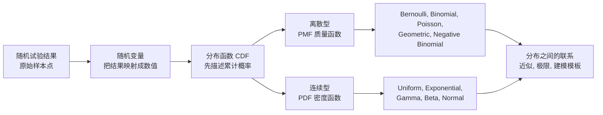
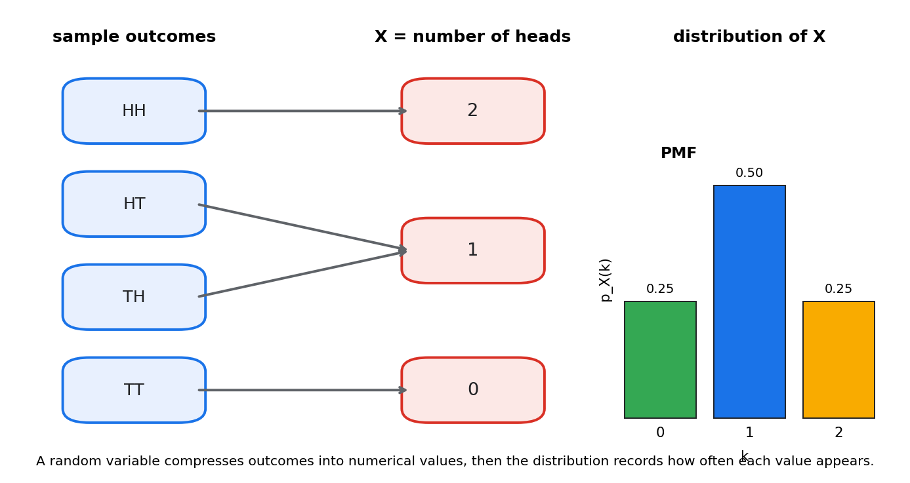
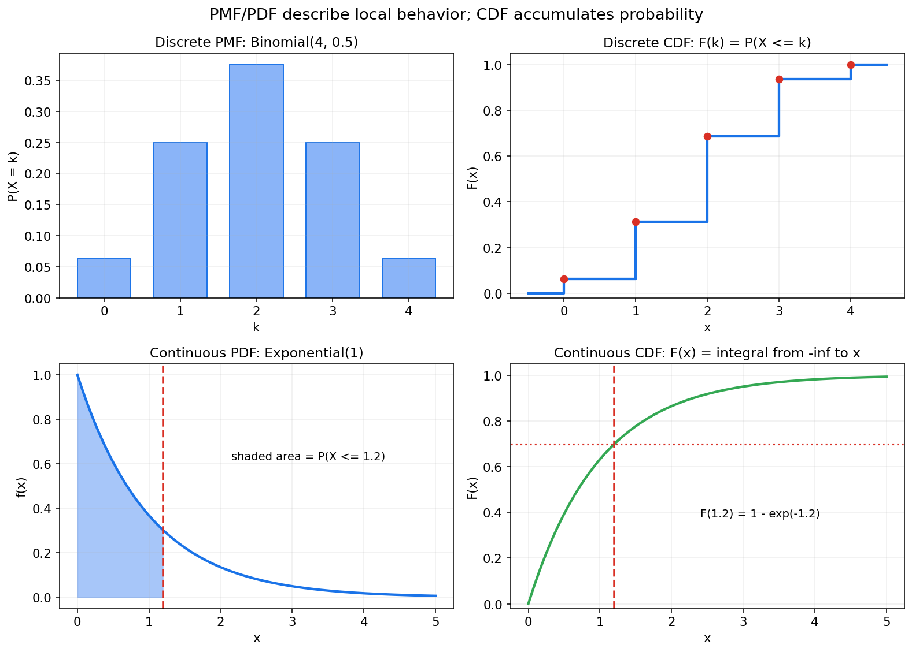
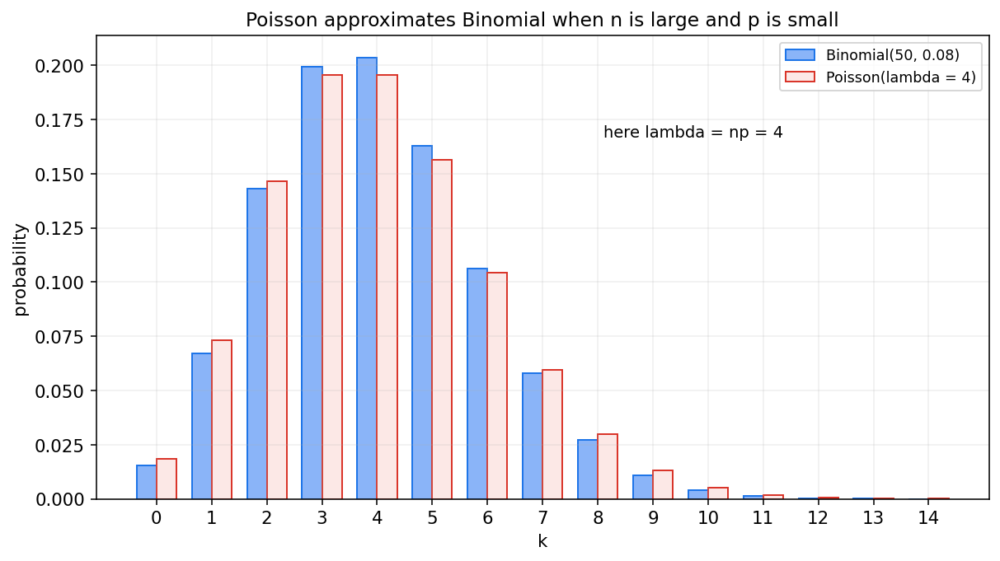
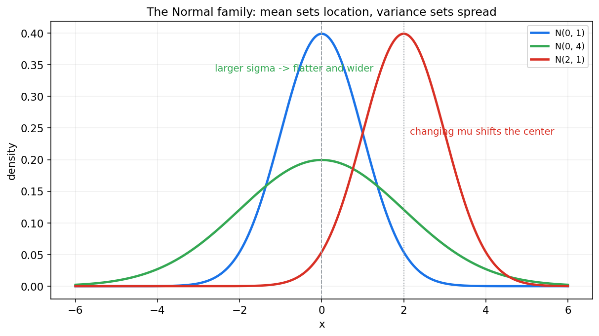

# 概率论第三章教程: 随机变量与常见分布

> 前两章一直在讨论事件是否发生.  
> 但现实问题里, 我们更常关心的其实是数值结果:
>
> 1. 一次试验得到的是多少次点击, 多少分钟等待, 多少分成绩?
> 2. 这些数值是离散地跳, 还是连续地变?
> 3. 我们怎样用一套统一语言描述这些数值出现的规律?
>
> 这一章要做的, 就是把随机变量, 分布函数, 质量函数, 密度函数和一批最常见分布连成一条线.

---

## 0. 先看全章主线

第三章的主线可以压成下面这张图:

一句话概括这一章:

> 随机变量把随机结果变成数值对象,  
> 分布函数描述累计概率,  
> PMF 和 PDF 则分别刻画离散值和连续值的局部结构.

---

## 1. 从事件到数值: 为什么需要随机变量

### 1.1 事件只回答发生与否, 很多问题却关心数值

前两章里, 我们常问:

- "事件 $A$ 会不会发生?"
- "已知 $B$ 发生, $A$ 的概率是多少?"

但在很多现实问题里, 真正关心的是一个数:

- 两次抛硬币一共出现几个正面?
- 一个小时内来了多少个顾客?
- 设备还要多久发生故障?
- 模型预测的概率值落在多少附近?

这时如果还只停留在事件语言, 就会很不方便.

### 1.2 随机变量本质上是一个映射

设样本空间为 $\Omega$, 随机变量 $X$ 本质上是一个把样本点映射到实数的函数:

$$
X: \Omega \to \mathbb{R}
$$

也就是说, 每一个原始结果 $\omega \in \Omega$ 都被赋予一个数值 $X(\omega)$.

这一定义里最重要的词不是"变量", 而是"映射".

> 随机变量首先是一条把结果翻译成数字的规则,  
> 然后我们才去研究这个数字会怎样分布.

### 1.3 一个非常典型的例子

做两次公平抛硬币, 样本空间为

$$
\Omega=\{\text{HH},\text{HT},\text{TH},\text{TT}\}
$$

定义随机变量

$$
X = \text{两次中正面的个数}
$$

则

$$
X(\text{HH})=2,\quad
X(\text{HT})=1,\quad
X(\text{TH})=1,\quad
X(\text{TT})=0
$$

这个图表达了两件事:

1. 随机变量把样本空间里的不同结果压缩成数值
2. 多个样本点可能映射到同一个数值

所以:

- 样本点是原始结果
- 随机变量值是经过映射后的数值结果

这是两层对象, 不能混在一起.

### 1.4 一旦有了随机变量, 事件也能重新写

比如刚才的 $X$, 事件"至少出现一次正面"可以写成

$$
\{X \ge 1\}
$$

事件"恰好一次正面"可以写成

$$
\{X=1\}
$$

这说明:

> 随机变量不是抛开事件另起炉灶,  
> 而是把事件问题重新组织成更适合数值分析的形式.

---

## 2. 离散型与连续型: 数值结果会怎样出现

### 2.1 离散型随机变量

如果随机变量只取有限个或可数无穷多个值, 就称它是**离散型随机变量**.

例如:

- Bernoulli: $X \in \{0,1\}$
- 骰子点数: $X \in \{1,2,3,4,5,6\}$
- 抛硬币出现正面的个数: $X \in \{0,1,\dots,n\}$
- 单位时间内到达的人数: $X \in \{0,1,2,\dots\}$

离散型的核心特征是:

> 概率集中在一个个具体点上.

### 2.2 连续型随机变量

如果随机变量的取值落在某些区间上, 并且概率通过积分来表达, 就称它是**连续型随机变量**.

例如:

- 等车时间
- 零件寿命
- 测量误差
- 身高, 体重, 温度等近似连续量

连续型的核心特征是:

> 概率不是压在单个点上, 而是分布在整个区间上.

### 2.3 先别急着背定义, 先抓住直觉区别

可以把两者直观地区分成:

- 离散型: "数一个个格子"
- 连续型: "量一段段面积"

这也是为什么后面会分别出现:

- 概率质量函数 PMF
- 概率密度函数 PDF

### 2.4 混合型先暂时放一边

现实里还可能出现既有点质量又有连续部分的分布, 比如:

- 先有一定概率直接故障
- 否则寿命服从连续分布

这种叫混合型分布.  
本章主线先专注离散型和连续型, 混合情形不展开.

---

## 3. 分布函数: 先用累计概率统一描述

### 3.1 定义

对任意随机变量 $X$, 它的**分布函数**定义为

$$
F_X(x)=P(X \le x)
$$

这就是所谓的 CDF, cumulative distribution function.

这一定义非常重要, 因为:

> 无论 $X$ 是离散还是连续, CDF 都可以统一定义.

### 3.2 CDF 到底在说什么

$F_X(x)$ 回答的是:

> 随机变量的取值落在 $x$ 左边的概率有多大?

它不是某个点的局部信息, 而是从 $-\infty$ 一路累积到 $x$ 的总概率.

### 3.3 CDF 的几个基本性质

任意分布函数都满足:

1. **单调不减**

若 $x_1 < x_2$, 则

$$
F_X(x_1)\le F_X(x_2)
$$

2. **右连续**

$$
\lim_{t \downarrow x} F_X(t)=F_X(x)
$$

3. **左右极限**

$$
\lim_{x \to -\infty} F_X(x)=0,\quad
\lim_{x \to +\infty} F_X(x)=1
$$

这些性质都很自然:

- 累积区间越往右, 总概率不可能减少
- 左边完全还没覆盖到时概率应为 0
- 右边全覆盖以后总概率应为 1

### 3.4 一个离散例子

还是刚才的 $X$ = 两次抛硬币中正面的个数.  
其分布为:

$$
P(X=0)=\frac{1}{4},\quad
P(X=1)=\frac{1}{2},\quad
P(X=2)=\frac{1}{4}
$$

则分布函数为

$$
F_X(x)=
\begin{cases}
0, & x<0 \\
\frac{1}{4}, & 0 \le x < 1 \\
\frac{3}{4}, & 1 \le x < 2 \\
1, & x \ge 2
\end{cases}
$$

你会看到, 离散型的 CDF 常常是阶梯状的.

### 3.5 一个连续例子

若等待时间 $T$ 服从参数为 $\lambda$ 的指数分布, 那么

$$
F_T(x)=
\begin{cases}
0, & x<0 \\
1-e^{-\lambda x}, & x \ge 0
\end{cases}
$$

这时 CDF 是一条平滑上升曲线.

### 3.6 CDF 和区间概率

一旦知道 CDF, 很多区间概率都能直接读出来:

$$
P(a < X \le b)=F_X(b)-F_X(a)
$$

这条公式对离散型和连续型都成立.  
所以 CDF 是最统一的总入口.

---

## 4. PMF 与 PDF: 局部结构怎样表达

### 4.1 离散型的概率质量函数 PMF

对离散型随机变量 $X$, 它的**概率质量函数**定义为

$$
p_X(x)=P(X=x)
$$

或者在取值点 $x_k$ 上写成

$$
p_k=P(X=x_k)
$$

PMF 直接告诉你:

> 某个具体数值点本身就有多大概率.

并且必须满足:

$$
p_X(x)\ge 0,\quad \sum_x p_X(x)=1
$$

### 4.2 连续型的概率密度函数 PDF

对连续型随机变量 $X$, 若存在函数 $f_X(x)$ 使得

$$
F_X(x)=\int_{-\infty}^{x} f_X(t)\,dt
$$

则称 $f_X(x)$ 是 $X$ 的**概率密度函数**.

这时区间概率由积分给出:

$$
P(a \le X \le b)=\int_{a}^{b} f_X(x)\,dx
$$

并且

$$
f_X(x)\ge 0,\quad \int_{-\infty}^{+\infty} f_X(x)\,dx=1
$$

### 4.3 密度不是概率

这是本章第一大易错点.

对连续型随机变量来说:

$$
P(X=x)=0
$$

对任意单点都成立.

所以 $f_X(x)$ 不是点概率, 而是"单位长度上的概率浓度".

> 真正的概率来自面积, 不是来自曲线在某一点的高度.

### 4.4 PMF, PDF, CDF 放在一张图里看

这张图最好记住四句话:

1. PMF 看的是离散点上的概率
2. PDF 看的是连续区间上的概率密度
3. CDF 看的是累计到当前位置为止的总概率
4. 对连续型来说, 区间面积才是概率

### 4.5 PMF 和 PDF 怎样连接到 CDF

离散型时:

$$
F_X(x)=\sum_{t \le x} p_X(t)
$$

连续型时:

$$
F_X(x)=\int_{-\infty}^{x} f_X(t)\,dt
$$

如果 $F_X$ 在某点可导, 则

$$
f_X(x)=F_X'(x)
$$

这就是三者之间最核心的联系.

---

## 5. Bernoulli 与 Binomial: 0-1 试验和重复试验

### 5.1 Bernoulli 分布

最简单的离散分布就是一次成功/失败试验.

设

$$
X \in \{0,1\}
$$

并且

$$
P(X=1)=p,\quad P(X=0)=1-p
$$

则称 $X$ 服从参数为 $p$ 的 Bernoulli 分布, 记作

$$
X \sim \mathrm{Bernoulli}(p)
$$

其 PMF 可以写成

$$
P(X=x)=p^x(1-p)^{1-x},\quad x \in \{0,1\}
$$

它出现的场景非常多:

- 点击/未点击
- 转化/未转化
- 检测阳性/阴性
- 分类正确/错误

### 5.2 Binomial 分布

如果做 $n$ 次相互独立的 Bernoulli 试验, 每次成功概率都为 $p$, 令

$$
X=\text{n 次试验中的成功次数}
$$

则 $X$ 服从 Binomial 分布:

$$
X \sim \mathrm{Binomial}(n,p)
$$

其 PMF 为

$$
P(X=k)=\binom{n}{k}p^k(1-p)^{n-k},\quad k=0,1,\dots,n
$$

这条公式的含义很清楚:

- $\binom{n}{k}$: 成功出现在哪 $k$ 个位置
- $p^k$: 那 $k$ 次成功
- $(1-p)^{n-k}$: 其余 $n-k$ 次失败

### 5.3 Bernoulli 和 Binomial 的关系

Bernoulli 其实是 Binomial 的特例:

$$
\mathrm{Bernoulli}(p)=\mathrm{Binomial}(1,p)
$$

所以 Binomial 本质上是把一次 0-1 试验复制了 $n$ 次.

### 5.4 什么时候该想到 Binomial

如果你看到下面这类描述, 就应该很快想到 Binomial:

1. 固定做 $n$ 次试验
2. 每次只有成功/失败两种结果
3. 每次成功概率相同
4. 各次相互独立

例如:

- 100 个用户里有多少人点击
- 20 个零件里有多少个合格
- 10 道判断题里做对多少道

---

## 6. Poisson 分布: 稀有事件计数模板

### 6.1 它在描述什么

Poisson 分布通常用来描述:

> 在固定时间, 固定区域, 固定体积里, 某类稀疏事件发生了多少次

例如:

- 1 分钟内来电次数
- 1 平方厘米金属表面的缺陷数
- 1 小时内网站异常告警数

### 6.2 定义

若随机变量 $X$ 满足

$$
P(X=k)=e^{-\lambda}\frac{\lambda^k}{k!},\quad k=0,1,2,\dots
$$

则称 $X$ 服从参数为 $\lambda$ 的 Poisson 分布, 记作

$$
X \sim \mathrm{Poisson}(\lambda)
$$

其中 $\lambda>0$ 表示单位窗口内的平均事件次数.

### 6.3 为什么它常和 Binomial 联系在一起

如果一共有很多次试验, 但每次成功概率很小, 即:

- $n$ 很大
- $p$ 很小
- 但 $np=\lambda$ 保持在中等量级

那么

$$
\mathrm{Binomial}(n,p)
$$

常常可以近似成

$$
\mathrm{Poisson}(\lambda)
$$

这张图体现的不是某个神秘公式, 而是一个非常实用的建模思想:

> 大量试验里的少量成功, 常常会走向 Poisson 计数模型.

### 6.4 什么时候该想到 Poisson

如果你看到:

- 单位时间内的到达数
- 单位空间内的缺陷数
- 某类稀有告警的发生次数

通常就要先问一句:

> 这是不是一个 Poisson 风格的计数问题?

---

## 7. Geometric 与 Negative Binomial: 等到第几次才成功

### 7.1 Geometric 分布

如果独立重复做 Bernoulli 试验, 每次成功概率为 $p$, 定义

$$
X=\text{第一次成功所需的试验次数}
$$

则 $X$ 服从 Geometric 分布:

$$
P(X=k)=(1-p)^{k-1}p,\quad k=1,2,3,\dots
$$

它描述的不是"成功了多少次", 而是:

> 要等多久, 才迎来第一次成功

### 7.2 Geometric 的典型场景

例如:

- 第几次拨号才接通
- 第几次实验才首次成功
- 第几个用户才首次转化

### 7.3 Negative Binomial 分布

如果不再只等第一次成功, 而是等到第 $r$ 次成功, 定义

$$
X=\text{第 r 次成功出现时的总试验次数}
$$

则 $X$ 服从 Negative Binomial 分布:

$$
P(X=k)=\binom{k-1}{r-1}p^r(1-p)^{k-r},\quad k=r,r+1,\dots
$$

这里要特别提醒:

> 不同教材对 Negative Binomial 的定义 convention 不完全相同.

有的书定义为"第 $r$ 次成功前经历的失败次数",  
有的书定义为"直到第 $r$ 次成功所经历的总试验次数".  
本章统一采用第二种.

### 7.4 Geometric 是 Negative Binomial 的特例

当 $r=1$ 时, Negative Binomial 就退化为 Geometric.

所以这两者的主线完全一致:

> 它们都是等待型分布, 只不过一个等第一次成功, 一个等第 $r$ 次成功.

---

## 8. Uniform 与 Exponential: 连续世界的基础模板

### 8.1 Uniform 分布

若随机变量在区间 $[a,b]$ 上均匀分布, 即区间内每个等长小段机会相同, 则称

$$
X \sim \mathrm{Uniform}(a,b)
$$

其 PDF 为

$$
f_X(x)=
\begin{cases}
\frac{1}{b-a}, & a \le x \le b \\
0, & \text{otherwise}
\end{cases}
$$

它对应的是最朴素的连续均匀模型:

- 在一段时间里随机到达
- 在一根线段上随机取点
- 在某个区间里完全均匀采样

### 8.2 Exponential 分布

若随机变量 $T$ 的 PDF 为

$$
f_T(t)=
\begin{cases}
\lambda e^{-\lambda t}, & t \ge 0 \\
0, & t<0
\end{cases}
$$

则称 $T$ 服从参数为 $\lambda$ 的 Exponential 分布, 记作

$$
T \sim \mathrm{Exponential}(\lambda)
$$

它最典型的意义是:

> 等待下一次 Poisson 事件到来的时间

例如:

- 等待下一辆出租车
- 等待下一次服务器故障
- 等待下一位顾客进店

### 8.3 Exponential 的一个特殊气质

指数分布有一个著名性质叫**无记忆性**:

$$
P(T>s+t \mid T>s)=P(T>t)
$$

直觉上就是:

> 已经等了多久, 不会改变未来还要再等多久的分布形态

这个性质非常少见, 也是 Exponential 如此重要的原因之一.

### 8.4 Uniform 和 Exponential 的风格差别

这两个分布都很基础, 但对应的是两种完全不同的建模语气:

- Uniform: "区间内完全均匀, 没有偏好"
- Exponential: "等待时间, 并且越靠近 0 密度越大"

这类直觉比公式本身更值得留下.

---

## 9. Gamma 与 Beta: 更灵活的连续模板

### 9.1 Gamma 分布

Gamma 分布常用来描述非负连续量, 尤其是累计等待时间.

若 $X$ 的 PDF 为

$$
f_X(x)=
\begin{cases}
\dfrac{\lambda^\alpha}{\Gamma(\alpha)}x^{\alpha-1}e^{-\lambda x}, & x>0 \\
0, & x \le 0
\end{cases}
$$

其中 $\alpha>0,\lambda>0$, 则称

$$
X \sim \mathrm{Gamma}(\alpha,\lambda)
$$

它可以理解成:

> 等待第 $\alpha$ 个 Poisson 事件所需的时间

当 $\alpha=1$ 时, Gamma 就退化为 Exponential.

### 9.2 Beta 分布

Beta 分布定义在 $[0,1]$ 上, 特别适合描述概率值本身.

若 $X$ 的 PDF 为

$$
f_X(x)=
\begin{cases}
\dfrac{1}{B(\alpha,\beta)}x^{\alpha-1}(1-x)^{\beta-1}, & 0 \le x \le 1 \\
0, & \text{otherwise}
\end{cases}
$$

则称

$$
X \sim \mathrm{Beta}(\alpha,\beta)
$$

其中 $\alpha,\beta>0$.

### 9.3 为什么 Beta 很重要

因为很多问题里的未知对象本身就是一个概率:

- 用户真实点击率
- 模型真实准确率
- 某药物真实有效率

而这些值天然落在 $[0,1]$ 上.  
Beta 分布正好给出一族非常灵活的概率模板.

### 9.4 Gamma 和 Beta 各自擅长什么

- Gamma: 非负连续量, 累计等待时间, rate/intensity 相关问题
- Beta: 0 到 1 之间的概率量, 比例量, 先验建模

后面学贝叶斯统计时, 这两个分布会再次高频出现.

---

## 10. Normal 分布: 最常见也最核心的连续分布

### 10.1 定义

若随机变量 $X$ 的 PDF 为

$$
f_X(x)=\frac{1}{\sqrt{2\pi}\sigma}
\exp\left(-\frac{(x-\mu)^2}{2\sigma^2}\right),\quad x \in \mathbb{R}
$$

则称 $X$ 服从均值为 $\mu$, 标准差为 $\sigma$ 的 Normal 分布, 记作

$$
X \sim \mathcal{N}(\mu,\sigma^2)
$$

### 10.2 它在描述什么

Normal 分布最经典的出现背景是:

> 一个结果由许多微小, 近似独立的扰动共同叠加而成

例如:

- 测量误差
- 身高分布
- 聚合后的噪声
- 平均量的波动

它的重要性并不只是因为图像好看, 而是因为它和后面的中心极限定理深度相连.

### 10.3 参数怎样影响形状

这张图最该留下来的直觉是:

- $\mu$ 控制位置, 决定曲线中心在哪
- $\sigma$ 控制离散程度, 决定曲线有多宽, 多扁

### 10.4 标准正态

当

$$
\mu=0,\quad \sigma=1
$$

时, 称为**标准正态分布**, 记作

$$
Z \sim \mathcal{N}(0,1)
$$

任何正态随机变量都可以标准化:

$$
Z=\frac{X-\mu}{\sigma}
$$

这个变换会在后面:

- 查表
- 区间估计
- 假设检验
- 中心极限定理

里反复使用.

---

## 11. 常见分布之间的联系与近似

真正学会分布, 不是会背很多公式, 而是看见它们之间的关系.

### 11.1 Bernoulli 是 Binomial 的特例

$$
\mathrm{Bernoulli}(p)=\mathrm{Binomial}(1,p)
$$

### 11.2 Geometric 是 Negative Binomial 的特例

当 $r=1$ 时:

$$
\mathrm{NegativeBinomial}(r,p)
\to \mathrm{Geometric}(p)
$$

### 11.3 Exponential 是 Gamma 的特例

当 $\alpha=1$ 时:

$$
\mathrm{Gamma}(1,\lambda)=\mathrm{Exponential}(\lambda)
$$

### 11.4 Poisson 可以近似 Binomial

当 $n$ 大, $p$ 小, 且 $\lambda=np$ 适中时:

$$
\mathrm{Binomial}(n,p)\approx \mathrm{Poisson}(\lambda)
$$

### 11.5 Normal 可以近似很多聚合结果

当 Binomial 的

$$
np,\quad n(1-p)
$$

都足够大时, Binomial 常常可以进一步用 Normal 近似.

后面中心极限定理会告诉你:

> 为什么很多总和, 平均量和聚合误差会自然走向正态.

### 11.6 Poisson 过程和 Exponential 等待时间

如果事件按 Poisson 过程到来:

- 固定窗口里的事件次数服从 Poisson
- 相邻事件之间的等待时间服从 Exponential
- 等待第 $r$ 个事件的总时间服从 Gamma

这三者其实是一条连续的故事线, 不是三块互不相干的公式.

---

## 12. 什么时候该想到哪种分布

下面这张表可以作为本章最实用的速查入口:

| 场景特征 | 常见分布 |
|---|---|
| 一次成功/失败 | Bernoulli |
| 固定 $n$ 次试验的成功次数 | Binomial |
| 固定窗口内稀有事件次数 | Poisson |
| 等到第一次成功的试验次数 | Geometric |
| 等到第 $r$ 次成功的试验次数 | Negative Binomial |
| 区间内均匀取值 | Uniform |
| 等待下一次事件的时间 | Exponential |
| 等待多个事件累计到来时间 | Gamma |
| 描述 $[0,1]$ 上的概率值 | Beta |
| 多个小扰动叠加后的连续量 | Normal |

这张表最好不要机械记忆.  
真正有用的方式是:

> 先识别场景类型, 再去匹配分布模板.

---

## 13. 本章主线总结

第三章压成最短的一条线, 就是:

1. 随机变量是把样本结果映射成数值的函数
2. 分布函数 $F_X(x)=P(X \le x)$ 统一描述累计概率
3. 离散型用 PMF, 连续型用 PDF
4. 对连续型来说, 概率来自区间面积, 不是点高度
5. 常见分布本质上是现实随机现象反复出现的概率模板

如果这五句话稳住了, 后面多维分布, 期望方差, 抽样分布, 统计建模都会顺很多.

---

## 14. 典型题型与实战清单

这一章最常见的题型, 基本都可以归到下面几类:

1. **从样本空间定义随机变量**
   - 明确映射规则
   - 列出可能取值
   - 由样本点概率汇总成分布

2. **写 CDF**
   - 离散型常写成分段阶梯函数
   - 连续型常通过积分得到

3. **PMF/PDF 与区间概率**
   - 离散型: 求和
   - 连续型: 积分

4. **识别分布类型**
   - 0-1, 计数, 等待, 区间均匀, 非负连续, 概率值, 正态噪声

5. **分布之间的近似**
   - Binomial 到 Poisson
   - Binomial 到 Normal
   - Poisson 过程到 Exponential/Gamma

一个实战工作流可以直接记成:

> 先识别"数值对象是什么" -> 再看它是离散还是连续 -> 再选分布模板

---

## 15. 典型误区

### 误区 1: 把随机变量理解成"随机乱变的数"

更准确的理解应该是:

> 随机变量首先是一条映射规则.

### 误区 2: 忘记 CDF 是累计概率

$F_X(x)$ 不是点概率, 它是累计到 $x$ 左边为止的总概率.

### 误区 3: 把密度值当成概率

对连续型:

$$
P(X=x)=0
$$

单点概率为 0, 只有面积才代表概率.

### 误区 4: 不区分"次数问题"和"等待问题"

- 成功次数常想到 Binomial
- 等待第一次或第 $r$ 次成功常想到 Geometric 或 Negative Binomial

### 误区 5: 背了很多分布名字, 却不知道它们各自描述什么

分布不是术语收藏册.  
真正的重点是:

> 它们各自适合建模什么随机现象.

### 误区 6: 忽略 Negative Binomial 的定义 convention

不同资料对它的支持集和含义可能不同, 使用前一定先看清定义.

---

## 16. 和前后章节的连接点

这一章向后连接的路线非常清楚:

1. **第四章多维随机变量**
   - 会把单变量分布推广到联合分布, 边缘分布, 条件分布

2. **第五章期望与方差**
   - 分布一旦确定, 就可以继续压缩出中心, 波动和信息量

3. **第七章抽样分布**
   - 样本均值, 样本方差等统计量本质上也是随机变量

4. **第十二章以后贝叶斯统计**
   - Beta, Gamma, Normal 会作为重要先验和后验家族反复出现

所以第三章不是在背分布大全, 而是在为后面整套统计语言准备基本模板.

---

## 17. 和机器学习, 数据分析, 科研实践的连接点

如果你是带着机器学习目标来学这一章, 最值得提前记住的是:

1. **Bernoulli / Binomial**
   - 二分类标签
   - 点击/转化建模
   - 交叉熵和分类似然的基础

2. **Poisson**
   - 计数数据
   - 到达流量
   - 事件频次预测

3. **Beta**
   - 转化率, 准确率等概率值建模
   - 贝叶斯 A/B 测试的常见先验

4. **Normal**
   - 噪声假设
   - 最小二乘
   - 高斯模型
   - 深度学习里大量近似分析的底色

5. **Exponential / Gamma**
   - 生存分析
   - 等待时间建模
   - 过程到达与累计时间分析

所以这章的工程价值非常直接:

> 以后你看到数据类型, 就能更快联想到对应的概率模板和损失假设.

---

## 18. 本章收尾

第三章真正要留下来的, 不是十几个公式, 而是一种新的观察方式:

> 先把随机结果映射成数值,  
> 再用分布描述这些数值怎样出现,  
> 最后用常见分布模板去识别现实问题的结构.

如果这个观察方式建立起来了, 第四章进入多维随机变量时, 你就不会只看到更复杂的符号, 而会看到"单变量语言如何自然升级为联合语言".
