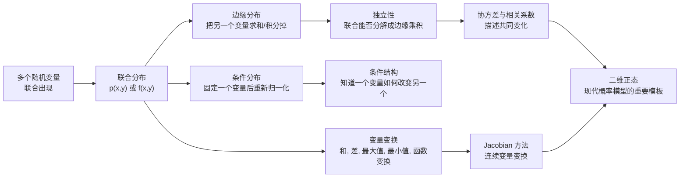
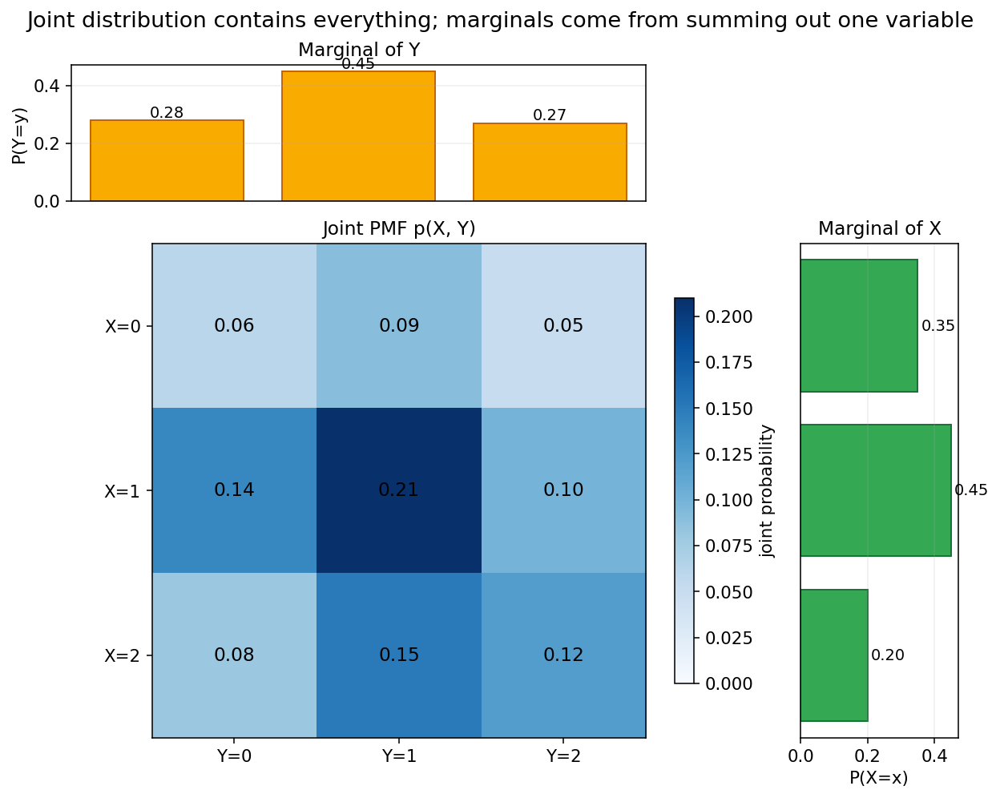
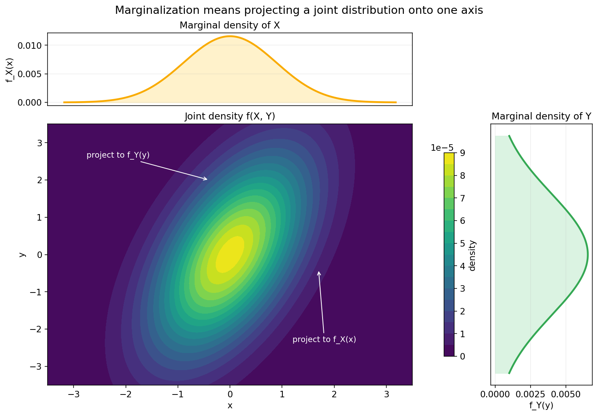
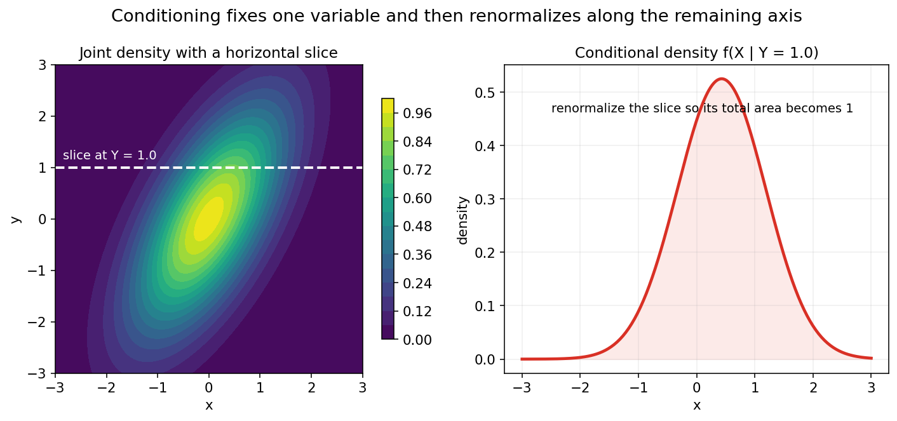
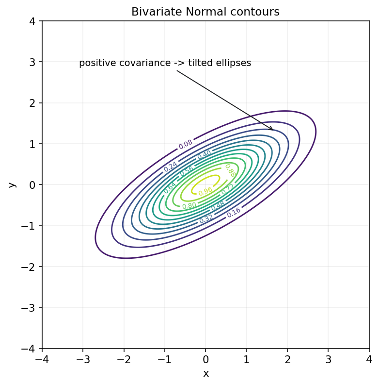

# 概率论第四章教程: 多维随机变量, 条件结构与变量变换

> 第三章解决的是"一个随机变量怎样分布".  
> 但现实里, 我们几乎总会同时面对多个随机量:
>
> 1. 两个变量会不会一起变大, 一起变小?
> 2. 知道其中一个以后, 另一个的分布会怎样改变?
> 3. 如果把它们加起来, 相减, 取最大值, 甚至做更复杂变换, 新变量会服从什么分布?
>
> 这一章要做的, 就是把单变量概率语言自然升级成多变量语言.

---

## 0. 先看全章主线

第四章的主线可以压成下面这张图:

一句话概括这一章:

> 多维概率研究的不只是"各自怎么分布",  
> 更重要的是"它们怎样一起变化",  
> 而变量变换则把这种联合结构进一步变成可计算的新分布.

---

## 1. 为什么单变量不够: 现实问题总是在同时看多个量

### 1.1 常见场景

单变量问题当然很多, 但更多时候我们关心的是成对或成组的量:

- 用户的点击次数和停留时长
- 身高和体重
- 图像中的像素强度和类别标签
- 股票收益和波动率
- 传感器 A 读数和传感器 B 读数

在这些问题里, 光知道每个变量各自的分布还不够.  
因为你还会问:

- 它们会不会同时偏大?
- 一个变量固定时, 另一个会怎样变化?
- 二者叠加后的结果是什么?

### 1.2 第四章真正增加了什么

第三章的主角是单个随机变量 $X$.  
这一章的主角变成:

$$
(X,Y),\quad (X_1,X_2,\dots,X_d)
$$

也就是说, 我们开始研究**随机向量**.

这一步最关键的变化是:

> 概率不再只分布在一条数轴上,  
> 而是分布在平面, 空间, 甚至更高维空间里.

---

## 2. 二维随机变量: 把两个量一起看

### 2.1 二维随机变量是什么

若 $X,Y$ 都定义在同一个样本空间上, 那么

$$
(X,Y)
$$

就构成一个二维随机变量.

你可以把它看成:

> 每次试验不再给出一个数, 而是给出一个二维坐标点.

例如:

- 两枚骰子的点数 $(X,Y)$
- 用户一天内的点击次数和购买次数 $(X,Y)$
- 设备温度和压力 $(X,Y)$

### 2.2 为什么"同一个样本空间"很重要

因为 $X$ 和 $Y$ 不是两个互不相干的数字, 它们来自同一次随机机制.  
这意味着它们之间可能有依赖关系, 也可能没有.

后面所谓联合分布, 条件分布, 协方差, 相关性, 全都在研究这种共同结构.

---

## 3. 联合分布: 两个变量怎样一起出现

### 3.1 二维离散型的联合 PMF

若 $X,Y$ 为离散型随机变量, 则它们的联合概率质量函数定义为

$$
p_{X,Y}(x,y)=P(X=x,Y=y)
$$

它回答的是:

> $X$ 恰好取 $x$, 同时 $Y$ 恰好取 $y$ 的概率是多少?

并且必须满足

$$
p_{X,Y}(x,y)\ge 0,\quad \sum_x\sum_y p_{X,Y}(x,y)=1
$$

### 3.2 二维连续型的联合 PDF

若 $X,Y$ 为连续型随机变量, 则它们的联合密度函数 $f_{X,Y}(x,y)$ 满足:

$$
P((X,Y)\in A)=\iint_A f_{X,Y}(x,y)\,dx\,dy
$$

其中 $A$ 是平面上的某个区域.

这时真正的概率来自平面区域下的体积, 而不是某一点的高度.

### 3.3 一个离散联合分布表

比如 $X,Y$ 都只取 $\{0,1,2\}$, 其联合 PMF 可以写成一个表格:

这张图最好记住两点:

1. 中间的大表记录的是联合结构
2. 上方和右侧可以从表格里求出边缘分布

### 3.4 联合分布比边缘分布信息更多

这是第四章第一句最重要的话:

> 只知道 $X$ 和 $Y$ 各自怎么分布, 往往还不知道它们是怎样一起变化的.

因为:

- 同样的边缘分布
- 可以对应很多不同的联合分布

这也是为什么"联合分布包含的信息最多".

---

## 4. 联合分布函数: 用累计概率统一描述

### 4.1 定义

二维随机变量 $(X,Y)$ 的联合分布函数定义为

$$
F_{X,Y}(x,y)=P(X \le x,\ Y \le y)
$$

它表示的是:

> 平面左下角矩形区域里的累计概率

### 4.2 为什么它是二维版的 CDF

第三章里:

$$
F_X(x)=P(X \le x)
$$

第四章只是把"一个方向上的累计"扩展成"两个方向同时累计".

所以联合分布函数依旧是一个统一入口:

- 离散型可以从联合 PMF 累加得到
- 连续型可以从联合 PDF 积分得到

### 4.3 区域概率如何由联合 CDF 得到

对矩形区域:

$$
P(a < X \le b,\ c < Y \le d)
$$

可以由四个角的联合 CDF 做加减得到.  
它本质上和一维区间概率的差分类似, 只是多了一维.

这一节你现在只要先建立直觉即可, 真正常用的还是联合 PMF / PDF.

---

## 5. 边缘分布: 把另一个变量"求掉"

### 5.1 离散情形

由联合 PMF 可以得到 $X$ 的边缘分布:

$$
p_X(x)=\sum_y p_{X,Y}(x,y)
$$

同理

$$
p_Y(y)=\sum_x p_{X,Y}(x,y)
$$

意思非常直接:

> 只关心 $X=x$ 时, 不管 $Y$ 取什么, 全部加起来.

### 5.2 连续情形

由联合 PDF 可以得到边缘密度:

$$
f_X(x)=\int_{-\infty}^{+\infty} f_{X,Y}(x,y)\,dy
$$

$$
f_Y(y)=\int_{-\infty}^{+\infty} f_{X,Y}(x,y)\,dx
$$

### 5.3 为什么叫"边缘"

如果把联合分布表写成矩阵, 对某一行或某一列求和后得到的数, 常常写在表格边缘.  
这个名字就这么来的.

但更本质的理解是:

> 边缘化就是把另一个变量消掉, 只保留当前变量本身的信息.

### 5.4 直观图像

这张图展示的是:

- 中间是二维联合密度
- 往某个方向求和/积分, 相当于把联合分布投影到一条轴上
- 得到的就是边缘分布

### 5.5 一个高频提醒

边缘分布能告诉你"单个变量各自怎么分布", 但它已经把变量之间的配对结构抹掉了.

所以:

> 从联合到边缘会丢信息,  
> 从边缘一般恢复不出唯一的联合.

---

## 6. 条件分布: 固定一个变量以后另一个怎么变

### 6.1 离散条件分布

若 $P(Y=y)>0$, 则

$$
P(X=x \mid Y=y)=\frac{P(X=x,Y=y)}{P(Y=y)}
=\frac{p_{X,Y}(x,y)}{p_Y(y)}
$$

这说明:

> 条件分布 = 固定一个变量后的切片, 再归一化

### 6.2 连续条件密度

若 $f_Y(y)>0$, 则

$$
f_{X\mid Y}(x \mid y)=\frac{f_{X,Y}(x,y)}{f_Y(y)}
$$

这和离散情形完全同一条逻辑:

- 先取出联合密度在 $Y=y$ 这一条切片上的信息
- 再除以边缘密度, 让总面积回到 1

### 6.3 直观图像

图中左边是一整个二维联合密度.  
一旦把 $Y$ 固定在某个值上, 就相当于切出一条水平截面.  
右边则是在这条截面上重新归一化后得到的条件密度.

### 6.4 条件分布和边缘分布的区别

- 边缘分布: 完全不管另一个变量
- 条件分布: 另一个变量先固定住, 再看当前变量

这两个概念经常一起出现, 但不能混.

---

## 7. 多维独立性: 联合能否分解成边缘乘积

### 7.1 离散与连续的统一定义

若对所有可能的 $(x,y)$ 都有

$$
p_{X,Y}(x,y)=p_X(x)p_Y(y)
$$

则称 $X,Y$ 独立.

连续情形下则是

$$
f_{X,Y}(x,y)=f_X(x)f_Y(y)
$$

### 7.2 这一定义的真正含义

它表示:

> 二者共同出现的结构, 完全可以拆成各自单独出现的结构

也就是说, 联合里没有额外的耦合信息.

### 7.3 独立与条件分布的等价说法

若 $X,Y$ 独立, 则

$$
f_{X\mid Y}(x \mid y)=f_X(x)
$$

或者离散情形下

$$
P(X=x \mid Y=y)=P(X=x)
$$

这说明:

> 知道 $Y$ 以后, 并不会改变 $X$ 的分布.

### 7.4 一个容易犯错的地方

看到联合分布"不太像相关", 不足以判断独立.  
真正的独立是严格的可分解条件, 不是肉眼猜出来的.

---

## 8. 协方差与相关系数: 怎样量化共同变化

### 8.1 协方差

协方差定义为

$$
\mathrm{Cov}(X,Y)=E[(X-E[X])(Y-E[Y])]
$$

它衡量的是:

> 当 $X$ 偏离自己的平均水平时, $Y$ 是否也倾向于同方向偏离

如果:

- 协方差为正, 往往表示同涨同落倾向
- 协方差为负, 往往表示一高一低倾向
- 协方差为 0, 只能说明线性关系层面上没有明显共同偏移

### 8.2 相关系数

为了把协方差做无量纲归一化, 定义相关系数:

$$
\rho_{X,Y}=
\frac{\mathrm{Cov}(X,Y)}
{\sqrt{\mathrm{Var}(X)}\sqrt{\mathrm{Var}(Y)}}
$$

它满足

$$
-1 \le \rho_{X,Y} \le 1
$$

### 8.3 不相关不等于独立

这是第四章最重要的易错点之一.

如果

$$
\mathrm{Cov}(X,Y)=0
$$

只能说二者**不相关**.  
这并不自动推出独立.

原因是:

> 协方差只看线性关系,  
> 独立则要求整个联合结构完全分解.

后面会看到, 某些非线性依赖关系完全可能让协方差为 0, 但变量仍然不独立.

---

## 9. 和, 差, 最大值, 最小值: 新变量的分布怎么来

### 9.1 为什么变量变换重要

在真实问题里, 我们常常不直接使用原始变量, 而是关心它们的组合:

- 总分 $X+Y$
- 误差差值 $X-Y$
- 最大风险 $\max(X,Y)$
- 最小寿命 $\min(X,Y)$

所以关键问题变成:

> 已知原变量分布后, 新变量的分布怎样得到?

### 9.2 先看离散情形的和

若 $X,Y$ 为离散随机变量, 则

$$
P(X+Y=s)=\sum_x P(X=x,\ Y=s-x)
$$

若再进一步独立, 可写成

$$
P(X+Y=s)=\sum_x P(X=x)P(Y=s-x)
$$

这就是离散卷积.

### 9.3 最大值和最小值

例如:

$$
P(\max(X,Y)\le t)=P(X \le t,\ Y \le t)
$$

若 $X,Y$ 独立, 则

$$
P(\max(X,Y)\le t)=P(X \le t)P(Y \le t)
$$

也就是

$$
F_{\max(X,Y)}(t)=F_X(t)F_Y(t)
$$

同理:

$$
P(\min(X,Y)>t)=P(X>t,\ Y>t)
$$

若独立, 也能拆成乘积.

### 9.4 这一节真正想训练什么

它训练的是一种新的观察方式:

> 先把新变量写成原变量上的事件条件,  
> 再回到联合分布上去算.

这个思路比死记单独公式更重要.

---

## 10. 变量函数的分布: 一维变换先讲直觉

### 10.1 单调变换最简单

若 $Y=g(X)$, 且 $g$ 单调递增, 那么

$$
F_Y(y)=P(Y \le y)=P(g(X)\le y)=P(X \le g^{-1}(y))
$$

于是

$$
F_Y(y)=F_X(g^{-1}(y))
$$

若进一步可导, 则密度可写成

$$
f_Y(y)=f_X(g^{-1}(y))\left|\frac{d}{dy}g^{-1}(y)\right|
$$

### 10.2 为什么会出现绝对值因子

因为变量变换会改变坐标尺度.

例如:

- 原来一小段长度是 $dx$
- 变换后变成另一小段长度 $dy$

概率本身不能凭空变多变少, 所以密度必须按尺度因子重新调整.

### 10.3 一个最简单例子

若 $X \sim \mathrm{Uniform}(0,1)$, 定义

$$
Y=2X
$$

则 $Y$ 在 $[0,2]$ 上均匀分布, 密度应为

$$
f_Y(y)=\frac{1}{2},\quad 0 \le y \le 2
$$

这里就已经能看出:

> 区间长度扩大了 2 倍, 密度高度就缩小到原来的一半.

---

## 11. Jacobian 方法: 二维连续变量变换的入口

### 11.1 为什么一维公式不够

当变换对象变成二维向量时:

$$
(U,V)=g(X,Y)
$$

光看一维导数已经不够, 因为平面上的小面积单元也会被拉伸, 旋转, 压缩.

这时需要用 Jacobian.

### 11.2 最基本的公式

若变换可逆且足够光滑, 则

$$
f_{U,V}(u,v)=f_{X,Y}(x(u,v),y(u,v))
\left|
\det \frac{\partial(x,y)}{\partial(u,v)}
\right|
$$

这里的 determinant 就是在量化:

> 面积单元在变换前后被放大或缩小了多少倍

### 11.3 一个经典例子

若

$$
U=X+Y,\quad V=X-Y
$$

则反变换为

$$
X=\frac{U+V}{2},\quad Y=\frac{U-V}{2}
$$

对应 Jacobian 行列式为

$$
\left|
\det
\begin{pmatrix}
\partial x/\partial u & \partial x/\partial v \\
\partial y/\partial u & \partial y/\partial v
\end{pmatrix}
\right|
=
\left|
\det
\begin{pmatrix}
1/2 & 1/2 \\
1/2 & -1/2
\end{pmatrix}
\right|
=\frac{1}{2}
$$

于是新变量密度会带上这个尺度因子.

### 11.4 这一节的学习目标

第一遍学到这里, 不要求把所有变换题都秒做出来.  
真正要先建立的是:

1. 变量变换本质上是在换坐标
2. 密度必须补偿面积/体积尺度变化
3. Jacobian 就是在描述这种尺度变化

---

## 12. 多元正态分布初步: 多维世界里的核心模板

### 12.1 为什么它重要

单变量里, Normal 分布几乎无处不在.  
多维里也有对应的核心对象: **多元正态分布**.

它在:

- 回归分析
- 高斯判别分析
- 卡尔曼滤波
- 变分推断
- 深度学习近似分析

里都非常常见.

### 12.2 二维正态的直觉图像

二维正态的等密度线通常是椭圆.

这张图最好记住三点:

1. 若协方差为正, 椭圆会向右上倾斜
2. 若协方差为负, 椭圆会向右下倾斜
3. 若两个方向完全不耦合, 椭圆主轴会与坐标轴对齐

### 12.3 参数到底在控制什么

二维正态通常由:

- 均值向量
- 协方差矩阵

决定.

其中:

- 均值向量决定中心位置
- 协方差矩阵决定拉伸方向, 扩散尺度, 倾斜角度

这其实就是第五章协方差矩阵的几何直觉预告.

### 12.4 一个重要但先不展开的事实

在多元正态族里:

> 不相关可以推出独立

这在一般分布里并不成立, 但在正态族里是个特殊而强大的性质.

现在先记住它, 后面再细化.

---

## 13. 本章主线总结

第四章压成最短的一条线, 就是:

1. 联合分布描述多个变量怎样一起出现
2. 边缘分布通过求和/积分把其他变量消掉
3. 条件分布通过固定一个变量后重新归一化得到
4. 独立性等价于联合分布可分解成边缘乘积
5. 变量变换通过事件重写和 Jacobian 得到新分布

这五句话一旦稳住, 后面期望方差, 回归模型, 贝叶斯模型都会顺很多.

---

## 14. 典型题型与实战清单

这一章最常见的题型, 基本都可以归到下面几类:

1. **由联合求边缘**
   - 离散: 对另一维求和
   - 连续: 对另一维积分

2. **由联合求条件**
   - 先算边缘
   - 再做归一化

3. **判断独立性**
   - 看联合能否分解
   - 不要只看边缘相似或协方差大小

4. **求和, 最大值, 最小值分布**
   - 先把新变量事件写成原变量上的区域条件

5. **变量变换**
   - 一维单调变换
   - 二维 Jacobian 变换

6. **二维正态理解题**
   - 均值控制中心
   - 协方差控制椭圆形状和方向

一个实战工作流可以直接记成:

> 先画联合结构 -> 再投影出边缘 -> 再切片看条件 -> 最后做变换

---

## 15. 典型误区

### 误区 1: 只知道边缘分布, 就以为知道了联合分布

边缘分布一般恢复不出唯一的联合结构.

### 误区 2: 边缘积分或求和范围写错

连续情形常见错误是积分区域没看清.  
很多题真正难点就在支持集范围.

### 误区 3: 把不相关误认为独立

这在一般分布里是错误的.  
只有在某些特殊分布族, 如正态族里, 才有更强结论.

### 误区 4: 条件分布忘了归一化

条件分布不是直接截一刀就结束, 还要让总概率重新回到 1.

### 误区 5: 变量替换漏掉 Jacobian

这是连续变量变换题里的头号错误.

### 误区 6: 只会背公式, 不会把新变量翻回原变量上的事件

变量变换题最稳的路线往往不是背模板, 而是先回到联合结构上重新表达事件.

---

## 16. 和前后章节的连接点

这一章向后连接的路线非常清楚:

1. **第五章期望, 方差, 协方差矩阵**
   - 有了联合分布以后, 才能真正讨论共同波动和相关结构

2. **第六章极限定理**
   - 随机向量和变量和的分布是后续渐近分析的重要基础

3. **第十章回归与方差分析**
   - 多元关系建模直接建立在这里的联合结构和协方差直觉上

4. **第十七章概率模型与潜变量模型**
   - 条件分布和边缘化是图模型, EM, 混合模型的核心操作

所以第四章其实是从"单变量概率"正式进入"概率模型思维"的第一步.

---

## 17. 和机器学习, 数据分析, 科研实践的连接点

如果你是为了后面的建模和机器学习来学这章, 最值得提前记住的是:

1. **联合, 边缘, 条件**
   - 这是所有概率图模型和统计学习模型的基本语法

2. **边缘化**
   - 隐变量模型, 贝叶斯推断, 序列模型里反复要做

3. **条件分布**
   - 监督学习里的很多目标本质上都在建模 $P(Y \mid X)$

4. **Jacobian**
   - 正常izing flow, 变量变换采样, 概率密度重参数化都离不开它

5. **多元正态**
   - 现代统计和机器学习里出现频率极高

这章的工程价值可以压成一句话:

> 以后看到多个量一起出现时, 你会开始自然地问联合结构, 边缘结构, 条件结构和变换结构.

---

## 18. 本章收尾

如果说第三章是在建立"一个随机变量怎样分布"的直觉, 那第四章就是在回答:

> 当随机变量不止一个时, 概率怎样在更高维空间里组织起来.

只要你真正抓住下面这句话, 这一章就算入门了:

> 联合分布讲整体,  
> 边缘分布讲投影,  
> 条件分布讲切片,  
> Jacobian 讲换坐标时概率密度怎样补偿尺度变化.
