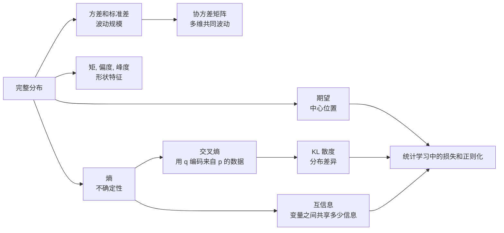
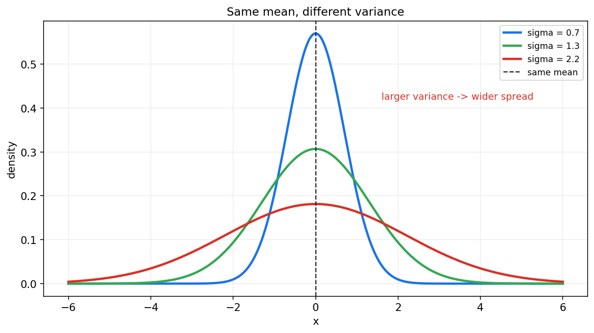
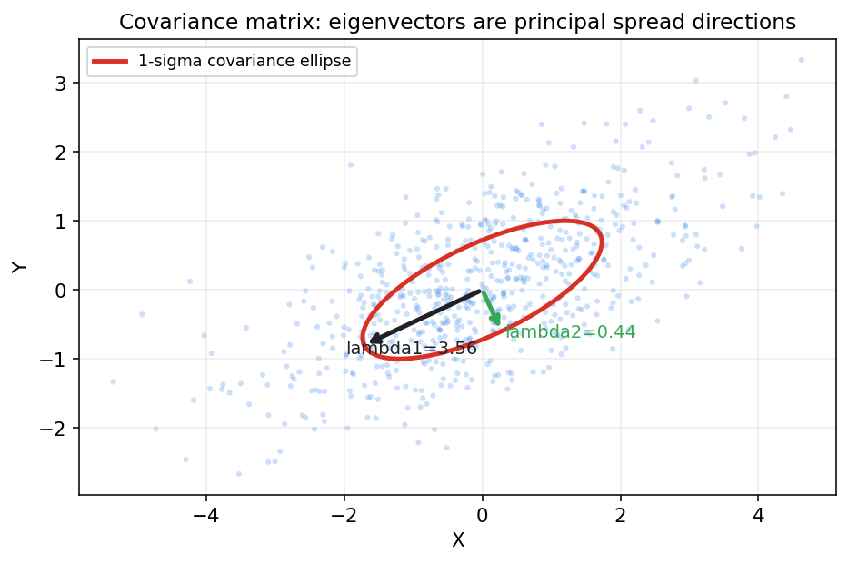
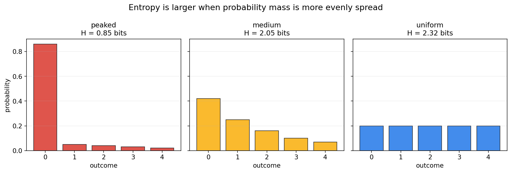
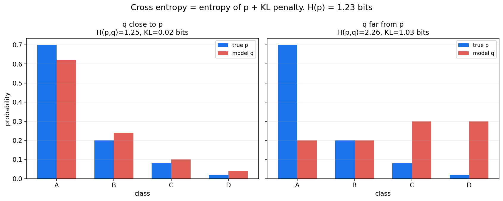

# 概率论第五章教程: 期望, 方差, 熵与信息量

> 第三章和第四章告诉我们怎样描述完整分布.  
> 但很多时候, 完整分布太细, 我们还需要少量数字来概括它:
>
> 1. 这个随机变量大致集中在哪里?
> 2. 它波动有多大?
> 3. 多个变量是同向变化还是反向变化?
> 4. 一个分布到底有多不确定? 两个分布相差多远?
>
> 这一章把概率论的数字特征和信息论语言连起来.

---

## 0. 先看全章主线

第五章的主线可以压成下面这张图:

一句话概括这一章:

> 期望和方差刻画平均行为与波动规模,  
> 协方差刻画共同变化,  
> 熵, 交叉熵, KL 和互信息刻画不确定性与信息关系.

---

## 1. 为什么需要数字特征

### 1.1 完整分布当然最好, 但不总是方便

如果你知道一个随机变量的完整分布, 理论上可以回答很多问题.  
但现实分析里, 我们常常需要更压缩的描述:

- 一个模型平均误差多大?
- 某个指标波动是否稳定?
- 两个指标是否同涨同落?
- 一个分类器输出的概率分布是否很不确定?

这些问题不一定每次都需要完整分布.  
一些精心设计的数字特征就很有用.

### 1.2 数字特征不是分布本身

一个非常重要的提醒是:

> 数字特征是对分布的压缩, 不是分布的全部.

例如两个分布可以有相同的期望, 但波动完全不同.  
也可以有相同的期望和方差, 但形状仍然不同.

所以这一章的正确学习方式是:

> 先理解每个数字在概括分布的哪一面,  
> 再理解它会丢掉哪些信息.

---

## 2. 数学期望: 加权平均的长期中心

### 2.1 从加权平均开始

期望最自然的入口不是公式, 而是加权平均.

假设随机变量 $X$ 取值为 $x_1,\dots,x_n$, 对应概率为 $p_1,\dots,p_n$.  
那么它的期望是

$$
E[X]=\sum_{i=1}^{n} x_i p_i
$$

也就是:

> 每个可能取值乘以它出现的概率, 再全部加起来.

### 2.2 一个骰子例子

公平骰子的点数 $X$ 满足

$$
P(X=k)=\frac{1}{6},\quad k=1,2,\dots,6
$$

所以

$$
E[X]=1\cdot\frac{1}{6}+2\cdot\frac{1}{6}+\cdots+6\cdot\frac{1}{6}
=\frac{21}{6}=3.5
$$

注意, 骰子点数永远不会等于 $3.5$.  
这正好说明:

> 期望不一定是随机变量可能取到的值.

它描述的是长期平均中心, 不是单次结果承诺.

### 2.3 连续型期望

若 $X$ 是连续型随机变量, 密度为 $f_X(x)$, 则

$$
E[X]=\int_{-\infty}^{+\infty} x f_X(x)\,dx
$$

这和离散公式是同一件事:

- 离散型用求和
- 连续型用积分

### 2.4 函数的期望

更一般地, 若我们关心 $g(X)$, 则:

离散型:

$$
E[g(X)]=\sum_x g(x)p_X(x)
$$

连续型:

$$
E[g(X)]=\int_{-\infty}^{+\infty} g(x)f_X(x)\,dx
$$

这条公式后面会非常常用.  
例如方差本质上就是 $g(X)=(X-E[X])^2$ 的期望.

---

## 3. 期望的性质: 线性是最重要的

### 3.1 线性性质

期望最重要的性质是线性:

$$
E[aX+bY+c]=aE[X]+bE[Y]+c
$$

这条性质不要求 $X,Y$ 独立.

特别地:

$$
E[X+Y]=E[X]+E[Y]
$$

无论 $X,Y$ 是否独立都成立.

### 3.2 常数的期望

如果 $c$ 是常数, 则

$$
E[c]=c
$$

这很自然, 因为一个永远等于 $c$ 的随机变量, 长期平均当然还是 $c$.

### 3.3 缩放和平移

若

$$
Y=aX+b
$$

则

$$
E[Y]=aE[X]+b
$$

这意味着:

- 平移会把期望整体平移
- 缩放会把期望按比例缩放

### 3.4 乘积期望和独立性

一般来说,

$$
E[XY]\ne E[X]E[Y]
$$

只有在 $X,Y$ 独立时, 才有

$$
E[XY]=E[X]E[Y]
$$

这个条件很重要, 不能随便省略.

---

## 4. 方差与标准差: 波动规模

### 4.1 方差定义

方差定义为

$$
\mathrm{Var}(X)=E[(X-E[X])^2]
$$

它衡量的是:

> 随机变量围绕自身期望的平均平方偏离.

因为用了平方, 所以:

- 正负偏离不会相互抵消
- 大偏离会被更重地惩罚

### 4.2 常用等价公式

展开平方可以得到:

$$
\mathrm{Var}(X)=E[X^2]-(E[X])^2
$$

这条公式计算上很常用, 但理解上仍然要回到原始定义:

> 方差描述的是围绕中心的波动.

### 4.3 标准差

方差单位是原变量单位的平方.  
为了回到原单位, 定义标准差:

$$
\sigma_X=\sqrt{\mathrm{Var}(X)}
$$

标准差越大, 分布越分散; 标准差越小, 分布越集中.

图中三条曲线的均值相同, 但方差不同.  
这说明:

> 只知道期望, 并不知道波动有多大.

### 4.4 方差的缩放性质

若

$$
Y=aX+b
$$

则

$$
\mathrm{Var}(Y)=a^2\mathrm{Var}(X)
$$

注意:

- 平移 $b$ 不改变波动
- 缩放 $a$ 会让方差乘以 $a^2$

### 4.5 方差的可加性条件

一般来说:

$$
\mathrm{Var}(X+Y)=\mathrm{Var}(X)+\mathrm{Var}(Y)+2\mathrm{Cov}(X,Y)
$$

若 $X,Y$ 独立, 则协方差为 0, 此时:

$$
\mathrm{Var}(X+Y)=\mathrm{Var}(X)+\mathrm{Var}(Y)
$$

这里的独立条件不能忘.

---

## 5. 协方差矩阵: 多维波动的形状

### 5.1 协方差回顾

两个随机变量的协方差为

$$
\mathrm{Cov}(X,Y)=E[(X-E[X])(Y-E[Y])]
$$

它描述的是二者是否倾向于同向偏离自己的均值.

### 5.2 协方差矩阵

对随机向量

$$
\mathbf{X}=(X_1,\dots,X_d)^\top
$$

其协方差矩阵定义为

$$
\Sigma=E[(\mathbf{X}-E[\mathbf{X}])(\mathbf{X}-E[\mathbf{X}])^\top]
$$

矩阵第 $i,j$ 个元素为

$$
\Sigma_{ij}=\mathrm{Cov}(X_i,X_j)
$$

对角线是各维方差, 非对角线是两两协方差.

### 5.3 几何直觉

协方差矩阵不仅是一张数字表, 它还有很强的几何含义:

- 特征向量给出主轴方向
- 特征值给出对应方向上的波动强度

这和线性代数中的二次型直觉是同一件事.  
高维正态分布, PCA, 白化, 高斯模型都会反复用到这条线.

### 5.4 协方差矩阵的基本性质

协方差矩阵满足:

1. 对称:

$$
\Sigma=\Sigma^\top
$$

2. 半正定:

$$
\mathbf{a}^\top \Sigma \mathbf{a}\ge 0
$$

原因是

$$
\mathbf{a}^\top \Sigma \mathbf{a}
=\mathrm{Var}(\mathbf{a}^\top \mathbf{X})
$$

而方差不可能为负.

---

## 6. 矩, 中心矩, 偏度与峰度

### 6.1 原点矩

随机变量的 $k$ 阶原点矩定义为

$$
E[X^k]
$$

例如:

- 一阶原点矩就是 $E[X]$
- 二阶原点矩 $E[X^2]$ 常用于计算方差

### 6.2 中心矩

$k$ 阶中心矩定义为

$$
E[(X-E[X])^k]
$$

它描述的是围绕均值的形状信息.

### 6.3 偏度

偏度衡量分布的不对称程度, 常见标准化形式为

$$
\mathrm{Skewness}
=E\left[\left(\frac{X-\mu}{\sigma}\right)^3\right]
$$

若偏度为正, 通常表示右尾更长; 若偏度为负, 通常表示左尾更长.

### 6.4 峰度

峰度常见标准化形式为

$$
\mathrm{Kurtosis}
=E\left[\left(\frac{X-\mu}{\sigma}\right)^4\right]
$$

它和尾部厚度, 极端值倾向有关.  
实际使用时常会看 excess kurtosis, 即减去正态分布的峰度 3.

### 6.5 第一遍学到什么程度

本章不要求深入各种矩估计细节.  
第一遍要先知道:

- 期望是一阶信息
- 方差是二阶中心信息
- 偏度看不对称
- 峰度看尾部和极端值倾向

---

## 7. 熵: 分布的不确定性

### 7.1 离散熵定义

对离散分布 $p(x)$, Shannon entropy 定义为

$$
H(p)=-\sum_x p(x)\log p(x)
$$

如果对数以 2 为底, 单位是 bit.  
如果以自然对数为底, 单位是 nat.

### 7.2 熵的直觉

熵衡量的是:

> 从这个分布中抽样时, 结果有多难提前猜.

如果分布非常尖锐, 大部分概率都压在一个结果上, 不确定性小, 熵低.  
如果分布很均匀, 每个结果都差不多可能, 不确定性大, 熵高.

### 7.3 两个极端

若某个结果概率为 1, 其他结果概率为 0, 则熵为 0.  
因为结果完全确定.

若有 $n$ 个结果且均匀分布:

$$
p(x)=\frac{1}{n}
$$

则熵最大:

$$
H(p)=\log n
$$

### 7.4 熵不是方差

熵和方差都在描述某种"不集中", 但它们不是一回事.

- 方差依赖数值距离
- 熵只依赖概率分布本身

例如类别标签没有自然距离, 但仍然可以谈熵.

---

## 8. 交叉熵: 用错误分布编码真实数据的代价

### 8.1 定义

给定真实分布 $p$ 和模型分布 $q$, 交叉熵定义为

$$
H(p,q)=-\sum_x p(x)\log q(x)
$$

它衡量的是:

> 数据来自 $p$, 但你用 $q$ 去编码或预测时的平均代价.

### 8.2 为什么机器学习里常见交叉熵

分类任务里, 真实标签常写成 one-hot 分布 $p$.  
模型输出 softmax 概率 $q$.  
交叉熵损失就是

$$
-\sum_k p_k\log q_k
$$

如果真实类别是 $y$, one-hot 情况下就变成

$$
-\log q_y
$$

也就是:

> 模型给真实类别的概率越低, 损失越大.

### 8.3 交叉熵不等于熵

熵 $H(p)$ 只看真实分布自身.  
交叉熵 $H(p,q)$ 同时看真实分布和模型分布.

当 $q=p$ 时, 交叉熵才等于熵.

---

## 9. KL 散度: 分布差异的非对称度量

### 9.1 定义

KL 散度定义为

$$
D_{\mathrm{KL}}(p\|q)=\sum_x p(x)\log\frac{p(x)}{q(x)}
$$

它衡量的是:

> 用 $q$ 代替 $p$ 时, 额外付出的平均信息代价.

### 9.2 与交叉熵的关系

把定义展开:

$$
D_{\mathrm{KL}}(p\|q)
=\sum_x p(x)\log p(x)-\sum_x p(x)\log q(x)
$$

所以

$$
H(p,q)=H(p)+D_{\mathrm{KL}}(p\|q)
$$

这张图说明:

- $H(p)$ 是真实分布自身的不确定性
- $D_{\mathrm{KL}}(p\|q)$ 是模型分布 $q$ 与真实分布 $p$ 不一致带来的额外代价
- 交叉熵是二者之和

### 9.3 KL 的两个关键性质

1. 非负:

$$
D_{\mathrm{KL}}(p\|q)\ge 0
$$

且当 $p=q$ 时取 0.

2. 非对称:

$$
D_{\mathrm{KL}}(p\|q)\ne D_{\mathrm{KL}}(q\|p)
$$

所以 KL 不是距离, 至少不是通常意义下的度量距离.

### 9.4 为什么机器学习里优化交叉熵常等价于优化 KL

如果训练数据分布 $p$ 固定, 那么 $H(p)$ 与模型参数无关.  
此时最小化

$$
H(p,q_\theta)
$$

等价于最小化

$$
D_{\mathrm{KL}}(p\|q_\theta)
$$

这就是交叉熵损失和分布拟合之间的核心连接.

---

## 10. 互信息: 两个变量共享多少信息

### 10.1 定义

互信息定义为

$$
I(X;Y)=D_{\mathrm{KL}}(p_{X,Y}\|p_Xp_Y)
$$

展开就是

$$
I(X;Y)=\sum_{x,y}p(x,y)\log\frac{p(x,y)}{p_X(x)p_Y(y)}
$$

连续情形可以写成积分形式.

### 10.2 直觉

互信息衡量的是:

> 知道 $Y$ 以后, 对 $X$ 的不确定性减少了多少.

也可以理解成:

> 联合分布和"独立情况下的乘积分布"相差多远.

### 10.3 与独立性的关系

若 $X,Y$ 独立, 则

$$
p_{X,Y}(x,y)=p_X(x)p_Y(y)
$$

于是

$$
I(X;Y)=0
$$

反过来, 在常见条件下, 若互信息为 0, 也意味着独立.

### 10.4 为什么互信息重要

互信息在机器学习里很常见:

- 特征选择: 特征和标签共享多少信息
- 表示学习: 表示是否保留了任务相关信息
- 自监督学习: 最大化不同视图之间的信息关联
- 信息瓶颈: 保留对标签有用的信息, 压缩无关信息

---

## 11. 常见分布的数字特征速查

下面只列最常用的期望和方差:

| 分布 | 期望 | 方差 |
|---|---:|---:|
| Bernoulli($p$) | $p$ | $p(1-p)$ |
| Binomial($n,p$) | $np$ | $np(1-p)$ |
| Poisson($\lambda$) | $\lambda$ | $\lambda$ |
| Geometric($p$), 试验次数版本 | $1/p$ | $(1-p)/p^2$ |
| Uniform($a,b$) | $(a+b)/2$ | $(b-a)^2/12$ |
| Exponential($\lambda$) | $1/\lambda$ | $1/\lambda^2$ |
| Normal($\mu,\sigma^2$) | $\mu$ | $\sigma^2$ |

这张表最好和第三章的场景模板一起记.  
不要只背数字, 要知道这些分布在描述什么.

---

## 12. 本章主线总结

第五章压成最短的一条线, 就是:

1. 期望是长期加权平均中心
2. 方差和标准差描述围绕中心的波动规模
3. 协方差矩阵描述多维变量的共同波动形状
4. 熵描述分布本身的不确定性
5. 交叉熵和 KL 描述用模型分布逼近真实分布的代价
6. 互信息描述两个变量共享的信息量

这些量一起构成后续统计推断和机器学习的基础坐标系.

---

## 13. 典型题型与实战清单

这一章最常见的题型, 基本都可以归到下面几类:

1. **计算期望**
   - 离散求和
   - 连续积分
   - 注意函数期望 $E[g(X)]$

2. **计算方差**
   - 原始定义
   - 或用 $E[X^2]-(E[X])^2$

3. **处理线性变换**
   - 期望按 $aX+b$ 线性变换
   - 方差按 $a^2$ 缩放

4. **协方差和相关系数**
   - 看共同变化方向
   - 不把不相关误认为独立

5. **信息论量**
   - 熵看自身不确定性
   - 交叉熵看预测代价
   - KL 看额外代价
   - 互信息看变量共享信息

一个实战工作流可以直接记成:

> 先问中心, 再问波动, 再问关系, 最后问信息.

---

## 14. 典型误区

### 误区 1: 把期望当成一定会出现的值

骰子点数的期望是 3.5, 但单次骰子不可能掷出 3.5.

### 误区 2: 只会套方差公式, 不理解波动含义

方差的本质是平均平方偏离, 不是一个孤立代数公式.

### 误区 3: 忘记方差对缩放是平方响应

若 $Y=aX+b$, 则

$$
\mathrm{Var}(Y)=a^2\mathrm{Var}(X)
$$

不是 $a\mathrm{Var}(X)+b$.

### 误区 4: 把交叉熵和 KL 当成完全一样

它们关系密切, 但不是同一个量:

$$
H(p,q)=H(p)+D_{\mathrm{KL}}(p\|q)
$$

当 $p$ 固定时, 优化交叉熵才常常等价于优化 KL.

### 误区 5: 把 KL 当成对称距离

KL 是非对称的, 所以不能随便把方向反过来.

### 误区 6: 混淆熵和方差

方差依赖数值尺度.  
熵只看概率分布的不确定性.

---

## 15. 和前后章节的连接点

这一章向后连接的路线非常清楚:

1. **第六章极限定理**
   - 大数定律和中心极限定理都围绕期望, 方差和标准化展开

2. **第七章抽样分布**
   - 样本均值和样本方差本身就是统计量, 需要这些数字特征描述

3. **第十章回归**
   - 最小二乘, 残差方差, 协方差结构都会用到这里

4. **第十五章以后统计学习**
   - 损失函数, 泛化, 交叉熵, KL, 互信息都会反复出现

所以第五章是从概率论走向统计学习的一座核心桥.

---

## 16. 和机器学习, 数据分析, 科研实践的连接点

如果你是为了机器学习来学这一章, 最值得提前记住的是:

1. **MSE**
   - 和平方误差, 方差, 高斯噪声假设相关

2. **Cross Entropy**
   - 分类任务最常见损失之一
   - 本质上是在惩罚模型分布和真实标签分布不匹配

3. **KL**
   - VAE, 蒸馏, 分布对齐, 变分推断里高频出现

4. **互信息**
   - 自监督学习, 表示学习, 特征选择中常见

5. **协方差矩阵**
   - PCA, 高斯模型, whitening, 二阶优化和不确定性估计都离不开

这一章的工程价值可以压成一句话:

> 它把分布变成一组可比较, 可优化, 可解释的数字.

---

## 17. 本章收尾

如果说第三章和第四章讲的是"分布怎样长", 那第五章讲的就是:

> 怎样用少量数字抓住分布的中心, 波动, 形状, 不确定性和信息关系.

后面进入极限定理和数理统计以后, 你会发现很多结论的核心都绕不开期望, 方差和信息量.
