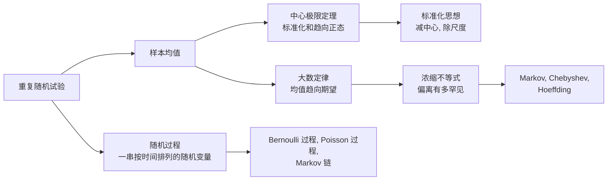
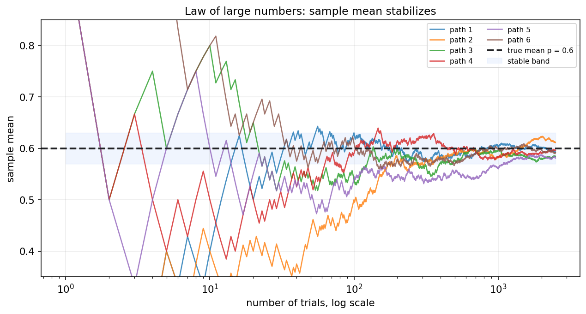
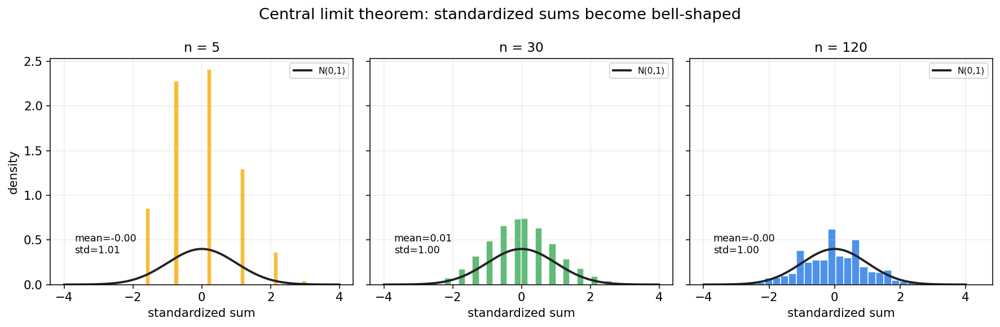
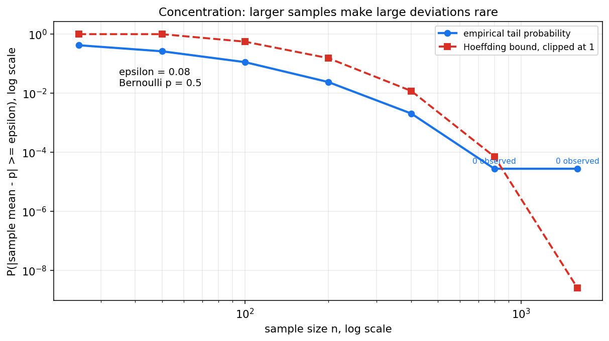
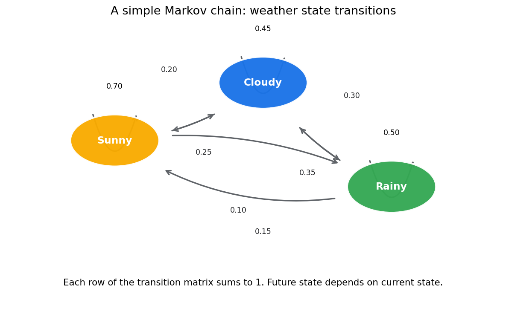

# 概率论第六章教程: 极限定理, 浓缩不等式与随机过程初步

> 前面几章主要研究单个事件, 单个随机变量, 或有限多个随机变量的关系.  
> 这一章把视角拉远:
>
> 1. 为什么大量重复以后样本均值会稳定?
> 2. 为什么很多随机和标准化以后会接近正态?
> 3. 为什么有些随机波动虽然存在, 但可以被概率界控制住?
> 4. 当随机变量按时间排列时, 我们怎样开始描述它们?
>
> 这一章是从"单次随机性"走向"整体稳定性"的关键桥梁.

---

## 0. 先看全章主线

第六章的主线可以压成下面这张图:

一句话概括这一章:

> 单次随机现象是跳动的,  
> 但大量重复后会出现稳定结构,  
> 极限定理和浓缩不等式就是在刻画这种从局部波动到整体规律的过渡.

---

## 1. 频率稳定现象: 从直觉重新出发

### 1.1 第一章的频率图还没有结束

第一章里我们已经看到, 抛硬币或 Bernoulli 试验重复很多次以后, 相对频率会逐渐稳定.  
现在我们要把这个现象放到更一般的位置:

设 $X_1,X_2,\dots,X_n$ 是重复试验得到的随机变量, 样本均值为

$$
\bar X_n=\frac{1}{n}\sum_{i=1}^{n}X_i
$$

直觉上, 当 $n$ 很大时, $\bar X_n$ 应该接近真实平均水平.

图中每条线都是一条随机路径.  
早期每条路径波动都很大, 但随着样本量增加, 它们逐渐围绕真实均值稳定下来.

### 1.2 这件事为什么重要

统计学和机器学习都离不开一个默认信念:

> 用样本平均去估计总体平均, 在样本量足够大时是有道理的.

大数定律就是这个信念的数学基础.

### 1.3 先区分两个层次

这一章会出现两类问题:

1. **会不会稳定到某个值?**  
   这是大数定律关心的问题.

2. **稳定过程中剩下的波动长什么样?**  
   这是中心极限定理关心的问题.

这两个问题相关, 但不是一回事.

---

## 2. 收敛概念的直觉: 依概率收敛和几乎处处收敛

### 2.1 为什么需要说"怎样收敛"

随机变量不是普通数列.  
普通数列每一项是一个确定数字, 而随机变量每一项本身还带随机性.

所以当我们说

$$
X_n \to X
$$

时, 必须说明是以哪种意义趋近.

### 2.2 依概率收敛

如果对任意 $\varepsilon>0$,

$$
P(|X_n-X|>\varepsilon)\to 0
$$

则称 $X_n$ **依概率收敛**到 $X$.

直觉是:

> $X_n$ 偏离 $X$ 超过任意固定误差的概率越来越小.

它关心的是偏离事件的概率是否消失.

### 2.3 几乎处处收敛

如果

$$
P(\lim_{n\to\infty}X_n=X)=1
$$

则称 $X_n$ **几乎处处收敛**到 $X$.

直觉是:

> 除了概率为 0 的异常路径外, 几乎每一条随机路径最终都会收敛.

它比依概率收敛更强.

### 2.4 第一遍怎么把握

第一遍学习不必急着深挖所有收敛类型的关系.  
先记住:

- 依概率收敛看的是偏离概率
- 几乎处处收敛看的是单条随机路径的长期行为

后面数理统计里常用的是依概率收敛和分布收敛.

---

## 3. 大数定律: 样本均值为什么会稳定

### 3.1 弱大数定律

设 $X_1,X_2,\dots$ 独立同分布, 且

$$
E[X_i]=\mu,\quad \mathrm{Var}(X_i)=\sigma^2<\infty
$$

则样本均值

$$
\bar X_n=\frac{1}{n}\sum_{i=1}^{n}X_i
$$

满足

$$
\bar X_n \xrightarrow{P} \mu
$$

这就是弱大数定律.

### 3.2 它到底在说什么

弱大数定律的意思是:

> 样本均值偏离真实期望超过任意固定误差的概率, 会随着样本量增大而趋近 0.

换句话说, 大样本均值是稳定的.

### 3.3 大数定律不在说什么

它不是说:

- 每一次观测都会接近期望
- 每一小段样本都会很稳定
- 随机性消失了

它说的是:

> 大量样本平均以后, 随机波动被摊薄了.

### 3.4 一个方差角度的解释

若 $X_i$ 独立同分布, 方差为 $\sigma^2$, 则

$$
\mathrm{Var}(\bar X_n)
=\mathrm{Var}\left(\frac{1}{n}\sum_{i=1}^{n}X_i\right)
=\frac{\sigma^2}{n}
$$

样本均值的方差随着 $n$ 增大而下降.  
这解释了为什么均值会越来越稳定.

---

## 4. 中心极限定理: 为什么很多总和近似正态

### 4.1 先看问题

大数定律告诉我们 $\bar X_n$ 会靠近 $\mu$.  
但它还没有告诉我们:

> 靠近 $\mu$ 以后, 剩下的波动是什么形状?

中心极限定理回答这个问题.

### 4.2 经典中心极限定理

设 $X_1,\dots,X_n$ 独立同分布, 且

$$
E[X_i]=\mu,\quad \mathrm{Var}(X_i)=\sigma^2<\infty
$$

则

$$
\frac{\sum_{i=1}^{n}X_i-n\mu}{\sigma\sqrt n}
\xrightarrow{d}
\mathcal{N}(0,1)
$$

等价地,

$$
\frac{\bar X_n-\mu}{\sigma/\sqrt n}
\xrightarrow{d}
\mathcal{N}(0,1)
$$

这里 $\xrightarrow{d}$ 表示分布收敛.

### 4.3 图像直觉

图中每个小图都把 Bernoulli 随机变量的和做了标准化.  
当 $n$ 增大时, 直方图越来越接近标准正态曲线.

### 4.4 CLT 不在说什么

中心极限定理不是说:

- 原始数据 $X_i$ 本身一定正态
- 任意小样本都近似正态
- 没有条件也能近似正态

它说的是:

> 很多独立小扰动的和, 在适当中心化和缩放后, 分布会趋向正态.

---

## 5. 标准化思想: 减中心, 除尺度

### 5.1 为什么要标准化

不同随机和的中心和波动规模会随 $n$ 改变.  
如果不先对齐中心和尺度, 很难比较它们的形状.

所以 CLT 中会出现:

$$
\frac{\sum_{i=1}^{n}X_i-n\mu}{\sigma\sqrt n}
$$

这一步包含两件事:

1. 减去中心 $n\mu$
2. 除以尺度 $\sigma\sqrt n$

### 5.2 样本均值版本

对样本均值:

$$
\frac{\bar X_n-\mu}{\sigma/\sqrt n}
$$

其中 $\sigma/\sqrt n$ 叫做标准误差.  
它描述样本均值本身的波动规模.

### 5.3 标准化在后面会反复出现

后面学习:

- 置信区间
- 假设检验
- t 统计量
- z 分数

都会反复使用这个动作:

> 观测值 - 中心, 再除以标准误差.

---

## 6. Markov 不等式: 只靠均值也能给出粗界

### 6.1 形式

若 $X\ge 0$, 且 $E[X]$ 存在, 则对任意 $a>0$:

$$
P(X\ge a)\le \frac{E[X]}{a}
$$

这就是 Markov 不等式.

### 6.2 直觉

如果一个非负随机变量的平均值不大, 那么它经常取特别大值的概率不可能太高.

Markov 不等式很粗, 但它只需要非负性和均值, 条件非常弱.

### 6.3 一个例子

若某非负损失 $L$ 的期望为 2, 则

$$
P(L\ge 10)\le \frac{2}{10}=0.2
$$

这不一定紧, 但至少给出一个保证.

---

## 7. Chebyshev 不等式: 用方差控制偏离

### 7.1 形式

若 $E[X]=\mu$, $\mathrm{Var}(X)=\sigma^2$, 则对任意 $t>0$:

$$
P(|X-\mu|\ge t)\le \frac{\sigma^2}{t^2}
$$

这就是 Chebyshev 不等式.

### 7.2 用在样本均值上

若 $X_i$ 独立同分布, 方差为 $\sigma^2$, 则

$$
\mathrm{Var}(\bar X_n)=\frac{\sigma^2}{n}
$$

所以

$$
P(|\bar X_n-\mu|\ge \varepsilon)
\le \frac{\sigma^2}{n\varepsilon^2}
$$

这直接给出了弱大数定律的一条证明路线.

### 7.3 直觉

Chebyshev 比 Markov 用了更多信息, 因为它使用了方差.  
它告诉我们:

> 方差越小, 大偏离越不容易发生.

---

## 8. Hoeffding 不等式: 有界变量的指数型浓缩

### 8.1 为什么需要更强的界

Chebyshev 的界随 $n$ 大约按 $1/n$ 下降.  
对很多有界随机变量, 实际偏离概率会下降得更快.

Hoeffding 不等式给出指数型界.

### 8.2 Bernoulli 情形的常用形式

若 $X_1,\dots,X_n$ 独立且 $X_i\in[0,1]$, 令

$$
\bar X_n=\frac{1}{n}\sum_{i=1}^{n}X_i
$$

则对任意 $\varepsilon>0$:

$$
P(|\bar X_n-E[\bar X_n]|\ge \varepsilon)
\le 2\exp(-2n\varepsilon^2)
$$

### 8.3 图像直觉

图中纵轴使用对数尺度.  
随着样本量增加, 大偏离概率快速下降.  
这就是"浓缩"这个词的直觉来源.

### 8.4 浓缩不等式和样本复杂度

很多机器学习问题会问:

> 想让经验平均和真实平均相差不超过 $\varepsilon$, 需要多少样本?

浓缩不等式正是在给这类问题提供概率保证.

---

## 9. 随机过程的最小入口

### 9.1 什么是随机过程

随机过程可以理解为一族按时间或索引排列的随机变量:

$$
\{X_t: t\in T\}
$$

如果 $T=\{0,1,2,\dots\}$, 通常是离散时间过程.  
如果 $T=[0,\infty)$, 通常是连续时间过程.

### 9.2 和随机变量的关系

单个随机变量是一个随机数.  
随机过程是一整条随机序列或随机轨迹.

例如:

- 每天是否下雨
- 每分钟网站请求数
- 股票每天收益
- 强化学习中的状态序列

### 9.3 本章只做入口

随机过程本身是一门很大的课.  
本章只介绍三个最小入口:

1. Bernoulli 过程
2. Poisson 过程
3. Markov 链

它们足以为后续时间序列, 图模型和强化学习打基础.

---

## 10. Bernoulli 过程, Poisson 过程, Markov 链初步

### 10.1 Bernoulli 过程

Bernoulli 过程是一串独立同分布的 0-1 随机变量:

$$
X_1,X_2,\dots,\quad X_i\sim \mathrm{Bernoulli}(p)
$$

它可以描述:

- 每个用户是否点击
- 每次实验是否成功
- 每个时间片是否发生某事件

前面的大数定律和中心极限定理都可以直接作用在 Bernoulli 过程上.

### 10.2 Poisson 过程

Poisson 过程描述随机事件在连续时间中到达的过程.  
它的核心特征是:

- 固定时间窗口内的事件次数服从 Poisson 分布
- 不重叠时间区间内的事件数相互独立
- 相邻事件的等待时间服从 Exponential 分布

所以第三章中的 Poisson, Exponential, Gamma 分布在这里连成了一条过程视角的故事线.

### 10.3 Markov 链

Markov 链是一类满足"未来只依赖当前状态"的随机过程:

$$
P(X_{t+1}=j\mid X_t=i,X_{t-1},\dots,X_0)
=P(X_{t+1}=j\mid X_t=i)
$$

也就是 Markov 性.

### 10.4 转移矩阵

若状态有限, 可以用转移矩阵表示:

$$
P=
\begin{pmatrix}
p_{11} & p_{12} & \cdots \\
p_{21} & p_{22} & \cdots \\
\vdots & \vdots & \ddots
\end{pmatrix}
$$

其中

$$
p_{ij}=P(X_{t+1}=j\mid X_t=i)
$$

每一行都必须加起来等于 1.

---

## 11. 本章主线总结

第六章压成最短的一条线, 就是:

1. 大数定律说明样本均值会稳定到期望
2. 中心极限定理说明标准化随机和会趋向正态
3. 标准化的核心是减中心, 除尺度
4. Markov, Chebyshev, Hoeffding 给出不同强度的偏离概率上界
5. 随机过程把随机变量从单点扩展成随时间变化的序列

这五点一起构成了概率论从单次试验走向大样本和动态系统的基本桥梁.

---

## 12. 典型题型与实战清单

这一章最常见的题型, 基本可以归到下面几类:

1. **判断大数定律含义**
   - 样本均值是否趋向期望
   - 区分单次样本和样本均值

2. **使用中心极限定理**
   - 写出均值和方差
   - 做标准化
   - 用标准正态近似概率

3. **使用偏离界**
   - Markov: 非负变量和均值
   - Chebyshev: 均值和方差
   - Hoeffding: 独立有界变量

4. **识别随机过程**
   - 0-1 独立序列: Bernoulli 过程
   - 连续时间到达: Poisson 过程
   - 状态转移只依赖当前状态: Markov 链

一个实战工作流可以直接记成:

> 先看是否是大量重复, 再看均值是否稳定, 再看波动是否近似正态, 最后用不等式给偏离概率保证.

---

## 13. 典型误区

### 误区 1: 把大数定律理解成每次都接近期望

大数定律说的是样本均值, 不是单次观测.

### 误区 2: 把中心极限定理理解成原始样本本身正态

CLT 说的是标准化后的随机和或样本均值趋向正态, 不是原始样本自动正态.

### 误区 3: 忘记标准化

不减中心, 不除尺度, 就很难得到标准正态近似.

### 误区 4: 不看不等式适用条件

Markov 需要非负变量.  
Hoeffding 常用形式需要独立有界变量.

### 误区 5: 把相关时间序列当成独立样本

很多时间序列有依赖结构.  
直接套独立同分布结论会出问题.

### 误区 6: 以为 Markov 链表示"没有记忆"

更准确地说, Markov 链不是完全没有记忆, 而是:

> 当前状态已经包含预测下一步所需的信息.

---

## 14. 和前后章节的连接点

这一章向后连接的路线非常清楚:

1. **第七章抽样分布**
   - 样本均值和样本方差的分布分析, 都建立在大样本稳定性直觉上

2. **第八章区间估计**
   - 标准误差和正态近似是置信区间的重要基础

3. **第九章假设检验**
   - 很多检验统计量的近似分布来自 CLT 或渐近理论

4. **第十七章概率模型**
   - Markov 链和随机过程是 HMM, 序列模型, 强化学习的入口

所以第六章既是概率论基础部分的收束, 也是数理统计部分的入口.

---

## 15. 和机器学习, 数据分析, 科研实践的连接点

如果你是为了机器学习来学这一章, 最值得提前记住的是:

1. **经验风险**
   - 训练集平均损失为什么可以估计期望风险, 背后就是大数定律

2. **泛化界**
   - 浓缩不等式是很多泛化误差上界的基础工具

3. **mini-batch 噪声**
   - mini-batch 梯度是总体梯度的随机估计, 其波动规模与样本量相关

4. **正态近似**
   - 大样本统计, 误差条, A/B 测试都常用 CLT

5. **序列模型**
   - Markov 链是 HMM, MDP 和强化学习状态转移的基础概念

这一章的工程价值可以压成一句话:

> 它解释了为什么随机样本平均可以稳定, 为什么误差能近似, 为什么偏离能被控制.

---

## 16. 本章收尾

如果说前五章是在搭建概率语言和数字特征, 那第六章就是在告诉我们:

> 随机性不是只会制造混乱,  
> 在大量重复, 标准化和合适条件下, 随机性会呈现非常稳定的整体规律.

这正是统计推断能够成立的底层原因.
