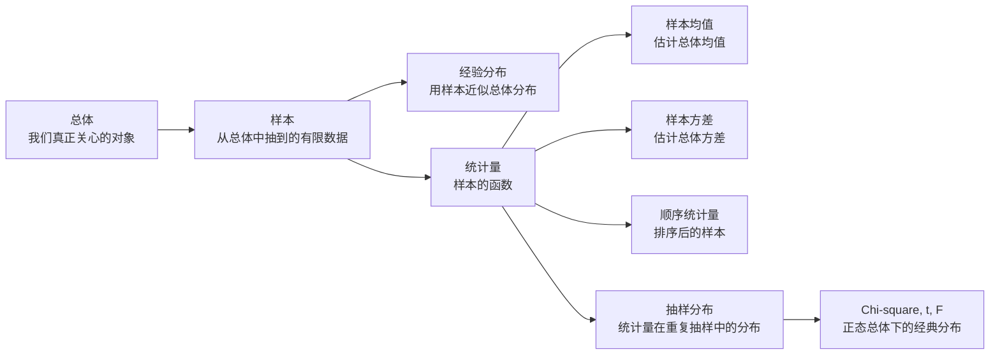
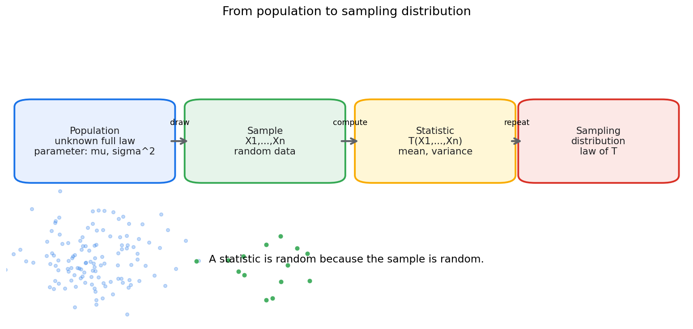
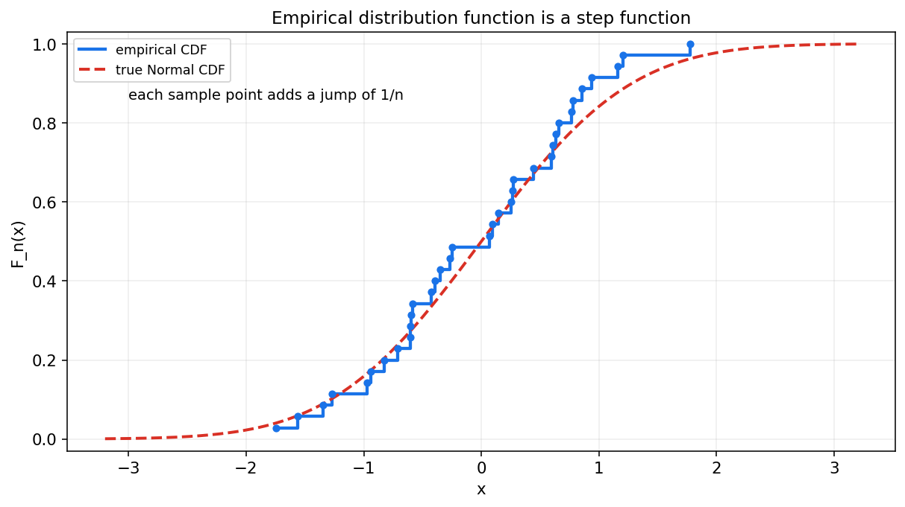
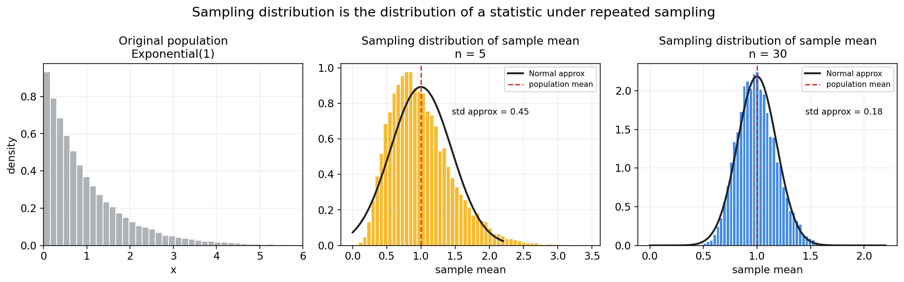
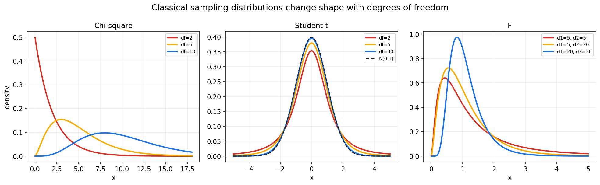

# 数理统计第七章教程: 总体, 样本, 统计量与抽样分布

> 从这一章开始, 教程从概率论正式进入数理统计.  
> 概率论通常假设分布已知, 再研究随机变量会怎样表现.  
> 数理统计则反过来问:
>
> 1. 总体分布未知时, 我们能从有限样本里知道什么?
> 2. 样本均值, 样本方差这些量本身为什么也是随机变量?
> 3. 统计推断为什么要研究这些统计量的分布?
>
> 这一章的核心任务, 就是搭起"总体 -> 样本 -> 统计量 -> 抽样分布"这条主线.

---

## 0. 先看全章主线

第七章的主线可以压成下面这张图:

一句话概括这一章:

> 样本是随机的,  
> 所以由样本算出来的统计量也是随机的,  
> 统计推断的可靠性正建立在这些统计量的抽样分布可以分析这一点上.

---

## 1. 总体与样本: 统计问题的起点

### 1.1 总体是什么

**总体**指我们真正关心的全部对象或其背后的概率分布.

例如:

- 全平台所有用户的点击率
- 一批零件的寿命分布
- 某城市成年人身高分布
- 某模型在未来数据上的误差分布

在理论里, 总体常被抽象成一个随机变量 $X$ 的分布.  
这个分布可能有未知参数, 如:

$$
\mu=E[X],\quad \sigma^2=\mathrm{Var}(X)
$$

### 1.2 样本是什么

**样本**是从总体中观察到的一组有限数据:

$$
X_1,X_2,\dots,X_n
$$

最常见的理想假设是独立同分布:

$$
X_1,\dots,X_n \overset{i.i.d.}{\sim} F
$$

意思是:

- 每个 $X_i$ 来自同一个总体分布 $F$
- 各个样本之间相互独立

这个假设很常用, 但现实里也最容易被破坏.

### 1.3 总体参数和样本统计量必须分开

总体参数是总体分布的固定特征, 比如:

$$
\mu,\quad \sigma^2,\quad p
$$

样本统计量是样本数据算出来的量, 比如:

$$
\bar X,\quad S^2,\quad \hat p
$$

它们的区别非常关键:

- 总体参数通常固定但未知
- 样本统计量可计算, 但会随样本变化

---

## 2. 简单随机抽样: 怎样拿到一份可用样本

### 2.1 简单随机抽样的直觉

简单随机抽样希望每个个体都有公平的被抽中机会, 并且样本尽量不带系统偏差.

在概率模型中, 它常被理想化为:

$$
X_1,\dots,X_n \text{ 独立同分布}
$$

### 2.2 抽样流程图

图中最重要的是最后一步:

> 抽到一份样本后, 我们会计算统计量.  
> 如果重复抽样很多次, 统计量会形成自己的分布, 这就是抽样分布.

### 2.3 现实抽样常见问题

现实数据往往不完美:

- 自选择偏差: 愿意参与调查的人本身就不代表总体
- 覆盖偏差: 某些群体根本没有进入抽样框
- 相关样本: 同一用户重复出现, 破坏独立性
- 时间漂移: 样本来自过去, 总体已经变化

所以统计推断不是只会算公式, 还要不断追问:

> 这份样本到底能不能代表目标总体?

---

## 3. 经验分布函数: 用样本近似总体分布

### 3.1 定义

给定样本 $X_1,\dots,X_n$, 经验分布函数定义为

$$
F_n(x)=\frac{1}{n}\sum_{i=1}^{n}\mathbf{1}\{X_i\le x\}
$$

它表示:

> 样本中不超过 $x$ 的比例.

### 3.2 图像直觉

经验分布函数是一个阶梯函数.  
每遇到一个样本点, 它就向上跳 $1/n$.

### 3.3 它和总体 CDF 的关系

总体分布函数是

$$
F(x)=P(X\le x)
$$

经验分布函数 $F_n(x)$ 是用样本比例去近似这个概率.

大样本下, 经验分布会越来越接近总体分布.  
这可以看成大数定律在每个固定 $x$ 上的应用.

---

## 4. 样本均值: 最常见的统计量

### 4.1 定义

样本均值定义为

$$
\bar X=\frac{1}{n}\sum_{i=1}^{n}X_i
$$

它是总体均值 $\mu$ 的自然估计.

### 4.2 样本均值本身是随机变量

因为每个 $X_i$ 是随机的, 所以 $\bar X$ 也是随机的.  
不同样本会得到不同的样本均值.

这句话非常关键:

> 统计量不是固定答案, 它在重复抽样中会波动.

### 4.3 均值和方差

若 $X_i$ 独立同分布, 且

$$
E[X_i]=\mu,\quad \mathrm{Var}(X_i)=\sigma^2
$$

则

$$
E[\bar X]=\mu
$$

$$
\mathrm{Var}(\bar X)=\frac{\sigma^2}{n}
$$

所以样本量越大, 样本均值越稳定.

### 4.4 抽样分布图像

图中左侧是原始总体分布, 后面两张是样本均值在重复抽样中的分布.  
原始总体是偏斜的, 但样本均值的抽样分布随着 $n$ 增大而更集中, 也更接近钟形.

---

## 5. 样本方差: 为什么分母常用 n-1

### 5.1 两种写法

样本二阶波动最直接的写法是:

$$
\frac{1}{n}\sum_{i=1}^{n}(X_i-\bar X)^2
$$

但在估计总体方差 $\sigma^2$ 时, 更常用的是:

$$
S^2=\frac{1}{n-1}\sum_{i=1}^{n}(X_i-\bar X)^2
$$

### 5.2 为什么是 n-1

因为 $\bar X$ 是用同一份样本估出来的, 样本点围绕 $\bar X$ 的偏差会被压小.  
如果直接除以 $n$, 平均来说会低估总体方差.

除以 $n-1$ 可以使 $S^2$ 成为 $\sigma^2$ 的无偏估计:

$$
E[S^2]=\sigma^2
$$

### 5.3 自由度的入口

在样本偏差

$$
X_i-\bar X
$$

中, 它们满足

$$
\sum_{i=1}^{n}(X_i-\bar X)=0
$$

所以 $n$ 个偏差里只有 $n-1$ 个可以自由变化.  
这就是自由度直觉的最小入口.

---

## 6. 顺序统计量初步

### 6.1 定义

把样本从小到大排序:

$$
X_{(1)}\le X_{(2)}\le \cdots \le X_{(n)}
$$

这些排序后的值称为**顺序统计量**.

### 6.2 常见例子

- 最小值: $X_{(1)}$
- 最大值: $X_{(n)}$
- 中位数: 中间位置的顺序统计量
- 分位数: 某个比例位置的顺序统计量

### 6.3 为什么顺序统计量重要

顺序统计量是很多稳健方法和非参数方法的基础:

- 中位数不容易被极端值拉动
- 分位数可以描述尾部风险
- 最大值和最小值用于可靠性和极值问题

后面第十一章非参数统计会继续用到它.

---

## 7. 统计量与估计量

### 7.1 统计量

统计量是样本的函数, 且不含未知参数:

$$
T=T(X_1,\dots,X_n)
$$

例如:

$$
\bar X,\quad S^2,\quad X_{(1)},\quad X_{(n)}
$$

都是统计量.

### 7.2 估计量

如果某个统计量被用来估计总体参数, 就称它为估计量.

例如:

- $\bar X$ 用来估计 $\mu$
- $S^2$ 用来估计 $\sigma^2$
- $\hat p$ 用来估计总体比例 $p$

### 7.3 二者的关系

统计量是更宽的概念.  
估计量是带有估计目标的统计量.

也就是说:

> 估计量一定是统计量, 但统计量不一定是估计量.

---

## 8. 抽样分布: 统计推断的核心对象

### 8.1 定义

统计量 $T(X_1,\dots,X_n)$ 作为随机变量, 在重复抽样中有自己的分布.  
这个分布就叫**抽样分布**.

### 8.2 抽样分布和样本分布不是一回事

这是本章第一大易错点.

- 样本分布: 一份样本中原始观测值的分布
- 抽样分布: 重复抽样时某个统计量的分布

例如:

- 身高样本分布看的是这 100 个人的身高
- 样本均值抽样分布看的是重复抽很多份 100 人样本后, 每份样本均值如何波动

### 8.3 为什么抽样分布重要

因为统计推断要回答的是:

> 我用这份样本算出来的统计量, 在重复抽样中有多稳定?

置信区间, 假设检验, p 值, 标准误差, 都离不开抽样分布.

---

## 9. Chi-square 分布: 方差推断的入口

### 9.1 从标准正态平方和来

若

$$
Z_1,\dots,Z_k \overset{i.i.d.}{\sim}\mathcal{N}(0,1)
$$

则

$$
Q=\sum_{i=1}^{k}Z_i^2
$$

服从自由度为 $k$ 的 Chi-square 分布:

$$
Q\sim \chi^2_k
$$

### 9.2 它和方差有什么关系

若总体正态:

$$
X_1,\dots,X_n\sim \mathcal{N}(\mu,\sigma^2)
$$

则

$$
\frac{(n-1)S^2}{\sigma^2}\sim \chi^2_{n-1}
$$

这就是正态总体方差推断的基础.

### 9.3 自由度直觉

这里是 $n-1$ 而不是 $n$, 因为样本均值 $\bar X$ 已经从数据中估出来, 消耗了一个自由度.

---

## 10. t 分布: 均值推断中的不确定尺度

### 10.1 为什么需要 t 分布

如果总体方差 $\sigma^2$ 已知, 样本均值标准化可以用正态分布.  
但现实里 $\sigma^2$ 往往未知, 我们只能用样本标准差 $S$ 替代.

这会引入额外不确定性.

### 10.2 定义来源

若

$$
Z\sim \mathcal{N}(0,1),\quad U\sim \chi^2_\nu
$$

且 $Z$ 与 $U$ 独立, 则

$$
T=\frac{Z}{\sqrt{U/\nu}}
$$

服从自由度为 $\nu$ 的 t 分布:

$$
T\sim t_\nu
$$

### 10.3 正态总体下的样本均值

若

$$
X_1,\dots,X_n\sim \mathcal{N}(\mu,\sigma^2)
$$

则

$$
\frac{\bar X-\mu}{S/\sqrt n}\sim t_{n-1}
$$

这是单总体均值区间估计和 t 检验的基础.

---

## 11. F 分布: 方差比的分布

### 11.1 定义来源

若

$$
U_1\sim \chi^2_{\nu_1},\quad U_2\sim \chi^2_{\nu_2}
$$

且二者独立, 则

$$
F=\frac{U_1/\nu_1}{U_2/\nu_2}
$$

服从 F 分布:

$$
F\sim F_{\nu_1,\nu_2}
$$

### 11.2 它在做什么

F 分布本质上在描述两个方差型量的比值.

它会出现在:

- 两总体方差比较
- 方差分析 ANOVA
- 回归模型整体显著性检验

### 11.3 三大分布形状对比

这张图要留下来的直觉是:

- Chi-square 只取非负值, 自由度越大越向右移动
- t 分布以 0 为中心, 自由度越大越接近标准正态
- F 分布只取非负值, 用于方差比

---

## 12. 正态总体下常见统计量分布

设

$$
X_1,\dots,X_n\sim \mathcal{N}(\mu,\sigma^2)
$$

则有几条非常经典的结论:

1. 样本均值:

$$
\bar X\sim \mathcal{N}\left(\mu,\frac{\sigma^2}{n}\right)
$$

2. 样本方差:

$$
\frac{(n-1)S^2}{\sigma^2}\sim \chi^2_{n-1}
$$

3. 样本均值和样本方差独立:

$$
\bar X \perp S^2
$$

4. 方差未知时的标准化均值:

$$
\frac{\bar X-\mu}{S/\sqrt n}\sim t_{n-1}
$$

这些结论非常重要, 但要记住:

> 它们依赖正态总体假设.

如果总体不正态, 有些结论只能近似成立, 有些则不再成立.

---

## 13. 本章主线总结

第七章压成最短的一条线, 就是:

1. 总体是目标, 样本是有限观测
2. 统计量是样本的函数, 因为样本随机, 所以统计量也随机
3. 抽样分布是统计量在重复抽样中的分布
4. 样本均值的波动规模由标准误差描述
5. Chi-square, t, F 分布来自正态总体下方差和均值统计量的结构

从这一章开始, 统计推断的基本语气已经出现:

> 不是只看这份样本算出什么,  
> 还要问这个计算结果在重复抽样中会怎样波动.

---

## 14. 典型题型与实战清单

这一章最常见的题型, 基本可以归到下面几类:

1. **区分总体参数和样本统计量**
   - $\mu,\sigma^2,p$ 是总体参数
   - $\bar X,S^2,\hat p$ 是样本统计量

2. **计算样本均值和样本方差**
   - 样本方差估计总体方差时用 $n-1$

3. **写经验分布函数**
   - 找出每个样本点
   - 每个点跳 $1/n$

4. **识别抽样分布**
   - 统计量是什么?
   - 重复抽样时它怎样波动?

5. **识别三大分布来源**
   - Chi-square: 标准正态平方和
   - t: 标准正态除以估计尺度
   - F: 两个标准化 Chi-square 的比

一个实战工作流可以直接记成:

> 先明确总体和样本, 再选统计量, 最后研究这个统计量的抽样分布.

---

## 15. 典型误区

### 误区 1: 把样本分布和抽样分布混为一谈

样本分布看原始观测值.  
抽样分布看统计量在重复抽样中的分布.

### 误区 2: 把总体参数和样本统计量混成一层

$\mu$ 是总体均值, $\bar X$ 是样本均值.  
前者固定但未知, 后者可计算但随机.

### 误区 3: 不理解自由度来源

样本方差里用 $\bar X$ 估计了一个均值, 所以偏差只剩 $n-1$ 个自由度.

### 误区 4: 忘记正态总体假设

Chi-square, t, F 的很多精确分布结论依赖正态总体.  
如果总体不正态, 不能无条件照搬.

### 误区 5: 把 t 分布和正态分布完全等同

t 分布尾部更厚.  
自由度增大时, 它才逐渐接近标准正态.

---

## 16. 和前后章节的连接点

这一章向后连接的路线非常清楚:

1. **第八章估计**
   - 点估计, 区间估计都需要统计量和抽样分布

2. **第九章假设检验**
   - 检验统计量的分布就是抽样分布思想的直接应用

3. **第十章回归和方差分析**
   - t 分布和 F 分布会再次高频出现

4. **第十一章非参数统计**
   - 经验分布函数和顺序统计量是非参数方法的重要基础

所以第七章是数理统计的地基章.  
后面所有推断方法都建立在这里.

---

## 17. 和机器学习, 数据分析, 科研实践的连接点

如果你是为了数据分析和机器学习来学这一章, 最值得提前记住的是:

1. **训练集只是样本**
   - 它不是未来总体本身
   - 训练指标本身也有抽样波动

2. **评估指标是统计量**
   - accuracy, AUC, 平均损失, 转化率都是样本函数
   - 都应该考虑抽样不确定性

3. **重复实验和置信区间**
   - 不只是报一个点估计
   - 还要关心它在重复抽样中会多不稳定

4. **A/B 测试**
   - 样本比例, 均值差, 方差估计都离不开本章概念

5. **模型比较**
   - 观察到的差异可能只是抽样波动
   - 抽样分布帮助判断差异是否足够大

这一章的工程价值可以压成一句话:

> 它提醒我们, 所有从样本算出来的指标都带有随机误差.

---

## 18. 本章收尾

概率论告诉我们随机变量怎样分布.  
数理统计则进一步告诉我们:

> 样本是随机变量的实现,  
> 统计量是样本的函数,  
> 推断的关键是理解这个函数在重复抽样中怎样波动.

这就是抽样分布的思想, 也是后面估计和检验的共同地基.
