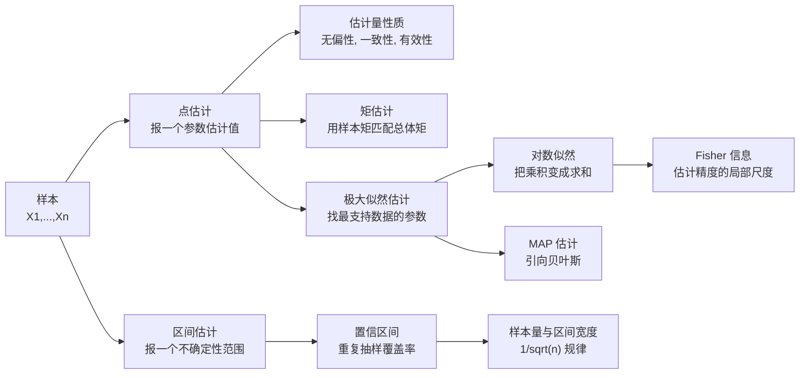
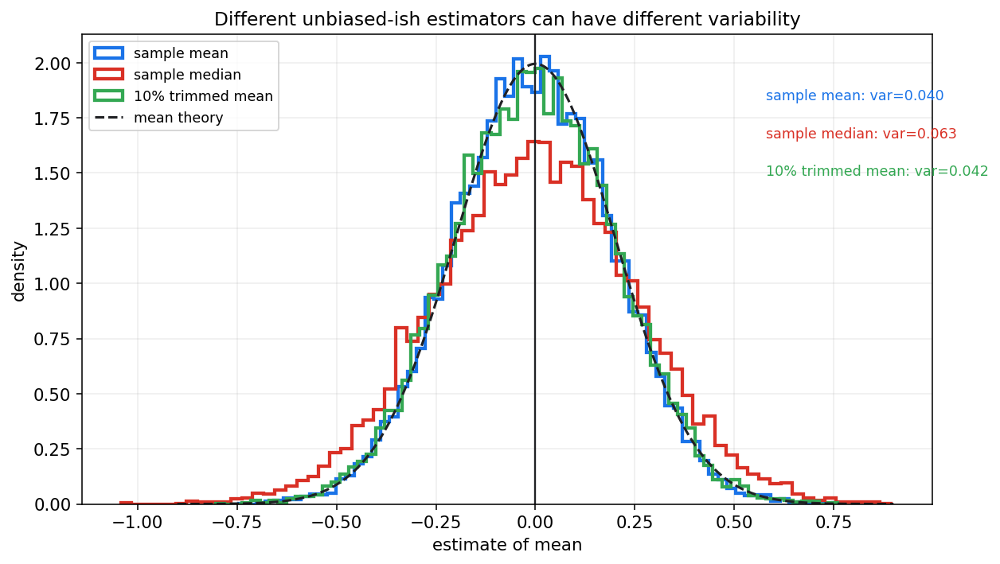
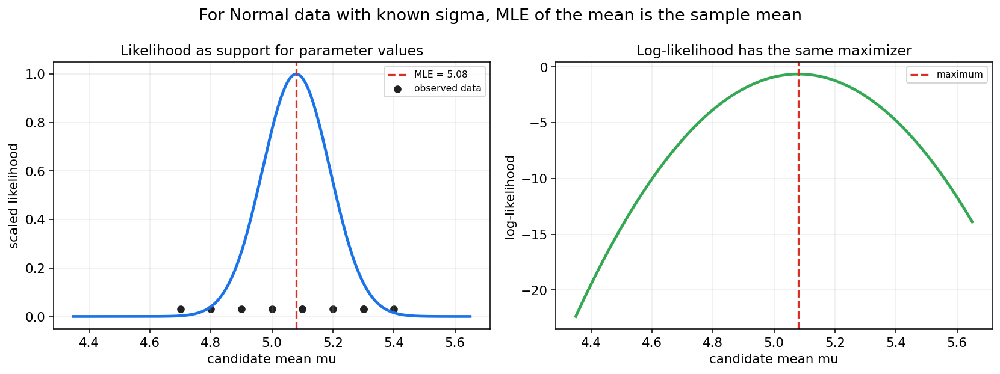
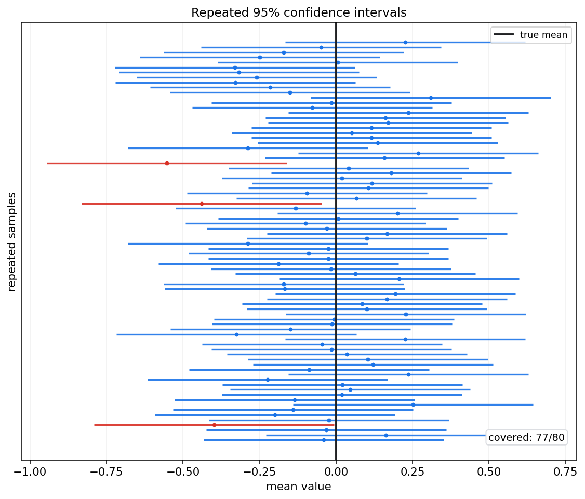
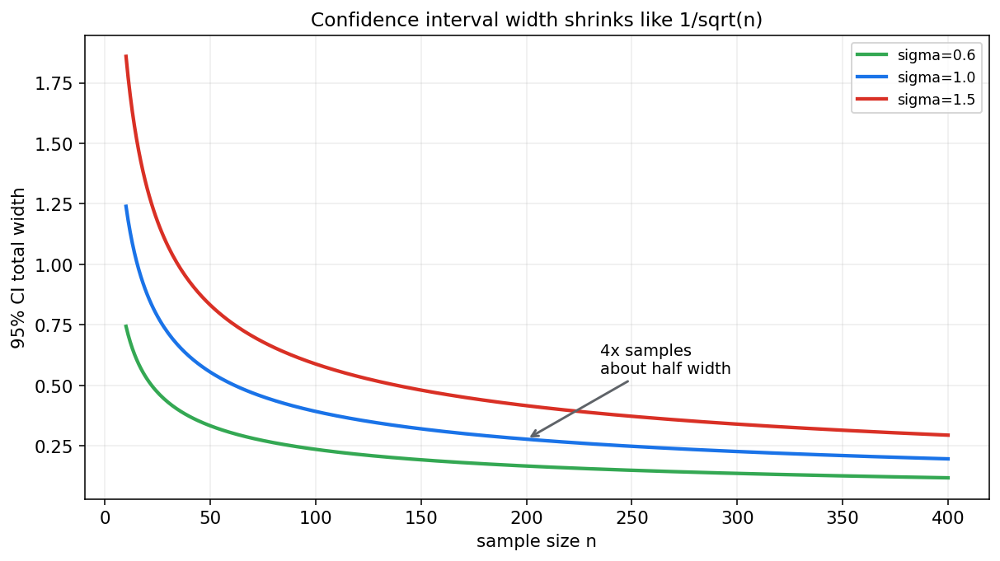

# 数理统计第八章教程: 点估计, 区间估计与似然方法

> 第七章已经建立了一条核心线索:
>
> 总体 -> 样本 -> 统计量 -> 抽样分布.
>
> 这一章开始真正做统计推断:
>
> 1. 总体参数未知时, 怎样用样本给出一个估计值?
> 2. 一个估计量好不好, 不能只看这一次算出来的数, 要看它在重复抽样中怎样表现.
> 3. 除了报一个点, 怎样给出不确定性范围?
> 4. 似然函数为什么是统计和机器学习共同的核心语言?
>
> 这一章是后面假设检验, 回归, 贝叶斯, 统计学习的共同入口.

---

## 0. 先看全章主线

第八章的主线可以压成下面这张图:

一句话概括这一章:

> 估计不是随口报一个数,  
> 而是在样本随机性的背景下,  
> 设计一个在重复抽样中尽量可靠, 稳定, 高效的规则.

---

## 1. 估计问题到底在问什么

### 1.1 从总体参数开始

设总体分布属于某个参数族:

$$
X\sim P_\theta
$$

其中 $\theta$ 是未知参数.  
例如:

- Bernoulli 分布里的成功概率 $p$
- Normal 分布里的均值 $\mu$ 和方差 $\sigma^2$
- Exponential 分布里的速率参数 $\lambda$
- 线性回归里的系数向量 $\beta$

我们观察到一组样本:

$$
X_1,\dots,X_n
$$

估计问题就是:

> 根据这份样本, 构造一个规则去推断未知参数 $\theta$.

### 1.2 估计量和估计值

**估计量**是样本的函数:

$$
\hat\theta=T(X_1,\dots,X_n)
$$

它还没有代入具体数据, 所以是随机变量.

**估计值**是把实际样本代入以后得到的数字:

$$
\hat\theta_{\mathrm{obs}}=T(x_1,\dots,x_n)
$$

这一区分非常重要:

- 估计量: 研究理论性质, 例如期望, 方差, 极限分布
- 估计值: 针对眼前数据给出的具体答案

### 1.3 为什么不能只看估计值

假设两种估计方法这一次都算出了接近真实值的结果, 这并不能说明它们一样好.  
真正要比较的是:

> 如果重复抽样很多次, 这个估计规则通常会离真实参数多远?

这就是第七章抽样分布思想在估计问题里的应用.

---

## 2. 点估计: 先报一个最有代表性的数

### 2.1 基本形式

点估计给出一个数字来代表未知参数:

$$
\theta \approx \hat\theta
$$

例如:

$$
\mu \approx \bar X
$$

$$
\sigma^2 \approx S^2
$$

$$
p \approx \hat p=\frac{1}{n}\sum_{i=1}^{n}X_i
$$

### 2.2 点估计的优点和限制

点估计的优点是清晰, 易报告, 易参与后续计算.  
但它有一个天然缺陷:

> 一个点看不出不确定性.

例如两个实验都得到转化率提升 $1%$, 但:

- 一个实验有 100 个用户
- 一个实验有 100000 个用户

这两个 $1%$ 的可信程度显然不同.

### 2.3 点估计需要配合抽样波动

所以好的统计报告通常至少包括:

- 点估计
- 标准误差
- 置信区间
- 使用了哪些模型假设

只报一个点, 很容易让随机波动看起来像确定事实.

---

## 3. 估计量的好坏: 无偏性, 方差, MSE, 一致性

### 3.1 无偏性

如果

$$
E[\hat\theta]=\theta
$$

则称 $\hat\theta$ 是 $\theta$ 的无偏估计量.

直觉是:

> 重复抽样很多次后, 估计量的平均值正好等于真实参数.

例如在独立同分布且期望存在时:

$$
E[\bar X]=\mu
$$

所以样本均值是总体均值的无偏估计.

### 3.2 有偏不一定没用

无偏性很重要, 但不能把它误解成唯一标准.  
一个估计量即使有一点偏差, 只要方差明显更小, 总体误差也可能更低.

这就引出均方误差.

### 3.3 均方误差 MSE

估计量的均方误差定义为:

$$
\mathrm{MSE}(\hat\theta)=E[(\hat\theta-\theta)^2]
$$

它可以分解成:

$$
\mathrm{MSE}(\hat\theta)=\mathrm{Var}(\hat\theta)+\mathrm{Bias}(\hat\theta)^2
$$

其中:

$$
\mathrm{Bias}(\hat\theta)=E[\hat\theta]-\theta
$$

这条公式非常实用:

> 总误差 = 波动误差 + 系统偏差.

机器学习里的正则化, 收缩估计, 模型简化, 都可以从偏差-方差权衡的角度理解.

### 3.4 一致性

如果样本量越来越大时,

$$
\hat\theta_n \xrightarrow{P} \theta
$$

则称 $\hat\theta_n$ 是一致估计量.

直觉是:

> 样本量足够大时, 估计量会以高概率靠近真实参数.

无偏性看的是有限样本平均是否对准.  
一致性看的是大样本极限是否收敛到真实值.

### 3.5 有效性

在无偏估计量之间, 如果一个估计量方差更小, 它通常更有效.  
设 $\hat\theta_1,\hat\theta_2$ 都无偏, 若

$$
\mathrm{Var}(\hat\theta_1)<\mathrm{Var}(\hat\theta_2)
$$

则 $\hat\theta_1$ 在重复抽样中更稳定.

但现实中常常不是简单比较无偏估计量, 而要结合 MSE, 鲁棒性, 计算成本和模型假设.

### 3.6 不同估计量的波动对比

这张图模拟了同一个正态总体下多种位置估计量的重复抽样分布.  
样本均值在正态总体下非常有效, 中位数和截尾均值也能估计中心, 但波动规模不同.

这说明:

> 估计量不是只要"看起来合理"就够, 还要研究它的抽样分布.

---

## 4. 矩估计法: 用样本矩匹配总体矩

### 4.1 什么是矩

总体的一阶矩是:

$$
E[X]
$$

二阶矩是:

$$
E[X^2]
$$

更一般地, $k$ 阶矩是:

$$
E[X^k]
$$

样本矩对应为:

$$
\frac{1}{n}\sum_{i=1}^{n}X_i^k
$$

### 4.2 矩估计的核心想法

如果总体矩可以写成参数的函数:

$$
E_\theta[X^k]=g_k(\theta)
$$

那就用样本矩去近似总体矩:

$$
\frac{1}{n}\sum_{i=1}^{n}X_i^k \approx g_k(\theta)
$$

然后解出 $\theta$.

一句话:

> 用样本中的平均特征, 去匹配模型里的理论平均特征.

### 4.3 Bernoulli 分布例子

若

$$
X\sim \mathrm{Bernoulli}(p)
$$

则

$$
E[X]=p
$$

样本一阶矩是:

$$
\bar X=\frac{1}{n}\sum_{i=1}^{n}X_i
$$

矩估计得到:

$$
\hat p=\bar X
$$

这和直觉一致: 成功概率用样本成功比例估计.

### 4.4 Exponential 分布例子

若采用速率参数形式:

$$
X\sim \mathrm{Exponential}(\lambda)
$$

则

$$
E[X]=\frac{1}{\lambda}
$$

令样本均值匹配总体均值:

$$
\bar X=\frac{1}{\lambda}
$$

得到矩估计:

$$
\hat\lambda=\frac{1}{\bar X}
$$

### 4.5 矩估计的特点

优点:

- 思路直观
- 计算通常简单
- 不一定需要完整写出似然函数

限制:

- 不一定最有效
- 多参数模型中矩的选择会影响结果
- 有时样本矩不稳定, 尤其对重尾分布

---

## 5. 似然函数: 哪组参数更支持当前数据

### 5.1 从概率到似然

如果参数 $\theta$ 已知, 概率模型告诉我们:

$$
P_\theta(\text{data})
$$

也就是在这个参数下看到当前数据的可能性.

现在数据已经观察到了, 参数未知.  
我们把同一个表达式看成 $\theta$ 的函数:

$$
L(\theta)=P_\theta(\text{observed data})
$$

这就是似然函数.

### 5.2 似然不是参数的概率

在频率学派框架里, 参数 $\theta$ 是固定但未知的常数.  
所以 $L(\theta)$ 不是:

$$
P(\theta\mid \text{data})
$$

它表达的是:

> 如果参数取这个值, 当前数据有多被支持.

### 5.3 独立样本下的似然

若样本独立同分布, 密度或质量函数为 $f(x;\theta)$, 则似然函数是:

$$
L(\theta)=\prod_{i=1}^{n}f(x_i;\theta)
$$

对数似然是:

$$
\ell(\theta)=\log L(\theta)=\sum_{i=1}^{n}\log f(x_i;\theta)
$$

对数似然常用得更多, 因为:

- 乘积变求和, 计算更稳定
- 求导更方便
- 最大化 $L$ 和最大化 $\ell$ 得到同一个参数

### 5.4 似然曲线图

图中每一个候选均值 $\mu$ 都对应一个似然值.  
似然最高的位置就是极大似然估计.

这张图要留下一个直觉:

> MLE 不是神秘公式, 而是在问哪组参数让当前数据最不意外.

---

## 6. 极大似然估计 MLE

### 6.1 定义

极大似然估计定义为:

$$
\hat\theta_{\mathrm{MLE}}=\arg\max_{\theta}L(\theta)
$$

等价地:

$$
\hat\theta_{\mathrm{MLE}}=\arg\max_{\theta}\ell(\theta)
$$

实际计算通常按下面几步:

1. 写出样本的联合概率或联合密度
2. 把它看成参数的函数, 得到似然
3. 取对数得到对数似然
4. 对参数求导或使用数值优化
5. 检查参数约束和边界

### 6.2 Bernoulli 分布的 MLE

设

$$
X_i\sim \mathrm{Bernoulli}(p)
$$

观测值 $x_i\in\{0,1\}$.  
似然函数为:

$$
L(p)=\prod_{i=1}^{n}p^{x_i}(1-p)^{1-x_i}
$$

合并指数:

$$
L(p)=p^{\sum x_i}(1-p)^{n-\sum x_i}
$$

对数似然为:

$$
\ell(p)=\sum x_i\log p+(n-\sum x_i)\log(1-p)
$$

求导并令其为 0:

$$
\frac{\sum x_i}{p}-\frac{n-\sum x_i}{1-p}=0
$$

得到:

$$
\hat p=\frac{1}{n}\sum_{i=1}^{n}x_i=\bar x
$$

所以 Bernoulli 参数的 MLE 是样本成功比例.

### 6.3 正态均值的 MLE

设方差 $\sigma^2$ 已知:

$$
X_i\sim \mathcal{N}(\mu,\sigma^2)
$$

对数似然去掉与 $\mu$ 无关的常数后为:

$$
\ell(\mu)=-\frac{1}{2\sigma^2}\sum_{i=1}^{n}(x_i-\mu)^2+C
$$

最大化 $\ell(\mu)$ 等价于最小化:

$$
\sum_{i=1}^{n}(x_i-\mu)^2
$$

求导得到:

$$
\hat\mu=\bar x
$$

这也是最小二乘和极大似然第一次连起来:

> 正态噪声假设下, 最小平方误差等价于极大似然.

### 6.4 正态方差的 MLE

若 $\mu,\sigma^2$ 都未知, 正态模型下 MLE 为:

$$
\hat\mu_{\mathrm{MLE}}=\bar x
$$

$$
\hat\sigma^2_{\mathrm{MLE}}=\frac{1}{n}\sum_{i=1}^{n}(x_i-\bar x)^2
$$

注意这里分母是 $n$, 不是 $n-1$.

这说明一个重要事实:

> MLE 不一定无偏.

用 $n-1$ 的样本方差是无偏估计, 用 $n$ 的方差估计是正态模型下的 MLE.

### 6.5 Exponential 分布的 MLE

设

$$
X_i\sim \mathrm{Exponential}(\lambda)
$$

密度为:

$$
f(x;\lambda)=\lambda e^{-\lambda x},\quad x\ge 0
$$

对数似然为:

$$
\ell(\lambda)=n\log\lambda-\lambda\sum_{i=1}^{n}x_i
$$

求导:

$$
\frac{n}{\lambda}-\sum_{i=1}^{n}x_i=0
$$

得到:

$$
\hat\lambda=\frac{n}{\sum x_i}=\frac{1}{\bar x}
$$

这个例子中 MLE 和矩估计相同.

### 6.6 MLE 的大样本性质

在常规条件下, MLE 通常具有几条重要性质:

- 一致性: 样本量大时趋向真实参数
- 渐近正态性: 标准化后近似正态
- 渐近有效性: 大样本下达到信息下界

更具体地, 一维参数下常见结论是:

$$
\hat\theta_{\mathrm{MLE}}\approx \mathcal{N}\left(\theta,\frac{1}{nI(\theta)}\right)
$$

其中 $I(\theta)$ 是单个样本提供的 Fisher 信息.

---

## 7. Fisher 信息: 估计精度的局部尺度

### 7.1 score 函数

单个样本的对数密度为:

$$
\log f(X;\theta)
$$

对参数求导得到 score:

$$
S(\theta)=\frac{\partial}{\partial\theta}\log f(X;\theta)
$$

score 描述的是:

> 参数轻微变化时, 对数似然怎样变化.

### 7.2 Fisher 信息定义

Fisher 信息可写为:

$$
I(\theta)=E_\theta[S(\theta)^2]
$$

在常规条件下也可写为:

$$
I(\theta)=-E_\theta\left[\frac{\partial^2}{\partial\theta^2}\log f(X;\theta)\right]
$$

它衡量的是模型对参数变化的敏感程度.

### 7.3 信息越大, 估计越准

如果 $n$ 个样本独立同分布, 总信息量通常为:

$$
nI(\theta)
$$

MLE 的渐近方差约为:

$$
\frac{1}{nI(\theta)}
$$

所以信息量越大, 参数估计越精确.

### 7.4 Cramer-Rao 下界的直觉

在常规条件下, 对无偏估计量有:

$$
\mathrm{Var}(\hat\theta)\ge \frac{1}{nI(\theta)}
$$

这叫 Cramer-Rao 下界.

它不是说任何估计量都一定达到这个下界, 而是说:

> 在给定模型下, 无偏估计量的方差不能随便小.

---

## 8. 区间估计: 不只报一个点

### 8.1 为什么需要区间

点估计回答:

> 参数大概是多少?

区间估计回答:

> 在抽样误差影响下, 哪个范围是合理的?

一个典型区间写作:

$$
[\hat\theta_L,\hat\theta_U]
$$

其中端点本身由样本计算出来, 所以也是随机的.

### 8.2 置信区间的频率学含义

一个 $95%$ 置信区间的正确解释是:

> 如果用同一个抽样规则和构造规则重复很多次, 约 $95%$ 的区间会覆盖真实参数.

注意, 在频率学派解释下, 参数不是随机变量.  
随机的是区间, 不是参数.

所以不能把一次算出的 $95%$ 置信区间解释成:

> 真实参数有 $95%$ 概率落在这个具体区间里.

这是本章最重要的易错点之一.

### 8.3 重复抽样下的覆盖图

图中每条横线是一份样本得到的置信区间.  
蓝色区间覆盖了真实均值, 红色区间没有覆盖.

关键直觉是:

> 置信水平描述的是构造方法的长期覆盖率, 不是某个固定区间内部的后验概率.

---

## 9. 单总体均值的置信区间

### 9.1 方差已知, 正态总体

若

$$
X_1,\dots,X_n\sim \mathcal{N}(\mu,\sigma^2)
$$

且 $\sigma$ 已知, 则:

$$
\frac{\bar X-\mu}{\sigma/\sqrt n}\sim \mathcal{N}(0,1)
$$

所以 $1-\alpha$ 置信区间为:

$$
\bar X\pm z_{\alpha/2}\frac{\sigma}{\sqrt n}
$$

其中 $z_{\alpha/2}$ 表示标准正态右尾概率为 $\alpha/2$ 的分位点.  
常用 $95%$ 区间时:

$$
z_{0.025}\approx 1.96
$$

### 9.2 方差未知, 正态总体

若 $\sigma$ 未知, 用样本标准差 $S$ 替代.  
第七章已经给出:

$$
\frac{\bar X-\mu}{S/\sqrt n}\sim t_{n-1}
$$

于是 $1-\alpha$ 置信区间为:

$$
\bar X\pm t_{\alpha/2,n-1}\frac{S}{\sqrt n}
$$

这里 $t_{\alpha/2,n-1}$ 是自由度 $n-1$ 的 t 分布分位点.

### 9.3 大样本近似

如果样本量足够大, 即使总体不完全正态, 也常用中心极限定理近似:

$$
\bar X\approx \mathcal{N}\left(\mu,\frac{\sigma^2}{n}\right)
$$

这时可以用:

$$
\bar X\pm 1.96\frac{S}{\sqrt n}
$$

作为近似 $95%$ 区间.

但要注意:

- 重尾分布需要更大样本
- 强偏态数据要谨慎
- 非独立样本不能直接套普通标准误

---

## 10. 总体比例的置信区间

### 10.1 样本比例

若 $X_i\in\{0,1\}$, 则总体比例 $p$ 的自然估计是:

$$
\hat p=\frac{1}{n}\sum_{i=1}^{n}X_i
$$

大样本下:

$$
\hat p\approx \mathcal{N}\left(p,\frac{p(1-p)}{n}\right)
$$

用 $\hat p$ 替代未知的 $p$, 得到近似标准误:

$$
\mathrm{SE}(\hat p)=\sqrt{\frac{\hat p(1-\hat p)}{n}}
$$

近似 $95%$ 区间为:

$$
\hat p\pm 1.96\sqrt{\frac{\hat p(1-\hat p)}{n}}
$$

### 10.2 边界问题

当样本量小, 或 $\hat p$ 靠近 0 或 1 时, 上面的 Wald 区间可能表现很差.  
实际工作中常考虑 Wilson 区间, Clopper-Pearson 区间或贝叶斯 Beta 区间.

本章先记住一个原则:

> 正态近似不是无条件可靠, 尤其在小样本和边界参数附近要谨慎.

---

## 11. 总体方差的置信区间

### 11.1 正态总体下的方差统计量

若

$$
X_1,\dots,X_n\sim \mathcal{N}(\mu,\sigma^2)
$$

则:

$$
\frac{(n-1)S^2}{\sigma^2}\sim \chi^2_{n-1}
$$

利用 Chi-square 分位点可以构造 $\sigma^2$ 的区间.

### 11.2 区间形式

设 $\chi^2_{\alpha/2,n-1}$ 和 $\chi^2_{1-\alpha/2,n-1}$ 是对应分位点, 则:

$$
P\left(
\chi^2_{\alpha/2,n-1}
\le
\frac{(n-1)S^2}{\sigma^2}
\le
\chi^2_{1-\alpha/2,n-1}
\right)=1-\alpha
$$

整理得到:

$$
\left[
\frac{(n-1)S^2}{\chi^2_{1-\alpha/2,n-1}},
\frac{(n-1)S^2}{\chi^2_{\alpha/2,n-1}}
\right]
$$

这是 $\sigma^2$ 的置信区间.

### 11.3 条件很关键

这个精确区间依赖正态总体假设.  
如果总体明显不正态, 样本方差的 Chi-square 结论不再精确.

---

## 12. 两总体参数比较初步

### 12.1 两个均值之差

很多问题关心的不是单个参数, 而是差异:

$$
\mu_1-\mu_2
$$

例如:

- 新旧推荐算法的平均点击率差异
- 两种材料的平均寿命差异
- 两个模型的平均损失差异

若两个独立样本足够大, 可用近似:

$$
\bar X-\bar Y\approx \mathcal{N}\left(
\mu_X-\mu_Y,
\frac{\sigma_X^2}{n_X}+\frac{\sigma_Y^2}{n_Y}
\right)
$$

用样本方差替代未知方差, 标准误为:

$$
\mathrm{SE}(\bar X-\bar Y)=\sqrt{\frac{S_X^2}{n_X}+\frac{S_Y^2}{n_Y}}
$$

于是可以构造均值差的近似区间.

### 12.2 两个比例之差

对于 A/B 测试, 常见目标是:

$$
p_A-p_B
$$

样本估计为:

$$
\hat p_A-\hat p_B
$$

近似标准误为:

$$
\sqrt{
\frac{\hat p_A(1-\hat p_A)}{n_A}
+
\frac{\hat p_B(1-\hat p_B)}{n_B}
}
$$

这个形式在第九章假设检验和实验设计中会继续出现.

### 12.3 配对数据不能当独立样本

如果同一个对象在两个条件下都被测量, 数据是配对的.  
例如同一批用户在改版前后的行为, 同一批病人在治疗前后的指标.

这时应先构造差值:

$$
D_i=X_i-Y_i
$$

再对差值的均值做推断.

不要把配对样本误当成两个独立样本, 否则标准误会错.

---

## 13. 样本量与区间宽度

### 13.1 宽度的基本规律

均值置信区间的典型半宽是:

$$
z_{\alpha/2}\frac{\sigma}{\sqrt n}
$$

所以总宽度大约是:

$$
2z_{\alpha/2}\frac{\sigma}{\sqrt n}
$$

这说明:

> 区间宽度按 $1/\sqrt n$ 缩小.

### 13.2 四倍样本量, 区间宽度约减半

如果希望区间宽度减半, 单纯增加样本量时通常需要:

$$
n \text{ 变为 } 4n
$$

这就是统计实验里样本量成本很高的原因.

图中可以看到, 前期增加样本量会明显缩窄区间, 后期边际收益逐渐变小.

### 13.3 区间宽度由三件事控制

一个置信区间的宽度通常由三件事控制:

1. 置信水平  
   置信水平越高, 分位点越大, 区间越宽.

2. 数据波动  
   方差越大, 标准误越大, 区间越宽.

3. 样本量  
   样本量越大, 标准误越小, 区间越窄.

所以想获得更精确估计, 不只有"多收集数据"这一种方式.  
降低测量噪声, 改进实验设计, 使用配对设计, 分层抽样, 也可能降低不确定性.

---

## 14. Delta 方法初步: 函数形式估计量的不确定性

### 14.1 问题来源

有时我们估计的不是参数本身 $\theta$, 而是它的函数:

$$
g(\theta)
$$

例如:

- odds: $p/(1-p)$
- log odds: $\log(p/(1-p))$
- 标准差: $\sigma=\sqrt{\sigma^2}$
- 相对提升: $(p_B-p_A)/p_A$

如果已经有 $\hat\theta$ 的近似分布, 怎样得到 $g(\hat\theta)$ 的近似分布?

### 14.2 一维 Delta 方法

若

$$
\hat\theta\approx \mathcal{N}(\theta,\mathrm{Var}(\hat\theta))
$$

且 $g$ 在 $\theta$ 附近可导, 则:

$$
g(\hat\theta)\approx
\mathcal{N}\left(
g(\theta),
[g'(\theta)]^2\mathrm{Var}(\hat\theta)
\right)
$$

实际使用时把未知的 $\theta$ 替换成 $\hat\theta$.

### 14.3 直觉

Delta 方法本质上是泰勒展开:

$$
g(\hat\theta)\approx g(\theta)+g'(\theta)(\hat\theta-\theta)
$$

所以:

> 参数估计的波动, 会被函数斜率放大或缩小.

这个思想在机器学习指标区间, A/B 测试比例变换, 广义线性模型中都很常见.

---

## 15. MAP 估计: 通向贝叶斯的过渡

### 15.1 从 MLE 到 MAP

MLE 只看似然:

$$
\hat\theta_{\mathrm{MLE}}=\arg\max_\theta p(D\mid \theta)
$$

MAP 估计加入先验:

$$
\hat\theta_{\mathrm{MAP}}=\arg\max_\theta p(\theta\mid D)
$$

由贝叶斯公式:

$$
p(\theta\mid D)\propto p(D\mid \theta)p(\theta)
$$

所以:

$$
\hat\theta_{\mathrm{MAP}}
=
\arg\max_\theta
\left[
\log p(D\mid \theta)+\log p(\theta)
\right]
$$

### 15.2 MAP 和正则化

如果先验偏好较小的参数, $\log p(\theta)$ 会像惩罚项一样出现.

例如在线性模型里, 高斯先验常对应 L2 正则化.  
Laplace 先验常对应 L1 正则化.

所以 MAP 是连接贝叶斯统计和机器学习正则化的一座桥.

### 15.3 MAP 不是完整贝叶斯推断

MAP 仍然只给一个点估计.  
完整贝叶斯推断更关心整个后验分布:

$$
p(\theta\mid D)
$$

第十二章和第十三章会继续展开先验, 后验, MCMC 和变分推断.

---

## 16. 估计方法如何和机器学习连接

### 16.1 损失函数常常来自负对数似然

最大化对数似然:

$$
\max_\theta \sum_{i=1}^{n}\log p(y_i\mid x_i;\theta)
$$

等价于最小化负对数似然:

$$
\min_\theta -\sum_{i=1}^{n}\log p(y_i\mid x_i;\theta)
$$

这就是很多机器学习损失函数的来源.

例如:

- 正态回归噪声 -> MSE
- Bernoulli 分类模型 -> binary cross entropy
- Categorical 分类模型 -> cross entropy

### 16.2 参数估计和泛化误差

训练集上得到的模型参数本质上也是估计量.  
它们依赖随机样本, 所以会随训练数据变化.

机器学习里关心的泛化, 可以理解为:

> 这个由样本估出来的规则, 在未来总体上还能不能稳定工作?

### 16.3 标准误不只属于传统统计

在模型评估中, accuracy, AUC, 平均损失, 转化率差异, 都是样本统计量.  
它们也有标准误和置信区间.

所以工程报告里只写:

> 模型 A 比模型 B 高 0.3%

是不够的.  
还要问:

> 这个 0.3% 相对抽样波动来说是否足够大?

这会自然通向第九章假设检验.

---

## 17. 本章主线总结

第八章可以压成下面几句话:

1. 点估计用样本函数给未知参数一个估计值
2. 估计量好不好, 要看无偏性, 方差, MSE, 一致性和有效性
3. 矩估计用样本矩匹配总体矩
4. 极大似然估计选择最支持当前数据的参数
5. Fisher 信息描述参数估计的局部精度
6. 置信区间描述构造方法的长期覆盖率
7. 样本量增加会按 $1/\sqrt n$ 缩小标准误
8. MAP 把似然和先验结合起来, 为贝叶斯统计做准备

这章最核心的态度是:

> 不要只问估计值是多少,  
> 还要问这个估计规则在重复抽样中有多可靠.

---

## 18. 典型题型与实战清单

### 18.1 典型题型

1. **判断估计量是否无偏**
   - 计算 $E[\hat\theta]$
   - 和 $\theta$ 比较

2. **计算 MSE**
   - 用 $E[(\hat\theta-\theta)^2]$
   - 或用方差加偏差平方

3. **用矩估计求参数**
   - 写总体矩
   - 写样本矩
   - 解方程

4. **写似然和对数似然**
   - 先写单个样本密度或概率
   - 再写独立样本乘积
   - 最后取对数

5. **求 MLE**
   - 对对数似然求导
   - 注意参数取值范围和边界

6. **构造均值置信区间**
   - 方差已知用 z
   - 方差未知且正态总体用 t
   - 大样本可用近似

7. **解释置信区间**
   - 说长期覆盖率
   - 不说参数有某个概率落入已算出的固定区间

### 18.2 实战清单

做一个估计问题时, 可以按下面顺序检查:

1. 目标参数是什么?
2. 样本是否可以近似看作独立同分布?
3. 估计量是什么?
4. 这个估计量有没有明显偏差?
5. 标准误怎么估计?
6. 区间估计依赖哪些分布假设?
7. 样本量是否足够支撑正态近似?
8. 是否存在边界参数, 重尾, 离群点或相关样本?
9. 结果应报告为点估计还是区间?
10. 如果用于决策, 误差范围是否足够小?

---

## 19. 典型误区

### 误区 1: 把无偏性当成唯一标准

无偏不一定 MSE 最小.  
有些有偏估计量通过显著降低方差, 反而有更小的总体误差.

### 误区 2: 把 MLE 当成一定无偏

正态方差的 MLE 分母是 $n$, 它通常是有偏的.  
MLE 的优势更多体现在大样本性质和建模统一性.

### 误区 3: 把似然当成参数概率

频率学派里, 似然是参数对数据的支持程度, 不是参数的概率分布.  
参数概率要进入贝叶斯框架才有对应解释.

### 误区 4: 误解置信区间

$95%$ 置信区间说的是构造方法长期有 $95%$ 覆盖率.  
不是说真实参数以 $95%$ 概率落在这一次算出的区间里.

### 误区 5: 忘记区间公式的条件

t 区间, Chi-square 方差区间, F 区间都有模型条件.  
特别是正态总体假设和独立性假设, 不能省略.

### 误区 6: 只会套公式, 不看边界

Bernoulli 参数必须在 $[0,1]$.  
方差和速率参数必须为正.  
求导得到的驻点若不在参数空间里, 就不是合法估计.

### 误区 7: 忽略样本量和区间宽度的关系

样本量翻倍不会让标准误减半.  
标准误按 $1/\sqrt n$ 缩小, 所以精度提升越来越昂贵.

---

## 20. 和前后章节的连接点

### 20.1 和第七章的连接

第七章讲统计量和抽样分布.  
本章所有估计量, 标准误, 置信区间都建立在抽样分布上.

### 20.2 和第九章的连接

置信区间和假设检验是同一套抽样分布思想的两种表达.  
第九章会进一步研究:

- p 值
- 显著性水平
- 第一类错误和第二类错误
- 功效和样本量设计

### 20.3 和第十章的连接

回归模型中的系数估计, 标准误, t 统计量, F 统计量, 都是本章和第七章的直接应用.

### 20.4 和贝叶斯章节的连接

MLE 只看似然.  
MAP 把似然和先验相乘.  
完整贝叶斯推断则保留整个后验分布.

所以本章的似然语言, 会在第十二章之后再次成为主线.

---

## 21. 本章收尾

估计是从样本走向总体的第一步.  
但统计推断从来不是只给一个答案, 而是要同时说明这个答案的不确定性.

第七章告诉我们统计量会随机波动.  
第八章告诉我们:

> 好的估计方法, 必须把这种随机波动纳入设计和解释.

下一章会继续向前走:  
当我们不只是想估一个参数, 而是想判断一个说法是否被数据反驳时, 就进入假设检验.
