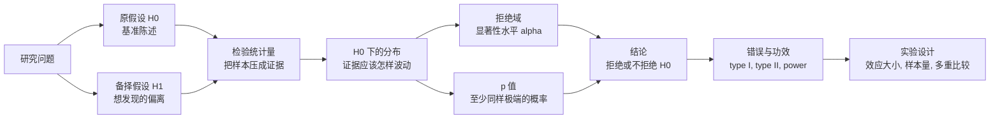
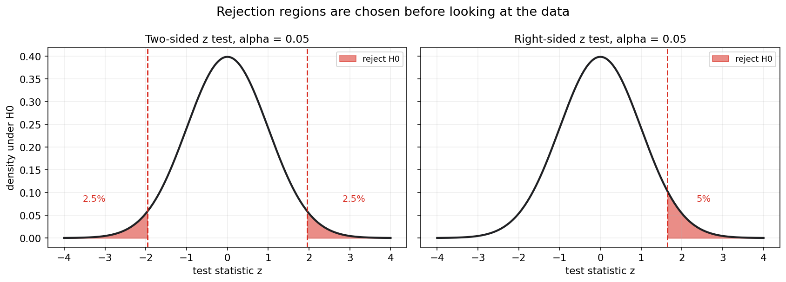
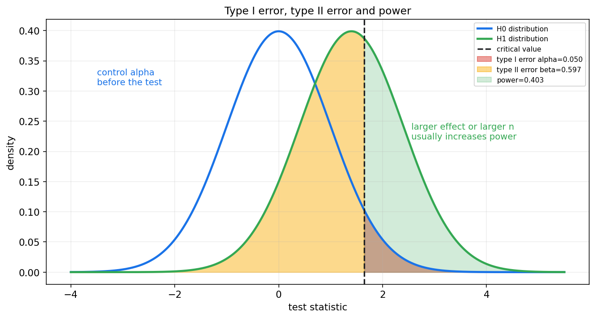
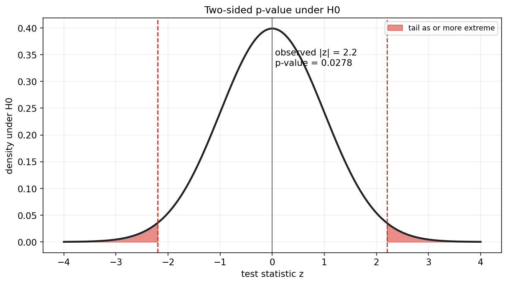
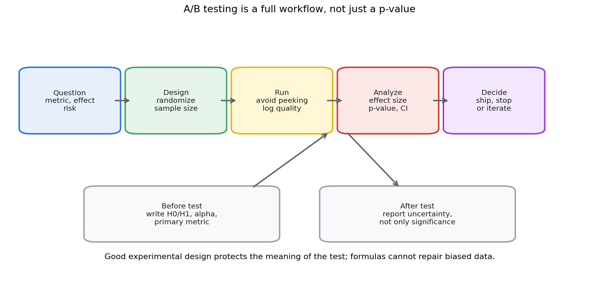

# 数理统计第九章教程: 假设检验, p 值, 功效与实验设计

> 第八章解决的是估计问题:
>
> 参数大概是多少? 不确定性有多大?
>
> 第九章进一步问:
>
> 1. 眼前数据是否足够反对一个基准说法?
> 2. 我们怎样控制误判概率?
> 3. p 值, 显著性水平, 功效到底分别在说什么?
> 4. 为什么统计检验不能替代好的实验设计?
>
> 这一章是从"估计一个数"走向"做一个判断"的核心章节.

---

## 0. 先看全章主线

第九章的主线可以压成下面这张图:

一句话概括这一章:

> 假设检验不是证明某个结论绝对为真,  
> 而是在控制错误概率的前提下,  
> 判断样本证据是否足够反对某个基准陈述.

---

## 1. 假设检验到底在做什么

### 1.1 从一个具体问题开始

假设一个产品团队上线了新推荐策略.  
他们想知道:

> 新策略是否提高了点击率?

如果新策略样本点击率比旧策略高, 这当然是一个信号.  
但问题是:

> 这个差异是系统性提升, 还是随机抽样波动?

假设检验就是为这类问题服务的.

### 1.2 检验的基本语气

假设检验通常先设立一个基准说法:

$$
H_0
$$

再问:

> 如果 $H_0$ 真的成立, 现在这么极端的数据有多罕见?

如果非常罕见, 我们就拒绝 $H_0$.  
如果不够罕见, 我们就不拒绝 $H_0$.

注意这里的语言:

- 拒绝 $H_0$: 数据提供了足够证据反对 $H_0$
- 不拒绝 $H_0$: 数据证据不足以反对 $H_0$

不要把"不拒绝"说成"证明 $H_0$ 成立".

---

## 2. 原假设与备择假设

### 2.1 原假设 H0

原假设通常是基准, 无差异, 无效果, 无变化的陈述.

例如:

$$
H_0:\mu=\mu_0
$$

或:

$$
H_0:p_A=p_B
$$

它不是一定代表我们相信它是真的.  
它是检验时用来构造参照分布的基准模型.

### 2.2 备择假设 H1

备择假设描述我们关心的偏离方向.

常见形式:

1. 双侧检验:

$$
H_1:\mu\ne\mu_0
$$

2. 右侧检验:

$$
H_1:\mu>\mu_0
$$

3. 左侧检验:

$$
H_1:\mu<\mu_0
$$

### 2.3 先定假设, 再看数据

假设检验的设计原则是:

> 在看结果之前, 明确 $H_0$, $H_1$, 显著性水平, 主指标和分析方法.

如果看完数据再挑方向, 再挑指标, 再挑检验方法, p 值就会失去原本意义.

这也是实验设计和预注册思想的基础.

---

## 3. 检验统计量与拒绝域

### 3.1 检验统计量

检验统计量是从样本算出来的一个数:

$$
T=T(X_1,\dots,X_n)
$$

它把样本压缩成检验证据.

例如单总体均值检验中, 若方差已知:

$$
Z=\frac{\bar X-\mu_0}{\sigma/\sqrt n}
$$

如果 $H_0:\mu=\mu_0$ 成立, 则:

$$
Z\sim \mathcal{N}(0,1)
$$

于是我们可以判断观察到的 $z$ 是否太极端.

### 3.2 拒绝域

拒绝域是检验统计量落入后就拒绝 $H_0$ 的区域.

例如双侧 z 检验, 显著性水平为 $0.05$ 时:

$$
|Z|>1.96
$$

就是拒绝域.

图中红色区域是在 $H_0$ 成立时预先留出的极端区域.  
如果观察到的检验统计量落入红色区域, 就拒绝 $H_0$.

### 3.3 显著性水平 alpha

显著性水平 $\alpha$ 是我们愿意承受的第一类错误概率上限.

常用:

$$
\alpha=0.05
$$

它表示:

> 如果 $H_0$ 真的成立, 检验规则错误拒绝它的概率控制在 $5%$.

显著性水平必须在看数据之前设定.

---

## 4. 第一类错误, 第二类错误与功效

### 4.1 两类错误

假设检验是在不确定性下做判断, 所以一定可能犯错.

两类错误如下:

| 真实情况 | 检验结论 | 名称 |
| --- | --- | --- |
| $H_0$ 真实 | 拒绝 $H_0$ | 第一类错误 |
| $H_1$ 真实 | 不拒绝 $H_0$ | 第二类错误 |

第一类错误概率记为:

$$
\alpha=P(\text{reject }H_0\mid H_0\text{ true})
$$

第二类错误概率记为:

$$
\beta=P(\text{not reject }H_0\mid H_1\text{ true})
$$

### 4.2 功效 power

功效定义为:

$$
1-\beta
$$

它表示:

> 当真实存在某个效应时, 检验能发现它的概率.

功效越高, 漏掉真实效应的概率越低.

这张图的直觉是:

- 红色区域: $H_0$ 真实却拒绝它, 即第一类错误
- 黄色区域: $H_1$ 真实却没拒绝 $H_0$, 即第二类错误
- 绿色区域: $H_1$ 真实且成功拒绝 $H_0$, 即功效

### 4.3 alpha 和 beta 的权衡

在样本量和效应大小固定时, 降低 $\alpha$ 通常会让拒绝域更小, 从而增大 $\beta$.

也就是说:

> 更严格地控制误报, 往往会降低发现真实效应的能力.

提高功效常见方式:

- 增大样本量
- 降低测量噪声
- 使用更有效的实验设计, 如配对设计
- 聚焦更稳定的主指标
- 接受更大的 $\alpha$, 但这会增加误报风险

---

## 5. p 值

### 5.1 定义

p 值是在 $H_0$ 成立的前提下, 观察到当前数据这样极端或更极端结果的概率.

对双侧 z 检验, 如果观察到 $z_{\mathrm{obs}}$, 则:

$$
p=P(|Z|\ge |z_{\mathrm{obs}}|\mid H_0)
$$

其中:

$$
Z\sim \mathcal{N}(0,1)
$$

图中红色尾部面积就是双侧 p 值.

### 5.2 p 值和显著性水平的关系

常用规则:

$$
p\le \alpha \Rightarrow \text{reject }H_0
$$

$$
p>\alpha \Rightarrow \text{not reject }H_0
$$

如果 $\alpha=0.05$, p 值为 $0.03$, 则拒绝 $H_0$.  
如果 p 值为 $0.12$, 则不拒绝 $H_0$.

### 5.3 p 值不是这些东西

p 值不是:

- $H_0$ 为真的概率
- $H_1$ 为真的概率
- 结果由随机性导致的概率
- 效应大小
- 结果重要性的度量

p 值只回答一个条件问题:

> 假如 $H_0$ 成立, 当前或更极端的数据有多罕见?

### 5.4 小 p 值和大样本

大样本下, 非常小的差异也可能产生很小的 p 值.  
因此显著不等于重要.

报告检验结果时, 应同时报告:

- 效应大小
- 置信区间
- p 值
- 样本量
- 实验设计和数据质量

---

## 6. 单侧检验与双侧检验

### 6.1 什么时候用双侧

如果关心的是是否有差异, 不预先指定方向, 用双侧检验.

例如:

$$
H_0:\mu=\mu_0
$$

$$
H_1:\mu\ne\mu_0
$$

双侧检验把显著性水平分到两端.

### 6.2 什么时候用单侧

如果研究问题在实验前就明确只关心一个方向, 可以用单侧检验.

例如药物安全阈值:

$$
H_0:\mu\le \mu_0
$$

$$
H_1:\mu>\mu_0
$$

但不能因为数据朝某个方向显著, 事后把双侧改成单侧.

### 6.3 方向必须由问题决定

单侧还是双侧, 应由业务问题, 科学假设和风险结构决定.  
不应由观察结果决定.

---

## 7. 单总体均值检验

### 7.1 方差已知的 z 检验

设:

$$
X_1,\dots,X_n\sim \mathcal{N}(\mu,\sigma^2)
$$

且 $\sigma$ 已知.  
检验:

$$
H_0:\mu=\mu_0
$$

使用统计量:

$$
Z=\frac{\bar X-\mu_0}{\sigma/\sqrt n}
$$

在 $H_0$ 下:

$$
Z\sim \mathcal{N}(0,1)
$$

双侧检验的 p 值为:

$$
p=2P(Z\ge |z_{\mathrm{obs}}|)
$$

这里右侧的 $Z$ 表示标准正态随机变量.

### 7.2 方差未知的 t 检验

若 $\sigma$ 未知, 用样本标准差 $S$ 替代:

$$
T=\frac{\bar X-\mu_0}{S/\sqrt n}
$$

正态总体下, 若 $H_0$ 成立:

$$
T\sim t_{n-1}
$$

所以小样本且方差未知时, t 检验比 z 检验更合适.

### 7.3 t 检验的条件

t 检验的经典精确结论依赖正态总体.  
大样本下可以借助中心极限定理近似, 但如果数据强偏态, 重尾或有严重离群点, 需要谨慎.

---

## 8. 两总体均值检验

### 8.1 独立样本均值差

若有两组独立样本:

$$
X_1,\dots,X_{n_X}
$$

$$
Y_1,\dots,Y_{n_Y}
$$

常见目标是检验:

$$
H_0:\mu_X-\mu_Y=0
$$

估计量为:

$$
\bar X-\bar Y
$$

标准误近似为:

$$
\sqrt{\frac{S_X^2}{n_X}+\frac{S_Y^2}{n_Y}}
$$

常用 Welch t 检验处理两组方差不一定相等的情形.

### 8.2 配对样本均值差

如果两个观测来自同一对象的前后测量或匹配单位, 应先构造差值:

$$
D_i=X_i-Y_i
$$

再检验:

$$
H_0:E[D]=0
$$

配对设计能消除个体基线差异, 常常比独立样本设计更有功效.

### 8.3 不要混淆独立和配对

独立样本和配对样本的标准误不同.  
如果把配对数据当独立样本, 可能浪费信息.  
如果把独立数据当配对样本, 则可能构造出没有意义的差值.

---

## 9. 比例检验初步

### 9.1 单总体比例

对 Bernoulli 数据, 总体比例为 $p$.  
检验:

$$
H_0:p=p_0
$$

样本比例:

$$
\hat p=\frac{1}{n}\sum_{i=1}^{n}X_i
$$

大样本下, 若 $H_0$ 成立:

$$
Z=\frac{\hat p-p_0}{\sqrt{p_0(1-p_0)/n}}
\approx \mathcal{N}(0,1)
$$

注意分母使用的是 $H_0$ 下的 $p_0$, 因为检验统计量的零假设分布要在 $H_0$ 下构造.

### 9.2 两总体比例差

A/B 测试中常检验:

$$
H_0:p_A=p_B
$$

估计差异:

$$
\hat p_B-\hat p_A
$$

在 $H_0$ 下通常使用合并比例:

$$
\hat p_{\mathrm{pool}}
=
\frac{x_A+x_B}{n_A+n_B}
$$

标准误为:

$$
\sqrt{
\hat p_{\mathrm{pool}}(1-\hat p_{\mathrm{pool}})
\left(\frac{1}{n_A}+\frac{1}{n_B}\right)
}
$$

检验统计量为:

$$
Z=
\frac{\hat p_B-\hat p_A}{
\sqrt{
\hat p_{\mathrm{pool}}(1-\hat p_{\mathrm{pool}})
\left(\frac{1}{n_A}+\frac{1}{n_B}\right)
}
}
$$

### 9.3 小样本和边界

当样本量小, 或成功次数很少时, 正态近似可能不好.  
这时可以考虑精确检验或基于二项分布的区间方法.

---

## 10. Chi-square 拟合优度检验

### 10.1 问题形式

拟合优度检验问的是:

> 观测到的类别频数是否和某个理论分布一致?

例如一个骰子是否公平.  
若投掷 $n$ 次, 六个面观测频数为:

$$
O_1,\dots,O_6
$$

公平骰子下期望频数为:

$$
E_i=\frac{n}{6}
$$

### 10.2 检验统计量

Chi-square 拟合优度统计量为:

$$
\chi^2=\sum_{i=1}^{k}\frac{(O_i-E_i)^2}{E_i}
$$

在常规条件下, 若 $H_0$ 成立:

$$
\chi^2\approx \chi^2_{k-1}
$$

若理论分布中还估计了参数, 自由度要相应减少.

### 10.3 适用条件

Chi-square 近似需要期望频数不能太小.  
如果很多类别期望频数过低, 可以合并类别或使用更合适的精确方法.

---

## 11. Chi-square 独立性检验

### 11.1 问题形式

独立性检验用于列联表.  
例如想判断:

> 用户设备类型和是否购买是否独立?

列联表中每个格子的观测频数记为:

$$
O_{ij}
$$

### 11.2 零假设下的期望频数

原假设是两个分类变量独立.  
在 $H_0$ 下, 第 $i$ 行第 $j$ 列的期望频数为:

$$
E_{ij}=\frac{(\text{row total})_i(\text{column total})_j}{n}
$$

检验统计量为:

$$
\chi^2=\sum_i\sum_j\frac{(O_{ij}-E_{ij})^2}{E_{ij}}
$$

若表格大小为 $r\times c$, 自由度为:

$$
(r-1)(c-1)
$$

### 11.3 独立性检验只说明关联

拒绝独立性原假设表示两个分类变量之间存在统计关联.  
它不自动说明因果关系.

因果解释需要实验设计, 随机分配, 混杂控制等额外条件.

---

## 12. 多重比较初步

### 12.1 为什么多重检验会出问题

如果做一次 $\alpha=0.05$ 的检验, 在 $H_0$ 全部成立时, 误报概率是 $5%$.

如果同时做很多次检验, 至少一次误报的概率会变大.

若做 $m$ 个独立检验, 每个检验显著性水平为 $\alpha$, 则至少一次误报概率为:

$$
1-(1-\alpha)^m
$$

例如 $m=20,\alpha=0.05$:

$$
1-0.95^{20}\approx 0.642
$$

这说明:

> 大量试指标, 试分组, 试窗口, 很容易制造看似显著的结果.

### 12.2 Bonferroni 校正

一种简单保守的做法是 Bonferroni 校正:

$$
\alpha_{\mathrm{each}}=\frac{\alpha}{m}
$$

它控制整体第一类错误概率, 但可能降低功效.

### 12.3 FDR 思想

在大规模检验中, 有时更关心发现结果中假阳性的比例.  
这时会使用 FDR 控制方法, 如 Benjamini-Hochberg.

本章先记住:

> 多重比较必须被记录和控制, 不能只挑显著结果报告.

---

## 13. A/B 测试与实验设计直觉

### 13.1 A/B 测试不是只算 p 值

一个合格的 A/B 测试流程包括:

核心不是最后那一个 p 值, 而是整个流程是否可靠.

### 13.2 实验前要定什么

实验前至少明确:

- 主指标
- 最小有意义效应 MDE
- 显著性水平 $\alpha$
- 目标功效 $1-\beta$
- 样本量
- 随机化单位
- 排除规则
- 实验持续时间
- 是否允许中途查看和提前停止

这些决定如果事后调整, 会影响检验结论的可信度.

### 13.3 效应大小比显著性更接近决策

p 值小只说明在 $H_0$ 下数据罕见.  
是否值得上线, 还要看:

- 提升幅度是否有业务意义
- 置信区间是否排除了太小的效果
- 是否影响护栏指标
- 实验是否覆盖关键人群
- 是否有长期副作用

统计显著不等于业务显著.

### 13.4 坏数据无法靠检验修好

如果随机化失败, 埋点错误, 样本泄漏, 指标选择偏差, 多次偷看结果, 检验公式本身无法补救.

实验设计保护的是统计结论的语义.  
没有好的设计, p 值很容易只是一个形式化数字.

---

## 14. p-hacking, optional stopping 与选择性报告

### 14.1 p-hacking

p-hacking 指通过反复尝试分析方式来寻找显著结果, 例如:

- 试很多指标
- 试很多样本过滤规则
- 试很多时间窗口
- 试单侧和双侧
- 试不同模型设定

如果只报告显著的那一次, p 值就不再反映原来的错误控制.

### 14.2 optional stopping

optional stopping 指不断查看实验结果, 一显著就停止.  
普通固定样本量检验并不允许这种操作.

如果需要中途分析, 应使用序贯检验或 alpha spending 等专门设计.

### 14.3 选择性报告

只报告显著结果, 隐藏不显著结果, 会让整体证据被系统性夸大.  
这也是科研和数据分析中常见的可重复性风险.

---

## 15. 假设检验和置信区间的关系

### 15.1 双侧检验和置信区间

在许多常见情形中, 双侧显著性水平为 $\alpha$ 的检验, 与 $1-\alpha$ 置信区间有对应关系.

例如检验:

$$
H_0:\mu=\mu_0
$$

如果 $\mu_0$ 不在 $95%$ 置信区间内, 则双侧 $\alpha=0.05$ 检验会拒绝 $H_0$.

如果 $\mu_0$ 在区间内, 则通常不拒绝 $H_0$.

### 15.2 区间提供更多信息

单独 p 值只告诉你是否越过某个显著性门槛.  
置信区间还告诉你:

- 效应方向
- 合理效应大小范围
- 不确定性规模

所以实际报告中, 区间估计通常比只有 p 值更有信息.

---

## 16. 本章主线总结

第九章可以压成几句话:

1. 假设检验先设定 $H_0$ 和 $H_1$
2. 在 $H_0$ 下构造检验统计量的分布
3. 用显著性水平确定拒绝域, 或用 p 值衡量极端程度
4. 第一类错误是错拒真 $H_0$, 第二类错误是漏掉真实效应
5. 功效是发现真实效应的概率
6. 单侧和双侧必须由研究问题预先决定
7. 多重比较会放大误报风险
8. 好的实验设计比事后套公式更重要

本章最重要的语言规范是:

> p 值不是原假设为真的概率,  
> 不拒绝原假设也不是证明原假设成立.

---

## 17. 典型题型与实战清单

### 17.1 典型题型

1. **写出原假设和备择假设**
   - 明确参数
   - 明确单侧还是双侧

2. **选择检验统计量**
   - 均值用 z 或 t
   - 比例用比例 z 检验
   - 类别频数用 Chi-square

3. **计算 p 值**
   - 先确定零假设分布
   - 再计算当前或更极端结果的概率

4. **根据显著性水平作结论**
   - $p\le\alpha$ 拒绝 $H_0$
   - $p>\alpha$ 不拒绝 $H_0$

5. **解释错误概率和功效**
   - 识别 type I error
   - 识别 type II error
   - 理解 power 和样本量的关系

6. **判断是否存在多重比较**
   - 多指标
   - 多分组
   - 多时间窗口
   - 多模型设定

### 17.2 实战清单

做检验前, 先问:

1. 研究问题是什么?
2. 主指标是什么?
3. $H_0$ 和 $H_1$ 是否在看数据前确定?
4. 单侧还是双侧?
5. 显著性水平是多少?
6. 目标功效是多少?
7. 样本量是否足够?
8. 数据是否独立?
9. 随机化是否可靠?
10. 是否存在多重比较或中途偷看?

做检验后, 再问:

1. p 值是多少?
2. 效应大小是多少?
3. 置信区间是什么?
4. 结果是否有实际意义?
5. 结论依赖哪些假设?
6. 是否需要复现实验或长期观察?

---

## 18. 典型误区

### 误区 1: 把 p 值当成 $H_0$ 为真的概率

p 值是:

$$
P(\text{data as or more extreme}\mid H_0)
$$

不是:

$$
P(H_0\mid \text{data})
$$

后者属于贝叶斯后验概率问题.

### 误区 2: 把不拒绝 $H_0$ 说成证明 $H_0$

不拒绝只表示证据不足.  
可能是效应真的不存在, 也可能是样本量太小, 噪声太大, 功效不足.

### 误区 3: 只看显著性, 不看效应大小

大样本会让很小的差异也显著.  
小样本则可能让重要差异不显著.

所以 p 值必须和效应大小, 置信区间一起看.

### 误区 4: 事后选择单侧检验

单侧方向必须在看数据前由问题决定.  
不能因为观察结果朝某个方向, 事后切换到单侧检验.

### 误区 5: 忽略多重比较

大量尝试后只报告显著结果, 会显著增加假阳性风险.

### 误区 6: 用检验弥补坏实验

如果数据来源有偏, 随机化失败或指标被污染, 再精细的检验也不能保证结论可靠.

---

## 19. 和前后章节的连接点

### 19.1 和第八章的连接

第八章讲估计和置信区间.  
本章讲检验和决策规则.

它们都建立在抽样分布上:

- 区间估计问哪些参数值合理
- 假设检验问某个参数值是否被数据反对

### 19.2 和第十章的连接

回归和方差分析中会大量使用:

- t 检验
- F 检验
- 系数显著性
- 模型整体显著性

所以本章是第十章统计建模推断语言的前置.

### 19.3 和第十九章的连接

模型评估, A/B 测试, 多指标决策, 上线判断, 都会遇到:

- 多重比较
- 选择性报告
- 效应大小和风险权衡
- 统计显著与业务显著的差异

第十九章会把这些内容放进真实数据工作流里.

---

## 20. 本章收尾

假设检验的核心不是给世界盖章, 说某个命题一定真或一定假.  
它做的是更克制的事情:

> 在明确规则和错误控制下,  
> 判断当前样本是否足够反对某个基准假设.

因此, 学会检验公式只是第一步.  
更重要的是学会正确设计实验, 解释 p 值, 报告效应大小, 并承认结论的限制.
