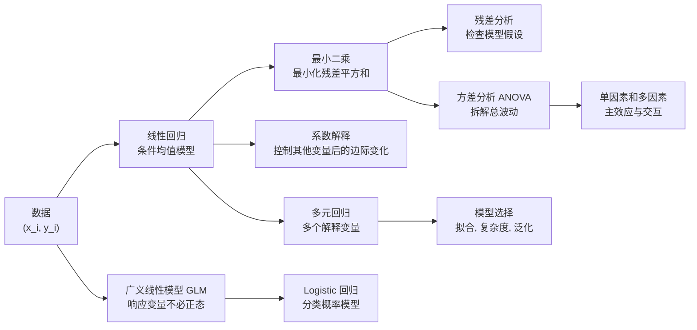
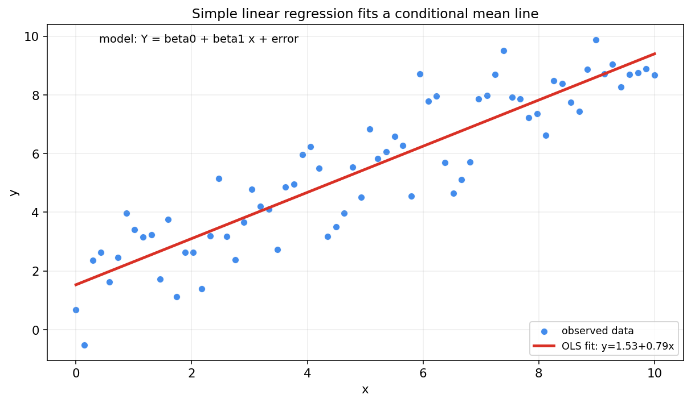
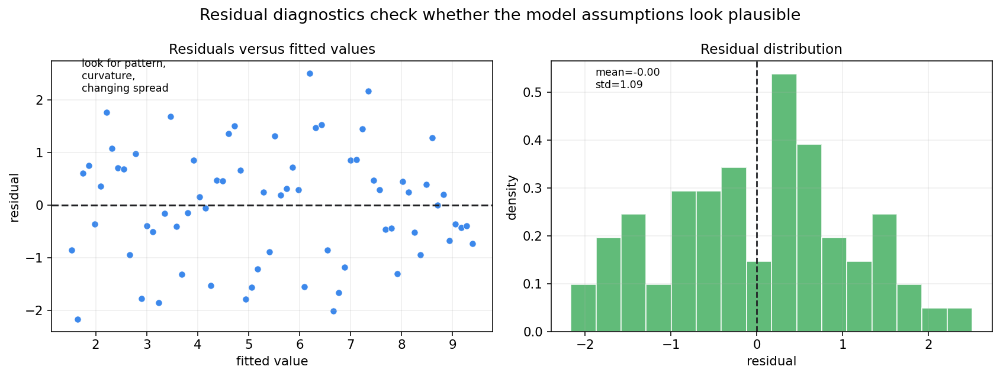
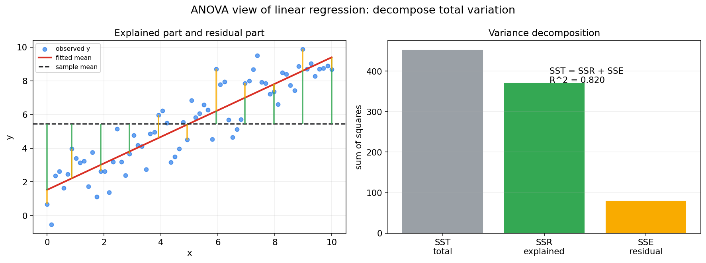
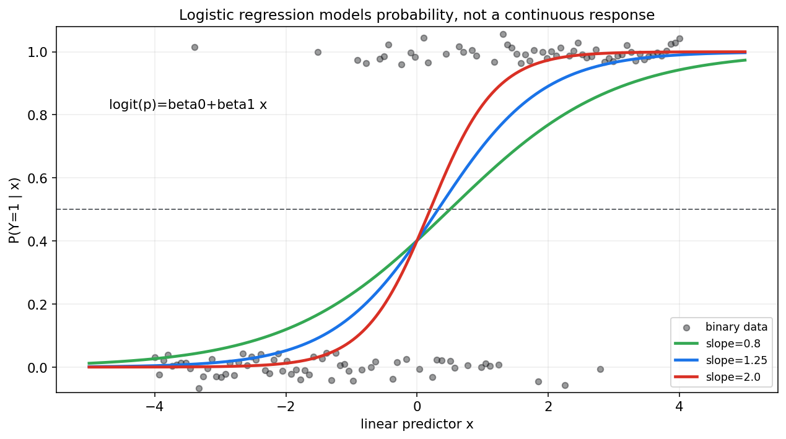

# 数理统计第十章教程: 回归, 方差分析与广义线性模型初步

> 前面三章已经建立了数理统计的基本推断语言:
>
> - 第七章: 样本, 统计量与抽样分布
> - 第八章: 估计与置信区间
> - 第九章: 假设检验与 p 值
>
> 第十章把这些工具放进更真实的建模问题里:
>
> 1. 一个变量怎样随另一个变量变化?
> 2. 多个解释变量同时出现时, 怎样拆开它们的影响?
> 3. 多组均值差异能否用同一套方差分解思想理解?
> 4. 分类问题为什么不能直接用普通线性回归?
>
> 这一章是经典统计建模的主干, 也是机器学习监督学习的统计入口.

---

## 0. 先看全章主线

第十章的主线可以压成下面这张图:

一句话概括这一章:

> 回归分析是在随机波动中寻找变量关系,  
> 方差分析是在总波动中拆解来源,  
> 广义线性模型则把这套思想推广到更广的响应变量类型.

---

## 1. 回归到底在问什么

### 1.1 从相关关系到条件均值

回归问题通常从一组配对数据开始:

$$
(x_1,y_1),\dots,(x_n,y_n)
$$

我们想知道:

> 当 $x$ 变化时, $y$ 的平均水平怎样变化?

所以回归不是只画一条线, 它本质上是在建模条件分布:

$$
Y\mid X=x
$$

最常见的第一步是建模条件均值:

$$
E[Y\mid X=x]
$$

### 1.2 预测和解释是两个目标

回归有两个常见目标:

1. **预测**
   - 给定新的 $x$, 预测未来的 $y$
   - 更关心泛化误差
   - 允许使用复杂模型, 只要预测稳定

2. **解释**
   - 研究某个变量和响应变量的关系
   - 更关心系数含义, 混杂因素, 不确定性
   - 不能轻易把相关关系说成因果关系

这两个目标都重要, 但评价标准不同.

### 1.3 回归不是因果推断

普通回归可以描述关联, 但不能自动证明因果.

例如:

$$
\text{ice cream sales} \uparrow,\quad \text{drowning incidents} \uparrow
$$

这两个变量可能正相关, 但原因可能是共同受天气温度影响.

要做因果解释, 需要额外条件, 如随机实验, 自然实验, 控制混杂, 工具变量或因果图等.

---

## 2. 一元线性回归

### 2.1 模型形式

一元线性回归写作:

$$
Y_i=\beta_0+\beta_1 x_i+\varepsilon_i
$$

其中:

- $Y_i$ 是响应变量
- $x_i$ 是解释变量
- $\beta_0$ 是截距
- $\beta_1$ 是斜率
- $\varepsilon_i$ 是随机误差

常见假设是:

$$
E[\varepsilon_i\mid x_i]=0
$$

这意味着:

$$
E[Y_i\mid x_i]=\beta_0+\beta_1 x_i
$$

### 2.2 图像直觉

图中的散点不是完全落在直线上, 因为响应变量带随机误差.  
回归线描述的是平均趋势, 不是每个样本点都必须满足的确定规律.

### 2.3 截距和斜率

截距 $\beta_0$ 表示当 $x=0$ 时的条件均值:

$$
E[Y\mid X=0]=\beta_0
$$

斜率 $\beta_1$ 表示 $x$ 增加 1 个单位时, $Y$ 的条件均值变化:

$$
E[Y\mid X=x+1]-E[Y\mid X=x]=\beta_1
$$

解释斜率时要注意单位.  
如果 $x$ 是广告预算, 单位从元改成万元, 斜率数值会随之改变.

### 2.4 外推风险

回归线只在数据覆盖的 $x$ 范围内相对可信.  
如果训练数据只覆盖 $x\in[0,10]$, 用模型预测 $x=100$ 的结果就是外推.

外推通常很危险, 因为线性关系可能只在局部成立.

---

## 3. 最小二乘法

### 3.1 残差

给定参数估计 $\hat\beta_0,\hat\beta_1$, 拟合值为:

$$
\hat y_i=\hat\beta_0+\hat\beta_1 x_i
$$

残差为:

$$
e_i=y_i-\hat y_i
$$

残差是观察值和模型拟合值之间的差.

### 3.2 残差平方和

最小二乘法选择参数使残差平方和最小:

$$
\mathrm{RSS}(\beta_0,\beta_1)
=
\sum_{i=1}^{n}(y_i-\beta_0-\beta_1x_i)^2
$$

即:

$$
(\hat\beta_0,\hat\beta_1)
=
\arg\min_{\beta_0,\beta_1}
\sum_{i=1}^{n}(y_i-\beta_0-\beta_1x_i)^2
$$

### 3.3 一元回归闭式解

令:

$$
\bar x=\frac{1}{n}\sum_{i=1}^{n}x_i,\quad
\bar y=\frac{1}{n}\sum_{i=1}^{n}y_i
$$

则:

$$
\hat\beta_1=
\frac{\sum_{i=1}^{n}(x_i-\bar x)(y_i-\bar y)}
{\sum_{i=1}^{n}(x_i-\bar x)^2}
$$

$$
\hat\beta_0=\bar y-\hat\beta_1\bar x
$$

这个式子揭示了斜率和协方差的关系:

$$
\hat\beta_1=\frac{\widehat{\mathrm{Cov}}(X,Y)}{\widehat{\mathrm{Var}}(X)}
$$

### 3.4 最小二乘和极大似然

若误差满足:

$$
\varepsilon_i\overset{i.i.d.}{\sim}\mathcal{N}(0,\sigma^2)
$$

则:

$$
Y_i\mid x_i\sim \mathcal{N}(\beta_0+\beta_1x_i,\sigma^2)
$$

最大化正态似然等价于最小化:

$$
\sum_{i=1}^{n}(y_i-\beta_0-\beta_1x_i)^2
$$

所以:

> 正态误差假设下, 最小二乘估计就是极大似然估计.

这连接了第八章的似然方法和本章的回归.

---

## 4. 回归系数的推断

### 4.1 系数也是估计量

回归系数 $\hat\beta_0,\hat\beta_1$ 由样本计算得到, 所以它们也是随机变量.

因此我们同样关心:

- 标准误
- 置信区间
- t 检验
- p 值

### 4.2 斜率的假设检验

常见检验是:

$$
H_0:\beta_1=0
$$

$$
H_1:\beta_1\ne 0
$$

如果 $H_0$ 不被拒绝, 说明样本证据不足以支持线性关系.  
如果拒绝 $H_0$, 说明在模型假设下, 斜率不为 0 的证据较强.

### 4.3 t 统计量

斜率的 t 统计量形式为:

$$
t=
\frac{\hat\beta_1-0}{\mathrm{SE}(\hat\beta_1)}
$$

在经典正态误差假设下, 若 $H_0$ 成立:

$$
t\sim t_{n-2}
$$

自由度是 $n-2$, 因为一元线性回归估计了两个参数: 截距和斜率.

### 4.4 解释 p 值时要谨慎

斜率 p 值小, 只能说明在模型假设下, 斜率为 0 与数据不太相容.  
它不自动说明:

- 关系是因果的
- 效应大小很重要
- 模型形式正确
- 预测效果一定好

回归推断的语言仍然要遵守第九章的规则.

---

## 5. 残差分析

### 5.1 为什么残差分析不能省

模型假设往往不会直接写在数据表里.  
它们通常藏在残差结构中.

残差分析要问:

> 模型没有解释掉的部分, 是否还残留系统结构?

图中左侧看残差是否围绕 0 随机散开.  
右侧看残差分布是否大致对称, 是否有明显异常值.

### 5.2 常见检查点

线性回归常见诊断包括:

1. **线性性**
   - 残差图中不应出现明显曲线结构

2. **同方差性**
   - 残差波动规模不应随拟合值明显变大或变小

3. **独立性**
   - 时间序列或空间数据中残差可能相关

4. **异常值和高杠杆点**
   - 少数点可能强烈影响回归线

5. **正态性**
   - 主要影响小样本下 t 检验和区间推断的精确性

### 5.3 残差图常见形状

如果残差图呈弯曲形状, 可能说明:

- 线性形式不够
- 需要加入非线性项
- 需要变换变量

如果残差图呈漏斗形, 可能说明:

- 方差随均值变化
- 需要加权最小二乘
- 需要建模异方差

如果残差随时间成串偏正或偏负, 可能说明:

- 样本不独立
- 存在时间趋势或自相关

### 5.4 残差不是误差

误差 $\varepsilon_i$ 是理论模型中的未知随机项.  
残差 $e_i$ 是用样本拟合后计算出来的剩余.

残差可以观察, 误差不能直接观察.

---

## 6. 多元线性回归

### 6.1 模型形式

当解释变量有多个时, 模型写作:

$$
Y_i=\beta_0+\beta_1x_{i1}+\cdots+\beta_px_{ip}+\varepsilon_i
$$

矩阵形式为:

$$
\mathbf{y}=X\beta+\varepsilon
$$

其中:

- $\mathbf{y}$ 是 $n\times 1$ 响应向量
- $X$ 是 $n\times (p+1)$ 设计矩阵, 第一列通常全为 1
- $\beta$ 是系数向量

### 6.2 最小二乘矩阵解

最小化:

$$
\|\mathbf{y}-X\beta\|_2^2
$$

在 $X^TX$ 可逆时, 解为:

$$
\hat\beta=(X^TX)^{-1}X^T\mathbf{y}
$$

实际计算中通常不用显式求逆, 而使用 QR 分解, SVD 或数值线性代数求解.

### 6.3 系数解释

多元回归中, $\beta_j$ 的解释是:

> 在其他变量保持不变时, $x_j$ 增加 1 个单位, $Y$ 的条件均值变化 $\beta_j$.

这句里最关键的是:

> 其他变量保持不变.

如果变量之间高度相关, 这个解释可能很脆弱.

### 6.4 多重共线性

多重共线性指解释变量之间高度相关.  
它会导致:

- 系数估计不稳定
- 标准误变大
- 单个变量的解释变困难

但它不一定严重影响整体预测.  
预测和解释的要求在这里再次分开.

### 6.5 遗漏变量偏差

如果遗漏了同时影响 $X$ 和 $Y$ 的变量, 回归系数可能带有系统偏差.

例如估计教育年限对收入的影响时, 如果遗漏家庭背景, 地区, 能力等因素, 系数可能混入这些因素的影响.

这也是为什么普通回归不自动等于因果推断.

---

## 7. 模型拟合优度与模型选择

### 7.1 R-squared

线性回归中常用:

$$
R^2=1-\frac{\mathrm{SSE}}{\mathrm{SST}}
$$

其中:

$$
\mathrm{SST}=\sum_{i=1}^{n}(y_i-\bar y)^2
$$

$$
\mathrm{SSE}=\sum_{i=1}^{n}(y_i-\hat y_i)^2
$$

$R^2$ 表示总波动中被模型解释的比例.

### 7.2 R-squared 的限制

$R^2$ 增大不一定代表模型更好.  
加入更多变量通常不会降低训练集 $R^2$, 即使这些变量没有真实意义.

因此还要看:

- 调整 $R^2$
- AIC/BIC
- 交叉验证误差
- 残差结构
- 变量是否有可解释性
- 模型是否能在未来数据上稳定表现

### 7.3 预测模型选择

如果目标是预测, 应更重视验证集或交叉验证:

$$
\text{train error} \ne \text{test error}
$$

训练误差低可能只是过拟合.  
模型选择不能只看训练集拟合优度.

### 7.4 解释模型选择

如果目标是解释, 变量选择要基于问题结构:

- 哪些变量是混杂因素?
- 哪些变量是中介变量?
- 哪些变量不能在因果解释中随便控制?
- 系数解释的目标人群是什么?

解释型建模不能只靠自动逐步回归.

---

## 8. 方差分析 ANOVA 的基本思想

### 8.1 从总波动拆解开始

方差分析的核心思想是:

> 把响应变量的总波动拆成不同来源.

在线性回归中, 总平方和可拆为:

$$
\mathrm{SST}=\mathrm{SSR}+\mathrm{SSE}
$$

其中:

- SST: total sum of squares, 总波动
- SSR: regression sum of squares, 模型解释的波动
- SSE: error sum of squares, 残差波动

图中绿色部分表示模型解释的偏离, 黄色部分表示残差偏离.  
右侧柱状图显示了总波动如何被拆解.

### 8.2 F 检验

回归整体显著性常用 F 统计量:

$$
F=
\frac{\mathrm{SSR}/p}{\mathrm{SSE}/(n-p-1)}
$$

其中 $p$ 是解释变量个数, 不含截距.

在经典线性模型假设下, 若所有斜率都为 0:

$$
F\sim F_{p,n-p-1}
$$

这个检验问的是:

> 模型整体是否比只用均值预测更能解释波动?

### 8.3 ANOVA 和回归不是两套完全分离的东西

单因素方差分析可以看成带分类变量的线性回归.  
回归可以看成更一般的线性模型.

二者共享:

- 平方和分解
- F 检验
- 残差方差估计
- 线性模型框架

---

## 9. 单因素方差分析

### 9.1 问题形式

单因素 ANOVA 比较多个组的均值是否相同.

例如有 $k$ 组:

$$
Y_{ij}=\mu_i+\varepsilon_{ij}
$$

原假设为:

$$
H_0:\mu_1=\mu_2=\cdots=\mu_k
$$

备择假设是至少有一组均值不同.

### 9.2 组间波动和组内波动

ANOVA 比较两种波动:

1. **组间波动**
   - 各组均值彼此差多少
   - 如果组均值差异大, 说明因素可能有影响

2. **组内波动**
   - 同一组内部样本波动多大
   - 如果组内噪声大, 组间差异更难判断

F 统计量本质上是:

$$
F=\frac{\text{组间均方}}{\text{组内均方}}
$$

如果组间差异远大于组内噪声, F 值就会大.

### 9.3 拒绝原假设后怎么办

ANOVA 拒绝 $H_0$ 只说明:

> 至少有一组均值不同.

它不直接告诉你哪两组不同.  
要进一步比较, 需要事后检验或多重比较控制, 如 Tukey HSD, Bonferroni 校正等.

---

## 10. 多因素方差分析与交互作用

### 10.1 多因素问题

现实中常有多个因素同时影响响应变量.

例如学习成绩可能受:

- 教学方法
- 班级规模
- 是否有辅导

共同影响.

多因素 ANOVA 可以同时研究多个因素.

### 10.2 主效应

主效应问的是:

> 某个因素平均而言是否影响响应变量?

例如教学方法的主效应, 是在平均掉其他因素后, 比较不同教学方法的均值差异.

### 10.3 交互作用

交互作用问的是:

> 一个因素的效果是否取决于另一个因素的水平?

例如某种教学方法可能只在小班里有效, 在大班里无效.  
这就是教学方法和班级规模之间的交互作用.

### 10.4 交互项和回归

在线性模型中, 交互作用常通过乘积项表达:

$$
Y=\beta_0+\beta_1X_1+\beta_2X_2+\beta_3X_1X_2+\varepsilon
$$

如果 $\beta_3\ne 0$, 说明 $X_1$ 的效应随 $X_2$ 变化.

解释带交互项的模型时, 不要只看主效应系数.

---

## 11. Logistic 回归: 分类问题的入口

### 11.1 为什么不能直接用线性回归

分类问题中, 响应变量常是:

$$
Y\in\{0,1\}
$$

如果直接用线性回归预测 $Y$, 可能出现:

- 预测值小于 0 或大于 1
- 误差方差不恒定
- 正态误差假设不合理

更自然的目标是建模概率:

$$
p(x)=P(Y=1\mid X=x)
$$

### 11.2 Logistic 函数

Logistic 回归使用 sigmoid 函数把线性预测值压到 $(0,1)$:

$$
p(x)=\frac{1}{1+\exp[-(\beta_0+\beta_1x)]}
$$

图中曲线始终位于 0 和 1 之间, 因此可以解释为概率.

### 11.3 logit 链接函数

Logistic 回归也可写成:

$$
\log\frac{p(x)}{1-p(x)}=\beta_0+\beta_1x
$$

左侧称为 log odds 或 logit.

因此 $\beta_1$ 的解释是:

> $x$ 增加 1 个单位时, log odds 增加 $\beta_1$.

如果取指数:

$$
\exp(\beta_1)
$$

就是 odds ratio.

### 11.4 似然和交叉熵

对二分类数据:

$$
y_i\in\{0,1\}
$$

若模型预测概率为 $p_i$, Bernoulli 似然为:

$$
L(\beta)=\prod_{i=1}^{n}p_i^{y_i}(1-p_i)^{1-y_i}
$$

对数似然为:

$$
\ell(\beta)=
\sum_{i=1}^{n}
\left[
y_i\log p_i+(1-y_i)\log(1-p_i)
\right]
$$

最大化对数似然等价于最小化负对数似然:

$$
-\ell(\beta)
=
-\sum_{i=1}^{n}
\left[
y_i\log p_i+(1-y_i)\log(1-p_i)
\right]
$$

这正是二分类交叉熵.

所以:

> Logistic 回归把分类, 似然和交叉熵放在同一条线上.

---

## 12. 广义线性模型 GLM 初步

### 12.1 GLM 解决什么

普通线性回归默认响应变量是连续型, 且常配合正态误差.  
但现实里响应变量可能是:

- 二分类结果
- 计数
- 比例
- 正值连续量

广义线性模型允许响应变量来自更广的分布族, 同时保持线性预测器:

$$
\eta=X\beta
$$

### 12.2 三个组成部分

GLM 通常由三部分组成:

1. **随机成分**
   - 响应变量的分布, 如 Normal, Bernoulli, Poisson

2. **系统成分**
   - 线性预测器 $\eta=X\beta$

3. **链接函数**
   - 把均值 $\mu=E[Y\mid X]$ 和线性预测器连接起来:

$$
g(\mu)=\eta
$$

### 12.3 常见 GLM

| 响应变量 | 分布 | 链接函数 | 模型 |
| --- | --- | --- | --- |
| 连续值 | Normal | identity | 线性回归 |
| 二分类 | Bernoulli | logit | Logistic 回归 |
| 计数 | Poisson | log | Poisson 回归 |

这说明线性回归和 Logistic 回归不是孤立技巧, 而是 GLM 框架下的两个特例.

### 12.4 指数族入口

许多 GLM 使用指数族分布.  
指数族的好处是:

- 似然结构统一
- 均值和方差关系清晰
- 优化和推断有通用形式

本章只需要知道 GLM 的框架.  
指数族的更深入内容会在后续概率模型章节继续出现.

---

## 13. 线性回归, ANOVA, GLM 的统一视角

### 13.1 共同点

它们都在做同一件事:

> 用解释变量描述响应变量的系统变化, 再把未解释部分留给随机误差.

共同元素包括:

- 参数
- 估计
- 残差或偏差
- 标准误
- 置信区间
- 假设检验
- 模型诊断

### 13.2 差异点

差异主要在:

- 响应变量类型不同
- 分布假设不同
- 链接函数不同
- 损失函数或似然不同

普通线性回归适合连续响应.  
Logistic 回归适合二分类概率.  
Poisson 回归适合计数均值.

### 13.3 统计建模的基本流程

一个稳妥的建模流程可以写成:

1. 明确研究问题: 预测还是解释?
2. 明确响应变量类型
3. 选择合适的模型族
4. 拟合参数
5. 做残差或诊断检查
6. 评估不确定性
7. 检查泛化能力
8. 报告限制和假设

---

## 14. 本章主线总结

第十章可以压成几句话:

1. 一元线性回归建模 $E[Y\mid X=x]$ 的线性变化
2. 最小二乘通过最小化残差平方和估计参数
3. 正态误差假设下, 最小二乘等价于极大似然
4. 回归系数是估计量, 可以做标准误, 区间和检验
5. 残差分析用于检查模型假设是否合理
6. 多元回归中系数解释是控制其他变量后的边际变化
7. ANOVA 通过平方和分解研究波动来源
8. Logistic 回归建模分类概率, 与 Bernoulli 似然和交叉熵相连
9. GLM 把响应变量分布, 线性预测器和链接函数统一起来

这章最重要的提醒是:

> 回归不只是画线,  
> 它是一套带假设, 估计, 诊断和解释边界的统计建模框架.

---

## 15. 典型题型与实战清单

### 15.1 典型题型

1. **写出回归模型**
   - 明确响应变量
   - 明确解释变量
   - 写出误差项

2. **求一元 OLS 估计**
   - 计算 $\hat\beta_1$
   - 计算 $\hat\beta_0$

3. **解释回归系数**
   - 注意单位
   - 注意是否控制其他变量
   - 不轻易说因果

4. **判断残差图**
   - 是否有曲线结构
   - 是否异方差
   - 是否有异常点

5. **计算或解释 $R^2$**
   - 说明解释波动比例
   - 不把高 $R^2$ 当成模型正确

6. **识别 ANOVA 问题**
   - 多组均值比较
   - 组间和组内波动
   - F 检验

7. **写 Logistic 回归模型**
   - 写概率形式
   - 写 logit 形式
   - 解释 odds ratio

### 15.2 实战清单

建模前先问:

1. 目标是预测还是解释?
2. 响应变量是什么类型?
3. 解释变量是否有清晰含义?
4. 样本是否独立?
5. 是否有明显混杂因素?
6. 是否存在异常值或数据质量问题?

建模后再问:

1. 残差图是否有结构?
2. 是否存在异方差?
3. 系数是否稳定?
4. 标准误和置信区间多大?
5. 预测误差在验证集上如何?
6. 结论是否被外推到数据范围之外?
7. 是否把相关误说成因果?

---

## 16. 典型误区

### 误区 1: 把相关性说成因果性

回归系数描述的是模型中的条件关联.  
没有额外设计或假设, 它不自动表示因果效应.

### 误区 2: 只看拟合优度, 不看残差结构

高 $R^2$ 不代表模型形式正确.  
残差图可能显示非线性, 异方差或异常点.

### 误区 3: 把预测目标和解释目标混在一起

预测模型可以使用复杂特征提高泛化.  
解释模型则更强调变量含义, 混杂控制和推断语义.

### 误区 4: 忽略多重共线性

解释变量高度相关时, 单个系数可能非常不稳定.  
这时不要过度解读某个系数的符号和 p 值.

### 误区 5: 把 Logistic 回归当成普通线性回归

Logistic 回归建模的是概率和 log odds, 不是直接拟合连续响应.  
它的损失来自 Bernoulli 负对数似然, 也就是二分类交叉熵.

### 误区 6: 忽略分类变量编码

分类变量进入回归通常需要哑变量编码.  
基准组不同, 系数解释也会改变.

### 误区 7: 拒绝 ANOVA 后直接说所有组都不同

ANOVA 显著只说明至少有一组均值不同.  
具体哪几组不同, 需要进一步比较并控制多重比较风险.

---

## 17. 和前后章节的连接点

### 17.1 和第八章的连接

回归系数估计, 标准误和置信区间都来自第八章的估计思想.  
最小二乘和极大似然也在本章正式连接起来.

### 17.2 和第九章的连接

回归中的 t 检验, F 检验, p 值和模型整体显著性都直接使用第九章的假设检验语言.

### 17.3 和第十一章的连接

如果残差严重非正态, 有离群点或模型假设不可靠, 就需要非参数, 重抽样或稳健方法.  
这正是第十一章要处理的问题.

### 17.4 和统计学习章节的连接

线性回归和 Logistic 回归会在统计学习中再次出现:

- 经验风险最小化
- 正则化
- 泛化误差
- 分类交叉熵
- 模型选择

所以本章是传统统计建模和机器学习之间的桥.

---

## 18. 本章收尾

第十章把前面估计和检验的工具放入模型中.  
从现在开始, 统计问题不再只是一个均值或一个比例, 而是变量之间的系统关系.

但建模越强大, 越要谨慎:

> 模型给出的是有条件的简化描述,  
> 不是对现实机制的自动证明.

下一章会继续处理一个现实问题:  
当参数模型假设不可靠, 或数据含有异常值和厚尾结构时, 我们怎样用非参数, 重抽样和稳健方法继续推断.
