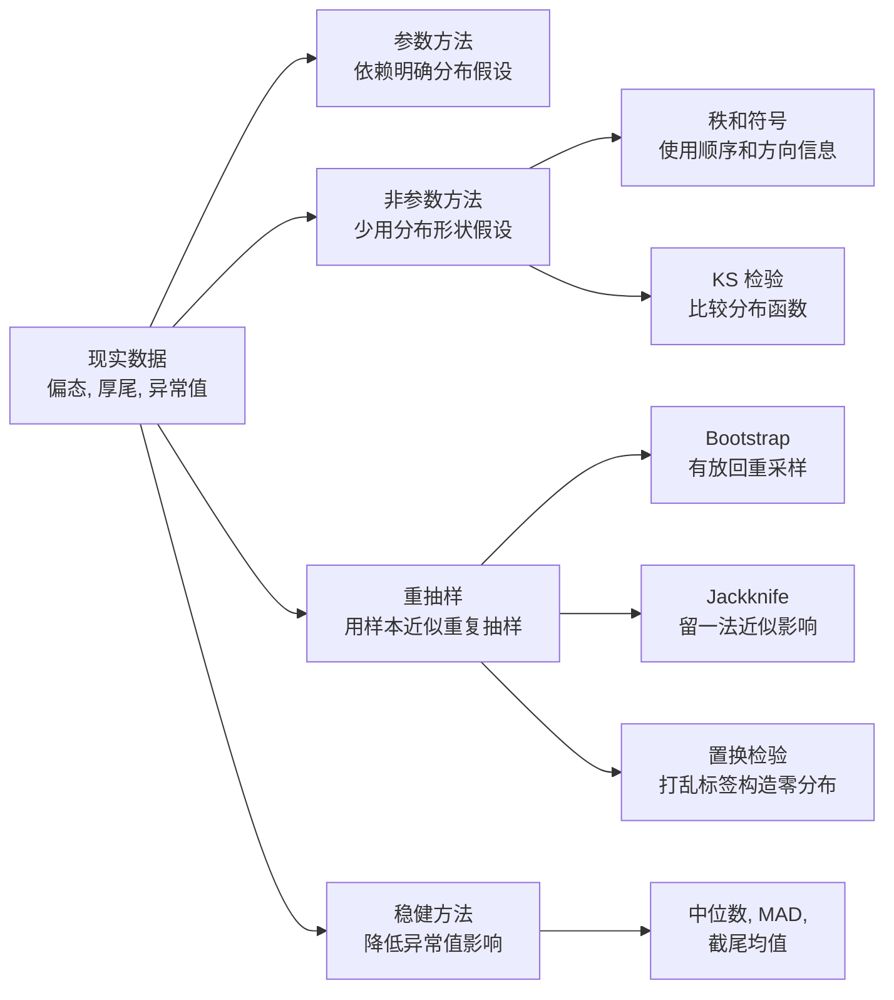
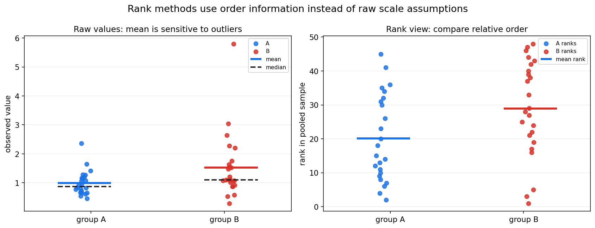
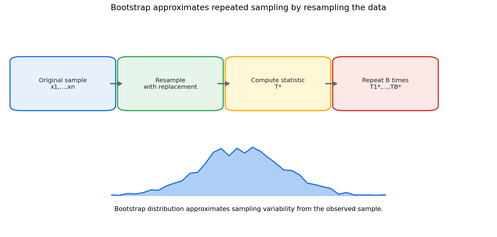
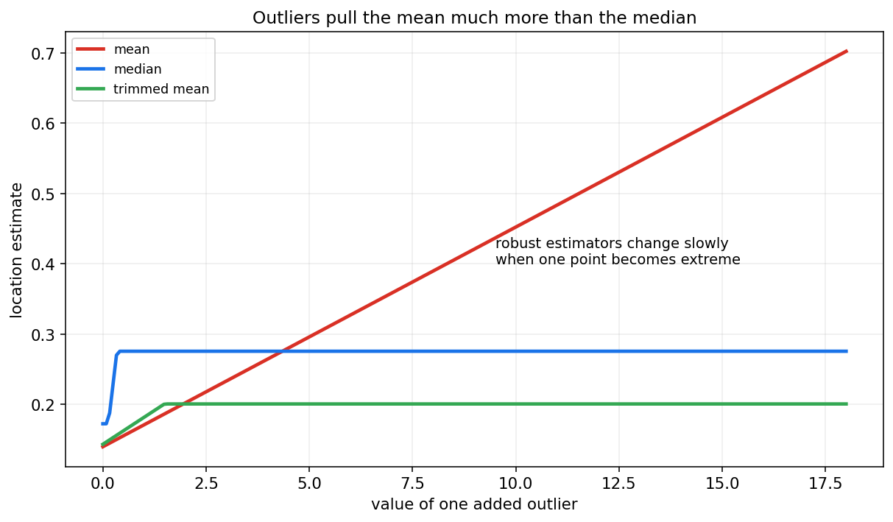
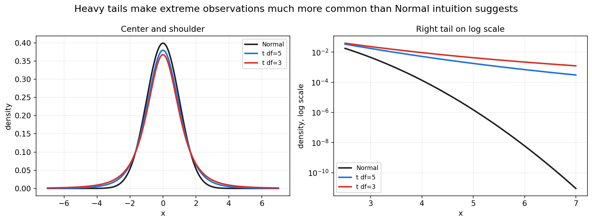

# 数理统计第十一章教程: 非参数统计, 重抽样与稳健方法

> 前面几章的很多结论依赖漂亮的模型假设:
>
> - 样本独立同分布
> - 正态总体或大样本正态近似
> - 方差稳定
> - 少数异常值不会强烈影响结果
>
> 现实数据却经常不这么配合:
>
> 1. 分布明显偏态或厚尾.
> 2. 样本量不大, 正态近似不稳.
> 3. 数据里有异常值.
> 4. 只关心顺序, 不相信原始尺度.
> 5. 很难写出可信的参数模型.
>
> 这一章介绍的非参数统计, 重抽样和稳健方法, 不是放弃统计推断, 而是在假设不够可靠时换一套更稳妥的工具.

---

## 0. 先看全章主线

第十一章的主线可以压成下面这张图:

一句话概括这一章:

> 非参数和稳健方法不是完全没有假设,  
> 而是在参数模型不够可信时,  
> 用更少的结构假设换取更稳妥的推断.

---

## 1. 为什么需要非参数和稳健方法

### 1.1 参数方法的优势

参数方法假设总体属于某个有限参数族.  
例如:

$$
X\sim \mathcal{N}(\mu,\sigma^2)
$$

或:

$$
X\sim \mathrm{Exponential}(\lambda)
$$

如果假设合理, 参数方法通常很高效:

- 公式清楚
- 推断精确
- 样本量需求较低
- 解释简洁

### 1.2 参数方法的风险

如果假设明显错了, 参数方法可能给出看似精确但实际不可靠的结论.

常见问题包括:

- 正态假设不成立
- 方差不等
- 离群点强烈影响均值和方差
- 分布厚尾导致极端值更常见
- 样本量太小, 大样本近似不稳

这时我们需要另一类方法.

### 1.3 非参数不等于没有假设

非参数方法并不是完全没有假设.  
它只是减少对具体分布形状的依赖.

例如秩和检验不要求正态分布, 但仍然需要考虑:

- 样本是否独立
- 两组观测是否可比较
- 数据是否至少有顺序意义
- 检验目标到底是位置差异还是更广泛的分布差异

所以更准确的说法是:

> 非参数方法少用参数分布假设, 但不是无条件可靠.

---

## 2. 秩的思想

### 2.1 什么是秩

把一组观测从小到大排序, 每个观测的位置编号称为秩.

例如样本:

$$
3.2,\ 1.5,\ 4.1,\ 2.0
$$

从小到大是:

$$
1.5,\ 2.0,\ 3.2,\ 4.1
$$

对应秩为:

$$
2,\ 1,\ 4,\ 3
$$

原始数值被转换成相对顺序.

### 2.2 为什么用秩

秩方法关心的是谁更大, 谁更小, 而不是具体差多少.

这有两个好处:

- 对极端值更不敏感
- 不需要强假设原始数值服从正态分布

图中左侧看原始数值, 均值会被极端点拉动.  
右侧把数值转换成秩, 重点变成两组在合并排序中的相对位置.

### 2.3 信息损失

秩方法也有代价.  
把原始数值变成秩以后, 数值间距信息会被丢掉.

例如:

$$
1,2,3
$$

和:

$$
1,2,100
$$

秩都是:

$$
1,2,3
$$

但原始尺度差异完全不同.

所以秩方法适合在原始尺度不可靠, 或异常值风险很高时使用.

---

## 3. 符号检验

### 3.1 问题形式

符号检验常用于配对数据或中位数问题.

例如同一批用户在改版前后各有一个指标:

$$
(X_i,Y_i),\quad i=1,\dots,n
$$

构造差值:

$$
D_i=Y_i-X_i
$$

如果只关心方向, 就记录:

$$
\mathrm{sign}(D_i)
$$

### 3.2 原假设

检验中位数差异是否为 0:

$$
H_0:\mathrm{median}(D)=0
$$

如果 $H_0$ 成立, 正差和负差大致一样可能.

忽略 $D_i=0$ 的样本后, 正号个数:

$$
S=\#\{i:D_i>0\}
$$

在 $H_0$ 下近似服从:

$$
S\sim \mathrm{Binomial}(n,0.5)
$$

### 3.3 优点和限制

优点:

- 非常稳健
- 只需要方向信息
- 对极端差值不敏感

限制:

- 丢掉差值大小
- 功效可能较低
- 只适合问题确实可以用方向表达时

---

## 4. Wilcoxon 检验初步

### 4.1 Wilcoxon 符号秩检验

符号检验只看方向.  
Wilcoxon 符号秩检验进一步使用差值绝对值的秩.

对配对差值:

$$
D_i=Y_i-X_i
$$

步骤大致是:

1. 去掉 $D_i=0$ 的样本.
2. 对 $|D_i|$ 排秩.
3. 给秩加上原差值的正负号.
4. 比较正秩和负秩是否平衡.

它比符号检验利用了更多信息, 但仍然比 t 检验少依赖正态假设.

### 4.2 Wilcoxon 秩和检验

两独立样本的秩和检验也称 Mann-Whitney U 检验.

它把两组样本合并排序, 比较两组秩和是否明显不同.

直觉是:

> 如果两组来自同一分布, 它们在合并排序中应该交错出现.

如果一组整体偏大, 这一组的秩和会偏大.

### 4.3 它检验的不是简单均值差

秩和检验常被粗略说成比较中位数, 但严格解释要小心.

如果两组分布形状相同, 只存在位置平移, 它可以理解为比较位置差异.  
如果两组分布形状不同, 它更像是在比较随机优势:

$$
P(X<Y)
$$

因此结论语言要和假设条件匹配.

---

## 5. Kolmogorov-Smirnov 检验初步

### 5.1 从经验分布函数出发

第七章定义过经验分布函数:

$$
F_n(x)=\frac{1}{n}\sum_{i=1}^{n}\mathbf{1}\{X_i\le x\}
$$

KS 检验直接比较分布函数之间的距离.

### 5.2 单样本 KS 检验

单样本 KS 检验比较经验分布 $F_n$ 和某个理论分布 $F_0$:

$$
D_n=\sup_x |F_n(x)-F_0(x)|
$$

如果最大差距太大, 就拒绝样本来自 $F_0$ 的假设.

### 5.3 两样本 KS 检验

两样本 KS 检验比较两个经验分布:

$$
D_{n,m}=\sup_x |F_n(x)-G_m(x)|
$$

它关心的是两个总体分布是否相同, 不只是均值或中位数.

### 5.4 使用注意

KS 检验对分布整体差异敏感, 但不同位置的敏感度并不完全相同.  
如果重点是尾部差异, 可能需要专门的尾部检验或图形诊断.

---

## 6. Bootstrap

### 6.1 核心想法

Bootstrap 的核心思想是:

> 把手里的样本当作总体的近似, 再从样本中有放回地重采样.

给定样本:

$$
x_1,\dots,x_n
$$

每次有放回抽取 $n$ 个值, 得到一份 bootstrap 样本:

$$
x_1^*,\dots,x_n^*
$$

然后计算统计量:

$$
T^*=T(x_1^*,\dots,x_n^*)
$$

重复很多次后, $T^*$ 的分布用来近似 $T$ 的抽样分布.

### 6.2 Bootstrap 能估什么

Bootstrap 常用于估计:

- 标准误
- 偏差
- 置信区间
- 复杂统计量的抽样分布

尤其当统计量的理论标准误难推导时, Bootstrap 很有用.

### 6.3 百分位区间

假设我们重复 $B$ 次得到:

$$
T_1^*,\dots,T_B^*
$$

一个简单的 $95%$ bootstrap 百分位区间是:

$$
[q_{0.025},q_{0.975}]
$$

其中 $q_{0.025}$ 和 $q_{0.975}$ 是 bootstrap 统计量的对应分位数.

### 6.4 Bootstrap 的限制

Bootstrap 不是魔法.  
它依赖一个关键前提:

> 原始样本能代表总体.

如果样本本身严重有偏, Bootstrap 会围绕这个有偏样本重复采样, 不能自动修复偏差.

另外, 对极端尾部分位数, 强依赖数据, 小样本最大值等问题, 普通 bootstrap 可能表现不稳.

---

## 7. Jackknife 初步

### 7.1 留一法思想

Jackknife 每次删掉一个观测, 用剩余 $n-1$ 个样本重新计算统计量.

第 $i$ 个 jackknife 样本为:

$$
x_{(i)}=(x_1,\dots,x_{i-1},x_{i+1},\dots,x_n)
$$

对应统计量:

$$
T_{(i)}=T(x_{(i)})
$$

### 7.2 用途

Jackknife 常用于:

- 估计标准误
- 估计偏差
- 分析单个样本点对统计量的影响

如果删掉某个点后统计量变化很大, 这个点可能是高影响点.

### 7.3 和 Bootstrap 的差别

Bootstrap 是有放回重采样, 每次抽出同样大小的样本.  
Jackknife 是系统地每次删掉一个点.

粗略比较:

- Bootstrap 更灵活, 适用统计量更广
- Jackknife 更便宜, 更适合影响分析
- 对非光滑统计量, 如中位数, Jackknife 可能不如 Bootstrap 稳

---

## 8. 置换检验

### 8.1 核心想法

置换检验用于检验两组差异时非常直观.

假设原假设是:

$$
H_0:\text{两组来自同一分布}
$$

如果 $H_0$ 成立, 组标签 A 和 B 是可以交换的.

于是我们可以:

1. 合并两组数据.
2. 随机打乱组标签.
3. 每次重新计算组间差异统计量.
4. 用这些置换统计量构造零假设分布.
5. 看真实组间差异是否足够极端.

### 8.2 例子: 均值差

设观察到两组均值差:

$$
T_{\mathrm{obs}}=\bar X-\bar Y
$$

置换后得到:

$$
T_1^{\pi},\dots,T_B^{\pi}
$$

双侧 p 值可以近似为:

$$
p\approx
\frac{1+\#\{|T_b^{\pi}|\ge |T_{\mathrm{obs}}|\}}
{B+1}
$$

分子和分母加 1 是常见的有限样本修正, 可避免 p 值为 0.

### 8.3 置换检验的关键假设

置换检验依赖可交换性.  
也就是说, 在原假设下, 标签打乱后数据的联合分布不变.

如果样本有时间依赖, 分层结构或配对结构, 不能随意全局打乱标签.  
需要在合理的块内或配对结构内置换.

---

## 9. 稳健位置估计

### 9.1 均值的脆弱性

均值使用所有数值大小, 所以对极端值敏感.

例如:

$$
1,2,3,4,100
$$

均值是:

$$
22
$$

但大多数样本集中在 1 到 4 附近.

### 9.2 中位数

中位数是排序后中间位置的值.  
它对少数极端值更稳健.

中位数的 breakdown point 可达 $50%$.  
直觉是:

> 只要不到一半的样本被污染, 中位数仍不会被无限拉走.

### 9.3 截尾均值

截尾均值先去掉两端一定比例的样本, 再求均值.

例如 10% 截尾均值:

1. 排序.
2. 去掉最小的 10% 和最大的 10%.
3. 对中间部分求均值.

它在均值和中位数之间折中:

- 比均值更稳健
- 比中位数保留更多数值信息

图中随着一个异常值越来越大, 均值持续被拉动, 中位数变化很慢, 截尾均值介于二者之间.

---

## 10. 稳健尺度估计

### 10.1 标准差的问题

标准差使用平方偏差:

$$
S^2=\frac{1}{n-1}\sum_{i=1}^{n}(X_i-\bar X)^2
$$

平方会放大极端值影响.  
如果数据有厚尾或异常点, 标准差可能被强烈拉大.

### 10.2 MAD

MAD, median absolute deviation, 定义为:

$$
\mathrm{MAD}=\mathrm{median}(|X_i-\mathrm{median}(X)|)
$$

在正态分布下, 常用尺度校正:

$$
1.4826\times \mathrm{MAD}
$$

使其可与标准差大致对齐.

### 10.3 IQR

四分位距定义为:

$$
\mathrm{IQR}=Q_3-Q_1
$$

它只依赖中间 50% 的数据, 对极端尾部更稳健.

常见箱线图中的异常值规则:

$$
Q_1-1.5\mathrm{IQR},\quad Q_3+1.5\mathrm{IQR}
$$

这只是启发式规则, 不是必须删除数据的命令.

---

## 11. 厚尾数据

### 11.1 什么是厚尾

厚尾分布指极端值出现概率比正态分布更高.

图中右侧用对数纵轴放大尾部差异.  
t 分布在尾部明显高于正态分布, 说明极端值更常见.

### 11.2 为什么厚尾麻烦

厚尾会带来:

- 样本均值收敛更慢
- 样本方差波动更大
- 正态近似需要更大样本
- 极端值对模型和检验影响更强

在金融损失, 网络流量, 用户消费金额, 文件大小等场景中, 厚尾很常见.

### 11.3 应对思路

常见应对方式:

- 使用中位数, 分位数, 截尾均值
- 对正值数据取对数
- 使用稳健标准误
- 使用分位数回归
- 对尾部单独建模
- 报告不止均值, 同时报分位数

---

## 12. 异常值处理

### 12.1 异常值不是自动错误

异常值可能来自:

- 录入错误
- 传感器故障
- 埋点重复
- 真实罕见事件
- 不同子群体混在一起

不能看到异常值就直接删除.

### 12.2 处理前先分类

处理异常值前先问:

1. 是否是数据错误?
2. 是否来自目标总体?
3. 是否由业务规则解释?
4. 是否只影响少数统计量?
5. 删除后结论是否变化?

如果是明确数据错误, 可以修正或排除并记录规则.  
如果是真实极端事件, 删除它可能会扭曲目标总体.

### 12.3 敏感性分析

稳妥做法是报告敏感性分析:

- 包含异常值的结果
- 排除明确错误后的结果
- 使用稳健统计量后的结果

如果结论只在某一种处理方式下成立, 就要谨慎解释.

---

## 13. 参数方法, 非参数方法和稳健方法怎么选

### 13.1 参数方法适合什么时候

参数方法适合:

- 分布假设有理论或经验支持
- 样本量不大但模型可靠
- 需要高效估计
- 需要明确解释参数

例如正态误差线性回归在许多工程场景中是有用近似.

### 13.2 非参数方法适合什么时候

非参数方法适合:

- 不想强依赖正态分布
- 数据只有顺序意义
- 样本量中等, 可用秩信息
- 目标是比较分布或位置差异

例如评分等级, 偏态响应, 小样本两组比较.

### 13.3 重抽样适合什么时候

重抽样适合:

- 统计量标准误难推导
- 想估计复杂指标的不确定性
- 样本量足以代表总体
- 希望用模拟方式理解抽样波动

Bootstrap 常用于中位数, 分位数, AUC, 自定义业务指标的区间估计.

### 13.4 稳健方法适合什么时候

稳健方法适合:

- 异常值不可避免
- 分布厚尾
- 均值和标准差不稳定
- 希望结论不被少数点主导

稳健不是保守的同义词.  
它是在承认数据不完美的前提下, 让结论更可追溯.

---

## 14. 本章主线总结

第十一章可以压成几句话:

1. 参数方法高效, 但依赖分布假设.
2. 非参数方法减少分布形状假设, 常使用秩, 符号和经验分布.
3. 符号检验只用方向信息, 很稳健但功效较低.
4. Wilcoxon 方法使用秩信息, 适合不想强依赖正态假设的比较.
5. KS 检验直接比较经验分布函数.
6. Bootstrap 用有放回重采样近似抽样分布.
7. Jackknife 通过留一法估计标准误和样本影响.
8. 置换检验通过打乱标签构造零假设分布.
9. 中位数, MAD, IQR, 截尾均值能降低异常值影响.
10. 厚尾数据需要比正态直觉更谨慎的推断.

本章最重要的提醒是:

> 少一点分布假设不等于没有假设,  
> 稳健方法也必须和数据来源, 抽样机制, 研究目标一起解释.

---

## 15. 典型题型与实战清单

### 15.1 典型题型

1. **判断是否适合参数 t 检验**
   - 看样本量
   - 看偏态和异常值
   - 看独立性和方差结构

2. **选择秩检验**
   - 配对数据可考虑 Wilcoxon 符号秩检验
   - 两独立样本可考虑秩和检验

3. **写 Bootstrap 流程**
   - 有放回抽样
   - 每次计算统计量
   - 用重复统计量估标准误或区间

4. **写置换检验流程**
   - 明确可交换性
   - 打乱标签
   - 构造零分布
   - 计算极端比例

5. **比较均值和中位数**
   - 说明异常值对均值影响更强
   - 说明中位数更稳健但可能效率较低

6. **识别厚尾风险**
   - 极端值频繁
   - 样本方差不稳定
   - 均值区间很宽或不稳定

### 15.2 实战清单

分析真实数据时, 可以按下面顺序检查:

1. 数据是否有异常值?
2. 分布是否明显偏态或厚尾?
3. 目标统计量是均值, 中位数, 分位数还是比例?
4. 参数假设是否有现实依据?
5. 样本量是否支持大样本近似?
6. 是否可用 Bootstrap 估计不确定性?
7. 是否存在配对, 分层或时间结构?
8. 置换检验是否满足可交换性?
9. 稳健结果和普通结果是否一致?
10. 异常值处理规则是否提前确定并记录?

---

## 16. 典型误区

### 误区 1: 以为非参数方法没有假设

非参数方法仍然需要样本独立性, 可比较性和合理抽样机制.  
只是它们通常少依赖具体分布形状.

### 误区 2: Bootstrap 能修复样本偏差

Bootstrap 只能围绕已有样本重采样.  
如果原始样本不代表目标总体, Bootstrap 不能自动变出代表性.

### 误区 3: 异常值一律删除

异常值可能是真实重要事件.  
删除前必须说明原因, 规则和对结论的影响.

### 误区 4: 秩检验总是在比较中位数

秩和检验在分布形状相同且只存在位置平移时可解释为位置差异.  
分布形状不同的时候, 解释要更谨慎.

### 误区 5: 用重抽样替代研究设计

如果数据收集过程有偏, 标签不可交换, 或样本不独立, 重抽样方法也会失效.

### 误区 6: 只看均值不看分布

厚尾和偏态数据中, 均值可能不足以代表典型样本.  
应同时看中位数, 分位数, 尾部风险和图形诊断.

---

## 17. 和前后章节的连接点

### 17.1 和第七章的连接

经验分布函数和顺序统计量是非参数统计的重要基础.  
第七章的抽样分布思想也贯穿 Bootstrap 和置换检验.

### 17.2 和第八章的连接

Bootstrap 可以为复杂估计量提供标准误和置信区间.  
稳健估计则是在估计量设计上降低异常值影响.

### 17.3 和第九章的连接

置换检验和秩检验都是假设检验.  
它们同样需要明确原假设, p 值解释和错误控制.

### 17.4 和第十章的连接

残差异常, 厚尾和异方差会影响回归推断.  
稳健标准误, 分位数回归, Bootstrap 区间等方法都能作为补充.

### 17.5 和后续贝叶斯与统计学习的连接

贝叶斯模型和机器学习模型也会遇到异常值和厚尾问题.  
稳健损失, 重尾噪声, 重采样评估, 都会继续使用本章思想.

---

## 18. 本章收尾

现实数据很少完全满足教科书假设.  
第十一章的价值是提醒我们:

> 当漂亮模型不够可靠时,  
> 仍然可以通过秩, 重抽样和稳健估计继续做有边界的推断.

下一章开始进入贝叶斯统计.  
那里会换一种视角: 不只把参数看成固定未知量, 还可以用概率分布表达我们对参数的不确定性.
