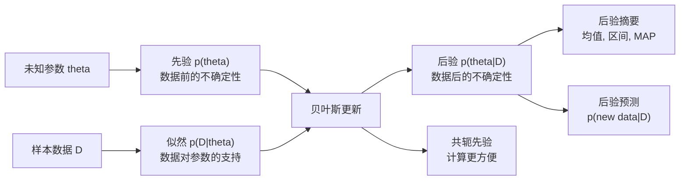
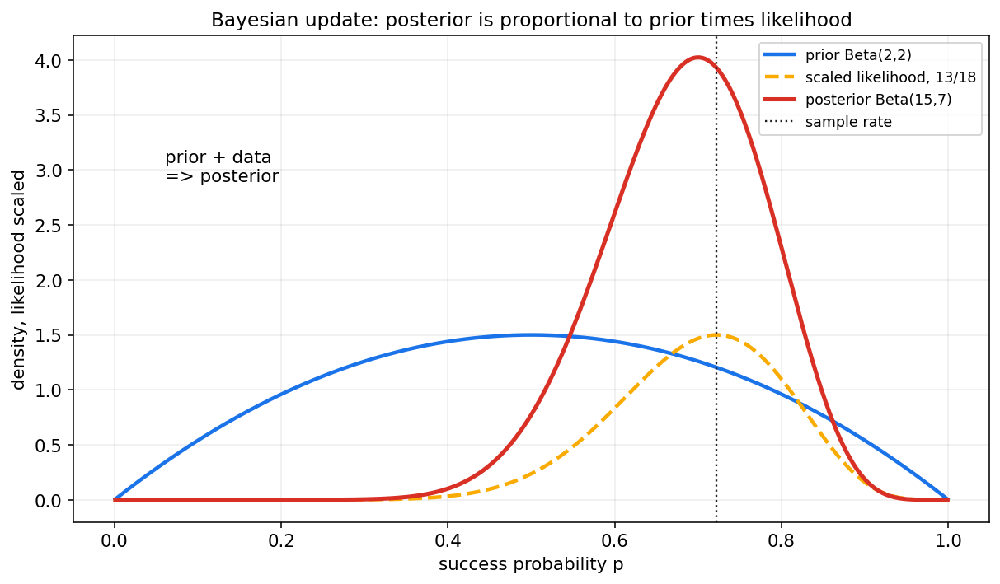
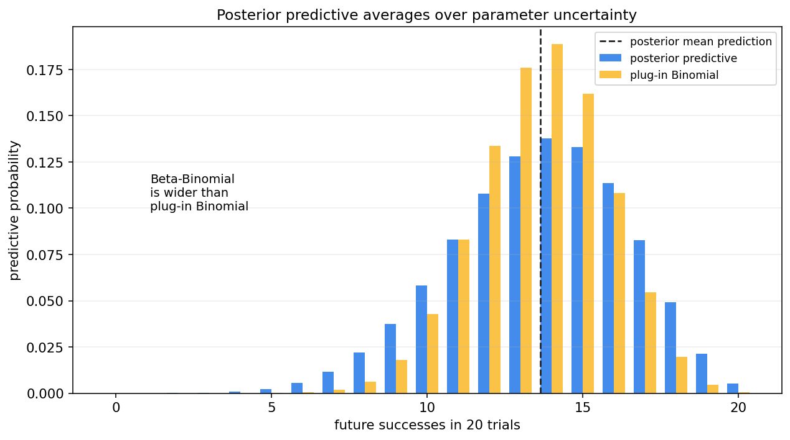
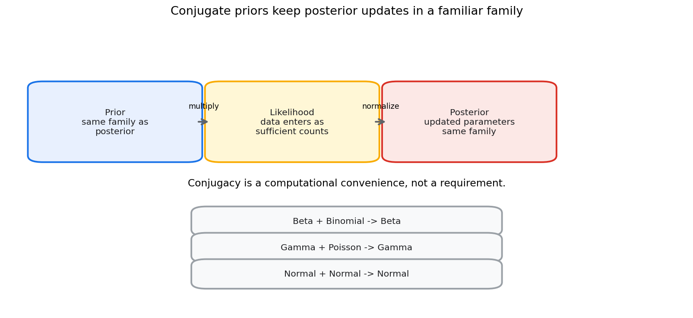
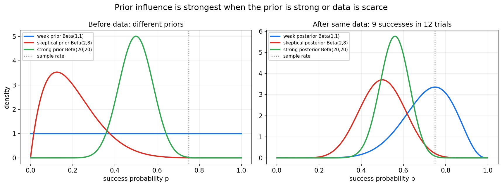

# 贝叶斯统计第十二章教程: 贝叶斯视角, 先验, 后验与共轭族

> 前面几章主要采用频率学派视角:
>
> 参数是固定但未知的, 样本是随机的.
>
> 贝叶斯统计换一个角度:
>
> 参数虽然在现实中有一个真实值, 但我们对它不知道,  
> 所以可以用概率分布表达这种认知不确定性.
>
> 这一章要解决四个问题:
>
> 1. 贝叶斯视角和频率学视角到底差在哪里?
> 2. 先验, 似然, 后验分别在模型中扮演什么角色?
> 3. 共轭先验为什么常见, 它是不是唯一选择?
> 4. 后验预测分布为什么比只报一个参数点估计更接近真实预测?

---

## 0. 先看全章主线

第十二章的主线可以压成下面这张图:

一句话概括这一章:

> 贝叶斯统计的核心不是某个单独公式,  
> 而是把认知不确定性显式写进模型,  
> 再让数据一步步更新它.

---

## 1. 贝叶斯视角与频率学视角

### 1.1 频率学派的基本视角

频率学派通常把参数看成固定但未知的常数:

$$
\theta \text{ fixed but unknown}
$$

样本是随机的:

$$
X_1,\dots,X_n\sim P_\theta
$$

因此它研究的是:

- 估计量在重复抽样中怎样波动
- 置信区间构造方法的长期覆盖率
- 检验规则的第一类错误和第二类错误

### 1.2 贝叶斯的基本视角

贝叶斯统计把参数的不确定性也写成概率分布:

$$
\theta\sim p(\theta)
$$

观察数据后, 用贝叶斯公式更新为:

$$
p(\theta\mid D)
$$

这里的概率表达的是:

> 在已有信息下, 我们对参数取值的不确定性.

### 1.3 两种视角不是谁完全替代谁

频率学派强调长期重复抽样性质.  
贝叶斯强调条件于当前数据和先验信息后的不确定性.

实际工作中, 两种视角都常用:

- 用频率学派方法做 A/B 测试和错误控制
- 用贝叶斯方法表达先验知识和后验预测
- 用模拟检查贝叶斯方法的频率学性质

重要的是知道自己在说哪一种概率.

---

## 2. 参数为什么可以被视作随机变量

### 2.1 不是说真实世界在反复抽参数

贝叶斯里说参数有分布, 不一定意味着真实世界每次都重新抽一个参数.  
更准确地说:

> 参数分布表达的是我们对参数的认知状态.

例如一个硬币的真实正面概率可能固定为某个值 $p$.  
但在抛之前, 我们不知道它是多少, 可以用一个分布表达这种不知道.

### 2.2 数据会改变认知状态

抛硬币之前, 我们可能认为:

$$
p \sim \mathrm{Beta}(2,2)
$$

看到 18 次中有 13 次正面后, 我们对 $p$ 的判断应该向较大的值移动.

这就是贝叶斯更新.

图中蓝线是先验, 黄线是缩放后的似然, 红线是后验.  
后验同时受到先验和数据影响.

---

## 3. 先验, 似然, 后验

### 3.1 贝叶斯公式

贝叶斯公式写作:

$$
p(\theta\mid D)=\frac{p(D\mid \theta)p(\theta)}{p(D)}
$$

其中:

- $p(\theta)$ 是先验
- $p(D\mid \theta)$ 是似然
- $p(\theta\mid D)$ 是后验
- $p(D)$ 是证据或边际似然

在参数推断中常写成比例式:

$$
p(\theta\mid D)\propto p(D\mid \theta)p(\theta)
$$

因为 $p(D)$ 对 $\theta$ 来说只是归一化常数.

### 3.2 先验 prior

先验描述看到当前数据之前对参数的认知.

先验可以来自:

- 过往实验
- 领域知识
- 物理约束
- 保守假设
- 弱信息设定

先验不是乱猜.  
好的先验应当可解释, 可检查, 并尽量做敏感性分析.

### 3.3 似然 likelihood

似然描述在给定参数下, 观察到当前数据的支持程度:

$$
p(D\mid \theta)
$$

它和第八章极大似然中的似然是同一个对象.  
区别在于贝叶斯会把似然和先验相乘, 得到整条后验分布.

### 3.4 后验 posterior

后验是看到数据后的参数不确定性:

$$
p(\theta\mid D)
$$

后验可以用来计算:

- 后验均值
- 后验中位数
- MAP
- 可信区间
- 后验预测分布

它不是一个单点答案, 而是一整条分布.

---

## 4. 后验预测分布

### 4.1 为什么不只预测参数

很多实际问题关心的是未来数据, 不是参数本身.

例如:

> 已经观察到 18 次试验 13 次成功, 下一批 20 次大概会成功几次?

如果只用一个点估计 $\hat p$ 做预测, 会忽略参数不确定性.  
贝叶斯的后验预测会把参数不确定性积分掉:

$$
p(\tilde y\mid D)=\int p(\tilde y\mid \theta)p(\theta\mid D)d\theta
$$

这句话非常关键:

> 预测时不是只代入一个参数, 而是对所有可能参数按后验权重平均.

### 4.2 后验预测图

图中蓝色是 Beta-Binomial 后验预测分布.  
黄色是把后验均值当作固定参数的 plug-in Binomial 分布.

后验预测通常更宽, 因为它额外考虑了参数不确定性.

### 4.3 和机器学习预测的关系

机器学习中也常问:

> 对新样本, 模型预测的不确定性有多大?

贝叶斯后验预测直接回答这个问题.  
它把参数不确定性和观测噪声一起纳入预测.

---

## 5. 共轭先验

### 5.1 什么是共轭

如果先验和后验属于同一分布族, 就称这个先验是该似然的共轭先验.

例如:

$$
\mathrm{Beta} + \mathrm{Binomial} \rightarrow \mathrm{Beta}
$$

观察数据前是 Beta 分布, 观察数据后仍然是 Beta 分布, 只是参数更新了.

### 5.2 共轭的价值

共轭先验的价值是计算方便:

- 更新公式简单
- 后验形式清楚
- 容易做教学和手算
- 容易解释先验参数的含义

但共轭不是必须的.  
真实问题中, 更重要的是模型是否表达了合理的不确定性.

### 5.3 共轭不是唯一合理选择

如果非共轭先验更符合领域知识, 完全可以使用.  
只是后验可能没有闭式形式, 需要数值积分, MCMC 或变分推断.

这会在第十三章继续展开.

---

## 6. Beta-Binomial 模型

### 6.1 模型设定

设成功概率为 $p$, 数据为 $n$ 次试验中的成功次数 $x$:

$$
X\mid p\sim \mathrm{Binomial}(n,p)
$$

选择先验:

$$
p\sim \mathrm{Beta}(\alpha,\beta)
$$

Beta 密度为:

$$
\pi(p)\propto p^{\alpha-1}(1-p)^{\beta-1}
$$

似然为:

$$
L(p)\propto p^x(1-p)^{n-x}
$$

所以后验:

$$
\pi(p\mid x)\propto p^{\alpha+x-1}(1-p)^{\beta+n-x-1}
$$

即:

$$
p\mid x\sim \mathrm{Beta}(\alpha+x,\beta+n-x)
$$

### 6.2 伪计数直觉

Beta 先验参数可以理解成伪计数:

- $\alpha-1$ 像先验成功次数
- $\beta-1$ 像先验失败次数

也常把 $\alpha+\beta$ 看作先验强度.

例如:

$$
\mathrm{Beta}(1,1)
$$

是均匀先验.  

$$
\mathrm{Beta}(20,20)
$$

表达很强的先验, 认为 $p$ 接近 0.5.

### 6.3 不同先验的影响

同一份数据下, 弱先验会更快跟随数据, 强先验会让后验移动得更慢.

因此报告贝叶斯结果时, 最好说明:

- 使用了什么先验
- 先验强度多大
- 换合理先验后结论是否稳定

---

## 7. Gamma-Poisson 模型

### 7.1 计数问题

Poisson 分布常用于单位时间或单位空间内的计数:

$$
X_i\mid \lambda\sim \mathrm{Poisson}(\lambda)
$$

例如:

- 每小时请求数
- 每天故障数
- 每页错别字数

### 7.2 Gamma 先验

Poisson 速率 $\lambda>0$, 因此常用 Gamma 先验:

$$
\lambda\sim \mathrm{Gamma}(\alpha,\beta)
$$

这里采用 rate 参数化:

$$
\pi(\lambda)\propto \lambda^{\alpha-1}e^{-\beta\lambda}
$$

若观察到 $n$ 个计数, 总和为:

$$
s=\sum_{i=1}^{n}x_i
$$

似然为:

$$
L(\lambda)\propto \lambda^s e^{-n\lambda}
$$

后验为:

$$
\lambda\mid D\sim \mathrm{Gamma}(\alpha+s,\beta+n)
$$

### 7.3 直觉

先验中的 $\alpha$ 像先验事件数, $\beta$ 像先验观测时长.  
数据把事件数加到 $\alpha$ 上, 把曝光量加到 $\beta$ 上.

这对流量, 故障率和稀有事件建模很有用.

---

## 8. Normal-Normal 模型

### 8.1 已知方差的正态均值问题

设:

$$
X_i\mid \mu\sim \mathcal{N}(\mu,\sigma^2)
$$

且 $\sigma^2$ 已知.  
对均值设正态先验:

$$
\mu\sim \mathcal{N}(\mu_0,\tau_0^2)
$$

则后验仍是正态:

$$
\mu\mid D\sim \mathcal{N}(\mu_n,\tau_n^2)
$$

### 8.2 精度加权平均

后验精度为:

$$
\frac{1}{\tau_n^2}=\frac{1}{\tau_0^2}+\frac{n}{\sigma^2}
$$

后验均值为:

$$
\mu_n=
\tau_n^2
\left(
\frac{\mu_0}{\tau_0^2}+\frac{n\bar x}{\sigma^2}
\right)
$$

这说明后验均值是先验均值和样本均值的精度加权平均.

### 8.3 直觉

如果先验很确定, 即 $\tau_0^2$ 很小, 后验会更靠近 $\mu_0$.  
如果数据量大或观测噪声小, 后验会更靠近 $\bar x$.

贝叶斯更新不是简单平均, 而是按信息精度加权.

---

## 9. 先验选择

### 9.1 先验不是装饰

先验会影响后验, 尤其在样本量小的时候.  
因此先验选择必须透明.

常见做法:

- 使用领域知识构造信息先验
- 使用弱信息先验约束合理范围
- 使用参考先验或近似客观先验
- 做先验敏感性分析

### 9.2 主观先验

主观先验来自专家知识或历史经验.

例如某系统历史转化率长期在 2% 到 4% 之间, 新实验转化率先验可以围绕这个范围设定.

主观不等于随意.  
它需要:

- 说明来源
- 转换成可解释参数
- 接受他人检查
- 做敏感性分析

### 9.3 弱信息先验

弱信息先验不强行给出精确答案, 但排除明显不合理区域.

例如正尺度参数必须为正, 回归系数不应大到离谱.  
弱信息先验能帮助模型稳定, 尤其在数据稀少或分离问题中.

### 9.4 客观先验初步

客观先验试图减少主观影响, 如均匀先验或 Jeffreys 先验.

但"客观"并不意味着没有选择.  
不同参数化下的均匀先验可能对应不同含义.

所以更稳妥的态度是:

> 明确先验含义, 检查先验影响, 而不是宣称先验不存在.

---

## 10. 可信区间与置信区间

### 10.1 可信区间

贝叶斯后验中, $95%$ 可信区间表示:

$$
P(\theta\in [a,b]\mid D)=0.95
$$

这是在给定数据和先验后, 参数落在区间内的后验概率.

### 10.2 置信区间

频率学派 $95%$ 置信区间表示:

> 重复抽样并重复构造区间时, 约 95% 的区间覆盖真实参数.

它不是对某个固定区间内部参数概率的陈述.

### 10.3 区分语言

两种区间形式可能数值相近, 但解释不同:

- credible interval: 条件于数据和先验的参数概率陈述
- confidence interval: 构造方法的长期覆盖率陈述

报告时不要混用.

---

## 11. 后验摘要

### 11.1 后验均值

后验均值:

$$
E[\theta\mid D]
$$

常作为平方损失下的贝叶斯估计.

### 11.2 后验中位数

后验中位数满足:

$$
P(\theta\le m\mid D)=0.5
$$

它在偏态后验中可能比均值更稳健.

### 11.3 MAP

MAP 是后验密度最大的位置:

$$
\hat\theta_{\mathrm{MAP}}=\arg\max_\theta p(\theta\mid D)
$$

它是点估计, 不是完整贝叶斯推断.

### 11.4 不要只报一个点

贝叶斯的优势在于保留整条不确定性分布.  
如果只报 MAP, 很多时候会丢掉后验宽度, 偏态和多峰结构.

---

## 12. 本章主线总结

第十二章可以压成几句话:

1. 频率学派把参数看成固定未知量, 贝叶斯用分布表达参数不确定性.
2. 先验表示数据前认知, 似然表示数据支持, 后验表示数据后认知.
3. 贝叶斯更新公式是 $p(\theta|D)\propto p(D|\theta)p(\theta)$.
4. 后验预测分布通过积分平均参数不确定性.
5. 共轭先验让后验更新保持同一分布族, 但不是唯一合理选择.
6. Beta-Binomial, Gamma-Poisson, Normal-Normal 是三类基础共轭模型.
7. 先验选择应透明, 可解释, 可做敏感性分析.
8. 可信区间和置信区间解释不同, 不能混用.

本章最重要的提醒是:

> 贝叶斯统计不是把贝叶斯公式背下来,  
> 而是把不确定性建模, 更新和预测连成一套推断语言.

---

## 13. 典型题型与实战清单

### 13.1 典型题型

1. **写出贝叶斯更新**
   - 写先验
   - 写似然
   - 写后验比例式

2. **Beta-Binomial 更新**
   - 先验 $\mathrm{Beta}(\alpha,\beta)$
   - 成功 $x$, 失败 $n-x$
   - 后验 $\mathrm{Beta}(\alpha+x,\beta+n-x)$

3. **Gamma-Poisson 更新**
   - 先验 $\mathrm{Gamma}(\alpha,\beta)$
   - 总计数 $s$, 曝光量 $n$
   - 后验 $\mathrm{Gamma}(\alpha+s,\beta+n)$

4. **Normal-Normal 更新**
   - 后验精度等于先验精度加数据信息
   - 后验均值是精度加权平均

5. **解释后验预测**
   - 写积分
   - 说明对参数不确定性求平均

6. **区分可信区间和置信区间**
   - 可信区间是后验概率陈述
   - 置信区间是长期覆盖率陈述

### 13.2 实战清单

做贝叶斯建模时, 可以按下面顺序检查:

1. 参数是什么?
2. 数据似然是什么?
3. 先验表达了什么信息?
4. 先验强度相当于多少数据?
5. 后验是否有闭式形式?
6. 如果没有闭式形式, 用什么计算方法?
7. 结果对先验是否敏感?
8. 需要参数后验, 还是后验预测?
9. 是否报告了后验区间?
10. 是否清楚区分了贝叶斯解释和频率学解释?

---

## 14. 典型误区

### 误区 1: 把先验理解成主观乱猜

先验可以来自历史数据, 专家知识, 物理约束或弱信息约束.  
关键是透明, 可解释, 可检查.

### 误区 2: 只会写后验比例式

比例式只是第一步.  
真正的贝叶斯推断还要归一化, 总结后验, 做预测和检查先验敏感性.

### 误区 3: 把后验预测当成 plug-in 预测

plug-in 预测只代入一个参数估计.  
后验预测会对参数后验积分, 通常更能反映不确定性.

### 误区 4: 把共轭先验当成唯一合理先验

共轭先验计算方便, 但现实建模应优先考虑表达是否合理.

### 误区 5: 把 MAP 当成完整贝叶斯

MAP 是一个点.  
完整贝叶斯推断关心整条后验分布和后验预测.

### 误区 6: 混淆可信区间和置信区间

可信区间允许说后验概率.  
置信区间说的是长期覆盖率.  
两者语言不能混用.

---

## 15. 和前后章节的连接点

### 15.1 和第二章的连接

第二章讲贝叶斯公式.  
本章把公式扩展成完整的参数推断框架.

### 15.2 和第八章的连接

MLE 最大化似然.  
MAP 最大化先验乘似然.  
贝叶斯后验则保留整条参数分布.

### 15.3 和第十三章的连接

本章主要讲有闭式形式或易解释的模型.  
第十三章会处理后验算不出来时怎么办, 包括 MAP, MCMC 和变分推断.

### 15.4 和机器学习的连接

后验预测, 先验正则化, 不确定性估计, 贝叶斯模型平均, 都是机器学习中的重要思想.

---

## 16. 本章收尾

贝叶斯统计把不确定性从参数估计一路带到预测.  
它的基本姿态是:

> 先承认我们不知道,  
> 再用先验表达不知道的方式,  
> 最后用数据更新这种不知道.

下一章会进入更实际的问题:  
当后验分布没有闭式答案时, 我们怎样用 MAP, MCMC 和变分推断去近似它.
