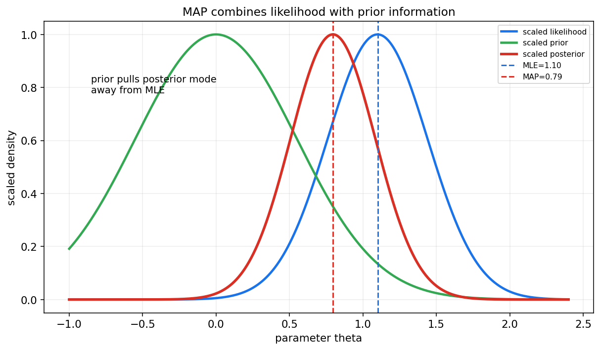
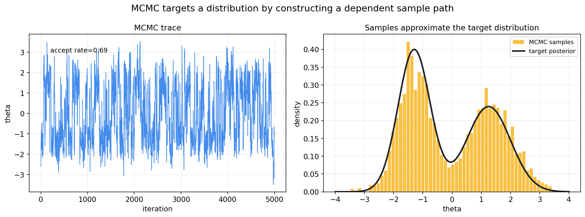
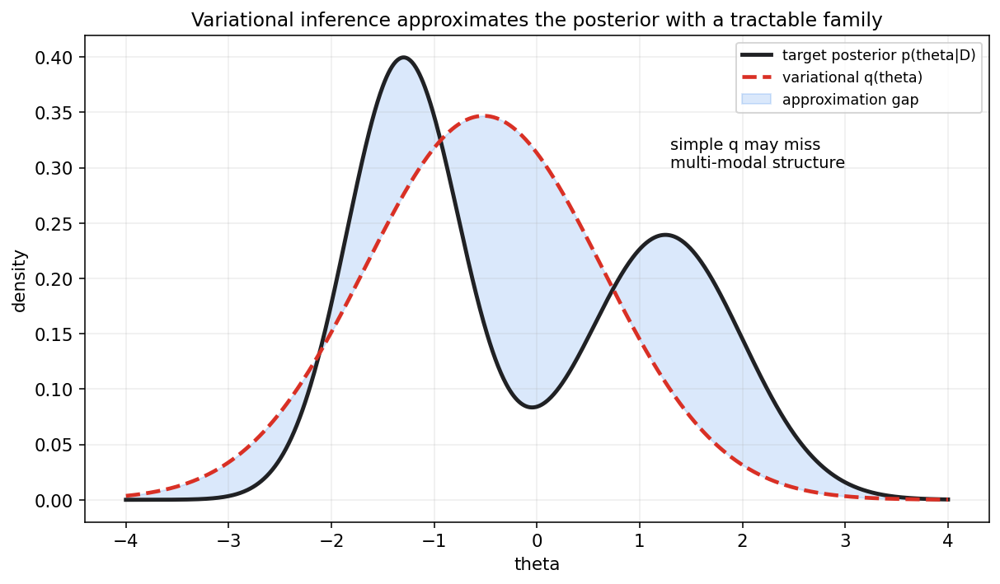
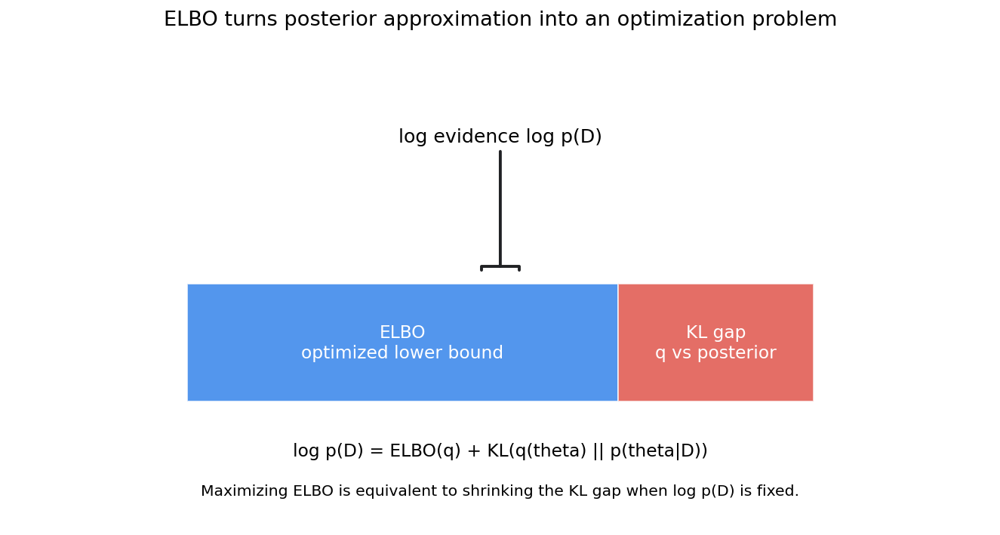

# 贝叶斯统计第十三章教程: 贝叶斯推断, MAP, MCMC 与变分推断

> 第十二章讲了贝叶斯建模的基本语言:
>
> 先验 × 似然 -> 后验.
>
> 但真实问题常常没有漂亮的闭式后验.  
> 这时问题就从"怎么写模型"变成:
>
> 1. 后验分布算不出来怎么办?
> 2. 只求一个最可能的参数够不够?
> 3. 能不能用采样近似整条后验?
> 4. 能不能把后验近似变成优化问题?
>
> 这一章负责把贝叶斯统计从纸面公式推进到可计算的推断方法.

---

## 0. 先看全章主线

第十三章的主线可以压成下面这张图:

```mermaid
flowchart LR
    A["后验 p(theta|D)"] --> B["计算困难<br/>积分, 归一化, 高维"]
    B --> C["MAP<br/>求一个后验众数"]
    B --> D["数值积分和网格法<br/>低维可用"]
    B --> E["Monte Carlo<br/>用样本近似期望"]
    E --> F["MCMC<br/>构造以后验为目标的链"]
    F --> G["Metropolis-Hastings<br/>接受/拒绝"]
    F --> H["Gibbs Sampling<br/>条件分布轮流采样"]
    B --> I["Variational Inference<br/>用可优化分布近似后验"]
    I --> J["ELBO<br/>把近似变成优化"]
```

一句话概括这一章:

> 贝叶斯推断的难点通常不在建模, 而在计算.  
> MAP, MCMC 和变分推断分别代表三种近似路线:  
> 求点, 采样, 优化一族分布.

---

## 1. 后验推断为什么会困难

### 1.1 后验公式看起来简单

贝叶斯公式写作:

$$
p(\theta\mid D)=\frac{p(D\mid \theta)p(\theta)}{p(D)}
$$

其中:

$$
p(D)=\int p(D\mid \theta)p(\theta)d\theta
$$

这个分母叫证据或边际似然.

### 1.2 难点在积分

很多时候, 后验的未归一化形式可以写出来:

$$
\tilde p(\theta\mid D)=p(D\mid \theta)p(\theta)
$$

但归一化常数:

$$
\int \tilde p(\theta\mid D)d\theta
$$

很难计算.

难点来自:

- 参数维度高
- 后验形状复杂
- 多峰结构
- 参数之间强相关
- 似然函数本身计算昂贵

### 1.3 需要哪些后验量

真实推断通常不只是要后验密度本身, 还要:

- 后验均值 $E[\theta\mid D]$
- 后验方差 $\mathrm{Var}(\theta\mid D)$
- 可信区间
- 后验概率 $P(\theta>0\mid D)$
- 后验预测 $p(\tilde y\mid D)$

这些量本质上常常都是积分.

---

## 2. MAP 估计

### 2.1 定义

MAP, maximum a posteriori, 是后验密度最大的点:

$$
\hat\theta_{\mathrm{MAP}}=\arg\max_\theta p(\theta\mid D)
$$

因为分母 $p(D)$ 与 $\theta$ 无关, 所以等价于:

$$
\hat\theta_{\mathrm{MAP}}
=
\arg\max_\theta p(D\mid \theta)p(\theta)
$$

取对数:

$$
\hat\theta_{\mathrm{MAP}}
=
\arg\max_\theta
\left[
\log p(D\mid \theta)+\log p(\theta)
\right]
$$

### 2.2 MAP 与 MLE

MLE 只最大化似然:

$$
\hat\theta_{\mathrm{MLE}}=\arg\max_\theta p(D\mid \theta)
$$

MAP 最大化似然乘先验:

$$
\hat\theta_{\mathrm{MAP}}=\arg\max_\theta p(D\mid \theta)p(\theta)
$$

如果先验是常数, MAP 和 MLE 形式上相同.  
如果先验有信息, MAP 会被先验拉动.

图中蓝线表示似然, 绿线表示先验, 红线表示后验.  
MLE 位于似然峰值, MAP 位于后验峰值.

### 2.3 MAP 和正则化

MAP 的目标:

$$
\max_\theta \log p(D\mid \theta)+\log p(\theta)
$$

等价于最小化负对数后验:

$$
\min_\theta -\log p(D\mid \theta)-\log p(\theta)
$$

其中 $-\log p(\theta)$ 就像正则化项.

例如:

- 高斯先验 -> L2 正则化
- Laplace 先验 -> L1 正则化

这也是贝叶斯和机器学习优化目标之间的重要连接.

### 2.4 MAP 不是完整贝叶斯推断

MAP 只是一个点估计.  
它不会告诉你:

- 后验有多宽
- 后验是否偏态
- 是否多峰
- 参数之间是否强相关
- 后验预测有多不确定

所以 MAP 适合做快速点估计或初始化, 但不能替代整条后验分布.

---

## 3. 网格法与简单数值积分

### 3.1 网格法直觉

如果参数只有一维或二维, 可以在参数空间放一个网格:

$$
\theta_1,\theta_2,\dots,\theta_m
$$

然后计算每个点的未归一化后验:

$$
w_j=p(D\mid \theta_j)p(\theta_j)
$$

归一化:

$$
\tilde w_j=\frac{w_j}{\sum_{k=1}^{m}w_k}
$$

这样就得到一个离散近似后验.

### 3.2 用网格近似期望

后验期望可近似为:

$$
E[g(\theta)\mid D]\approx \sum_{j=1}^{m}g(\theta_j)\tilde w_j
$$

这对教学和低维模型非常直观.

### 3.3 维度灾难

如果每个参数维度放 100 个网格点:

- 1 维需要 100 点
- 2 维需要 10000 点
- 10 维需要 $100^{10}$ 点

维度一高, 网格法很快不可行.

---

## 4. Monte Carlo 思想

### 4.1 用随机样本近似积分

如果我们能从后验中抽样:

$$
\theta^{(1)},\dots,\theta^{(S)}\sim p(\theta\mid D)
$$

那么后验期望可以用样本均值近似:

$$
E[g(\theta)\mid D]\approx \frac{1}{S}\sum_{s=1}^{S}g(\theta^{(s)})
$$

这就是 Monte Carlo 的核心.

### 4.2 为什么难

难点是:

> 我们通常不能直接从复杂后验中独立抽样.

MCMC 的目标就是解决这个问题:

> 构造一条 Markov 链, 让它的平稳分布正好是目标后验.

---

## 5. MCMC 的基本直觉

### 5.1 不是独立样本

MCMC 产生的是一条相关样本路径:

$$
\theta^{(1)},\theta^{(2)},\dots,\theta^{(S)}
$$

后一个状态依赖前一个状态.

如果链设计得正确并且运行足够久, 这些样本的长期分布会接近目标后验.

左图是采样轨迹, 右图是去掉 burn-in 后样本直方图和目标后验的对比.

### 5.2 burn-in

链从初始点出发时, 早期样本可能还没有进入目标分布的高概率区域.  
这些早期样本常被丢弃, 称为 burn-in.

### 5.3 混合 mixing

混合描述链在后验空间中移动得是否充分.

如果链长期困在一个区域, 即使样本数量很多, 也不代表推断可靠.

这正是本章的重要提醒:

> MCMC 样本多不等于一定靠谱, 还要看收敛和混合.

---

## 6. Metropolis-Hastings 初步

### 6.1 基本步骤

Metropolis-Hastings 是一类通用 MCMC 算法.

从当前状态 $\theta$ 出发:

1. 从提议分布采一个候选值:

$$
\theta'\sim q(\theta'\mid \theta)
$$

2. 计算接受概率:

$$
a=\min\left(
1,
\frac{p(\theta'\mid D)q(\theta\mid \theta')}
{p(\theta\mid D)q(\theta'\mid \theta)}
\right)
$$

3. 以概率 $a$ 接受 $\theta'$, 否则留在 $\theta$.

### 6.2 归一化常数会抵消

注意后验:

$$
p(\theta\mid D)=\frac{\tilde p(\theta\mid D)}{Z}
$$

在接受率中是比值, 归一化常数 $Z$ 会抵消.

这就是 MCMC 强大的原因之一:

> 只要能计算未归一化后验, 就可能构造采样算法.

### 6.3 提议分布很重要

如果提议步长太小, 链移动很慢.  
如果提议步长太大, 候选值常被拒绝.

好的提议分布要在探索范围和接受率之间平衡.

---

## 7. Gibbs Sampling 初步

### 7.1 条件分布轮流采样

Gibbs Sampling 适合多维参数:

$$
\theta=(\theta_1,\dots,\theta_p)
$$

如果每个条件分布容易采样:

$$
p(\theta_j\mid \theta_{-j},D)
$$

就可以轮流更新每个分量:

$$
\theta_1 \leftarrow p(\theta_1\mid \theta_2,\dots,\theta_p,D)
$$

$$
\theta_2 \leftarrow p(\theta_2\mid \theta_1,\theta_3,\dots,\theta_p,D)
$$

依次循环.

### 7.2 和 Metropolis-Hastings 的关系

Gibbs 可以看作接受率总为 1 的特殊 MCMC.  
因为每一步直接从完整条件分布采样.

### 7.3 使用场景

Gibbs 常见于:

- 共轭层次模型
- 混合模型
- Bayesian regression
- 主题模型等潜变量模型

如果条件分布不可直接采样, 可以在 Gibbs 步骤内部嵌入 Metropolis-Hastings.

---

## 8. MCMC 诊断

### 8.1 为什么需要诊断

MCMC 的理论保证通常是渐近的.  
实际运行中必须检查样本是否可信.

常见诊断包括:

- trace plot 是否稳定
- 多条链是否给出相近结果
- 自相关是否很高
- effective sample size 是否足够
- R-hat 是否接近 1
- 是否存在 divergent transitions, 对 HMC/NUTS 尤其重要

### 8.2 自相关和有效样本量

MCMC 样本彼此相关.  
所以 10000 个 MCMC 样本的信息量可能远少于 10000 个独立样本.

有效样本量 ESS 试图衡量:

> 这条相关样本链大约相当于多少个独立样本.

### 8.3 多峰后验的风险

如果后验有多个模式, 链可能只探索其中一个模式.  
这会让样本直方图看似稳定, 但实际漏掉重要区域.

多起点, 更好的提议分布, 重新参数化, 或更先进采样器可能有帮助.

---

## 9. Variational Inference 初步

### 9.1 核心想法

变分推断, VI, 不直接采样后验.  
它先选一个易处理的分布族:

$$
q_\phi(\theta)
$$

然后在这个分布族中寻找最接近真实后验的一个:

$$
q_\phi(\theta)\approx p(\theta\mid D)
$$

这里 $\phi$ 是变分参数.

### 9.2 用 KL 衡量接近

常见目标是最小化:

$$
\mathrm{KL}(q_\phi(\theta)\|p(\theta\mid D))
$$

但真实后验含有难算的归一化常数.  
于是 VI 通常转而最大化 ELBO.

### 9.3 VI 和 MCMC 的差异

粗略比较:

- MCMC 用相关样本近似后验
- VI 用一个可优化分布近似后验

MCMC 往往更接近完整后验, 但计算可能慢.  
VI 往往更快, 更适合大规模模型, 但会有近似偏差.

---

## 10. ELBO 直觉

### 10.1 分解公式

对任意变分分布 $q(\theta)$, 有:

$$
\log p(D)=\mathrm{ELBO}(q)+\mathrm{KL}(q(\theta)\|p(\theta\mid D))
$$

因为 KL 非负:

$$
\mathrm{KL}(q\|p)\ge 0
$$

所以:

$$
\mathrm{ELBO}(q)\le \log p(D)
$$

ELBO 是 log evidence 的下界.

### 10.2 最大化 ELBO

由于 $\log p(D)$ 对 $q$ 固定, 最大化 ELBO 等价于缩小:

$$
\mathrm{KL}(q(\theta)\|p(\theta\mid D))
$$

所以 VI 把后验近似变成了优化问题.

### 10.3 ELBO 的展开形式

ELBO 常写成:

$$
\mathrm{ELBO}(q)
=
E_q[\log p(D,\theta)]-E_q[\log q(\theta)]
$$

也可理解为:

$$
\text{拟合数据的项}+\text{熵或复杂度项}
$$

这和机器学习中的正则化, 自编码器, 生成模型都有联系.

---

## 11. 何时要点估计, 何时要分布估计

### 11.1 MAP 适合什么时候

MAP 适合:

- 快速求一个参数点
- 后验近似单峰且很窄
- 用作更复杂算法的初始化
- 模型部署只需要点参数

但 MAP 不适合:

- 后验很宽
- 后验多峰
- 需要可靠不确定性
- 需要后验预测区间

### 11.2 MCMC 适合什么时候

MCMC 适合:

- 后验维度中等
- 需要较高质量的不确定性估计
- 模型可计算但没有闭式后验
- 诊断成本可接受

限制是:

- 可能慢
- 需要收敛诊断
- 高维复杂模型可能混合困难

### 11.3 VI 适合什么时候

VI 适合:

- 大规模数据或高维模型
- 需要较快推断
- 可以接受近似偏差
- 需要和深度学习优化框架结合

限制是:

- 可能低估后验方差
- 简单分布族可能漏掉多峰结构
- 结果依赖近似族选择

### 11.4 实用判断

如果只关心一个稳定点估计, MAP 可能足够.  
如果关心区间, 尾部风险和预测不确定性, 更应保留分布信息.

这就是贝叶斯推断的核心价值:

> 不确定性不是附属品, 而是推断结果的一部分.

---

## 12. 本章主线总结

第十三章可以压成几句话:

1. 后验推断难在归一化和积分.
2. MAP 求后验众数, 是点估计, 不是完整贝叶斯.
3. 网格法直观但只适合低维.
4. Monte Carlo 用样本均值近似后验期望.
5. MCMC 构造以后验为平稳分布的 Markov 链.
6. Metropolis-Hastings 用提议和接受率探索后验.
7. Gibbs Sampling 通过完整条件分布轮流采样.
8. MCMC 必须检查混合, 收敛和有效样本量.
9. VI 用可处理分布族近似后验.
10. ELBO 把后验近似变成优化问题.

本章最重要的提醒是:

> 贝叶斯计算方法不是互相替代的万能按钮,  
> 而是不同近似路线, 各自有速度, 精度和诊断成本.

---

## 13. 典型题型与实战清单

### 13.1 典型题型

1. **写 MAP 目标**
   - 写 log likelihood
   - 加上 log prior
   - 说明与正则化关系

2. **比较 MLE 与 MAP**
   - MLE 只看似然
   - MAP 还看先验
   - 常数先验时二者可一致

3. **用 Monte Carlo 近似后验期望**
   - 从后验样本计算 $g(\theta)$
   - 对样本取平均

4. **写 Metropolis-Hastings 接受率**
   - 包括目标密度比
   - 包括提议分布校正

5. **解释 Gibbs Sampling**
   - 条件分布轮流采样
   - 每一步接受率为 1

6. **解释 ELBO**
   - log evidence = ELBO + KL
   - 最大化 ELBO 等价于缩小 KL gap

### 13.2 实战清单

做贝叶斯计算时, 可以按下面顺序检查:

1. 只是要点估计, 还是要后验分布?
2. 后验是否低维, 能否网格近似?
3. 是否能写未归一化后验?
4. MAP 是否足以表达不确定性?
5. 如果用 MCMC, 是否跑了多条链?
6. trace plot 是否稳定?
7. R-hat 和 ESS 是否合理?
8. 是否存在多峰或强相关?
9. 如果用 VI, 近似族是否太弱?
10. 后验预测是否做了模型检查?

---

## 14. 典型误区

### 误区 1: 把 MAP 当成完整贝叶斯推断

MAP 只是后验最高点.  
它不包含后验宽度, 偏态, 多峰和预测不确定性.

### 误区 2: 以为 MCMC 样本越多越可靠

如果链混合很差, 100000 个样本也可能只来自局部区域.  
样本数量必须和收敛诊断一起看.

### 误区 3: 忽略 burn-in 和初始值

初始阶段可能不代表目标后验.  
多起点和 trace plot 是基本检查.

### 误区 4: 把 VI 当成无损压缩

VI 是近似.  
如果近似族太简单, 可能低估方差或漏掉多个模式.

### 误区 5: 只看参数后验, 不做后验预测检查

模型是否能生成类似观测数据, 是贝叶斯建模的重要检查.

### 误区 6: 以为归一化常数永远不重要

MCMC 接受率中常数会抵消, 但模型比较和边际似然问题中常数可能很重要.

---

## 15. 和前后章节的连接点

### 15.1 和第十二章的连接

第十二章讲后验的概念和共轭闭式更新.  
本章处理非共轭或复杂后验的计算路线.

### 15.2 和第十四章的连接

贝叶斯回归, 层次模型和贝叶斯分类往往需要 MAP, MCMC 或 VI 才能计算.  
第十四章会把这些推断方法放进具体模型.

### 15.3 和统计学习的连接

VI 和 ELBO 是许多生成模型和深度概率模型的基础.  
例如变分自编码器就直接使用了 ELBO 思想.

---

## 16. 本章收尾

贝叶斯建模说的是:

> 后验代表数据之后的不确定性.

贝叶斯计算进一步问:

> 这条后验分布实际怎么拿到?

MAP 给一个点, MCMC 给一串相关样本, VI 给一个优化得到的近似分布.  
理解这三条路线, 后面再看贝叶斯回归, 层次模型和深度生成模型时, 就不会只停留在公式表面.
