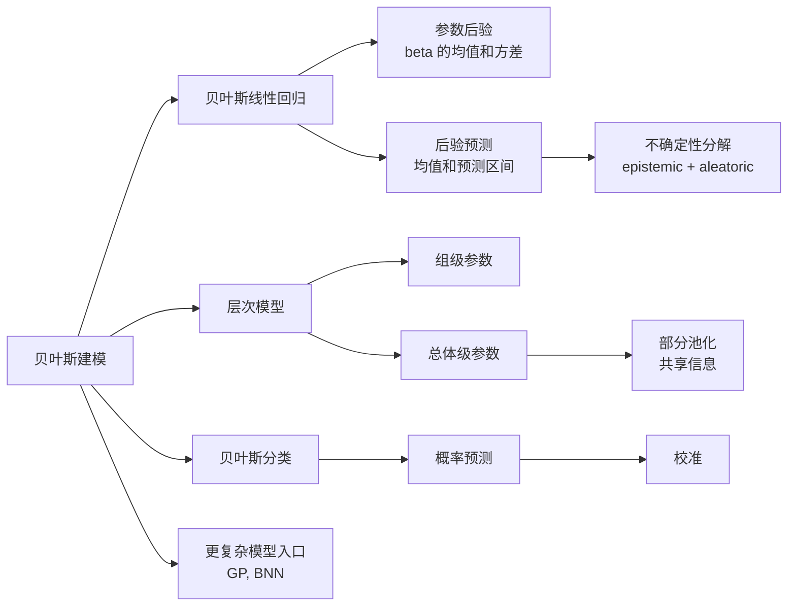
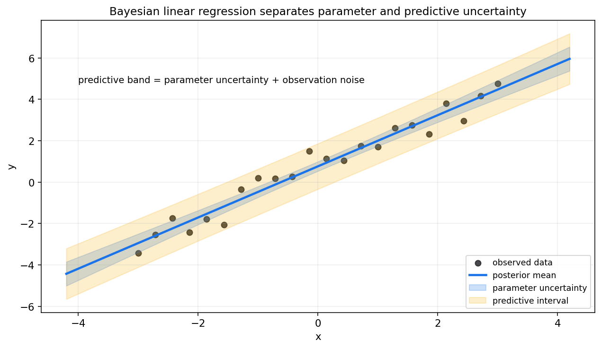
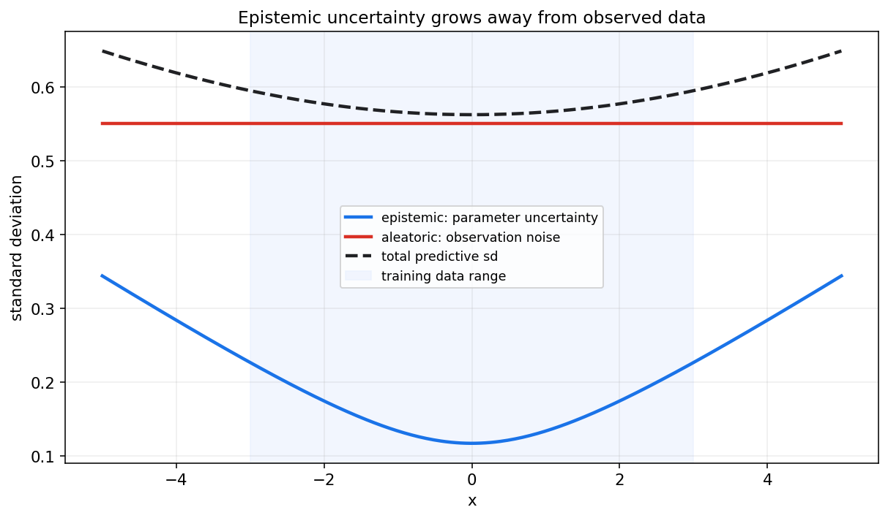
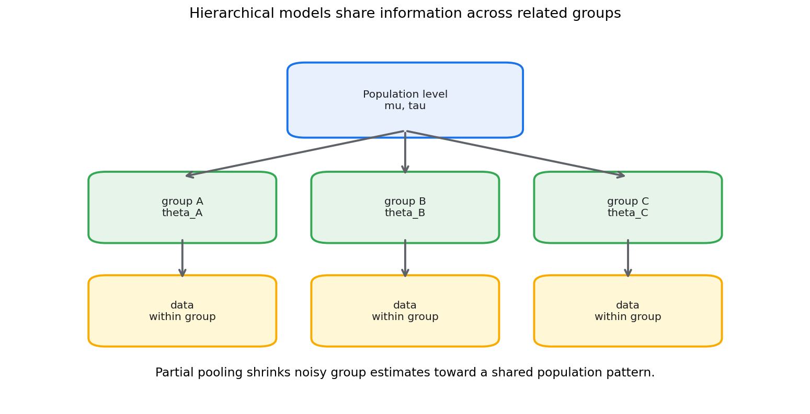
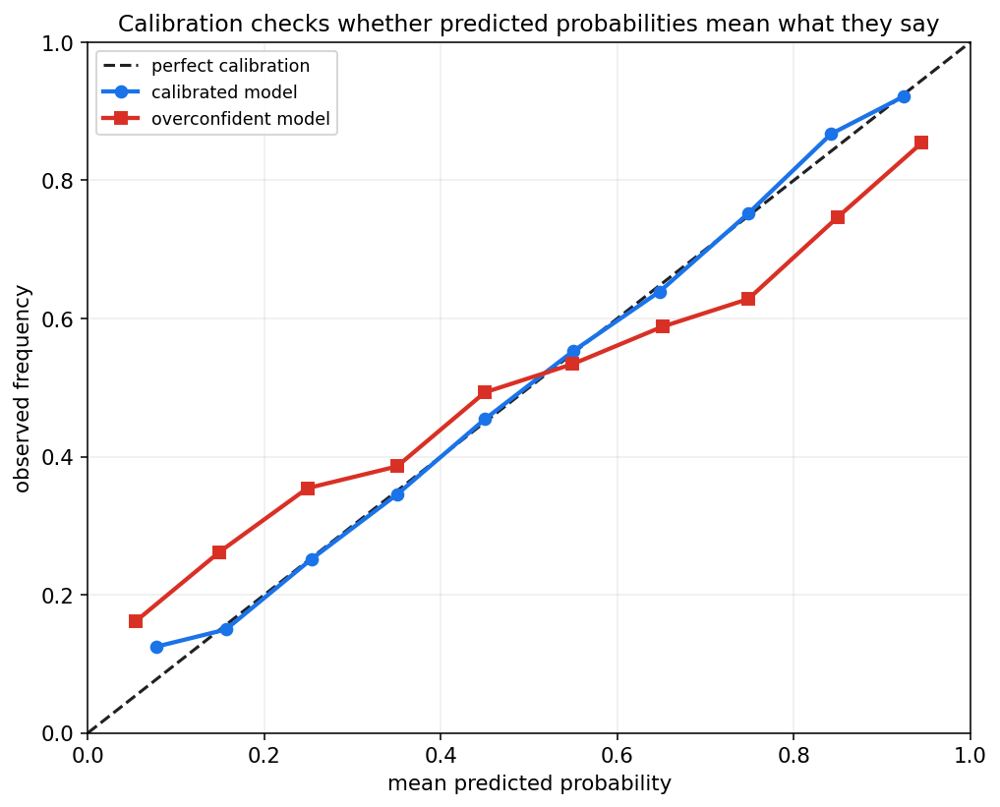

# 贝叶斯统计第十四章教程: 贝叶斯回归, 层次模型与不确定性估计

> 第十二章讲贝叶斯更新, 第十三章讲后验计算.  
> 这一章把贝叶斯思想放进建模和预测:
>
> 1. 回归模型怎样给出参数后验和预测区间?
> 2. 参数不确定性和观测噪声有什么区别?
> 3. 多个相关群体的数据能不能共享信息?
> 4. 分类概率怎样检查是否可信?
>
> 贝叶斯建模的独特价值在于, 它不只输出一个最优参数, 还把不确定性作为结果的一部分.

---

## 0. 先看全章主线

一句话概括:

> 贝叶斯建模不是只把参数换成随机变量,  
> 而是把参数不确定性, 预测不确定性和层次结构一起纳入模型.

---

## 1. 贝叶斯线性回归

### 1.1 从普通线性回归开始

普通线性回归写作:

$$
y=X\beta+\varepsilon
$$

其中常假设:

$$
\varepsilon\sim \mathcal{N}(0,\sigma^2I)
$$

频率学派通常估计一个点:

$$
\hat\beta
$$

贝叶斯线性回归则给系数加先验:

$$
\beta\sim \mathcal{N}(\beta_0,\Sigma_0)
$$

于是数据后得到:

$$
p(\beta\mid X,y)
$$

这是一整条后验分布, 而不是一个点.

### 1.2 正态-正态共轭形式

若 $\sigma^2$ 已知, 且:

$$
y\mid \beta\sim \mathcal{N}(X\beta,\sigma^2I)
$$

$$
\beta\sim \mathcal{N}(\beta_0,\Sigma_0)
$$

则后验仍为正态:

$$
\beta\mid X,y\sim \mathcal{N}(\beta_n,\Sigma_n)
$$

其中:

$$
\Sigma_n^{-1}=\Sigma_0^{-1}+\frac{1}{\sigma^2}X^TX
$$

$$
\beta_n=\Sigma_n\left(\Sigma_0^{-1}\beta_0+\frac{1}{\sigma^2}X^Ty\right)
$$

这和第十二章 Normal-Normal 更新一致: 后验精度 = 先验精度 + 数据信息.

### 1.3 图像直觉

图中蓝色线是后验均值.  
蓝色带表示参数不确定性, 黄色带表示加入观测噪声后的预测区间.

这张图要留下的直觉是:

> 参数后验越不确定, 均值函数越不确定.  
> 即使参数非常确定, 新观测仍然会有观测噪声.

---

## 2. 后验均值, 后验方差与预测区间

### 2.1 参数后验摘要

对每个系数 $\beta_j$, 可以报告:

- 后验均值
- 后验标准差
- 可信区间
- $P(\beta_j>0\mid D)$

这些量都来自后验分布:

$$
p(\beta\mid D)
$$

### 2.2 新输入点的均值预测

给定新输入 $x_*$, 条件均值是:

$$
f_* = x_*^T\beta
$$

由于 $\beta$ 有后验分布, $f_*$ 也有后验分布:

$$
p(f_*\mid D)
$$

若 $\beta\mid D\sim \mathcal{N}(\beta_n,\Sigma_n)$, 则:

$$
f_*\mid D\sim \mathcal{N}(x_*^T\beta_n,\ x_*^T\Sigma_nx_*)
$$

### 2.3 新观测的预测分布

新观测还包含噪声:

$$
y_*=f_*+\varepsilon_*
$$

所以:

$$
y_*\mid D\sim \mathcal{N}(x_*^T\beta_n,\ x_*^T\Sigma_nx_*+\sigma^2)
$$

这比均值函数后验更宽.

### 2.4 预测区间不是置信带

预测区间包含未来观测噪声.  
均值函数可信带只描述平均关系的不确定性.

不要把二者混在一起:

- 均值可信带: 模型平均函数在哪里
- 预测区间: 下一个观测值可能在哪里

---

## 3. 两类不确定性

### 3.1 Epistemic uncertainty

Epistemic uncertainty 是认知不确定性, 来自信息不足.

在贝叶斯回归中, 它对应参数不确定性:

$$
x_*^T\Sigma_nx_*
$$

样本更多, 覆盖更充分时, 它通常会下降.

### 3.2 Aleatoric uncertainty

Aleatoric uncertainty 是数据本身的随机噪声.

例如:

- 传感器噪声
- 同一输入下响应本来就波动
- 标签存在天然随机性

即使无限多数据, 这部分也不会完全消失.

### 3.3 分解图

图中训练数据范围外, epistemic uncertainty 变大.  
aleatoric uncertainty 由观测噪声给定, 在这个例子里保持稳定.

核心结论:

> 模型不知道和世界本来就随机, 是两种不同的不确定性.

---

## 4. 层次模型初步

### 4.1 为什么需要层次模型

现实数据常有分组结构:

- 不同城市的转化率
- 不同学校的学生成绩
- 不同用户群体的留存率
- 不同医院的治疗效果

每组数据量可能不同.  
如果完全分开估计, 小组样本会很不稳定.  
如果完全合并估计, 又会抹掉组间差异.

层次模型提供第三条路:

> 各组有自己的参数, 但这些参数来自共同的总体分布.

### 4.2 基本结构

设第 $j$ 组有参数 $\theta_j$:

$$
y_{ij}\mid \theta_j\sim p(y_{ij}\mid \theta_j)
$$

组级参数来自总体层:

$$
\theta_j\sim \mathcal{N}(\mu,\tau^2)
$$

总体层参数也可以有先验:

$$
\mu,\tau\sim p(\mu,\tau)
$$

这就是层次结构.

### 4.3 三种估计方式

面对多个组, 有三种常见做法:

1. **完全合并 pooling**
   - 所有组共用一个参数
   - 稳定但忽略组差异

2. **完全分开 no pooling**
   - 每组独立估计
   - 保留差异但小样本组很不稳定

3. **部分池化 partial pooling**
   - 每组有自己的参数
   - 小样本组被拉向总体平均
   - 大样本组更多由自己数据决定

### 4.4 部分池化的价值

部分池化能在稳定性和差异性之间折中.

直觉上:

> 对证据少的组, 多借一点总体信息.  
> 对证据多的组, 多相信自己的数据.

这也是层次模型比简单分组估计更有力量的地方.

---

## 5. 贝叶斯分类初步

### 5.1 分类输出应该是概率

二分类问题中:

$$
Y\in\{0,1\}
$$

我们关心:

$$
P(Y=1\mid x,D)
$$

贝叶斯分类不是只学习一个固定权重, 而是对权重后验平均:

$$
P(Y=1\mid x,D)=\int P(Y=1\mid x,\theta)p(\theta\mid D)d\theta
$$

### 5.2 与 Logistic 回归的关系

贝叶斯 Logistic 回归可以写成:

$$
P(Y=1\mid x,\beta)=\sigma(x^T\beta)
$$

并对 $\beta$ 给先验:

$$
\beta\sim p(\beta)
$$

由于后验通常没有闭式形式, 常用第十三章的方法:

- MAP
- MCMC
- VI
- Laplace 近似

### 5.3 分类中的不确定性

分类概率不确定性来自:

- 类别本身重叠
- 数据噪声
- 参数不确定
- 训练数据覆盖不足

只输出类别标签会丢掉这些信息.

---

## 6. 校准与概率可靠性

### 6.1 什么是校准

如果模型对一批样本都预测概率约为 0.8, 那么其中真实为正类的比例也应约为 0.8.

这叫校准.

### 6.2 校准曲线

横轴是模型预测概率, 纵轴是实际发生频率.  
完美校准应落在对角线上.

图中红线代表过度自信模型: 它给出的极端概率比真实频率更激进.

### 6.3 高准确率不等于校准

一个分类器可能 accuracy 很高, 但概率不可靠.  
例如它总是把 0.7 的事件预测成 0.95, 排序可能不错, 但概率语义坏了.

校准对下面场景尤其重要:

- 医疗风险评估
- 金融风控
- 自动驾驶安全
- 成本敏感决策
- 人机协作系统

---

## 7. 高斯过程回归入口

### 7.1 从参数到函数

贝叶斯线性回归给参数 $\beta$ 放先验.  
高斯过程回归更进一步, 直接给函数 $f(x)$ 放先验:

$$
f\sim \mathcal{GP}(m(x),k(x,x'))
$$

其中:

- $m(x)$ 是均值函数
- $k(x,x')$ 是核函数或协方差函数

### 7.2 核函数表达相似性

核函数描述:

> 两个输入点越相似, 它们的函数值越相关.

常见 RBF 核中, 距离越近, 相关性越高.

### 7.3 GP 的价值

高斯过程天然给出:

- 预测均值
- 预测方差
- 远离数据处更大的不确定性

它适合小到中等规模数据, 贝叶斯优化和不确定性敏感任务.

限制是计算代价通常较高, 朴素实现需要处理 $n\times n$ 协方差矩阵.

---

## 8. 贝叶斯神经网络直觉

### 8.1 给神经网络权重放后验

普通神经网络学习一个权重:

$$
w
$$

贝叶斯神经网络把权重视为不确定:

$$
p(w\mid D)
$$

预测时做后验平均:

$$
p(y\mid x,D)=\int p(y\mid x,w)p(w\mid D)dw
$$

### 8.2 为什么难

神经网络参数维度很高, 后验非常复杂.  
精确贝叶斯推断几乎不可行.

常见近似包括:

- 变分推断
- Laplace 近似
- Monte Carlo Dropout
- 深度集成
- SWAG 等近似后验方法

### 8.3 BNN 解决什么

贝叶斯神经网络主要希望解决:

- 参数不确定性
- 分布外样本风险
- 小数据下的过度自信
- 预测区间和风险控制

它不是自动提升准确率的工具.  
它更重要的价值是不确定性表达.

---

## 9. 本章主线总结

第十四章可以压成几句话:

1. 贝叶斯回归给参数后验, 不只给一个点估计.
2. 后验预测同时包含参数不确定性和观测噪声.
3. Epistemic uncertainty 来自信息不足, 数据增加后可降低.
4. Aleatoric uncertainty 来自数据本身随机性, 不会靠更多同类数据完全消失.
5. 层次模型通过部分池化在组间共享信息.
6. 贝叶斯分类输出的是后验平均后的概率.
7. 校准检查预测概率是否可信.
8. 高斯过程给函数放先验, 贝叶斯神经网络给权重放后验.

核心提醒:

> 预测均值不是全部结果.  
> 一个模型还应告诉我们它什么时候知道, 什么时候不知道.

---

## 10. 实战清单与典型误区

### 10.1 实战清单

做贝叶斯建模时, 先问:

1. 响应变量是什么类型?
2. 先验是否表达了合理尺度?
3. 目标是参数解释还是预测?
4. 是否需要层次结构?
5. 组间是否可以共享信息?
6. 后验预测是否覆盖观测数据?
7. 参数不确定性和观测噪声是否分开报告?
8. 分类概率是否校准?
9. 模型在数据范围外是否过度自信?
10. 推断方法是否经过诊断?

### 10.2 典型误区

1. **把预测均值当全部结果**  
   贝叶斯模型还应报告不确定性范围.

2. **混淆两类不确定性**  
   Epistemic 和 aleatoric 的来源不同, 应对方式也不同.

3. **以为层次模型只是复杂先验**  
   它的核心价值是相关群体之间的信息共享.

4. **把校准当成 accuracy**  
   校准关心概率语义, accuracy 关心分类是否正确.

5. **以为贝叶斯模型自动保守**  
   先验, 似然和推断近似不合理时, 贝叶斯模型也会过度自信.

---

## 11. 和前后章节的连接点

第十二章提供先验, 后验和后验预测语言.  
第十三章提供 MAP, MCMC 和 VI 等计算方法.  
本章把它们落到回归, 分类和层次模型中.

往后看, 统计学习和深度学习中的不确定性估计, 校准, 集成方法, 贝叶斯神经网络, 都可以回到本章语言理解.

---

## 12. 本章收尾

贝叶斯建模的价值不只是让公式更复杂.  
它真正提供的是一套表达不确定性的方式:

> 参数有不确定性,  
> 预测有不确定性,  
> 群体之间可以共享信息,  
> 概率输出需要校准.

下一章开始进入统计学习.  
重点会从"参数后验"转向"模型能否泛化到未来数据".
