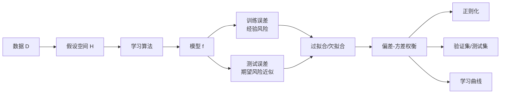
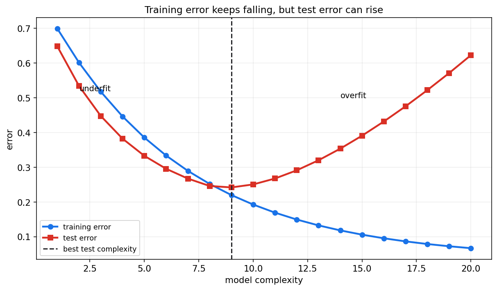
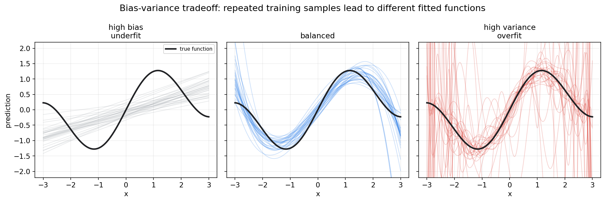
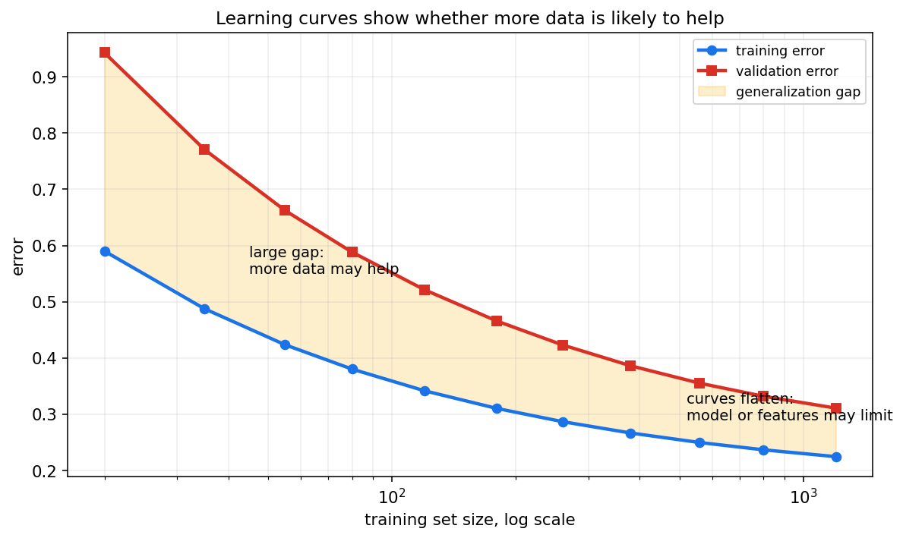
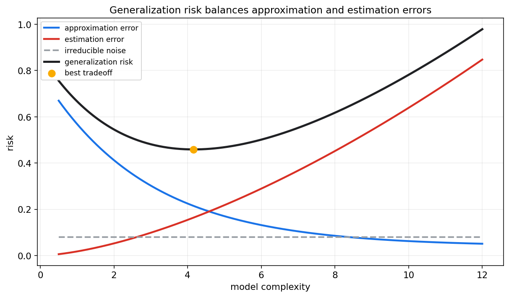

# 统计学习第十五章教程: 统计学习基础, 经验风险与泛化

> 从这一章开始, 视角从传统统计推断转向统计学习.  
> 核心问题不再只是估计一个参数或检验一个假设, 而是:
>
> 1. 怎样从有限训练数据中学出一个规则?
> 2. 这个规则在未来新数据上是否仍然有效?
> 3. 为什么训练误差低不等于模型好?
> 4. 模型复杂度, 正则化, 样本量和泛化误差是什么关系?
>
> 统计学习的中心问题是泛化, 不是记住训练集.

---

## 0. 先看全章主线

一句话概括:

> 统计学习不是追求训练集上完美,  
> 而是从有限样本中学习能推广到未来数据的规律.

---

## 1. 统计学习在研究什么

### 1.1 从统计推断到预测规则

前面章节常问:

- 参数是多少?
- 假设是否被拒绝?
- 后验分布长什么样?

统计学习常问:

> 给定输入 $X$, 能不能预测输出 $Y$?

我们希望学到一个函数:

$$
f:X\to Y
$$

让它在未来样本上也表现好.

### 1.2 数据生成视角

假设样本来自某个未知分布:

$$
(X,Y)\sim P
$$

训练集为:

$$
D_n=\{(x_i,y_i)\}_{i=1}^{n}
$$

学习算法从训练集产生模型:

$$
\hat f=A(D_n)
$$

因为训练集是随机的, 学到的模型也是随机的.

### 1.3 泛化是核心

模型最终要服务未来数据.  
所以最重要的不是:

$$
\text{training performance}
$$

而是:

$$
\text{future performance}
$$

这就是泛化问题.

---

## 2. 监督, 无监督, 半监督和自监督

### 2.1 监督学习

监督学习有输入和标签:

$$
(x_i,y_i)
$$

目标是学习从 $x$ 到 $y$ 的映射.

典型任务:

- 回归
- 分类
- 排序
- 序列标注

### 2.2 无监督学习

无监督学习只有输入:

$$
x_i
$$

目标是发现数据结构.

典型任务:

- 聚类
- 降维
- 密度估计
- 表示学习

### 2.3 半监督学习

半监督学习同时使用少量有标签数据和大量无标签数据.

它依赖一个直觉:

> 无标签数据也能告诉我们输入空间的结构.

### 2.4 自监督学习

自监督学习从数据本身构造监督信号.

例如:

- 遮住一部分文本让模型预测
- 图像增强后要求表示一致
- 音频或视频中预测未来片段

现代大模型和表示学习大量使用自监督思想.

---

## 3. 输入, 输出和假设空间

### 3.1 输入空间和输出空间

输入空间记为:

$$
\mathcal{X}
$$

输出空间记为:

$$
\mathcal{Y}
$$

例如:

- 回归: $\mathcal{Y}=\mathbb{R}$
- 二分类: $\mathcal{Y}=\{0,1\}$
- 多分类: $\mathcal{Y}=\{1,\dots,K\}$

### 3.2 假设空间

假设空间是模型可能取值的集合:

$$
\mathcal{H}=\{f_\theta:\theta\in\Theta\}
$$

例如:

- 所有线性函数
- 所有指定深度的决策树
- 某个神经网络结构下的所有权重

假设空间越大, 模型表达能力越强, 但也越容易过拟合.

### 3.3 学习算法

学习算法从训练数据中选择一个模型:

$$
\hat f\in\mathcal{H}
$$

它可能通过:

- 最小化损失
- 最大化似然
- 后验推断
- 贪心树切分
- 梯度下降

来完成.

---

## 4. 损失函数, 期望风险和经验风险

### 4.1 损失函数

损失函数衡量预测错误:

$$
L(f(x),y)
$$

常见例子:

- 平方损失: $(f(x)-y)^2$
- 绝对损失: $|f(x)-y|$
- 0-1 损失: $\mathbf{1}\{f(x)\ne y\}$
- 交叉熵损失

损失函数应和任务目标对齐.

### 4.2 期望风险

期望风险定义为:

$$
R(f)=E_{(X,Y)\sim P}[L(f(X),Y)]
$$

它表示模型在真实数据分布上的平均损失.

理想目标是:

$$
f^*=\arg\min_{f\in\mathcal{H}}R(f)
$$

但真实分布 $P$ 不知道, 所以 $R(f)$ 也算不出来.

### 4.3 经验风险

训练集上的平均损失叫经验风险:

$$
\hat R_n(f)=\frac{1}{n}\sum_{i=1}^{n}L(f(x_i),y_i)
$$

经验风险最小化 ERM:

$$
\hat f=\arg\min_{f\in\mathcal{H}}\hat R_n(f)
$$

### 4.4 ERM 和统计估计的关系

ERM 和前面章节是相通的:

- 平方损失 + 线性模型 -> 最小二乘
- 负对数似然损失 -> 极大似然
- 加正则项 -> MAP 或复杂度控制

所以统计学习不是另起炉灶, 而是在更强调泛化的语境下重新组织这些工具.

---

## 5. 训练误差与测试误差

### 5.1 训练误差

训练误差是模型在训练集上的损失:

$$
\hat R_{\mathrm{train}}(\hat f)
$$

它通常会随着模型复杂度增加而下降.

### 5.2 测试误差

测试误差是在独立测试集上的损失:

$$
\hat R_{\mathrm{test}}(\hat f)
$$

它更接近期望风险.

### 5.3 为什么训练误差不够

模型可能记住训练数据中的噪声.  
这会让训练误差很低, 但测试误差变高.

图中训练误差持续下降, 测试误差先降后升.  
测试误差升高的区域就是过拟合.

---

## 6. 过拟合与欠拟合

### 6.1 欠拟合

欠拟合指模型太简单, 无法表达真实规律.

表现为:

- 训练误差高
- 测试误差也高
- 模型遗漏重要结构

例如用直线拟合明显弯曲的函数.

### 6.2 过拟合

过拟合指模型过于贴合训练集, 包括噪声也被学进去.

表现为:

- 训练误差低
- 测试误差高
- 对数据扰动敏感

### 6.3 合适复杂度

好的模型不一定是训练误差最低的模型.  
它应在表达能力和稳定性之间取得平衡.

---

## 7. 偏差-方差权衡

### 7.1 分解直觉

对平方损失, 测试误差可以直观分成:

$$
\text{error}=\text{bias}^2+\text{variance}+\text{noise}
$$

其中:

- bias: 模型平均预测和真实函数的系统差距
- variance: 训练集变化导致预测变化的程度
- noise: 数据本身不可消除的随机性

### 7.2 图像直觉

左图模型太简单, 许多训练集下都偏离真实函数, 属于高偏差.  
右图模型太灵活, 不同训练集得到的曲线差异很大, 属于高方差.  
中间图在偏差和方差之间更平衡.

### 7.3 和前面章节的关系

第八章的 MSE 分解:

$$
\mathrm{MSE}=\mathrm{Var}+\mathrm{Bias}^2
$$

在统计学习中变成泛化误差分析的核心直觉.

---

## 8. 正则化

### 8.1 正则化的基本思想

正则化是在训练目标中加入复杂度惩罚:

$$
\min_f \hat R_n(f)+\lambda\Omega(f)
$$

其中:

- $\Omega(f)$ 衡量模型复杂度
- $\lambda$ 控制惩罚强度

### 8.2 正则化为什么有用

正则化会增加一点训练误差, 但可能降低测试误差.

它通过限制模型自由度来降低方差.

### 8.3 和贝叶斯 MAP 的关系

第十三章讲过:

$$
\min_\theta -\log p(D\mid \theta)-\log p(\theta)
$$

负 log prior 就像正则项.

例如:

- L2 正则化对应高斯先验
- L1 正则化对应 Laplace 先验

这把统计学习, 优化和贝叶斯 MAP 连接起来.

---

## 9. 数据划分: 训练集, 验证集, 测试集

### 9.1 训练集

训练集用于拟合模型参数.

### 9.2 验证集

验证集用于选择超参数和模型结构, 例如:

- 正则化强度
- 树深度
- 学习率
- 网络结构

### 9.3 测试集

测试集用于最后一次评估.  
它应该尽量模拟未来数据.

如果反复根据测试集结果调模型, 测试集就被污染, 不再是独立评估.

### 9.4 角色不能混

最常见错误是:

> 用测试集调参, 然后还把测试集分数当泛化估计.

这会高估模型表现.

---

## 10. 学习曲线

### 10.1 学习曲线是什么

学习曲线展示训练集大小变化时, 训练误差和验证误差如何变化.

### 10.2 如何解读

如果训练误差低, 验证误差高, 且两者差距大:

> 模型高方差, 更多数据可能有帮助.

如果训练误差和验证误差都高, 且接近:

> 模型高偏差, 需要更强模型或更好特征.

如果两条曲线都趋于平稳:

> 继续收集同类数据的边际收益可能有限.

---

## 11. 模型复杂度与样本复杂度

### 11.1 复杂度不是越高越好

模型复杂度提高会降低近似误差, 但会增加估计误差.

图中黑线是泛化风险.  
最优点不是最简单模型, 也不是最复杂模型, 而是二者的折中.

### 11.2 样本复杂度

样本复杂度指达到某个泛化误差水平大约需要多少样本.

复杂模型通常需要更多数据来稳定估计.  
如果数据量太小, 很大的假设空间会带来高方差.

### 11.3 数据质量同样重要

更多数据不一定更好.  
如果新增数据:

- 标签噪声高
- 分布和目标不一致
- 样本偏差严重
- 重复或泄漏

它可能不会改善泛化.

---

## 12. 本章主线总结

第十五章可以压成几句话:

1. 统计学习关心从样本学出能泛化的规则.
2. 期望风险是真实目标, 经验风险是训练集近似.
3. 训练误差低不等于测试误差低.
4. 欠拟合来自模型太简单, 过拟合来自模型过度贴合训练数据.
5. 偏差-方差权衡解释复杂度和泛化之间的张力.
6. 正则化通过惩罚复杂度改善泛化.
7. 验证集用于模型选择, 测试集用于最终评估.
8. 学习曲线帮助判断更多数据是否有用.

核心提醒:

> 统计学习的目标不是赢训练集,  
> 而是在未来数据上可靠地犯更少错误.

---

## 13. 实战清单与典型误区

### 13.1 实战清单

1. 明确任务是回归, 分类还是排序.
2. 选择与目标一致的损失函数.
3. 划分训练集, 验证集和测试集.
4. 只用训练集拟合参数.
5. 用验证集选择超参数.
6. 最后才用测试集评估.
7. 同时看训练误差和验证误差.
8. 用学习曲线判断偏差或方差问题.
9. 用正则化控制复杂度.
10. 检查数据泄漏和分布差异.

### 13.2 典型误区

1. **把训练集分数高当成模型好**  
   训练分数高可能只是记住了训练集.

2. **只谈优化收敛, 不谈泛化**  
   loss 收敛不代表未来样本表现好.

3. **混淆验证集和测试集**  
   验证集用于选择模型, 测试集用于最终报告.

4. **以为复杂模型一定更强**  
   数据不足时, 复杂模型更容易高方差.

5. **忽略数据质量**  
   泛化失败常常来自样本偏差, 标签噪声或数据泄漏.

---

## 14. 和前后章节的连接点

第八章的估计量 MSE 分解, 第十章的回归, 第十三章的 MAP 正则化, 都在本章汇入泛化问题.

第十六章会进入具体监督学习模型, 说明 Ridge, Lasso, SVM, 决策树和集成方法如何体现假设空间, 损失函数和正则化差异.

---

## 15. 本章收尾

统计学习把概率统计推向一个更工程化的问题:

> 模型不是为了拟合过去,  
> 而是为了服务未来.

理解经验风险和泛化风险的差别, 是理解机器学习的第一道门.
