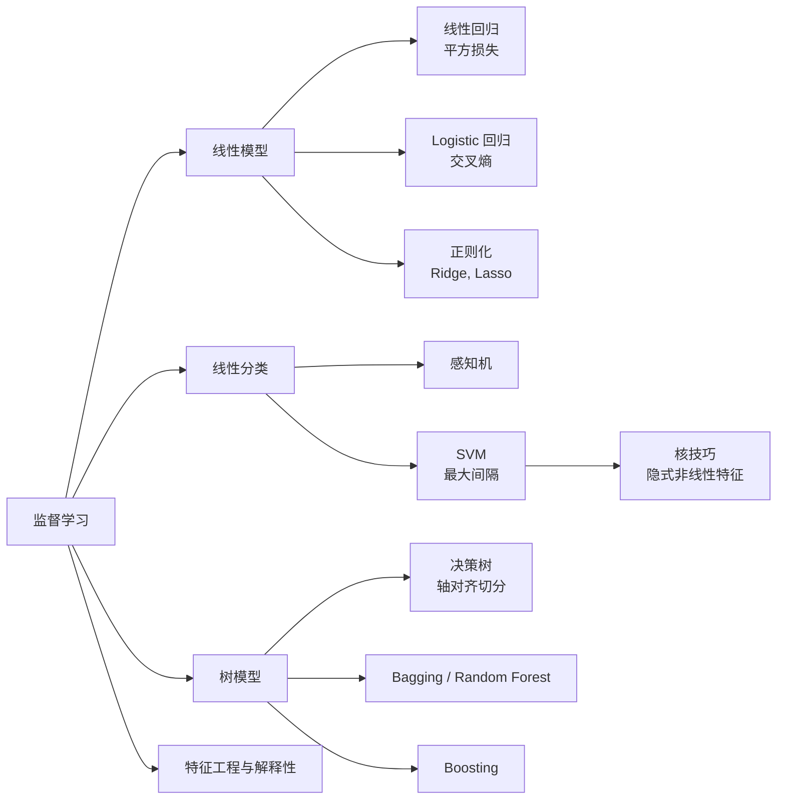
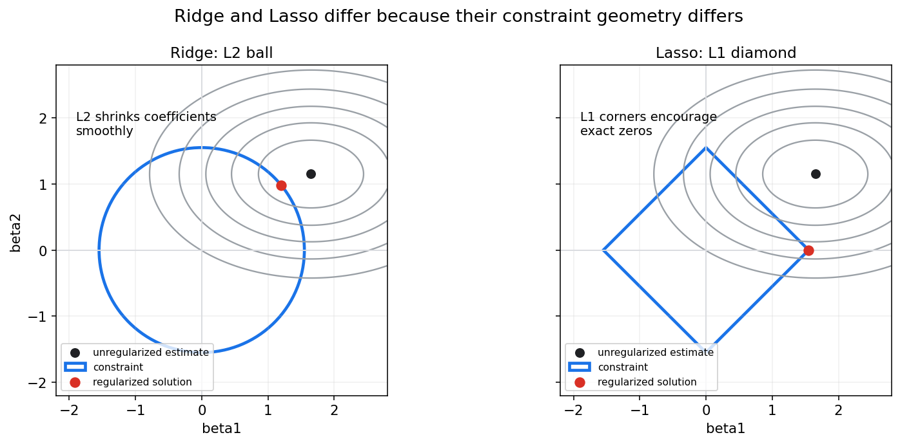
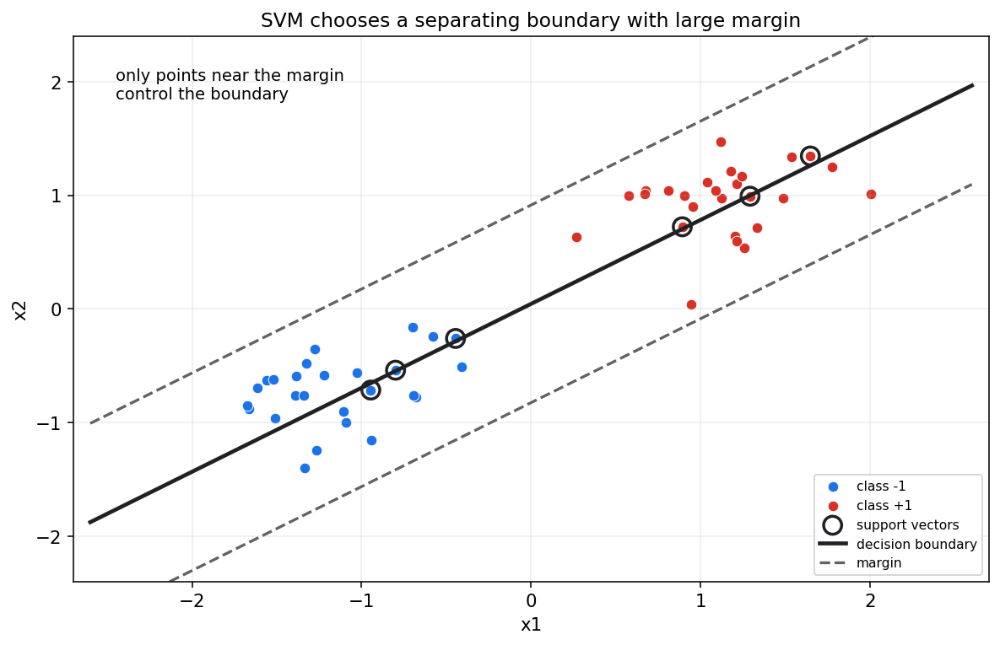
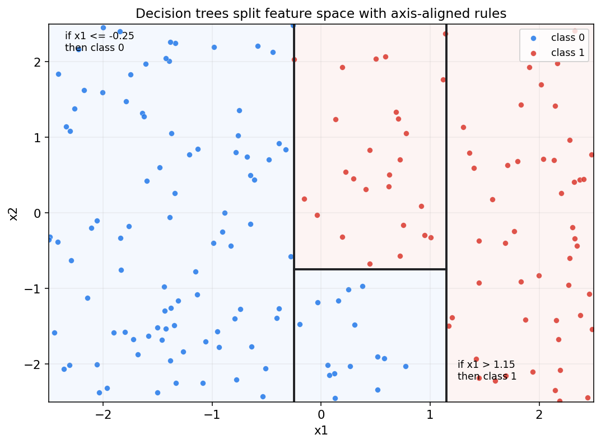
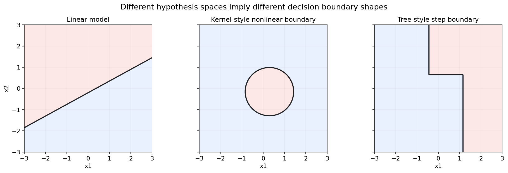

# 统计学习第十六章教程: 经典监督学习, 正则化与核方法

> 第十五章讲的是统计学习的总原则:
>
> 经验风险只是训练集上的近似, 真正目标是泛化风险.
>
> 第十六章把这些原则落到经典监督学习模型:
>
> 1. 线性模型为什么仍然重要?
> 2. Ridge 和 Lasso 到底差在哪里?
> 3. SVM 的间隔最大化是什么意思?
> 4. 决策树, 随机森林, Boosting 的风格和线性模型有什么不同?
> 5. 模型可解释性应该从哪里开始?
>
> 这一章的重点不是背模型名字, 而是理解每类模型背后的假设空间, 损失函数, 正则化方式和决策边界.

---

## 0. 先看全章主线



一句话概括:

> 经典监督学习方法的差别不只是模型名字不同,  
> 更体现在假设空间, 正则化方式, 损失函数和决策边界的不同.

---

## 1. 线性回归回顾

### 1.1 模型

线性回归建模连续响应:

$$
y_i=\beta_0+x_i^T\beta+\varepsilon_i
$$

预测函数为:

$$
f_\beta(x)=\beta_0+x^T\beta
$$

最小二乘目标为:

$$
\min_\beta \sum_{i=1}^{n}(y_i-f_\beta(x_i))^2
$$

### 1.2 统计学习视角

在线性回归里:

- 假设空间是线性函数集合
- 损失函数通常是平方损失
- 优化目标是经验风险
- 泛化依赖数据量, 噪声, 特征维度和正则化

### 1.3 线性模型为什么仍然重要

线性模型的优势:

- 解释清晰
- 训练稳定
- 对小数据友好
- 容易正则化
- 可作为复杂模型基线

不要因为深度学习流行就忽视线性模型.  
很多工业问题中, 一个强特征工程加正则化线性模型仍然非常有竞争力.

---

## 2. Logistic 回归回顾

### 2.1 二分类概率模型

Logistic 回归建模:

$$
P(Y=1\mid x)=\sigma(\beta_0+x^T\beta)
$$

其中:

$$
\sigma(z)=\frac{1}{1+e^{-z}}
$$

等价写成 logit:

$$
\log\frac{p(x)}{1-p(x)}=\beta_0+x^T\beta
$$

### 2.2 损失函数

对二分类数据, 负对数似然为:

$$
-\sum_{i=1}^{n}\left[
y_i\log p_i+(1-y_i)\log(1-p_i)
\right]
$$

这就是 binary cross entropy.

所以 Logistic 回归连接了:

- 概率模型: Bernoulli
- 统计估计: 极大似然
- 机器学习损失: 交叉熵

### 2.3 决策边界

当:

$$
P(Y=1\mid x)=0.5
$$

时:

$$
\beta_0+x^T\beta=0
$$

这是一条线或一个超平面.

因此普通 Logistic 回归是线性分类器.  
要得到非线性边界, 需要加入非线性特征, 核方法或换模型.

---

## 3. Ridge 与 Lasso

### 3.1 为什么需要正则化

当特征很多, 噪声较大或样本量有限时, 无正则化模型容易过拟合.

正则化目标写作:

$$
\min_\beta \hat R_n(\beta)+\lambda\Omega(\beta)
$$

其中 $\Omega(\beta)$ 惩罚模型复杂度.

### 3.2 Ridge

Ridge 使用 L2 惩罚:

$$
\Omega(\beta)=\|\beta\|_2^2=\sum_{j=1}^{p}\beta_j^2
$$

目标为:

$$
\min_\beta \sum_{i=1}^{n}(y_i-f_\beta(x_i))^2+\lambda\sum_{j=1}^{p}\beta_j^2
$$

Ridge 会把系数整体缩小, 通常不会让系数精确等于 0.

### 3.3 Lasso

Lasso 使用 L1 惩罚:

$$
\Omega(\beta)=\|\beta\|_1=\sum_{j=1}^{p}|\beta_j|
$$

它倾向于产生稀疏解, 即一些系数精确等于 0.

这让 Lasso 具有特征选择效果.

### 3.4 几何直觉



图中灰色椭圆是损失等高线.  
Ridge 的 L2 约束是圆形, Lasso 的 L1 约束是菱形.

菱形有尖角, 等高线更容易在坐标轴上接触它, 因此 Lasso 更容易得到某个系数为 0 的解.

### 3.5 和 MAP 的关系

Ridge 对应高斯先验:

$$
\beta_j\sim \mathcal{N}(0,\tau^2)
$$

Lasso 对应 Laplace 先验:

$$
p(\beta_j)\propto e^{-\lambda|\beta_j|}
$$

所以正则化也是先验偏好的另一种表达.

---

## 4. 感知机与线性分类直觉

### 4.1 线性分类器

线性分类器用一个超平面分开类别:

$$
f(x)=\mathrm{sign}(w^Tx+b)
$$

如果:

$$
w^Tx+b>0
$$

预测为正类, 否则预测为负类.

### 4.2 感知机

感知机是一种早期线性分类算法.  
当样本被分错时, 它更新权重, 让决策边界朝正确方向移动.

感知机强调:

> 分类可以看作寻找一个能把样本分开的超平面.

### 4.3 限制

如果数据线性不可分, 朴素感知机不会收敛到完美分隔.  
这推动了软间隔 SVM, 核方法和更复杂分类器的发展.

---

## 5. 支持向量机 SVM

### 5.1 最大间隔思想

SVM 不只是找任意分隔超平面, 而是找间隔最大的分隔超平面.

对于分类边界:

$$
w^Tx+b=0
$$

间隔与 $\|w\|$ 有关.  
最大化间隔等价于控制 $\|w\|$.



图中被圈出的点是支持向量.  
它们靠近间隔边界, 对最终分类边界起决定作用.

### 5.2 软间隔

真实数据往往不能完美线性分开.  
软间隔 SVM 允许少量违反间隔的样本, 目标类似:

$$
\min_{w,b}\frac{1}{2}\|w\|^2+C\sum_{i=1}^{n}\xi_i
$$

其中 $\xi_i$ 是松弛变量.

$C$ 控制间隔大小和分类错误之间的权衡.

### 5.3 Hinge loss

SVM 可写成经验风险加正则化:

$$
\min_{w,b}
\frac{1}{n}\sum_{i=1}^{n}
\max(0,1-y_i(w^Tx_i+b))
+\lambda\|w\|^2
$$

其中:

$$
\max(0,1-y_if(x_i))
$$

是 hinge loss.

它只惩罚落在间隔内或分错的样本.

---

## 6. 核技巧

### 6.1 非线性特征

线性模型在原始空间只能给线性边界.  
如果把输入映射到高维特征:

$$
\phi(x)
$$

再做线性分类:

$$
w^T\phi(x)+b
$$

在原始空间中可能对应非线性边界.

### 6.2 核函数

核函数定义为:

$$
K(x,z)=\phi(x)^T\phi(z)
$$

它让我们不用显式写出高维特征 $\phi(x)$, 就能计算内积.

常见核:

- 线性核
- 多项式核
- RBF 核

### 6.3 核方法的直觉

核技巧的本质是:

> 在隐式高维空间中做线性方法, 从而在原始空间得到非线性边界.

代价是:

- 计算通常依赖样本间核矩阵
- 大样本下可能较慢
- 核参数选择很重要

---

## 7. 决策树

### 7.1 基本思想

决策树通过一系列 if-then 规则切分特征空间.

例如:

```text
if x1 <= 0.3:
    predict class 0
else:
    if x2 <= 1.2:
        predict class 1
```

### 7.2 切分准则

分类树常用:

- Gini impurity
- entropy / information gain

回归树常用:

- squared error reduction

每次切分都希望让子节点更纯, 或让误差更小.

### 7.3 图像直觉



树模型的边界通常是轴对齐的阶梯形区域.  
它不需要特征线性可分, 也能表达非线性结构.

### 7.4 树模型的优缺点

优点:

- 能处理非线性和交互
- 对特征缩放不敏感
- 规则容易解释
- 可处理混合类型特征

缺点:

- 单棵树方差高
- 小数据扰动可能改变结构
- 容易过拟合
- 分段常数预测可能不平滑

---

## 8. Bagging 与 Random Forest

### 8.1 Bagging

Bagging, bootstrap aggregating, 的思路是:

1. 从训练集 bootstrap 重采样.
2. 每份样本训练一个模型.
3. 对多个模型结果平均或投票.

它主要降低方差.

### 8.2 Random Forest

随机森林在 Bagging 决策树的基础上, 每次切分只随机考虑一部分特征.

这样能降低树之间的相关性, 让平均效果更好.

### 8.3 为什么有效

单棵树方差高.  
许多不完全相关的树平均后, 方差会降低.

这和第十五章偏差-方差权衡直接相关:

> Bagging 主要通过平均降低方差.

---

## 9. Boosting 初步

### 9.1 基本思想

Boosting 也是集成方法, 但和 Bagging 不同.

它顺序训练弱模型, 后一个模型重点修正前一个模型的错误.

直觉是:

> 一步一步把简单模型加起来, 形成强模型.

### 9.2 Gradient Boosting

Gradient Boosting 把模型写成加法形式:

$$
F_M(x)=\sum_{m=1}^{M}\eta h_m(x)
$$

每一轮学习一个基学习器 $h_m$, 去降低当前损失.

### 9.3 优点和风险

优点:

- 预测性能强
- 能处理非线性
- 可处理复杂特征交互

风险:

- 超参数较多
- 可能过拟合
- 解释性弱于单棵树
- 训练顺序依赖强

---

## 10. 不同模型的决策边界



这张图展示三类假设空间:

- 线性模型: 边界是直线或超平面
- 核方法: 可得到平滑非线性边界
- 树模型: 边界呈阶梯状, 由切分规则组成

选择模型时, 要问:

> 数据里的真实规律更像哪一种结构?  
> 可解释性, 计算成本和泛化风险哪个更重要?

---

## 11. 特征工程与特征缩放

### 11.1 特征工程

经典监督学习中, 特征工程非常重要.

常见做法:

- 数值特征标准化
- 类别特征 one-hot 编码
- 加入交互项
- 加入多项式特征
- 对偏态正值取对数
- 构造时间窗口统计量

好的特征可以让简单模型表现很好.

### 11.2 特征缩放

对 Ridge, Lasso, SVM, kNN, 神经网络等模型, 特征尺度会影响训练和正则化.

如果一个特征单位很大, 正则化惩罚和距离计算会被尺度干扰.

常见处理:

$$
z=\frac{x-\bar x}{s}
$$

即标准化为均值 0, 标准差 1.

### 11.3 树模型对缩放不敏感

决策树主要根据排序和阈值切分, 对单调缩放通常不敏感.

但这不代表树模型完全不需要数据清理.  
缺失值, 类别编码, 异常值和泄漏仍然需要处理.

---

## 12. 模型可解释性初步

### 12.1 解释对象

模型解释至少要区分:

- 全局解释: 模型整体依赖哪些变量
- 局部解释: 某个样本为什么得到这个预测
- 结构解释: 模型形式本身是否可读
- 行为解释: 改变输入会怎样改变输出

### 12.2 线性模型解释

线性模型系数容易解释, 但前提是:

- 特征已经合理缩放
- 共线性不严重
- 模型形式合适
- 目标不是被混杂因素扭曲

### 12.3 树模型解释

单棵树可以通过路径规则解释.  
随机森林和 Boosting 通常需要:

- feature importance
- permutation importance
- partial dependence
- SHAP 等方法

解释工具本身也有假设和局限, 不能机械相信.

---

## 13. 本章主线总结

第十六章可以压成几句话:

1. 线性回归和 Logistic 回归是监督学习的基础基线.
2. Ridge 用 L2 惩罚平滑收缩系数.
3. Lasso 用 L1 惩罚产生稀疏解.
4. SVM 通过最大间隔控制分类边界.
5. 核技巧让线性方法在隐式高维空间中得到非线性边界.
6. 决策树通过轴对齐切分表达非线性和交互.
7. Bagging 和 Random Forest 主要降低方差.
8. Boosting 顺序修正错误, 可形成强预测器.
9. 特征工程, 缩放和解释性是经典监督学习的关键实践问题.

核心提醒:

> 模型不是名字, 而是一组假设空间, 损失函数, 正则化和优化方式的组合.

---

## 14. 实战清单与典型误区

### 14.1 实战清单

1. 先建立简单基线, 如线性模型或 Logistic 回归.
2. 检查特征尺度, 缺失值和泄漏.
3. 对线性模型优先尝试 Ridge 或 Lasso.
4. 如果边界明显非线性, 考虑核方法或树模型.
5. 数据量不大时谨慎使用高复杂模型.
6. 用验证集或交叉验证选超参数.
7. 同时看训练误差和验证误差.
8. 对分类模型检查校准和阈值.
9. 对解释需求强的任务, 优先选择可解释模型或补充解释工具.
10. 记录特征处理和模型选择过程.

### 14.2 典型误区

1. **只记模型名字**  
   不理解损失, 正则化和假设空间, 就无法判断模型是否适合任务.

2. **误以为复杂模型必然更强**  
   数据少或噪声大时, 复杂模型可能泛化更差.

3. **不知道 L1 和 L2 的差异**  
   L2 倾向平滑收缩, L1 倾向稀疏选择.

4. **忽略特征缩放**  
   对正则化线性模型和 SVM, 尺度问题会直接影响结果.

5. **把特征重要性当因果效应**  
   模型重要性是预测关系, 不自动代表因果影响.

6. **只看 accuracy**  
   类别不平衡, 代价不对称和概率校准都会让 accuracy 不够用.

---

## 15. 和前后章节的连接点

第十五章讲泛化原则.  
本章展示不同监督学习模型如何通过不同假设空间和正则化方式实现这些原则.

第十七章会转向概率模型和潜变量模型.  
在那里, 学习目标不只是判别边界, 还包括描述数据生成机制和隐藏结构.

---

## 16. 本章收尾

经典监督学习是一套长期有效的工具箱.  
它的价值不只在于某个模型能跑出分数, 而在于每个模型都提供了一种不同的归纳偏置:

> 线性模型偏好简单可解释关系,  
> SVM 偏好大间隔边界,  
> 树模型偏好规则切分,  
> 集成方法通过组合降低不稳定性或提升表达能力.

理解这些偏好, 才能真正选择模型, 而不是试模型.
