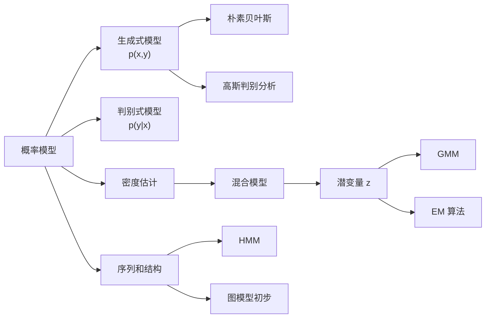
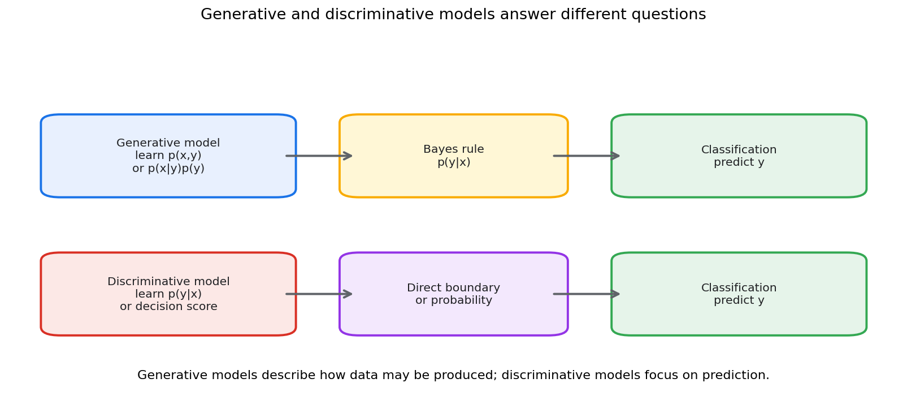
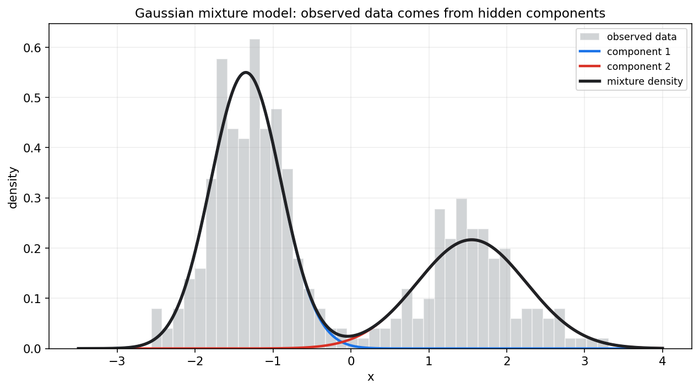
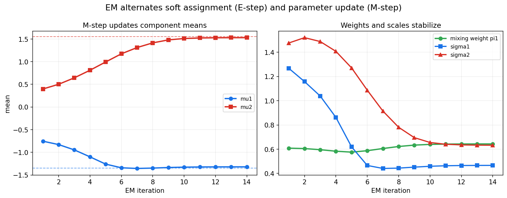
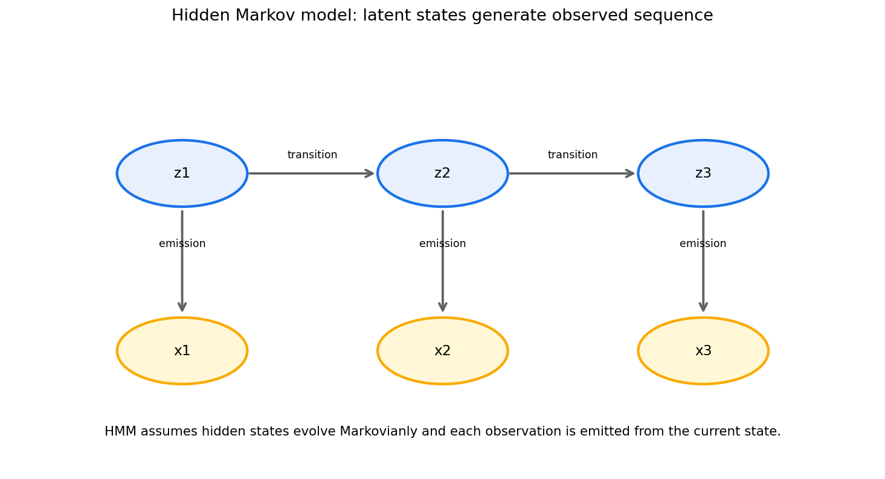

# 统计学习第十七章教程: 概率模型, 潜变量模型与 EM

> 前两章关注监督学习和泛化.  
> 第十七章换一个角度:
>
> 1. 数据是不是由某个概率机制生成的?
> 2. 看不见的类别, 状态或结构能不能写进模型?
> 3. 当有隐藏变量时, 参数该怎样估计?
> 4. EM 算法到底在交替优化什么?
>
> 本章连接统计学习, 贝叶斯建模和概率图模型.

---

## 0. 先看全章主线

一句话概括:

> 概率模型试图描述数据生成机制,  
> 潜变量模型把看不见的结构也纳入其中,  
> EM 则是在不完全观测下做估计的一条经典路线.

---

## 1. 生成式模型与判别式模型

### 1.1 判别式模型

判别式模型直接学习:

$$
p(y\mid x)
$$

或直接学习决策边界:

$$
f(x)
$$

典型例子:

- Logistic 回归
- SVM
- 神经网络分类器

它们重点回答:

> 给定输入 $x$, 标签 $y$ 是什么?

### 1.2 生成式模型

生成式模型学习联合分布:

$$
p(x,y)
$$

或分解为:

$$
p(x\mid y)p(y)
$$

然后用贝叶斯公式得到:

$$
p(y\mid x)=\frac{p(x\mid y)p(y)}{p(x)}
$$

生成式模型重点回答:

> 如果类别是 $y$, 数据 $x$ 是怎样生成的?

### 1.3 二者差异

判别式模型通常分类性能强, 因为它直接优化预测目标.  
生成式模型提供更多结构信息, 可以做:

- 分类
- 采样
- 缺失值补全
- 异常检测
- 半监督学习

生成式不是只能生成, 它也能分类.

---

## 2. 朴素贝叶斯

### 2.1 条件独立假设

朴素贝叶斯假设给定类别后, 特征条件独立:

$$
p(x\mid y)=\prod_{j=1}^{p}p(x_j\mid y)
$$

于是:

$$
p(y\mid x)\propto p(y)\prod_{j=1}^{p}p(x_j\mid y)
$$

### 2.2 为什么叫朴素

因为特征条件独立假设通常很强, 现实中未必成立.

但朴素贝叶斯仍然常有用:

- 训练快
- 参数少
- 小数据下稳定
- 文本分类中表现不错

### 2.3 文本分类例子

在垃圾邮件分类中, 可以把单词是否出现看成特征.  
朴素贝叶斯估计:

$$
p(\text{word}\mid \text{spam})
$$

和:

$$
p(\text{word}\mid \text{not spam})
$$

再组合得到邮件属于垃圾邮件的后验概率.

### 2.4 平滑

如果某个词在训练集中从未出现, 直接估计会得到 0 概率.  
这会让整条乘积变成 0.

常用 Laplace smoothing:

$$
\hat p=\frac{\text{count}+\alpha}{\text{total}+\alpha V}
$$

其中 $V$ 是词表大小.

---

## 3. 高斯判别分析初步

### 3.1 模型形式

高斯判别分析假设:

$$
X\mid Y=k\sim \mathcal{N}(\mu_k,\Sigma_k)
$$

并估计类别先验:

$$
p(Y=k)
$$

分类时使用:

$$
p(Y=k\mid X=x)\propto p(x\mid Y=k)p(Y=k)
$$

### 3.2 LDA 和 QDA

如果各类别共享协方差矩阵:

$$
\Sigma_k=\Sigma
$$

得到 LDA, 决策边界是线性的.

如果每类有自己的协方差:

$$
\Sigma_k
$$

得到 QDA, 决策边界可以是二次曲线.

### 3.3 和 Logistic 回归的关系

在某些高斯假设下, 生成式的 LDA 会导出线性 log odds.  
Logistic 回归则直接建模 log odds.

这说明不同建模路线可能得到相似形式, 但假设不同.

---

## 4. 密度估计

### 4.1 密度估计在问什么

监督学习问:

$$
p(y\mid x)
$$

密度估计问:

$$
p(x)
$$

也就是数据本身在空间中如何分布.

### 4.2 参数密度估计

假设数据来自某个参数族:

$$
x_i\sim p(x\mid \theta)
$$

再估计 $\theta$.

例如单高斯密度:

$$
X\sim \mathcal{N}(\mu,\Sigma)
$$

### 4.3 非参数密度估计

如果不想指定固定参数族, 可以用:

- 直方图
- kernel density estimation
- kNN density

非参数方法更灵活, 但需要更多数据, 并且高维时很困难.

---

## 5. 混合模型与潜变量

### 5.1 混合模型

混合模型假设数据来自多个成分:

$$
p(x)=\sum_{k=1}^{K}\pi_k p_k(x)
$$

其中:

- $\pi_k\ge 0$
- $\sum_k\pi_k=1$
- $p_k(x)$ 是第 $k$ 个成分分布

### 5.2 潜变量

引入隐藏变量:

$$
Z_i\in\{1,\dots,K\}
$$

表示第 $i$ 个样本来自哪个成分.

完整生成过程是:

1. 先抽成分:

$$
Z_i\sim \mathrm{Categorical}(\pi)
$$

2. 再从该成分生成数据:

$$
X_i\mid Z_i=k\sim p_k(x)
$$

潜变量 $Z_i$ 看不见, 但它帮助解释数据结构.

---

## 6. 高斯混合模型 GMM

### 6.1 模型形式

GMM 假设每个成分是高斯分布:

$$
p(x)=\sum_{k=1}^{K}\pi_k\mathcal{N}(x\mid \mu_k,\Sigma_k)
$$

它可以表达多峰分布.

图中黑线是总密度, 蓝线和红线是两个隐藏成分的加权密度.

### 6.2 软聚类

GMM 不只是给每个点硬分配一个类别.  
它计算责任度:

$$
r_{ik}=P(Z_i=k\mid x_i)
$$

也就是第 $i$ 个样本来自第 $k$ 个成分的后验概率.

### 6.3 和 K-means 的关系

K-means 可以看作某种极限下的硬聚类版本.  
GMM 更概率化:

- 有成分权重
- 有协方差
- 有软责任度
- 能给数据密度

---

## 7. EM 算法

### 7.1 为什么需要 EM

如果潜变量 $Z$ 可见, 参数估计通常简单.  
但真实情况中只观察到 $X$, 看不到 $Z$.

这叫不完全数据问题.

EM 用交替步骤解决:

- E-step: 根据当前参数估计潜变量后验
- M-step: 用这些软分配更新参数

### 7.2 E-step

对 GMM, E-step 计算责任度:

$$
r_{ik}=
\frac{\pi_k\mathcal{N}(x_i\mid\mu_k,\Sigma_k)}
{\sum_{l=1}^{K}\pi_l\mathcal{N}(x_i\mid\mu_l,\Sigma_l)}
$$

这是软标签.

### 7.3 M-step

用责任度更新参数:

$$
N_k=\sum_{i=1}^{n}r_{ik}
$$

$$
\pi_k=\frac{N_k}{n}
$$

$$
\mu_k=\frac{1}{N_k}\sum_{i=1}^{n}r_{ik}x_i
$$

协方差也用责任度加权更新.

### 7.4 EM 迭代图

图中可以看到, 成分均值, 权重和尺度在迭代中逐渐稳定.

### 7.5 EM 在优化什么

EM 最大化观测数据似然:

$$
\log p(X\mid \theta)
$$

但它通过引入潜变量后验构造下界, 交替提升这个下界.

因此 EM 不是简单的"先猜标签再算均值", 而是一种坐标式优化思想.

### 7.6 局部最优和初始化

EM 通常只能保证似然不下降, 不能保证全局最优.  
初始化会影响结果.

实践中常用多次随机初始化, 选取似然最高的结果.

---

## 8. 隐马尔可夫模型 HMM

### 8.1 序列中的潜变量

HMM 用于序列数据.  
它假设有隐藏状态:

$$
Z_1,Z_2,\dots,Z_T
$$

以及观测:

$$
X_1,X_2,\dots,X_T
$$

隐藏状态按 Markov 链演化:

$$
p(Z_t\mid Z_{t-1},Z_{t-2},\dots)=p(Z_t\mid Z_{t-1})
$$

每个观测由当前隐藏状态生成:

$$
p(X_t\mid Z_t)
$$

### 8.2 HMM 的三个经典问题

1. **评估**
   - 给定模型, 计算观测序列概率
   - 常用 forward algorithm

2. **解码**
   - 给定观测, 找最可能隐藏状态序列
   - 常用 Viterbi algorithm

3. **学习**
   - 从数据估计转移和发射参数
   - 常用 Baum-Welch, 本质上是 EM

### 8.3 应用

HMM 可用于:

- 语音识别历史模型
- 词性标注
- 生物序列分析
- 用户行为状态建模
- 故障状态识别

---

## 9. 图模型初步

### 9.1 为什么需要图

复杂概率模型常包含许多变量.  
直接写联合分布很困难.

图模型用图结构表示条件依赖关系.

### 9.2 有向图模型

有向图模型把联合分布分解为:

$$
p(x_1,\dots,x_p)=\prod_{j=1}^{p}p(x_j\mid \mathrm{pa}(x_j))
$$

其中 $\mathrm{pa}(x_j)$ 是节点 $j$ 的父节点.

Bayesian network 是典型有向图模型.

### 9.3 无向图模型

无向图模型用势函数描述局部相互作用:

$$
p(x)\propto \prod_{c}\psi_c(x_c)
$$

典型例子包括 Markov random field 和条件随机场.

### 9.4 图模型的价值

图模型帮助我们:

- 表达条件独立
- 分解复杂联合分布
- 设计推断算法
- 解释变量关系结构

---

## 10. 本章主线总结

第十七章可以压成几句话:

1. 判别式模型直接学习 $p(y|x)$ 或决策边界.
2. 生成式模型学习 $p(x,y)$ 或 $p(x|y)p(y)$, 可用于分类和生成.
3. 朴素贝叶斯通过条件独立假设简化建模.
4. 高斯判别分析用类条件高斯分布做分类.
5. 混合模型用多个成分解释多峰数据.
6. 潜变量表示看不见的类别, 状态或结构.
7. GMM 是连续数据混合模型的经典例子.
8. EM 在潜变量不可见时交替做软分配和参数更新.
9. HMM 把潜变量放进时间序列.
10. 图模型用结构表达条件依赖和联合分布分解.

核心提醒:

> 概率模型不是只为了预测标签,  
> 它还试图解释数据如何产生, 以及隐藏结构如何影响观测.

---

## 11. 实战清单与典型误区

### 11.1 实战清单

1. 明确目标是分类, 密度估计还是生成.
2. 判断是否需要建模 $p(x)$ 或 $p(x,y)$.
3. 检查条件独立假设是否合理.
4. 使用混合模型时, 明确成分数选择依据.
5. 多次初始化 EM, 防止局部最优.
6. 检查责任度是否有解释意义.
7. 序列数据考虑状态转移结构.
8. 使用图模型时, 先画依赖关系.
9. 注意潜变量不可辨识问题.
10. 不要把生成式模型误解为只能生成样本.

### 11.2 典型误区

1. **把生成式理解成不能分类**  
   生成式模型可通过贝叶斯公式得到分类规则.

2. **只背 EM 的 E 步和 M 步**  
   EM 的核心是处理潜变量导致的不完全数据似然.

3. **忽略初始化**  
   EM 可能收敛到局部最优, 初始化很重要.

4. **把聚类成分当真实类别**  
   GMM 成分是模型结构, 不一定对应现实类别.

5. **忽略不可辨识性**  
   混合模型中的标签交换意味着成分编号本身没有绝对意义.

---

## 12. 和前后章节的连接点

第十六章关注监督学习模型和决策边界.  
本章转向概率生成机制和隐藏结构.

第十八章会进入深度学习中的概率统计视角.  
VAE, diffusion 和生成模型都可以看作本章概率建模思想的现代扩展.

---

## 13. 本章收尾

潜变量模型的思想很朴素:

> 观测数据背后可能有看不见的结构.

EM, HMM 和图模型提供了把这些隐藏结构写进概率模型并进行推断的基本语言.  
这也是许多现代生成模型和表示学习方法的统计根基.
