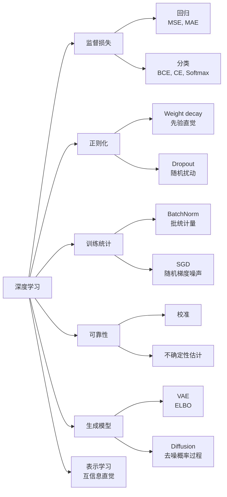
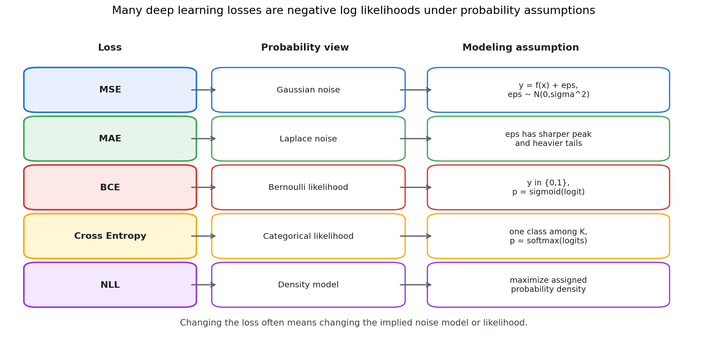
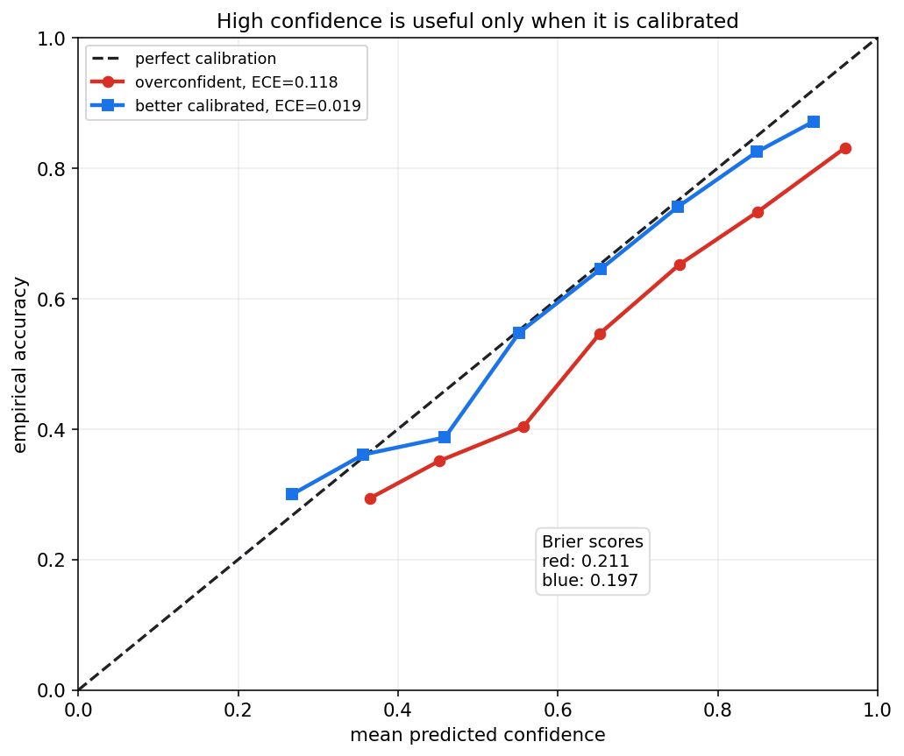
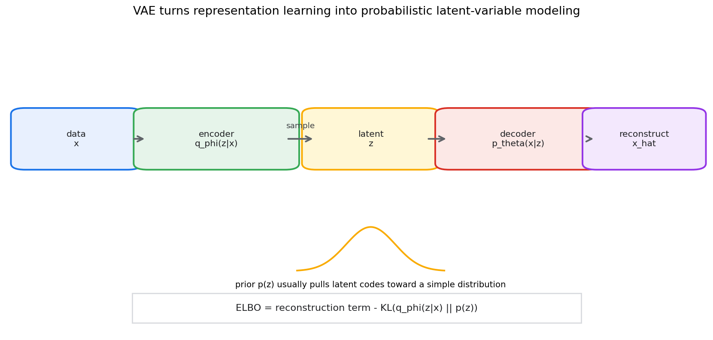
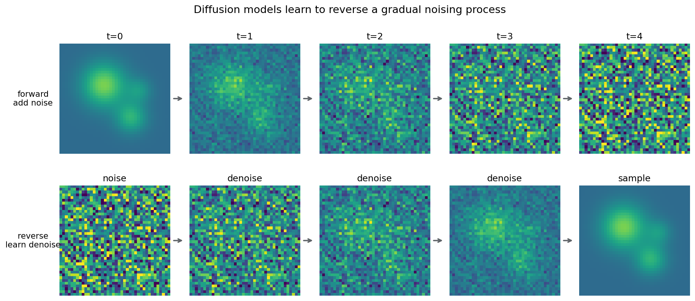

# 统计学习第十八章教程: 深度学习中的概率统计视角

> 前面几章已经讲过经验风险, 泛化, 正则化, 概率模型和潜变量模型.  
> 第十八章把这些语言接到深度学习:
>
> 1. 为什么 MSE, MAE, BCE, Cross Entropy 不是随便选的损失?
> 2. Softmax 输出为什么能看成概率, 又为什么不一定可靠?
> 3. 正则化, Dropout, BatchNorm 和 SGD 噪声背后有什么统计直觉?
> 4. 校准和不确定性为什么是深度模型落地时绕不开的问题?
> 5. VAE 和 Diffusion 怎样从概率建模角度理解?
>
> 本章不是深度学习教程, 而是给深度学习补上一层概率统计解释.

---

## 0. 先看全章主线

一句话概括:

> 深度学习里的很多目标函数, 归一化, 随机训练技巧和生成模型,  
> 都可以回到似然, 先验, 后验, 熵, KL, 抽样误差和泛化这套语言里理解.

---

## 1. 为什么要用概率统计视角看深度学习

### 1.1 神经网络首先是函数族

给定参数 $\theta$, 神经网络定义一个函数:

$$
f_\theta(x)
$$

它可以输出:

- 回归预测值
- 分类 logit
- 概率分布参数
- 图像, 文本或其他结构化对象

从统计学习角度看, 神经网络只是一个非常大的假设空间.  
训练是在这个函数族里寻找让经验风险较小, 同时能泛化的参数.

### 1.2 损失函数不是纯工程选择

深度学习常说:

> 训练模型就是最小化 loss.

但概率统计会继续追问:

> 这个 loss 对应什么数据生成假设?

很多常见损失都可以写成负对数似然:

$$
\mathcal{L}(\theta)=-\sum_{i=1}^{n}\log p_\theta(y_i\mid x_i)
$$

因此, 损失函数不仅是优化目标, 也是模型对噪声和数据分布的假设.

### 1.3 深度学习并没有绕开不确定性

深度模型参数多, 表达能力强, 但它仍然面对:

- 数据是有限样本
- 标签可能有噪声
- 训练集和测试集可能不同分布
- 模型输出概率可能不校准
- 高维空间中会出现分布外样本

所以概率统计不是深度学习的附属品, 而是理解可靠性和泛化的核心语言.

---

## 2. 回归损失与噪声假设

### 2.1 MSE 对应高斯噪声

回归中常用平方损失:

$$
\mathcal{L}_{\text{MSE}}=\sum_{i=1}^{n}(y_i-f_\theta(x_i))^2
$$

如果假设:

$$
y_i=f_\theta(x_i)+\varepsilon_i,\qquad
\varepsilon_i\sim \mathcal{N}(0,\sigma^2)
$$

那么条件密度为:

$$
p(y_i\mid x_i,\theta)
=\frac{1}{\sqrt{2\pi}\sigma}
\exp\left(
-\frac{(y_i-f_\theta(x_i))^2}{2\sigma^2}
\right)
$$

取负对数并忽略常数后, 就得到平方损失:

$$
-\log p(y_i\mid x_i,\theta)
=\frac{1}{2\sigma^2}(y_i-f_\theta(x_i))^2+\text{const}
$$

所以 MSE 隐含的直觉是:

> 误差围绕 0 对称, 大误差按平方受到更重惩罚, 噪声像高斯分布.

### 2.2 MAE 对应 Laplace 噪声

绝对误差损失为:

$$
\mathcal{L}_{\text{MAE}}=\sum_{i=1}^{n}|y_i-f_\theta(x_i)|
$$

如果误差服从 Laplace 分布:

$$
p(\varepsilon)\propto \exp\left(-\frac{|\varepsilon|}{b}\right)
$$

那么负对数似然就对应绝对误差.

MAE 相比 MSE 对异常值更稳健, 因为大误差不会被平方放大.  
这不是说 MAE 一定更好, 而是它表达了另一种噪声假设.

### 2.3 损失和概率假设对照

选择损失时可以问三个问题:

1. 输出变量是连续值, 二分类标签, 多分类标签, 还是概率分布?
2. 噪声是否近似对称, 是否有重尾, 是否有异常值?
3. 模型输出的是点预测, 还是分布参数?

如果模型输出均值和方差:

$$
y\mid x\sim \mathcal{N}(\mu_\theta(x),\sigma_\theta^2(x))
$$

就不再只是做点预测, 而是在估计条件分布.

---

## 3. BCE, Cross Entropy 与分类似然

### 3.1 二分类和 Bernoulli 似然

二分类标签:

$$
y_i\in\{0,1\}
$$

模型输出:

$$
p_i=P_\theta(Y=1\mid x_i)
$$

Bernoulli 似然为:

$$
p_\theta(y_i\mid x_i)=p_i^{y_i}(1-p_i)^{1-y_i}
$$

负对数似然为:

$$
-\log p_\theta(y_i\mid x_i)
=-\left[
y_i\log p_i+(1-y_i)\log(1-p_i)
\right]
$$

这就是 binary cross entropy.

### 3.2 多分类和 Categorical 似然

多分类中:

$$
y_i\in\{1,\dots,K\}
$$

模型输出一个概率向量:

$$
p_\theta(y=k\mid x_i)=p_{ik}
$$

若真实类别是 $c_i$, 则负对数似然为:

$$
-\log p_{i,c_i}
$$

如果把标签写成 one-hot 向量 $y_{ik}$, 则交叉熵为:

$$
\mathcal{L}_{\text{CE}}
=-\sum_{i=1}^{n}\sum_{k=1}^{K}y_{ik}\log p_{ik}
$$

这就是多分类负对数似然.

### 3.3 交叉熵和 KL

对真实分布 $p$ 和模型分布 $q$:

$$
H(p,q)=H(p)+KL(p\|q)
$$

训练时真实分布固定, 最小化交叉熵等价于最小化:

$$
KL(p\|q)
$$

所以分类训练不仅是在让正确类分数变大, 也是在让模型预测分布接近数据标签分布.

### 3.4 标签平滑

普通 one-hot 标签把正确类概率设为 1, 其他类设为 0.  
标签平滑会改成:

$$
y_k^{\text{smooth}}=
\begin{cases}
1-\alpha, & k=c \\
\alpha/(K-1), & k\ne c
\end{cases}
$$

它的直觉是:

- 不把标签当成绝对确定
- 避免模型过度自信
- 在部分类别边界模糊时更稳定

但标签平滑也可能降低模型对真实置信度的表达能力, 需要结合任务验证.

---

## 4. Softmax 的概率解释

### 4.1 从 logits 到概率

神经网络分类头通常先输出 logits:

$$
z_1,\dots,z_K
$$

Softmax 把它们变成概率:

$$
p_k=\frac{\exp(z_k)}{\sum_{j=1}^{K}\exp(z_j)}
$$

它满足:

$$
p_k\ge 0,\qquad \sum_{k=1}^{K}p_k=1
$$

因此可以把 $p_k$ 解释成:

$$
P_\theta(Y=k\mid x)
$$

### 4.2 logits 的相对性

Softmax 只关心 logits 的相对差异.  
如果给所有 logits 加同一个常数:

$$
z_k' = z_k+c
$$

Softmax 输出不变.

真正影响概率的是类别之间的差:

$$
z_a-z_b
$$

这也是为什么分类模型的 logit margin 会影响置信度.

### 4.3 温度参数

带温度的 Softmax 为:

$$
p_k(T)=\frac{\exp(z_k/T)}{\sum_{j=1}^{K}\exp(z_j/T)}
$$

当 $T$ 较大, 概率更平滑.  
当 $T$ 较小, 概率更尖锐.

温度缩放常用于后处理校准:

$$
T^\star=\arg\min_T \text{NLL}_{\text{validation}}(T)
$$

注意, Softmax 输出形式上是概率, 但不保证是可靠概率.

---

## 5. 正则化, Dropout 与先验直觉

### 5.1 Weight decay 和高斯先验

深度学习常用 weight decay:

$$
\mathcal{L}(\theta)
=-\sum_{i=1}^{n}\log p_\theta(y_i\mid x_i)
+\lambda\|\theta\|_2^2
$$

从 MAP 角度看, 如果参数先验为:

$$
\theta_j\sim \mathcal{N}(0,\tau^2)
$$

那么负 log prior 会给出 L2 惩罚:

$$
-\log p(\theta)\propto \|\theta\|_2^2
$$

所以 weight decay 的统计直觉是:

> 在没有足够数据支持时, 不希望参数离 0 太远.

### 5.2 L1 正则和稀疏先验

L1 正则:

$$
\lambda\|\theta\|_1
$$

对应 Laplace 型先验:

$$
p(\theta_j)\propto e^{-\lambda|\theta_j|}
$$

它更倾向于稀疏解.  
在深度网络中, L1 不是最常见选择, 但在特征选择, 稀疏连接或可解释模型中仍有意义.

### 5.3 Dropout 的随机扰动直觉

Dropout 在训练时随机屏蔽一部分神经元:

$$
h' = m\odot h,\qquad m_j\sim \text{Bernoulli}(q)
$$

它的作用可以从几个角度理解:

- 防止单个特征通道过度依赖其他通道
- 给网络加入随机扰动, 类似训练许多子网络的平均效果
- 在某些近似下, 可以和贝叶斯模型平均建立联系

这里要保持边界:  
普通 Dropout 不是完整贝叶斯推断, 但它提供了一种随机模型平均的直觉.

### 5.4 数据增强也是先验

图像翻转, 裁剪, 颜色扰动, 文本替换等数据增强, 本质上表达了对任务不变性的先验:

> 如果某些变换不改变标签, 模型就应该学会对这些变换不敏感.

这和概率统计中的建模假设类似.  
区别只是它通过训练数据分布的扰动来实现.

---

## 6. BatchNorm 与统计量

### 6.1 批均值和批方差

Batch Normalization 对一个 mini-batch 中的激活计算:

$$
\mu_B=\frac{1}{m}\sum_{i=1}^{m}x_i
$$

$$
\sigma_B^2=\frac{1}{m}\sum_{i=1}^{m}(x_i-\mu_B)^2
$$

再标准化:

$$
\hat x_i=\frac{x_i-\mu_B}{\sqrt{\sigma_B^2+\epsilon}}
$$

最后做可学习的仿射变换:

$$
y_i=\gamma \hat x_i+\beta
$$

这里的 $\mu_B$ 和 $\sigma_B^2$ 就是样本统计量.

### 6.2 训练和推理不一样

训练时, BatchNorm 使用当前 batch 的均值和方差.  
推理时, 通常使用训练过程中维护的 running mean 和 running variance.

这带来几个实践问题:

- batch 太小时, 统计量噪声大
- 训练和推理数据分布不一致时, running statistics 可能失效
- 分布式训练中, 不同设备上的 batch statistics 可能不同

所以 BatchNorm 不只是一个层, 也是一个依赖抽样统计稳定性的机制.

### 6.3 BatchNorm 的正则化效果

由于每个 mini-batch 的均值和方差都有随机波动, BatchNorm 会给训练过程引入噪声.  
这种噪声有时能改善泛化.

但这不是无条件成立.  
在小 batch, 序列模型, 强分布偏移或精确数值任务中, LayerNorm, GroupNorm 或不使用归一化可能更合适.

---

## 7. SGD 噪声与泛化直觉

### 7.1 mini-batch 梯度是随机估计

总体经验风险梯度为:

$$
\nabla R_n(\theta)
=\frac{1}{n}\sum_{i=1}^{n}\nabla \ell_i(\theta)
$$

mini-batch 梯度为:

$$
g_B(\theta)
=\frac{1}{|B|}\sum_{i\in B}\nabla \ell_i(\theta)
$$

如果 batch 是随机抽取的, 那么:

$$
\mathbb{E}[g_B(\theta)]=\nabla R_n(\theta)
$$

但每次更新都有随机波动.

### 7.2 batch size 和学习率影响噪声

batch size 越小, 梯度估计方差通常越大.  
学习率越大, 每次随机波动对参数的影响越大.

这解释了为什么下面这些量会共同影响训练:

- batch size
- learning rate
- momentum
- weight decay
- gradient clipping
- warmup 和 decay schedule

它们不是孤立超参数, 而是在共同塑造优化轨迹和隐式正则化.

### 7.3 平坦极小值直觉

深度网络可能有很多训练误差相近的解.  
有些解周围很尖锐, 参数轻微变化就让损失大幅上升.  
有些解周围较平坦, 参数扰动后损失变化较小.

SGD 噪声可能让模型更不容易停在过尖的极小值附近.  
这只是直觉而不是万能定理, 但有助于理解为什么随机训练过程会影响泛化.

---

## 8. 校准与置信度

### 8.1 准确率和置信度不同

分类模型输出:

$$
\max_k p_\theta(Y=k\mid x)
$$

通常被称为 confidence.  
但置信度高不等于预测可靠.

一个模型如果在所有置信度约为 0.8 的样本中, 实际正确率也约为 0.8, 则它在这个区间是校准的.

### 8.2 可靠性图

可靠性图把样本按预测置信度分桶, 比较:

- 横轴: 平均预测置信度
- 纵轴: 实际正确率

如果曲线贴近对角线, 说明预测概率更接近真实正确率.  
如果曲线低于对角线, 模型通常过度自信.

### 8.3 常见校准指标

Expected Calibration Error 可写成:

$$
\text{ECE}=\sum_{b=1}^{B}\frac{|S_b|}{n}
\left|\text{acc}(S_b)-\text{conf}(S_b)\right|
$$

Brier score 为:

$$
\text{Brier}=\frac{1}{n}\sum_{i=1}^{n}(p_i-y_i)^2
$$

在多分类中, Brier score 可以扩展到概率向量.

校准方法包括:

- temperature scaling
- Platt scaling
- isotonic regression
- deep ensemble
- 后验预测平均

校准通常要在验证集上做, 不能用测试集调.

---

## 9. 不确定性估计

### 9.1 两类不确定性

常见区分是:

1. Aleatoric uncertainty: 数据自身噪声导致的不确定性
2. Epistemic uncertainty: 模型知识不足导致的不确定性

例如医学影像中, 图像模糊或标签边界不清属于 aleatoric.  
训练集中几乎没有某类病例, 模型不知道该怎么判断, 属于 epistemic.

### 9.2 回归中的异方差建模

如果噪声大小随输入变化, 可以让模型同时输出:

$$
\mu_\theta(x),\qquad \sigma_\theta^2(x)
$$

并设:

$$
y\mid x\sim \mathcal{N}(\mu_\theta(x),\sigma_\theta^2(x))
$$

负对数似然为:

$$
\mathcal{L}
=\frac{(y-\mu_\theta(x))^2}{2\sigma_\theta^2(x)}
+\frac{1}{2}\log\sigma_\theta^2(x)+\text{const}
$$

这个目标会惩罚两种行为:

- 预测均值错得很离谱
- 盲目把方差预测得很大

### 9.3 模型不确定性方法

估计 epistemic uncertainty 的常见方法包括:

- 深度集成: 训练多个模型, 比较预测差异
- MC Dropout: 推理时保留 Dropout, 多次采样
- Bayesian neural network: 对权重建后验分布
- Laplace approximation: 在最优点附近近似后验

这些方法成本和假设不同.  
工程上深度集成常常简单有效, 但训练成本较高.

### 9.4 分布外样本

一个模型在训练分布内校准, 不代表它能识别分布外样本.  
分布外输入可能让 Softmax 仍然输出很高置信度.

所以可靠系统通常需要额外机制:

- OOD detection
- abstention 或 reject option
- 人工复核策略
- 数据漂移监控
- 周期性再校准

---

## 10. VAE 中的概率建模与 ELBO

### 10.1 潜变量生成模型

VAE 假设数据由潜变量生成:

$$
z\sim p(z)
$$

$$
x\sim p_\theta(x\mid z)
$$

联合分布为:

$$
p_\theta(x,z)=p(z)p_\theta(x\mid z)
$$

目标是最大化边缘似然:

$$
p_\theta(x)=\int p(z)p_\theta(x\mid z)\,dz
$$

但这个积分通常难以直接计算.

### 10.2 近似后验

VAE 引入 encoder:

$$
q_\phi(z\mid x)
$$

来近似真实后验:

$$
p_\theta(z\mid x)
$$

因此 VAE 同时学习:

- decoder: 生成模型 $p_\theta(x\mid z)$
- encoder: 近似推断模型 $q_\phi(z\mid x)$

### 10.3 ELBO

VAE 最大化 evidence lower bound:

$$
\log p_\theta(x)
\ge
\mathbb{E}_{q_\phi(z\mid x)}[\log p_\theta(x\mid z)]
-KL(q_\phi(z\mid x)\|p(z))
$$

第一项是重构项, 鼓励 $z$ 保留能解释 $x$ 的信息.  
第二项是 KL 正则, 鼓励近似后验不要偏离先验太远.

### 10.4 重参数化技巧

如果:

$$
q_\phi(z\mid x)=\mathcal{N}(\mu_\phi(x),\sigma_\phi^2(x))
$$

可以写成:

$$
z=\mu_\phi(x)+\sigma_\phi(x)\odot \epsilon,\qquad
\epsilon\sim\mathcal{N}(0,I)
$$

这样随机性来自 $\epsilon$, 参数 $\phi$ 仍可通过梯度优化.

### 10.5 VAE 的统计直觉

VAE 可以看成:

> 用神经网络参数化潜变量概率模型, 再用变分推断近似后验.

它不是只会做图像生成的技巧, 而是第十三章和第十七章思想在深度模型中的实现.

---

## 11. Diffusion 模型的噪声视角初步

### 11.1 前向加噪过程

Diffusion 模型从一个逐步加噪过程开始.  
简单写作:

$$
q(x_t\mid x_{t-1})
=\mathcal{N}(\sqrt{1-\beta_t}x_{t-1},\beta_t I)
$$

随着 $t$ 增大, 数据逐渐接近噪声.

### 11.2 反向去噪过程

生成时从噪声开始:

$$
x_T\sim \mathcal{N}(0,I)
$$

然后学习反向过程:

$$
p_\theta(x_{t-1}\mid x_t)
$$

逐步去噪得到样本.

### 11.3 为什么可以训练成预测噪声

很多扩散模型训练目标会让网络预测加到样本上的噪声:

$$
\epsilon_\theta(x_t,t)\approx \epsilon
$$

常见简化目标为:

$$
\mathbb{E}_{x_0,\epsilon,t}
\left[
\|\epsilon-\epsilon_\theta(x_t,t)\|_2^2
\right]
$$

这和高斯噪声假设, 条件均值估计, 变分下界都有关系.  
完整推导较长, 本章只强调概率主线:

> 先定义一个容易采样的前向随机过程,  
> 再训练神经网络近似它的反向条件分布.

### 11.4 不要混淆数学目标和视觉效果

Diffusion 生成效果好, 不代表训练目标只是为了让图像好看.  
它背后仍然是概率建模, 去噪估计和近似似然优化.

工程中的采样器, guidance, scheduler 会显著影响结果, 但它们是在这个概率框架上继续做近似和控制.

---

## 12. 表示学习与互信息直觉

### 12.1 什么是表示

神经网络中间层会把原始输入变成表示:

$$
h=f_\theta(x)
$$

好的表示通常希望:

- 保留和任务 $Y$ 有关的信息
- 丢掉和任务无关的噪声
- 对合理变换保持稳定
- 在下游任务中容易线性分离或建模

### 12.2 互信息视角

互信息衡量两个变量共享的信息:

$$
I(X;Y)=H(Y)-H(Y\mid X)
$$

表示学习可以用一种直觉来理解:

> 希望表示 $H$ 对标签 $Y$ 信息量大, 对无关扰动信息量小.

这不是说实际训练总是直接最大化互信息.  
很多方法只是间接实现这种目标.

### 12.3 对比学习

对比学习常构造正样本对和负样本对:

- 同一图像的两种增强视图是正样本
- 不同图像通常作为负样本

目标是让正样本表示接近, 负样本表示分开.

概率统计语言下, 这和密度比估计, 信息下界和分类式目标有关.  
实践中更重要的是明白增强策略表达了什么不变性假设.

---

## 13. 实战清单

训练或评估深度模型时, 可以按下面顺序检查:

1. 输出变量类型是否和损失匹配?
2. 损失函数隐含的噪声假设是否合理?
3. 分类任务是否需要校准, 是否要报告 ECE 或 Brier score?
4. 是否存在类别不平衡, 标签噪声或分布偏移?
5. 正则化强度, 数据增强和 weight decay 是否在验证集上验证?
6. BatchNorm 的 batch size 和推理统计量是否稳定?
7. 学习率, batch size 和梯度噪声是否共同调试?
8. 是否需要区分 aleatoric 和 epistemic uncertainty?
9. 生成模型指标是否同时覆盖似然, 样本质量和多样性?
10. 是否有分布外检测, 拒识或人工复核流程?

---

## 14. 典型易错点

### 14.1 只把 loss 当成可调函数

loss 背后通常有概率假设.  
如果假设和数据不匹配, 训练仍然可能收敛, 但结论不一定可靠.

### 14.2 把 Softmax 输出当成真实概率

Softmax 保证输出非负且和为 1, 但不保证校准.  
过拟合模型, 分布外样本和标签噪声都可能导致高置信错误.

### 14.3 混淆准确率和可靠性

两个模型准确率相同, 校准水平可能差很多.  
在医疗, 金融, 自动驾驶等场景, 概率可靠性和错误代价同样重要.

### 14.4 把 Dropout 当作完整贝叶斯方法

Dropout 可以提供随机模型平均直觉, MC Dropout 可以估计一部分不确定性.  
但它不等于完整后验推断, 也不能自动解决分布外可靠性问题.

### 14.5 只用样本好看评价生成模型

生成模型需要同时考虑:

- 样本质量
- 多样性
- 条件一致性
- 似然或近似似然
- 下游任务表现
- 安全和偏差风险

视觉效果只是其中一部分.

---

## 15. 本章小结

这一章把深度学习中常见对象重新翻译成概率统计语言:

- MSE 和 MAE 对应不同噪声假设
- BCE 和 Cross Entropy 是分类似然的负对数
- Softmax 给出概率形式, 但可靠性要靠校准检验
- 正则化和 Dropout 可以从先验和随机扰动角度理解
- BatchNorm 依赖 mini-batch 统计量
- SGD 的随机梯度噪声会影响优化和泛化
- 不确定性需要区分数据噪声和模型知识不足
- VAE 是神经网络化的潜变量模型和变分推断
- Diffusion 是学习反向去噪条件分布的生成模型
- 表示学习可以用信息保留和不变性来理解

到这里, 概率论, 数理统计, 贝叶斯和统计学习已经接到了现代深度学习.  
下一章会回到真实数据工作流: 怎样评估模型, 选择模型, 做决策, 并避免研究和工程中的常见统计陷阱.
