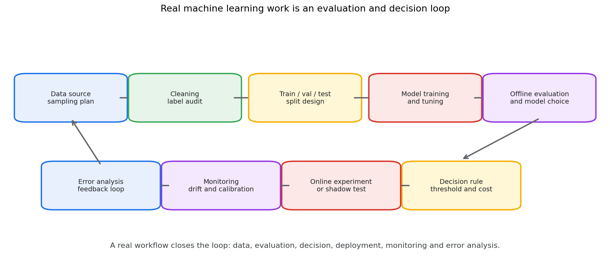
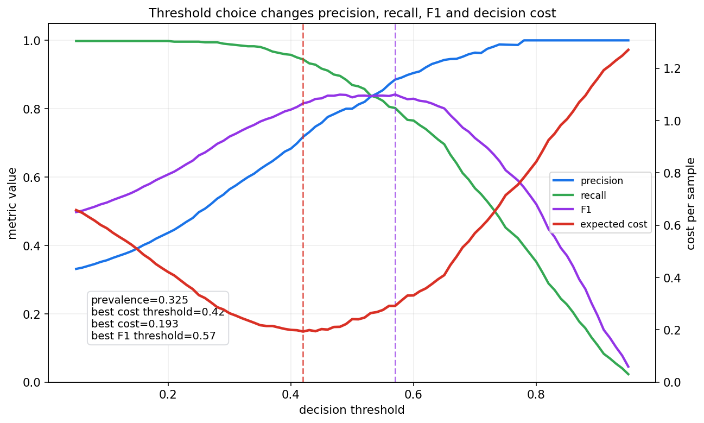
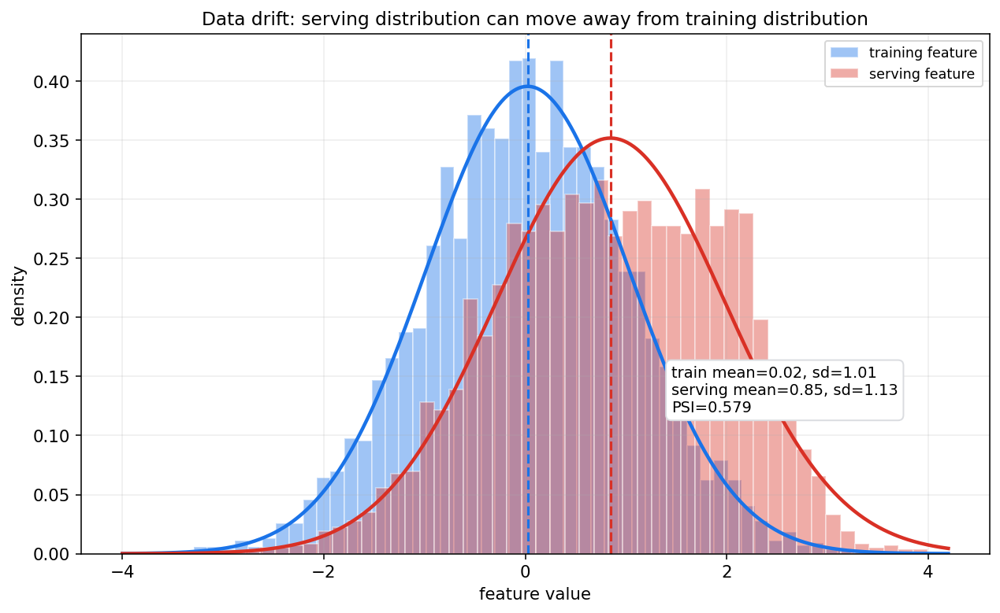
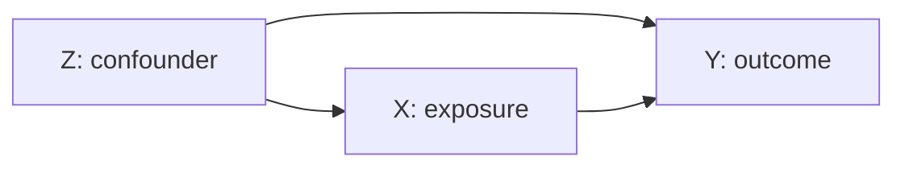
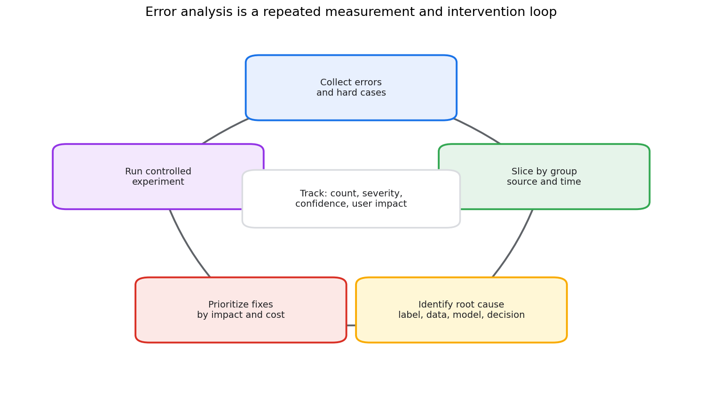

# 统计学习第十九章教程: 评估, 选择, 决策与真实数据工作流

> 前十八章已经建立了概率, 统计推断, 贝叶斯和统计学习的主线.  
> 最后一章回到真实项目:
>
> 1. 数据从哪里来, 样本是否代表目标总体?
> 2. 训练集, 验证集, 测试集应该怎样分?
> 3. 指标为什么不能脱离业务目标和错误代价?
> 4. 离线评估, 线上实验和模型监控怎样衔接?
> 5. 发现错误以后, 怎样系统分析和改进?
>
> 本章的目标不是再介绍一个模型, 而是把全书收束为真实数据工作流.

---

## 0. 先看全章主线

一句话概括:

> 真实数据工作不是训练一个模型就结束,  
> 而是从数据采集, 评估设计, 模型选择, 决策规则到上线监控形成闭环.

---

## 1. 为什么最后要讲工作流

### 1.1 模型训练只是中间环节

很多初学者会把机器学习项目理解成:

> 拿数据 -> 训练模型 -> 看准确率 -> 结束.

真实项目通常更像:

> 明确目标 -> 收集数据 -> 检查偏差 -> 设计切分 -> 训练多个候选模型 -> 选择指标 -> 评估不确定性 -> 设置决策阈值 -> 上线实验 -> 监控漂移 -> 分析错误 -> 回到数据和模型.

这一章把概率统计语言放到这个闭环里.

### 1.2 工作流里的核心统计问题

真实项目中最常见的问题不是公式不会推, 而是:

- 样本是否代表未来要服务的人群?
- 标签是否可靠?
- 验证集是否被反复调参污染?
- 测试集是否真的只用了一次?
- 指标是否和真实代价一致?
- 模型提升是否超过随机波动?
- 离线收益是否能转化为线上收益?
- 上线后分布是否变化?

这些问题都可以回到本教程前面讲过的概念:

- 总体与样本
- 抽样偏差
- 估计量和抽样分布
- 置信区间
- 假设检验和功效
- 泛化误差
- 校准和不确定性
- 决策风险

---

## 2. 数据采集与样本偏差

### 2.1 先定义目标总体

做数据分析前要先问:

> 我真正关心的是哪个总体?

例如:

- 电商推荐: 明天会访问平台的用户
- 医疗诊断: 目标医院未来接诊的患者
- 风控模型: 未来申请贷款的人群
- 工业质检: 下一批生产线上的产品

如果训练数据来自另一个群体, 模型离线表现可能很好, 上线表现却很差.

### 2.2 样本偏差

样本偏差指样本分布和目标总体分布系统性不同.

常见来源包括:

- 只采集活跃用户, 忽略沉默用户
- 只保留有标签样本, 忽略未标注样本
- 数据来自历史策略, 未来策略已经改变
- 某些群体更容易被观测到
- 缺失值不是随机缺失

第七章讲样本时强调过:

> 样本不是天然代表总体, 代表性来自采样机制.

### 2.3 标签噪声

标签也可能是随机变量.  
如果同一个样本交给不同标注者, 标签可能不同.

标签噪声来源包括:

- 标注标准不清
- 类别边界模糊
- 标注者水平不同
- 真实状态随时间变化
- 业务系统记录有延迟或错误

因此要记录:

- 标签来源
- 标注时间
- 标注者或规则版本
- 多标注者一致性
- 抽样复核结果

### 2.4 数据泄漏

数据泄漏是指训练过程使用了预测时不可获得的信息.

典型例子:

- 用未来信息构造当前特征
- 在全量数据上标准化后再划分训练和测试
- 同一个用户的高度相似样本同时出现在训练集和测试集
- 目标变量的后验结果被写进特征
- 根据测试集反复选择特征和模型

数据泄漏常常让离线指标虚高, 但上线后迅速失效.

---

## 3. 训练集, 验证集, 测试集再回顾

### 3.1 三者角色

训练集用于拟合参数:

$$
\hat\theta=\arg\min_\theta \hat R_{\text{train}}(\theta)
$$

验证集用于选择模型和超参数:

$$
\hat m=\arg\min_m \hat R_{\text{val}}(m)
$$

测试集用于估计最终泛化性能:

$$
\hat R_{\text{test}}(\hat m)
$$

三者不能混用.

### 3.2 验证集也会过拟合

如果反复在验证集上试模型, 选择验证指标最高的版本, 那么验证集也被间接训练了.

这会产生选择偏差:

$$
\mathbb{E}\left[\min_m \hat R_{\text{val}}(m)\right]
\le
\min_m R(m)
$$

候选模型越多, 这个偏差越明显.

实践上可以:

- 保留最终测试集, 只在最后使用
- 限制实验次数
- 记录所有实验, 不只记录最好结果
- 用嵌套交叉验证估计选择过程的误差

### 3.3 时间序列要按时间切分

如果任务有时间顺序, 随机切分可能导致未来信息泄漏到训练集.

例如:

- 金融风控
- 用户留存预测
- 库存预测
- 设备故障预测

这类任务通常要使用时间切分:

$$
\text{train time} < \text{validation time} < \text{test time}
$$

并且要模拟真实上线时能看到的特征.

### 3.4 分组切分

如果同一个用户, 病人, 商品或设备有多条样本, 切分时要按组划分.

否则同一主体的近似重复信息可能同时出现在训练集和测试集, 导致指标虚高.

---

## 4. Cross Validation

### 4.1 K 折交叉验证

K 折交叉验证把数据分成 $K$ 份.  
每次用 $K-1$ 份训练, 1 份验证, 最后取平均:

$$
\hat R_{\text{CV}}=\frac{1}{K}\sum_{k=1}^{K}\hat R_k
$$

它的优点是更充分利用有限数据.  
缺点是训练成本更高, 且仍然依赖切分方式是否合理.

### 4.2 什么时候适合交叉验证

适合:

- 数据量较小
- 样本近似独立同分布
- 训练成本可接受
- 需要稳定比较模型

不适合或要谨慎:

- 强时间依赖数据
- 同一主体有重复样本
- 数据分布随时间明显变化
- 训练一次成本很高的大模型

### 4.3 Stratified 和 Group CV

分类任务类别不平衡时, 常用 stratified CV 保持每折类别比例接近.

存在主体重复时, 要用 group CV, 保证同一主体不跨折.

时间序列任务则用 rolling 或 expanding window:

$$
\text{train}_{1:t}\rightarrow \text{validate}_{t+1:t+h}
$$

### 4.4 嵌套交叉验证

如果既要调参又要估计最终性能, 可以用 nested CV:

- 内层 CV 选择超参数
- 外层 CV 估计选择后的模型性能

它更严格, 但成本更高.

---

## 5. 评估指标选择

### 5.1 指标必须绑定任务目标

不同任务需要不同指标.

回归常见指标:

- MAE
- RMSE
- MAPE
- pinball loss
- negative log likelihood

分类常见指标:

- accuracy
- precision
- recall
- F1
- ROC-AUC
- PR-AUC
- log loss
- Brier score
- calibration error

排序和推荐常见指标:

- NDCG
- MAP
- MRR
- hit rate
- recall@K

生成模型常见评价:

- 似然或近似似然
- 样本质量
- 多样性
- 条件一致性
- 人工评估

没有一个指标适合所有任务.

### 5.2 Accuracy 的局限

如果正类只有 1%, 一个永远预测负类的模型准确率也有 99%.

这时更应该看:

- recall: 能找回多少正类
- precision: 报警中有多少是真的
- PR-AUC: 类别不平衡时比 ROC-AUC 更敏感
- 成本敏感指标: 误报和漏报代价不同

### 5.3 ROC-AUC 和 PR-AUC

ROC 曲线比较:

$$
\text{TPR}=\frac{TP}{TP+FN}
$$

和:

$$
\text{FPR}=\frac{FP}{FP+TN}
$$

PR 曲线比较 precision 和 recall.

当负类远多于正类时, ROC-AUC 可能看起来不错, 但 precision 仍然很低.  
所以稀有事件检测常常更重视 PR-AUC.

### 5.4 指标的置信区间

测试集指标也是样本统计量.  
如果测试集有限, 指标有抽样误差.

例如准确率:

$$
\hat p=\frac{\text{correct}}{n}
$$

可以近似给出标准误:

$$
\text{SE}(\hat p)=\sqrt{\frac{\hat p(1-\hat p)}{n}}
$$

复杂指标可以用 bootstrap 估计置信区间.

---

## 6. 阈值选择与成本敏感决策

### 6.1 概率输出不是最终决策

分类模型常输出:

$$
\hat p=P(Y=1\mid x)
$$

但实际业务需要动作:

- 是否拒绝贷款
- 是否报警
- 是否推荐
- 是否转人工复核
- 是否给优惠券

这需要决策阈值.

### 6.2 阈值影响指标

阈值升高通常会:

- precision 上升
- recall 下降
- false positive 减少
- false negative 增加

所以不能只问模型分数高不高, 还要问阈值怎么定.

### 6.3 成本敏感决策

假设:

- false positive 代价为 $C_{FP}$
- false negative 代价为 $C_{FN}$

对二分类概率 $\hat p=P(Y=1\mid x)$, 如果预测正类的期望代价低于预测负类, 就应该预测正类.

预测正类的错误代价:

$$
C_{FP}(1-\hat p)
$$

预测负类的错误代价:

$$
C_{FN}\hat p
$$

选择正类的条件为:

$$
C_{FP}(1-\hat p)<C_{FN}\hat p
$$

整理得到阈值:

$$
\hat p>\frac{C_{FP}}{C_{FP}+C_{FN}}
$$

如果漏报代价很高, 阈值应该降低.  
如果误报代价很高, 阈值应该升高.

### 6.4 风险分级

很多场景不需要只有两个动作.  
可以做风险分级:

- 低风险: 自动通过
- 中风险: 补充材料或延迟决策
- 高风险: 人工复核
- 极高风险: 自动拦截

这比单一阈值更贴近真实代价结构.

### 6.5 校准是决策前提

成本敏感阈值依赖 $\hat p$ 的概率意义.  
如果模型不校准, 阈值公式就会失真.

因此决策前要检查:

- reliability diagram
- ECE
- Brier score
- 分组校准
- 不同时间窗口校准

---

## 7. 校准与风险分级

### 7.1 总体校准不够

一个模型总体校准, 不代表每个子群体都校准.

例如:

- 新用户和老用户
- 不同地区
- 不同年龄段
- 不同设备
- 不同数据来源

都可能有不同的校准误差.

### 7.2 分组评估

分组评估要看:

- 样本量
- 指标均值
- 指标置信区间
- 错误类型
- 校准曲线
- 阈值下的业务代价

不能只看总体平均, 因为总体平均可能掩盖某些群体上的严重失败.

### 7.3 拒识和人工复核

如果模型不确定, 可以选择不自动决策.

常见策略:

- confidence 低于阈值时拒识
- OOD 分数异常时拒识
- 高风险但证据不足时转人工
- 多模型分歧大时转人工

拒识不是失败, 而是风险控制的一部分.

---

## 8. 模型比较与统计显著性

### 8.1 指标差异可能来自随机波动

假设两个模型在测试集上的准确率分别是:

$$
0.902,\qquad 0.906
$$

差异是 0.004.  
这可能是真提升, 也可能是测试集随机波动.

因此比较模型时要估计不确定性.

### 8.2 配对比较

如果两个模型在同一批样本上评估, 错误不是独立的.  
此时应使用配对比较思想.

常见方法:

- paired bootstrap
- McNemar test
- permutation test
- 对每个样本的 loss 差做置信区间

例如比较 log loss, 可以看:

$$
d_i=\ell_i(A)-\ell_i(B)
$$

再估计:

$$
\bar d=\frac{1}{n}\sum_{i=1}^{n}d_i
$$

如果 $\bar d$ 的置信区间明显大于 0, 说明 B 的 loss 更低.

### 8.3 多重比较

如果试了很多模型, 总会有一个看起来最好.

这和第九章的多重检验问题类似.  
候选越多, 偶然胜出的概率越大.

实践上要:

- 预先定义主要指标
- 记录所有候选模型
- 区分探索性实验和确认性实验
- 保留最终 holdout test
- 对关键结论做重复实验

### 8.4 效应量比 p 值更重要

统计显著不等于业务有意义.

一个巨大样本上, 0.01% 的指标提升也可能显著.  
但如果收益小于上线成本, 风险和维护成本, 就不值得上线.

所以模型比较要同时看:

- 指标提升
- 置信区间
- 错误类型变化
- 计算成本
- 延迟
- 可解释性
- 稳定性
- 业务收益和风险

---

## 9. 线上实验与离线评估

### 9.1 离线最优不等于线上最优

离线评估通常使用历史数据.  
线上系统会改变用户行为和数据分布.

例如推荐系统中, 新模型改变曝光内容, 用户点击分布也会随之改变.  
这意味着未来数据不再只是历史数据的独立重复.

### 9.2 A/B 实验

线上实验通常把用户随机分到:

- control: 旧策略
- treatment: 新策略

然后比较核心指标.

随机化的作用是让两组在期望上可比, 降低混杂因素影响.

### 9.3 实验设计问题

设计线上实验时要考虑:

- 随机化单位是用户, 会话, 设备还是请求
- 是否存在干扰, 如一个用户影响另一个用户
- 实验周期是否覆盖星期和节假日
- 指标是否有延迟反馈
- 是否需要 guardrail metrics
- 是否有早停规则
- 样本量是否足够

### 9.4 Guardrail metrics

主指标提升不代表系统整体更好.  
需要设置 guardrail metrics, 例如:

- 延迟不能显著增加
- 投诉率不能上升
- 转人工率不能异常
- 长期留存不能下降
- 风险事件不能增加

模型上线是决策问题, 不是单指标竞赛.

---

## 10. 数据漂移与概念漂移

### 10.1 数据漂移

数据漂移指输入分布变化:

$$
p_{\text{train}}(x)\ne p_{\text{serve}}(x)
$$

漂移可能来自:

- 用户群体变化
- 采集设备变化
- 季节性变化
- 业务策略变化
- 上游系统改版
- 外部环境变化

### 10.2 概念漂移

概念漂移指条件关系变化:

$$
p_{\text{train}}(y\mid x)\ne p_{\text{serve}}(y\mid x)
$$

例如:

- 欺诈者改变行为
- 用户兴趣变化
- 医疗诊疗标准更新
- 市场环境变化

概念漂移比单纯输入漂移更难发现, 因为它需要标签反馈.

### 10.3 监控什么

上线后至少监控:

- 输入特征分布
- 缺失率
- 类别比例
- 模型分数分布
- 预测类别比例
- 校准曲线
- 延迟标签上的真实指标
- 分组指标
- 业务 guardrail metrics

### 10.4 PSI 和分布距离

Population Stability Index 是常见漂移指标:

$$
\text{PSI}=\sum_b(q_b-p_b)\log\frac{q_b}{p_b}
$$

其中 $p_b$ 是训练分布在第 $b$ 个桶中的比例, $q_b$ 是线上分布比例.

PSI 只是告警信号, 不是因果解释.  
漂移出现后还要追踪具体数据源, 特征处理和业务变化.

---

## 11. 因果意识初步

### 11.1 相关不等于因果

模型能预测 $Y$, 不代表改变特征 $X$ 会改变 $Y$.

例如:

> 雨伞出现和下雨高度相关, 但发雨伞不会导致下雨.

这类问题在业务解释中很常见.

### 11.2 混杂变量

如果变量 $Z$ 同时影响 $X$ 和 $Y$, 直接看 $X$ 与 $Y$ 的关系可能误导.

简单写作:

如果不控制 $Z$, 可能把 $Z$ 的作用错归因给 $X$.

### 11.3 预测和干预不同

预测问题问:

$$
P(Y\mid X=x)
$$

因果问题问:

$$
P(Y\mid do(X=x))
$$

二者不是一回事.

本章只提醒因果意识.  
系统因果推断需要专门学习随机实验, 倾向评分, 工具变量, 双重差分, 因果图等方法.

---

## 12. 可重复性与实验记录

### 12.1 记录什么

每次实验至少记录:

- 数据版本
- 样本筛选条件
- 特征版本
- 标签生成逻辑
- 代码 commit
- 配置文件
- 随机种子
- 训练环境
- 模型权重
- 评估脚本版本
- 主要指标和置信区间
- 已知失败案例

没有这些记录, 很难判断一次提升是真的模型改进, 还是数据或评估流程变化.

### 12.2 随机性来源

机器学习实验中的随机性包括:

- 数据切分
- 参数初始化
- mini-batch 顺序
- Dropout
- 数据增强
- 非确定性算子
- 分布式训练顺序

所以单次实验结果不应被过度解释.  
关键结论最好重复多个 seed.

### 12.3 实验日志不是形式主义

实验记录的价值在于:

- 复现结果
- 发现回归
- 比较模型
- 审计上线决策
- 帮助错误分析
- 避免重复试错

真实团队中, 缺少实验记录会让模型演进不可追踪.

---

## 13. 真实项目中的错误分析流程

### 13.1 不要只看平均指标

平均指标告诉你模型总体表现, 但不告诉你为什么错.

错误分析要回答:

- 错在哪些样本?
- 错误是否集中在某些群体?
- 错误是标签问题, 数据问题, 模型问题, 还是决策阈值问题?
- 哪些错误代价最高?
- 修复哪个问题收益最大?

### 13.2 错误切片

可以按以下维度切片:

- 类别
- 分数区间
- 时间
- 地区
- 设备
- 数据来源
- 人群
- 特征缺失情况
- 业务场景
- 人工标注者

每个切片都要看样本量.  
样本太少时, 指标波动很大, 不应过度解释.

### 13.3 错误归因

常见根因包括:

- 标签错
- 训练数据覆盖不足
- 特征缺失或延迟
- 数据预处理不一致
- 模型容量不足
- 模型过拟合
- 阈值不合适
- 分布漂移
- 业务规则和模型目标不一致

错误分析的目的不是责怪模型, 而是找到下一步最高收益的改进点.

### 13.4 修复要可验证

每个修复动作都应该对应可验证假设.

例如:

> 如果新增某类边界样本, 则该切片 recall 应该提升, 且总体 precision 不应明显下降.

然后用固定评估集或线上实验验证.

---

## 14. 实战清单

真实项目可以按下面清单推进:

1. 写清目标总体和真实决策动作
2. 确认样本来源和采样机制
3. 审计标签质量和标签生成时间
4. 检查数据泄漏, 尤其是时间泄漏和主体泄漏
5. 按任务结构设计 train/val/test 或 CV
6. 预先定义主指标和 guardrail metrics
7. 对关键指标给出置信区间或 bootstrap 区间
8. 用验证集选择模型, 用测试集做最终确认
9. 做分组评估和校准评估
10. 根据代价结构选择阈值或风险分级规则
11. 比较模型时使用配对思想和效应量
12. 上线前设计 A/B 实验或 shadow test
13. 上线后监控输入漂移, 分数漂移, 校准和业务指标
14. 定期做错误分析并形成数据和模型改进闭环
15. 记录所有实验配置, 数据版本和结论

---

## 15. 典型易错点

### 15.1 只看单一指标

单一指标无法覆盖所有风险.  
一个模型可能 F1 提升, 但高风险人群上的 recall 下降.

### 15.2 把离线最优误当成线上最优

离线数据是历史样本.  
线上系统会影响未来样本, 用户行为和反馈机制.

### 15.3 忽略数据泄漏

数据泄漏会让模型看起来极强.  
越是指标异常好, 越要检查泄漏.

### 15.4 忽略阈值和成本

AUC 高不代表当前阈值下业务收益高.  
阈值选择要结合误报, 漏报, 人工成本和风险承受能力.

### 15.5 把相关结论当因果结论

预测模型可以发现相关模式, 但不自动支持干预结论.  
如果要回答 "做 X 会不会导致 Y 变化", 需要因果设计.

### 15.6 不记录实验过程

没有数据版本和配置记录, 模型结果很难复现.  
这会直接影响研究可信度和工程维护.

---

## 16. 本章小结

这一章把全书落到真实工作流:

- 数据采集决定样本能否代表目标总体
- 训练集, 验证集, 测试集承担不同角色
- 交叉验证可以缓解小样本评估不稳定, 但不能替代合理切分
- 指标必须绑定任务目标和代价结构
- 阈值选择是决策问题, 不是纯模型问题
- 模型比较要考虑随机波动, 多重比较和效应量
- 离线评估要和线上实验, guardrail metrics 衔接
- 数据漂移和概念漂移会让模型性能随时间变化
- 因果意识能避免把相关性误当成干预效果
- 可重复性和错误分析是长期改进的基础

到这里, 这套概率论, 数理统计, 贝叶斯统计和统计学习教程完成了第一轮主线:

> 从随机现象出发, 建立概率语言;  
> 从有限样本出发, 建立统计推断;  
> 从先验和数据出发, 建立贝叶斯更新;  
> 从经验风险出发, 建立统计学习;  
> 最后回到真实数据和决策闭环.

后续如果继续扩展, 可以在这个基础上补充时间序列, 因果推断, 高维统计, 强化学习, 图模型和更深入的生成模型专题.
