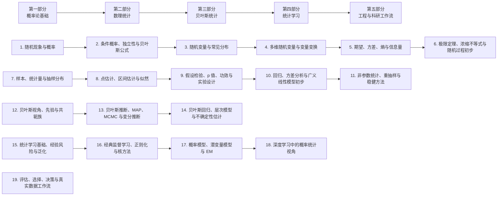

# 概率论, 数理统计, 贝叶斯统计与统计学习教程总纲

> 这份文件不是正式章节正文, 而是整套概率, 统计, 贝叶斯与统计学习教程的施工蓝图, 也是后续扩写时的统一路线图.
> 它主要解决五个问题:
>
> 1. 概率论, 数理统计, 贝叶斯统计, 统计学习分别在研究什么
> 2. 这几块知识之间是什么关系
> 3. 整套教程按什么顺序推进
> 4. 每一章的定位、主线和重点是什么
> 5. 后续逐章扩写、配图、补例题时, 正文结构该如何统一

后续章节建议保持下面这种写法:

- 先讲问题, 再讲定义
- 先讲直觉, 再讲公式
- 先讲主线, 再讲技术细节
- 先讲适用条件, 再讲计算套路
- 每章末尾补上实战清单、易错点和总结

---

## 0. 整套教程的总定位

### 0.1 四块内容分别在研究什么

- 概率论: 研究随机现象本身的规律, 重点是怎样描述不确定性
- 数理统计: 研究怎样从有限样本推断总体规律
- 贝叶斯统计: 研究怎样把先验认知和新数据整合成后验判断
- 统计学习: 研究怎样从数据中学出可泛化的模型, 用于预测、分类、生成和决策

一句话理解它们的关系:

> 概率论提供语言,
> 数理统计提供推断框架,
> 贝叶斯提供一条核心方法路线,
> 统计学习把这些工具进一步推向建模、泛化和工程应用.

### 0.2 这套教程和其他数学模块的关系

这套教程和现有数学模块天然衔接:

- 和高等数学的关系: 密度积分、极限定理、优化目标都依赖微积分
- 和线性代数的关系: 协方差矩阵、回归、PCA、高斯分布、最小二乘都依赖线性代数
- 和优化的关系: 极大似然、MAP、正则化、梯度下降都离不开优化方法
- 和机器学习的关系: 损失函数、泛化、概率模型、不确定性估计都建立在这套语言上

### 0.3 适合的读者

这套教程希望同时服务四类读者:

1. 想系统学概率统计的基础读者
2. 想把概率统计接到机器学习上的工程读者
3. 想看懂论文中概率模型和统计检验的研究读者
4. 想把数学定义、直觉和应用放在一条线上的长期学习者

### 0.4 前置知识建议

建议至少具备下面这些基础:

- 微积分: 极限、导数、积分
- 线性代数: 向量、矩阵、特征分解、最小二乘
- Python 基础: 能看懂简单模拟实验

如果前置不够扎实, 后续会在章节里补轻量回顾, 但不替代系统前置课.

### 0.5 整套教程的总路线

如果把这套内容看成一条从随机性走向数据推断, 再走向学习与决策的主线, 它大致会这样展开:

一句话概括整套书的推进逻辑:

> 先建立描述随机现象的概率语言,
> 再研究怎样从样本推总体,
> 接着把贝叶斯更新和统计学习纳入统一框架,
> 最后把这些思想落到真实数据、机器学习和工程决策里.

### 0.6 三条阅读路线

如果读者目标不同, 可以走不同路线:

1. 理论主线:
   概率论基础 -> 数理统计 -> 贝叶斯 -> 学习理论与概率模型
2. 机器学习主线:
   条件概率 -> 常见分布 -> 期望方差 -> 似然估计 -> 泛化 -> 概率模型 -> 深度学习统计视角
3. 数据分析主线:
   概率基础 -> 抽样分布 -> 区间估计 -> 假设检验 -> 回归 -> 重抽样 -> 评估与决策

---

## 第一部分: 概率论基础

## 1. 第一章: 随机现象与概率

### 1.1 这一章要解决什么

概率论的起点不是公式, 而是问题:

> 面对结果不确定, 但又不是完全无规律的现象时, 我们怎样严谨地描述可能性?

这一章负责把样本空间、事件、概率这套最基础的语言系统建起来.

### 1.2 建议的内容结构

1. 随机现象与确定现象
2. 样本空间与随机事件
3. 事件的并、交、补与差
4. 频率视角下的概率直觉
5. 概率的公理化定义
6. 古典概型
7. 几何概型
8. 概率加法公式
9. 事件空间的结构直觉
10. 实战清单与易错点

### 1.3 这一章的核心主线

> 概率不是拍脑袋给一个数,
> 而是在样本空间和事件关系明确以后,
> 用一套满足一致性的规则去刻画不确定性.

### 1.4 写作重点

- 样本空间一定要先定义清楚, 再谈概率
- 频率直觉和公理体系都要出现, 但要说清它们不是同一层
- 例子要覆盖离散场景和连续场景

### 1.5 建议配图

- 样本空间与事件的维恩图
- 古典概型树状图
- 几何概型面积图
- 频率稳定过程图

### 1.6 典型易错点

- 样本空间定义不全
- 把事件和样本点混成一层
- 概率加法公式乱用到不互斥事件

---

## 2. 第二章: 条件概率、独立性与贝叶斯公式

### 2.1 这一章要解决什么

只知道概率还不够, 我们还会问:

> 当额外信息出现以后, 概率怎样更新? 两个事件之间到底有没有关系?

这一章是概率论走向统计推断和贝叶斯思想的入口.

### 2.2 建议的内容结构

1. 条件概率的定义
2. 乘法公式
3. 全概率公式
4. 贝叶斯公式
5. 事件独立性
6. 两两独立与相互独立
7. 条件独立性
8. 诊断、筛查与分类案例
9. 从条件概率走向后验更新
10. 实战清单与易错点

### 2.3 这一章的核心主线

> 条件概率解决的是信息更新,
> 独立性解决的是事件关系,
> 贝叶斯公式则把这两者连接成一套从证据反推原因的机制.

### 2.4 写作重点

- 条件概率要从信息变化而不是分式记忆法切入
- 独立和互斥必须反复区分
- 贝叶斯公式要通过现实例子建立直觉, 例如医学检测、垃圾邮件分类、目标识别

### 2.5 建议配图

- 条件概率区域比例图
- 贝叶斯更新流程图
- 独立与不独立事件对比图
- 条件独立结构示意图

### 2.6 典型易错点

- 条件概率分母写错
- 把互斥误认为独立
- 只会套贝叶斯公式, 不理解先验、似然、后验分别在说什么

---

## 3. 第三章: 随机变量与常见分布

### 3.1 这一章要解决什么

事件回答的是发生与否, 但很多问题更关心数值结果:

> 如果实验结果是一个数, 我们怎样描述它的分布规律?

这一章引入随机变量和分布函数, 建立后续全部模型的基础对象.

### 3.2 建议的内容结构

1. 随机变量的定义
2. 离散型与连续型随机变量
3. 分布函数
4. 概率质量函数
5. 概率密度函数
6. Bernoulli 与 Binomial 分布
7. Poisson 分布
8. Geometric 与 Negative Binomial 分布
9. Uniform 分布
10. Exponential 分布
11. Gamma 与 Beta 分布初步
12. Normal 分布
13. 常见分布之间的联系与近似
14. 实战清单与易错点

### 3.3 这一章的核心主线

> 随机变量把随机结果映射成数值,
> 分布则描述这些数值以怎样的方式出现,
> 常见分布则是现实问题里反复出现的概率模板.

### 3.4 写作重点

- 随机变量首先是映射, 然后才是一个带分布的数值对象
- 分布函数、质量函数、密度函数三者要在一个例子里对齐
- 常见分布不能只背公式, 要说清出现背景

### 3.5 建议配图

- 离散分布柱状图
- 连续分布密度曲线图
- Poisson 与 Binomial 近似对比图
- 标准正态分布与参数变化图

### 3.6 典型易错点

- 把密度值当成概率
- 忘记分布函数是累积概率
- 不知道不同分布各自适合描述什么随机现象

---

## 4. 第四章: 多维随机变量、条件结构与变量变换

### 4.1 这一章要解决什么

现实问题里通常不只有一个随机量:

> 多个随机变量会怎样一起变化? 它们的依赖关系怎样表示? 经过函数变换后分布会怎样改变?

这一章是从单变量概率走向概率模型的关键桥梁.

### 4.2 建议的内容结构

1. 二维随机变量的引入
2. 联合分布函数
3. 联合质量函数与联合密度函数
4. 边缘分布
5. 条件分布
6. 随机变量独立性
7. 协方差与相关系数引入
8. 和、差、最大值、最小值的分布
9. 变量函数的分布
10. Jacobian 方法初步
11. 多元正态分布初步
12. 实战清单与易错点

### 4.3 这一章的核心主线

> 多维概率研究的不只是各自怎么分布,
> 更重要的是它们如何共同变化,
> 而变量变换让复杂随机结构变得可分析、可计算.

### 4.4 写作重点

- 联合、边缘、条件这三层关系要始终放在同一张图里解释
- 独立性要从联合分布可分解来讲
- Jacobian 不要一上来堆形式, 先从一维单调变换和简单二维案例讲起

### 4.5 建议配图

- 联合分布表格热力图
- 边缘化投影图
- 条件分布切片图
- 二维正态等高线图

### 4.6 典型易错点

- 把不相关误认为独立
- 边缘分布的积分或求和范围写错
- 变量替换时漏掉尺度因子

---

## 5. 第五章: 期望、方差、熵与信息量

### 5.1 这一章要解决什么

知道完整分布以后, 我们还会问:

> 能不能用少量数字概括一个分布的中心、波动、不确定性和信息量?

这一章会把概率论的数字特征和信息论语言连起来.

### 5.2 建议的内容结构

1. 数学期望
2. 期望的性质
3. 方差与标准差
4. 协方差矩阵
5. 矩与中心矩
6. 偏度与峰度
7. 熵
8. 交叉熵
9. KL 散度
10. 互信息
11. 常见分布的数字特征比较
12. 实战清单与易错点

### 5.3 这一章的核心主线

> 期望和方差刻画的是平均行为与波动规模,
> 熵和 KL 描述的是不确定性与分布差异,
> 这两组量一起构成现代统计学习的重要坐标系.

### 5.4 写作重点

- 期望要从加权平均讲起, 不要直接上符号
- 协方差矩阵要和线性代数中的二次型、主轴方向联系起来
- 熵、交叉熵、KL 要明确区分, 尤其要解释它们在机器学习损失函数里的位置

### 5.5 建议配图

- 相同期望不同方差的分布图
- 协方差对应椭圆主轴图
- 熵大小对比分布图
- 交叉熵与 KL 的关系示意图

### 5.6 典型易错点

- 把期望当成一定会出现的值
- 只会算方差, 不理解它描述的是波动
- 把交叉熵和 KL 当成完全一样的量

---

## 6. 第六章: 极限定理、浓缩不等式与随机过程初步

### 6.1 这一章要解决什么

概率论真正能解释现实, 靠的是整体规律:

> 为什么大量重复以后会稳定? 为什么很多总和近似正态? 为什么随机波动经常能被界住?

这一章把概率从单次试验拉到大样本和过程视角.

### 6.2 建议的内容结构

1. 频率稳定现象的观察
2. 依概率收敛与几乎处处收敛直觉
3. 大数定律
4. 中心极限定理
5. 标准化思想
6. Markov 不等式
7. Chebyshev 不等式
8. Hoeffding 不等式初步
9. 浓缩现象与样本复杂度直觉
10. 随机过程的最小入口
11. Bernoulli 过程、Poisson 过程、Markov 链初步
12. 实战清单与易错点

### 6.3 这一章的核心主线

> 单次随机现象是跳动的,
> 但整体规律是稳定的,
> 极限定理和浓缩不等式正是在回答这种从局部波动到整体稳定的过渡.

### 6.4 写作重点

- 大数定律和中心极限定理一定要明确区分
- 浓缩不等式要从为什么需要概率界来讲
- 随机过程只做入门, 重点放在为后面的时间序列、马尔可夫模型、强化学习打地基

### 6.5 建议配图

- 样本均值收敛曲线图
- 标准化后逼近正态的直方图
- 浓缩界随样本量变化图
- 简单 Markov 链状态转移图

### 6.6 典型易错点

- 把大数定律理解成每次都接近期望
- 把中心极限定理理解成原始样本本身一定正态
- 不清楚不同收敛概念的语义差别

---

## 第二部分: 数理统计

## 7. 第七章: 总体、样本、统计量与抽样分布

### 7.1 这一章要解决什么

从这一章开始, 教程重心从概率论转向数理统计:

> 我们并不知道总体全貌, 只能看到一份有限样本. 那怎样从样本中构造有用信息?

### 7.2 建议的内容结构

1. 总体与样本
2. 简单随机抽样
3. 经验分布函数
4. 样本均值
5. 样本方差
6. 顺序统计量初步
7. 统计量与估计量
8. 抽样分布的概念
9. Chi-square 分布
10. t 分布
11. F 分布
12. 正态总体下常见统计量分布
13. 实战清单与易错点

### 7.3 这一章的核心主线

> 样本本身是随机的,
> 所以样本均值、样本方差和其他统计量也都是随机变量,
> 统计推断的可靠性正建立在这些统计量的分布可以分析这一点上.

### 7.4 写作重点

- 总体参数和样本统计量必须反复区分
- 抽样分布要和原始样本分布明确区分
- t、F、Chi-square 不能只当符号表, 要说清它们各自从哪里来

### 7.5 建议配图

- 总体到样本的抽样流程图
- 重复抽样下样本均值分布图
- t、F、Chi-square 分布形状对比图
- 经验分布函数阶梯图

### 7.6 典型易错点

- 把样本分布和抽样分布混为一谈
- 不理解自由度的来源
- 忘记某些分布结论依赖正态总体假设

---

## 8. 第八章: 点估计、区间估计与似然方法

### 8.1 这一章要解决什么

拿到样本以后, 最直接的问题是:

> 总体参数大概是多少? 我们如何构造尽量可靠的估计?

这一章是从样本走向推断的第一步, 也是统计和机器学习共享的核心一章.

### 8.2 建议的内容结构

1. 点估计的基本思想
2. 无偏性、一致性、有效性
3. 矩估计法
4. 极大似然估计
5. 似然函数与对数似然
6. Fisher 信息初步
7. 区间估计的基本思想
8. 置信区间
9. 单总体均值和方差的区间估计
10. 两总体参数比较初步
11. 样本量与区间宽度
12. MAP 估计作为过渡
13. 实战清单与易错点

### 8.3 这一章的核心主线

> 估计不是随口报一个数,
> 而是在样本随机性的背景下,
> 设计一个在重复抽样中尽量稳定、尽量高效的规则.

### 8.4 写作重点

- 似然函数要从哪组参数更支持当前数据来解释
- 极大似然和最小损失之间的联系要提前埋下伏笔
- 置信区间一定要澄清其频率学含义, 避免口语误解

### 8.5 建议配图

- 似然函数曲线图
- 多次重复抽样下置信区间覆盖图
- 样本量与区间长度关系图
- 不同估计量的波动对比图

### 8.6 典型易错点

- 把无偏误解成最优
- 把置信区间讲成参数落区间的概率
- 只会机械求导, 不会写似然函数或看约束条件

---

## 9. 第九章: 假设检验、p 值、功效与实验设计

### 9.1 这一章要解决什么

统计推断不只是在估一个数, 很多时候是在做判断:

> 眼前的数据是否足够反对某个说法? 我们怎样控制误判风险? 实验应该如何设计才更有信息量?

### 9.2 建议的内容结构

1. 假设检验的基本框架
2. 原假设与备择假设
3. 拒绝域与检验统计量
4. 第一类错误与第二类错误
5. 显著性水平
6. p 值
7. 检验功效
8. 单侧检验与双侧检验
9. 单总体和两总体均值检验
10. 比例检验初步
11. Chi-square 拟合优度与独立性检验
12. 多重比较初步
13. A/B 测试与实验设计直觉
14. 实战清单与易错点

### 9.3 这一章的核心主线

> 假设检验不是证明一个结论绝对为真,
> 而是在控制错误概率的前提下,
> 判断样本证据是否足够支持或反对某个基准陈述.

### 9.4 写作重点

- p 值、显著性水平、功效三者关系必须讲清
- 假设检验的结论语言要规范, 避免口语化误导
- 要从实验设计角度提醒读者, 统计方法不能弥补坏数据

### 9.5 建议配图

- 拒绝域图
- 第一类错误与第二类错误区域图
- p 值尾部阴影图
- A/B 测试流程图

### 9.6 典型易错点

- 把 p 值当成原假设为真的概率
- 把不拒绝原假设说成原假设成立
- 只看显著性, 不看效应大小和样本量

---

## 10. 第十章: 回归、方差分析与广义线性模型初步

### 10.1 这一章要解决什么

很多问题不只是比较一个均值, 而是要问:

> 多个变量之间有没有系统关系? 多组之间的差异来自哪里? 分类问题怎样纳入统计建模?

这一章是经典统计建模的主干.

### 10.2 建议的内容结构

1. 一元线性回归
2. 最小二乘法
3. 回归系数解释
4. 残差分析
5. 多元线性回归初步
6. 模型选择直觉
7. 方差分析的基本思想
8. 单因素方差分析
9. 多因素方差分析初步
10. Logistic 回归作为广义线性模型入口
11. 链接函数与指数族初步
12. 实战清单与易错点

### 10.3 这一章的核心主线

> 回归分析是在随机波动中寻找变量关系,
> 方差分析是在总波动中拆解来源,
> 广义线性模型则把这套思想推广到更广的响应变量类型.

### 10.4 写作重点

- 回归既要讲预测, 也要讲解释
- 残差分析不能省, 因为模型假设是否站得住脚就藏在残差里
- Logistic 回归最好和分类、似然、交叉熵放在一起讲

### 10.5 建议配图

- 散点图与拟合直线
- 残差图
- 方差分解示意图
- Logistic 曲线图

### 10.6 典型易错点

- 把相关性说成因果性
- 只看拟合优度, 不看残差结构
- 不知道线性回归和 Logistic 回归在响应变量上有什么本质差别

---

## 11. 第十一章: 非参数统计、重抽样与稳健方法

### 11.1 这一章要解决什么

现实数据未必满足漂亮的参数假设:

> 当正态性、线性性或独立同分布不那么可靠时, 我们还有哪些更稳健的方法?

这一章补上经典参数统计之外的重要工具箱.

### 11.2 建议的内容结构

1. 参数方法与非参数方法对比
2. 秩和思想
3. 符号检验
4. Wilcoxon 检验初步
5. Kolmogorov-Smirnov 检验初步
6. Bootstrap
7. Jackknife 初步
8. 置换检验
9. 稳健位置与尺度估计
10. 异常值与厚尾数据处理直觉
11. 实战清单与易错点

### 11.3 这一章的核心主线

> 非参数和稳健方法不是放弃统计建模,
> 而是在模型假设不够可靠时,
> 用更少的结构假设换取更稳妥的推断.

### 11.4 写作重点

- 要解释为什么需要这些方法, 不要把它们写成零碎技巧
- Bootstrap 最好通过重复重采样图形来建立直觉
- 要提醒读者, 非参数方法不是完全没有假设

### 11.5 建议配图

- Bootstrap 重采样流程图
- 参数法与秩检验结果对比图
- 异常值对均值和中位数影响图
- 厚尾分布示意图

### 11.6 典型易错点

- 以为非参数方法不需要样本条件
- 不知道 Bootstrap 也会受样本代表性限制
- 遇到异常值时只会删数据, 不会分析原因

---

## 第三部分: 贝叶斯统计

## 12. 第十二章: 贝叶斯视角、先验、后验与共轭族

### 12.1 这一章要解决什么

频率派统计把参数看成固定未知量, 但还可以换一种视角:

> 如果参数本身也带着不确定性, 我们能不能用概率分布来表达这种认知, 再用数据去更新它?

这一章正式进入贝叶斯统计.

### 12.2 建议的内容结构

1. 贝叶斯视角与频率学视角对比
2. 参数为什么可以被视作随机变量
3. 先验、似然、后验
4. 后验预测分布
5. 共轭先验的意义
6. Beta-Binomial
7. Gamma-Poisson
8. Normal-Normal
9. 先验选择的直觉
10. 主观先验与客观先验初步
11. 实战清单与易错点

### 12.3 这一章的核心主线

> 贝叶斯统计的核心不是某个单独公式,
> 而是把认知不确定性显式写进模型,
> 再让数据一步步更新它.

### 12.4 写作重点

- 要把贝叶斯讲成一种推断方式, 不是孤零零的贝叶斯公式
- 共轭先验要强调它是计算上优雅, 不是唯一合理选择
- 后验预测分布要尽早出现, 因为它和机器学习预测直接相关

### 12.5 建议配图

- 先验到后验更新图
- 不同先验对后验影响图
- 共轭更新流程图
- 后验预测分布示意图

### 12.6 典型易错点

- 把先验理解成主观乱猜
- 只会写后验比例式, 不理解预测时到底在积什么
- 把贝叶斯公式和贝叶斯统计当成同一层东西

---

## 13. 第十三章: 贝叶斯推断、MAP、MCMC 与变分推断

### 13.1 这一章要解决什么

一旦后验分布变复杂, 问题就来了:

> 后验算不出来怎么办? 只能求一个点吗? 能不能近似整条分布?

这一章负责把贝叶斯统计从纸面公式推进到可计算的推断方法.

### 13.2 建议的内容结构

1. 后验推断的计算困难
2. MAP 估计
3. MAP 与 MLE 的关系
4. 网格法与简单数值积分
5. Monte Carlo 思想
6. MCMC 的基本直觉
7. Metropolis-Hastings 初步
8. Gibbs Sampling 初步
9. Variational Inference 初步
10. ELBO 直觉
11. 何时要点估计, 何时要分布估计
12. 实战清单与易错点

### 13.3 这一章的核心主线

> 贝叶斯推断的难点通常不在建模, 而在计算,
> MAP、MCMC 和变分推断分别代表了不同层次的近似路线:
> 求点、采样和优化分布近似.

### 13.4 写作重点

- MAP 要和正则化联系起来讲
- MCMC 要从采样整体后验的目标出发, 不要直接陷入算法细节
- VI 要重点讲近似思想, 不求一次性讲完全部理论

### 13.5 建议配图

- MLE 与 MAP 对比图
- MCMC 采样轨迹图
- 目标后验与近似分布图
- ELBO 几何示意图

### 13.6 典型易错点

- 把 MAP 当成完整贝叶斯推断
- 以为采样结果多就一定靠谱, 忽略混合和收敛
- 把变分推断理解成只是一个求积分小技巧

---

## 14. 第十四章: 贝叶斯回归、层次模型与不确定性估计

### 14.1 这一章要解决什么

贝叶斯方法真正有力量的地方在于:

> 它不仅能给一个预测, 还能告诉你这个预测到底有多不确定.

这一章把贝叶斯思想落到建模和预测上.

### 14.2 建议的内容结构

1. 贝叶斯线性回归
2. 后验均值与后验方差
3. 预测区间
4. 模型不确定性与观测噪声
5. 层次模型初步
6. 部分池化直觉
7. 贝叶斯分类初步
8. 高斯过程回归入口
9. 贝叶斯神经网络直觉
10. 校准与不确定性估计
11. 实战清单与易错点

### 14.3 这一章的核心主线

> 贝叶斯建模的独特价值在于,
> 它不只是输出一个最优参数,
> 而是把参数不确定性、预测不确定性和层次结构都纳入同一框架.

### 14.4 写作重点

- 要把参数不确定性和数据噪声区分开
- 层次模型一定要从共享信息和部分池化的现实动机讲
- 高斯过程和贝叶斯神经网络可以只做入口, 重点让读者知道它们在解决什么问题

### 14.5 建议配图

- 贝叶斯回归置信带图
- 层次模型结构图
- 校准曲线图
- 参数不确定性与观测噪声分解图

### 14.6 典型易错点

- 把预测均值当成全部结果
- 不区分 epistemic uncertainty 和 aleatoric uncertainty
- 以为层次模型只是换了更复杂的先验写法

---

## 第四部分: 统计学习

## 15. 第十五章: 统计学习基础、经验风险与泛化

### 15.1 这一章要解决什么

统计学习关心的不是只把训练集拟合好, 而是:

> 怎样从有限数据里学出一个在新样本上也表现不错的模型?

这一章是统计学习的总入口.

### 15.2 建议的内容结构

1. 监督学习、无监督学习、半监督学习、自监督学习的区别
2. 输入、输出、假设空间
3. 经验风险与期望风险
4. 训练误差与测试误差
5. 过拟合与欠拟合
6. 偏差-方差权衡
7. 正则化的基本思想
8. 训练集、验证集、测试集
9. 泛化误差直觉
10. 模型复杂度与样本复杂度
11. 学习曲线
12. 实战清单与易错点

### 15.3 这一章的核心主线

> 统计学习的中心问题不是有没有把现有数据记住,
> 而是学出来的规律能不能推广到未来数据,
> 泛化因此比单次拟合更重要.

### 15.4 写作重点

- 经验风险最小化要和统计估计联系起来讲
- 偏差-方差权衡最好通过可视化示例讲透
- 泛化讨论要尽量避免一开始就掉进过重的学习理论符号

### 15.5 建议配图

- 训练误差与测试误差曲线
- 偏差-方差示意图
- 学习曲线
- 模型复杂度与泛化风险图

### 15.6 典型易错点

- 把训练集分数高当成模型好
- 只谈优化收敛, 不谈泛化
- 不清楚验证集和测试集的角色差别

---

## 16. 第十六章: 经典监督学习、正则化与核方法

### 16.1 这一章要解决什么

统计学习不能只停在原则层面, 还要落到典型模型:

> 不同监督学习模型在表达能力、可解释性、计算代价和泛化行为上有什么差别?

### 16.2 建议的内容结构

1. 线性回归回顾
2. Logistic 回归回顾
3. Ridge 与 Lasso
4. 感知机与线性分类直觉
5. 支持向量机
6. 核技巧
7. 决策树
8. Bagging 与 Random Forest 初步
9. Boosting 初步
10. 特征工程与特征缩放
11. 模型可解释性初步
12. 实战清单与易错点

### 16.3 这一章的核心主线

> 经典监督学习方法的差别不只是模型名字不同,
> 更体现在假设空间、正则化方式、损失函数和决策边界的不同.

### 16.4 写作重点

- 正则化要和 MAP、先验、模型复杂度控制联系起来
- SVM 要强调间隔最大化的几何意义
- 树模型和线性模型要做风格对比, 让读者知道它们各自擅长什么

### 16.5 建议配图

- Ridge 与 Lasso 约束几何图
- SVM 间隔图
- 决策树切分示意图
- 不同模型决策边界对比图

### 16.6 典型易错点

- 只记模型名字, 不理解损失和正则化的角色
- 不知道 L1 和 L2 惩罚会带来什么差异
- 误以为更复杂的模型必然更强

---

## 17. 第十七章: 概率模型、潜变量模型与 EM

### 17.1 这一章要解决什么

有一大类学习方法不是直接学决策边界, 而是在问:

> 数据是怎么生成出来的? 能不能通过一个概率模型把隐藏结构也写进去?

这一章连接统计学习和概率建模.

### 17.2 建议的内容结构

1. 生成式模型与判别式模型
2. 朴素贝叶斯
3. 高斯判别分析初步
4. 密度估计
5. 混合模型
6. 高斯混合模型
7. 潜变量思想
8. EM 算法
9. 隐马尔可夫模型初步
10. 图模型初步
11. 表达能力、可解释性与计算代价比较
12. 实战清单与易错点

### 17.3 这一章的核心主线

> 概率模型试图描述数据生成机制,
> 潜变量模型进一步把看不见的结构也纳入其中,
> EM 则是在不完全观测下做估计的一条经典路线.

### 17.4 写作重点

- 生成式和判别式一定要放在同一任务里比较
- EM 要强调是交替优化思想, 不要只写公式推导
- HMM 和图模型只做入口, 为后续高级专题留门

### 17.5 建议配图

- 生成式与判别式流程图
- GMM 混合密度图
- EM 迭代示意图
- HMM 状态转移图

### 17.6 典型易错点

- 把生成式理解成只能做生成, 不能做分类
- EM 只会背 E 步和 M 步, 不知道它到底在优化什么
- 忽略潜变量带来的不可辨识性问题

---

## 18. 第十八章: 深度学习中的概率统计视角

### 18.1 这一章要解决什么

深度学习常被当成工程黑箱, 但它背后其实处处是概率统计:

> 损失函数为什么这么写? 初始化和噪声为什么重要? 不确定性、校准和生成模型如何理解?

这一章把前面的数学语言真正接到现代机器学习.

### 18.2 建议的内容结构

1. MSE、MAE 与噪声假设
2. BCE、Cross Entropy 与分类似然
3. Softmax 的概率解释
4. 正则化、Dropout 与先验直觉
5. Batch Normalization 与统计量
6. SGD 噪声与泛化直觉
7. 校准与置信度
8. 不确定性估计
9. VAE 中的概率建模与 ELBO
10. Diffusion 模型的噪声视角初步
11. 表示学习与互信息直觉
12. 实战清单与易错点

### 18.3 这一章的核心主线

> 深度学习不是在概率统计之外另起炉灶,
> 相反, 很多训练目标、正则化方式、生成模型和不确定性问题,
> 都可以回到前面讲过的似然、后验、熵、KL 和泛化语言里理解.

### 18.4 写作重点

- 各类损失函数一定要和概率假设对应起来
- VAE 与 Diffusion 只做统计视角入口, 重点说明它们和概率建模的关系
- 要提醒读者, 高置信度不等于高可靠性

### 18.5 建议配图

- 常见损失对应的概率假设对照图
- 置信度与校准曲线图
- VAE 编码器-潜变量-解码器结构图
- Diffusion 去噪过程示意图

### 18.6 典型易错点

- 只把损失函数看成调参对象, 不理解统计含义
- 看到 Softmax 输出就以为是可靠概率
- 把生成模型的数学目标和采样效果混为一谈

---

## 第五部分: 工程与科研工作流

## 19. 第十九章: 评估、选择、决策与真实数据工作流

### 19.1 这一章要解决什么

学完模型和方法以后, 真正落地时还会遇到更现实的问题:

> 数据怎么来? 评估怎么做? 什么时候该看统计显著, 什么时候该看业务代价? 模型上线后又该怎样监控?

这一章负责把全书收束到真实工作流.

### 19.2 建议的内容结构

1. 数据采集与样本偏差
2. 训练集、验证集、测试集再回顾
3. Cross Validation
4. 评估指标选择
5. 阈值选择与成本敏感决策
6. 校准与风险分级
7. 模型比较与统计显著性
8. 线上实验与离线评估
9. 数据漂移与概念漂移
10. 因果意识初步
11. 可重复性与实验记录
12. 真实项目中的错误分析流程
13. 实战清单与易错点

### 19.3 这一章的核心主线

> 真正的数据工作不是把模型训练完就结束,
> 而是从数据采集、评估设计、模型选择、决策规则到上线监控形成闭环.

### 19.4 写作重点

- 要强调数据问题常常比模型问题更致命
- 评估指标一定要和任务目标、代价结构绑定
- 因果意识只做入门提醒, 重点是避免把相关结果直接当因果结论

### 19.5 建议配图

- 真实机器学习工作流总图
- 数据漂移示意图
- 指标与阈值关系图
- 错误分析闭环图

### 19.6 典型易错点

- 只看单一指标, 不看错误类型结构
- 把离线最优误当成线上最优
- 忽略样本偏差、标签噪声和分布漂移

---

## 20. 高级专题展望

如果后续要继续扩展, 建议把下面这些内容作为第二阶段专题:

1. 时间序列分析
2. 生存分析
3. 随机过程深入, 如鞅和布朗运动
4. 高维统计
5. 稀疏建模与压缩感知
6. 因果推断
7. 图学习与概率图模型深入
8. 强化学习中的概率与决策
9. 信息几何与优化几何
10. 统计物理视角下的机器学习

---

## 21. 附录建议

为了让整套教程更适合作为长期参考资料, 可以逐步补下面这些附录:

1. 常见分布速查表
2. 常用统计量与适用条件速查表
3. 假设检验流程速查表
4. MLE、MAP、VI、MCMC 关系图
5. 概率论、数理统计、贝叶斯、统计学习关系图
6. 常见机器学习损失函数与概率假设对照表
7. Python / NumPy / SciPy / PyTorch 最小演示脚本
8. 章节记号表与符号统一说明

---

## 22. 后续可优先扩写的顺序建议

如果准备正式开始写正文, 可以按不同目标走不同顺序.

### 22.1 理论优先路线

1. 第一章: 随机现象与概率
2. 第二章: 条件概率、独立性与贝叶斯公式
3. 第三章: 随机变量与常见分布
4. 第四章: 多维随机变量、条件结构与变量变换
5. 第五章: 期望、方差、熵与信息量
6. 第六章: 极限定理、浓缩不等式与随机过程初步
7. 第七章到第十一章: 数理统计主干
8. 第十二章到第十四章: 贝叶斯统计
9. 第十五章到第十九章: 统计学习与工作流

### 22.2 机器学习优先路线

1. 第二章: 条件概率、独立性与贝叶斯公式
2. 第三章: 随机变量与常见分布
3. 第四章: 多维随机变量、条件结构与变量变换
4. 第五章: 期望、方差、熵与信息量
5. 第八章: 点估计、区间估计与似然方法
6. 第十章: 回归、方差分析与广义线性模型初步
7. 第十五章: 统计学习基础、经验风险与泛化
8. 第十六章: 经典监督学习、正则化与核方法
9. 第十七章: 概率模型、潜变量模型与 EM
10. 第十八章: 深度学习中的概率统计视角

### 22.3 数据分析优先路线

1. 第一章到第五章: 概率基础
2. 第七章: 样本、统计量与抽样分布
3. 第八章: 点估计、区间估计与似然方法
4. 第九章: 假设检验、p 值、功效与实验设计
5. 第十章: 回归、方差分析与广义线性模型初步
6. 第十一章: 非参数统计、重抽样与稳健方法
7. 第十九章: 评估、选择、决策与真实数据工作流

---

## 23. 整体写作提醒

这套教程最容易写偏的地方有六个:

1. 只堆公式, 不讲为什么需要这个概念
2. 只做计算题, 不讲统计结论到底意味着什么
3. 只讲频率派, 不交代贝叶斯路线的意义
4. 只讲机器学习模型, 不回头解释它们的概率统计基础
5. 只讲模型训练, 不提醒数据来源、偏差、实验设计和评估
6. 只讲结果, 不讲适用条件、失败情形和误用风险

所以后续每一章都建议统一保留下面五个收尾模块:

1. 本章主线总结
2. 典型题型或实战问题清单
3. 典型误区
4. 和前后章节的连接点
5. 和机器学习 / 数据分析 / 科研实践的连接点

最后再强调一次这套教程的目标:

> 不是把概率、统计、贝叶斯、学习论拆成四堆互不相干的术语,
> 而是让读者看到它们其实是在回答同一类问题:
> 随机性如何描述, 数据如何推断, 模型如何学习, 决策如何在不确定性下进行.
